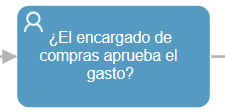
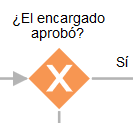
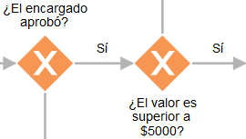
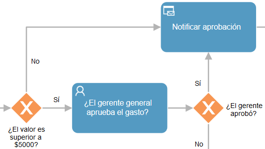

    Introducción a Qflow — Qflow Cloud          

*   [Qflow](https://qflowbpm.com/es/)
*   [Foro](https://forum.qflowbpm.com/)
*   [Centro de Ayuda](https://qflowbpm.com/es/centro-de-ayuda/)
*   [Contáctanos](https://qflowbpm.com/es/contacto/)

[Qflow](index.md)

Cloud (latest) 5.5 OnPremise (latest) 5.2 OnPremise 5.1.1 OnPremise

English Español

selectElement('versionSelect', getVersion()); selectElement('languageSelect', getLanguage()); function selectElement(id, valueToSelect) { let element = document.getElementById(id); element.value = valueToSelect; } function getLanguage() { if (window.location.href.includes('/es/')) { return '/es/'; } else { return '/en/'; } } function getVersion() { if (window.location.href.includes('/qflowcloud/')) { return '/qflowcloud/'; } else if (window.location.href.includes('/qflow5\_1\_1/')) { return '/qflow5\_1\_1/'; } else if (window.location.href.includes('/qflow5\_2/')) { return '/qflow5\_2/'; } else { return '/qflow5\_5/'; } } function redirectToSite(url) { var http = new XMLHttpRequest(); http.onreadystatechange = function() { if (http.readyState === 4) { if (http.status !== 404) { window.location.href = url; } else { window.location.href = url.replace(url.substr(url.lastIndexOf('/') + 1), 'index.md'); } } } http.open('HEAD', url, true); http.send(); }

  

Inicio

*   [Novedades](29-ReleaseNote.md)
*   [Introducción a Qflow](#)
    *   [Introducción](#introduccion)
    *   [Organización de este manual](#organizacion-de-este-manual)
    *   [Qué es Qflow y para qué sirve](#que-es-qflow-y-para-que-sirve)
        *   [Ejemplo: proceso de autorización de gastos](#ejemplo-proceso-de-autorizacion-de-gastos)
    *   [Qflow y la organización](#qflow-y-la-organizacion)
        *   [Representación de un proceso de negocios en Qflow](#representacion-de-un-proceso-de-negocios-en-qflow)
    *   [Componentes de Qflow](#componentes-de-qflow)
    *   [Guía de la documentación de Qflow](#guia-de-la-documentacion-de-qflow)
        *   [Listado de manuales](#listado-de-manuales)
*   [Tutoriales](TutorialsIndex.md)
*   [Qflow Task](04-QflowTask.md)
*   [Qflow Design](15-QflowDesign.md)
*   [Qflow Team](18-QflowTeam.md)
*   [Qflow Admin](19-QflowAdmin.md)
*   [Consumo de Q-points](21-Q-pointsConsumption.md)
*   [Conectores](34-ConnectorsIndex.md)
*   [Desarrolladores](31-Development.md)

[Qflow](index.md)

*   
*   Introducción a Qflow

- - -

# Introducción a Qflow[](#introduccion-a-qflow "Link to this heading")

## Introducción[](#introduccion "Link to this heading")

El propósito de este manual es facilitar al lector la familiarización con Qflow. Para ello, se propone:

*   Explicar brevemente qué es Qflow y para qué sirve.
    
*   Describir sus componentes más importantes y cómo se relacionan con la organización y con los usuarios del producto.
    
*   Describir los conceptos básicos que permitan comprender más fácilmente el resto de la documentación.
    
*   Describir brevemente cada uno de los manuales que componen la documentación, para que quienes necesiten consultarla sepan a qué manual recurrir para resolver un problema concreto.
    

Este manual está dirigido a personas que pertenezcan a uno de los siguientes conjuntos:

*   Personas que no conocen Qflow y quieren saber qué es y para qué sirve.
    
*   Personas que están considerando la posibilidad de adoptar Qflow en sus organizaciones.
    
*   Personas que pertenecen a una organización que utiliza Qflow, pero no están familiarizados con él.
    

No son necesarios conocimientos técnicos para comprender este manual.

De una persona que haya leído este documento se espera que:

*   Tenga una idea lo suficientemente exacta de qué es Qflow y sepa si le puede ayudar a resolver algún problema o a mejorar algún aspecto de su organización.
    
*   Comprenda el funcionamiento del producto, no desde el punto de vista técnico, sino desde el punto de vista del rol que cumple en una organización.
    
*   Sepa cuáles son los componentes más importantes de Qflow, para qué sirven y a qué tipos de usuario pueden resultarles útiles.
    
*   Sepa a qué manual recurrir si tiene alguna duda sobre el funcionamiento de alguna de las herramientas o componentes.
    

## Organización de este manual[](#organizacion-de-este-manual "Link to this heading")

Este manual está compuesto por las siguientes secciones:

*   [Qué es qflow y para qué sirve](#que-es-qflow-y-para-que-sirve): explica la razón de ser de Qflow.
    
*   [Qflow y la organización](#qflow-y-la-organizacion): explica cómo Qflow funciona en el contexto de una organización. Esta sección da ejemplos más concretos sobre su uso.
    
*   [Componentes de qflow](#componentes-de-qflow): describe los componentes de Qflow explicando el rol que cumple cada uno de ellos en la organización y las funciones de Qflow.
    
*   [Guía de la documentación de qflow](#guia-de-la-documentacion-de-qflow): contiene recomendaciones de lectura para quienes recién comienzan a familiarizarse con Qflow y presenta una lista de los manuales que componen la documentación, resumiendo brevemente cada uno de ellos.
    

## Qué es Qflow y para qué sirve[](#que-es-qflow-y-para-que-sirve "Link to this heading")

Qflow es una herramienta de **gestión de procesos de negocio**. Todas las organizaciones utilizan, implícita o explícitamente, procesos para llevar a cabo sus actividades. Un ejemplo de proceso muy sencillo es el que se utiliza en muchos comercios:

1.  El cliente ingresa al comercio.
    
2.  Un empleado lo atiende.
    
3.  El cliente decide comprar un producto.
    
4.  El empleado que lo atendió le indica que pase por caja para pagar por el producto.
    
5.  El empleado que atendió al cliente lleva el producto a un mostrador en el que se le entregará el producto adquirido al cliente.
    
6.  El cliente pasa por caja y paga el producto. En caja le dan un recibo.
    
7.  El cliente presenta el recibo en el mostrador, donde le entregan el producto que compró y la factura.
    

El proceso descrito es muy sencillo, y todas las actividades que lo componen son realizadas por seres humanos. Organizaciones más grandes y más complejas suelen tener procesos más complejos, que incluyen, además de actividades que son realizadas por seres humanos, actividades que son realizadas por herramientas informáticas. También suelen manejar más información e incluir actividades que, aunque son realizadas por personas, pueden ser aceleradas mediante el uso de herramientas informáticas. Qflow es una herramienta que permite ejecutar esos procesos de forma más eficiente mediante la automatización de algunas actividades y de algunos aspectos de las interacciones entre sus participantes.

Por ejemplo, si un proceso establece plazos para una tarea, Qflow puede controlar que se cumplan esos plazos mediante el envío de alertas y recordatorios. Si un proceso establece que en cierto momento se debe enviar notificaciones a determinadas personas, Qflow puede enviar esas notificaciones automáticamente. También puede interactuar con otras herramientas informáticas de la organización.

Un ejemplo ayudará al lector a entender más fácilmente el rol que cumple Qflow.

### Ejemplo: proceso de autorización de gastos[](#ejemplo-proceso-de-autorizacion-de-gastos "Link to this heading")

Existe una empresa en la que siempre que alguien quiere gastar una determinada cantidad de dinero, debe solicitar autorización. Si el gasto que la persona desea realizar es inferior a $5000, basta con pedirle autorización al encargado de compras. Si el gasto es superior a esa cantidad, se requiere, además, la autorización del gerente general.

Juan Pérez necesita hacer una compra. Para solicitar la autorización correspondiente, le envía un mensaje de correo electrónico al encargado de compras. Si éste rechaza el gasto, simplemente le contesta a Juan Pérez que no aprueba la solicitud. Si lo aprueba, debe decidir, según el valor del gasto, si debe solicitar la autorización del gerente general. Si el gasto solicitado es superior a $5000, le reenvía el mensaje de Juan Pérez al gerente general, quien contesta si aprueba el gasto o no y envía una copia de su respuesta al departamento de finanzas.

La ejecución de ese proceso sería más fluida y sencilla si la empresa contara con un sistema informático que la facilitara. Entonces, Juan Pérez, en lugar de tener que redactar un mensaje, podría llenar un formulario web con el valor que pretendiera gastar y el motivo del gasto. Una vez llenado el formulario web, el sistema le enviaría un mensaje de correo electrónico al encargado de compras.

La decisión de pedir autorización al gerente general podría ser tomada automáticamente, puesto que basta con una operación sencilla para determinar si su autorización es necesaria o no. Esto evitaría errores y molestias. El encargado de compras ya no tendría que recordar el valor a partir del cual es necesaria la autorización del gerente general. Y si la empresa tuviera que cambiar ese valor, sería más fácil. Bastaría con, por ejemplo, modificar un registro en una base de datos, y no habría necesidad de informar al encargado de compras y a los miembros del departamento de finanzas y asegurarse de que estuvieran enterados del cambio.

Ése es el tipo de cosas que hace Qflow, con la ventaja de que permite modelar con facilidad varios procesos distintos, y modificarlos fácilmente, mientras que un sistema informático hecho a medida para una empresa requiere mayores esfuerzos de mantenimiento y desarrollo. Qflow está diseñado de forma que cualquier proceso, por complejo que sea, puede ser modelado en él y ejecutado bajo su control sin necesidad de programación o, en el caso de procesos muy complejos o de procesos que utilicen otras herramientas informáticas, muy poca programación. Una herramienta a medida implementa unos pocos procesos, y si surgen procesos nuevos, estos deben ser desarrollados de cero por un equipo de desarrolladores, con todos los costos y riesgos propios del desarrollo de una herramienta de software.

El proceso descrito en este ejemplo es muy sencillo, puesto que es más fácil entender un ejemplo simple que uno demasiado complejo. Pero Qflow puede manejar procesos mucho más complejos para los cuales resultan más evidentes las ventajas de utilizarlo.

#### Facilidades para mejorar procesos[](#facilidades-para-mejorar-procesos "Link to this heading")

El solo hecho de contar con una herramienta que automatice algunos aspectos de la ejecución de procesos hace que surjan oportunidades para mejorar esos procesos. En el caso de nuestro ejemplo de proceso de aprobación de gastos, se podrían tomar medidas para disminuir la necesidad de intervención del gerente general. El hecho de que las condiciones para exigir aprobación del gerente general sean tan sencillas (que el valor sea superior a $5000) se debe en parte a que estas condiciones deben ser evaluadas por seres humanos y, por lo tanto, evaluarlas no puede ser una tarea demasiado tediosa.

Supongamos, por ejemplo, que el gerente está sobrecargado de trabajo, y que se desea reducir dramáticamente la cantidad de solicitudes de aprobación de compras que se le hacen. Una forma de hacer eso puede ser categorizar los gastos para identificar condiciones adicionales bajo las cuales no sea necesario pedirle autorización al gerente general. Por ejemplo, se sabe que hay gastos superiores a $5000 que siempre son aprobados por el gerente. Hay otro conjunto de gastos que siempre son aprobados por el gerente, siempre y cuando sean inferiores a $7500.

Supongamos que cuando se termina de hacer esa categorización, se tiene una tabla con quinientas categorías, cada una de las cuales está asociada a un valor a partir del cual se requiere autorización del gerente para realizar el gasto. No se les puede pedir a los empleados que sepan de memoria el contenido de esa tabla, aunque sí se puede poner una copia de la tabla en un lugar de fácil acceso para todos los empleados que la necesiten utilizar (por ejemplo, una página web a la que todos pueden acceder). En estas condiciones, puede que la empresa decida no darse el trabajo de categorizar los gastos para elaborar esa tabla, pues se piensa que los empleados no la utilizarán, se equivocarán a menudo u olvidarán cómo acceder a ella.

Pero si se puede poner la tabla en una base de datos y dejar que un sistema informático determine automáticamente si se le debe pedir autorización al gerente general o no, la empresa probablemente no dude en implementar la mejora. Entonces, los usuarios no tendrán que perder tiempo consultando la tabla cada vez que tengan que hacer un gasto, y la cantidad de pedidos innecesarios que reciba el gerente general debido a errores disminuirá.

El uso de herramientas de este tipo permite, también, mejorar el control de los procesos. En este caso, por ejemplo, puede suceder que el gerente general se olvide de contestar una solicitud de aprobación. Con una herramienta como Qflow, ese tipo de control puede ser realizado automáticamente. Se puede definir plazos de modo que Qflow envíe automáticamente alertas y recordatorios a quienes deban realizar una tarea para evitar que las tareas se atrasen.

Por tener fines didácticos, este ejemplo es muy sencillo, y es probable que no demuestre en su justa medida los beneficios que una empresa puede obtener de tener un sistema de gestión de procesos de negocio. Organizaciones medianas y grandes suelen tener procesos mucho más complejos que el del ejemplo, y en esos casos los beneficios de un sistema de gestión de procesos de negocio son más evidentes, sobre todo cuando ese sistema tiene herramientas que le permiten interactuar con las herramientas informáticas ya presentes en la organización, como es el caso de Qflow.

## Qflow y la organización[](#qflow-y-la-organizacion "Link to this heading")

Imagine que la empresa del ejemplo del apartado anterior decide utilizar Qflow. El gerente general decide que el primer proceso que se gestionará con Qflow es el proceso de aprobación de gastos del ejemplo. Lo primero, por supuesto, es crear un espacio de trabajo de Qflow en _https://client.qflowbpm.com_. Después, hay que representar el proceso de forma tal que pueda ser interpretado por Qflow, para que éste pueda controlar su ejecución.

### Representación de un proceso de negocios en Qflow[](#representacion-de-un-proceso-de-negocios-en-qflow "Link to this heading")

Qflow Design es la herramienta que nos permitirá diseñar los flujos de nuestro proceso de negocios. Podemos comenzar a partir de un diseño vacío, usar alguna de las plantillas de proceso precreadas de Qflow o usar el asistente de inteligencia artificial que, dada una descripción genera un diseño que podemos utilizar como punto de partida. El siguiente diagrama, representa el proceso del ejemplo.

Figura 102 Proceso de ejemplo[](#id2 "Link to this image")

A continuación, explicaremos cómo se debe interpretar el diagrama:

El primer paso, “**Solicitar autorización**”, indica el inicio del proceso. Todos los procesos tienen un **evento de inicio**, que se representa con un círculo.

El evento de inicio representa el punto de partida por el cual los usuarios pueden iniciar procesos. En caso de que se quiera permitir que personas externas a la organización inicien procesos, Qflow permite compartir un enlace con cualquier usuario para que pueda iniciar el proceso como un usuario invitado.

Figura 103 Evento de inicio[](#id3 "Link to this image")

Uno de los componentes es Qflow Task, un sitio que permite, entre otras cosas, iniciar la ejecución de los procesos definidos. En este caso, el empleado que desea solicitar aprobación para un gasto navegaría hasta Qflow Task y seleccionaría el proceso de aprobación de gastos de una lista de procesos que está autorizado a iniciar. Qflow le mostraría un formulario en el que el empleado podría ingresar los dos datos que son necesarios para ejecutar el proceso: el valor del gasto que se solicita y un breve comentario que especifique el motivo del gasto.

Si fuera el caso de tareas más simples, cuyas respuestas no requieran ingreso de datos adicionales, Qflow Task permite dar respuesta rápida desde una vista conjunta de las tareas pendientes del usuario, agilizando el avance de los procesos.

Una vez que el empleado ingresó los datos y envió el formulario, comienza la ejecución del proceso.

El segundo paso del proceso es preguntarle al encargado de compras si aprueba el gasto mediante una **tarea de usuario** (“**¿El encargado de compras aprueba el gasto?**”).

Figura 104 Tarea de usuario[](#id4 "Link to this image")

La ejecución de la tarea consiste en lo siguiente:

1.  Qflow le envía un mensaje de correo electrónico al encargado de compras.
    
2.  El mensaje de correo electrónico contiene un vínculo. Cuando el encargado de compras hace clic en ese vínculo, accede a un formulario de Qflow Task en el que puede contestar si aprueba o no el gasto.
    
3.  El encargado de compras llena el formulario, indicando si aprueba el gasto.
    

Una vez que el encargado de compras contestó si aprueba el gasto o no, se ejecuta la **compuerta exclusiva** “**¿El encargado aprobó?**”, que tiene forma de rombo.

Figura 105 Compuerta exclusiva[](#id5 "Link to this image")

Una compuerta exclusiva evalúa si se cumple o no una condición para cada camino posible del proceso. Si la condición se cumple para una de sus salidas el proceso toma ese camino (y solo ese). En este caso, lo que se evalúa es la respuesta del encargado de compras. Si el encargado de compras rechazó la solicitud, Qflow ejecuta la **tarea de notificación** “**Notificar rechazo**”, que le envía un mensaje de correo electrónico al solicitante para informarle que su solicitud fue rechazada.

Figura 106 Encargado rechaza solicitud[](#id6 "Link to this image")

Si, por el contrario, el encargado de compras aprobó la solicitud, Qflow ejecuta otra evaluación: **¿El valor es superior a $5000?**

Figura 107 Encargado aprueba solicitud[](#id7 "Link to this image")

La compuerta “**¿El valor es superior a $5000?**” hace otra evaluación: si el gasto solicitado es superior a $5000, se le debe pedir autorización al gerente general. De lo contrario, la solicitud es aprobada directamente y se ejecuta la tarea “**Notificar aprobación**”, que le envía un mensaje de correo electrónico al solicitante para notificarle de que su solicitud fue aprobada. También le envía un mensaje al departamento de finanzas, para que sus miembros estén enterados de la autorización.

Figura 108 Notificación de aprobación[](#id8 "Link to this image")

En el caso en que la aprobación del gerente general es necesaria, Qflow ejecuta la tarea “**¿El gerente general aprueba el gasto?**”, que le envía un mensaje de correo electrónico. El gerente general accede al formulario de respuesta de la misma forma que lo hizo el encargado de compras cuando se ejecutó el paso que pedía su autorización: mediante un vínculo en su correo electrónico. Una vez que el gerente general respondió a la solicitud, se ejecuta otra compuerta exclusiva (“**¿El gerente aprobó?**”).

Si el gerente general aprueba el gasto, se notifica al solicitante y el proceso termina en un **evento de fin** que señala que el proceso terminó con una aprobación. Si el gerente general rechaza el gasto, también se notifica al solicitante y el proceso termina en un evento que señala que la solicitud fue rechazada.

## Componentes de Qflow[](#componentes-de-qflow "Link to this heading")

El ejemplo sencillo presentado en el apartado anterior permite identificar algunos de los componentes de Qflow:

*   **Qflow Design:** es un sitio web en el cual se diseñan los diagramas de proceso en notación BPMN. En él se especifica el comportamiento de los procesos que deben ser ejecutados por Qflow.
    
*   **Qflow Task:** es un sitio en el que se encuentran los formularios que los usuarios llenan para iniciar procesos o participar en ellos.
    

Un breve resumen de cómo estos componentes colaboran e interactúan con los usuarios para llevar a cabo la ejecución y el control de los procesos de la empresa podría ser el siguiente:

1.  Un usuario utiliza **Qflow Design** para diseñar el diagrama que representa un proceso. Una vez terminado el diseño, publica el proceso para que esté disponible en Qflow Task.
    
2.  Un usuario que quiera iniciar el proceso utiliza su navegador para ingresar a **Qflow Task** e iniciar un proceso basado en el diseño creado.
    
3.  Finalmente, Qflow ejecuta el proceso y asigna tareas a los usuarios que participan en él, de acuerdo con lo especificado en Qflow Design.
    

Además de estos componentes, se encuentran las siguientes herramientas administrativas:

*   **Qflow Team**: sitio web que permite definir la estructura jerárquica de la organización y las cuentas de los usuarios que utilizan Qflow. Para que una persona pueda interactuar con un proceso, debe tener una cuenta de usuario.
    
*   **Qflow Admin**: permite monitorear el estado del espacio de trabajo, así como administrar parámetros de sistema, licencias, propiedades extendidas y servicios de notificación.
    

Existen otros componentes, pero para describirlos habría que describir detalles técnicos que están fuera del alcance de este manual.

## Guía de la documentación de Qflow[](#guia-de-la-documentacion-de-qflow "Link to this heading")

Este manual es una introducción a Qflow y es recomendable leerlo antes de leer otros manuales del producto. Una vez leído este manual, se recomienda leer el tutorial de Qflow. El tutorial explica paso a paso cómo diseñar un proceso sencillo e iniciar una instancia basada en él. El manual de Qflow Design empieza con un explicación de los conceptos básicos del diseño de procesos, por lo que puede ser una buena idea leer esa sección una vez terminado el tutorial.

### Listado de manuales[](#listado-de-manuales "Link to this heading")

La documentación de Qflow está compuesta por los siguientes manuales:

*   [Introducción a Qflow:](01-QflowIntroduction.md) es este manual.
    
*   [Tutorial de Qflow:](06-Tutorial.md) es un complemento a este manual. Explica paso a paso cómo diseñar un proceso y cómo ponerlo en funcionamiento. Se recomienda leer ese manual después de éste.
    
*   [Qflow Task:](04-QflowTask.md) es el manual de Qflow Task. Esta es tal vez la única herramienta que utilizarán todos los usuarios, puesto que es a través de él que se inician procesos y se interactúa con ellos en general.
    
*   [Qflow Design:](15-QflowDesign.md) es el manual de Qflow Design. Explica conceptos básicos muy importantes, y tiene instrucciones detalladas para diseñar procesos en notación BPMN, además de una referencia completa de todos los tipos de paso que pueden componer el diseño de un proceso.
    
*   [Qflow Team:](18-QflowTeam.md) es el manual de Qflow Team, sitio que permite crear y administrar las cuentas de los usuarios, definir las relaciones jerárquicas entre ellos y modelar la estructura de la organización. En ese sitio web se definen los roles de seguridad y grupos, elementos esenciales para la administración de la seguridad de Qflow. El modelo de seguridad también se explica en ese manual.
    
*   [Qflow Admin:](19-QflowAdmin.md) es el manual de Qflow Admin, sitio que permite monitorear el estado de los distintos sitios y servicios de Qflow. Además, brinda la posibilidad de administrar propiedades extendidas, parámetros de sistema y licencias. En este manual se detallan las distintas configuraciones específicas de los elementos previamente mencionados.
    
*   [Web services API:](20-WebServicesAPI.md) manual de la API de web services de Qflow, orientado especialmente hacia programadores que pretendan utilizarlos.
    
*   [Referencia de la Interfaz de Scripting:](10-ScriptingInterface.md) descripción del modelo de objetos que Qflow pone a disposición de programadores que tengan que escribir código para que se ejecute en los procesos (pasos de código, pasos de evaluación por código, manejadores de eventos).
    

[Anterior](29.1-ReleaseNote5_1_Cloud.md "v5.1") [Siguiente](TutorialsIndex.md "Tutoriales")

- - -

© Derechos de autor 2025, Urudata Software.

jQuery(function () { SphinxRtdTheme.Navigation.enable(true); }); window.dataLayer = window.dataLayer || \[\]; function gtag(){dataLayer.push(arguments);} gtag('js', new Date()); gtag('config', 'G-LMDS8S4B42', { 'anonymize\_ip': false, });
