  Crea tu primer proceso — Qflow Cloud          

*   [Qflow](https://qflowbpm.com/es/)
*   [Foro](https://forum.qflowbpm.com/)
*   [Centro de Ayuda](https://qflowbpm.com/es/centro-de-ayuda/)
*   [Contáctanos](https://qflowbpm.com/es/contacto/)

[Qflow](index.md)

Cloud (latest) 5.5 OnPremise (latest) 5.2 OnPremise 5.1.1 OnPremise

English Español

selectElement('versionSelect', getVersion()); selectElement('languageSelect', getLanguage()); function selectElement(id, valueToSelect) { let element = document.getElementById(id); element.value = valueToSelect; } function getLanguage() { if (window.location.href.includes('/es/')) { return '/es/'; } else { return '/en/'; } } function getVersion() { if (window.location.href.includes('/qflowcloud/')) { return '/qflowcloud/'; } else if (window.location.href.includes('/qflow5\_1\_1/')) { return '/qflow5\_1\_1/'; } else if (window.location.href.includes('/qflow5\_2/')) { return '/qflow5\_2/'; } else { return '/qflow5\_5/'; } } function redirectToSite(url) { var http = new XMLHttpRequest(); http.onreadystatechange = function() { if (http.readyState === 4) { if (http.status !== 404) { window.location.href = url; } else { window.location.href = url.replace(url.substr(url.lastIndexOf('/') + 1), 'index.md'); } } } http.open('HEAD', url, true); http.send(); }

  

Inicio

*   [Novedades](29-ReleaseNote.md)
*   [Introducción a Qflow](01-QflowIntroduction.md)
*   [Tutoriales](TutorialsIndex.md)
    *   [Introducción a las herramientas de Qflow](26-QflowToolsTutorial.md)
    *   [Crea tu primer proceso](#)
        *   [Objetivo](#objetivo)
        *   [Descripción del proceso](#descripcion-del-proceso)
        *   [Diseño del proceso](#diseno-del-proceso)
        *   [Ejecución del proceso](#ejecucion-del-proceso)
    *   [Diseña un proceso de quejas](23-DesignTutorial.md)
    *   [Descubre Qflow Task](24-QflowTaskTutorial.md)
    *   [Configura el equipo](27-QflowTeamTutorial.md)
    *   [Administra y monitorea el sistema](28-QflowAdminTutorial.md)
    *   [Crea tu formulario personalizado](37-QformTutorial.md)
*   [Qflow Task](04-QflowTask.md)
*   [Qflow Design](15-QflowDesign.md)
*   [Qflow Team](18-QflowTeam.md)
*   [Qflow Admin](19-QflowAdmin.md)
*   [Consumo de Q-points](21-Q-pointsConsumption.md)
*   [Conectores](34-ConnectorsIndex.md)
*   [Desarrolladores](31-Development.md)

[Qflow](index.md)

*   
*   [Tutoriales](TutorialsIndex.md)
*   Crea tu primer proceso

- - -

# Crea tu primer proceso[](#crea-tu-primer-proceso "Link to this heading")

## Objetivo[](#objetivo "Link to this heading")

El objetivo de este documento es introducir al usuario a la utilización de Qflow mediante un ejemplo práctico en el que se explica paso a paso cómo diseñar y ejecutar un proceso simple en Qflow.

Para seguir este tutorial, es necesario que cuentes con un espacio de trabajo. Si aún no lo tienes, puedes crear uno [aquí](https://client.qflowbpm.com/tenant/free/user).

Por explicaciones más detalladas acerca de los temas aquí presentados y otros temas, puede consultar en los manuales de Qflow.

## Descripción del proceso[](#descripcion-del-proceso "Link to this heading")

El proceso que implementaremos con Qflow es un proceso de autorización de gastos. Los actores del proceso son los siguientes:

*   **Solicitante:** es quien solicita la autorización de gastos y por lo tanto el iniciador del proceso de negocio.
    
*   **Encargado de compras:** es la primera persona encargada de aprobar o rechazar el gasto solicitado por el solicitante y la única en casos en los cuales el monto sea menor a 500 dólares.
    
*   **Gerente de compras:** es la segunda persona encargada de aprobar o rechazar el gasto solicitado en casos en los cuales el monto sea mayor o igual a 500 dólares.
    
*   **Director:** es, junto al gerente de compras, encargado de aprobar o rechazar el gasto solicitado en los cuales el monto sea mayor o igual a 1000 dólares.
    

El proceso es iniciado por el solicitante, quien ingresa la solicitud de autorización de gastos. En el ingreso de dicha solicitud, el solicitante especifica la razón de la compra, cuáles son los productos y el monto del gasto que pretende realizar para cada uno de ellos. Además, puede adjuntar una imagen de cada producto.

La solicitud de gastos debe ser aprobada por diferentes personas dependiendo del monto del gasto. Si el monto total no es superior a 500 dólares, sólo se necesita la aprobación del encargado de compras. En caso de que éste exceda los 500 dólares, se necesita además la aprobación del gerente de compras y si el monto es superior a 1000 dólares, también deberá ser aprobado por el director.

En cualquiera de las aprobaciones, si el tiempo de respuesta es mayor a 24 horas, se considera que la solicitud fue rechazada.

En cualquier caso, se debe notificar mediante un e-mail al solicitante cuál fue el resultado de su solicitud.

## Diseño del proceso[](#diseno-del-proceso "Link to this heading")

Para diseñar el proceso usaremos Qflow Design.

### Ingreso a Qflow Design[](#ingreso-a-qflow-design "Link to this heading")

Para ingresar a la herramienta Design diríjete a Qflow Access (_https://{espacioDeTrabajo}.access.qflowbpm.com_, donde {espacioDeTrabajo} debe ser reemplazado por el nombre de tu espacio de trabajo sin espacios), aparece una ventana como la que se puede ver en la [Figura 128](#loginqflowaccess). Esta ventana permite iniciar la sesión en el servidor de Qflow:

*   **Nombre de usuario:** Aquí debe estar tu nombre de usuario
    
*   **Contraseña:** Aquí debes introducir tu contraseña privada para iniciar sesión en Qflow.
    

Una vez ingresados estos campos, haz clic en entrar para iniciar sesión en Qflow.

También puedes autenticarte con una cuenta de Microsoft y Google (sólo en caso de que el usuario exista en el sistema de Qflow).

El espacio de trabajo al que se accede se identifica por un nombre único que forma parte de la URL de la herramienta ([Figura 128](#loginqflowaccess)).

Figura 128 Iniciar sesión[](#id3 "Link to this image")

Una vez iniciada tu sesión verás una pantalla como la que se muestra en la [Figura 129](#qflowaccess)

Figura 129 Qflow Access[](#id4 "Link to this image")

Deberás hacer clic en el cuadro de Qflow Design para acceder a la herramienta.

Cuando ingreses por primera vez, en la parte inferior aparecerá un cartel informando sobre el uso de cookies ([Figura 130](#qflowdesignhome)). Puede ver la información de las cookies utilizadas haciendo clic en “_política de cookies_”. Si continúas navegando por la herramienta, se asumirá que aceptas las cookies. Para cerrar el mensaje y que no se vuelva a mostrar, debes apretar el botón “Aceptar”.

Figura 130 Pantalla principal de Qflow Design[](#id5 "Link to this image")

Opcionalmente se puede acceder directamente a la dirección de Qflow Design (_https://{espacioDeTrabajo}.design.qflowbpm.com_, donde {espacioDeTrabajo} debe ser reemplazado por el nombre de su espacio de trabajo sin espacios)

### Creación de la plantilla de proceso[](#creacion-de-la-plantilla-de-proceso "Link to this heading")

Para crear una plantilla de proceso:

1.  Haz clic en «Plantilla BPMN vacía»
    
2.  Se mostrará un formulario como el de la [Figura 131](#addnewtemplate).
    
3.  Ingresa el nombre (para este ejemplo usaremos el nombre “Tutorial”).
    
4.  En el apartado «paquete padre» deberás seleccionar el paquete donde se alojará la nueva plantilla. Si recién estás empezando a trabajar con Qflow, el único paquete disponible es el paquete Raíz.
    
5.  Marca la opción crear subpaquete contenedor del proceso, esto hará que al crearse la plantilla se cree también un paquete que la contiene, con su mismo nombre.
    
6.  Si lo deseas, agrega también una breve descripción.
    
7.  Haz clic en el tic que se encuentra arriba a la derecha del panel.
    

[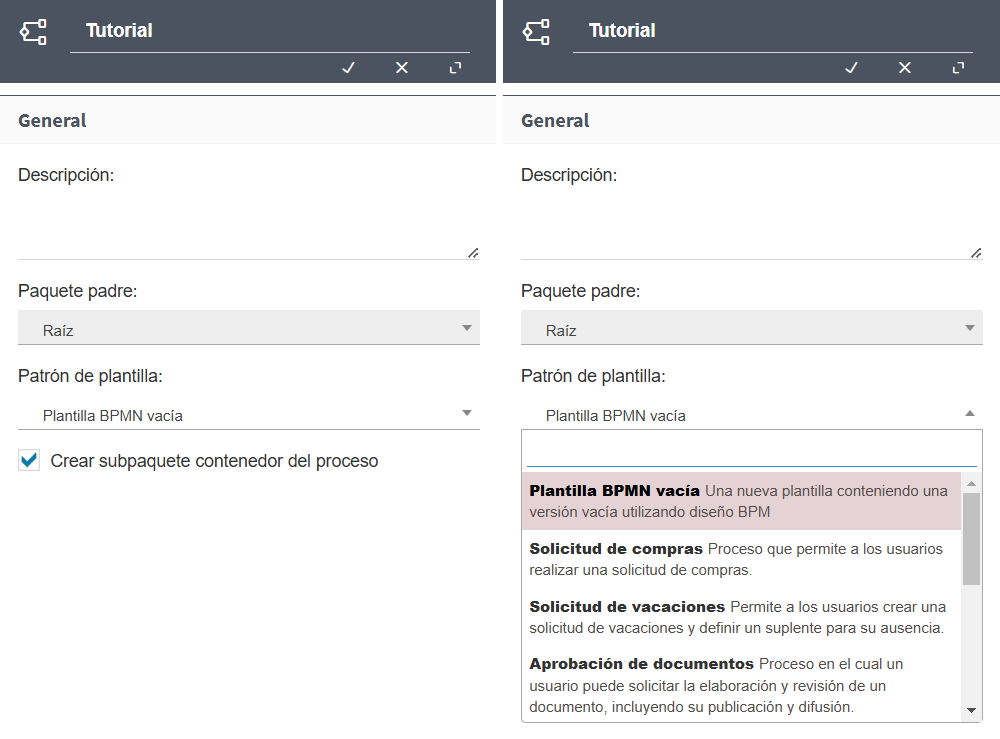](_images/image913.png)

Figura 131 Crear una nueva plantilla de proceso[](#id6 "Link to this image")

Luego de hacer esto veremos que apareció en el explorador de soluciones una plantilla de proceso con el nombre que ingresamos. La misma se muestra debajo de un paquete con su mismo nombre. Junto al nombre de esta plantilla veremos entre paréntesis un “1.0”, el cual indica la versión de la plantilla sobre la que estamos trabajando. Cada plantilla de proceso puede tener varias versiones, pero sólo se puede trabajar en una versión a la vez. La [Figura 132](#newtemplate) muestra el explorador de soluciones luego de haber sido creada la plantilla de proceso.

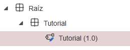

Figura 132 Nueva plantilla de proceso creada[](#id7 "Link to this image")

### Pasos del proceso[](#pasos-del-proceso "Link to this heading")

Nuestro objetivo, ahora que ya hemos creado una plantilla de proceso con su respectiva versión, es editarla para crear el proceso que definimos en la sección [Descripción del proceso](#descripcion-del-proceso).

El diseño de proceso es el diagrama que representa el proceso de negocio. Está compuesto por pasos y conexiones entre estos pasos, que determinan el orden en que éstos deberían darse en un proceso.

Cuando se crea la plantilla podemos ver el diseño de proceso de la versión inicial. Esta ya contiene dos pasos: un paso de inicio y un paso de fin ([Figura 133](#newtemplatediagram)).

[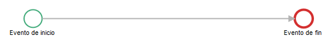](_images/image1213.png)

Figura 133 Diagrama de una nueva plantilla de proceso[](#id8 "Link to this image")

Para agregar pasos al diseño de proceso disponemos de la barra de herramientas ([Figura 134](#bpmgraphtoolbar)). La misma se encuentra en la zona izquierda del diseñador.

Un paso se puede agregar al documento, arrastrándolo desde la barra de herramientas al diagrama.

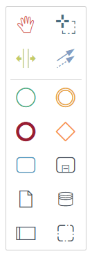

Figura 134 Barra de herramientas[](#id9 "Link to this image")

Existen muchos tipos de paso, pero para implementar el proceso que queremos, sólo necesitaremos algunos de ellos, que se describen a continuación.

#### Evento de inicio[](#evento-de-inicio "Link to this heading")

Un paso que es indispensable en todo proceso es el evento de “Inicio”. Este paso es el punto de entrada del proceso y como tal, sólo puede haber uno en cada flujo de trabajo. Este paso representa el momento en que el usuario que inicia el proceso completa los datos necesarios en el formulario web y da inicio al nuevo proceso. Cuando se crea una nueva plantilla de proceso, automáticamente incluye un evento de inicio.

#### Evento de fin[](#evento-de-fin "Link to this heading")

Otro paso que es fundamental es el evento de “Fin”, el cual marca la finalización del proceso. Es posible tener más de un evento de fin en el proceso y utilizar cada uno para marcar un fin de proceso diferente. Por ejemplo, en nuestro proceso tenemos un “Fin aprobada” en que la solicitud de gasto es aprobada y un “Fin rechazada”, en que la solicitud es rechazada. Cuando se crea una nueva plantilla de proceso, ésta ya viene con un evento de fin, dado que todo proceso debe tener al menos uno.

#### Compuerta exclusiva[](#compuerta-exclusiva "Link to this heading")

Una compuerta exclusiva sirve para evaluar condiciones del proceso y continuar por uno de los diferentes caminos posibles, según el resultado de la evaluación. En particular, en nuestro proceso puede utilizarse para evaluar el monto del gasto solicitado. En caso que dicho gasto sea menor a 500, deberá ser aprobado por el encargado de compras. Si el gasto se encuentra entre 500 y 1000, se necesitará una aprobación adicional del gerente general. Finalmente, si el gasto es mayor a 1000, la aprobación adicional debe ser realizada por el gerente general y por el director. También lo utilizaremos para evaluar las respuestas de los distintos participantes del proceso, quienes deciden si se aprueba o no el gasto.

#### Tarea de usuario[](#tarea-de-usuario "Link to this heading")

Una tarea de usuario permite interactuar con usuarios mediante el envío de una pregunta que debe ser respondida. La pregunta y las posibles respuestas a ella son definidas en el diseño del proceso. En nuestro proceso utilizaremos pasos de este tipo para preguntar al encargado de compras, gerente de compras y director si aprueban el gasto del solicitante.

Cuando una tarea de usuario define un vencimiento, es necesario incluir un evento temporizador de borde, a partir del cual, se definirá el flujo cuando dicho vencimiento se cumpla y se desee seguir un curso alternativo.

#### Tarea de notificación a usuario[](#tarea-de-notificacion-a-usuario "Link to this heading")

Una tarea de notificación a usuario envía una notificación de Qflow y en caso de estar correctamente configurado, un mensaje de correo electrónico a los usuarios. En el proceso que estamos implementando podemos usar estos pasos para notificar al solicitante el resultado de su solicitud.

#### Tarea de fórmula[](#tarea-de-formula "Link to this heading")

Un paso de fórmula permite asignarle valores a datos de aplicación y roles del proceso, dependiendo de una o más condiciones definidas dentro del mismo paso. En nuestro proceso utilizaremos pasos de este tipo para calcular el monto total de todas las líneas que haya introducido el solicitante y seleccionar qué personas deben aprobar o rechazar el gasto dependiendo del gasto.

### Dibujo del proceso[](#dibujo-del-proceso "Link to this heading")

Para dibujar el proceso se empieza por arrastrar desde la barra de herramientas los pasos que se van a utilizar y conectarlos. Esto nos lleva a implementar el proceso de manera “left-right” o de izquierda a derecha: primero construimos el esqueleto del proceso, dejando los detalles para después.

La plantilla del proceso que se creó ya incluye un evento de inicio, de modo que no es necesario agregar uno. Pero podemos cambiarle el nombre a “Solicitar gasto”, haciendo doble clic en el nombre. También es posible cambiarlo en la ventana de propiedades ([Figura 135](#propertiespanel)). Esta ventana se abre al hacer doble clic en el evento de inicio. Para guardar los cambios en dicha ventana, debemos hacer clic en el ícono de tic.

[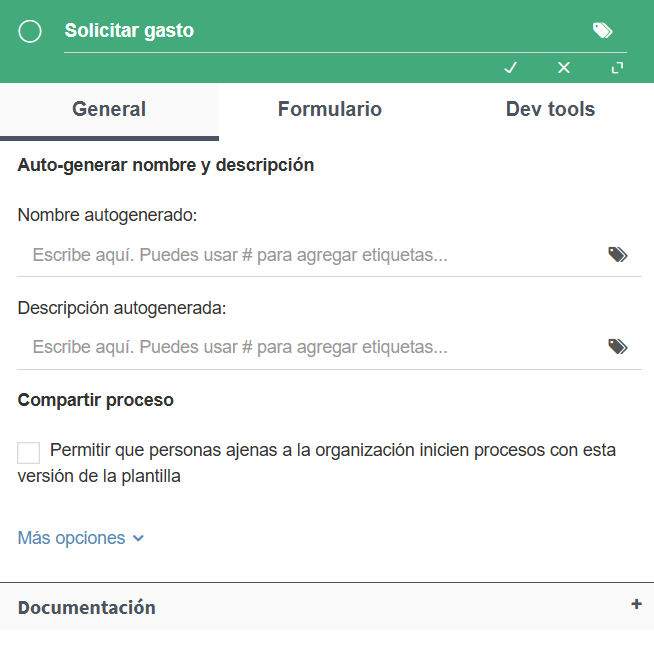](_images/image1412.png)

Figura 135 Ventana de propiedades[](#id10 "Link to this image")

Luego, arrastramos una actividad desde la barra de herramientas al diagrama. Si se pone sobre la flecha que conecta el evento de inicio con el de fin, la tarea será la primera en ejecutarse una vez que se inicie el flujo. La [Figura 136](#newactivitybetweenstartandendevent) muestra cómo queda el diagrama una vez conectados los pasos de inicio y la tarea.

[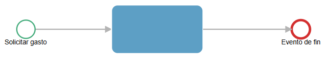](_images/image1512.png)

Figura 136 Nueva actividad entre los eventos de inicio y de fin[](#id11 "Link to this image")

Podemos renombrar la tarea en el momento que la agregamos al diagrama o haciendo doble clic sobre ella, en nuestro caso la llamaremos “Calcular monto total” para poder identificarla más fácilmente cuando agreguemos más pasos al flujo ([Figura 137](#renameactivity)). El nombre que se asigna en la tarea se conserva una vez que se cambia el tipo.

[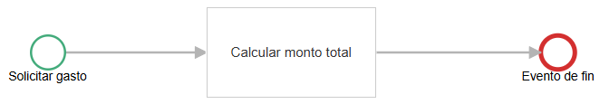](_images/image1612.png)

Figura 137 Renombrar nombre de actividad[](#id12 "Link to this image")

A continuación, se cambiará la actividad por una tarea de fórmula, la cual se encargará de calcular el total del monto de todos los productos que el solicitante haya ingresado. Para hacer esto, se debe seleccionar la tarea mediante un clic. Esta acción abre una pequeña barra de herramientas con 5 íconos a la derecha de la tarea ([Figura 138](#activitytoolbar)). Al seleccionar la primera opción, se desplegará un menú con las distintas actividades disponibles en Qflow ([Figura 139](#activitytypes)). Al seleccionar “Tarea de fórmula”, veremos que aparece el ícono de dicha actividad y el nombre se actualiza.

[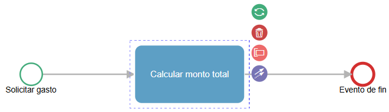](_images/image1712.png)

Figura 138 Barra de herramientas de la actividad[](#id13 "Link to this image")

[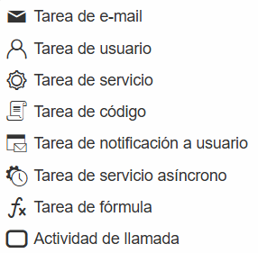](_images/image1812.png)

Figura 139 Tipos de actividades disponibles[](#id14 "Link to this image")

A continuación de la tarea de fórmula, colocaremos una nueva tarea que representará la aprobación por parte del encargado de compras y la nombraremos como “¿Aprueba encargado de compras?”. Para esto, cambiaremos el tipo de actividad por una tarea de usuario, de la misma forma que hicimos con el paso de fórmula anterior resultando en un diagrama similar al de la [Figura 140](#usertaskdiagram).

[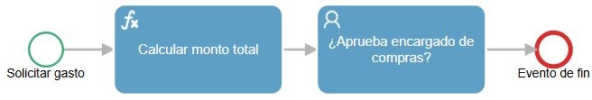](_images/image1912.png)

Figura 140 Diagrama con la tarea de usuario[](#id15 "Link to this image")

La aprobación del encargado de compras puede tener dos resultados: o bien la solicitud es aprobada y se continúa con el proceso, o bien la solicitud es rechazada y se debe notificar al solicitante y finalizar el proceso. Las diferentes ramas que el proceso puede tomar luego del paso, se evaluarán en base a la respuesta de la tarea de usuario. Para esto, es necesario crear una compuerta exclusiva.

Es posible que en este momento, no tengamos más espacio para seguir agregando pasos. El diseñador de procesos web permite desplazar uno o más ítems a la vez dentro del diagrama de varias maneras, en este caso, seleccionaremos el paso de fin y lo arrastraremos hacia la derecha para generar más espacio y así poder agregar nuevos pasos. Qflow te ayuda a mantener alineados los ítems mediante una línea naranja, pero puedes decidir si deseas mantenerlos de esta forma o desplazarlos hacia cualquier posición en el área de dibujo. Si deseas seleccionar más de un paso, puede hacerlo manteniendo la tecla control apretada mientras haces clic en los distintos pasos. Otra forma de mover más de un paso a la vez, es con la herramienta de crear/eliminar espacio.

A continuación, crearemos la compuerta exclusiva. Este paso permite evaluar varias condiciones y decidir por qué camino debe continuar la ejecución del flujo, dependiendo de los resultados de las mismas. Para esto, se debe arrastrar el ícono de compuerta exclusiva desde la barra de herramientas al diagrama. A esta compuerta la nombraremos “¿Aprueba?” y lo haremos de la misma forma que nombramos el evento de inicio, haciendo doble clic en el nombre que aparece debajo del paso en el diagrama. El diagrama debería verse similar a la [Figura 141](#exclusivegatewaydiagram).

[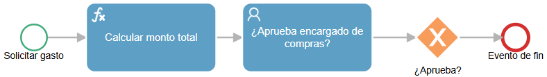](_images/image2011.png)

Figura 141 Diagrama luego de agregar compuerta exclusiva[](#id16 "Link to this image")

Luego veremos cómo especificar la respuesta que lleva a cada camino. Por ahora, nos limitaremos a trazar los caminos. Primero trazaremos el camino del rechazo de la solicitud. Este camino debe llevar a una tarea de notificación a usuario, que le envía un mensaje al solicitante, indicando que se rechazó su solicitud. Para crearla, debemos repetir el mismo proceso que con las actividades anteriores, agregando una actividad desde la barra de herramientas, renombrándola por “Notificar rechazo” y cambiando el tipo de tarea por una de notificación. También debemos tener un evento de fin que finalice el proceso. Como ya tenemos el evento de fin que se crea automáticamente al crear el proceso, utilizaremos ése, aunque lo renombraremos como “Rechazo compra” para indicar que corresponde a la finalización de un proceso que terminó en un rechazo. En la [Figura 142](#notifyuser) vemos cómo va quedando nuestro proceso.

[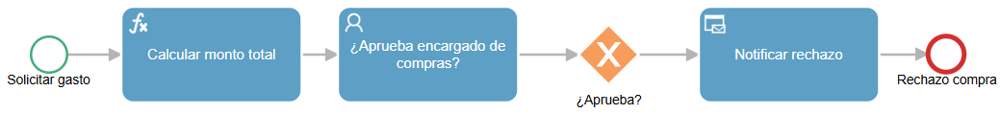](_images/image2111.png)

Figura 142 Proceso hasta la tarea de notificación a usuario por rechazo[](#id17 "Link to this image")

A continuación, debemos trazar el camino del proceso para el caso en que el encargado de compras aprueba el gasto. En ese caso, la aprobación del gerente de compras y del director podrían ser necesarias, pero eso depende del monto del gasto. Es necesario evaluar entonces, mediante una nueva compuerta exclusiva, si el monto se encuentra entre 500 y 1000 dólares e incluir en la rama correspondiente otra tarea de usuario, que representa la aprobación del gerente de compras; o si el monto es mayor o igual a 1000 dólares, hacer una nueva rama en la que respondan tanto el gerente de compras como el director.

Para crear una nueva rama saliente de la compuerta exclusiva, puede seleccionar dicha compuerta y hacer clic en la opción de compuerta exclusiva, esto creará una nueva compuerta exclusiva que se encontrará unida a la primera compuerta ([Figura 143](#newbranchfromexclusivegateway)).

[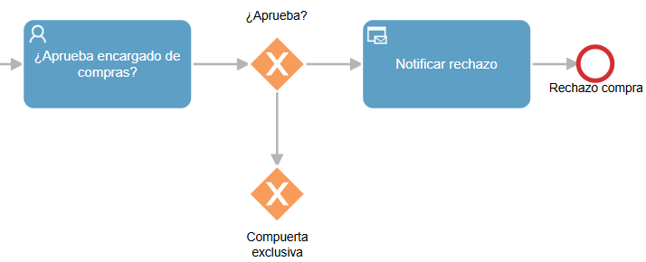](_images/image2211.png)

Figura 143 Proceso con una nueva rama saliendo de la compuerta exclusiva[](#id18 "Link to this image")

Agregamos al diseño entonces, dos nuevas ramas. Cada una cuenta con un paso de fórmula, en los que luego asignaremos los destinatarios que deberán aprobar o rechazar el gasto dependiendo del monto. Para hacer esto, podemos seleccionar la compuerta exclusiva y elegir la opción “Agregar tarea” del menú contextual del paso. A estas tareas las llamaremos “Debe aprobar Gerente de compras” y “Deben aprobar gerente de compras y director”. También es posible agregarle nombre a las conexiones entre pasos haciendo doble clic en las flechas. A estas últimas dos las nombraremos “Monto entre 500 y 1000” y “Monto > 1000” respectivamente. El proceso debería ser similar al de la [Figura 144](#flowwithtwotasks).

Figura 144 Proceso con nombres en las conexiones y 2 nuevas tareas de fórmulas[](#id19 "Link to this image")

Luego de esto, procederemos a crear una nueva tarea de usuario que llamaremos “Aprobación gerencial”, en la que tanto el gerente de compras como el director deberán responder, en caso de que ellos deban intervenir en el flujo. Para esto, se puede seleccionar cualquiera de las dos tareas de fórmula. Seleccionar la herramienta de nueva tarea, renombrarla al nombre mencionado y cambiarle el tipo a tarea de usuario. Para hacer que la segunda tarea de fórmula continúe hacia la nueva tarea de usuario, basta con seleccionar dicha tarea de fórmula y seleccionar la herramienta de “Conectar usando conexión o asociación” y hacer clic sobre la nueva tarea de usuario. Las tareas deberían quedar conectadas de forma similar a la de la [Figura 145](#twoformulatasks).

[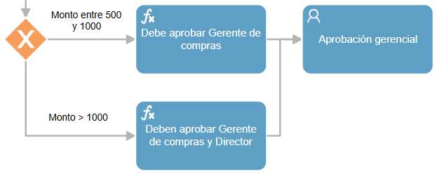](_images/image2512.png)

Figura 145 Las 2 tareas de fórmula conectadas a la misma tarea de usuario[](#id20 "Link to this image")

Una vez más, debemos evaluar la respuesta que hagan los usuarios, por lo que debemos crear una nueva compuerta exclusiva que se encargará de enviar el flujo por el camino correspondiente, dependiendo de las respuestas de la tarea anterior.

Si el gerente general rechaza el gasto, se notifica al solicitante de la misma manera que con el rechazo del encargado de compras. Para eso, conectamos la nueva compuerta exclusiva a la notificación que ya habíamos creado anteriormente. El flujo debería quedar similar al de la [Figura 146](#flowwithreject).

Figura 146 Proceso con rechazo de la gerencia[](#id21 "Link to this image")

Como verás, la conexión entre la compuerta exclusiva y la notificación del rechazo pasa por arriba del paso de fin. El diseñador de procesos de negocio web de Qflow permite modificar el camino que recorren todas las conexiones de forma simple, para esto, hacer clic y mantener presionado sobre el punto que desea modificar, esto creará un nuevo punto de quiebre. Podemos modificar el camino de las conexiones cuantas veces sea necesario. La [Figura 147](#linkbetweenusertaskandnotification) muestra un paso a paso para crear puntos de quiebre en la conexión entre dos pasos.

[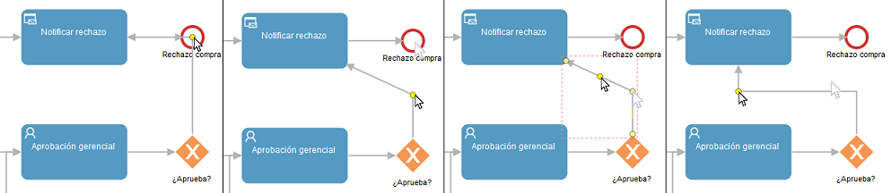](_images/image27.gif)

Figura 147 Conexión entre aprueba y notificación modificada[](#id22 "Link to this image")

Resta por definir el camino “exitoso” del proceso, es decir, el camino en el cual la solicitud de gastos es aprobada. En ese caso, es necesario notificar al solicitante que su solicitud fue aprobada y finalizar el proceso.

Para hacer esto, arrastramos una tarea de notificación que llamaremos “Notificar aprobación” y un evento de fin que llamaremos “Apruebo compra” desde la barra de herramientas. La solicitud se aprueba si pasa la aprobación gerencial, por lo que se debe crear una conexión de salida del paso de aprobación de la gerencia, al nuevo paso de notificación. Esto se hace de la misma forma que hicimos anteriormente, haciendo clic en la compuerta exclusiva de la aprobación gerencial y seleccionando la herramienta de “Conectar usando conexión o asociación”. El resultado debería ser similar al de la [Figura 148](#exclusivegatewaywithusertask).

[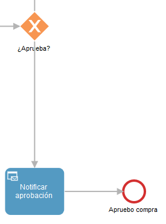](_images/image283.png)

Figura 148 Compuerta exclusiva con la conexión a aprobación de compra[](#id23 "Link to this image")

Además, si al momento de evaluar el monto, éste no es mayor a 500 dólares, la solicitud estará aprobada, ya que en ese caso el único aprobador necesario sería el encargado de compras. Por lo tanto, desde la compuerta exclusiva que evalúa si se debe hacer la aprobación gerencial y quiénes deben participar de la misma, se debe trazar una conexión hasta el nuevo paso de notificación a la cual le agregaremos la etiqueta “Monto < 500” tal como muestra la [Figura 149](#notificationwithtwopaths).

[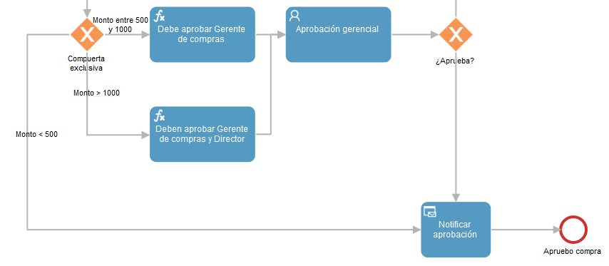](_images/image293.png)

Figura 149 Se llega a la notificación de aprobación de compra por 2 caminos diferentes[](#id24 "Link to this image")

Qflow nos permite definir una conexión por defecto en caso de que no se cumpla ninguna condición dentro de la compuerta exclusiva. Para esto, debemos seleccionar la conexión correspondiente a “Monto < 500” y cambiar el tipo de conexión (con la herramienta de Cambiar tipo) y seleccionar conexión por defecto. La [Figura 615](15-QflowDesign.md#defaultconnection) muestra la conexión por defecto, este tipo de conexión se ve por una línea en diagonal que corta la conexión entre la compuerta exclusiva y la tarea de notificar aprobación.

[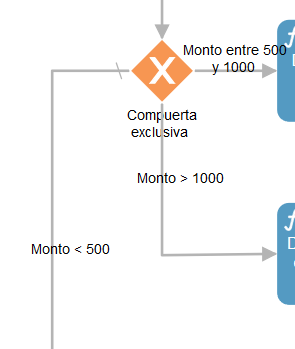](_images/image303.png)

Figura 150 Conexión por defecto (“Monto < 500”)[](#id25 "Link to this image")

El diseño del proceso debería quedar similar al de la [Figura 151](#flowdiagram).

[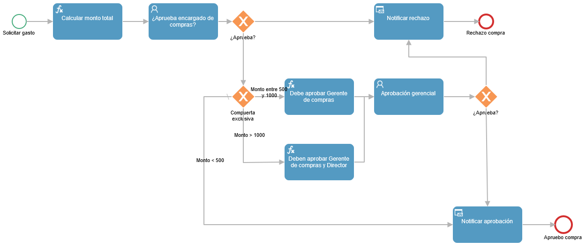](_images/image314.png)

Figura 151 Grafo del proceso[](#id26 "Link to this image")

Falta tener en cuenta el tiempo de vencimiento de las aprobaciones. Luego de 1 día, si no hay respuesta de los aprobadores, se debe rechazar la solicitud. Las tareas de usuario permiten este comportamiento agregándole un evento temporizador de borde, el cual se agrega al diagrama arrastrando el ícono del círculo amarillo (evento intermedio) en la barra de herramientas y poniendo sobre la tarea de usuario a la que se le quiere agregar, como muestra la [Figura 152](#usertaskwithevent).

[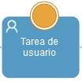](_images/image323.png)

Figura 152 Tarea de usuario con evento de borde[](#id27 "Link to this image")

Una vez hecho esto, debemos cambiar el tipo de evento a uno de temporizador de borde seleccionando el evento y modificándolo con la herramienta de cambiar tipo. Luego, conectaremos el evento temporizador (es importante que la conexión sea desde el evento temporizador y no la tarea de usuario) con la tarea de notificar el rechazo ([Figura 153](#temporizereventwithnotification)). Repetir esto para las dos tareas de usuario del proceso.

[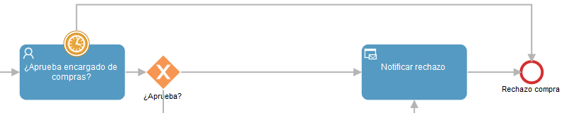](_images/image333.png)

Figura 153 El evento temporizador de borde con su conexión a la notificación de rechazo del gasto[](#id28 "Link to this image")

El grafo del proceso debe quedar similar al de la [Figura 154](#flowdiagram2).

[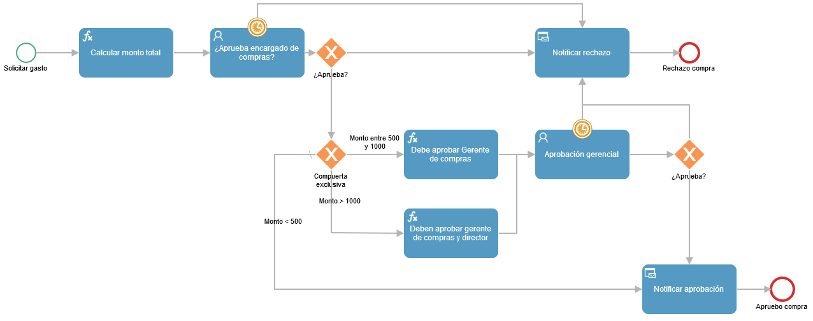](_images/image343.png)

Figura 154 Diagrama del proceso[](#id29 "Link to this image")

### Datos de aplicación[](#datos-de-aplicacion "Link to this heading")

Los datos de aplicación proveen información estructurada del proceso. Cada dato está asociado a un dominio, el cual determina los posibles valores que el dato puede tomar (texto, número, etc.) y el control que se mostrará en Qflow Task para el dato (cuadro de texto, combo box, etc.).

Pueden ser modificados a lo largo del proceso, tanto por usuarios como por Qflow en pasos de ejecución automática (aquellos que no requieren intervención del usuario).

En pasos interactivos, como por ejemplo la tarea de usuario, se define una visibilidad para el dato. La visibilidad especifica si un dato puede ser modificado en determinado paso, si es mostrado, pero no se puede modificar o si está ausente en ese paso.

En nuestro proceso, al utilizar la tarea de usuario, suponemos que el monto está en un dato de aplicación. Las compuertas exclusivas y las tareas de fórmula son pasos de ejecución automática que pueden evaluar condiciones que requieren consultar datos de aplicación. Por lo tanto, en este proceso creamos un dato de aplicación que represente el monto total de los productos.

El dominio predeterminado para datos es “Texto”. En este caso queremos que el dato tenga el dominio “Número”. Esto permite, entre otras cosas, que se valide que sólo se ingresen valores numéricos para el dato. Para agregar un dato de aplicación:

1.  Selecciona la opción “Datos” en la barra de acciones que se encuentra en la parte superior de la pantalla ([Figura 155](#actionbar)).
    
2.  En la nueva ventana que se abrió, haz clic en el ícono “+”.
    
3.  Ingresa un nombre, dominio y opcionalmente una descripción para el dato y haz clic en ícono del tic ([Figura 156](#newapplicationdatum)).
    

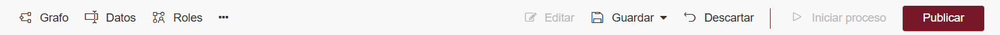

Figura 155 Barra de acciones[](#id30 "Link to this image")

[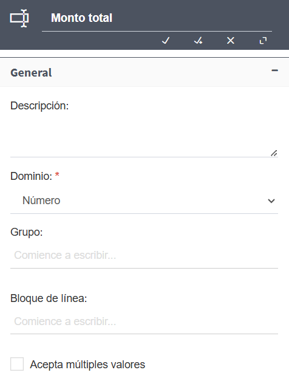](_images/image363.png)

Figura 156 Panel de dato de aplicación[](#id31 "Link to this image")

Luego de hacer esto, veremos que se agregó el dato a la lista de datos de la plantilla de proceso ([Figura 157](#documentapplicationdatum)). Si se desea volver al diseño del proceso se debe hacer clic en el botón «Grafo» de la barra de acciones.

[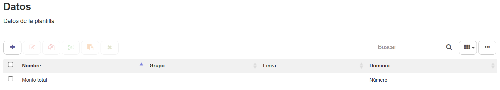](_images/image373.png)

Figura 157 Datos de aplicación[](#id32 "Link to this image")

En muchos casos podría ser útil que los aprobadores tengan la capacidad de realizar comentarios para que los lea el solicitante. Estos se podrían utilizar para brindar una explicación en caso de rechazo de la solicitud. Para habilitar los comentarios en un paso debemos abrir la configuración de este e ir a la solapa de “Formulario” y sobre el final de la sección de “Visibilidad” en la configuración de comentarios debemos marcar la opción “Permitir adición” ([Figura 158](#commentsallowaddition)).

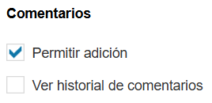

Figura 158 Permitir adición de comentarios[](#id33 "Link to this image")

Podemos configurar individualmente para cada respuesta si es obligatorio agregar un comentario al responder. También tenemos la opción de elegir si queremos que la clave de la respuesta se agregue a la bitácora de comentarios cuando la tarea se responda. Podemos hacer esto marcando la opción “Agregar respuesta a comentarios” ([Figura 159](#commentsresponseconfig)).

[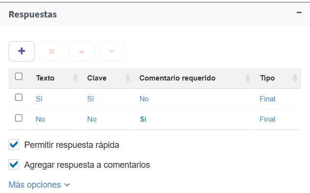](_images/image883.png)

Figura 159 Configuración de comentarios en respuestas[](#id34 "Link to this image")

Además de estos datos, serán necesarios agregar datos para detallar cada producto que se desee agregar al gasto. Para esto, debemos crear tres datos de aplicación nuevos. Estos datos, deberán tener varios valores, dependiendo de cuántos productos distintos desee agregar el solicitante. Por esto, debemos permitir que los datos admitan múltiples valores y pertenezcan a un bloque de línea común, de manera que queden asociados entre sí. Crearemos los datos “Nombre” y “Monto” del dominio Texto y Número respectivamente, ambos pertenecientes al bloque de línea “Productos” y con la casilla “Acepta múltiples valores” marcada ([Figura 160](#multivalueddatum)).

[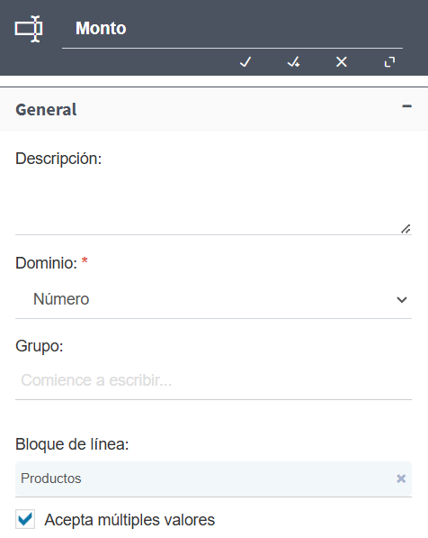](_images/image393.png)

Figura 160 Dato “Monto”, que acepta múltiples valores y pertenece al bloque de línea “Productos”[](#id35 "Link to this image")

El tercer dato de aplicación correspondiente al bloque de productos es la imagen del producto. Qflow posee un dominio de datos del tipo documento que permite adjuntar cualquier archivo, pero en nuestro caso, queremos sólo archivos del tipo imagen. Por esta razón, utilizaremos un dominio de datos creado por nosotros mismos. Los dominios de datos se agregan de forma similar a los datos de aplicación. Para agregar un dominio de datos:

1.  Haz clic en los tres puntos que se encuentran del lado izquierdo de la barra de acciones.
    
2.  Selecciona la opción “Dominios de dato”.
    
3.  En el nuevo panel que se abrió, haz clic en el ícono “+”.
    
4.  Ingresa un nombre, tipo de control y tipo de dato, opcionalmente agrega una descripción para el dominio y haz clic en ícono del tic ([Figura 161](#datadomainconfiguration)).
    

[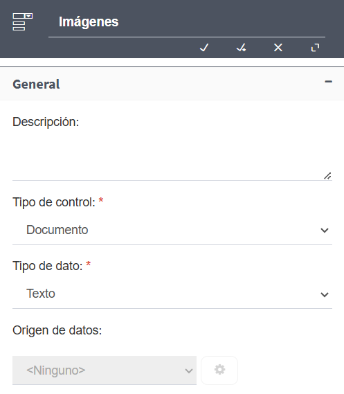](_images/image403.png)

Figura 161 Configuración de un dominio de datos[](#id36 "Link to this image")

En nuestro caso, debemos seleccionar el tipo de control Documento, el cual nos permite adjuntar archivos al proceso y tipo de dato “Texto”. Adicionalmente, desplegaremos el panel de “Propiedades” haciendo clic sobre él y dentro de la solapa de Restricciones, agregaremos la siguiente expresión regular: “\*.jpg; \*.png; \*.gif; \*.jpeg” (sin las comillas). Esto nos permitirá limitar el tipo de documentos que se adjuntan, para que se admitan únicamente de este tipo de extensiones. También le agregaremos el siguiente mensaje de error: “El documento ingresado debe ser una imagen” como muestra la [Figura 162](#domainrestrictions).

[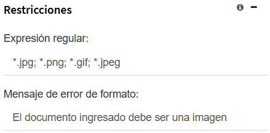](_images/image423.png)

Figura 162 Restricciones del dominio de datos Imagen[](#id37 "Link to this image")

Una vez creado el dominio de datos, podemos crear un nuevo dato de aplicación llamado Imagen con las mismas características que Nombre y Monto, pero con el dominio de datos Imágenes que creamos anteriormente ([Figura 163](#dataproperties)).

[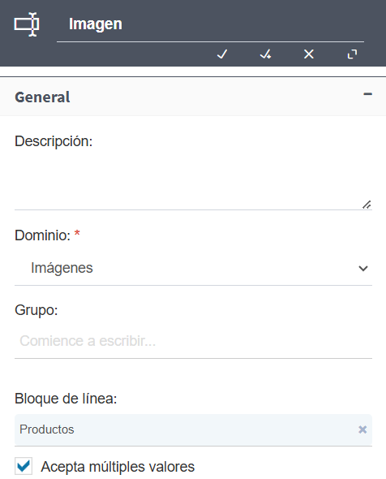](_images/image433.png)

Figura 163 Propiedades del dato de aplicación «Imagen»[](#id38 "Link to this image")

Finalmente, agregaremos un nuevo dato de aplicación que será una justificación del gasto para que el solicitante pueda explicar las razones por las cuales desea efectuar el gasto. Lo llamaremos “Justificación de compra”, será del dominio de datos “Área de texto”. En este caso, no pertenecerá a ningún bloque de línea ni permitirá valores múltiples.

[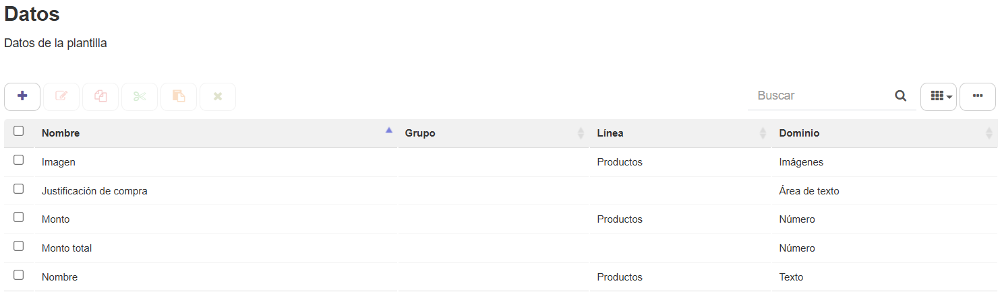](_images/image443.png)

Figura 164 Datos de aplicación creados[](#id39 "Link to this image")

### Roles de proceso[](#roles-de-proceso "Link to this heading")

Los roles de proceso se utilizan como destinatarios para los pasos interactivos. Los roles se asocian a usuarios y será a quienes Qflow les asigna una tarea cuando un proceso llega a un paso interactivo. En el caso de nuestro proceso tenemos cuatro roles:

*   Solicitante, que es quien inicia el proceso pidiendo la aprobación de un gasto.
    
*   Encargado de compras, que aprobará o rechazará la solicitud.
    
*   Gerente de compras, a quién se le solicita su aprobación en el caso de que el monto sea mayor a los 500 dólares.
    
*   Director, a quién se le solicita su aprobación en el caso de que el monto sea mayor a los 1000 dólares.
    

Los roles de proceso se agregan de forma similar a los datos de aplicación y dominios de datos. Para agregar un rol a la versión de proceso:

1.  Selecciona la opción “Roles” en la barra de acciones.
    
2.  En la nueva ventana que se abrió, haz clic en el ícono “+”.
    
3.  Ingresa un nombre, miembros del rol, si permitirá múltiples usuarios y opcionalmente una descripción. También puedes seleccionar una regla de delegación automática de tareas aplicada a este rol.
    
4.  Haz clic en el ícono del tic.
    

Para representar a el “Solicitante” en nuesto proceso, podemos utilizar el rol del usuario iniciador del proceso. Una vez iniciado el proceso, Qflow asignará a este rol el usuario que lo haya iniciado.

Para asignar el usuario al rol del proceso, en la ventana de propiedades del rol ([Figura 166](#rolepanel)) diríjete al cuadro correspondiente a “Miembros del rol”.

1.  Comienza a escribir “Usuario iniciador del proceso”. Qflow te mostrará un cuadro de sugerencias con los miembros de tu organización y otros roles ([Figura 165](#rolemembers)).
    
    [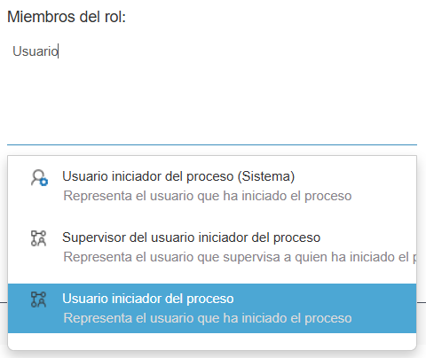](_images/image453.png)
    
    Figura 165 Miembros del rol con su correspondiente cuadro de sugerencias[](#id40 "Link to this image")
    
2.  Selecciona la opción “Usuario iniciador del proceso” del cuadro ([Figura 166](#rolepanel)).
    
3.  Luego haga clic en el tic para confirmar los cambios realizados en el rol.
    

[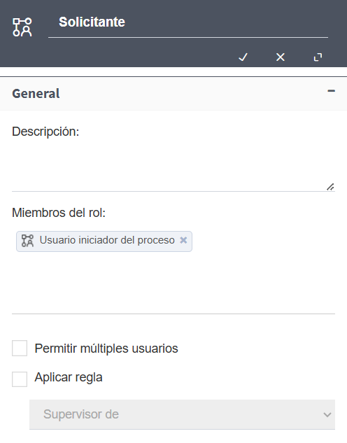](_images/image463.png)

Figura 166 Ventana de propiedades del rol de proceso “Solicitante”[](#id41 "Link to this image")

Repetiremos el proceso para los roles “Encargado de compras”, “Gerente de compras” y “Director”, pero seleccionando tu propio usuario dentro de la organización, para ser quien reciba las preguntas en las distintas tareas de usuario que ya hemos creado anteriormente. Esto nos permitirá iniciar el proceso y contestar tanto la pregunta que va dirigida al encargado de compras como la que va dirigida a la aprobación gerencial.

Si el proceso se implementara en el mundo real, al rol “Encargado de compras” habría que asignarle el usuario correspondiente al encargado de compras y a los roles “Gerente de compras” y “Director” habría que asignarles el usuario correspondiente al gerente de compras y director respectivamente. Esas cuentas de usuario se crean en Qflow Team.

Para que tanto el “Gerente de compras” como el “Director” puedan responder la tarea, debemos crear un rol que contenga a los mismos, al cual llamaremos “Aprobador gerencial” con las particularidades de que el nuevo rol permitirá tener múltiples usuarios asignados (marcar la casilla al crear el rol) y no tendrá ningún usuario asignado por el momento, esto lo haremos más adelante en las tareas de fórmula agregadas en el proceso.

[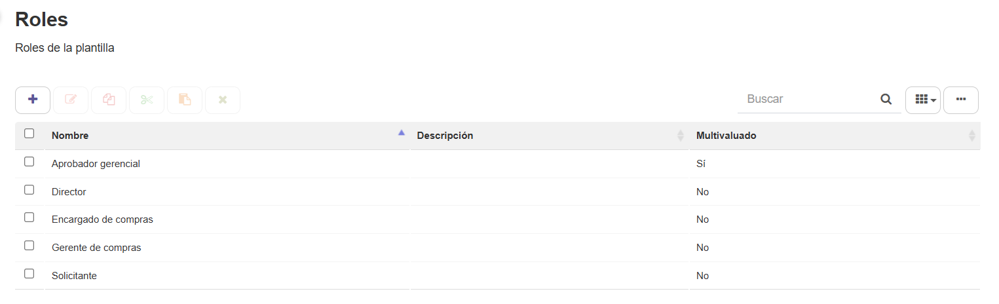](_images/image473.png)

Figura 167 Todos los roles del proceso creados[](#id42 "Link to this image")

### Detallar el proceso[](#detallar-el-proceso "Link to this heading")

Ahora que tenemos definido el esqueleto del proceso y los recursos que éste involucra, restan por configurar los pasos, para que tengan el comportamiento deseado y utilicen los roles y datos que definimos.

Comencemos revisando cada uno de los pasos y viendo las propiedades que necesitamos configurar en cada uno.

#### Paso de inicio[](#paso-de-inicio "Link to this heading")

En este paso, el iniciador del proceso debe ser capaz de ingresar varios productos con su costo correspondiente y si lo desea, su foto, además de una justificación de por qué quiere realizar dicho gasto. Los datos y roles que participan en cada paso se definen dentro de la configuración de visibilidad. Para configurar esto, se debe ingresar a los ajustes del paso haciendo doble clic sobre él y luego seleccionando la solapa de “Formulario”. Entonces se muestra un formulario como la de la [Figura 168](#tutorialdatascope). Allí se listan los datos de aplicación que definimos anteriormente junto con la visibilidad que tienen en el paso. La visibilidad predeterminada es “Ausente” y para los datos “Justificación de compra”, “Monto” y “Nombre” debemos cambiarlos a “Requerido”, de manera que el usuario que inicia el proceso deba ingresar un valor para el dato.

[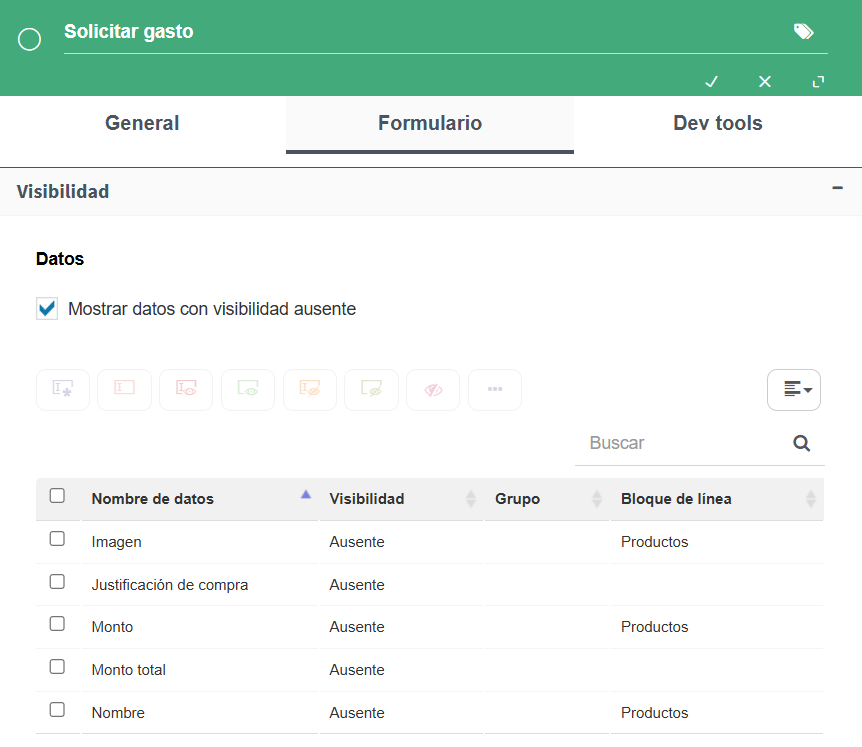](_images/image492.png)

Figura 168 Visibilidad de datos[](#id43 "Link to this image")

Esto se logra seleccionando las casillas correspondientes a cada uno de estos datos y haciendo clic en el botón “Requerido” (la opción de más a la izquierda). Luego de este cambio debemos seleccionar el dato “Imagen” y se lo pone en visibilidad “Editable” de modo que el solicitante pueda adjuntar una imagen pero que no esté obligado a hacerlo si no lo desea. Finalmente, en la configuración de instancias de línea, deben estar seleccionadas las casillas de permitir la adición y eliminación además de cambiar el número mínimo de instancias de 0 a 1, esto se logra haciendo clic en el 0 de dicha columna y cambiándolo por un 1 ([Figura 169](#instancelineconfiguration)), de forma que el solicitante deba ingresar al menos un producto junto con todos los datos requeridos para dicho producto. La visibilidad del paso debería verse similar al de la [Figura 170](#finaldatascope). Haz clic en el tic del paso para confirmar los cambios realizados a a visibilidad del paso.

[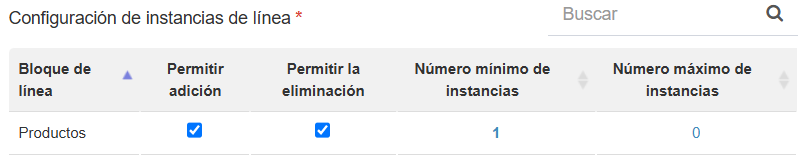](_images/image503.png)

Figura 169 Configuración de la instancia de línea[](#id44 "Link to this image")

[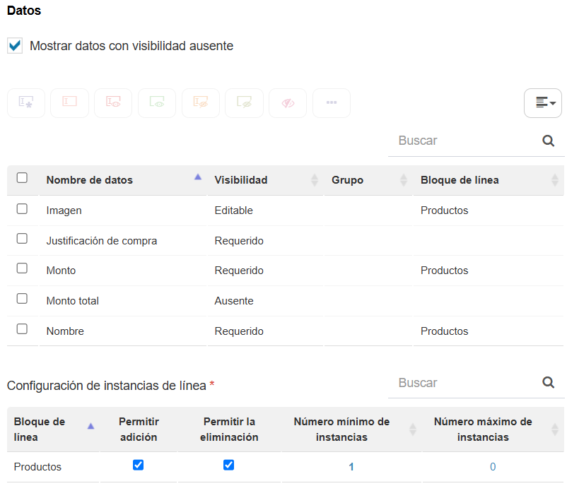](_images/image514.png)

Figura 170 Estado final de la visibilidad de los datos y del bloque de línea de los productos[](#id45 "Link to this image")

Un cambio adicional que se puede hacer al paso, es cambiar la bandera. Este campo proporciona información adicional del estado del proceso al momento de iniciar el paso. Para cambiar la bandera hay que hacer clic en «Más opciones» en la solapa «General» de configuración del paso e ingresar la palabra “Autorizando” en el campo «Bandera», como se muestra en la [Figura 435](15-QflowDesign.md#starteventproperties). Este cambio no es necesario para el funcionamiento del proceso, pero nos será útil a la hora de utilizar las funcionalidades de estadísticas de Qflow. Haga clic en el tic del paso para confirmar los cambios realizados.

[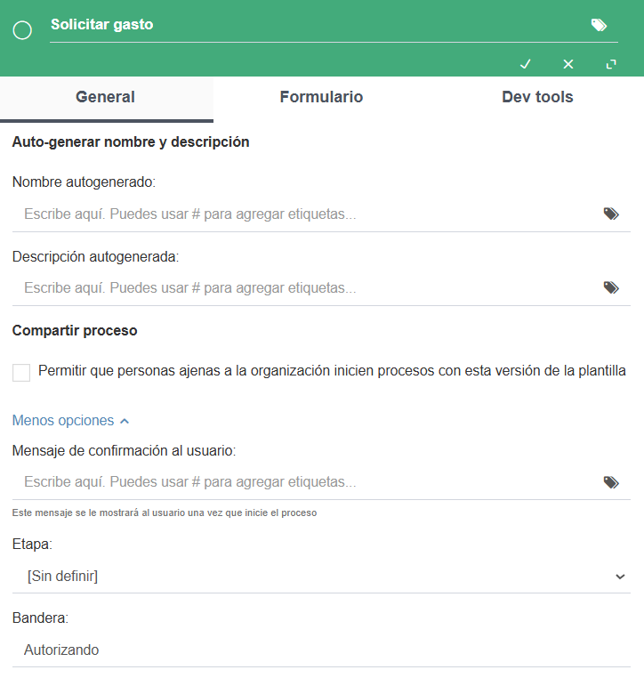](_images/image523.png)

Figura 171 Ventana de propiedades del paso Ingreso solicitud[](#id46 "Link to this image")

#### Calcular monto total[](#calcular-monto-total "Link to this heading")

En este paso realizaremos la suma de los montos de todos los productos y se lo asignaremos al dato “Monto total”.

Para esto, debemos entrar a los ajustes del paso. Dentro de la tabla de operaciones, que se encuentra vacía, debemos agregar una nueva operación con el botón “+” ([Figura 172](#formulatable)). Esta acción abrirá un panel llamado “Constructor de expresión de fórmula”.

[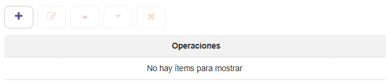](_images/image533.png)

Figura 172 Tabla de fórmulas[](#id47 "Link to this image")

En el constructor de expresión de fórmula, debemos escribir el ítem de destino, que en este caso es el dato “Monto total”. En el cuadro de operando, utilizaremos el dato “Monto” que contiene todos los montos de los productos ingresados y en transformación utilizaremos “Sum” de modo que se sumen los valores de la variable ([Figura 173](#formulabuilder)).

[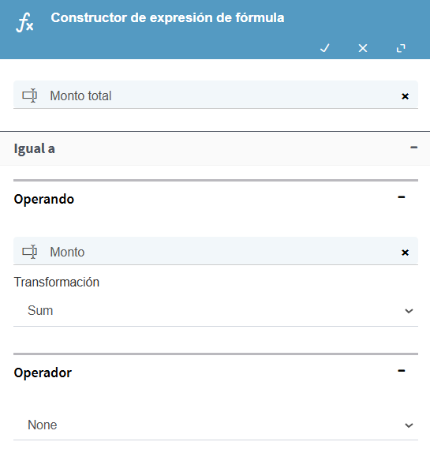](_images/image543.png)

Figura 173 Constructor de expresión de fórmula[](#id48 "Link to this image")

Al hacer clic en el tic, veremos que la tabla de operaciones del paso de fórmula se actualizó con la nueva fórmula que recién creamos. Hacer clic en el tic de este panel guarda los cambios del paso.

#### ¿Aprueba encargado de compras?[](#aprueba-encargado-de-compras "Link to this heading")

A la primera tarea de usuario la llamaremos “¿Aprueba encargado de compras?” y le realizaremos los siguientes ajustes de forma tal que, en este paso, el encargado de compras pueda responder si aprueba o no el gasto. Para tomar la decisión se puede basar en el monto de éste e ingresar un comentario explicando su decisión. No puede, sin embargo, modificar el monto ingresado.

Para lograr esto, es necesario cambiar la visibilidad del paso (de manera similar a como se hizo en el paso “Ingreso solicitud”), haciendo que los datos “Nombre”, “Monto”, “Imagen”, “Justificación de compra” y “Monto total” tengan la visibilidad “Sólo lectura”. Si los datos tienen la visibilidad “Ausente”, el encargado de compras no podrá verlos ([Figura 174](#task-data-scope)).

[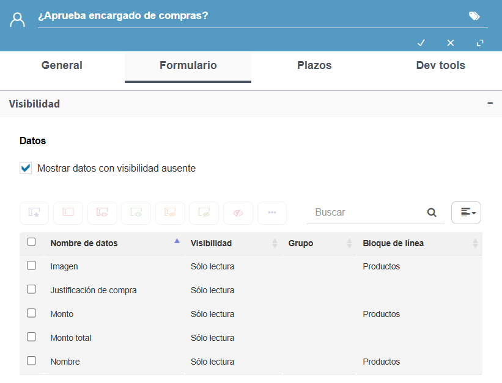](_images/image553.png)

Figura 174 Visibilidad de los distintos datos para la tarea[](#id49 "Link to this image")

Además, hay que configurar la pregunta y las respuestas a la misma, las cuales se utlizarán en la próxima compuerta exclusiva para determinar cómo continúa el flujo en base a estas.

Las propiedades del mensaje de la tarea de usuario se editan en la solapa “General” de la configuración del paso. El campo “Asunto del mensaje” representa el título de la pregunta y el asunto del e-mail que es enviado al usuario de la tarea. Lo editamos poniendo el texto “Solicitud de gasto de”. Además, usaremos la funcionalidad de “Agregar etiqueta” para insertar una etiqueta que diga el nombre del usuario “Solicitante” al final del asunto. Nuevamente Qflow nos ofrece un cuadro que nos da sugerencias a medida que escribimos texto. Para activarlo hay que escribir “#” dentro del cuadro de asunto o apretar el botón a la derecha del recuadro de mensaje y escribiremos “Solicitante”.

Con esto, se agregará al asunto la etiqueta “#%Role:»Solicitante»%#”. Durante la ejecución del proceso, Qflow reemplazará esa etiqueta por el nombre del miembro del rol “Solicitante”.

El destinatario de la tarea debe ser el rol “Encargado de compras”. Para ingresar el destinatario:

1.  Selecciona el recuadro de texto para ingresar el destinatario.
    
2.  Comienza a escribir “Encargado de compras”.
    
3.  Selecciona el rol “Encargado de compras” del recuadro.
    

Las respuestas a la pregunta se configuran en la sección “Respuestas”. Para este paso queremos dos posibles respuestas: “Apruebo” y “Rechazo”. Para agregar las respuestas:

1.  Haz clic en “+”.
    
2.  Ingresa el valor y la clave de la respuesta. La clave predeterminada es igual al valor, y no es necesario cambiar esto.
    

En la [Figura 175](#usertaskpanel) se muestra cómo debería quedar la solapa “General” de las propiedades del paso.

[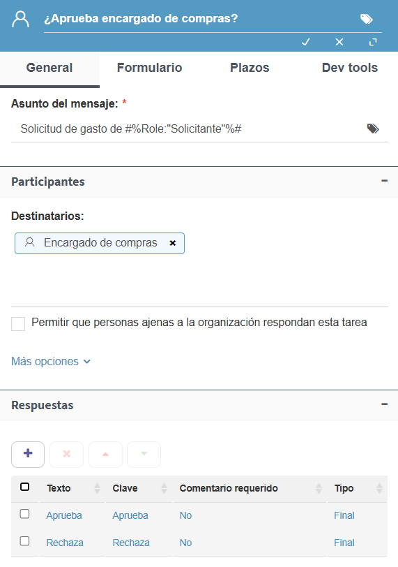](_images/image563.png)

Figura 175 Panel de propiedades del paso “¿Aprueba encargado de compras?” - Mensaje[](#id50 "Link to this image")

El vencimiento de la pregunta se configura en la solapa “Plazos” a la cual se accede desde el panel de configuración del paso. Queremos crear una acción temporal de tipo “vencimiento” que se dispare una vez transcurrido un día después del envío de la pregunta.

Para crear la nueva acción temporal ([Figura 176](#newexpiration)):

1.  Haz clic en “+”.
    
2.  En el panel “Configuración de acción temporizada”, selecciona “Vencimiento” (la opción de más a la derecha).
    
3.  En “Información de temporizador”, selecciona “Tiempo fijo”. Ingrese “1” en la cantidad de unidades de tiempo y seleccione “Días” como unidad de tiempo.
    
4.  Haz clic en el tic para agregar la acción a la tabla de control de tiempos.
    
    [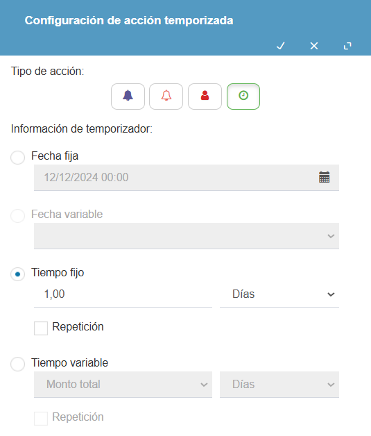](_images/image573.png)
    
    Figura 176 Creación de vencimiento[](#id51 "Link to this image")
    

Luego de hacer esto la acción temporal aparecerá en la lista de acciones temporales del paso. En la [Figura 177](#timecontrolproperties) se muestra la sección “Plazos”, luego de haber creado la acción temporal.

Figura 177 Menú de propiedades del paso ¿Aprueba encargado de compras? - Plazos[](#id52 "Link to this image")

#### ¿Aprueba?[](#aprueba "Link to this heading")

En este paso definiremos si es necesario evaluar si el gerente de compras y el director deben responder la tarea o debemos notificarle el rechazo al solicitante. Para esto, debemos abrir la configuración del paso de compuerta exclusiva, donde podremos ver que las dos conexiones que tiene este paso ([Figura 178](#exclusivegatewaywithtwosteps)). Esto nos permite definir las condiciones que queremos que se cumplan para que el flujo continúe por dicho paso.

[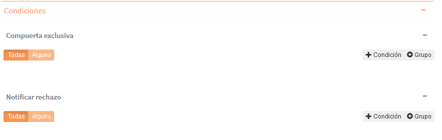](_images/image593.png)

Figura 178 Compuerta exclusiva con los 2 pasos por los que continúa[](#id53 "Link to this image")

Debemos agregar para cada paso una nueva condición que dependiendo de la respuesta a la pregunta del paso anterior, se vaya en una dirección o la otra. Para el paso de “Tarea de notificación a usuario”, agregaremos una nueva condición con el botón de “+Condición” y comenzaremos a escribir “¿Aprueba el encargado de compras?” y seleccionaremos dicha tarea en el cuadro autocompletado. Entonces, en el segundo cuadro de texto comenzaremos a escribir la respuesta que deseamos, en este caso “Rechazo” como muestra la [Figura 179](#exclusive-gateway-configuration).

[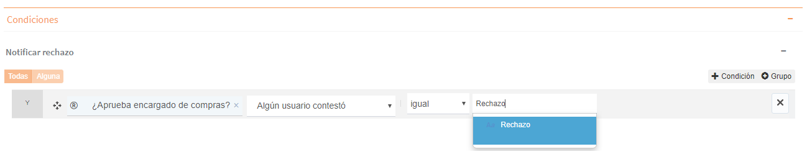](_images/image615.png)

Figura 179 Configuración de la compuerta exclusiva para la tarea “Notificar rechazo” con su cuadro de autocompletado[](#id54 "Link to this image")

Para la compuerta exclusiva, repetiremos estos mismos pasos pero cambiaremos la respuesta del segundo cuadro de texto por “Apruebo”. La configuración de la compuerta exclusiva debería quedar similar a la [Figura 180](#configuredexclusivegateway).

[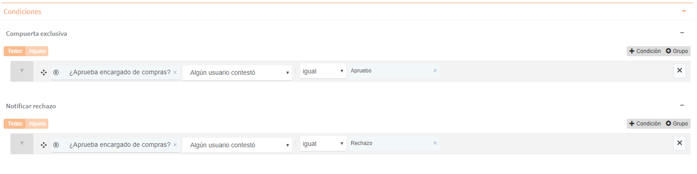](_images/image633.png)

Figura 180 Compuerta exclusiva correctamente configurada[](#id55 "Link to this image")

#### Compuerta exclusiva[](#compuerta-exclusiva-1 "Link to this heading")

El siguiente paso a configurar es similar al paso anterior, la diferencia es que lo configuraremos en dependencia de un dato de aplicación en lugar de una tarea. En este caso, veremos dos de los tres pasos a los cuales está conectada esta compuerta, ya que la tarea de notificación fue configurada como conexión por defecto cuando diseñamos el flujo. El proceso continuará por esta conexión cuando no se cumpla ninguna de las condiciones anteriores. Configurar las conexiones dependiendo del dato de aplicación es similar a cuando se evalúa una tarea de usuario.

Debemos ingresar a la configuración de la compuerta exclusiva y para “Debe aprobar gerente de compras”, agregaremos una nueva condición. En el primer recuadro, debemos seleccionar el dato “Monto total”, cambiaremos igual por “Mayor a” y en el segundo recuadro escribiremos “500”. Luego, debemos agregar una segunda condición a esta misma tarea, la cual también tendrá el dato “Monto total”, pero con la condición “Menor o igual a” y en el segundo recuadro “1000”.

Para “Deben aprobar gerente de compras y director”, debemos agregar una única condición, nuevamente con el dato “Monto total” pero con la condición “Mayor a” y luego “1000”. El resultado debería ser similar al de la [Figura 181](#secondexclusivegatewayconfiguration).

[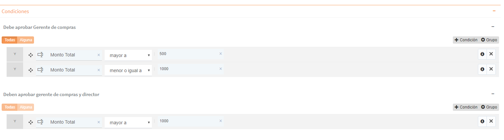](_images/image643.png)

Figura 181 Configuración de la segunda compuerta exclusiva[](#id56 "Link to this image")

#### Debe aprobar gerente de compras[](#debe-aprobar-gerente-de-compras "Link to this heading")

En este paso, configuraremos el rol aprobador gerencial para que sea el mismo que el rol de “gerente de compras”. Para hacer esto, debemos agregar una nueva operación de la misma manera que cuando configuramos el paso “Calcular monto total”.

Dentro del “Constructor de expresión de fórmula”, podemos también seleccionar un rol. En este caso, debemos seleccionar el “Aprobador gerencial” y en el operando, seleccionaremos el rol “Gerente de compras” ([Figura 182](#formulabuilder2)).

[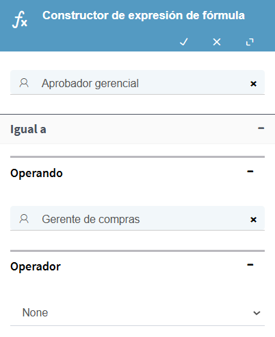](_images/image653.png)

Figura 182 Constructor de expresión de fórmula para el Gerente de compras[](#id57 "Link to this image")

#### Deben aprobar gerente de compras y director[](#deben-aprobar-gerente-de-compras-y-director "Link to this heading")

En este paso, configuraremos el rol aprobador gerencial al igual que en el paso anterior, sólo que, tendrá tanto el rol del “Gerente de compras”, como el de “Director”.

En el “Constructor de expresión de fórmula”, seleccionaremos al “Aprobador gerencial” y en el operando, seleccionaremos el rol “Gerente de compras” de la misma forma que hicimos con el paso anterior, pero esta vez, además cambiaremos el operador por “+”. Hacer esto nos permitirá agregar un nuevo operando, al cual le asignaremos el rol “Director” ([Figura 183](#formulabuilder3)).

[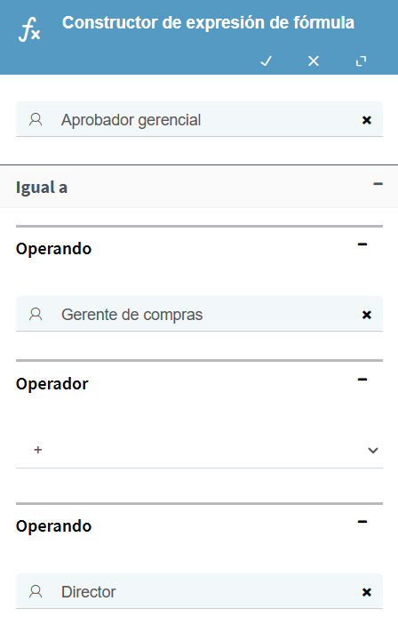](_images/image663.png)

Figura 183 Constructor de expresión de fórmula para el Gerente de compras y el Director[](#id58 "Link to this image")

#### Aprobación gerencial[](#aprobacion-gerencial "Link to this heading")

Este paso comparte muchas características con el paso “¿Aprueba encargado de compras?”, Qflow te permite copiar pasos incluida su configuración. Puedes hacer esto borrando el paso “Aprobación gerencial” y luego seleccionando el paso “¿Aprueba encargado de compras?” y presionando “Control + C” para copiar y luego “Control + V” para pegar. Luego en la configuración, debemos ajustarle el nombre, para que vuelva a ser “Aprobación gerencial” y cambiar el destinatario de la tarea (en la sección de “Participantes”) para que sea el “Aprobador gerencial”. De esta manera, la tarea notificará a todos los usuarios que estén en el rol del aprobador gerencial, que pueden ser solo el gerente de compras o el gerente y el director. También, en la sección de respuestas dentro del “Más opciones”, debemos cambiar el criterio de respuesta múltiple a “todos los usuarios han contestado” para que la tarea sólo pueda continuar una vez que todos los aprobadores hayan respondido en lugar de sólo uno ([Figura 184](#multipleresponse)).

[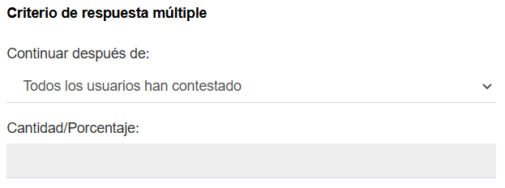](_images/image673.png)

Figura 184 Criterio de respuesta múltiple[](#id59 "Link to this image")

Una vez configurada la tarea, debemos volver a unir la tarea con las conexiones que tenía anteriormente. Recuerda que la conexión entre la tarea de usuario y la de notificación correspondiente a notificar el rechazo, se hace desde el evento temporizador de borde y no desde la tarea en sí misma.

#### ¿Aprueba?[](#aprueba-1 "Link to this heading")

Para esta compuerta exclusiva, debemos agregar nuevamente las condiciones para cada paso. En “Notificar rechazo” agregaremos una nueva condición en la primer casilla, debemos seleccionar el paso “Aprobación gerencial” y en la segunda casilla la respuesta “Rechazo”. Para la segunda tarea, también utilizaremos el paso “Aprobación gerencial”, pero en este caso, debemos cambiar la opción “Algún usuario contesto” por “Todos los usuarios contestaron” ya que queremos que se apruebe el gasto si y sólo si todos los participantes de la aprobación aprueban el gasto. Finalmente, en la segunda casilla seleccionaremos “Apruebo” como muestra la [Figura 185](#exclusivegatewayconfiguration2).

[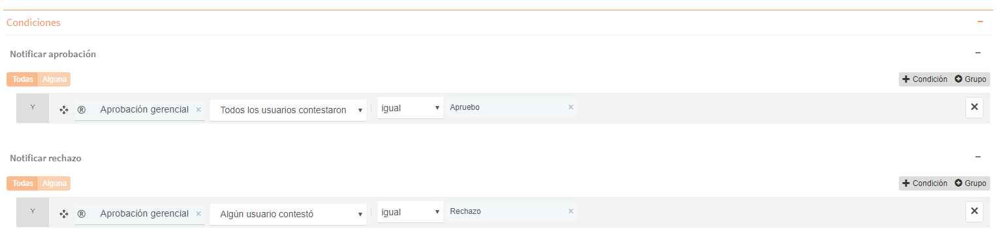](_images/image683.png)

Figura 185 Configuración de paso compuerta exclusiva para la aprobación gerencial[](#id60 "Link to this image")

#### Notificar rechazo[](#notificar-rechazo "Link to this heading")

Este paso, se debe configurar correctamente para que el solicitante reciba una notificación de Qflow, que indique que la solicitud ha sido rechazada. Para lograr esto, hay que editar las propiedades “Asunto del mensaje” y “Destinatarios”, que se encuentran en la solapa “General”, dentro del menú de propiedades del paso.

Esto se hace de manera análoga a como ya se hizo en las tareas de usuario. En el asunto, ingresa “Su solicitud ha sido rechazada” y selecciona el rol “Solicitante” como destinatario. El panel de propiedades del paso, con estos cambios, se muestra en la [Figura 186](#rejectpropertiesmenu).

[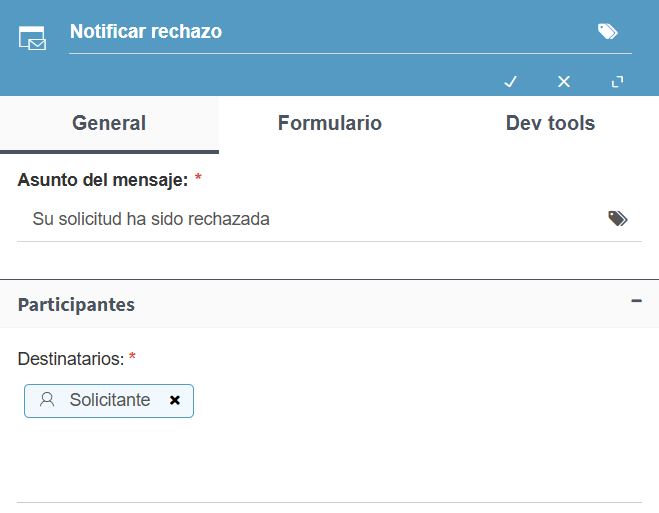](_images/image693.png)

Figura 186 Menú de propiedades del paso Notificar rechazo – Mensaje[](#id61 "Link to this image")

Además, hay que cambiar la visibilidad de los datos en el paso, pues se quiere que el solicitante pueda ver todos los datos involucrados en este proceso. Esto se hace cambiando la visibilidad a “Sólo lectura” desde la solapa “Formulario” de las propiedades del paso.

#### Notificar aprobación[](#notificar-aprobacion "Link to this heading")

Este paso se configura igual que el paso “Notificar rechazo”, salvo que el nombre del paso debería ser “Notificar aprobación” y el asunto “Su solicitud ha sido aprobada”.

#### Rechazo compra[](#rechazo-compra "Link to this heading")

Este es el paso que marca el fin del proceso cuando la solicitud es rechazada. Se puede utilizar la “Bandera” para distinguir los procesos que finalizaron en este paso de los que terminaron en el otro paso de fin.

Abre la ventana de propiedades del paso y escribe “Rechazada” en el campo “Bandera”. Además, se puede chequear la opción “Progreso = 100%” para que, al terminar, el flujo quede marcado con un progreso de 100%.

[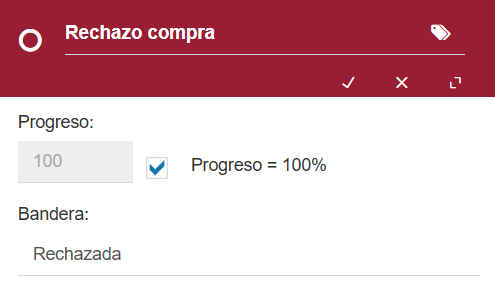](_images/image703.png)

Figura 187 Menú de propiedades del paso Rechazo compra[](#id62 "Link to this image")

#### Apruebo compra[](#apruebo-compra "Link to this heading")

Este paso se configura igual que el paso “Rechazo compra”, salvo que el nombre es distinto y la bandera se debería cambiar por “Aprobada”.

El diseño final del proceso debería verse similar al de la [Figura 188](#flowfinaldesign).

Figura 188 Diseño final del proceso[](#id63 "Link to this image")

### Publicación[](#publicacion "Link to this heading")

Ahora que el proceso está terminado, es tiempo de guardarlo y publicarlo.

Los cambios realizados en la plantilla se guardan automáticamente como una copia temporal. Sin embargo, estos cambios no se reflejarán en el proceso hasta que sean confirmados. Esto permite realizar modificaciones sin afectar a los procesos en ejecución. Para confirmar y aplicar los cambios al proceso real debes hacer clic en «Guardar» y seleccionar «Guardar y finalizar cambios». En caso de querer modificar la configuración en el futuro, haz clic en «Editar» para volver a habilitar la edición.

Finalmente, para que se puedan iniciar procesos de la plantilla desde Qflow Task, es necesario publicarla. Para lograr esto, haz clic en el botón de publicar, ubicado en la parte derecha de la barra de acciones. Alternativamente, puedes hacer clic derecho sobre la plantilla en el explorador de soluciones y seleccionar “Publicar”. Una vez publicado el proceso se abrirá un cartel como el de la [Figura 189](#publishsuccess). Si hacemos clic en “Iniciar”, se abrirá una nueva página en la que podremos iniciar un proceso de la plantilla recién publicada.

Figura 189 Proceso publicado con éxito[](#id64 "Link to this image")

## Ejecución del proceso[](#ejecucion-del-proceso "Link to this heading")

Esta sección describe cómo ejecutar el proceso.

### Ingreso a Qflow Task[](#ingreso-a-qflow-task "Link to this heading")

Ingresamos a él a través del menú de navegación de herramientas, como se muestra en la [Figura 190](#toolnavigation)

Figura 190 Navegar por herramientas[](#id65 "Link to this image")

Opcionalmente, se puede también acceder con el navegador a _https://{espacioDeTrabajo}.task.qflowbpm.com_ (donde {espacioDeTrabajo} debe ser reemplazado por el nombre de su espacio de trabajo sin espacios).

Se ingresará con el usuario con el que se ingresó a Qflow Access.

En cambio, si el usuario actual no tiene permisos, se pedirán las credenciales de un usuario que sí los tenga, tal como se muestra en la [Figura 191](#logintask). En ese caso, se debe ingresar el nombre y la contraseña de un usuario que tenga permisos para ingresar a Qflow Task.

También permite autenticarse con cuenta de Microsoft y Google (solo en caso de que el usuario exista en el sistema de Qflow)

Figura 191 Login Qflow Task[](#id66 "Link to this image")

### Inicio de un proceso[](#inicio-de-un-proceso "Link to this heading")

Ahora ya estamos en Qflow Task, como se muestra en la [Figura 192](#qflowtaskhome). Esta herramienta permite ejecutar todo tipo de operaciones relacionadas con los procesos en ejecución. Algunas de estas operaciones son: iniciar un proceso, responder preguntas o tareas pendientes y ver notificaciones recibidas.

Comencemos por iniciar un proceso de la plantilla que acabamos de crear. Para esto iremos a “Iniciar proceso”, que está en el menú de la izquierda. Allí se muestra una lista con todas las plantillas de proceso que tienen una versión publicada.

Si hace clic en una plantilla de la lista, el usuario es dirigido a la página de inicio del proceso. Allí se ingresa la información general del proceso y valores para los datos de aplicación que se marcaron como editables en el paso de inicio de la versión de plantilla. El formulario a completar se muestra en la [Figura 193](#startflowform). Una vez que ingresemos los datos haremos clic en “Iniciar” para comenzar el proceso.

Figura 192 Página principal de Qflow Task[](#id67 "Link to this image")

[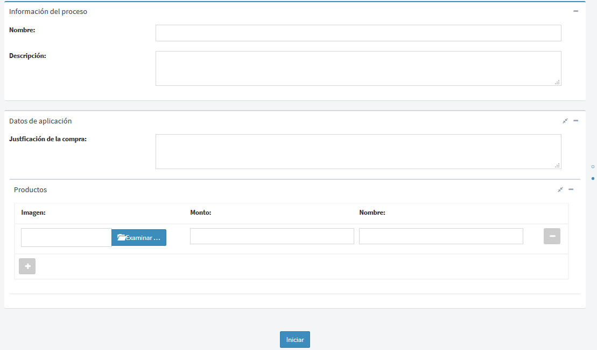](_images/image763.png)

Figura 193 Formulario de inicio del proceso para la plantilla creada[](#id68 "Link to this image")

### Responder preguntas[](#responder-preguntas "Link to this heading")

Luego de iniciado el proceso, Qflow muestra una página con información general del proceso que fue iniciado. Desde esta página podremos acceder a una vista más detallada del proceso, haciendo clic en el botón  en la esquina superior derecha y luego haciendo clic en “Detalles del proceso”. Esto nos llevará a una página que muestra información detallada del proceso, la cual está separada en varias solapas. En particular, resulta interesante observar la solapa “General”, que muestra una tabla con información general del proceso y la solapa “Diseño” ([Figura 194](#flowdetails)), que muestra el diagrama del proceso y qué pasos se han ejecutado. En esta última solapa se puede observar que el proceso está en el paso “¿Aprueba encargado de compras?”. El proceso se quedará en este paso hasta que la pregunta sea respondida o se cumpla el vencimiento.

Para ir al formulario que se usa para responder la pregunta podemos hacer clic en el paso de pregunta en la solapa “Diseño” y luego en la tarea mostrada en la tabla “Tareas del paso”. Una alternativa es hacer clic en el vínculo “Tareas activas del proceso”, que se encuentra en el menú de páginas relacionadas en la esquina superior derecha y doble clic sobre la fila mostrada en la vista.

El formulario de respuesta de la pregunta se muestra en la [Figura 195](#flowresponseform).

Allí, el encargado de compras puede ver en el campo “Asunto” el nombre del usuario solicitante (recordar que habíamos usado una etiqueta) y el monto del gasto solicitado. También puede ingresar un comentario si el paso tiene la configuración correspondiente. Luego, debe elegir cuál es su respuesta, seleccionando “Apruebo” o “Rechazo” en la lista en la que se puede seleccionar la respuesta. Finalmente, debe confirmar su respuesta, haciendo clic en “Responder”. Ingresa un comentario y responde la pregunta con la respuesta “Apruebo”.

[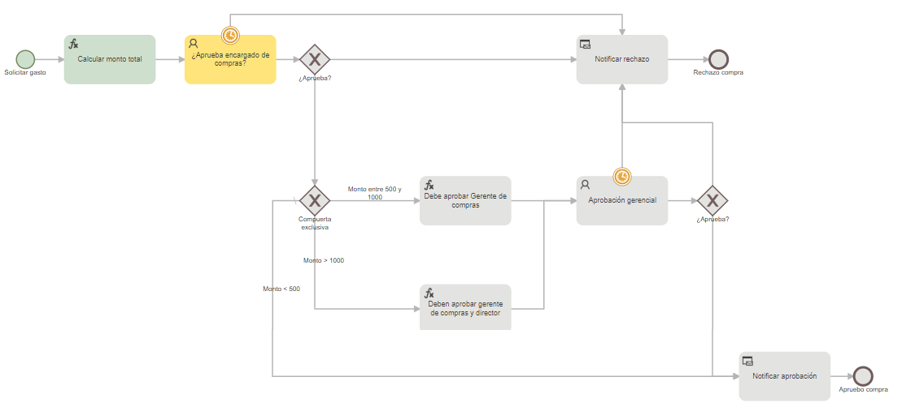](_images/image773.png)

Figura 194 Detalles del proceso[](#id69 "Link to this image")

[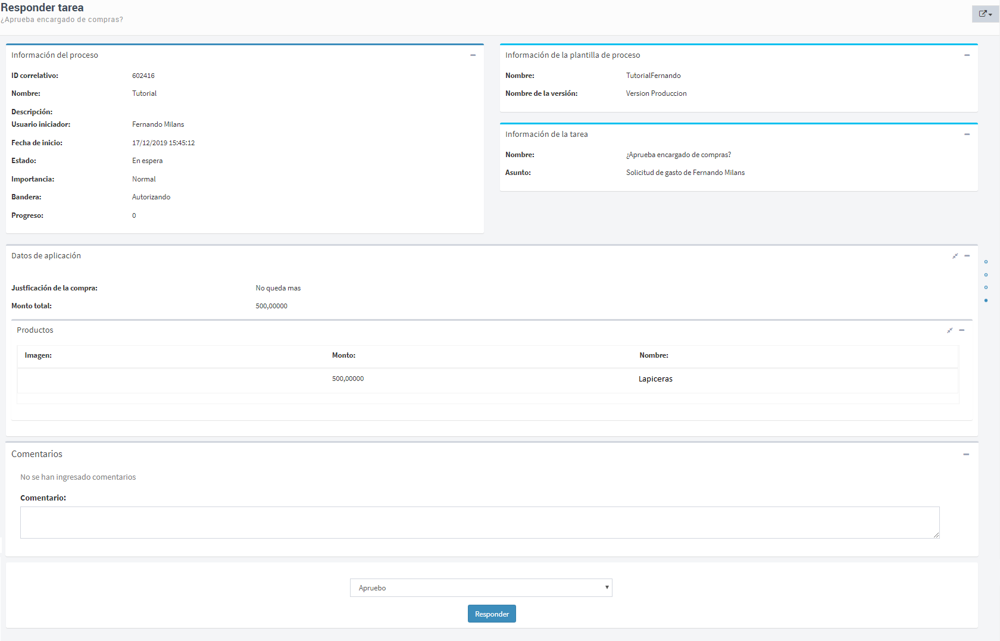](_images/image783.png)

Figura 195 Formulario de respuesta de la pregunta[](#id70 "Link to this image")

### Observación de notificaciones[](#observacion-de-notificaciones "Link to this heading")

Luego de responder la pregunta, diríjete nuevamente a la página de detalles del proceso. Observa en la solapa “Diseño” que el proceso ha terminado de ejecutar el paso “¿Aprueba encargado de compras?” y el grafo continuó automáticamente, dependiendo del monto que hayas ingresado en la tarea, si el monto ingresado es menor a 500 dólares, la tarea debería haber avanzado hasta el paso “Notificar aprobación”, en caso que hayas ingresado un valor mayor a 500 dólares, la tarea debió haber avanzado hasta el paso “Aprobación general” y deberás responder esta tarea para poder completar el proceso.

Una vez contestadas todas las tareas de usuario del proceso, si accedes a la solapa “General”, puedes observar que el “Estado” es “Finalizado”. Esto indica que el proceso ha terminado su ejecución.

Queda por ver la notificación enviada al solicitante, en la cual se indica que su solicitud de gasto ha sido aprobada. Esta notificación puede verse haciendo clic en el paso “Notificar aprobación” en el diseño y luego haciendo clic en la notificación en el panel “Tareas del paso”. En la [Figura 196](#notificationform) se muestra el formulario de la notificación. Allí, el solicitante ve en el asunto que su solicitud ha sido aprobada. También puede ver el comentario que ingresó el aprobador y el monto del gasto que había solicitado.

Se recomienda, en este momento, ejecutar un buen número de procesos, probando los diferentes caminos que definimos en el diseño del proceso. Por ejemplo, ejecutar procesos donde el monto sea mayor a 500, 1000, etc. y dar respuestas diferentes a las preguntas de aprobación de la solicitud de gastos.

[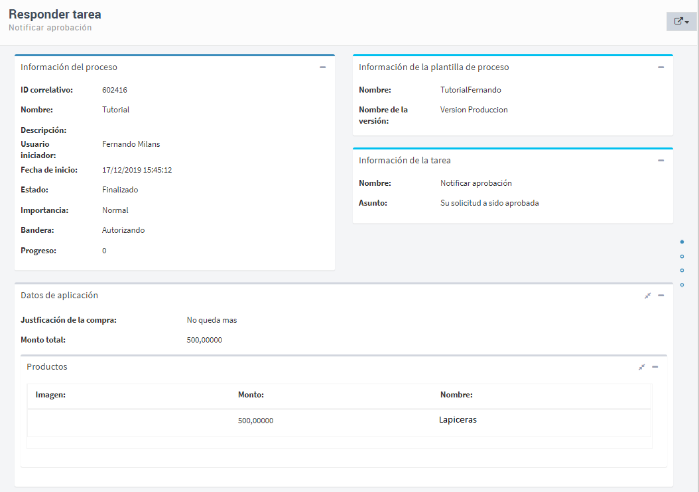](_images/image792.png)

Figura 196 Formulario de la notificación[](#id71 "Link to this image")

### Bitácora de comentarios[](#bitacora-de-comentarios "Link to this heading")

Si se configuraron las opciones de agregar comentarios, o de agregar comentarios a las respuestas, las podremos ver en la bitácora de comentarios. Para acceder a ella, debemos ir a los detalles de un proceso, y abrir la pestaña “Detalle”. Aquí podremos ver una linea temporal con las respuestas y los comentarios que se hayan guardado ([Figura 197](#commentslog)).

[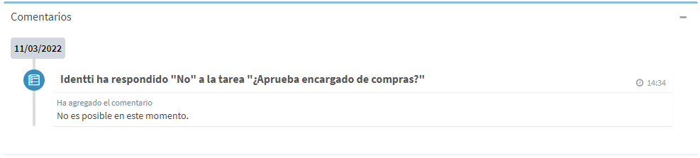](_images/image893.png)

Figura 197 Bitácora de comentarios[](#id72 "Link to this image")

### Vistas[](#vistas "Link to this heading")

Podemos crear una vista personalizada que muestre solamente los procesos de la plantilla que acabamos de crear (la vista “Procesos”, que ya viene predefinida, muestra todos los procesos). Para ir a la página donde se crean las vistas haz clic en “Vistas”, en el menú lateral de Qflow Task. Una vez que hayas hecho clic en ese vínculo, Qflow muestra una página con las vistas disponibles.

Para crear una vista de procesos, haz clic en el botón “+”. Al hacer esto, se mostrará la página de selección de paquete y tipo de ítems que listará la vista como se muestra en la [Figura 198](#packageselectionforview). El paquete por defecto es el “Raíz” y se dejará ese valor. Como queríamos una vista sobre procesos, en el panel de la derecha hay que seleccionar el ítem “Procesos” y luego hacer clic en “Continuar”. Esto nos lleva a la página de edición de la nueva vista.

[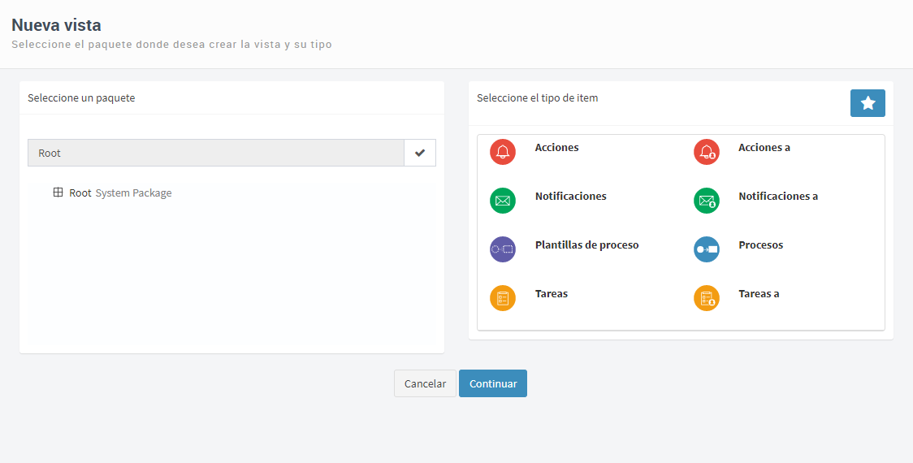](_images/image802.png)

Figura 198 Selección de paquete e ítem para una nueva vista[](#id73 "Link to this image")

En el panel “Detalles” ingresa “Solicitudes de gasto” en el campo “Nombre”, y marca la opción “Vista destacada”.

En el panel “Filtros” agregaremos un filtro para que la vista sólo muestre procesos de la plantilla que creamos anteriormente. Para agregar un filtro:

1.  Haz clic en el botón “+” del panel “Filtros”. Eso hace que Qflow despliegue una tabla con tres solapas.
    
2.  En la solapa “Columnas de sistema”, haz haga doble clic sobre el elemento “Nombre de la plantilla”. Al hacerlo se agregará una fila en el árbol de filtros más abajo.
    
3.  En la fila agregada, deja el operador por defecto (“igual”) y en el campo a la derecha del operador ingresa el valor “Tutorial”.
    

Luego de esto, la página debería verse como en la [Figura 199](#viewconfiguration). Haz clic en “Listo” para crear la nueva vista. Nota que la vista aparece en el menú lateral, bajo el grupo “Vistas”. Al hacer clic en ese vínculo, podrás ver el listado de elementos de la vista ([Figura 200](#tutorialmanagetoolpermissions)).

[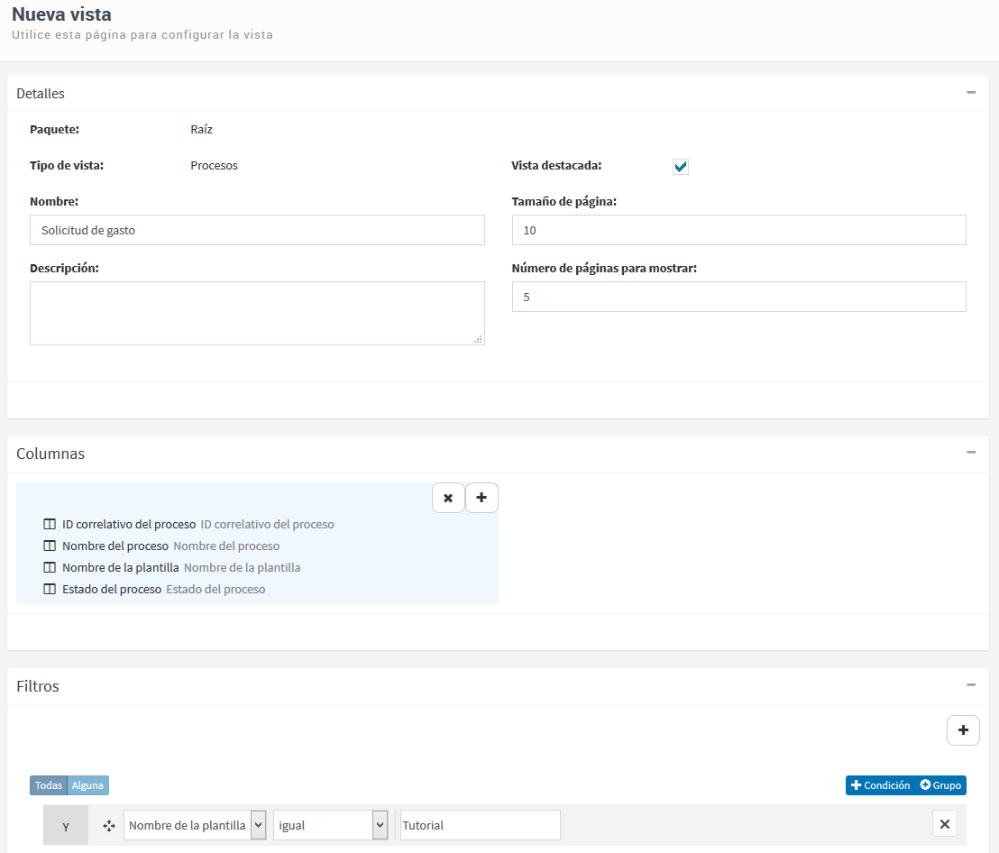](_images/image813.png)

Figura 199 Configuración de una vista[](#id74 "Link to this image")

[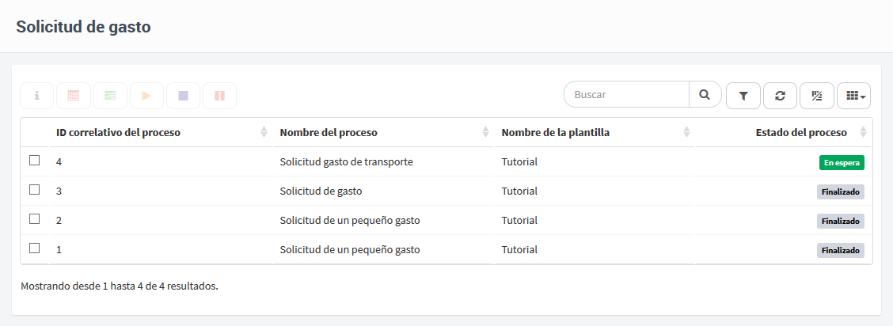](_images/image823.png)

Figura 200 Listado de la vista[](#id75 "Link to this image")

### Gráficas[](#graficas "Link to this heading")

Podemos crear gráficas personalizadas para realizar un seguimiento a más alto nivel de los procesos. Agregaremos una gráfica que muestre los procesos de la plantilla que creamos, discriminando por su bandera.

Para crear una gráfica de procesos hay que acceder al vínculo gráficas del menú lateral y seguir el mismo procedimiento que en la creación de una vista. Luego de haber seleccionado el paquete “Raíz” y el ítem “Procesos” nos encontramos con la página de edición de la nueva gráfica.

En el panel “Detalles” ingresa, en el campo “Nombre”, “Procesos por bandera”.

En el panel “Apariencia” selecciona el tipo de gráfica “Columnas agrupadas” como se muestra en la [Figura 201](#chartcreation). En “Medida” selecciona “Cantidad” como tipo de agregación y haz clic el botón de la barra debajo de “Columna” para desplegar los tipos de columnas disponibles. Haz doble clic en el elemento “ID correlativo del proceso” de la solapa “Columnas de sistema” para que cuente la cantidad de procesos distinguiéndolos por su identificador.

[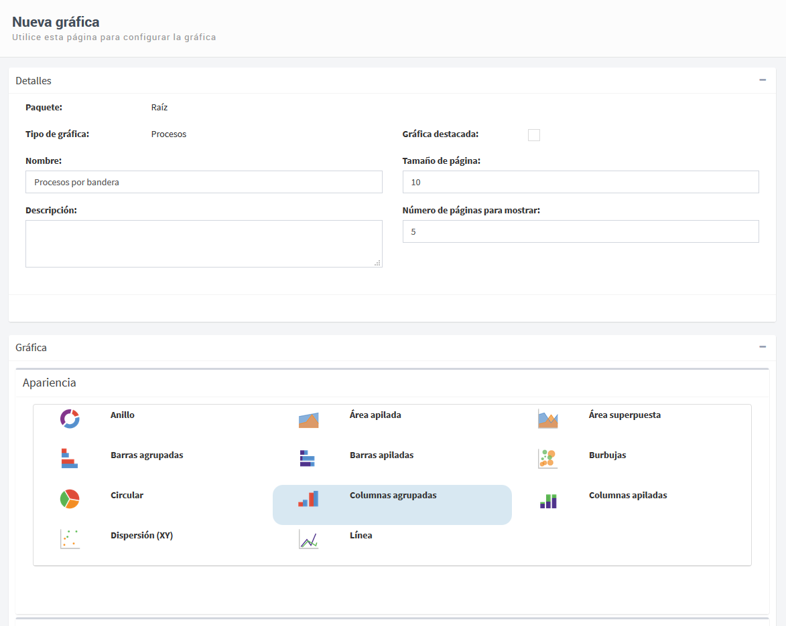](_images/image833.png)

Figura 201 Creación de una gráfica: detalles y selección de apariencia[](#id76 "Link to this image")

En el panel “Dimensiones” haz clic en el botón “+” para agregar como dimensión la columna “Bandera del proceso”. Selecciónala haciendo doble clic en la lista.

Debemos incluir columnas que formarán parte de la vista generada a partir de la información de la gráfica y que nos brinden información útil sobre cada proceso. Para hacerlo, en el panel “Columnas” haz clic en el botón “+” y de la misma forma que con las dimensiones, se agregue las columnas “ID correlativo del proceso”, “Nombre del proceso”, “Fecha de inicio del proceso”, “Estado del proceso” y “Bandera del proceso”.

Por último, si queremos que la gráfica refleje los datos de los procesos de la plantilla que creamos, se debe agregar un filtro por nombre de plantilla de la misma forma que se hizo para la vista anterior.

Finalmente, la página debería verse como en la [Figura 202](#measuredimensionandcolumns). Para finalizar la creación de la gráfica haz clic en “Listo”.

[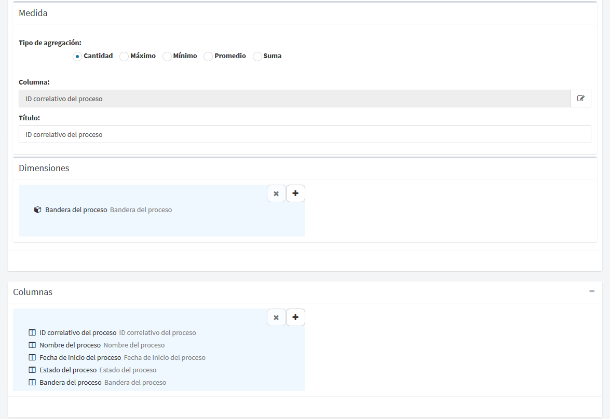](_images/image843.png)

Figura 202 Creación de una gráfica: configuración de medida, dimensiones y columnas[](#id77 "Link to this image")

### Tablero de control principal[](#tablero-de-control-principal "Link to this heading")

Se dispone de un tablero de control en la página principal de Qflow Task, en el que se puede tener información útil al alcance de la mano. Es posible añadir vistas, indicadores y gráficas que estarán siempre actualizadas.

Agregaremos al tablero de control principal la vista y la gráfica que creamos. Para hacerlo, primero hay que ir a la página de inicio, haciendo clic en el logo de Qflow Task, que está en el cabezal. Luego hay que hacer clic en el botón con ícono de lápiz para editar el tablero, que se encuentra en la parte superior derecha de la página principal. Se mostrará una tabla con tres solapas que lista los elementos que se pueden agregar al tablero, y debajo de ella un área que oficiará de contenedor donde se incluirán los elementos, como se muestra en la [Figura 203](#dashboardedition). En la solapa “Vistas” navegaremos hasta el elemento “Solicitud de gasto” y lo agregaremos al área inferior arrastrándolo, con doble clic, con la opción “Agregar del menú contextual del elemento o con el botón “+” de la tabla. De la misma forma, en la solapa “Gráficas” seleccionamos la gráfica “Procesos por bandera” y la agregamos al tablero.

Luego de hacer esto, se pueden modificar la disposición y dimensiones de la gráfica y la vista en el tablero para que ocupen todo el ancho de la página y tengan el largo suficiente para visualizar todo el contenido. Finalmente, para guardar los cambios haz clic en el botón con el ícono de disquete que se encuentra en la parte superior derecha de la página y el tablero de control principal se verá similar al de la [Figura 204](#editeddashboard).

[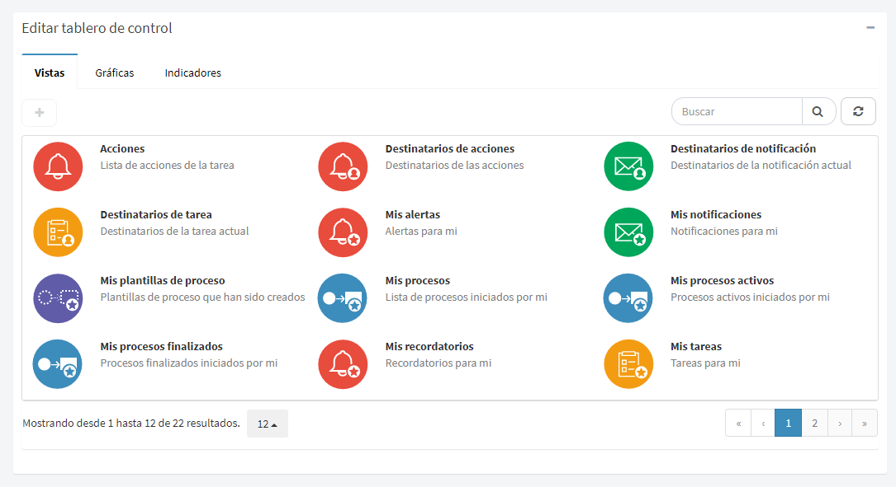](_images/editdashboard.png)

Figura 203 Modificación del tablero de control principal[](#id78 "Link to this image")

[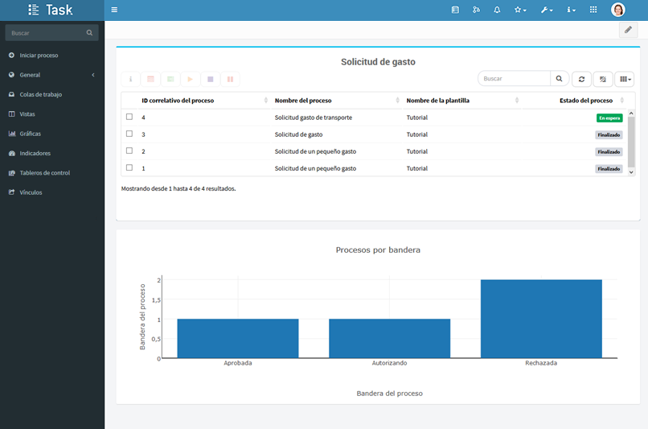](_images/editeddashboard.png)

Figura 204 Tablero de control principal modificado[](#id79 "Link to this image")

[Anterior](26-QflowToolsTutorial.md "Introducción a las herramientas de Qflow") [Siguiente](23-DesignTutorial.md "Diseña un proceso de quejas")

- - -

© Derechos de autor 2025, Urudata Software.

jQuery(function () { SphinxRtdTheme.Navigation.enable(true); }); window.dataLayer = window.dataLayer || \[\]; function gtag(){dataLayer.push(arguments);} gtag('js', new Date()); gtag('config', 'G-LMDS8S4B42', { 'anonymize\_ip': false, });
