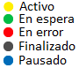
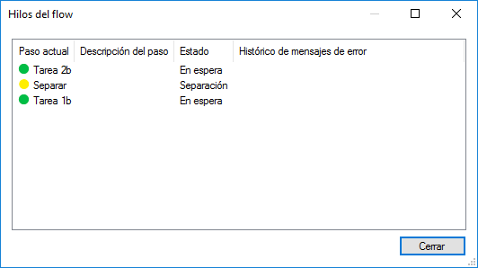

  Administración de procesos de negocio \[Deprecado\] — Qflow Cloud        

*   [Qflow](https://qflowbpm.com/es/)
*   [Foro](https://forum.qflowbpm.com/)
*   [Centro de Ayuda](https://qflowbpm.com/es/centro-de-ayuda/)
*   [Contáctanos](https://qflowbpm.com/es/contacto/)

[Qflow](index.html)

Cloud (latest) 5.5 OnPremise (latest) 5.2 OnPremise 5.1.1 OnPremise

English Español

selectElement('versionSelect', getVersion()); selectElement('languageSelect', getLanguage()); function selectElement(id, valueToSelect) { let element = document.getElementById(id); element.value = valueToSelect; } function getLanguage() { if (window.location.href.includes('/es/')) { return '/es/'; } else { return '/en/'; } } function getVersion() { if (window.location.href.includes('/qflowcloud/')) { return '/qflowcloud/'; } else if (window.location.href.includes('/qflow5\_1\_1/')) { return '/qflow5\_1\_1/'; } else if (window.location.href.includes('/qflow5\_2/')) { return '/qflow5\_2/'; } else { return '/qflow5\_5/'; } } function redirectToSite(url) { var http = new XMLHttpRequest(); http.onreadystatechange = function() { if (http.readyState === 4) { if (http.status !== 404) { window.location.href = url; } else { window.location.href = url.replace(url.substr(url.lastIndexOf('/') + 1), 'index.html'); } } } http.open('HEAD', url, true); http.send(); }

  

Inicio

*   [Novedades](29-ReleaseNote.html)
*   [Introducción a Qflow](01-QflowIntroduction.html)
*   [Tutoriales](TutorialsIndex.html)
*   [Qflow Task](04-QflowTask.html)
*   [Qflow Design](15-QflowDesign.html)
*   [Qflow Team](18-QflowTeam.html)
*   [Qflow Admin](19-QflowAdmin.html)
*   [Consumo de Q-points](21-Q-pointsConsumption.html)
*   [Conectores](34-ConnectorsIndex.html)
*   [Desarrolladores](31-Development.html)

[Qflow](index.html)

*   
*   Administración de procesos de negocio \[Deprecado\]

- - -

# Administración de procesos de negocio \[Deprecado\][](#administracion-de-procesos-de-negocio-deprecado "Link to this heading")

## Introducción[](#introduccion "Link to this heading")

El propósito de este manual es explicar el funcionamiento del administrador de procesos del negocio. El administrador de procesos del negocio permite realizar operaciones en los procesos: pausarlos, hacerlos retroceder, etc. Estas operaciones pueden ser realizadas de forma masiva, es decir, es posible seleccionar varios procesos simultáneamente para ejecutar alguna operación sobre ellos.

### Advertencia de producto deprecado[](#advertencia-de-producto-deprecado "Link to this heading")

Note que este administrador está deprecado, y sólo puede ser usado con el espacio de trabajo principal. Por más información sobre los espacios de trabajo, consulte el manual de [Qflow Admin](19-QflowAdmin.html).

## Conexión con el servidor y seguridad[](#conexion-con-el-servidor-y-seguridad "Link to this heading")

La primera vez que ejecute el administrador de procesos de negocio, deberá indicarle a la herramienta cómo ésta debe conectarse con el servidor. Esta sección también describe cómo configurar los permisos de acceso a la herramienta.

### Configuración de la conexión con el servidor[](#configuracion-de-la-conexion-con-el-servidor "Link to this heading")

La primera vez que intente abrir el administrador Qflow mostrará la ventana en la que se configura la conexión con el servidor de los servicios de backend (`ConectToServer`). La ventana muestra las siguientes opciones:

*   **Nombre del servidor:** nombre del servidor con el que se desea conectar.
    
*   **Sub dirección:** subdirección del servidor. Este dato también debe ser conocido de antemano, pero por defecto es 6006 y, en general, no es necesario modificarlo. Si 6006 no funciona, consulte al administrador de la red.
    
*   **Información de ingreso:**
    
    *   **Usar mis credenciales de red:** utiliza las credenciales del usuario actual.
        
    *   **Usar las siguientes credenciales:** permite especificar un nombre de usuario y contraseña que se utilizará para hacer la conexión con el servidor.
        
*   **Conectar automáticamente:** esta opción hace que la herramienta se conecte automáticamente las próximas veces, utilizando esta configuración.
    

Conexión con el servidor[](#id2 "Link to this image")

Una vez configuradas todas las opciones, haga clic en el botón “Conectar” para conectarse al servidor seleccionado.

### Opciones de seguridad[](#opciones-de-seguridad "Link to this heading")

Las opciones de seguridad permiten determinar quién puede y quién no puede acceder al administrador de procesos del negocio, y en caso de poder hacerlo, qué operaciones puede realizar.

Para acceder a la ventana de opciones de seguridad, seleccione, en el menú “Herramientas”, la opción “Opciones”. Qflow mostrará una ventana como la que se muestra en la `Options`.

Opciones[](#id3 "Link to this image")

La primera solapa de la ventana muestra diversos datos:

*   **Nombre de la herramienta**
    
*   **Versión de la herramienta**
    
*   **Usuario actual:** usuario que está ejecutando la herramienta.
    
*   **Conectado a:** nombre del servidor con el que la herramienta está conectada.
    

La segunda solapa (`Security`) permite configurar el acceso a la herramienta:

Seguridad[](#id4 "Link to this image")

En la parte superior de la ventana (donde dice “Nombre del rol o miembro organizacional”) se muestran los roles de seguridad, grupos y usuarios que tienen acceso a la herramienta. El botón “Agregar…” permite agregar roles de seguridad, grupos y usuarios a la lista, y el botón “Eliminar” permite quitar de la lista el elemento seleccionado. Por más información acerca de los roles de seguridad, consulte el manual de [Qflow Team](18-QflowTeam.html).

En la parte inferior de la pantalla se muestran los permisos que tiene el elemento seleccionado. Hay dos tipos de operación:

*   **Acceder a la herramienta:** permite abrir el administrador de procesos del negocio.
    
*   **Administrar la seguridad:** permite modificar los permisos de acceso a la herramienta.
    

## Descripción de la interfaz de usuario[](#descripcion-de-la-interfaz-de-usuario "Link to this heading")

La `Home` muestra la pantalla del administrador de procesos de negocio. A la izquierda de la pantalla se muestra el árbol de paquetes (el concepto de paquete se explica en el manual de [Qflow Design](15-QflowDesign.html)).

En la parte derecha de la pantalla se muestran los procesos del paquete seleccionado.

El significado de cada una de las columnas que se muestran en la lista de procesos es explicado en la sección [Datos de los procesos](#datos-de-los-procesos).

Pantalla principal[](#id5 "Link to this image")

### Datos de los procesos[](#datos-de-los-procesos "Link to this heading")

Para cada proceso, se muestran los siguientes datos:

*   **Id:** identificador numérico y correlativo del proceso.
    
*   **Nombre:** nombre del proceso.
    
*   **Descripción:** descripción del proceso.
    
*   **Bandera:** la bandera del proceso. Para todos los pasos de un proceso se puede definir una bandera de inicio, y para algunos, una bandera de finalización del paso. Cuando un proceso llega a un paso, la bandera del proceso pasa a ser el texto de la bandera de inicio de ese paso, y cuando el proceso abandona el paso, su bandera pasa a ser la bandera de finalización de ese paso. La bandera, por lo tanto, indica, de cierta forma, el estado del proceso, o en qué punto del proceso se encuentra.
    
*   **Fecha de finalización:** si el proceso está finalizado, esta columna indica la fecha de su finalización.
    
*   **Nombre del template:** nombre del template al que pertenece el proceso.
    
*   **Nombre de la versión:** nombre de la versión de template a la que pertenece el proceso.
    
*   **Estado:** estado del proceso. Los estados posibles son:
    
    *   **Activo:** el proceso está en ejecución y no tiene errores ni está en espera. Un proceso puede estar en este estado si, por ejemplo, está pasando de un paso a otro, o está ejecutando alguna operación.
        
    *   **En espera:** El proceso está esperando la acción de algún usuario.
        
    *   **En error:** por lo menos un hilo del proceso está trancado debido a un error.
        
    *   **Finalizado:** el proceso terminó su ejecución naturalmente (llegó a un paso de fin).
        
    *   **Finalizado por el usuario:** el proceso fue finalizado por algún usuario antes de llegar a un paso de fin.
        
    *   **Pausado:** alguien ha pausado el proceso y éste se encuentra suspendido.
        

Para cada proceso, además, se muestra un ícono con un color que indica su estado. El ícono no hace distinción entre un proceso finalizado normalmente y un proceso finalizado por un usuario.

Ícono que indica el estado de un proceso[](#id6 "Link to this image")

Para ver información de cada hilo de un proceso, haga doble clic sobre el proceso, o haga clic en el botón que está a la derecha del botón de actualizar la lista de procesos (`Home`).

#### Orden de los procesos[](#orden-de-los-procesos "Link to this heading")

Un clic en el cabezal de cualquiera de las columnas que se muestran hace que la lista sea ordenada utilizando los valores de esa columna. El orden puede ser creciente o decreciente, y se indica mediante una flechita que se muestra al lado del nombre de cada columna. Para cambiar el orden de creciente a decreciente o viceversa, haga clic nuevamente en el cabezal de la columna. Por ejemplo, si actualmente la lista está ordenada por nombre de forma creciente, al hacer clic sobre el cabezal de la columna Nombre la lista pasará a estar ordenada de forma decreciente.

### Acciones[](#acciones "Link to this heading")

Arriba de la lista de procesos, hay una barra de herramientas que permite realizar varias acciones (`Actions`). La mayoría de estas acciones se pueden realizar también mediante un menú contextual que aparece al hacer clic sobre un proceso con el botón derecho del ratón.

*   **Actualizar árbol de paquetes:** actualiza el árbol de paquetes para mostrar los cambios que ocurrieron desde la última vez que se actualizó.
    
*   **Filtros:** se pude filtrar la lista de procesos por nombre y por estado. Por más detalles, consulte la sección [Filtrar la lista de procesos](#filtrar-la-lista-de-procesos).
    
    *   **Filtro por nombre:** permite escribir un texto para que la lista de procesos muestre solamente los procesos cuyos nombres contengan ese texto.
        
    *   **Aplicar filtro por nombre:** filtra la lista de procesos según el texto que fue escrito en el filtro por nombre.
        
    *   **Filtro por estado:** permite seleccionar un estado para que la lista de procesos muestre solamente los procesos que estén en el estado seleccionado.
        
*   **Actualizar lista de procesos:** actualiza la lista de procesos para que refleje cambios que ocurrieron desde la última vez que se actualizó. Por ejemplo, alguien puede haber iniciado un proceso, y éste no aparece porque la lista se cargó antes de que eso ocurriera. Para que aparezca, hay que actualizar la lista.
    
*   **Ver hilos de un proceso:** abre una ventana que muestra los hilos del proceso seleccionado. La sección [Hilos de un proceso](#hilos-de-un-proceso) explica el funcionamiento de esa ventana.
    
*   **Operaciones:** acciones que permiten realizar operaciones sobre los procesos. La sección [Operaciones sobre los procesos](#operaciones-sobre-los-procesos) explica cada operación en detalle.
    
    *   Pausar proceso
        
    *   Reanudar proceso
        
    *   Finalizar proceso
        
    *   Eliminar proceso
        
    *   Reintentar hilos en error
        
*   **Ver detalles del proceso:** muestra en el navegador el formulario de detalles del proceso en Qflow Task. Por más información acerca de ese formulario, consulte el manual de [Qflow Task](04-QflowTask.html).
    
*   **Ver formulario de edición del proceso:** muestra en el navegador el formulario de edición del proceso en Qflow Task. Por más información acerca de ese formulario, consulte el manual de [Qflow Task](04-QflowTask.html).
    

Acciones[](#id7 "Link to this image")

### Filtrar la lista de procesos[](#filtrar-la-lista-de-procesos "Link to this heading")

Como lo indica la `Actions`, es posible filtrar la lista de procesos.

#### Filtrar los procesos según su nombre o identificador[](#filtrar-los-procesos-segun-su-nombre-o-identificador "Link to this heading")

Arriba y a la izquierda de la lista de procesos hay una caja de texto en la que se puede escribir un texto (en la `Actions`, la caja de texto está indicada con la etiqueta “Buscar un proceso”). Si usted hace clic en el ícono que representa una lupa(como se muestra en la `Actions` ), Qflow le aplica un filtro a la lista de procesos del paquete seleccionado, de modo que sólo aquellos cuyos nombres contengan el texto ingresado en la caja de texto sean mostrados en la lista. Si el texto ingresado es un número, Qflow busca el proceso cuyo identificador correlativo sea ese número.

#### Filtrar los procesos según su estado[](#filtrar-los-procesos-segun-su-estado "Link to this heading")

A la derecha de la caja de texto que permite definir un filtro por nombres, hay una lista desplegable que permite filtrar la lista de procesos según su estado (“Filtrar procesos por estado”, `Actions`).

Las opciones que se pueden seleccionar en la lista son todos los estados posibles de los procesos:

*   **Todos:** se muestran todos los procesos del paquete seleccionado.
    
*   **Activo:** muestra solamente los procesos activos. Los procesos activos son los que están en ejecución (no están finalizados ni pausados).
    
*   **En espera:** muestra solamente los procesos que esperan la acción de algún usuario (por ejemplo, que un usuario conteste una pregunta de un paso de pregunta).
    
*   **En error:** muestra solamente los procesos que tienen por lo menos algún hilo en error.
    
*   **Pausado:** muestra solamente procesos pausados.
    
*   **Finalizado:** si se selecciona esta opción, la lista mostrará solamente procesos que hayan finalizado. procesos que hayan sido finalizados por algún usuario también son incluidos.
    

## Operaciones sobre los procesos[](#operaciones-sobre-los-procesos "Link to this heading")

Las operaciones que se pueden realizar sobre los procesos son las siguientes:

*   **Pausar:** pausa un proceso. Cuando un proceso está pausado, no avanza, y las tareas pendientes de ese proceso ya no figuran entre las tareas en espera. Para que un proceso pueda ser pausado, al menos uno de sus hilos no debe estar avanzando.
    
*   **Reanudar:** vuelve un proceso pausado a su estado original.
    
*   **Finalizar:** finaliza el proceso a la fuerza, es decir, interrumpe su ejecución y lo da por finalizado.
    
*   **Eliminar:** permite eliminar de la base de datos un proceso finalizado.
    
*   **Reintentar hilos en error:** permite reintentar la ejecución de todos los hilos del proceso que estén en estado de error. Es equivalente a ejecutar la operación “Reintentar ejecución” (ver más abajo) para todos los hilos, pero sin necesidad de ejecutar esa operación hilo por hilo.
    

Para ejecutar alguna de estas operaciones, haga clic con el botón derecho en el proceso sobre el que desea aplicar la operación y seleccione la operación en el menú contextual.

Operaciones[](#id8 "Link to this image")

Es posible hacer retroceder un proceso, o reintentar la ejecución de uno de sus pasos. Estas operaciones, sin embargo, son operaciones que se realizan sobre los hilos, y para ejecutarlas hay que abrir la ventana de hilos del proceso.

También es posible ejecutar una operación sobre varios procesos a la vez. Para ello, seleccione varios procesos, dejando apretada la tecla “Ctrl” y seleccionando los procesos uno a uno, y luego haga clic con el botón derecho sobre alguno de los procesos seleccionados para desplegar el menú contextual y seleccionar la operación que desee ejecutar.

Si la operación que se desea ejecutar no está disponible para todos los procesos seleccionados, ésta no estará habilitada en el menú contextual. Por ejemplo, no se puede reanudar un proceso que no está pausado, por lo que si se selecciona un proceso pausado y un proceso activo simultáneamente, la operación “Reanudar” no estará disponible. En esos casos, hay que quitar de la selección los procesos que impiden que aparezca la operación que se desea ejecutar.

## Hilos de un proceso[](#hilos-de-un-proceso "Link to this heading")

La ventana de hilos de un proceso muestra información de todos los hilos de un proceso. Para abrirla, ejecute cualquiera de las siguientes acciones:

*   Hacer doble clic en el proceso
    
*   Hacer clic con el botón derecho en el proceso y seleccione la opción “Ver hilos
    
*   Seleccionar el proceso y hacer clic en el botón de “Ver hilos del” (el botón que está a la derecha del botón de actualizar la lista de procesos; ver `Actions`).
    

La `threadsWorkflow` muestra la ventana de hilos de un proceso.

Hilos de un proceso[](#id9 "Link to this image")

La columna que indica el nombre del paso actual también tiene un semáforo que se pondrá rojo si el hilo está en estado de error.

### Operaciones sobre hilos de un proceso[](#operaciones-sobre-hilos-de-un-proceso "Link to this heading")

Un clic con el botón derecho sobre uno de los hilos del proceso abre el menú contextual del hilo. Éste presenta dos opciones, que corresponden a las dos operaciones que se pueden ejecutar sobre un hilo:

*   **Reintentar ejecución:** es útil para hilos que están en error. Esta operación reintenta la ejecución del último paso del hilo, de modo que, si las circunstancias que provocaron el error cambiaron, el hilo pueda continuar normalmente su ejecución. Es normal utilizar esta operación junto con la de hacer retroceder, ya que Qflow deja los hilos en error una vez que uno los deshace. En esos casos, se utiliza la operación de reintentar ejecución para que el proceso continúe con su ejecución.
    
*   **Hacer retroceder:** hace que el hilo retroceda hasta el paso anterior al actual. Después del retroceso, el proceso queda en estado de error, por lo que no avanza, y se puede repetir la operación tantas veces como se desee, bajo ciertas condiciones.
    
    *   **No se puede hacer retroceder un hilo si éste tiene hilos hijos, a menos que todos ellos estén ejecutando su primer paso.** Por ejemplo, en el proceso de la `WorkflowWithAParentThreadAndTwoChildThreads` a, no se puede hacer retroceder el hilo principal, porque tiene dos hilos hijos, y los pasos actuales de éstos no son sus primeros pasos. En el proceso de la `WorkflowWithAParentThreadAndTwoChildThreads` b, sí se puede. Cada uno de los hilos hijos está parado en su primer paso. Basta con que uno de los hilos hijos no esté en esas condiciones para que no sea posible hacer retroceder el hilo padre.
        
    *   **No se puede hacer retroceder un hilo si su paso actual es el primer paso del hilo.** En ese caso, se debe hacer retroceder el hilo padre. Es el caso de la `WorkflowWithAParentThreadAndTwoChildThreads` b. En el caso de la `WorkflowWithAParentThreadAndTwoChildThreads` a, sí se puede hacer retroceder cualquiera de los hilos hijos.
        
    *   **No se puede hacer retroceder un hilo finalizado, a menos que su hilo padre se encuentre en el paso Separar que le dio origen.** Cuando un proceso llega a un paso Separar, da origen a hilos hijos del hilo en el que se encuentra ese paso. El momento en el que el hilo padre continúa su ejecución depende de la configuración del paso Unir correspondiente al paso Separar. Una opción, por ejemplo, es que el hilo padre continúe ejecutándose ni bien uno de sus hijos haya finalizado su ejecución. En este caso, no es posible hacer retroceder el hilo, porque el hilo padre ya no está en el paso de Separar.
        

proceso con un hilo padre y dos hilos hijos[](#id10 "Link to this image")

En la ventana de hilos también se puede seleccionar varios hilos para aplicarles una operación a todos ellos.

- - -

© Derechos de autor 2025, Urudata Software.

jQuery(function () { SphinxRtdTheme.Navigation.enable(true); }); window.dataLayer = window.dataLayer || \[\]; function gtag(){dataLayer.push(arguments);} gtag('js', new Date()); gtag('config', 'G-LMDS8S4B42', { 'anonymize\_ip': false, });