  Qflow Design — Qflow Cloud          

*   [Qflow](https://qflowbpm.com/es/)
*   [Foro](https://forum.qflowbpm.com/)
*   [Centro de Ayuda](https://qflowbpm.com/es/centro-de-ayuda/)
*   [Contáctanos](https://qflowbpm.com/es/contacto/)

[Qflow](index.md)

Cloud (latest) 5.5 OnPremise (latest) 5.2 OnPremise 5.1.1 OnPremise

English Español

selectElement('versionSelect', getVersion()); selectElement('languageSelect', getLanguage()); function selectElement(id, valueToSelect) { let element = document.getElementById(id); element.value = valueToSelect; } function getLanguage() { if (window.location.href.includes('/es/')) { return '/es/'; } else { return '/en/'; } } function getVersion() { if (window.location.href.includes('/qflowcloud/')) { return '/qflowcloud/'; } else if (window.location.href.includes('/qflow5\_1\_1/')) { return '/qflow5\_1\_1/'; } else if (window.location.href.includes('/qflow5\_2/')) { return '/qflow5\_2/'; } else { return '/qflow5\_5/'; } } function redirectToSite(url) { var http = new XMLHttpRequest(); http.onreadystatechange = function() { if (http.readyState === 4) { if (http.status !== 404) { window.location.href = url; } else { window.location.href = url.replace(url.substr(url.lastIndexOf('/') + 1), 'index.md'); } } } http.open('HEAD', url, true); http.send(); }

  

Inicio

*   [Novedades](29-ReleaseNote.md)
*   [Introducción a Qflow](01-QflowIntroduction.md)
*   [Tutoriales](TutorialsIndex.md)
*   [Qflow Task](04-QflowTask.md)
*   [Qflow Design](#)
    *   [Introducción](#introduccion)
    *   [Organización de este manual](#organizacion-de-este-manual)
    *   [Guía rápida](#guia-rapida)
        *   [Un proceso sencillo de quejas](#un-proceso-sencillo-de-quejas)
        *   [Segunda versión de proceso de quejas](#segunda-version-de-proceso-de-quejas)
        *   [Otras mejoras posibles](#otras-mejoras-posibles)
    *   [Operación de la interfaz de usuario](#operacion-de-la-interfaz-de-usuario)
        *   [Descripción general de la interfaz de usuario](#descripcion-general-de-la-interfaz-de-usuario)
        *   [Trabajo con paquetes, plantillas de proceso y versiones](#trabajo-con-paquetes-plantillas-de-proceso-y-versiones)
        *   [Plantillas pre-creadas](#plantillas-pre-creadas)
        *   [Listas de ítems](#listas-de-items)
        *   [Etapas](#etapas)
        *   [Diseño del proceso de una versión](#diseno-del-proceso-de-una-version)
    *   [Asistente de inteligencia artificial](#asistente-de-inteligencia-artificial)
    *   [Ítems del proceso](#items-del-proceso)
        *   [Datos de aplicación](#datos-de-aplicacion)
        *   [Roles de plantilla de proceso](#roles-de-plantilla-de-proceso)
        *   [Dominios](#dominios)
        *   [Integraciones](#integraciones)
        *   [Parámetros de aplicación](#parametros-de-aplicacion)
        *   [Utilización de un parámetro de aplicación](#utilizacion-de-un-parametro-de-aplicacion)
        *   [Manejadores de eventos](#manejadores-de-eventos)
        *   [Validaciones](#validaciones)
        *   [Bots](#bots)
    *   [Elementos del diseño de un proceso](#elementos-del-diseno-de-un-proceso)
        *   [Propiedades generales](#propiedades-generales)
        *   [Configuración de plazos](#configuracion-de-plazos)
        *   [Visibilidad de datos, roles, adjuntos y comentarios](#visibilidad-de-datos-roles-adjuntos-y-comentarios)
        *   [Etiquetas](#etiquetas)
        *   [Tipos de paso](#tipos-de-paso)
        *   [Respuesta de tarea externa](#respuesta-de-tarea-externa)
        *   [Compuertas](#compuertas)
        *   [Artefactos](#artefactos)
        *   [Pool](#pool)
    *   [Formularios personalizados](#formularios-personalizados)
        *   [Introducción](#id20)
        *   [Creación de un formulario personalizado](#creacion-de-un-formulario-personalizado)
        *   [Agregar y configurar componentes al formulario](#agregar-y-configurar-componentes-al-formulario)
        *   [Componentes visuales y auxiliares](#componentes-visuales-y-auxiliares)
        *   [Visibilidad y asignación del formulario:](#visibilidad-y-asignacion-del-formulario)
        *   [Vista previa y prueba en dispositivos](#vista-previa-y-prueba-en-dispositivos)
        *   [Barra superior del diseñador](#barra-superior-del-disenador)
*   [Qflow Team](18-QflowTeam.md)
*   [Qflow Admin](19-QflowAdmin.md)
*   [Consumo de Q-points](21-Q-pointsConsumption.md)
*   [Conectores](34-ConnectorsIndex.md)
*   [Desarrolladores](31-Development.md)

[Qflow](index.md)

*   
*   Qflow Design

- - -

# Qflow Design[](#qflow-design "Link to this heading")

## Introducción[](#introduccion "Link to this heading")

Este manual explica cómo diseñar un proceso usando Qflow Design.

## Organización de este manual[](#organizacion-de-este-manual "Link to this heading")

Este manual está dividido en las siguientes secciones:

*   **Guía rápida:** explica cómo diseñar un proceso sencillo, mediante un ejemplo, de forma tal que el lector pueda familiarizarse con los conceptos más básicos y con el funcionamiento de las operaciones más importantes de la herramienta.
    
*   **Operación de la interfaz de usuario:** explica en detalle cómo funciona la interfaz de usuario. También se muestran algunas de las operaciones más comunes, y contiene una sección con instrucciones para diseñar un proceso (es decir, construir el diagrama del proceso).
    
*   **Ítems del proceso:** describe detalladamente cada tipo de ítem de proceso (datos de aplicación, roles y otros ítems que se usan para que los procesos manejen datos, asignen tareas, accedan a otros sistemas de software, etc). Incluye descripciones detalladas de las propiedades de cada ítem.
    
*   **Elementos del diseño de un proceso:** describe detalladamente los elementos que se pueden incluir en el diseño de un proceso: para qué sirve cada uno y qué propiedades tiene.
    
*   **Formularios personalizados:** explica cómo diseñar formularios dentro de un proceso, detallando los tipos de componentes disponibles, sus propiedades, y cómo configurar su comportamiento y visibilidad según el paso del flujo.
    

## Guía rápida[](#guia-rapida "Link to this heading")

El objetivo de esta sección es dar una introducción rápida a Qflow mediante un ejemplo práctico, de forma que el lector pueda comenzar a usar el producto y familiarizarse con él lo más pronto posible.

### Un proceso sencillo de quejas[](#un-proceso-sencillo-de-quejas "Link to this heading")

Una empresa quiere mejorar su sistema de atención a quejas de clientes mediante un proceso de Qflow. El proceso de quejas que implementarán es así:

1.  Un cliente llama a la empresa para expresar una queja.
    
2.  El receptor de la llamada inicia un proceso de Qflow con los siguientes datos:
    
    *   **Nombre del cliente**
        
    *   **Dirección de correo electrónico del cliente:** se usará para enviarle un mensaje una vez atendida la queja.
        
    *   **Texto de la queja:** descripción de la queja del cliente.
        
    *   **Texto para enviar al cliente:** el texto que se le enviará al cliente vía correo electrónico una vez atendida la queja.
        
3.  El gerente comercial elige a un empleado como encargado de atender la queja.
    
4.  El encargado de atender la queja la atiende y redacta un texto para enviarle por correo electrónico al cliente.
    
5.  Se envía automáticamente un mensaje de correo electrónico al cliente, utilizando el texto ingresado en el paso anterior.
    
6.  Termina la ejecución de proceso.
    

#### Construcción del proceso en Qflow[](#construccion-del-proceso-en-qflow "Link to this heading")

Para crear el proceso, haz clic en el botón «Plantilla BPMN vacía» que se encuentra en la página principal de Qflow Design. En el formulario que aparece, ingresa el nombre «Quejas» y marca la opción «Crear subpaquete contenedor del proceso». De esta manera, al guardar, se creará la plantilla dentro de un paquete que también se llamará «Quejas».

Cuando creas una plantilla de proceso, automáticamente se genera una versión inicial llamada 1.0, cuyo número aparece entre paréntesis al lado del nombre de la plantilla. Cada versión contiene el diseño del proceso, que es una representación gráfica de cómo se ejecutará. Una plantilla de proceso puede tener varias versiones, pero solo una de ellas puede estar publicada, es decir, la versión que se utiliza cuando se inician procesos basados en la plantilla. Si decides publicar una nueva versión, los procesos que ya estaban en ejecución seguirán utilizando la versión con la que fueron iniciados.

Una vez creada la plantilla, se abrirá el diseñador en el cual podemos interactuar con nuestra definición de proceso. Aquí se pueden agregar al diseño los elementos del proceso. La [Figura 421](#processdesign) muestra el diseño planteado, que tendrá los siguientes elementos:

*   **Evento de inicio:** indica dónde empieza la ejecución del proceso. Todos los diseños tienen que tener un elemento de inicio. Cuando se crea una versión, el diseño viene con un evento de inicio y un evento de fin.
    
*   **Elegir encargado de atender la queja:** es una tarea de usuario. Las tareas de usuario asignan tareas a usuarios. Este elemento le asigna al gerente comercial la tarea de elegir el encargado de atender la queja. Cuando el proceso llegue a ese elemento, Qflow notificará al gerente comercial, que ingresará a Qflow Task y accederá al formulario de la tarea. Allí podrá ver los datos del proceso, seleccionar el encargado de atender la tarea e indicar que terminó.
    
*   **Atender la queja:** también es una tarea de usuario. Esta tarea se asigna al usuario que el gerente comercial seleccionó en la tarea “Elegir encargado de atender la queja”. El encargado de atender la queja ingresará al formulario de la tarea, verá los datos del proceso e ingresará el texto que se le enviará al cliente.
    
*   **Notificar al cliente:** es una tarea de e-mail, que envía un mensaje de correo electrónico a la dirección especificada.
    
*   **Evento de fin:** cuando un proceso llega a un evento de fin, termina su ejecución. Este proceso tiene solamente un evento de fin, pero es posible que un proceso tenga varios.
    

[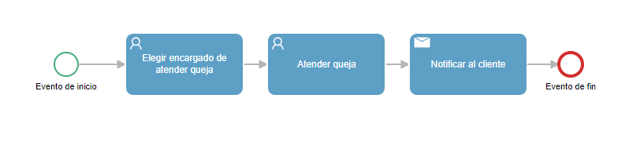](_images/image1100.png)

Figura 421 Diseño del proceso[](#id24 "Link to this image")

##### Agregar los elementos al diseño del proceso[](#agregar-los-elementos-al-diseno-del-proceso "Link to this heading")

Para agregar los elementos al diseño:

1.  Al crear la plantilla, se muestra el diseño del proceso ([Figura 422](#unmodifieddesign)). En caso de que no veas el diseño del proceso, puedes usar la opción «Grafo» que se muestra al hacer clic derecho sobre la plantilla.
    

[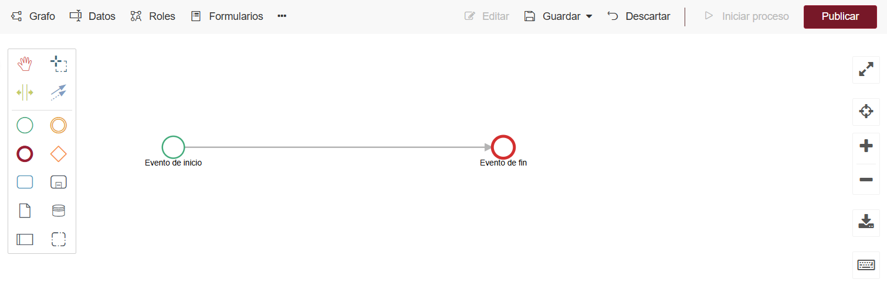](_images/image316.png)

Figura 422 Diseño sin modificar de la versión[](#id25 "Link to this image")

2.  Para agregar la tarea “Elegir encargado de atender la queja”, selecciona el ícono  en la barra de herramientas. Haz clic en él y después haz clic en el diseño. Esto agrega la actividad, aunque sin especificar que es una tarea de usuario. Al agregar la actividad, aparece una columna de íconos a la derecha ([Figura 423](#recentlyaddedactivitydesign)). Si seleccionas el ícono , se puede agregar rápidamente otra actividad que quedará automáticamente conectada a la primera. Haz clic en ese ícono para agregar otra actividad (esta actividad será la tarea “Atender la queja”). Finalmente, repite la operación para agregar la actividad que se usará para notificar al cliente. El diseño queda parecido al de la [Figura 424](#threeactivitiesdesign).
    

[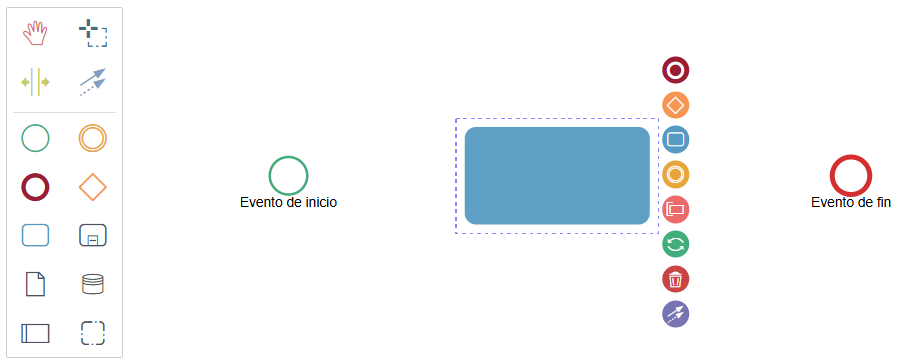](_images/image414.png)

Figura 423 Diseño con una actividad recién agregada[](#id26 "Link to this image")

[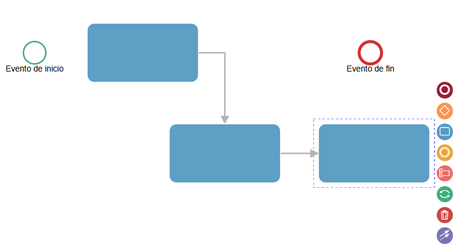](_images/image516.png)

Figura 424 El diseño, después de agregarle tres actividades[](#id27 "Link to this image")

3.  Selecciona la herramienta de conexión en la barra de herramientas ([Figura 425](#globalconnectionstool)). Haz clic en el evento de inicio y a continuación, en la primera de las actividades. Esto conecta los dos elementos, indicando que el proceso debe pasar del evento de inicio a esa actividad.
    

[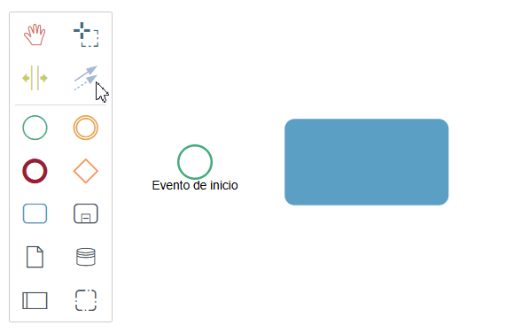](_images/image6.gif)

Figura 425 Herramienta de conexiones global[](#id28 "Link to this image")

[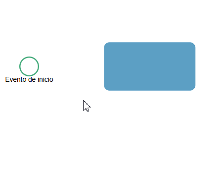](_images/image7.gif)

Figura 426 Crear conexión desde un paso[](#id29 "Link to this image")

4.  Conecta también la última actividad al evento de fin, como lo muestra la [Figura 427](#allstepsconected).
    

[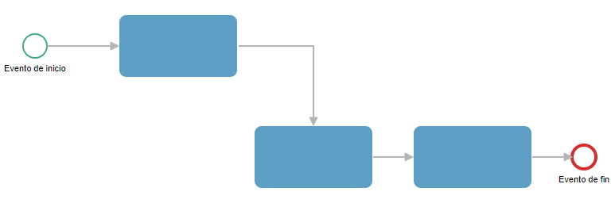](_images/image915.png)

Figura 427 El diseño, una vez conectado el evento de inicio con la primera actividad, y la última actividad con el evento de fin[](#id30 "Link to this image")

5.  Las actividades todavía no tienen ningún tipo: no se sabe si son tareas de usuario, tareas de servicio, etc. La primera actividad debe ser una tarea de usuario. Para especificar esto, selecciónala y haz clic en el ícono . Al hacer esto, aparece un menú para elegir el tipo de la actividad. Selecciona “Tarea de usuario”. Repite el procedimiento para la segunda actividad. Para la tercera, haz lo mismo, pero en lugar de seleccionar “Tarea de usuario”, selecciona “Tarea de e-mail”.
    

[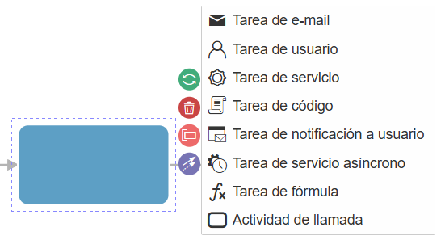](_images/image1014.png)

Figura 428 Especificación del tipo de una actividad[](#id31 "Link to this image")

El diseño ya tiene los pasos que se necesitan para el proceso. Ahora falta especificar los nombres y propiedades de los elementos. Por ejemplo, la primera tarea de usuario debería tener un nombre descriptivo como “Elegir encargado de atender la queja”. También habría que indicar: ¿a quién va dirigida la primera tarea? ¿A qué dirección de correo electrónico se envía el mensaje de la tarea de e-mail? Para poder especificar eso, primero hay que definir ítems a los que se hará referencia en esas propiedades: para indicar a quién asignar una tarea, se necesita un rol de proceso; para guardar la dirección de correo electrónico se necesita un dato de aplicación.

Por más información sobre cómo diseñar un proceso, vea la sección [Diseño del proceso de una versión](#diseno-del-proceso-de-una-version).

##### Roles del proceso[](#roles-del-proceso "Link to this heading")

El proceso necesita dos roles:

*   **Gerente comercial:** es el que elige al encargado de atender la queja. A este rol se le puede asignar un usuario durante la definición del proceso (se sabe quién es el gerente comercial). Este rol es el destinatario de la tarea “Elegir encargado de atender la queja”.
    
*   **Encargado de atender la queja:** es el que recibe la tarea “Atender la queja”. A este rol se le asigna un usuario durante la ejecución del proceso: es lo que hace el gerente comercial. Este rol es el destinatario de la tarea “Atender la queja”.
    

Para crear el rol “Gerente comercial”:

1.  Edita la plantilla: haz clic en el botón «Editar» en la barra de acciones ubicada en la parte superior del grafo.
    
2.  Ahora selecciona “Roles” en la barra de acciones. Eso hace que aparezca una pantalla con la lista de roles, que está vacía ([Figura 429](#rolelist)).
    

[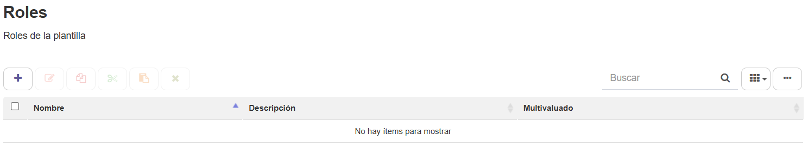](_images/image1214.png)

Figura 429 Lista de roles[](#id32 "Link to this image")

3.  Haz clic en el botón “+” para agregar un rol.
    
4.  En el formulario que aparece, escribe el nombre del rol ([Figura 430](#roleproperties)). Luego, para asignarle un usuario usa tu propia cuenta de usuario. Para eso, donde dice “Comienza a escribir un usuario…”, comienza a escribir el nombre de la cuenta que estás utilizando para probar Qflow. Si no sabes cuál es ese nombre, coloca el cursor sobre el menú de usuario en la parte de arriba a la derecha ([Figura 431](#currentuser)). Ese es el nombre que tiene que escribir. Cuando comiences a escribir, aparecerá una lista de usuarios. A medida que escribes, la lista va mostrando menos elementos. Cuando veas el nombre de tu cuenta de usuario, haz clic y su cuenta de usuario se agregará como miembro del rol.
    

[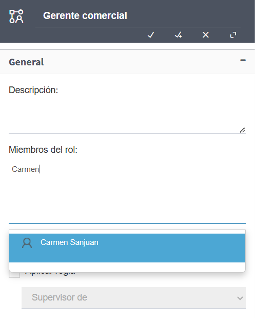](_images/image1314.png)

Figura 430 Propiedades de un rol: se ingresó el nombre “Gerente comercial” y se le está asignando el usuario “Carmen Sanjuan” como miembro[](#id33 "Link to this image")

[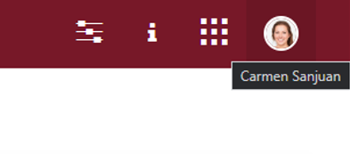](_images/image1413.png)

Figura 431 Parte de la pantalla en la que se muestra el nombre del usuario actual (“Carmen Sanjuan”, en este caso)[](#id34 "Link to this image")

5.  Haz clic en el botón de “Aceptar y crear otro” (). Esto creará el rol y te permitirá continuar creando roles sin cerrar el panel, pero limpiando los datos anteriores.
    

Una vez creado el rol “Gerente comercial”, crea el rol “Encargado de atender la queja”. No debes asignarle ningún miembro ya que el gerente comercial seleccionará un usuario para asignarle a ese rol en la tarea “Elegir encargado de atender la tarea”. En este caso, como no necesitas crear ningún otro rol, puedes guardarlo con el botón de Aceptar. Cuando intentes guardar los cambios, Qflow te advertirá que el rol no tiene miembros y te preguntará si deseas continuar de todas formas. Contesta que sí. El listado de roles quedará como se muestra en la [Figura 432](#createdtemplateroles).

[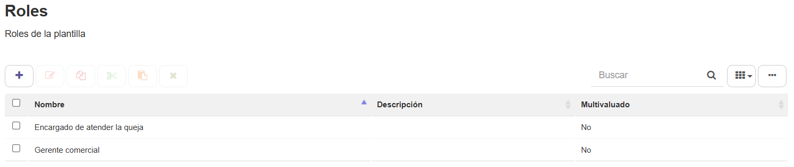](_images/image1513.png)

Figura 432 Roles de la plantilla creados[](#id35 "Link to this image")

##### Datos de aplicación del proceso[](#datos-de-aplicacion-del-proceso "Link to this heading")

Los datos de aplicación que se necesitan son:

*   Nombre del cliente
    
*   Dirección de correo electrónico
    
*   Texto de la queja
    
*   Texto para enviar al cliente
    

Para crear el dato de aplicación “Nombre del cliente”:

1.  Haz clic en el botón “Datos” en la barra de acciones.
    
2.  Haz clic en el botón “+” para agregar un dato de aplicación.
    
3.  Ingrese como nombre “Nombre del cliente”, tipo de dato “Texto”, que es la opción por defecto y haz clic en el botón de “Agregar y crear otro” (idéntico al que se ve en el panel de Rol).
    

Repite el paso 3 para los otros datos de aplicación (para el último, usa el botón de Aceptar para guardar). Por más información sobre datos de aplicación, consulta la sección [Datos de aplicación](#datos-de-aplicacion).

[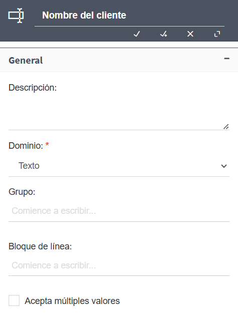](_images/image1613.png)

Figura 433 Creación del dato “Nombre del cliente”[](#id36 "Link to this image")

El listado de datos quedará como muestra la [Figura 434](#createddatalist).

[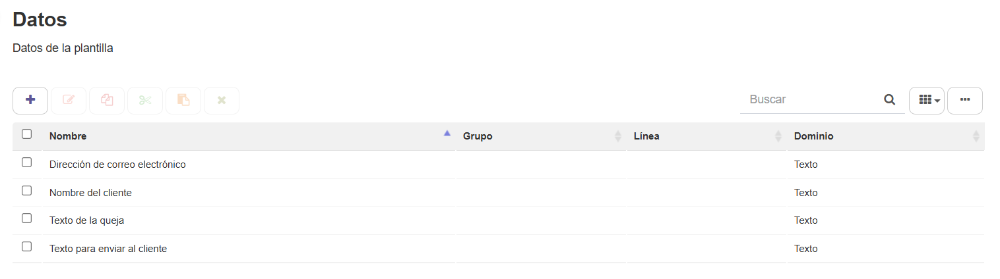](_images/image1713.png)

Figura 434 Listado de datos creados[](#id37 "Link to this image")

##### Propiedades de los elementos del diseño[](#propiedades-de-los-elementos-del-diseno "Link to this heading")

Ahora ya se puede configurar cada uno de los elementos del diseño.

###### Evento de inicio[](#evento-de-inicio "Link to this heading")

Para configurar el evento de inicio, haz doble clic en él. Lo único que se necesita modificar es la visibilidad. Para esto, haz clic en la pestaña “Formulario” para ver la configuración de visibilidad del paso.

[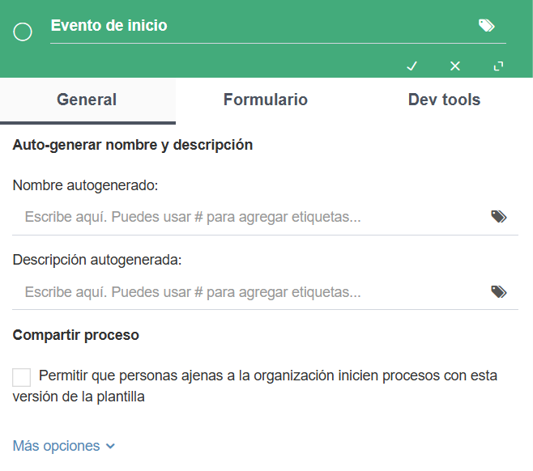](_images/image1813.png)

Figura 435 Propiedades del evento de inicio[](#id38 "Link to this image")

La visibilidad permite especificar qué datos y roles son visibles y modificables en actividades interactivas, como lo es una tarea de usuario o un evento de inicio. En el inicio del proceso, interesa que el usuario pueda asignar valores a los datos de aplicación. Entonces, en la subsección de datos, marca todos los datos de aplicación, haciendo clic en la caja que aparece al lado del cabezal de la columna “Nombre de datos” ([Figura 436](#assigneditablescope)). Después, haz clic en el botón correspondiente a la visibilidad “Editable” (). En la columna “Visibilidad”, todos los datos pasarán a tener el valor “Editable”. Haz clic en el botón de aceptar (✓) para guardar los cambios. Para ver más información sobre visibilidad, vaya a la sección [Visibilidad de datos, roles, adjuntos y comentarios](15-QflowDesign.md#visibilidad-de-datos-roles-adjuntos-y-comentarios).

[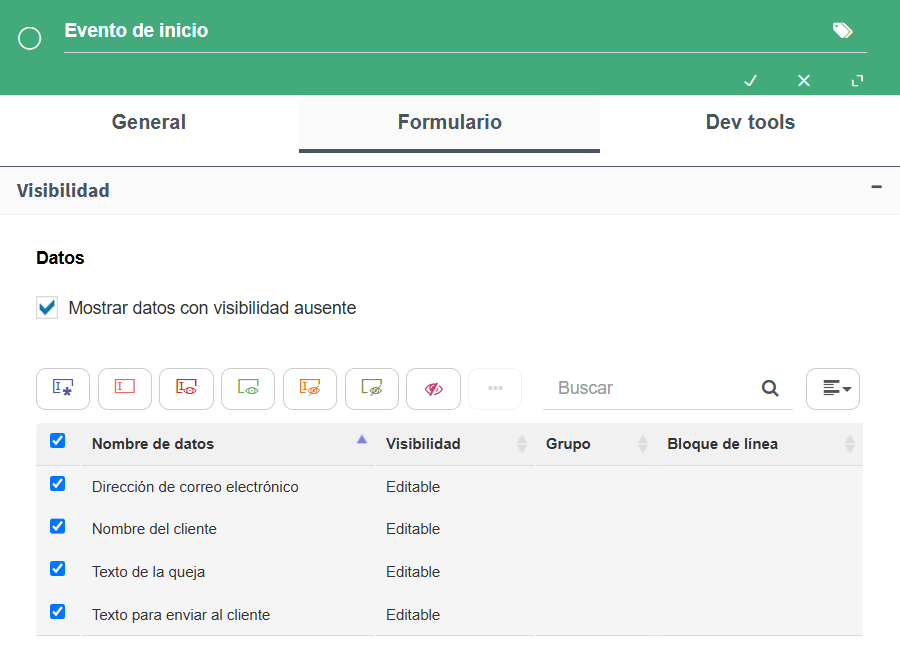](_images/image1913.png)

Figura 436 Asignación de visibilidad “Editable” a todos los datos de aplicación[](#id39 "Link to this image")

###### Tarea “Elegir encargado de atender la queja”[](#tarea-elegir-encargado-de-atender-la-queja "Link to this heading")

Presiona la tecla “E” en la tarea de usuario que está inmediatamente después del evento de inicio y escribe “Elegir encargado de atender la queja” en el nombre ([Figura 437](#changetaskname)).

[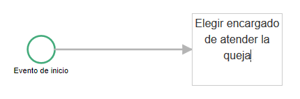](_images/image2012.png)

Figura 437 Cambio de nombre de tarea[](#id40 "Link to this image")

A continuación, haz doble clic en la tarea para abrir su configuración ([Figura 438](#taskusermessageform)).

[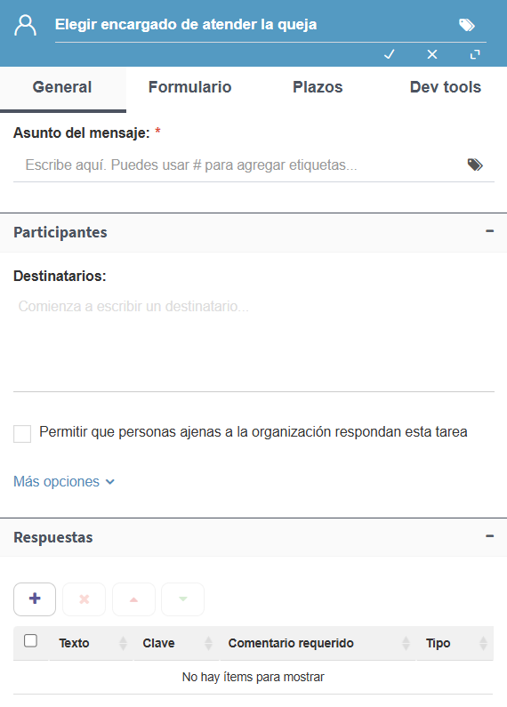](_images/image2112.png)

Figura 438 Configuración general de tarea de usuario[](#id41 "Link to this image")

La primera propiedad dentro de la configuración general de la tarea es el asunto de la misma (cuando se utiliza el correo electrónico para notificar a un usuario de que tiene una tarea, el asunto del mensaje de correo electrónico es el que se ingresa en esta propiedad). Escribe “Elegir encargado de queja de ”. El “de” del final (seguido de un espacio) es porque vamos a incluir el nombre del cliente en el asunto. El nombre del cliente no está disponible al momento de diseñar el proceso, pero durante su ejecución estará en el dato “Nombre del cliente”. Se puede incluir en el asunto mediante una etiqueta (ver [Etiquetas](#etiquetas)). Una etiqueta permite tomar el valor de algún ítem del proceso y usarlo en alguna propiedad de algún elemento.

Las propiedades para las que se pueden usar etiquetas se indican con un ícono que representa una etiqueta ([Figura 439](#inserttaginsubject)).

Para especificar una etiqueta, a continuación del texto del asunto, escribe el símbolo “#”. Qflow luego mostrará los ítems que se pueden seleccionar como etiqueta ([Figura 439](#inserttaginsubject)).

[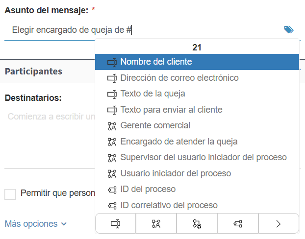](_images/image2212.png)

Figura 439 Insertando etiqueta en asunto[](#id42 "Link to this image")

Selecciona en la lista el dato de aplicación “Nombre del cliente”. En ese momento, Qflow agrega la etiqueta al asunto. La etiqueta se representa mediante un texto con símbolos especiales que indican que ese texto es una etiqueta, un texto que indica qué tipo de ítem se usa (en este caso, “Data”, que significa un dato de aplicación) y el nombre del ítem (“Nombre del cliente”). Ver [Figura 440](#tasksubjectwithtag).

Figura 440 Asunto de tarea con etiqueta[](#id43 "Link to this image")

Debajo del asunto de la tarea se deben ingresar las respuestas posibles para la tarea. Cuando a un usuario se le asigna una tarea, debe ingresar a Qflow Task para contestarla. Algunas tareas brindan varias respuestas posibles. Por ejemplo, una tarea de un proceso puede ser “¿Aprueba este gasto?” y esa tarea tendría dos respuestas, “Aprobar” y “Rechazar”. En este caso, sólo se necesita una respuesta que indique que se seleccionó al encargado de atender la queja y el proceso puede continuar.

Para agregar una respuesta, haz clic en el botón con el símbolo “+” que aparece debajo de donde dice “Respuestas”. Eso hace que Qflow agregue una respuesta a la lista de respuestas que estaba vacía. La respuesta agregada tiene, por defecto, el texto “Respuesta 1” ([Figura 441](#addresponse)).

[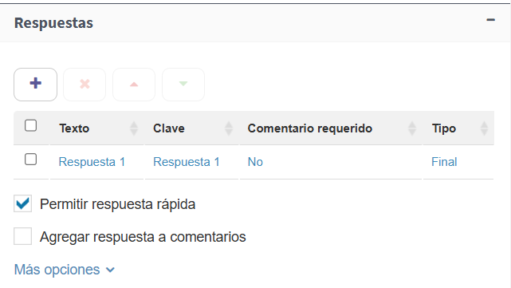](_images/image2412.png)

Figura 441 Agregar respuesta[](#id44 "Link to this image")

Haz clic en “Respuesta 1”. Eso te permitirá modificar el texto, como muestra la [Figura 442](#editresponse).

[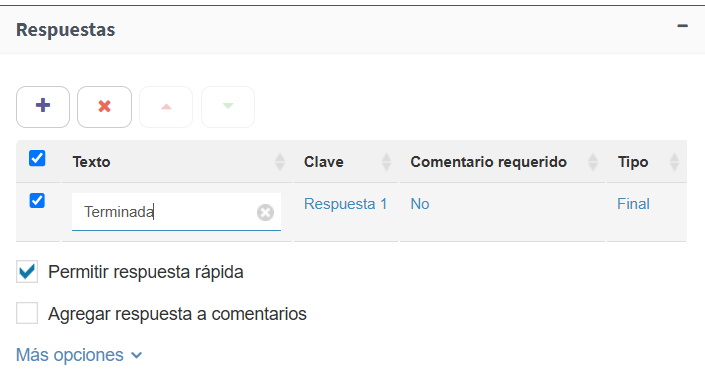](_images/image2513.png)

Figura 442 Editando respuesta[](#id45 "Link to this image")

Escribe “Terminada” y pulsa la tecla “Enter”. En la fila de la respuesta hay una columna Tipo que tiene como opción “Final”. No la cambies, esto indica que, una vez que se selecciona una respuesta, el proceso debe continuar y pasar al siguiente elemento del diseño (los distintos tipos de respuesta de tarea se explican en más detalle en el apartado de «Respuestas» en la sección «General» dentro de [Tarea de usuario](#tarea-de-usuario)).

Figura 443 Respuesta agregada[](#id46 "Link to this image")

Luego hay que seleccionar el destinatario de la tarea. El destinatario es el rol al que se asignará la tarea (mediante el rol, la tarea se asigna a usuarios: los miembros del rol). En este caso, el destinatario es el rol “Gerente comercial”. Para seleccionarlo, donde dice “Destinatarios”, escribe “Gerente comercial”. Mientras lo estés escribiendo, aparecerá una lista en la que aparecerá ese rol para seleccionar. Selecciónalo. Durante la ejecución del proceso, Qflow enviará la tarea a la cuenta de usuario que fue especificada como miembro de ese rol ([Figura 444](#inputtaskaddressee)).

Figura 444 Destinatario de tarea ingresado[](#id47 "Link to this image")

Finalmente, hay que especificar la visibilidad de datos y roles. En este caso hay que modificar la visibilidad para que el rol “Encargado de atender la queja” sea modificable y requerido. Además, el usuario que desempeña esta tarea debería ver los datos de la queja, por lo que en la visibilidad de datos se debe especificar que los datos de aplicación sean visibles pero no modificables (visibilidad de “Sólo lectura”). Selecciona entonces, en la sección de roles dentro de visibilidad, el rol “Encargado de atender la queja”, y haz clic en el botón “Requerido” ().

[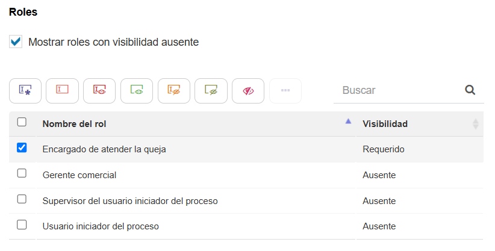](_images/image284.png)

Figura 445 Visibilidad de roles[](#id48 "Link to this image")

En la sección de datos, seleccione todos y haz clic en el botón “Sólo lectura” ().

[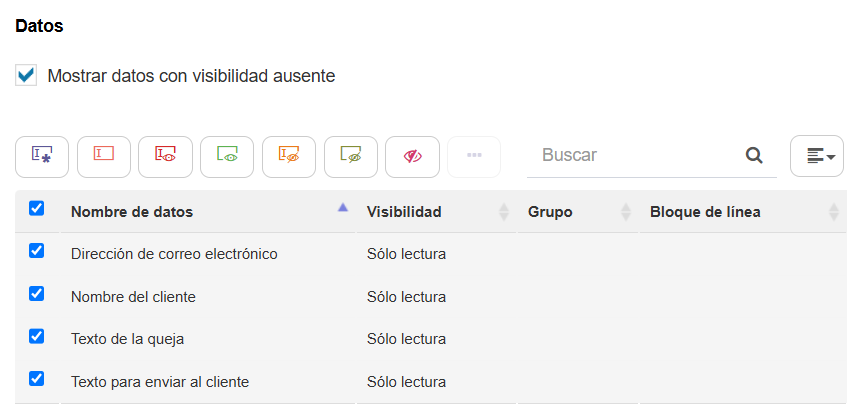](_images/image294.png)

Figura 446 Visibilidad de datos Sólo lectura[](#id49 "Link to this image")

###### Tarea “Atender la queja”[](#tarea-atender-la-queja "Link to this heading")

Escribe “Atender la queja” como nombre del paso.

En el asunto escribe “Atender la queja y escribir el texto para enviarle al cliente” y a continuación usa el dato de aplicación “Nombre del cliente” como etiqueta, al igual que con la otra tarea de usuario.

El destinatario es el rol “Encargado de atender la queja”, que hasta el momento no tiene ningún miembro, pero cuando se esté ejecutando el proceso, tendrá como miembro el usuario que seleccione el gerente comercial en la tarea anterior.

Luego, agrega una respuesta como final, para que el usuario pueda responder el formulario. Por ejemplo, con clave y texto “Resuelto”.

La configuración del mensaje debería quedar como muestra la [Figura 447](#mailtaskform).

[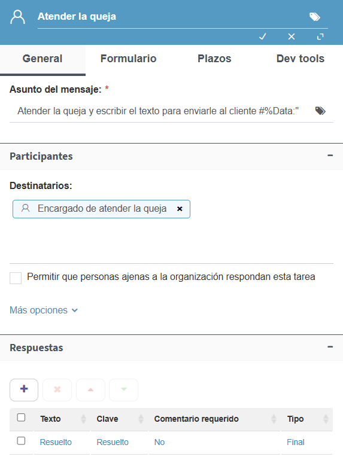](_images/image304.png)

Figura 447 Formulario de mensaje de la tarea “Atender la queja”[](#id50 "Link to this image")

En esta tarea, ningún rol debe ser visible ni modificable, pero todos los datos deben ser visibles y particularmente el dato “Texto para enviar al cliente” debe ser modificable. Por lo tanto, este dato debe tener la visibilidad “Editable” y los demás, “Sólo lectura” ([Figura 448](#taskdatascope)).

[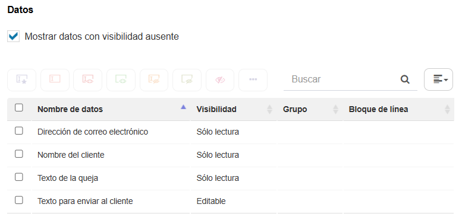](_images/image317.png)

Figura 448 Visibilidad de datos de la tarea “Atender la queja”[](#id51 "Link to this image")

###### Tarea de e-mail[](#tarea-de-e-mail "Link to this heading")

Donde va el nombre de la tarea de e-mail, escribe “Notificar al cliente”.

También hay que especificar que el destinatario se tome del dato de aplicación “Dirección de correo electrónico”. Para eso, en el campo “Destinatarios”, escribe “Dirección de correo electrónico”. Aparecerá una lista de datos de aplicación, de donde debes seleccionar el dato correspodiente. Luego, hay que escribir un asunto para el mensaje: escribe “Resolución de su queja” ([Figura 449](#currentmailtaskconfiguration)).

[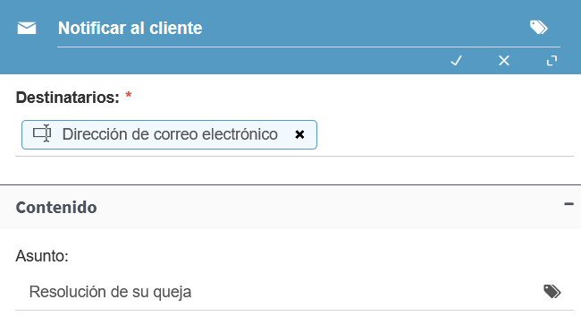](_images/image32_cloud.png)

Figura 449 Configuración de la tarea de e-mail hasta el momento[](#id52 "Link to this image")

Finalmente, hay que especificar que el cuerpo del mensaje debe ser lo ingresado en el dato “Texto para enviar al cliente” por el encargado de resolver la queja. Esto se hace mediante una etiqueta, pero en este caso, para abrir la lista de ítems que se pueden usar como etiquetas, debes hacer clic en el área de texto y pulsar Control + Espacio ([Figura 450](#itemtaglist)). Así funcionan las propiedades que usan un área de texto (por ejemplo, el código de una tarea de código).

[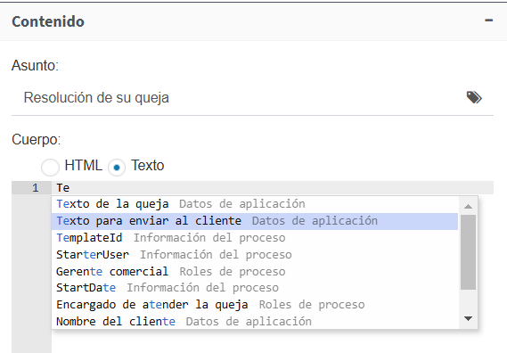](_images/image334.png)

Figura 450 Si se selecciona un área de texto, al pulsar Control+Espacio aparece una lista de ítems que se pueden agregar como etiqueta[](#id53 "Link to this image")

Al seleccionar la etiqueta, se mostrará como en la [Figura 451](#taginmailbody).

[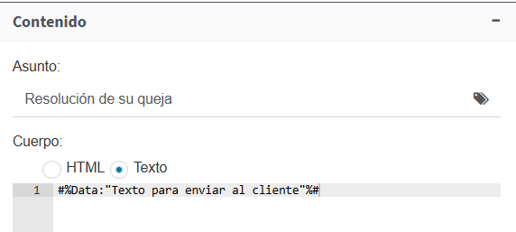](_images/image344.png)

Figura 451 Etiqueta ingresada en cuerpo de mail[](#id54 "Link to this image")

##### Guardar y publicar plantilla[](#guardar-y-publicar-plantilla "Link to this heading")

Una vez que terminas de definir el proceso, guarda tu diseño. Haz clic en el ícono «Guardar» en la barra de acciones y selecciona «Guardar y finalizar cambios».

Finalmente, debes publicar la versión actual de la plantilla. De lo contrario, cuando ingreses a Qflow Task para iniciar un proceso, no encontrarás la plantilla que acabas de diseñar. Para eso, usa el boton de publicar que se encuentra a la derecha en la barra de acciones. También puedes buscar la plantilla en el árbol de paquetes, hacer clic derecho en ella y seleccionar, en el menú, “Publicar”.

Una vez publicada la plantilla, para iniciar un proceso y poder realizar pruebas, haz clic en el botón “Iniciar proceso” en la barra de acciones. También puedes acceder directamente desde Qflow Task. Para más información, consulta el manual de [Qflow Task](04-QflowTask.md).

### Segunda versión de proceso de quejas[](#segunda-version-de-proceso-de-quejas "Link to this heading")

El proceso anterior tiene el defecto de que el gerente comercial siempre tiene que intervenir para seleccionar al encargado de atender la queja. Si esta decisión se pudiera automatizar, al menos para algunos casos, se podría mejorar el proceso.

Una posibilidad es categorizar las quejas y definir un encargado para cada categoría. Al iniciar un proceso, el iniciador ve una lista de categorías de quejas y elige una. Una vez iniciado un proceso, se asigna la tarea de atender la queja al encargado correspondiente a la categoría seleccionada. Se puede incluir una categoría “Otra” para contemplar quejas que no se ajustan a ninguna de las categorías definidas. Quejas en esa categoría se comportan como antes: el gerente comercial decide quién se encarga de ellas.

Para hacer este cambio, se necesita un nuevo dato para la categoría. Un dato se asocia a un dominio, que indica, entre otras cosas, cómo se muestra y qué tipo de datos tiene. Un dominio también puede definir un conjunto de valores posibles para el dato (para conocer más información acerca de los dominios, vea la sección [Dominios](15-QflowDesign.md#dominios)). Por eso, crearemos un dominio nuevo que indicará que sus datos, en lugar de mostrarse como una caja de texto cuando son editables, deben mostrarse como listas desplegables (“Combo box”). El dominio también definirá las categorías que aparecerán en la lista. En el ejemplo, las categorías serán tres: “Producto defectuoso”, “Mala atención” y “Otra”. En Qflow Task, se podrá ver como muestra la [Figura 452](#comboboxinwebsite).

[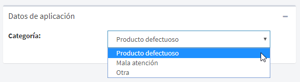](_images/image383.png)

Figura 452 Combo box en Qflow Task[](#id55 "Link to this image")

Para cada categoría habrá una tarea de usuario dirigida al encargado de esa categoría. Para decidir a cuál de ellas irá el proceso se usará una compuerta exclusiva, que se conecta con varios elementos y asocia una condición a cada uno de ellos. Cuando el proceso llega a una compuerta exclusiva, evalúa las condiciones y sigue su camino yendo al elemento asociado a la condición que se cumple. En este caso, la compuerta exclusiva estará conectada con cada una de las tareas de usuario correspondientes a cada categoría. Entonces, si la categoría es “Producto defectuoso” o “Mala atención”, el proceso seguirá su camino por la tarea con su correspondiente nombre. Si es “Otra”, irá a la misma tarea que en la versión anterior (“Elegir encargado de la queja”).

El diseño de la nueva versión quedará como el de la [Figura 453](#secondprocessversion). A continuación, se describe cómo diseñar la nueva versión.

[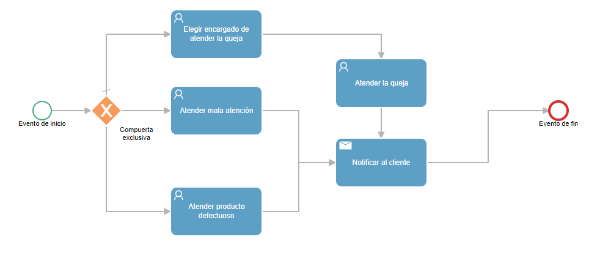](_images/image394.png)

Figura 453 Segunda versión del proceso[](#id56 "Link to this image")

#### Creación de la nueva versión[](#creacion-de-la-nueva-version "Link to this heading")

1.  Haz clic derecho en la plantilla y, en el menú contextual, selecciona “Agregar versión del proceso” ([Figura 454](#addtemplateversion)).
    

[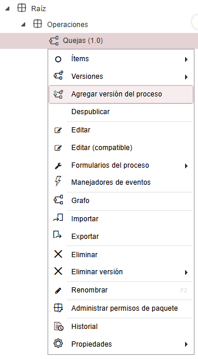](_images/image404.png)

Figura 454 Agregar versión de plantilla[](#id57 "Link to this image")

2.  Selecciona, dentro de “Patrón de la versión de la plantilla”, la versión “1.0” (esto creará una nueva versión como copia de la seleccionada) e ingresa el nombre de la versión como “2.0” ([Figura 455](#addversion20)).
    

[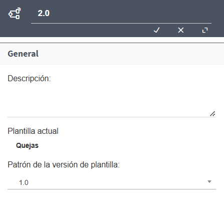](_images/image415.png)

Figura 455 Agregar versión 2.0[](#id58 "Link to this image")

#### Creación del nuevo dominio[](#creacion-del-nuevo-dominio "Link to this heading")

Para crear el dominio de tipo lista “Categoría de queja”:

1.  En la barra de acciones, haz clic en los tres puntos y selecciona “Dominios de dato”.
    
2.  Haz clic en el botón de agregar. En el formulario de propiedades, además de ingresar “Categoría de queja” en el nombre, selecciona el tipo de control “Combo box” (una lista que se despliega) y en “Origen de datos”, selecciona “Lista”. Haz clic en el ícono  para que Qflow muestre las propiedades de la lista.
    

[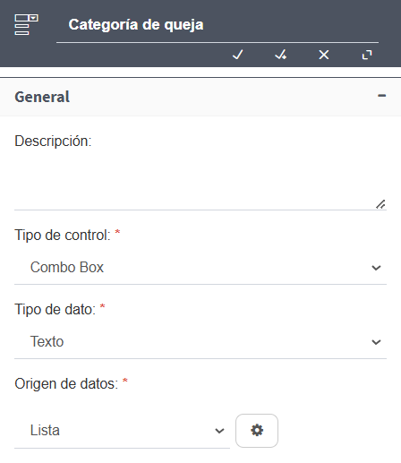](_images/image434.png)

Figura 456 Dominio “Categoría de queja”[](#id59 "Link to this image")

3.  Haz clic en el botón de agregar. Esto agrega una fila. Haz clic en “Ítem 1” en la columna “Texto” e ingresa “Producto defectuoso”. Este valor se copiará automáticamente en la columna “Clave”.
    
4.  Repite el procedimiento para agregar dos filas más: “Mala atención” y “Otra”. Después, acepta los cambios.
    

[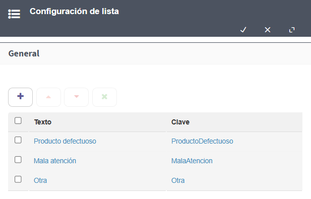](_images/image444.png)

Figura 457 Definición de los elementos de la lista[](#id60 "Link to this image")

5.  Guarda los cambios en la lista mediante el botón de “Aceptar”.
    
6.  Guarda los cambios en el dominio mediante el botón de “Aceptar”.
    

#### Creación del nuevo dato[](#creacion-del-nuevo-dato "Link to this heading")

Crea un dato de aplicación, nómbralo “Categoría” y donde dice “Dominio de datos” selecciona “Categoría de queja”.

[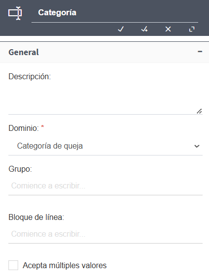](_images/image454.png)

Figura 458 Dato “Categoría”[](#id61 "Link to this image")

#### Modificación del diseño del proceso[](#modificacion-del-diseno-del-proceso "Link to this heading")

Para modificar el diseño:

1.  Agrega una compuerta exclusiva. Para eso es necesario generar espacio entre el Evento de inicio y la tarea de usuario. Utiliza la herramienta de crear/eliminar espacio como lo muestra la [Figura 459](#addstepbetweensteps).
    

[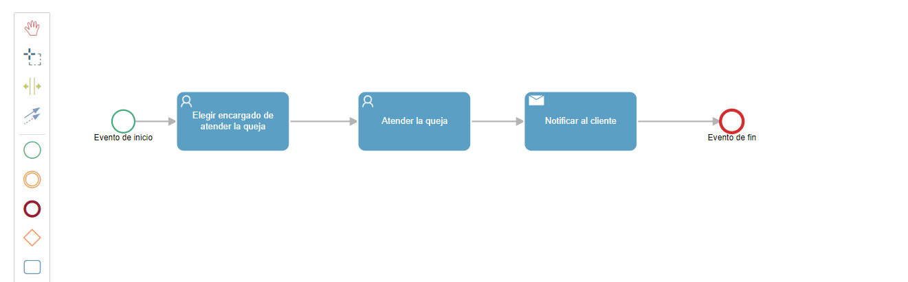](_images/image46.gif)

Figura 459 Agregar paso entre dos pasos[](#id62 "Link to this image")

2.  Agrega dos tareas.
    
3.  Conecta la compuerta exclusiva con las dos nuevas tareas.
    

[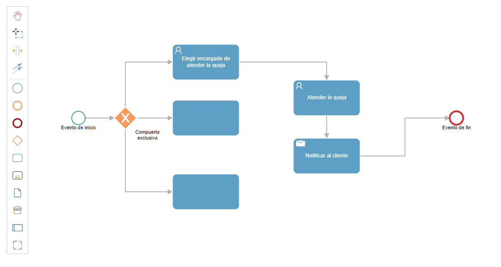](_images/image474.png)

Figura 460 Agregar dos tareas luego de la compuerta exclusiva[](#id63 "Link to this image")

4.  Conecta las dos nuevas tareas con la tarea “Notificar al cliente”.
    
5.  Renombra los elementos nuevos para que queden como los de la [Figura 461](#finishedprocessdesign).
    

[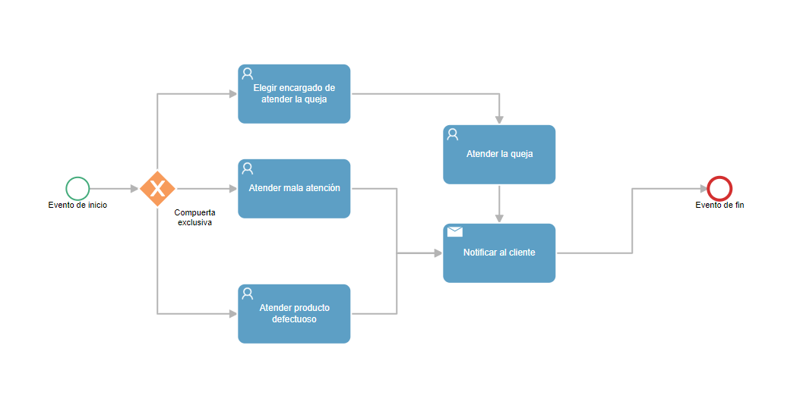](_images/image484.png)

Figura 461 Diseño del proceso de Quejas 2.0 terminado[](#id64 "Link to this image")

6.  Modifica la visibilidad del evento de inicio, de modo que el dato “Categoría” tenga la visibilidad “Requerido”. Recuerda marcar la casilla “Mostrar datos con visibilidad ausente” para poder verlo, pues por defecto Qflow sólo muestra los datos con visibilidad editable.
    

[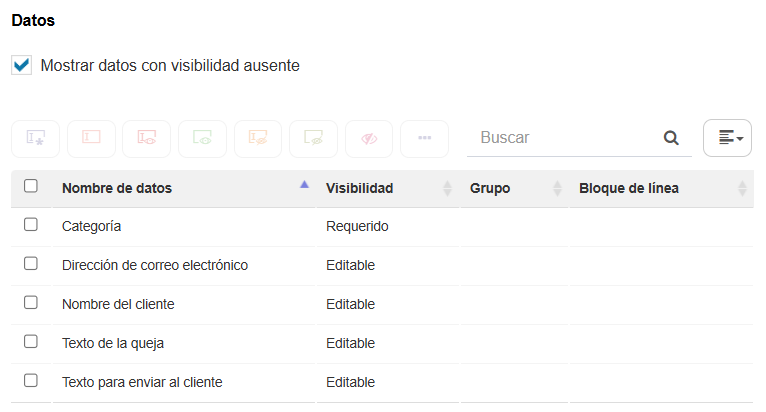](_images/categoryscope.png)

Figura 462 Visibilidad editada para incluir el dato “Categoría”[](#id65 "Link to this image")

#### Creación de dos nuevos roles[](#creacion-de-dos-nuevos-roles "Link to this heading")

Crea dos nuevos roles: “Encargado de productos” y “Encargado de atención”. Asigna tu cuenta de usuario como miembro (esto es sólo para probar: naturalmente, en un caso real, cada uno tendría un miembro distinto).

El listado de roles debería quedar como muestra la [Figura 463](#complaintprocessrolelist).

[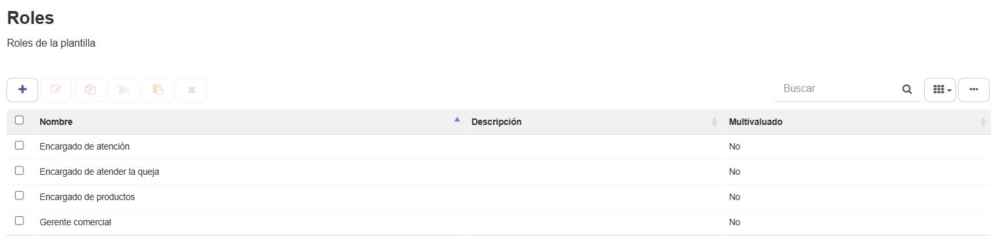](_images/image493.png)

Figura 463 Listado de roles del proceso de Quejas 2.0[](#id66 "Link to this image")

#### Configuración de los nuevos pasos[](#configuracion-de-los-nuevos-pasos "Link to this heading")

1.  Configura la tarea “Atender mala atención” para que el destinatario sea el rol “Encargado de atención”. Haz lo mismo con la tarea “Atender producto defectuoso” para que el destinatario sea el rol “Encargado de productos” ([Figura 464](#complainthandlertasks)).
    

[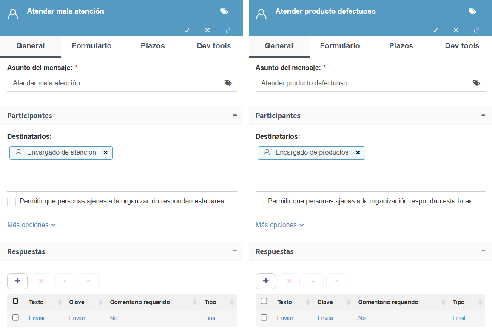](_images/image504.png)

Figura 464 “Atender mala atención” y “Atender producto defectuoso”[](#id67 "Link to this image")

2.  Abre el formulario de propiedades de la compuerta exclusiva.
    
3.  La configuración de la compuerta estará dividida en tres subsecciones, una para cada una de las tareas a las cuales está conectada ([Figura 465](#exclusivegatewayadvancedsection)).
    

[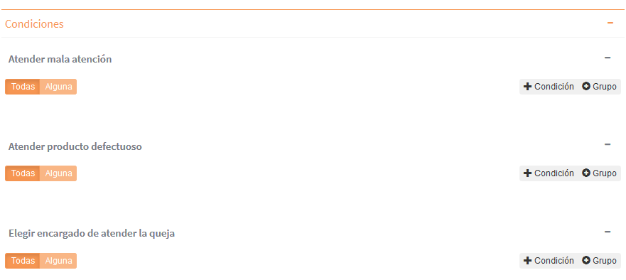](_images/image517.png)

Figura 465 Configuración de la compuerta exclusiva[](#id68 "Link to this image")

4.  En la subsección correspondiente a la tarea “Atender Producto Defectuoso”, haz clic en “+Condición”. Esto agrega una condición vacía ([Figura 466](#addcondition)).
    

[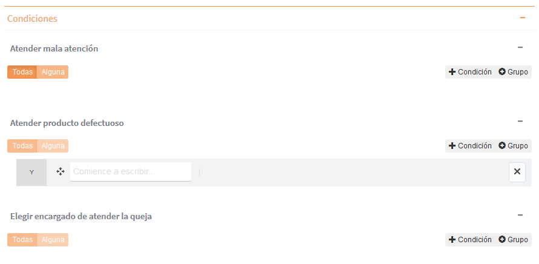](_images/image524.png)

Figura 466 Agregar condición[](#id69 "Link to this image")

5.  Donde dice “Empiece a escribir”, escribe “Categoría”. Cuando aparezca una lista con el dato de aplicación “Categoría”, selecciónalo ([Figura 467](#configurecondition1)).
    

[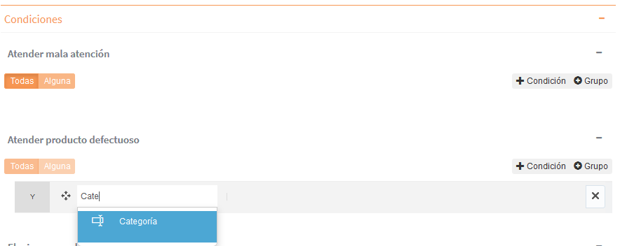](_images/image534.png)

Figura 467 Configurando condición (1)[](#id70 "Link to this image")

6.  En la caja de texto que aparece en la parte derecha de la condición, al lado del operador “igual”, escribe “Producto defectuoso” ([Figura 468](#configurecondition2)).
    

[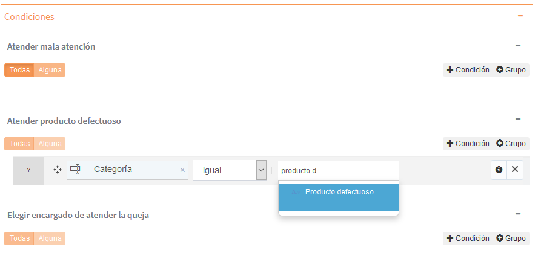](_images/image544.png)

Figura 468 Configurando condición (2)[](#id71 "Link to this image")

7.  Haz lo mismo en la subsección correspondiente a “Atender mala atención”, pero escribiendo “Mala atención” en lugar de “Producto defectuoso” en la condición. La [Figura 469](#exclusivegatewayconfiguration) muestra cómo queda la configuración de la compuerta exclusiva.
    

[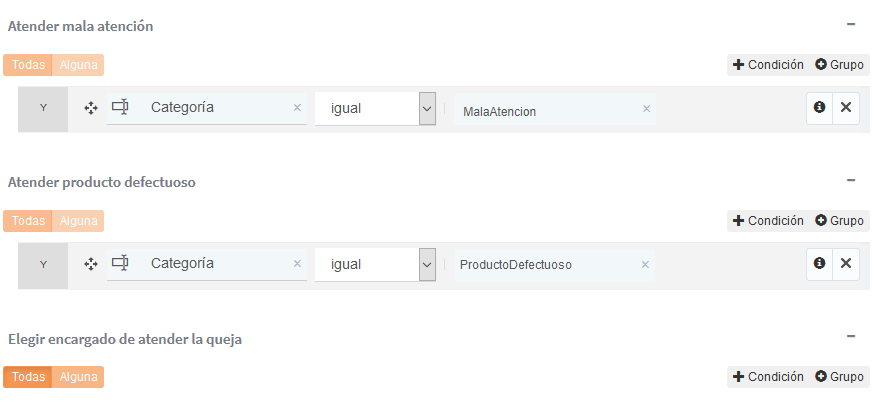](_images/image554.png)

Figura 469 Configuración de la compuerta exclusiva[](#id72 "Link to this image")

8.  Haz clic en la conexión que une la compuerta a la tarea “Elegir encargado de atender queja”. Haz clic en el ícono  y selecciona “Conexión por defecto” ([Figura 470](#assigndefaultconnection)). De este modo, si ninguna de las otras expresiones se evalúa como verdadera, se utilizará esta conexión.
    

[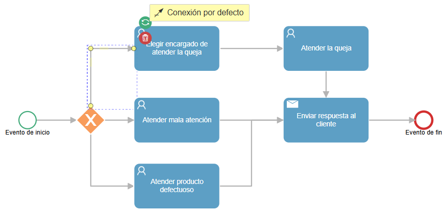](_images/image564.png)

Figura 470 Asignar conexión por defecto[](#id73 "Link to this image")

9.  Guarda los cambios.
    

Cuando termines de hacer los cambios, guarda la plantilla del proceso y publique la nueva versión (ver [Guardar y publicar plantilla](#guardar-y-publicar-plantilla)).

### Otras mejoras posibles[](#otras-mejoras-posibles "Link to this heading")

A continuación se describen otras mejoras que se le podrían hacer al proceso y se explica, sin entrar en detalles, cómo se implementarían, con el objetivo de mostrar cómo se utilizan otras funcionalidades de Qflow que todavía no se han mencionado.

#### Uso de un web service y de una base de datos propia[](#uso-de-un-web-service-y-de-una-base-de-datos-propia "Link to this heading")

Existen distintas situaciones en donde se podría querer utilizar o modificar información proveniente de bases de datos externas al almacenamiento interno de Qflow.

En general, se utiliza un web service (SOAP o REST) para acceder a la base de datos y para proveer a Qflow las funciones que permiten obtener y guardar datos en ella, así como también para implementar operaciones propias de la lógica del negocio. Para que Qflow pueda acceder a ese web service, se utiliza una integración (ver [Integraciones](#integraciones)). Una integración se define de forma similar a como se definen los datos de aplicación, dominios y roles, y se debe especificar cómo conectarse con un componente (en este caso, un web service) y qué operación utilizar (un método del web service). También define cómo intercambiar datos entre Qflow y el web service (se asocian datos de aplicación a los parámetros de la operación que se invoca y al resultado que la operación devuelve).

Los datos de conexión con el web service (o con otros componentes, en el caso de integraciones con componentes de otros tipos) se suelen guardar en parámetros de aplicación, que también se definen de forma similar a los datos de aplicación, roles y dominios (ver [Parámetros de aplicación](#parametros-de-aplicacion)).

#### Manipulación de datos del proceso en código propio[](#manipulacion-de-datos-del-proceso-en-codigo-propio "Link to this heading")

Otra práctica común es desarrollar código que obtiene y modifica datos del proceso. Esto permite manejar algunos aspectos del proceso de forma más flexible, de modo de facilitar cambios futuros. Por ejemplo, en la segunda versión de este proceso, se usa una tarea de usuario para cada categoría de queja. Pero esto no sería práctico si hubiera muchas categorías de queja. Tampoco sería práctico si se espera que las categorías cambien, ya que cada vez que se agregue una categoría, habría que modificar el diseño del proceso, probablemente creando una nueva versión.

Es más práctico usar una única tarea de usuario y un único rol, en lugar de una tarea de usuario y un rol por categoría. Para eso se puede usar el rol “Encargado de atender la queja”, que no tiene un miembro predefinido y asignarlo durante la ejecución del proceso, como se hacía en la primera versión. La diferencia es que se tiene que hacer automáticamente y no manual como en esa versión. Para eso se puede usar una tarea de código.

En una tarea de código se puede escribir código que accede a los datos del proceso. Es posible escribir código que lea el valor de un dato de aplicación y asigne un miembro a un rol. En este caso, se escribiría código que leería el valor del dato “Categoría” y, según su valor, se seleccionaría al encargado de atender la queja, asignándolo como miembro del rol “Encargado de atender la queja”.

Este código se puede escribir en las propiedades de la tarea de código (ver [Tarea de código](#tarea-de-codigo)), pero también se puede escribir en una integración ad hoc (ver [Integraciones](#integraciones)).

Las funciones que provee Qflow para interactuar con los datos de sus procesos se describen detalladamente en el manual de la [Interfaz de Scripting](10-ScriptingInterface.md).

#### Colas de trabajo[](#colas-de-trabajo "Link to this heading")

Otra práctica común es utilizar colas de trabajo como miembros de los roles en lugar de cuentas de usuario. En lugar de asignar las tareas a usuarios particulares, se asignan a colas de trabajo (“Departamento de envíos”). Una cola de trabajo está asociada a permisos que indican quiénes pueden tomar tareas asignadas a ella. Por ejemplo, sólo los usuarios del departamento de envíos pueden tomar tareas de la cola “Departamento de envíos”. Así, cuando una tarea es asignada a esa cola de trabajo, todos los que pueden tomar tareas de esa cola son notificados y cualquiera de ellos puede tomar la tarea para sí y encargarse de ella. El concepto de cola de trabajo está explicado en el manual de [Qflow Team](18-QflowTeam.md). Ese manual también explica cómo crear colas de trabajo.

## Operación de la interfaz de usuario[](#operacion-de-la-interfaz-de-usuario "Link to this heading")

Esta sección explica cómo utilizar Qflow Design.

### Descripción general de la interfaz de usuario[](#descripcion-general-de-la-interfaz-de-usuario "Link to this heading")

La [Figura 471](#mainbpmwebscreen) muestra la interfaz de Qflow Design.

Los principales elementos de la interfaz son:

*   **El menú superior:** tiene opciones para ir al inicio, cerrar la sesión y acceder a la pantalla de configuración.
    
*   **El menú lateral:** permite navegar entre el árbol de paquetes, el panel de búsqueda y el espacio creativo.
    
*   **La zona de edición:** muestra los elementos con los que se está trabajando y es donde se diseñan los diagramas de las plantillas.
    
*   **La barra de acciones:** permite acceder rápidamente al diseño de la plantilla, sus datos, roles y dominios de datos del proceso, entre otras configuraciones.
    

[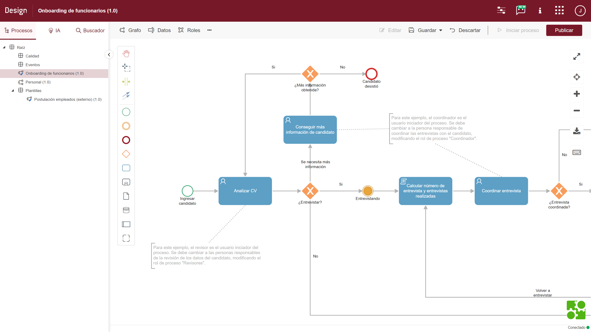](_images/design-home-cloud.png)

Figura 471 Pantalla principal de Qflow Design[](#id74 "Link to this image")

#### El menú superior[](#el-menu-superior "Link to this heading")

La [Figura 472](#headermenu) muestra el menú superior. A continuación, se explica cada una de las funciones disponibles a través de él.

[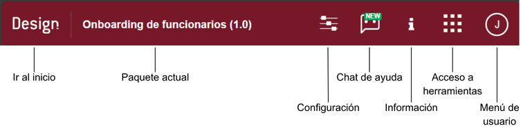](_images/image584.png)

Figura 472 Menú superior[](#id75 "Link to this image")

Si se hace clic en “Información”, se mostrarán enlaces a las novedades del producto, al foro de consultas y soporte de Qflow y a este manual, además de poder ver la versión del producto que se está usando.

Figura 473 Información del producto[](#id76 "Link to this image")

El menú de acceso a las herramientas permite navegar fácilmente a aquellas en las que tengamos permisos de acceso. Con hacer clic sobre algún elemento de este menú, el navegador abrirá una nueva pestaña con la herramienta seleccionada en el cual tendremos iniciada nuestra sesión para empezar a trabajar.

Figura 474 Menú de acceso a herramientas[](#id77 "Link to this image")

El botón de chat de ayuda permite mostrar u ocultar el chat de asistencia con inteligencia artificial.

Al abrir la opción “Usuario actual”, el sistema despliega la zona horaria de preferencia del usuario y el botón de cerrado de sesión. Esta zona horaria es la utilizada en todas las fechas y horas de Qflow para el usuario actual. La preferencia se comparte con todas las herramientas del producto, por lo que su modificación en una de ellas afecta a las otras.

Para la edición de la zona horaria se debe seleccionar la opción “Usuario actual” del menú. Esto abrirá un panel derecho con la lista de zonas horarias disponibles. Luego de seleccionada la zona horaria, al guardar el panel, la página se refrescará automáticamente para que el cambio tenga efecto. Se debe tener en cuenta que si se tiene más ventanas abiertas de alguna de las herramientas de Qflow, deben ser refrescadas manualmente para que el cambio tenga efecto.

La función de configuración tiene la opción de administración de permisos de la herramienta, la cual se explica en el manual de [Qflow Team](18-QflowTeam.md).

#### El menú lateral[](#el-menu-lateral "Link to this heading")

El menú lateral facilita la navegación entre el árbol de paquetes, el espacio creativo y el panel de búsqueda. En el árbol de paquetes, es posible visualizar y gestionar los elementos de la estructura jerárquica de paquetes y plantillas. En el espacio creativo, se pueden acceder a las plantillas generadas con Inteligencia Artificial. Finalmente, el panel de búsqueda permite realizar búsquedas de datos, roles y otros elementos de los procesos, así como de paquetes y plantillas dentro de esta estructura jerárquica.

##### Búsqueda[](#busqueda "Link to this heading")

Para abrir el panel de buscar elementos, se puede acceder yendo a la pestaña de «Buscador» del menú lateral, o presionando “Ctrl + Shift + F”.

###### Búsqueda rápida[](#busqueda-rapida "Link to this heading")

Una búsqueda rápida consiste en escribir en la caja de texto parte del nombre del elemento que se busca. Los elementos que se pueden buscar en esta modalidad son aquellos pertenecientes a la estructura de paquetes, es decir, los paquetes, plantillas y versiones de toda la solución, así como también los roles, dominios y datos que se encuentren en el paquete que esté seleccionado en el árbol o en alguno de sus padres. Qflow responde filtrando los elementos que se muestran en la zona de edición, ocultando aquellos que no contengan el texto ingresado ([Figura 475](#quicksearch)).

[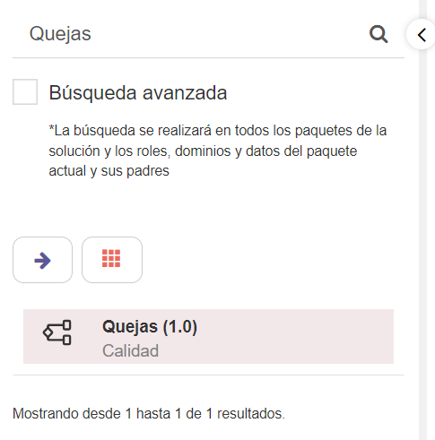](_images/image618.png)

Figura 475 Búsqueda rápida[](#id78 "Link to this image")

###### Búsqueda avanzada[](#busqueda-avanzada "Link to this heading")

La búsqueda avanzada ([Figura 476](#advancedsearch)) se accede cliqueando en el checkbox de “Búsqueda avanzada”, permite encontrar fácilmente ítems que se utilizan en las especificaciones de los procesos (por ejemplo, datos de aplicación). Esto es especialmente útil cuando se recuerda parte del nombre de un elemento, pero no en qué paquete, plantilla de proceso o versión se encuentra. La pantalla de búsqueda permite ingresar los siguientes datos:

*   **Nombre:** nombre del elemento que se busca.
    
*   **Tipo:** Se podrá filtrar que tipos de elementos se desea buscar (paquetes, pasos, datos de aplicación, roles de la plantilla de proceso, dominios de dato, formularios personalizados, integraciones, manejadores de eventos, worklets, validaciones, bots y/o parámetros de aplicación). Además, es posible seleccionar dos o más tipos, permitiendo en una única búsqueda obtener los distintos elementos requeridos.
    
*   **Buscar en:** permite especificar en qué paquetes, plantillas de proceso o versiones buscar (las opciones mencionan “paquetes”, pero plantillas de proceso y versiones también se consideran paquetes a estos efectos). Restringir los paquetes en los que buscar reduce el tiempo de búsqueda. Las opciones son:
    
    *   **Paquete actual y padres:** busca en el paquete actual y en los superiores a él en la jerarquía. No busca en los paquetes contenidos en el paquete actual.
        
    *   **Paquete actual:** busca en el paquete actual.
        
    *   **Toda la solución:** busca en toda la jerarquía los elementos que se encontraban desde la última vez que se encontraba protegido, no los nuevos que fueron agregados en caso que se encuentre desprotegido.
        

Diferencia de versiones

Los formularios personalizados y worklets **no** están disponibles en la búsqueda avanzada en la versión **Cloud**.

Una vez que se haga clic en el botón de buscar, los resultados aparecerán en orden descendente por nombre de ítem en la parte inferior de la pantalla y se podrá acceder al listado o diseño de proceso al que pertenece el elemento, haciendo clic en “Ir al ítem” (→). En caso de querer acceder a un paquete o plantilla, se habilitará un botón que le permitirá ver el elemento en el árbol ([Figura 475](#quicksearch)).

[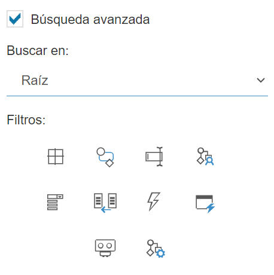](_images/image623.png)

Figura 476 Búsqueda avanzada[](#id79 "Link to this image")

#### El árbol de paquetes[](#el-arbol-de-paquetes "Link to this heading")

El árbol de paquetes es similar a la estructura de carpetas de un disco duro: tiene un paquete raíz, que puede tener subpaquetes (paquetes hijos), que a su vez pueden tener subpaquetes, de la misma forma que un sistema de archivos tiene una carpeta raíz con subcarpetas, que a su vez pueden tener subcarpetas.

Además, un paquete puede contener plantillas de proceso. Todos estos elementos se muestran en el árbol de paquetes y pueden contener ítems de procesos (por ejemplo, datos de aplicación), que no se muestran en el árbol. Sin embargo, las opciones para verlos, crearlos y modificarlos sí son accesibles desde el árbol de paquetes.

Un paquete se puede mostrar abierto (se muestran sus hijos) o cerrado (no se muestran) ([Figura 477](#packagestree)). Para abrir un paquete, haga clic en el triángulo que está a su izquierda, y que indica si está abierto o cerrado.

[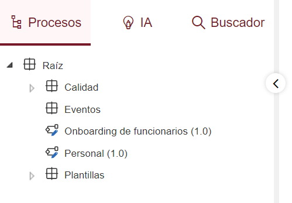](_images/image634.png)

Figura 477 Árbol de paquetes.[](#id80 "Link to this image")

Al hacer doble clic en un paquete, su formulario de propiedades se abre en un panel (las propiedades de los elementos del árbol se describen en [Trabajo con paquetes, plantillas de proceso y versiones](#trabajo-con-paquetes-plantillas-de-proceso-y-versiones)). Por otro lado, si se hace doble clic en una plantilla, se abre el grafo de la versión en la que se está trabajando.

Para cada elemento, hay disponibles varias operaciones a las cuales se accede mediante un menú contextual que aparece cuando se le hace clic con el botón derecho del ratón. Las opciones que pueden aparecer en el menú contextual son las siguientes:

*   **Ítems:** cuando se hace clic en esta opción, aparece un submenú para seleccionar el tipo de los ítems que se desean ver o modificar. Cuando se selecciona el tipo de ítems, se abre una pantalla que muestra los ítems del tipo seleccionado pertenecientes al paquete. En esa pantalla se pueden ver y modificar los ítems existentes, además de crear nuevos. Las listas de ítems se describen en general en [Listas de ítems](#listas-de-items). Cada tipo de ítem y sus propiedades se describen detalladamente en [Ítems del proceso](#items-del-proceso).
    
*   **Opciones de control de cambios:** las opciones de control de cambios impiden que un mismo elemento sea modificado por más de un usuario simultáneamente. Esto evita pérdidas de modificaciones que ocurrirían si no se hiciera este control.
    
    *   **Editar:** desbloquea el elemento para el usuario que lo selecciona, permitiéndole modificarlo, y lo bloquea para los demás.
        
    *   **Editar (compatible):** desbloquea una plantilla de proceso para el usuario que lo selecciona, pero no le permite hacer algunos cambios que podrían afectar procesos que se están ejecutando (por ejemplo, no le permite eliminar pasos).
        
    *   **Descartar:** descarta todas las modificaciones realizadas en la plantilla desde la última vez que se guardaron los cambios.
        
    *   **Guardar:** guarda los cambios realizados en la plantilla. Si la plantilla ya fue publicada, los cambios impactarán en los procesos que se inicien a partir de ella. Puedes elegir entre guardar y seguir editando o guardar finalizar cambios. Esta última opción no solo persiste los cambios realizados, sino que también libera la plantilla para que otra persona pueda trabajar en ella.
        
*   **Publicar:** publica la plantilla que se está editando, guardando los últimos cambios. Luego de publicado, el proceso va a estar disponible para ser iniciado en Qflow Task. Cada plantilla solo puede tener una versión publicada, por lo que si ya existe una será reemplazada.
    
*   **Despublicar:** disponible solo si estamos trabajando con la versión publicada de la plantilla. Ten en cuenta que, si despublicas una plantilla, no se podrán iniciar procesos con ella.
    
*   **Agregar sub paquete:** sólo disponible para paquetes, permite agregar un paquete dentro del paquete seleccionado. Cuando se selecciona esta opción, Qflow muestra en la zona de edición un formulario para ingresar el nombre y la descripción del nuevo paquete.
    
*   **Agregar plantilla de proceso:** permite agregar una plantilla de proceso dentro del paquete seleccionado (esta opción sólo está disponible para paquetes).
    
*   **Eliminar:** permite borrar el elemento seleccionado. En el caso de los paquetes, solo aparece si no tiene subpaquetes. Para las plantillas, elimina la plantilla junto con todas sus versiones.
    
*   **Eliminar versión:** permite eliminar una de las versiones de la plantilla seleccionada. Solo aparece si la plantilla tiene más de una versión.
    
*   **Refrescar:** actualiza en pantalla el elemento seleccionado y sus descendientes para reflejar los últimos cambios ocurridos. Por ejemplo, si un usuario agregó un paquete recientemente y otro usuario no lo ve porque es demasiado nuevo, al actualizar el paquete que lo contiene, el árbol reflejará el cambio y mostrará el paquete nuevo.
    
*   **Etapas:** muestra una pantalla con las etapas definidas para la plantilla seleccionada, y permite modificarlas. (Por detalles, consulte la sección [Etapas](#etapas)).
    
*   **Agregar versión de proceso:** agrega una nueva versión a una plantilla.
    
*   **Grafo:** abre el diseño de proceso (diagrama) de una versión.
    
*   **Historial:** muestra la historia de acciones ejecutadas sobre el elemento (quién le hizo qué y cuándo). Se indica también en qué zona horaria se muestran las fechas.
    
*   **Propiedades:** muestra el formulario de propiedades del elemento. En el caso de las plantillas, se despliega un submenú que permite acceder a las propiedades de la plantilla o de la versión en la que estamos trabajando.
    
*   **Formularios del proceso:** abre un submenú con dos opciones: “Formulario de edición del proceso” y “Formulario del proceso”. Estas opciones permiten abrir la ventana de propiedades de esos formularios para:
    
    *   Definir la visibilidad de datos, roles, adjuntos y comentarios (ver [Visibilidad de datos, roles, adjuntos y comentarios](15-QflowDesign.md#visibilidad-de-datos-roles-adjuntos-y-comentarios)).
        
    *   Asociar validaciones a los formularios (ver [Validaciones](#validaciones)).
        
    *   Asociar manejadores de eventos a los procesos (ver [Manejadores de eventos](#manejadores-de-eventos)).
        
*   **Exportar**: exporta el elemento a un archivo XML, para que pueda ser importado en otro lugar donde esté instalado Qflow. Hay más información en la sección [Exportación de paquetes, plantillas y versiones](#exportacion-de-paquetes-plantillas-y-versiones).
    
*   **Importar**: importa un archivo XML que contiene la definición de paquetes o plantillas. Hay más información en la sección [Importación de paquetes, plantillas y versiones](#importacion-de-paquetes-plantillas-y-versiones).
    

#### Espacio creativo[](#espacio-creativo "Link to this heading")

El espacio creativo de Qflow Design muestra un listado de los diseños de proceso que fueron generados mediante nuestro asistente de inteligencia artificial, pero que aún no fueron confirmados como procesos que forman parte del árbol de paquetes. Estos procesos se almacenan por cada usuario en la memoria del navegador.

Para más información, vea la sección del [Asistente de inteligencia artificial](#asistente-de-inteligencia-artificial).

Figura 478 Espacio creativo[](#id81 "Link to this image")

#### Exportación de paquetes, plantillas y versiones[](#exportacion-de-paquetes-plantillas-y-versiones "Link to this heading")

Para exportar un paquete o plantilla, haz lo siguiente:

1.  Guarda y finaliza los cambios del paquete o plantilla.
    
2.  Haz clic con el botón derecho sobre el paquete o plantilla en el árbol de paquetes. Qflow mostrará un menú contextual.
    
3.  En el menú contextual, selecciona la opción “Exportar”. Qflow te mostrará una ventana como la de la [Figura 479](#exportpackagepanel).
    
4.  En el caso de las plantillas, es posible elegir entre exportar la plantilla solo con la versión en la que estamos trabajando o incluir todas las versiones disponibles. Para los paquetes, se puede optar por exportar únicamente el paquete actual o exportar el paquete completo junto con sus subpaquetes y plantillas. En ambos casos, se ofrece la opción de comprimir o no los archivos antes de exportar.
    
5.  Haz clic en “Exportar”.
    

[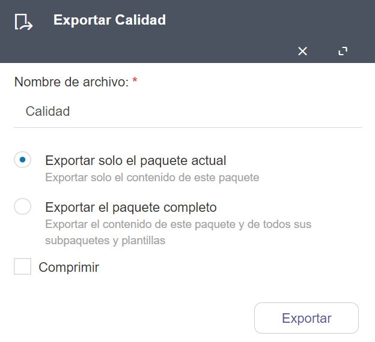](_images/image674.png)

Figura 479 Panel de Exportar paquete[](#id82 "Link to this image")

#### Importación de paquetes, plantillas y versiones[](#importacion-de-paquetes-plantillas-y-versiones "Link to this heading")

Para importar un archivo producido por una exportación anterior, haz lo siguiente:

1.  Selecciona el paquete o plantilla donde deseas importar el contenido del archivo y haz clic con el botón derecho.
    
2.  En el menú contextual, selecciona “Importar”. Qflow mostrará una ventana como la de la [Figura 480](#importpanel).
    
3.  Selecciona el formato del archivo a importar. Los formatos soportados son el nativo de Qflow y BPMN XML.
    
4.  Selecciona el archivo a importar y marca las opciones que desees:
    
    1.  **Actualizar los parámetros de aplicación existentes:** si esta opción está marcada, los valores de los parámetros de aplicación serán sustituidos por los valores de los parámetros de aplicación importados. De lo contrario, no. Esto es útil porque los mismos parámetros pueden tener valores distintos en distintos ambientes.
        
    2.  **Corregir referencias ausentes:** esta opción le indica a Qflow que debe corregir referencias a elementos que no se encuentran en la base de datos en la cual se está haciendo la importación. Por ejemplo, si no se encuentra un usuario al que hace referencia un rol, Qflow ignorará ese usuario en la importación. Si no se marca esta opción, cuando Qflow encuentre una referencia a un elemento ausente, interrumpirá la importación, y dejará la base de datos en el mismo estado en el que se encontraba antes.
        
5.  Haz clic en “Importar”. Si el paquete, plantilla o versión contenido en el archivo ya existe, Qflow te permitirá optar entre actualizar el paquete, plantilla o versión ya existente con los datos importados, o crear uno nuevo. Esto permite actualizar procesos que habían sido importados desde entornos de desarrollo.
    

[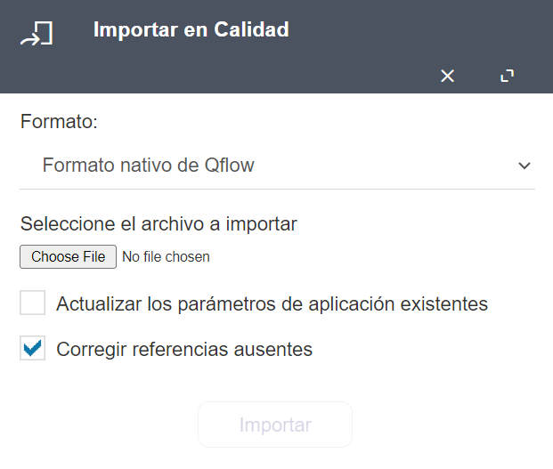](_images/image684.png)

Figura 480 Panel de Importar[](#id83 "Link to this image")

##### Página de inicio[](#pagina-de-inicio "Link to this heading")

Cuando un usuario ingresa a Qflow Design, o cuando hace clic en el ícono de Qflow Design en el menú superior, se muestra la página de inicio [Figura 481](#homepageeditionzone).

[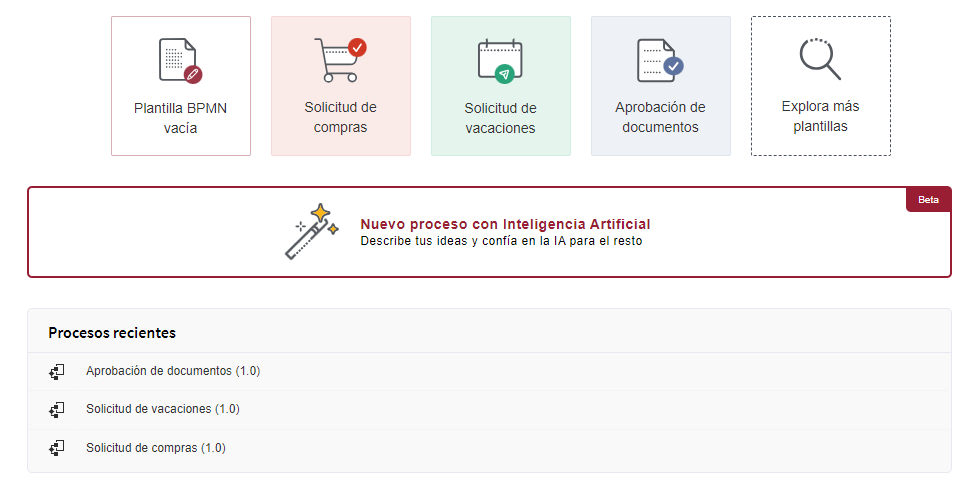](_images/design-startpage-cloud.png)

Figura 481 Página de inicio[](#id84 "Link to this image")

En la parte superior se encuentran opciones para crear plantillas. Se puede comenzar con una plantilla vacía, o seleccionar alguna de las plantillas pre-creadas que ofrece Qflow. Haga clic en «Explora más plantillas» para ver el catálogo completo de plantillas pre-creadas ([Figura 482](#exploremoretemplates)).

[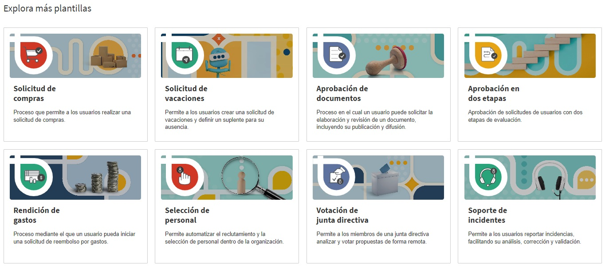](_images/exploreMoreTemplatesCards.png)

Figura 482 Sección de explorar más plantillas[](#id85 "Link to this image")

La opción de «Nuevo proceso con Inteligencia Artificial» nos lleva al formulario de generación de procesos con inteligencia artificial ([Figura 513](#generateaiprocessform)). En esta vista podremos ingresar una descripción textual para que nuestro asistente genere un proceso en base a ella.

La sección “Procesos recientes” muestra un listado de las plantillas con las que se ha interactuado recientemente. Haga clic sobre los elementos de la lista para abrir el diseño de la plantilla correspondiente.

### Trabajo con paquetes, plantillas de proceso y versiones[](#trabajo-con-paquetes-plantillas-de-proceso-y-versiones "Link to this heading")

En esta sección se explica cómo crear y modificar paquetes, plantillas de proceso y versiones, pero no cómo diseñar el diagrama de una versión. Para esto último, consulta la sección [Diseño del proceso de una versión](#diseno-del-proceso-de-una-version).

#### Creación de un paquete[](#creacion-de-un-paquete "Link to this heading")

Para crear un paquete:

1.  En el árbol de paquetes, haz clic con el botón derecho sobre el paquete dentro del cual desea crear un nuevo paquete.
    
2.  Selecciona la opción “Agregar sub paquete”. Esto hace que se muestre un formulario como el de la [Figura 483](#createpackage), en el que se indica en qué paquete se agregará el paquete nuevo y en el que hay dos cajas de texto para ingresar el nombre y la descripción del nuevo paquete.
    
3.  Ingresa el nombre y la descripción del nuevo paquete y haz clic en el botón de guardar.
    

[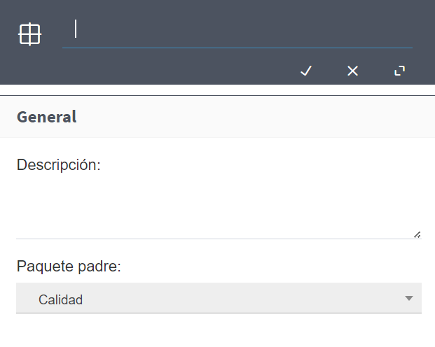](_images/image704.png)

Figura 483 Crear paquete[](#id86 "Link to this image")

#### Creación de una plantilla de proceso[](#creacion-de-una-plantilla-de-proceso "Link to this heading")

Para crear una plantilla de proceso, haga lo siguiente:

1.  En el árbol de paquetes, haz clic con el botón derecho sobre el paquete dentro del cual desea crear una plantilla.
    
2.  Seleccione la opción “Agregar plantilla de proceso”. Esto hace que se muestre un formulario como el de la [Figura 484](#createnewtemplate), en el que se indica en qué paquete se agregará la plantilla nueva y en el que hay dos cajas de texto para ingresar el nombre y la descripción de la plantilla. También debes seleccionar el patrón de plantilla (en la [Figura 484](#createnewtemplate) la opción que aparece seleccionada por defecto es “Plantilla BPMN vacía”, pero se puede partir de un conjunto de plantillas pre-creadas por Qflow. Para más información sobre estas plantillas, vea [Plantillas pre-creadas](#plantillas-pre-creadas)).
    
3.  Ingresa el nombre y la descripción de la nueva plantilla, marca la opción “Crear subpaquete contenedor del proceso” si quieres que la nueva plantilla sea creada dentro de un subpaquete con el mismo nombre. Luego haz clic en el botón de aceptar.
    

[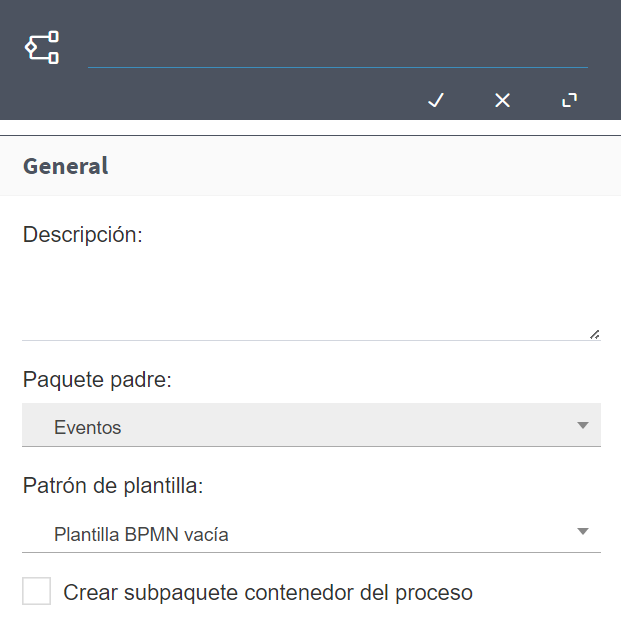](_images/image715.png)

Figura 484 Crear nueva plantilla[](#id87 "Link to this image")

#### Creación de una versión[](#creacion-de-una-version "Link to this heading")

Para crear una versión, haga lo siguiente:

1.  En el árbol de paquetes, haz clic con el botón derecho sobre la plantilla de proceso dentro de la cual desea crear la versión. Esto hace que se muestre el menú contextual de la plantilla seleccionada.
    
2.  Selecciona la opción “Agregar versión del proceso”. Esto hace que se muestre un formulario como el de la [Figura 485](#createversion), en el que se indica en qué plantilla se agregará la nueva versión y en el que hay dos cajas de texto para ingresar el nombre y la descripción de la nueva versión. Si la plantilla seleccionada ya tiene versiones, en el campo “Patrón de la versión de plantilla” puede seleccionar una de ellas para que Qflow la copie. Por ejemplo, en la [Figura 486](#selectversionpattern) se pueden seleccionar las versiones 1.0, 1.1 o 1.2. Si la versión seleccionada tiene un nombre que sigue el estándar de Qflow (“1.0”, “1.1”, etc.), Qflow ingresará automáticamente el nombre que, según ese estándar correspondería al de la versión siguiente (si la versión seleccionada es “1.1”, Qflow pondrá “1.2” en la caja de texto del nombre). También puede crear una versión sin copiar ninguna otra (“Patrón de la versión de plantilla”). En este caso, la nueva versión se creará con un evento de inicio y un evento de fin.
    
3.  Ingresa el nombre (si es necesario) y la descripción de la nueva versión y haz clic en el botón de aceptar.
    

[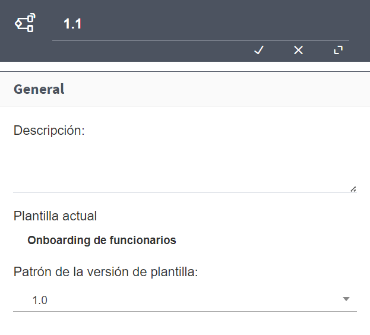](_images/image723.png)

Figura 485 Crear una versión[](#id88 "Link to this image")

[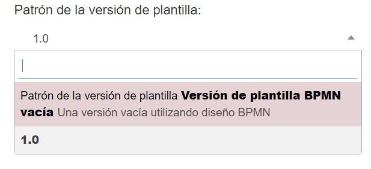](_images/image733.png)

Figura 486 Seleccionar un patrón de versión[](#id89 "Link to this image")

#### Modificación de las propiedades de un paquete, plantilla de proceso o versión[](#modificacion-de-las-propiedades-de-un-paquete-plantilla-de-proceso-o-version "Link to this heading")

Paquetes, plantillas de proceso y versiones tienen propiedades adicionales a las que se muestran cuando se los crea (nombre y descripción). Para modificar las propiedades de un paquete, búsquelo en el árbol de paquetes, haga clic derecho y seleccione la opción «Propiedades». En el caso de las plantillas, al hacer clic derecho y seleccionar «Propiedades», se desplegarán dos opciones: una para acceder a las propiedades de la plantilla y otra para las propiedades de la versión en la que está trabajando actualmente. Esto hace que Qflow muestre el formulario de edición del elemento seleccionado ([Figura 487](#packageproperties)).

[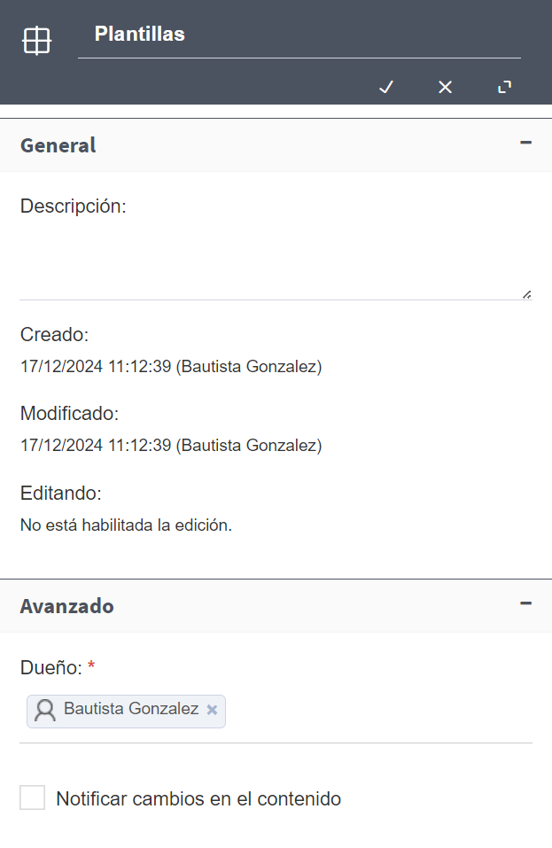](_images/image743.png)

Figura 487 Propiedades de un paquete[](#id90 "Link to this image")

Este formulario de edición tiene dos partes:

*   **General:** muestra y permite modificar el nombre y la descripción, además de los siguientes datos (todas las fechas y horas están expresadas en la zona horaria de la preferencia del usuario):
    
    *   Fecha y hora en la que el elemento fue creado y quién lo creó.
        
    *   Fecha y hora de la última modificación hecha al elemento y quién la hizo.
        
    *   Si el elemento está siendo editado o no. Si está siendo editado, se indica cuando fue tomado y por quién.
        
    *   Si el elemento es una plantilla de proceso, se muestra la versión publicada y se permite cambiarla.
        
    *   Si el elemento es una versión, se muestra si es un borrador o no. Un borrador es una versión que no es válida para publicar (produciría errores al ser ejecutada), pero que se puede guardar. Una vez que una versión es publicada, ya no es posible que vuelva a ser un borrador.
        
*   **Avanzado:** las propiedades del subformulario avanzado son:
    
    *   **Comunes a paquetes, plantillas de proceso y versiones:**
        
        *   **Dueño:** indica qué usuario es el dueño del elemento. El dueño del elemento es un usuario del sistema. Además, si se marca el casillero que indica que hay que enviar notificaciones cuando el elemento es modificado, el dueño es el destinatario de esas notificaciones. Se puede quitar el dueño haciendo clic en la cruz que aparece en el rectángulo que contiene su nombre, de modo que el elemento ya no tenga dueño. Para especificar el dueño, empiece a escribir su nombre y al aparecer el nombre de usuario de la persona que desea asignar al elemento, selecciónelo.
            
        *   **Notificar cambios en el contenido:** si se marca este casillero, cada vez que el elemento sufre modificaciones, Qflow envía una notificación a su dueño.
            
    *   Las plantillas, además, tienen la siguiente propiedad avanzada:
        
        *   **Notificar proceso en error:** si se marca este casillero, cada vez que un proceso basado en esa plantilla tiene un error, se envía una notificación al dueño.
            

#### Administrar permisos de paquetes y plantillas de proceso[](#administrar-permisos-de-paquetes-y-plantillas-de-proceso "Link to this heading")

Para administrar los permisos de un paquete o plantilla, búscalo en el árbol de paquetes, haz clic derecho y selecciona la opción “Administrar permisos de paquete” ([Figura 488](#managepackagepermissions)). Esto hace que Qflow muestre un formulario como el de la [Figura 489](#managepackagepermissionspanel). Ese formulario muestra una tabla con todos los permisos definidos. Para cada uno se muestra para qué rol es el permiso, la descripción del rol, una lista de acciones permitidas y una lista de acciones denegadas. La lista se puede filtrar de la forma que se explica en [Listas de ítems](#listas-de-items) y también se puede modificar, agregando, quitando y modificando elementos.

[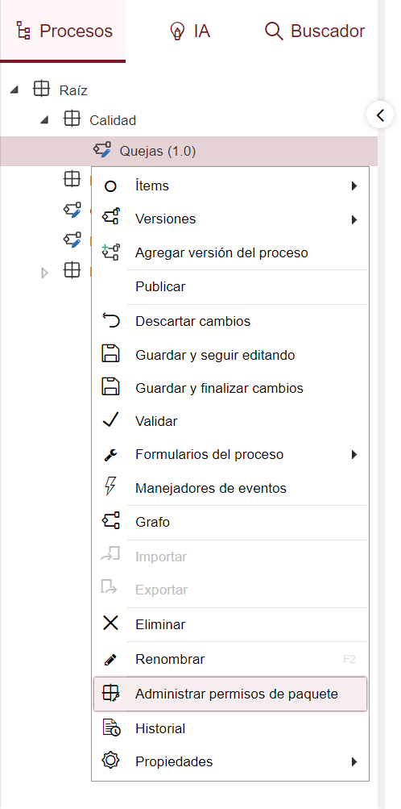](_images/image753.png)

Figura 488 Administrar permisos de paquete[](#id91 "Link to this image")

[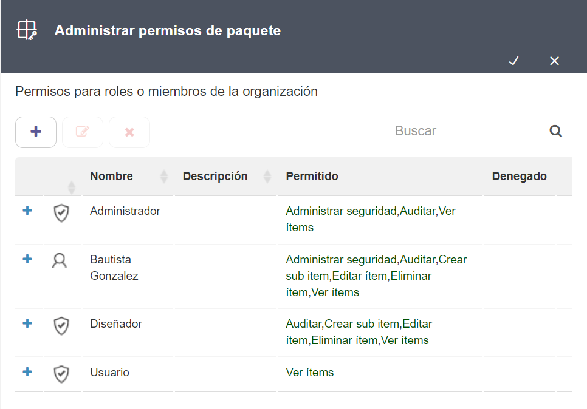](_images/image764.png)

Figura 489 Panel de Administrar permisos de un paquete[](#id92 "Link to this image")

Para agregar un permiso:

1.  Haz clic en el botón de agregar. Eso hace que Qflow muestre un buscador de roles ([Figura 490](#roleselection)).
    
2.  Selecciona el destinatario del permiso. Para eso, escribe parte de su nombre en el buscador (donde dice “Comience a escribir un rol”) y cuando lo veas en la lista que aparece, selecciónalo. El destinatario de un permiso puede ser un elemento de cualquiera de estos tipos:
    
    1.  Rol de seguridad (no confundir con rol de proceso; los roles de proceso sirven para asignar tareas en un proceso y no pueden ser seleccionados como destinatarios de permisos).
        
    2.  Nodo
        
    3.  Grupo
        
    4.  Cola de trabajo
        
    5.  Usuario
        

[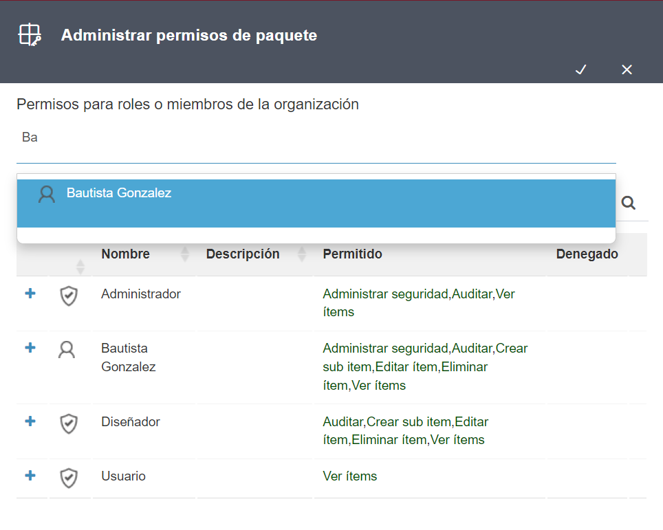](_images/image774.png)

Figura 490 Selección de un rol[](#id93 "Link to this image")

[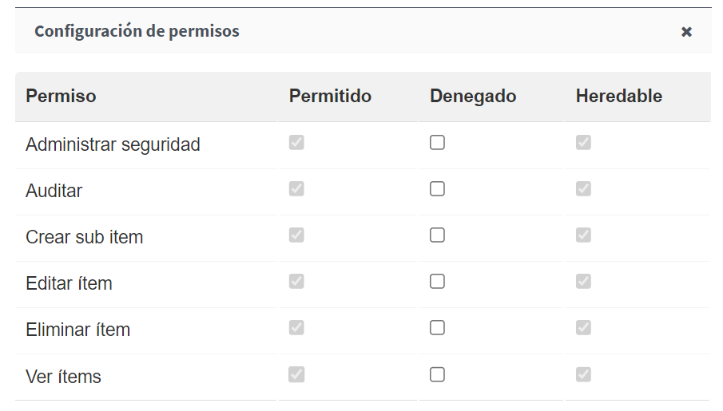](_images/image784.png)

Figura 491 Permisos[](#id94 "Link to this image")

3.  Para cada uno de los permisos mostrados en esa ventana, indique si se permite o se deniega, y si es heredable. Cuando un usuario tiene un permiso heredable sobre un paquete, dicho permiso se aplica también a sus descendientes, a menos que en alguno de ellos se deniegue explícitamente.
    

Los permisos que se pueden asignar son:

*   **Ver ítem:** permite ver el paquete y los elementos definidos en él, como datos de aplicación, roles del proceso, etc.
    
*   **Editar ítem**: permite modificar el paquete y los elementos definidos en él, como datos de aplicación, roles del proceso, etc.
    
*   **Crear sub ítem:** permite crear elementos dentro del elemento.
    
*   **Eliminar ítem:** permite borrar el elemento.
    
*   **Auditar:** permite visualizar información de auditoría del elemento.
    
*   **Administrar seguridad**: permite agregar y modificar permisos sobre el elemento a usuarios, grupos o roles.
    

Un usuario tiene permiso para ejecutar una acción si se cumple simultáneamente que:

*   El usuario está asociado a algún rol de seguridad, grupo, nodo o cola de trabajo que tiene permiso para ejecutar esa acción, o su propia cuenta de usuario tiene ese permiso directamente.
    
*   El usuario no está asociado a algún rol de seguridad, grupo, nodo o cola de trabajo al que se le haya negado ese permiso, o a su propia cuenta de usuario se le ha negado ese permiso.
    

También puede suceder que el usuario no cumpla estas condiciones, pero sea sustituto de uno que sí las cumpla, y en ese caso también tendría permiso. Por más detalles acerca del manejo de permisos en Qflow, consulta el manual de [Qflow Team](18-QflowTeam.md), donde también se explica cómo asociar usuarios con roles de seguridad, nodos, grupos y colas de trabajo.

### Plantillas pre-creadas[](#plantillas-pre-creadas "Link to this heading")

Además del patrón de plantilla vacía seleccionada por defecto, Qflow provee un conjunto de patrones creados al instalar el sistema. Estas plantillas representan algunos flujos y operaciones de negocio que comúnmente se quieren automatizar. Podemos seleccionar estas plantillas en la lista de «Patrón de plantilla» en el panel de creación de la misma, o usando los botónes de la página principal (ver [Figura 481](#homepageeditionzone))

[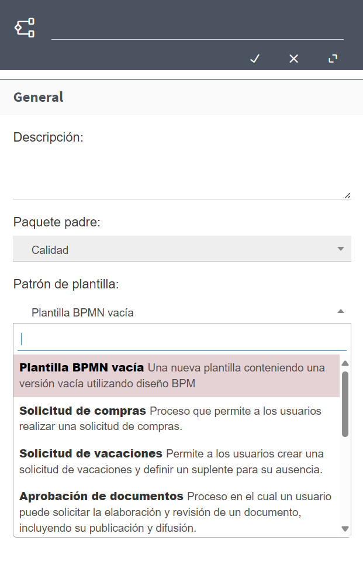](_images/designPremadeTemplatesList.png)

Figura 492 Listado de plantillas pre-creadas[](#id95 "Link to this image")

Las plantillas que Qflow tiene pre-creadas por defecto son las siguientes:

*   **Aprobación de documentos:** este proceso contempla el caso de una aprobación de documentos, incluyendo las actividades de creación, revisión, aprobación y su notificación a elaboradores y lista de difusión, así como también opcionalmente una tarea para cargar el documento a un repositorio documental.
    
*   **Solicitud de vacaciones:** define un proceso por el cual un miembro de la organización puede hacer una solicitud para sus vacaciones. Incluye etapas de aprobación del supervisor, verificar y actualizar saldo de días disponbiles, definir suplencias y envío de recordatorios previos al comienzo del período de vacaciones.
    
*   **Aprobación en dos etapas:** define un proceso más generico en el cual se da una aprobación validada por dos usuarios aprobadores, mediante un formulario de petición en el que el usuario que inicie el proceso podrá ingresar el motivo y fecha planificada de lo que se quiera aprobar.
    
*   **Rendición de gastos:** define un proceso en el cual el usuario iniciador presenta uno o más gastos con su justificación, una etapa de aprobación en la cual el gasto puede ser aprobado o no (en caso de que no, permite una revisión de la solicitud para evaluar nuevamente), tareas para representar el movimiento de fondos de parte de personal financiero y notificaciones al usuario solicitante, tanto por aprobación como por rechazo.
    
*   **Solicitud de compras:** define un proceso en el cual el usuario iniciador presenta un gasto con justificación, monto y moneda utilizada, seguido de una aprobación que puede darse en dos etapas en caso que el monto supere un umbral preestablecido. Las aprobaciones tienen definidos controles de tiempo para asegurar que se de un cierre a las solicitudes. Incluye también notificaciones al usuario solicitante por aprobación o rechazo.
    
*   **Selección de personal:** contempla la revisión de currículums postulados y la coordinación y realización de entrevistas. Éstas pueden ser de varios tipos, incluyendo pre selección, por competencias, evaluación psicotécnica, evaluación técnica, verificación de referencias laborales, entre otras. Una vez realizadas las entrevistas, se procede al armado y realización de propuesta laboral. Al terminar el proceso, se notifica al candidato sobre el resultado de su postulación, ya sea de aceptación o rechazo. Además, el proceso cuenta con controles de tiempo para asegurar la eficiencia en la coordinación de entrevistas, con recordatorios semanales para no olvidar programarlas.
    
*   **Votación de junta directiva:** permite a miembros de juntas directivas participar de votaciones de propuestas bajo una modalidad remota. La plantilla contempla etapas de revisión, votación, modificación y una reunión presencial en caso de ser necesario. Al finalizarse el proceso los usuarios serán notificados si la propuesta fue rechazada o aprobada.
    
*   **Soporte de incidentes:** permite a los usuarios reportar incidencias. La plantilla contempla etapas de evaluación del incidente, asignación de responsable de la resolución, resolución del incidente y validación de la resolución. A su vez, también se contempla etapas donde se puede brindar más información de ser requerido. Al finalizarse el proceso los ususarios serán notificados si el incidente fue solucionado o no, o si fue descartado.
    

Nota

Estas plantillas tienen gran parte de la configuración del diseño ya resueltas, pero en varios casos será necesario que se adapten a las necesidades y particularidades de cada organización. Se recomienda leer las notas incluídas dentro del diseño de estas plantillas para dar las configuraciones finales del funcionamiento de los procesos.

### Listas de ítems[](#listas-de-items "Link to this heading")

El diseño de un proceso también implica definir ítems que el proceso utiliza: para asignar tareas a personas, se necesitan roles. Para manejar datos, algunos de los cuales pueden ser necesarios para definir el flujo del proceso, se necesitan datos de aplicación. Para acceder a funcionalidades de sistemas externos, se necesitan integraciones y es recomendable utilizar parámetros de aplicación que contengan información de acceso a esos sistemas. Esta sección explica cómo utilizar Qflow Design para crear, modificar y eliminar ítems. Para más información sobre el uso de cada tipo de ítem y sus propiedades, consulte la sección [Ítems del proceso](#items-del-proceso).

La [Figura 493](#applicationdatalist) muestra la lista de datos de aplicación, que es una típica lista de ítems. La lista de ítems se muestra como una tabla con varias columnas, la primera de las cuales contiene cajas que permiten seleccionar uno o más ítems (si se marca la caja del cabezal, se seleccionan todos los ítems).

[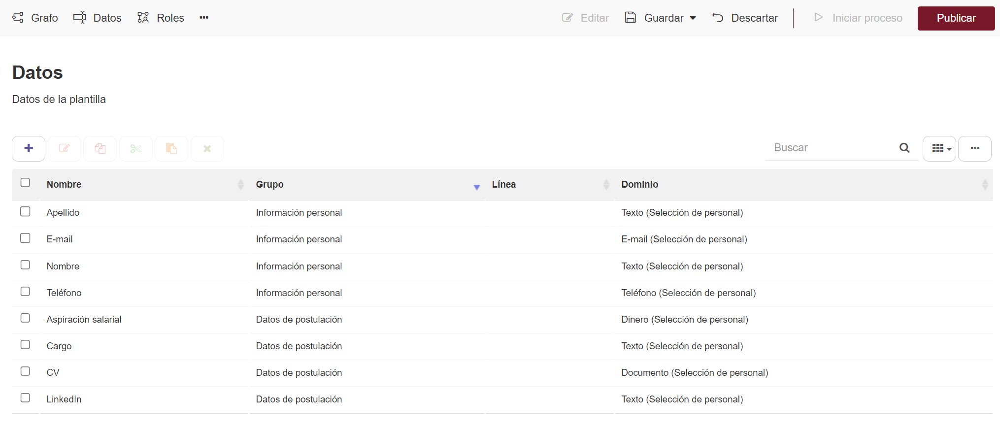](_images/image793.png)

Figura 493 Datos de aplicación[](#id96 "Link to this image")

En la parte superior izquierda están los íconos correspondientes a las siguientes operaciones:

*   **Agregar:** cuando se hace clic en este ícono, Qflow muestra el formulario de propiedades básicas del ítem. Para crear un ítem, llena sus propiedades y haz clic en el botón de aceptar. La descripción detallada de las propiedades de cada tipo de ítem se encuentra en [Ítems del proceso](#items-del-proceso).
    
*   **Modificar:** cuando se selecciona un ítem y se hace clic en este ícono, Qflow muestra el formulario de propiedades básicas del ítem ([Figura 494](#normalandexpandedform)), que es el mismo formulario que el que se usa para crear un ítem.
    

[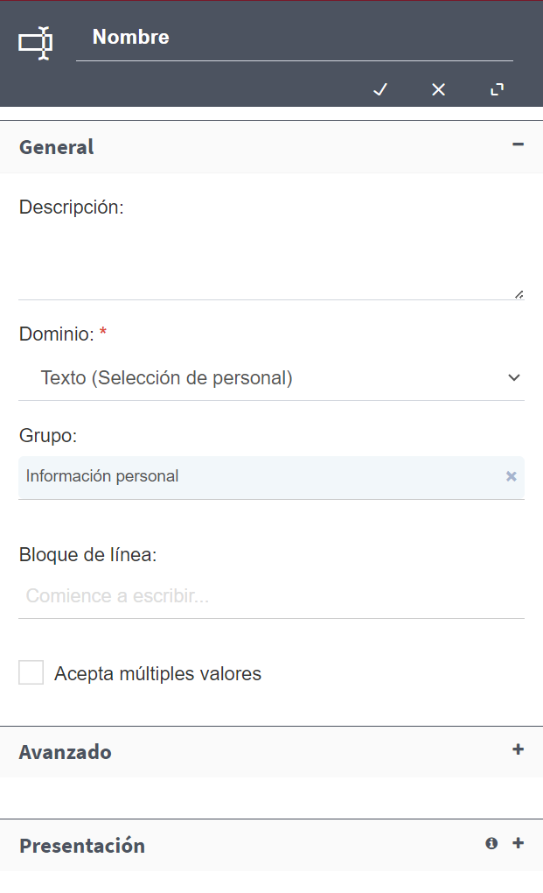](_images/image803.png)

Figura 494 Propiedades dato de aplicación[](#id97 "Link to this image")

*   **Cortar:** permite cortar elementos para pegarlos en otro paquete: cuando se pegan, esos elementos son eliminados del paquete original. **IMPORTANTE:** si se corta un elemento y se pega en una rama del árbol distinta a la de origen, se pueden crear inconsistencias, pues otros elementos de la rama de origen que usaban el elemento movido ya no tendrán acceso a él. Además, es una buena práctica guardar los cambios de ambos paquetes, tanto el de origen como el de destino.
    
*   **Copiar:** permite copiar elementos para pegarlos en el mismo u otro paquete. Cuando se pegan en el mismo paquete, los nuevos elementos se renombrarán, agregando un “\_1” o cambiando el “\_X1” por “\_(X1 + 1)” si el nombre finalizaba con “\_X1” siendo “X1” un número entero.
    
*   **Pegar:** pega los elementos copiados o cortados.
    
*   **Eliminar:** cuando se seleccionan uno o más elementos y se hace clic en este ícono, se eliminan los elementos seleccionados, previa confirmación.
    

Estos íconos se habilitan o deshabilitan según qué elementos estén seleccionados. Por ejemplo, el ícono de “Modificar” sólo está habilitado si hay exactamente un ítem seleccionado, porque si no hay ítems seleccionados, no hay un ítem al cual se pueda aplicar la operación de modificar, mientras que si hay más de uno, es imposible determinar a cuál de ellos se aplica la operación. Además, si el paquete está protegido, la única posible de estas acciones es “Copiar”.

También en la parte superior, pero hacia la derecha, hay una caja de texto que permite filtrar los elementos que se muestran en la lista. Al escribir un texto en esa caja, la lista ocultará aquellos elementos que no contengan en ninguna de las columnas el texto ingresado. A la derecha de esa caja de texto, hay un botón que permite especificar qué columnas deseas ver.

Para promover las buenas prácticas en el diseño de procesos, se muestran por defecto los elementos de la plantilla. Sin embargo, también es posible acceder a los de la versión en la que se está trabajando, si así se desea. Para ello, utilice el botón ubicado más a la derecha ([Figura 495](#configureitemssource)).

[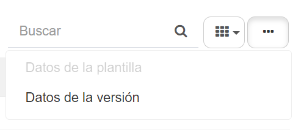](_images/image815.png)

Figura 495 Cambiar entre datos de la plantilla y datos de la versión[](#id98 "Link to this image")

### Etapas[](#etapas "Link to this heading")

Qflow permite definir etapas para una plantilla de proceso. Una etapa define un “Tiempo esperado” y un “Tiempo máximo”, que determinan dos plazos para el fin de la etapa. Tanto para el tiempo esperado como para el tiempo máximo, se puede especificar una lista de roles de plantilla de proceso que serán notificados si, una vez transcurrido el tiempo especificado, todavía no se terminó la etapa. El tiempo esperado es cuánto se estima que debería durar la etapa en un caso normal. El tiempo máximo indica un plazo más importante que el tiempo esperado: se supone que el proceso no debería permanecer en la misma etapa por un tiempo superior al indicado por el tiempo máximo.

Cuando un proceso está dividido en etapas, tiene más opciones de seguimiento en Qflow Task.

Las etapas se vinculan a secciones del proceso mediante el evento de inicio y eventos intermedios.

Para acceder al formulario que le permite definir etapas, abre el menú contextual de la plantilla haciéndole clic con el botón derecho en el árbol de paquetes y dentro de items seleccionando la opción “Etapas” ([Figura 496](#accessstagelist)).

[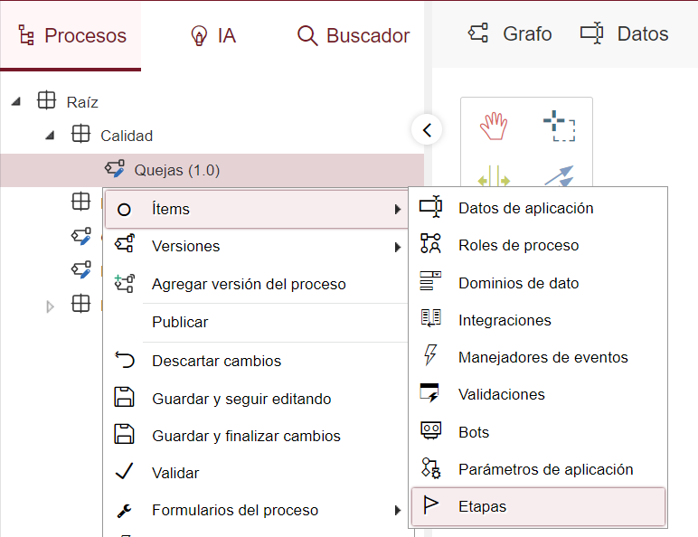](_images/image824.png)

Figura 496 Acceder a listado de etapas[](#id99 "Link to this image")

El formulario de definición de etapas se comporta de la misma forma que las listas de ítems. El tiempo esperado y el tiempo máximo se definen de la misma forma que otros plazos (se explica en [Configuración de plazos](#configuracion-de-plazos)).

[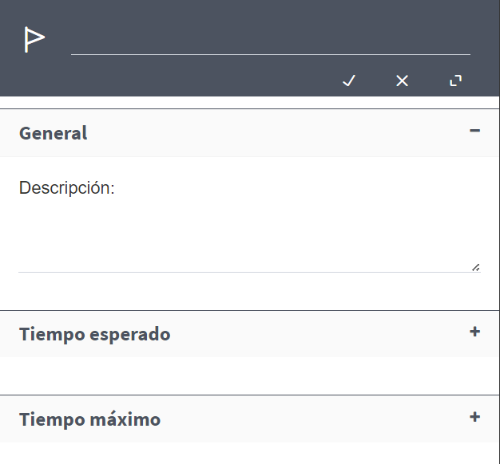](_images/image834.png)

Figura 497 Configuración de etapas[](#id100 "Link to this image")

La opción “Usar calendario” permite seleccionar un calendario para que sea utilizado al calcular los vencimientos. Si no se se marca esta opción, los vencimientos se calcularán sin tomar en cuenta fines de semana, feriados, etc ([Figura 498](#usecalendarconfiguration)). Para más información sobre calendarios, consulta el manual de [Qflow Team](18-QflowTeam.md).

[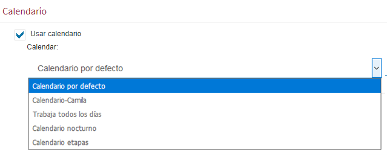](_images/image844.png)

Figura 498 Configuración de “Usar calendario”[](#id101 "Link to this image")

### Diseño del proceso de una versión[](#diseno-del-proceso-de-una-version "Link to this heading")

Para modificar el diseño de una plantilla, haga doble clic sobre ella en el árbol de paquetes y, en la barra de acciones que aparece en la parte superior, seleccione la opción «Editar» ([Figura 499](#designer)).

[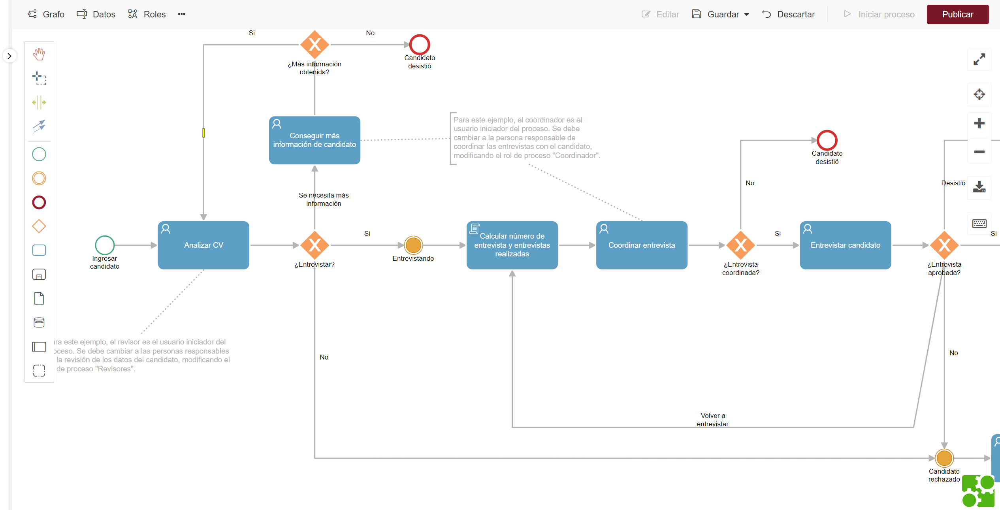](_images/image853.png)

Figura 499 Diseñador[](#id102 "Link to this image")

En la parte izquierda del diseñador hay una caja de herramientas, que está dividida en dos partes: la primera muestra herramientas de diseño. La segunda, elementos que se pueden agregar al diagrama. En la parte derecha del diseñador, hay una serie de botones cuyo objetivo es facilitar la visualización del diagrama, además de permitir guardarlo y exportarlo. Todas estas opciones se explican a continuación.

#### Herramientas de diseño[](#herramientas-de-diseno "Link to this heading")

La [Figura 500](#designtoolslist) muestra las herramientas de diseño.

[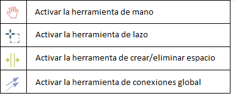](_images/image863.png)

Figura 500 Herramientas de diseño[](#id103 "Link to this image")

*   **Activar la herramienta de mano:** si selecciona esta herramienta y mantiene el botón del ratón presionado sobre la superficie de diseño mientras mueve el ratón, moverá la superficie de diseño. Por ejemplo, si ya no queda espacio libre en la superficie y deseas agregar algo debajo de los elementos que ya están en ella, puedes usar la herramienta y, manteniendo el botón apretado, mover el ratón hacia arriba. Esto desplazará la superficie de diseño hacia arriba, como si la superficie fuera una hoja de papel, la presionaras con la mano y la empujaras hacia arriba, de modo que la parte superior del papel ya no es visible y la parte inferior, sí.
    
*   **Activar la herramienta de lazo:** con esta herramienta puedes dibujar un rectángulo sobre la superficie de diseño. Los elementos que queden dentro del rectángulo y las conexiones entre ellos quedarán seleccionados.
    
*   **Activar la herramienta de crear/eliminar espacios:** con esta herramienta se puede crear espacio entre dos partes del diagrama, manteniendo presionado el botón del ratón y moviendo el ratón hacia la derecha. El efecto es como si se empujaran todos los elementos que están a la derecha del ratón hacia ese lado, generando un espacio entre sus nuevas posiciones y las que ocupaban antes. De forma similar, se puede hacer lo mismo pero moviendo el ratón hacia la izquierda, lo cual tiene el efecto inverso: se elimina el espacio del medio.
    
*   **Activar la herramienta de conexiones global:** esta herramienta permite conectar dos elementos, pero no es la única forma de hacerlo.
    

##### Elementos para agregar al diagrama[](#elementos-para-agregar-al-diagrama "Link to this heading")

La [Figura 501](#toolstoaddelementstodesign) muestra los elementos que se pueden agregar al diagrama. Los que son eventos, compuertas y actividades se describen con mayor detalle en la sección [Elementos del diseño de un proceso](#elementos-del-diseno-de-un-proceso).

[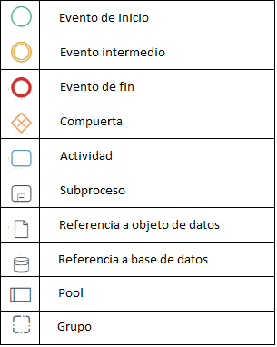](_images/image874.png)

Figura 501 Herramientas para agregar elementos al diseño[](#id104 "Link to this image")

*   **Evento de inicio:** marca dónde empieza la ejecución del proceso.
    
*   **Evento intermedio:** permite marcar un hito en la ejecución del proceso (por ejemplo, que terminó una fase del proceso). También se puede adjuntar a una actividad, en cuyo caso es un evento intermedio de borde.
    
*   **Evento de fin:** marca dónde terminar la ejecución del proceso: cuando un proceso llega a un evento de fin, finaliza su ejecución.
    
*   **Compuerta:** permite controlar el flujo del proceso. Compuertas exclusivas permiten elegir un camino entre varios posibles de un proceso. Compuertas inclusivas permiten crear varios caminos en paralelo.
    
*   **Actividad:** representa una acción o tarea. Puede ser una tarea desempeñada por una persona, pero también puede ser una acción ejecutada automáticamente por algún componente del sistema.
    
*   **Subproceso:** agrupa varios elementos.
    
*   **Referencia a objeto de datos:** es un elemento decorativo que representa datos que son utilizados en alguna actividad. Se conecta a otro elemento, típicamente una actividad, con una flecha punteada.
    
*   **Referencia a base de datos:** lo mismo que el dato, pero representa un almacén de datos (por ejemplo, una base de datos).
    
*   **Pool:** permite crear andariveles para organizar el proceso, agrupando dentro de un mismo nivel elementos relacionados.
    
*   **Grupo:** permite crear grupos, para visualizar mejor una serie de pasos relacionados. Este elemento es puramente visual, pues no influye en la ejecución de los pasos del grupo de ningún modo.
    

#### Herramientas de visualización del grafo[](#herramientas-de-visualizacion-del-grafo "Link to this heading")

La [Figura 502](#visualizationtools) muestra los botones que aparecen a la derecha en el diseñador.

[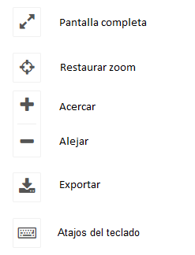](_images/image884.png)

Figura 502 Herramientas de visualización[](#id105 "Link to this image")

*   **Pantalla completa:** permite ingresar al modo de pantalla completa, en el cual se expandirá la zona de edición al máximo posible de su pantalla. Esto le permite enfocarse en la creación y configuración del diagrama sin interrupciones visuales. Para salir del modo pantalla completa, presione la tecla “Esc” o haga clic en el botón de salir de pantalla completa ([Figura 503](#exitfullscreen)).
    
*   **Restaurar zoom:** vuelve a colocar el nivel de zoom donde estaba inicialmente.
    
*   **Acercar:** aumenta el zoom.
    
*   **Alejar:** reduce el zoom.
    
*   **Exportar diagrama:** permite exportar el diseño del diagrama realizado. Al hacer clic sobre el botón tendrá las opciones de exportar la imagen del diagrama, seleccionando la opción “Exportar diagrama”, o el archivo BPMN de éste, seleccionando la acción “Exportar documento”, como muestra la [Figura 504](#exportoptions).
    
*   **Atajos de teclado:** muestra un cartel que indica todos los atajos de teclado disponibles, como muestra la [Figura 505](#keyboardshortcuts).
    

[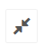](_images/image894.png)

Figura 503 Salir de pantalla completa[](#id106 "Link to this image")

[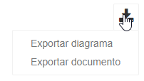](_images/image904.png)

Figura 504 Opciones de exportación[](#id107 "Link to this image")

[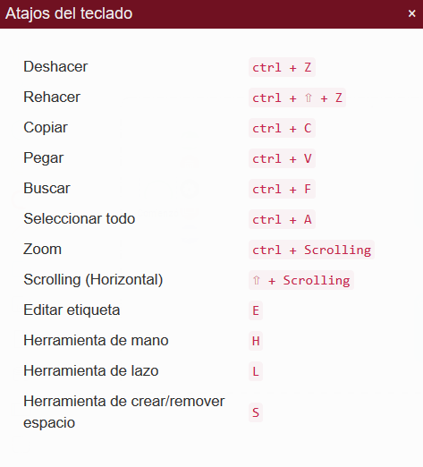](_images/image916.png)

Figura 505 Atajos de teclado[](#id108 "Link to this image")

#### Barra de acciones[](#barra-de-acciones "Link to this heading")

En la parte superior del diseñador se encuentra la barra de acciones, que facilita el acceso al diseño de la plantilla, sus datos, roles, dominios y demás elementos del proceso. Además, permite gestionar el estado de edición del paquete y, en el caso de las plantillas, también ofrece la opción de publicarlas y probarlas.

*   **Grafo:** visualiza el grafo de la plantilla, diseñado en notación BPMN. Desde esta vista podrás editar y configurar cada paso del proceso.
    
*   **Items del proceso:** estos botones permiten acceder directamente a los datos, roles y demás elementos de la plantilla en la que estás trabajando actualmente.
    
*   **Editar:** habilita la edición de la plantilla en la que estás trabajando actualmente.
    
*   **Guardar:** Guarda los cambios realizados en la plantilla. Si la plantilla ya fue publicada, los cambios impactarán en los procesos que se inicien a partir de ella. Puedes elegir entre guardar y seguir editando o guardar y finalizar cambios. Esta última opción no solo persiste los cambios realizados, sino que también libera la plantilla para que otra persona pueda trabajar en ella.
    
*   **Descartar:** descarta todas las modificaciones realizadas en la plantilla desde la última vez que se guardaron los cambios.
    
*   **Iniciar proceso:** una vez publicada la versión del diseño, puedes iniciar el proceso directamente desde Qflow Design.
    
*   **Publicar:** publica la plantilla que se está editando, guardando los últimos cambios. Luego de publicado, el proceso va a estar disponible para ser iniciado en Qflow Task. Cada plantilla solo puede tener una versión publicada, por lo que si ya existe una será reemplazada.
    

#### Diseño del proceso[](#diseno-del-proceso "Link to this heading")

Para diseñar el proceso se utilizan las herramientas de diseño para agregar elementos y conectarlos. Cada elemento tiene propiedades que también se pueden modificar desde el diseño.

##### Agregar un elemento[](#agregar-un-elemento "Link to this heading")

Para agregar un elemento al diseño, selecciónalo en la caja de herramientas y arrástralo hacia la zona de diseño (también puedes hacerle clic y luego hacer clic en la zona de diseño). Si deseas agregar un elemento a continuación de otro que ya existe, de modo que quede conectado a él, puedes seguir los siguientes pasos:

1.  Se selecciona un elemento.
    
2.  Entre los íconos que aparecen a la derecha, selecciona el que corresponde al tipo del elemento que se desea agregar a continuación.
    
3.  El nuevo elemento también tiene íconos a la derecha y puedes repetir la misma operación con ese elemento y los siguientes.
    

[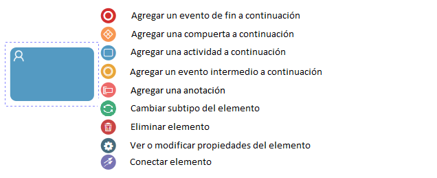](_images/image923.png)

Figura 506 Menú de opciones de un elemento[](#id109 "Link to this image")

En la [Figura 507](#addtasktostartevent) se puede ver un ejemplo donde a partir de un Evento de inicio, se crea una actividad.

[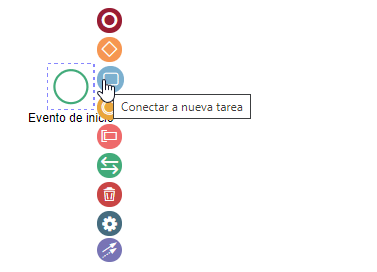](_images/image93.gif)

Figura 507 Agregar tarea a continuación de evento de inicio[](#id110 "Link to this image")

##### Agregar eventos de borde[](#agregar-eventos-de-borde "Link to this heading")

Para agregar un evento de borde al diseño, selecciona el evento intermedio en la caja de herramientas y arrástralo hacia la zona de diseño sobre alguna de las actividades que lo permiten ([Figura 508](#createbordereventinusertask)). Para ver más información sobre los eventos de borde y qué actividades lo permiten, consulta la sección [Eventos intermedios de borde](#eventos-intermedios-de-borde).

[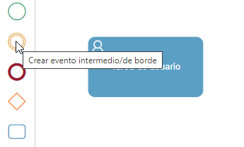](_images/image94.gif)

Figura 508 Crear evento de borde en tarea de usuario[](#id111 "Link to this image")

##### Cambiar subtipo del elemento[](#cambiar-subtipo-del-elemento "Link to this heading")

Una vez agregado un elemento al diseño, puede ser necesario cambiar su subtipo. Esto depende del tipo del elemento y de si se agregó a través de la caja de herramientas o a través de los íconos que permiten hacerlo desde el diseño.

Si se agrega una actividad, ya sea desde la caja de herramientas o desde el diseño, la nueva actividad no tiene ningún subtipo, por lo que siempre hay que seleccionar uno. No se puede proteger un diseño que contiene una actividad para la que no se haya seleccionado un subtipo.

Para cambiar el subtipo de un elemento, haz clic en el ícono de cambio de subtipo ([Figura 506](#elementoptionsmenu)). Qflow muestra entonces la lista de subtipos que se pueden asignar al elemento seleccionado, selecciona el que deseas y Qflow lo asignará al elemento ([Figura 509](#changetasksubtype)).

[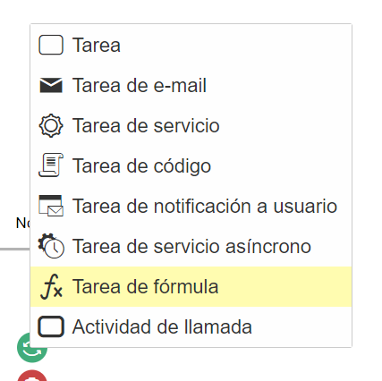](_images/image953.png)

Figura 509 Cambiar subtipo de tarea[](#id112 "Link to this image")

##### Eliminar elemento[](#eliminar-elemento "Link to this heading")

Para borrar un elemento, selecciónalo y pulse la tecla “Suprimir” o haz clic en el ícono de eliminar que aparece al seleccionar el elemento ([Figura 506](#elementoptionsmenu)).

##### Conectar elementos[](#conectar-elementos "Link to this heading")

Para conectar dos elementos se puede utilizar la herramienta de conexión de la caja de herramientas: se hace clic en el ícono correspondiente a la herramienta y después se hace clic en el elemento del que se desea salga la conexión y, sin soltar el botón, se mueve el ratón hasta el elemento con el cual se desea conectar el primero. Entonces se suelta el botón.

También se puede utilizar el ícono de conexión que aparece al seleccionar un elemento. En este caso, el elemento del cual sale la conexión es el elemento seleccionado y se procede de la misma forma, moviendo el ratón con el botón apretado hasta que el cursor esté sobre el elemento al cual se desea conectar el elemento seleccionado.

##### Ver o modificar propiedades de un elemento[](#ver-o-modificar-propiedades-de-un-elemento "Link to this heading")

Si haces clic sobre un elemento y presionas la tecla E, podrás editar el nombre de dicho elemento. Por otro lado, si se hace clic en el botón de ver o modificar propiedades de un elemento, un formulario aparece a la derecha de la zona de diseño, mostrando en la parte superior sus propiedades básicas (en general, el nombre y la descripción del paso) y en la parte inferior otro formulario con propiedades avanzadas. Las propiedades de cada tipo de elemento se explican en [Elementos del diseño de un proceso](#elementos-del-diseno-de-un-proceso).

##### Modificar una conexión[](#modificar-una-conexion "Link to this heading")

A una conexión se le puede agregar una etiqueta. También se le pueden agregar puntos de quiebre, para transformarla en una línea poligonal.

Para agregar una etiqueta a una conexión, haz doble clic en la conexión. Esto hace que Qflow muestre una caja de texto sobre la conexión. Escribe el texto que desees para la etiqueta y pulsa la tecla “Enter” ([Figura 510](#addtagtoconnection)).

[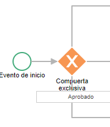](_images/image963.png)

Figura 510 Agregar una etiqueta a una conexión[](#id113 "Link to this image")

Para cambiar la forma de la conexión, posiciona el cursor del ratón sobre la línea. Esto hace que Qflow muestre un pequeño círculo. Haz clic y, manteniéndolo presionado, mueve el ratón. Esto crea un punto de quiebre en el lugar cliqueado y al mover el ratón, la línea que antes era recta se parte en dos, formando un ángulo en el punto de quiebre ([Figura 511](#addbreakpoint)).

[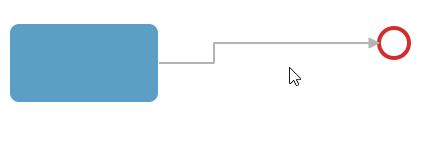](_images/image97.gif)

Figura 511 Agregar un punto de quiebre[](#id114 "Link to this image")

También se pueden mover los segmentos de una conexión de forma horizontal o vertical como se muestra en la [Figura 512](#movehorizonallinedown).

[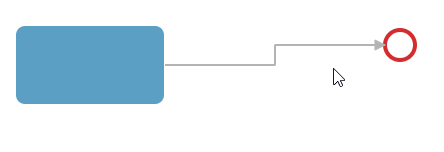](_images/image98.gif)

Figura 512 Desplazamiento de una línea horizontal hacia abajo[](#id115 "Link to this image")

## Asistente de inteligencia artificial[](#asistente-de-inteligencia-artificial "Link to this heading")

Qflow permite a sus usuarios aprovechar las capacidades de los sistemas de inteligencia artificial para apoyar la tarea del diseñado de procesos.

El asistente de inteligencia artificial de Qflow crea diseños en base a una descripción textual, que puede incluír la idea general del diseño, los pasos que debe tener, los roles que van a formar parte en su operación, los datos que son requeridos para su funcionamiento, y mucho más.

Nota

Mientras más abstractas sean las descripciones del proceso, mayor será la creatividad del asistente. Por otro lado, descripciones más detalladas harán que el asistente genere procesos más específicos.

Para utilizar el asistente, escribe una descripción en el campo que se muestra en la [Figura 513](#generateaiprocessform), y haz clic en «Generar».

[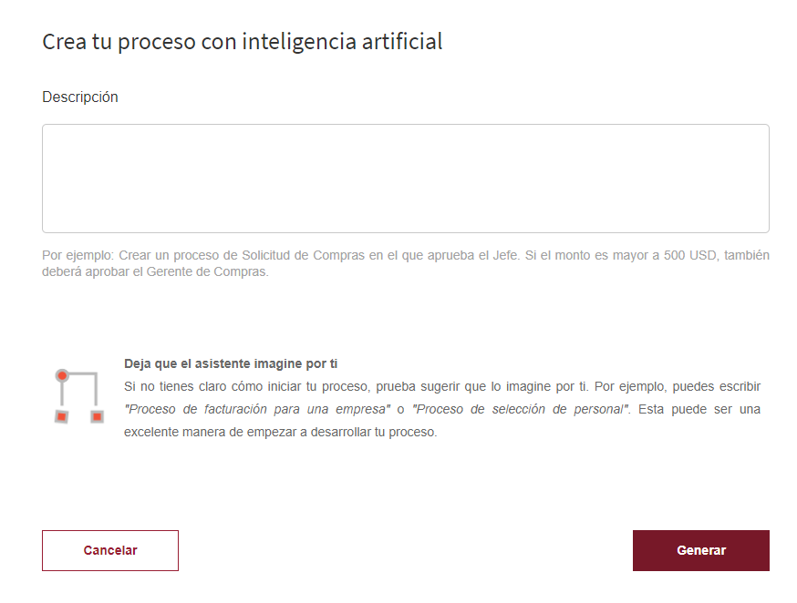](_images/GenerateAIProcessForm.png)

Figura 513 Generador de plantillas de IA[](#id116 "Link to this image")

Una vez que el asistente termina de generar el proceso basado en la descripción, Qflow muestra una _Previsualización_ del proceso generado. Podemos explorar el diseño del proceso, sus datos y sus roles en una vista de diseño de solo lectura.

Figura 514 Diseño previsualizado[](#id117 "Link to this image")

Nota

La iteración actual del asistente tiene la capacidad de generar Eventos de inicio, Tareas de Usuario, Tareas de notificación a usuario, Compuertas exclusivas y Eventos de fin. A medida que evolucione su desarrollo, se expandirá en su capacidad de crear procesos con más tipos de pasos.

Ten en cuenta que este proceso no forma parte aún de el árbol de paquetes, y no puede ser modificado en esta instancia ni iniciado por usuarios.

Si deseamos incluír el diseño a nuestro árbol de procesos, poder modificarlo y utilizarlo, debemos **Confirmar** el proceso usando el botón en la barra de acciones. Al confirmar, Qflow abrirá un panel que permite dar nombre y descripción a nuestro proceso, elegir en que paquete será creado y si se debe crear un subpaquete contenedor del proceso.

Es posible que el diseño generado por el asistente no sea precisamente lo que el usuario busca. En este caso, tenemos la opción de **Regenerar** para intentar de nuevo, y opcionalmente cambiar la descripción del proceso que le damos al asistente.

Por último, la opción de **Descartar** eliminará definitivamente el diseño si decides no utilizarlo.

Los procesos generados se muestran listados en el espacio creativo ([Figura 478](#creativespace)). Estos estarán almacenados en la memoria del navegador, por cada usuario. Es decir que se pueden generar procesos y volver en otro momento para confirmarlos, regenerarlos o descartarlos.

Todas las acciones que podemos tomar sobre procesos generados, las podemos encontrar en el menú contextual del espacio creativo, haciendo clic derecho sobre los procesos.

## Ítems del proceso[](#items-del-proceso "Link to this heading")

Para especificar un proceso, además de especificar un diseño, también se definen otros ítems, que se pueden definir en una versión, en la plantilla, en el paquete donde está la plantilla o en alguno de sus ancestros. Dónde definir un ítem depende de consideraciones de diseño y organización de la estructura. Por ejemplo, un ítem que es específico de una versión se debe definir en una versión, mientras que usualmente se definen en la plantilla para poder compartirse entre versiones. Por otro lado, en un paquete se definen ítems que son comunes a varios procesos que pertenecen a esa plantilla (por ejemplo, si varios procesos usan el mismo web service, es conveniente almacenar los datos de conexión a ese web service en un parámetro de aplicación perteneciente a un paquete que contenga a todos esos procesos).

Los tipos de ítems que se pueden definir para un proceso son los siguientes:

*   **Datos de aplicación:** son datos que maneja un proceso, especialmente datos que son necesarios en notificaciones a usuarios o para definir qué caminos sigue el proceso (otros datos pueden almacenarse en bases de datos externas, con ayuda de integraciones). Los elementos del proceso tienen acceso a los datos de aplicación: se los puede usar para especificar los mensajes que se envían a los usuarios (ver [Etiquetas](#etiquetas)). También son útiles para cambiar la dirección del flujo: mediante el uso de compuertas (ver [Compuertas](#compuertas)), el valor de un dato de aplicación puede determinar que el flujo siga un camino en lugar de otro, por ejemplo.
    
*   **Roles de plantilla de proceso:** si una actividad es desempeñada por una persona, un rol especifica quién la desempeña, o quiénes la pueden desempeñar. Las tareas de usuario (ver [Tarea de usuario](#tarea-de-usuario)) se asignan a usuarios a través de roles. No se asignan directamente a los usuarios.
    
*   **Dominios:** definen tipos de datos de aplicación (“Numérico”, “Texto”, “Fecha”) o, en los casos más complejos, permiten restringir los valores que pueden tener datos de aplicación mediante listas arbitrarias, resultados de consultas a bases de datos o a otros sistemas. Un dominio define también cómo se muestran los datos de aplicación pertenecientes a él (por ejemplo, un dominio de tipo fecha se muestra como un selector de fechas).
    
*   **Integraciones:** definen cómo acceder a sistemas externos (por ejemplo, servicios ofrecidos por software existente en la empresa) para enviarles datos, o para recibir datos de ellos (por ejemplo, para que un proceso guarde datos en la base de datos de uno de esos sistemas, o para que obtenga datos de él). Las tareas de servicio usan integraciones.
    
*   **Manejadores de eventos:** son pequeños programas que se ejecutan cuando ocurre algún evento predefinido durante la ejecución de un proceso.
    
*   **Validaciones:** son pequeños programas que se desarrollan para validar los datos que se ingresan en los formularios de los procesos.
    
*   **Bots:** como las integraciones, especifican la interacción con programas externos, con la diferencia de que se ejecutan asíncronamente para procesar los datos de un proceso (el código de los programas no se define en Qflow Design, sino que debe ser desarrollados por un programador).
    
*   **Parámetros de aplicación:** especifican información de configuración (conexiones a bases de datos, especificaciones de acceso a servicios, contraseñas) para que sea usada desde el proceso.
    

A continuación, se explica cómo trabajar con los ítems que se acaban de describir. El propósito de esta sección es describir las propiedades de estos ítems y para qué sirven. En el caso de algunos aspectos específicos de un tipo de ítem, se explica cómo usar la interfaz de usuario para definirlos, pero operaciones más generales, comunes a todos (por ejemplo, cómo eliminar un ítem) se describen en la sección [Listas de ítems](#listas-de-items).

### Datos de aplicación[](#datos-de-aplicacion "Link to this heading")

Los datos de aplicación son datos que maneja Qflow en los procesos. Cada dato está asociado a un dominio, y éste está asociado a un tipo de dato y a un tipo de control que determina cómo el dato será mostrado en los formularios de los procesos.

#### Propiedades de un dato de aplicación[](#propiedades-de-un-dato-de-aplicacion "Link to this heading")

El formulario de propiedades de un dato de aplicación tiene las siguientes secciones.

*   **General:** contiene el nombre, la descripción, el dominio y otras opciones que definen el comportamiento del dato.
    
*   **Presentación:** contiene propiedades que definen aspectos de cómo el dato se verá en Qflow Task.
    
*   **Avanzado:** permite definir valores por defecto para el dato.
    
*   **Dependencias (aparece si el dato tiene dependencias):** permite definir qué datos de aplicación se usan para proveerle valores a los parámetros del dominio.
    

A continuación, se muestra una lista de las propiedades para cada una de las secciones, con explicaciones. Las propiedades que aparecen con un asterisco son requeridas (esto aplica para todos los paneles). Esto quiere decir que, de no ser completadas, se mostrará un mensaje de error al intentar guardar el panel.

##### General[](#general "Link to this heading")

[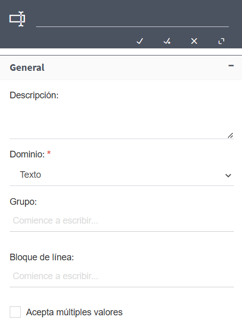](_images/image993.png)

Figura 515 Sección General de datos[](#id118 "Link to this image")

*   **Nombre:** se recomienda que no haya nombres repetidos entre datos, dado que puede ocasionar errores.
    
*   **Descripción:** es opcional.
    
*   **Dominio:** es el dominio del dato, que define el tipo y el control (el elemento de interfaz de usuario) usado para mostrar el dato. El dominio de dato puede ser cualquiera de los dominios básicos provistos por Qflow, pero también puede ser un dominio creado por un usuario y que esté en el mismo paquete el dato, en el paquete padre o en alguno de sus ancestros (ver [Dominios](15-QflowDesign.md#dominios) por instrucciones sobre la creación de dominios). Los dominios básicos son:
    
    *   **Verdadero/Falso:** los datos de este tipo sólo tienen dos valores posibles: verdadero o falso.
        
    *   **Fecha:** los datos de este tipo almacenan fechas.
        
    *   **Hora:** los datos de este tipo expresan horas.
        
    *   **Número:** los datos de este tipo almacenan números.
        
    *   **Texto:** los datos de este tipo almacenan textos.
        
    *   **Área de texto:** los datos de este tipo almacenan textos con varias líneas.
        
    *   **Dinero:** los datos de este tipo pueden almacenar números decimales.
        
    *   **Fecha hora:** los datos de este tipo almacenan fecha y hora.
        
    *   **Documento:** los datos de este tipo almacenan una referencia a adjuntos del proceso.
        
*   **Grupo:** nombre del grupo al que pertenecerá este dato. Para asignar el dato a un grupo, escriba el nombre del grupo. Si el grupo ya existe, mientras escribe aparecerá en una lista debajo del nombre que se esté escribiendo y podrá seleccionarlo. Si no existe, se creará automáticamente cuando guarde los cambios. Los datos que están en el mismo grupo son mostrados juntos en la lista de datos cuando ésta está ordenada por grupo, con el nombre del grupo como título (se ordena por grupo haciendo clic en el cabezal de la columna “Grupo”). También son mostrados juntos en los formularios de Qflow Task.
    
*   **Bloque de línea:** indica el bloque de líneas al cual pertenece el dato. El concepto de bloque de líneas se explica en [Bloques de líneas](#bloques-de-lineas). Para poder estar en una línea, el dato debe ser multivaluado.
    
*   **Acepta múltiples valores:** si esta opción está marcada, el dato puede tener varios valores. Es un conjunto de datos en lugar de un dato.
    

##### Presentación[](#presentacion "Link to this heading")

[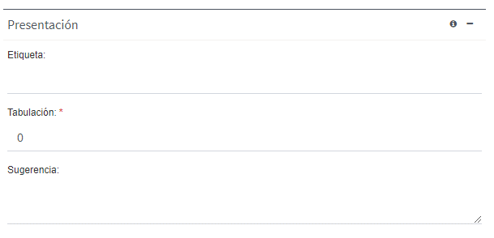](_images/image1003.png)

Figura 516 Sección Presentación de datos[](#id119 "Link to this image")

*   **Etiqueta:** es el nombre con el que se mostrará el dato en Qflow Task. Los usuarios no verán el nombre del dato, verán la etiqueta. La etiqueta puede tener símbolos que no están permitidos en el nombre del dato.
    
*   **Tabulación:** Indica el orden en el que los datos serán mostrados en los formularios por defecto en Qflow Task. Por ejemplo, el dato con el valor de tabulación 0 será el que se muestre primero; el que tenga el valor 1, el que se muestre segundo y así sucesivamente. En el caso de los datos de bloques de líneas, en el que cada dato corresponde a una columna de una tabla, el dato que tenga índice 0 ocupará la primera columna, el que tenga índice 1 la segunda y así sucesivamente.
    
*   **Sugerencia:** es el texto que se muestra cuando, en Qflow Task, se visualiza la ayuda del grupo de datos al que pertenece.
    

##### Avanzado[](#avanzado "Link to this heading")

[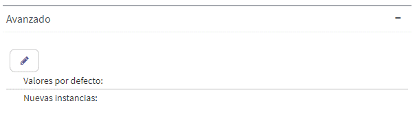](_images/image1015.png)

Figura 517 Sección Avanzado de datos[](#id120 "Link to this image")

*   **Valores por defecto:** lista con los valores con los cuales comenzará el dato cuando se inicie un proceso. Si el dato no acepta múltiples valores, sólo se puede definir un valor por defecto.
    
*   **Nuevas instancias:** si el dato acepta múltiples valores, cuando un usuario hace clic en Qflow Task para agregar un valor, el valor que se agrega será el indicado en esta propiedad.
    

##### Dependencias[](#dependencias "Link to this heading")

La sección dependencias sólo aparece si el dato de aplicación está asociado a un dominio que accede a una base de datos, web service o lista de SharePoint, y que tiene parámetros de entrada o salida (consulte la sección [Fuentes de datos](#fuentes-de-datos) para ver cómo se configuran esos dominios).

Si un dominio tiene parámetros de entrada, hay que especificar de qué datos de aplicación se tomarán los valores que se utilizarán en esos parámetros de entrada. Eso se hace en la sección “Dependencias”: a cada parámetro de entrada del dominio se le asocia un dato de aplicación.

Lo mismo sucede con los parámetros de salida: cuando un dominio tiene parámetros de salida, hay que especificar en qué datos de aplicación se volcarán los valores de los parámetros de salida. Eso también se hace en la sección “Dependencias”, asociando a cada parámetro de salida un dato de aplicación.

La sección “Dependencias” muestra los parámetros del dominio en una tabla con tres columnas. En la primera columna se muestran los nombres de los parámetros. En la segunda, el tipo: entrada o salida, indicado por un ícono. En la tercera se debe elegir, para cada parámetro, qué dato de aplicación se desea asociar a él.

La [Figura 518](#applicationdatadependencies) muestra la sección de dependencias de un dato del dominio “Cliente”. Este dominio tiene un parámetro de entrada (“id”) y cuatro de salida (el resto). En la columna “Dato de aplicación” se selecciona, para cada parámetro, un dato de aplicación. En este caso, se seleccionó el dato de aplicación “Nº de documento” para el parámetro “id”. Esto significa que el dominio, para obtener datos, usará el valor del dato de aplicación “Nº de documento”. Por ejemplo, cuando un usuario acceda a Qflow Task para, responder a una tarea, podrá ingresar un valor para el dato “Nº de documento” y cuando lo haga, el dominio obtendrá datos utilizando el número de documento ingresado.

El dominio también tiene parámetros de salida asociados a datos de aplicación. Por ejemplo, el parámetro “nombre” está asociado al dato de aplicación “Nombre”, de modo que cuando se obtengan los datos, el valor del parámetro “nombre” se cargará en el dato “Nombre”.

[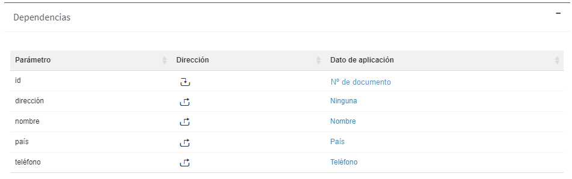](_images/image1022.png)

Figura 518 Dependencias de un dato de aplicación[](#id121 "Link to this image")

#### Bloques de líneas[](#bloques-de-lineas "Link to this heading")

Cuando un conjunto de datos pertenece a un bloque de líneas, esos datos aparecen en Qflow Task agrupados bajo el mismo rótulo. Para que un dato pueda pertenecer a un bloque de líneas, debe aceptar múltiples valores.

En Qflow Task, los datos de un bloque se muestran como una tabla: cada fila de la tabla tiene tantos valores como datos tiene el bloque. Por ejemplo, el bloque Empleados ([Figura 519](#lineblockdata)) tiene tres datos. Ese bloque se muestra en Qflow Task como una tabla con tres columnas, una por cada dato: Dirección, Nombre y Teléfono. Ve el manual de Qflow Task por detalles de cómo un usuario interactúa con bloques de líneas.

[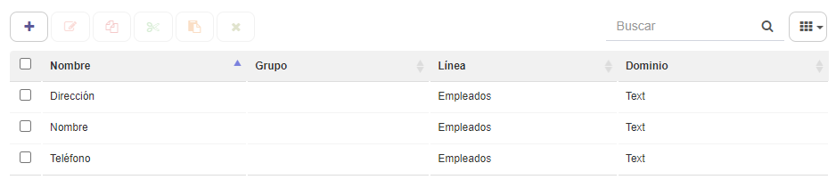](_images/image1032.png)

Figura 519 Datos de un bloque de línea[](#id122 "Link to this image")

#### Visibilidad: qué datos se pueden ver y modificar en cada interacción con un proceso[](#visibilidad-que-datos-se-pueden-ver-y-modificar-en-cada-interaccion-con-un-proceso "Link to this heading")

Por defecto, los usuarios no pueden ver ni modificar los datos de aplicación al iniciar un proceso o durante la ejecución de éste. Para permitir que un usuario pueda ver o modificar los datos de aplicación, configure la visibilidad de éstos en los pasos donde desea que puedan ser vistos o modificados. También es posible configurarlo en el formulario y el formulario de edición del proceso. La visibilidad de los datos también especifica, para el caso de los datos de bloques de líneas y datos que aceptan múltiples valores, si los usuarios pueden agregar o borrar instancias, así como también los límites a la cantidad de instancias que se pueden tener. Para obtener información al respecto, consulte la sección [Visibilidad de datos, roles, adjuntos y comentarios](15-QflowDesign.md#visibilidad-de-datos-roles-adjuntos-y-comentarios).

### Roles de plantilla de proceso[](#roles-de-plantilla-de-proceso "Link to this heading")

Los roles representan uno o más usuarios que desempeñarán una determinada función durante la ejecución de un proceso. Cuando una plantilla de proceso especifica que Qflow debe enviar una tarea a un usuario, no especifica un usuario concreto, especifica un rol. Esto hace más fácil el mantenimiento de las definiciones de los procesos.

Por ejemplo, la tarea “Aprobar gasto” puede ser asignada al rol “Gerente de finanzas”. Si el gerente de finanzas es Juan Pérez, el rol tendrá como miembro a esa persona. Si un día Juan Pérez se va de la empresa y es sustituido por José López, no es necesario actualizar todas las tareas de usuario en las que interviene Juan Pérez por ser gerente de finanzas: basta con modificar el rol “Gerente de finanzas”, sacando a Juan Pérez y poniendo como miembro a José López.

Cuando Qflow deba enviar el mensaje correspondiente a la tarea, verificará qué usuarios están desempeñando ese rol y enviará el mensaje a esos usuarios.

Las instalaciones y espacios de trabajo contarán por defecto con dos roles incluídos en el paquete raíz, uno que representa al usuario que inicia el proceso, y otro que representa al supervisor de dicho usuario. Al pertencer al paquete raíz, estos podrán ser utilizados en cualquiera de las plantillas o versiones de plantillas que se creen.

#### Propiedades de un rol[](#propiedades-de-un-rol "Link to this heading")

El formulario de un rol tiene las siguientes secciones:

*   **General**
    
*   **Restricciones:** permite restringir quiénes pueden ser miembros del rol.
    
*   **Presentación:** permite especificar cómo se muestra el rol en Qflow Task.
    

##### General[](#generalroleproperties "Link to this heading")

[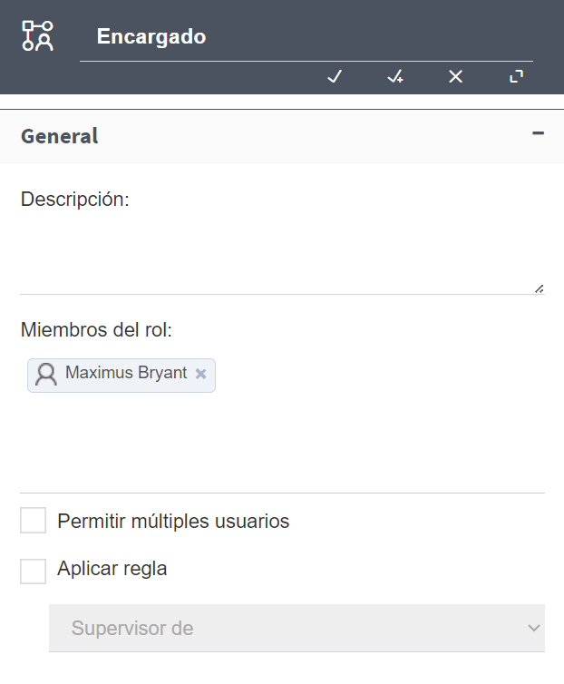](_images/image1041.png)

Figura 520 Sección General de roles[](#id123 "Link to this image")

La sección “General” tiene las siguientes propiedades:

*   **Nombre:** se recomienda que no haya nombres repetidos entre roles, dado que puede ocasionar errores.
    
*   **Descripción**
    
*   **Miembros del rol:** lista de usuarios, roles, roles de sistema, grupos y colas de trabajo que desempeñan el rol. Sólo puede haber más de un miembro si el rol permite múltiples usuarios. Para que una cola de trabajo o un grupo pueda ser miembro de un rol, también es necesario que éste permita múltiples usuarios. Para agregar un miembro, comience a escribir su nombre donde dice “Comience a escribir un usuario…”, y cuando vea el rol que desea en la lista que aparece, selecciónelo.
    
*   **Permitir múltiples usuarios:** si esta opción está marcada, el rol puede tener muchos miembros o miembros que tienen muchos usuarios (por ejemplo, grupos).
    
*   **Aplicar regla:** aplica una regla que determina quiénes son los miembros del rol.
    
    *   **Supervisados por:** si se aplica esta regla, los miembros del rol no son los que están en la lista de miembros, sino que son aquellos usuarios que sean supervisados por ellos. Ejemplo: el usuario Pérez es supervisor de López y Gómez. Si Pérez está en la lista y se aplica la regla “Supervisados por”, los miembros del rol serán López y Gómez, y no Pérez. La regla, además, se aplica en el momento en el que el rol es utilizado. Es decir, si en el momento de definir el rol, López es supervisado por Pérez, pero poco antes de que un proceso le envíe una tarea a ese rol alguien le cambia el supervisor, entonces no recibirá la tarea, pues habrá dejado de ser miembro del rol.
        
    *   **Supervisor de:** si se aplica esta regla, los miembros serán los supervisores de los que se incluyen en la lista de miembros.
        
    *   **Usuario con menos tareas:** si se aplica esta regla, Qflow toma como usuario que desempeña ese rol al usuario que tenga menos tareas pendientes al momento de utilizar el rol. Ejemplo: supongamos que el rol tiene como miembros a tres usuarios: Pérez, López y Gómez. Una tarea está dirigida a ese rol y utiliza la regla “Usuario con menos tareas”. Si, cuando el proceso llega a esa tarea, Pérez es, de los tres usuarios, el que tiene menos tareas pendientes, entonces la tarea será asignada a Pérez.
        
    *   **Supervisor directo:** si se aplica esta regla, Qflow toma como usuario que cumple con ese rol a cada supervisor directo de los miembros que se hayan agregado. Un supervisor directo de un usuario es aquel asignado como supervisor en el nodo organizacional donde se encuentra el usuario.
        
    *   **Usuario con menos tareas de la plantilla de proceso:** si se aplica esta regla, Qflow toma como usuario que cumple con ese rol al usuario que tenga menos tareas pendientes pertenecientes a procesos de la misma plantilla. Ejemplo: supongamos que el rol tiene como miembros a Pérez, López y Gómez. Una tarea está dirigida a ese rol, que utiliza la regla “Usuario con menos tareas de la plantilla de proceso”. La plantilla del proceso se llama “Aprobaciones”. Si, cuando el proceso llega a la tarea mencionada, Pérez es el que tiene menos tareas pendientes en procesos de la plantilla “Aprobaciones” de los tres usuarios, entonces la tarea será asignada a Pérez. Nótese que esta regla es similar a “Usuario con menos tareas”, pero no se cuentan todas las tareas que cada usuario tiene pendientes en el sistema, sino solamente las de la plantilla del proceso al que pertenece la tarea.
        
    *   **Distribución secuencial (Round Robin):** si se aplica esta regla, Qflow tomará el conjunto de usuarios definidos en el rol, y los asignará de manera secuencial, comenzando por uno y cada vez que el rol es asignado en una tarea, cambia al siguiente miembro, incluso dentro de un mismo proceso. Una vez que se hayan recorrido todos los miembros del rol, se vuelve a comenzar por el primero y se repite el mismo orden.
        

##### Restricciones[](#restricciones "Link to this heading")

La sección “Restricciones” ([Figura 521](#restrictions)), permite restringir los usuarios que pueden ser seleccionados para este rol. Si deses restringir quienes pueden desempeñar ese rol a una lista de usuarios, marca la opción “Restringir selección de miembros del rol”. Entonces podrás agregar restricciones a la lista. Sólo usuarios que cumplen con las reglas especificadas en la lista podrán desempeñar el rol. Para agregar una restricción, haga clic en el botón con el símbolo de “+”. Esto agrega una fila.

[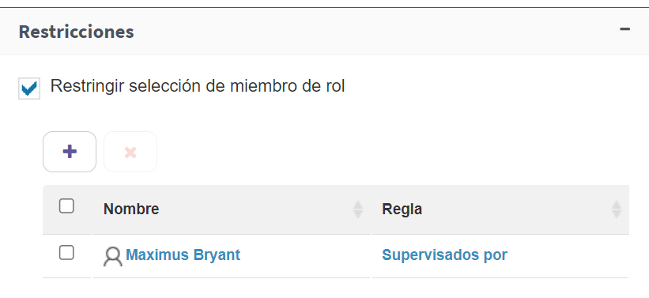](_images/image1051.png)

Figura 521 Restricciones[](#id124 "Link to this image")

Haz clic en la columna “Nombre” de la fila seleccionada para escribir el nombre del miembro (usuario, grupo, nodo o cola de trabajo) al cual quieres restringir el rol. También puedes seleccionar una regla, haciendo clic en la columna “Regla” de la misma fila. La regla indica cómo se usa ese miembro para definir la restricción. Por ejemplo, la restricción más sencilla posible es seleccionar un usuario como miembro y utilizar la regla “Ninguna”. En este caso, la restricción indicará que el usuario seleccionado puede desempeñar el rol, pero otros usuarios no (a menos que alguna otra restricción indique que sí pueden). Las reglas posibles son:

1.  **Ninguna:** el miembro de rol seleccionado puede desempeñar el rol.
    
2.  **Supervisor de:** los supervisores del miembro de rol seleccionado pueden desempeñar el rol.
    
3.  **Supervisados por:** los usuarios que tengan como supervisor al miembro de rol seleccionado pueden desempeñar el rol.
    
4.  **Miembros de:** los miembros del miembro de rol seleccionado pueden desempeñar el rol. Por ejemplo, si el miembro de rol seleccionado es un grupo, la regla hace referencia a los miembros de ese grupo. Naturalmente, esta regla no se puede aplicar a un usuario.
    
5.  **Visualizadores de:** esta regla sólo es válida si el miembro de rol es una cola de trabajo. Significa que usuarios que tengan permiso de visualización en esa cola de trabajo pueden desempeñar el rol.
    
6.  **Actuantes de:** esta regla sólo es válida si el miembro de rol es una cola de trabajo. Significa que usuarios que tengan permiso de actuar en la esa cola de trabajo pueden desempeñar el rol.
    

##### Presentación[](#rolespresentation "Link to this heading")

[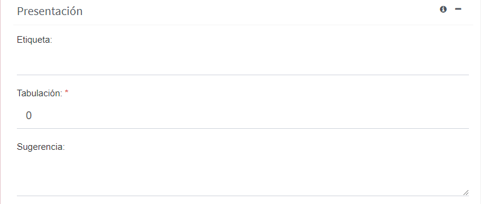](_images/image1062.png)

Figura 522 Sección Presentación de roles[](#id125 "Link to this image")

*   **Etiqueta:** es el nombre con el que se mostrará el rol en Qflow Task. Los usuarios no verán el nombre del rol, verán la etiqueta. La etiqueta puede tener símbolos que no están permitidos en el nombre del rol.
    
*   **Tabulación:** indica el orden en el que se mostrarán los roles. Por ejemplo, el rol que tenga el valor 0 se mostrará primero; el que tenga el valor 1 se mostrará segundo, y así sucesivamente.
    
*   **Sugerencia:** es el texto que se muestra cuando, en Qflow Task, se visualiza la ayuda del grupo de los roles.
    

##### Roles pre-hechos[](#roles-pre-hechos "Link to this heading")

Qflow incluye dos roles que comúnmente se definen para usarlos en los procesos. Debido a que estos roles están situados al nivel del paquete raíz, podrán ser utilizados en cualquier paquete, plantilla o versión creada. Los roles son los siguientes:

*   **Usuario iniciador del proceso:** tomará el valor del usuario que inicia el proceso desde su formulario de inicio en Qflow Task.
    
*   **Supervisor del usuario iniciador del proceso:** tomará el valor del usuario supervisor del usuario que inicia el proceso desde el formulario de inicio en Qflow Task.
    

#### Visibilidad: qué roles se pueden ver y modificar en cada interacción con un proceso[](#visibilidad-que-roles-se-pueden-ver-y-modificar-en-cada-interaccion-con-un-proceso "Link to this heading")

Por defecto, los usuarios no pueden ver ni modificar los roles de un proceso durante su inicio o ejecución. Para permitir que los usuarios puedan ver o modificar los roles de un proceso, configura la visibilidad de los roles en los elementos del diseño donde deseas que sean vistos o modificados. La visibilidad de los roles también especifica, para aquellos que aceptan valores múltiples, si los usuarios pueden agregar o borrar miembros, y establece límites a la cantidad de miembros que los usuarios pueden agregar o borrar.

Por información sobre cómo configurar la visibilidad, consulta [Visibilidad de datos, roles, adjuntos y comentarios](15-QflowDesign.md#visibilidad-de-datos-roles-adjuntos-y-comentarios).

### Dominios[](#dominios "Link to this heading")

El dominio de un dato especifica el conjunto de valores que el dato puede tomar y está asociado a un tipo de dato. Por ejemplo, si un dato sólo debe guardar valores correspondientes a fechas, el dominio de ese dato es el conjunto de todas las fechas posibles. En Qflow, cada dato de aplicación está asociado a un dominio y éste está asociado a un tipo de dato.

El tipo de dato del dominio determina el tipo del dato de aplicación. Por ejemplo, si un dato de aplicación está asociado al dominio “Fecha”, su valor debe ser una fecha. Así, a través de su tipo de dato, el dominio define los valores que los datos asociados a él pueden tomar. Se puede limitar aún más estos valores si se asocia el dominio con una operación que defina un conjunto más restringido de valores (por ejemplo, el resultado de una consulta a una base de datos).

Un dominio, define también, la forma en que sus datos serán mostrados y editados en Qflow Task. Por ejemplo, datos del dominio “Fecha” se muestran mediante un control (ítem del formulario) que permite seleccionar una fecha (es decir, un selector de fecha).

Qflow ofrece un conjunto de dominios básicos, pero es posible definir dominios adicionales.

#### Dominios básicos de Qflow[](#dominios-basicos-de-qflow "Link to this heading")

Los dominios básicos de Qflow son los siguientes:

*   **Verdadero/Falso:** está asociado al tipo de datos “Verdadero/Falso” y al control “Check Box”.
    
*   **Fecha:** está asociado al tipo de datos “Fecha” y al control “Selector de fecha”.
    
*   **Número:** está asociado al tipo de datos “Número” y al control “Cuadro de texto”.
    
*   **Texto:** está asociado al tipo de datos “Texto” y al control “Cuadro de texto”.
    
*   **Área de texto:** está asociado al tipo de datos “Texto” y al control “Área de texto”.
    
*   **Dinero:** está asociado al tipo de datos “Número” y al control “Cuadro de texto”.
    
*   **Hora:** está asociado al tipo de datos “Hora” y al control “Selector de hora”.
    
*   **Fecha y hora:** está asociado al tipo de dato “Fecha” y al control “Selector de fecha y hora”.
    
*   **Documento:** está asociado al tipo de dato “Texto” y al control “Documento”.
    

Por más información acerca de los tipos de control de los dominios, consulte la sección [Tipos de control](#tipos-de-control).

#### Propiedades de un dominio[](#propiedades-de-un-dominio "Link to this heading")

El formulario de propiedades de un dominio tiene las siguientes secciones:

*   General
    
*   Propiedades
    

##### General[](#domaingeneral "Link to this heading")

[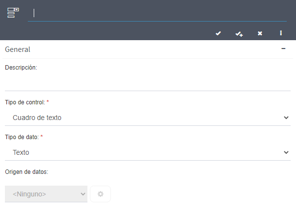](_images/image1072.png)

Figura 523 Sección General de dominios[](#id126 "Link to this image")

*   **Nombre**
    
*   **Descripción**
    
*   **Tipo de control:** es el tipo de control que se usará para ingresar o mostrar valores de datos de ese dominio. Un control es un elemento de la interfaz de usuario, como una lista, una caja de texto o un botón, que le permite a éste interactuar con el sistema. Más abajo se describe en mayor detalle cada tipo de control.
    
*   **Tipo de datos:** tipo de los valores que tomarán los datos de aplicación asociados al dominio. No todos los tipos son compatibles con todos los controles. Por ejemplo, si el control es un selector de fechas, el tipo del dato debe ser, necesariamente, Fecha. Los tipos de dato son los siguientes:
    
    *   Texto
        
    *   Número
        
    *   Verdadero/Falso
        
    *   Fecha
        
    *   Hora
        
*   **Tipo de fuente de datos:** esta opción sólo es válida para algunos tipos de control. Permite seleccionar un tipo de fuente de datos para después especificar cómo obtener los datos de una fuente del tipo seleccionado. Una vez seleccionado el tipo de fuente de datos, haz clic en el botón de configurar ([Figura 524](#domainpropertiesform)) para especificar cómo se obtienen los datos. Los tipos de fuente disponibles son:
    
    *   **Ninguno:** deja esta opción si no quieres que el dominio acceda a una fuente de datos.
        
    *   **Base de datos:** permite especificar una conexión a una base de datos y una consulta para obtener los datos
        
    *   **Web service:** permite especificar una conexión a un web service y un método del web service para obtener los datos.
        
    *   **Web service REST:** análogo al anterior, pero para un web service de tipo REST.
        
    *   **Lista de SharePoint:** permite especificar una lista de SharePoint y una consulta CAML para obtener los datos.
        
    *   **Lista de SharePoint Online:** igual que la lista de SharePoint normal, pero para listas de SharePoint Online
        
    *   **Lista:** permite definir manualmente, enumerando el conjunto de valores posibles mediante una lista. Cada elemento de la lista tiene una clave y un texto asociado a ella.
        

[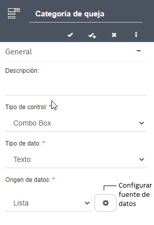](_images/image1082.png)

Figura 524 Formulario de propiedades de un dominio[](#id127 "Link to this image")

##### Propiedades[](#propiedades "Link to this heading")

[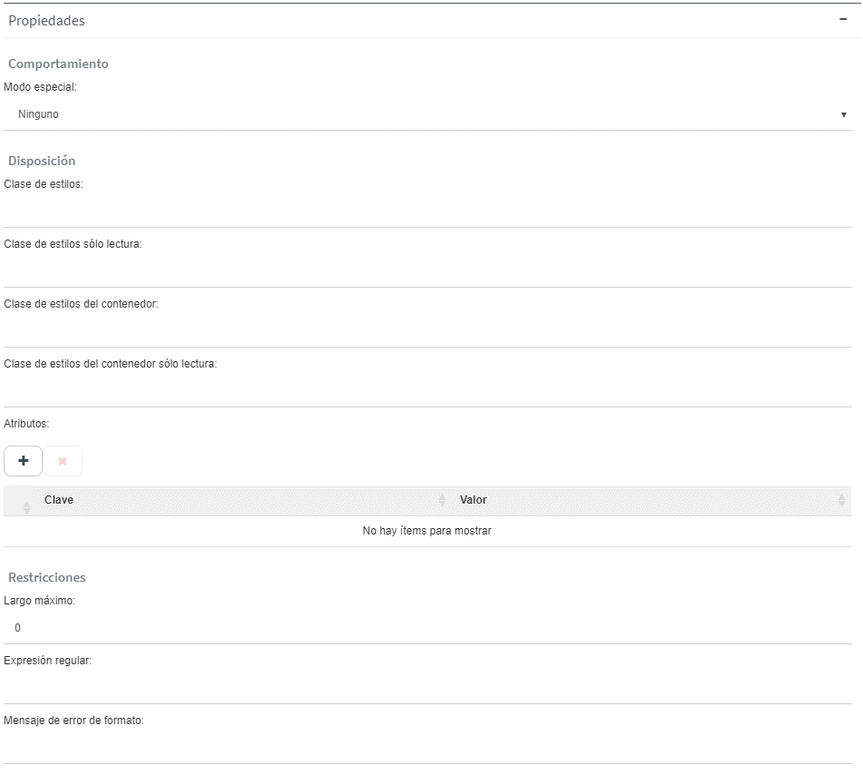](_images/image1092.png)

Figura 525 Sección de Propiedades de dominios[](#id128 "Link to this image")

En “Propiedades” se puede especificar un conjunto de clases de estilos para aplicar al control que se usa paramostrar los datos del dominio en Qflow Task.

*   **Comportamiento:**
    
    *   **Agregar opción vacía al Combo Box:** permite agregarle una opción a un dominio con tipo de control “Combo Box” que, al ser seleccionada en un formulario, indica que no se eligió ninguno de los valores del dominio.
        
    *   **Modo especial:** esta propiedad sólo está disponible para dominios con tipo de control “Cuadro de texto” y permite agregarle una propiedad adicional al control con el que se muestran los datos del dominio, propia de HTML5, para aprovechar las funcionalidades de validación y semántica de este estándar. Los modos especiales disponibles son:
        
        *   Correo electrónico
            
        *   Teléfono
            
        *   Número
            
        *   Contraseña
            
    *   **Formato AM/PM:** para dominios que usan el tipo de dato “Hora” o tipo de control “Selector de fecha y hora”. Si el valor de esta propiedad es “Verdadero”, los datos del dominio se mostrarán en el formato AM/PM (“una de la tarde” = 1:00 PM). De lo contrario, se mostrarán en formato 24 horas (“una de la tarde” = 13:00).
        
    *   **Mostrar segundos:** para dominios que usan el tipo de dato “Hora”. Si el valor de esta propiedad es “Verdadero”, los datos del dominio son mostrados incluyendo los segundos. De lo contrario, no se muestran segundos.
        
*   **Disposición:**
    
    *   **Clase de estilos:** nombre de la clase de estilos para mostrar en todos los casos.
        
    *   **Clase de estilos de sólo lectura:** nombre de la clase de estilos a utilizar cuando un dato tiene visibilidad de sólo lectura.
        
    *   **Clase de estilos del contenedor:** nombre de la clase de estilos del elemento que contiene el control.
        
    *   **Clase de estilos del contenedor sólo lectura:** nombre de la clase de estilos del elemento que contiene el control cuando un dato tiene visibilidad de sólo lectura.
        
    *   **Atributos:** conjunto de pares de nombres y valores de atributos HTML que Qflow agregará al control que muestra los datos del dominio. Usa el botón con el símbolo “+” para agregar una fila a la lista de atributos y después modifica la clave (nombre del atributo) y el valor para especificar el atributo.
        
    *   **Dirección:** esta propiedad sólo está disponible para dominios cuyo tipo de control sea “Radio button” o “Lista de Check Box”. Permite especificar si las opciones de estos controles deben ser mostrados uno al lado del otro (“Horizontal”, opción por defecto) o uno arriba del otro (“Vertical”).
        
*   **Restricciones:**
    
    *   **Expresión regular:** esta propiedad sólo existe cuando el tipo de dato del dominio es “Texto” o “Documento”. Permite especificar una expresión regular para validar los textos que se ingresen o el nombre del archivo que se está subiendo. Si un usuario ingresa un texto que no está contemplado en la expresión regular, Qflow le mostrará el mensaje de error especificado en la propiedad “Mensaje de error de formato”.
        
    *   **Mensaje de error de formato:** texto del mensaje de error que se mostrará al usuario si ingresa un valor que no cumpla con la expresión regular definida en la propiedad “Expresión regular”.
        
    *   **Operador de la comparación:** permite especificar el operador que se utilizará para comparar una fecha ingresada por un usuario con la fecha especificada en “Fecha a comparar”.
        
    *   **Fecha a comparar:** esta propiedad sólo existe cuando el tipo de dato del dominio es “Fecha”. Permite especificar una fecha con la cual Qflow, al validar valores de datos de aplicación del dominio, comparará las fechas ingresadas por los usuarios. La propiedad “Operador de la comparación” permite especificar qué comparación se hará.
        
    *   **Largo máximo:** esta propiedad sólo existe cuando el tipo de dato del dominio es “Texto”. Permite especificar un largo máximo para los valores de los datos asociados a ese dominio.
        
    *   **Valor máximo:** esta propiedad sólo existe cuando el tipo de dato del dominio es “Número”. Permite especificar un valor máximo para los valores de los datos asociados a ese dominio.
        
    *   **Valor mínimo:** esta propiedad sólo existe cuando el tipo de dato del dominio es “Número”. Permite especificar un valor mínimo para los valores de los datos asociados a ese dominio.
        

#### Fuentes de datos[](#fuentes-de-datos "Link to this heading")

Esta sección explica cómo configurar el acceso a fuentes de datos de cada tipo. La configuración suele tener dos partes: la especificación de la conexión a la fuente y la especificación de qué datos se traen (la consulta). La excepción a esto son las fuentes de tipo Lista, para las cuales directamente se especifican los elementos de la lista.

##### Configuración de la conexión[](#configuracion-de-la-conexion "Link to this heading")

Para especificar la conexión, siempre hay dos opciones ([Figura 526](#datasourceconnectionoptions)):

*   **Usar un parámetro de aplicación:** en este caso, selecciona el parámetro de aplicación que contiene la especificación de la conexión.
    
*   **Definir en la configuración del origen de datos:** en este caso, haz clic en el botón de configurar.
    

Se recomienda utilizar un parámetro de aplicación (por información sobre cómo definir parámetros de aplicación, ver [Parámetros de aplicación](#parametros-de-aplicacion)).

Si decides especificar la ubicación de los datos en la configuración del origen de datos, deberás completar los mismos datos de conexión que si estuviese definiendo un parámetro de aplicación. La sección “Propiedades de un parámetro de aplicación” tiene instrucciones para hacerlo.

[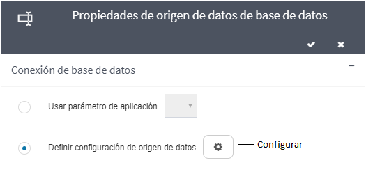](_images/image1102.png)

Figura 526 Opciones de conexión a origen de datos[](#id129 "Link to this image")

##### Definición de la consulta a una base de datos[](#definicion-de-la-consulta-a-una-base-de-datos "Link to this heading")

Definir la consulta a una base de datos requiere saber utilizar SQL.

La [Figura 527](#querydefinition) muestra el formulario en el que se define una consulta a una base de datos. Para definir la consulta, puedes escribirla directamente en SQL o puede usar el constructor de consultas ([Figura 528](#querybuilder)). La primera columna de la sentencia “Select” debe ser la columna que contiene la clave de los datos. La segunda columna debe ser la que contenga la descripción (ejemplo: “Select Id, Nombre From Clientes”). Se puede incluir más columnas. En ese caso, para usar los datos que vienen en las columnas adicionales se debe asociarlas a parámetros de salida. Debajo de la consulta, hay una sección dedicada a estos parámetros, la cual se explica más abajo.

Las consultas pueden tener parámetros de entrada. Para crear un parámetro de entrada, haz clic en el botón de “+” en la tabla que aparece en la parte superior de la [Figura 527](#querydefinition). “Valor de prueba” es el valor que tendrá dicho parámetro para probar la consulta. Puedes editar y eliminar parámetros existentes. Para insertar un parámetro de entrada en la consulta, haz clic en el botón indicado en la [Figura 527](#querydefinition).

Los parámetros de entrada se representan en la consulta con llaves. En la [Figura 527](#querydefinition), hay un parámetro de entrada llamado “País”.

[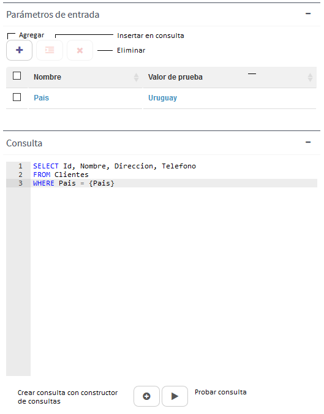](_images/image1115.png)

Figura 527 Definición de una consulta[](#id130 "Link to this image")

Figura 528 Constructor de consultas[](#id131 "Link to this image")

El constructor de consultas facilita la definición de la consulta al mostrar los nombres de las tablas disponibles. Además, una vez seleccionadas las tablas en la sección “From” de la consulta, las columnas disponibles aparecen para seleccionar en la sección “Select”. En “Order by” se agregan las columnas que se desean usar para ordenar el resultado, y en “Where” se definen las condiciones de filtro a través de una interfaz igual a la que se usa para definir las condiciones de las compuertas (ver [Especificación de condiciones](#especificacion-de-condiciones)).

###### Probar consulta[](#probar-consulta "Link to this heading")

Antes de guardar la configuración del dominio, debes probar la consulta. Para eso, haz clic en el botón de probar consulta ([Figura 527](#querydefinition), “Probar consulta”). Si la consulta funciona, Qflow muestra el resultado de ejecutarla.

###### Parámetros de salida[](#parametros-de-salida "Link to this heading")

Para definir parámetros de salida, es necesario probar la consulta, haciendo clic en el botón correspondiente como se muestra en la [Figura 527](#querydefinition). Se mostrará, en lugar del formulario de la consulta, las columnas que se obtuvieron como resultado de ésta. Cierra este resultado y volverás al formulario anterior, pero ahora, como se ve en la [Figura 529](#outputparameters), los parámetros están habilitados para su edición. Haz clic sobre el nombre en azul para editarlo.

Los nombres que escribas serán los que veas cuando configures algún dato de aplicación para almacenar en él los valores de estos parámetros. Los parámetros se asocian a datos de aplicación en el formulario de propiedades de los datos de aplicación, en la sección “Dependencias” (ver [Dependencias](#dependencias)).

Una vez definida la consulta, haz clic en el botón de aceptar para guardarla.

[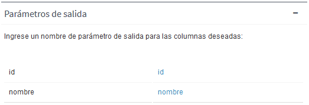](_images/image1133.png)

Figura 529 Parámetros de salida[](#id132 "Link to this image")

##### Definición de la consulta a un web service (SOAP)[](#definicion-de-la-consulta-a-un-web-service-soap "Link to this heading")

Una vez especificada la conexión a un web service SOAP (ver [Configuración de la conexión](#configuracion-de-la-conexion)), debes hacer clic en el botón de cargar (ver [Figura 530](#webservicerequest)) para que se cargue la lista de métodos de ese web service. A continuación, donde dice “Seleccionar método Web”, selecciona el método que deseas usar para el dominio. Al seleccionar el método, se cargan los parámetros de éste. Los parámetros del método se asocian a parámetros de entrada. El método seleccionado debe retornar una lista de objetos simples.

###### Parámetros de entrada[](#parametros-de-entrada "Link to this heading")

A cada parámetro se le puede asignar un valor fijo. Si el tipo de control es Lookup, Selector de Ítems o Combo Box, también se puede establecer que ese valor sea parametrizable. Para ello, en la tabla de parámetros ([Figura 530](#webservicerequest)) debes elegir el tipo de cada parámetro. Hay dos tipos de parámetro:

*   **Personalizado:** un parámetro personalizado funciona como los parámetros de los dominios que obtienen sus datos de una base de datos: cuando se define un dato de aplicación de ese dominio, se especifica otro dato de aplicación como parámetro (ver [Dependencias](#dependencias)). Para un parámetro de este tipo, ingresa un nombre ([Figura 530](#webservicerequest)).
    
*   **Sistema:** un parámetro de sistema se usa con un método de web service desarrollado especialmente para interactuar con el dominio de forma tal que la consulta sea más eficiente. Por ejemplo, en lugar de tener un Lookup que trae todos los elementos de una tabla, y recién en el código del cliente filtra los datos por clave, se puede desarrollar un método que reciba la clave por parámetro y devuelva solamente el registro que tiene la clave que se pasó por parámetro. Los parámetros de sistema no se asocian a datos de aplicación. Qflow determina cómo invocar un método en base a qué parámetros de sistema hay definidos. Hay cuatro tipos de parámetros de sistema:
    
    *   **Filtro por clave:** para usar con un método que recibe por parámetro una clave (identificador). Qflow lo utiliza, por ejemplo, con controles de tipo Lookup. Ejemplo de un método para usar con este parámetro: GetCliente(string clave).
        
    *   **Filtro por texto:** para usar con un método que recibe por parámetro una descripción. Qflow lo utiliza, por ejemplo, para pasar el texto ingresado en el selector de ítems. Ejemplo de un método para usar con este parámetro: GetCliente(string filtro).
        
    *   **Cantidad máxima de ítems:** útil si el método del web service recibe un parámetro (de tipo “int”) que indica el máximo de elementos que debe devolver. Ejemplo: GetCliente(string filtro, bool comienzaCon, int cantMaxima). Otro ejemplo: GetCliente(string clave, int cantMaxima).
        

###### Mapeo de columnas y parámetros de salida[](#mapeo-de-columnas-y-parametros-de-salida "Link to this heading")

Una consulta a una fuente de datos para un dominio debe devolver, por lo menos, dos columnas: una para la clave y una para la descripción de las entidades que se devuelven. Si la fuente es de tipo base de datos, la primera columna que se devuelve se toma como clave y la segunda como descripción. Pero si la fuente es un web service, no hay columnas, sino que hay propiedades de objetos, y no hay forma de determinar cuál de las propiedades corresponde a la clave y cuál a la descripción. Para hacer eso se utiliza el mapeo de columnas.

El mapeo de columnas consiste en definir columnas y asociar cada una de ellas a una propiedad del objeto. Las dos primeras columnas se usan para la clave y la descripción respectivamente. Columnas adicionales son opcionales, y se pueden asociar a parámetros de salida (ver más adelante).

Por defecto, la tabla de mapeo tiene todas las propiedades mapeadas a un nombre de columna. Si deseas cambiar algún nombre, haga clic en el texto correspondiente a “Nombre de columna” para ingresar el nombre de la columna, y después de ingresarlo, pulsa “Enter”. Si deseas quitar algún mapeo, haz clic en la fila y luego en el botón de “Limpiar mapeo” (indicado en la [Figura 530](#webservicerequest)). También puedes cambiar el orden del mapeo con los botones correspondientes.

Después, cada columna definida se asocia a un parámetro de salida mediante el botón de “Parámetros de salida” (análogo a la consulta de base de datos): a cada columna se le asigna un nombre de parámetro. Tanto los parámetros de entrada como los de salida se asocian a datos de aplicación a través de la sección “Dependencias” de los datos de aplicación pertenecientes al dominio (ver [Dependencias](#dependencias)).

[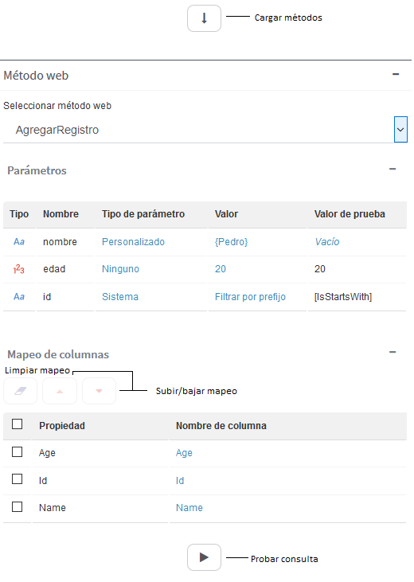](_images/image1143.png)

Figura 530 Consulta a un web service[](#id133 "Link to this image")

##### Definición de la consulta a un web service REST[](#definicion-de-la-consulta-a-un-web-service-rest "Link to this heading")

Una vez especificada la conexión a un web service tipo REST (ver [Configuración de la conexión](#configuracion-de-la-conexion)), se debe especificar la acción a realizar, la cual es una URL correspondiente al web service que se desea consultar ([Figura 531](#restwebservicerequest)). Luego se debe seleccionar el método HTTP requerido (GET, POST o PUT).

[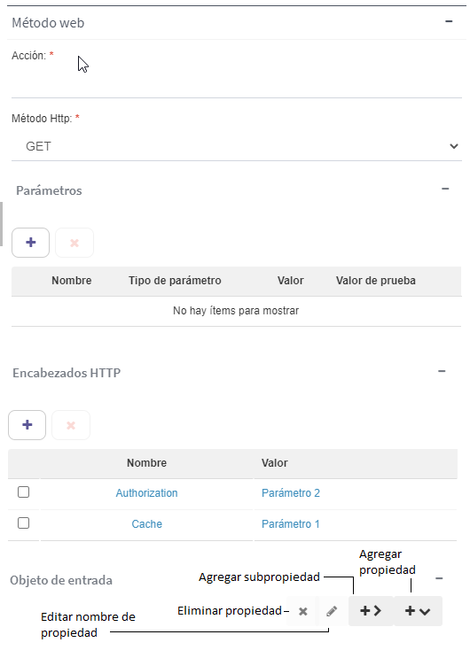](_images/image1153.png)

Figura 531 Consulta a un web service REST[](#id134 "Link to this image")

Los parámetros de entrada tienen los mismos tipos que en los web services SOAP (ver sección [Parámetros de entrada](#parametros-de-entrada)), pero a diferencia de éstos, no se cargan automáticamente, sino que el usuario debe ingresarlos a mano. Puedes ponerles un nombre y un valor (ambos deben ser únicos) además del tipo. Estos parámetros se usan para cargar valores en los encabezados, como se explica abajo, y el objeto de entrada, que se explica en [Objeto de entrada](#objeto-de-entrada).

###### Encabezados HTTP[](#encabezados-http "Link to this heading")

Se pueden especificar encabezados HTTP para enviar en la solicitud, que son pares clave-valor. La clave es un texto, y el valor debe ser un parámetro de tipo “Ninguno” o “Personalizado” que se encuentre definido en la tabla de la sección “Parámetros”.

###### Objeto de entrada[](#objeto-de-entrada "Link to this heading")

El objeto de entrada es de tipo JSON, y consiste en un objeto con propiedades. Estas propiedades pueden ser valores (que se toman de los parámetros de entrada) o subpropiedades, que a su vez tienen más valores.

Para crear una nueva propiedad, haz clic en el botón indicado en la [Figura 531](#restwebservicerequest). Esto abrirá un menú como el de la [Figura 532](#propertiesmenu).

[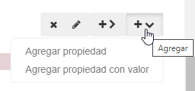](_images/image1163.png)

Figura 532 Menú de propiedades[](#id135 "Link to this image")

Si deseas agregar una propiedad con subpropiedades, elije la opción de “Agregar propiedad” (luego podrá agregarle subpropiedades a la propiedad principal). De lo contrario, elije la opción de “Agregar propiedad con valor”. Esto le permitirá darle un valor a la propiedad a partir de un parámetro de entrada. Opciones análogas se muestran al hacer clic en el botón de “Agregar subpropiedad”.

La [Figura 533](#propertiestree) muestra un ejemplo de un árbol de propiedades y subpropiedades.

[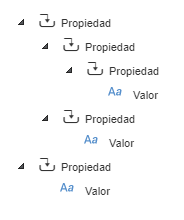](_images/image1173.png)

Figura 533 Árbol de propiedades[](#id136 "Link to this image")

Para editar el nombre de una propiedad o subpropiedad, puede usar el botón indicado en la [Figura 531](#restwebservicerequest) o presionar F2. Recuerda que, a la hora de hacer la consulta, las propiedades que estén en el mismo nivel del árbol deben tener nombres diferentes. También puedes eliminar una propiedad, usando el botón correspondiente ([Figura 531](#restwebservicerequest)). Estas dos opciones también se muestran en un menú contextual si haces clic derecho sobre la propiedad.

Una vez creada la estructura de su árbol, debes ingresar los valores necesarios. A todos los valores se les debe asignar un parámetro; si deseas enviar una propiedad con valor vacío, crea un parámetro cuyo valor sea vacío (que no sea de tipo Sistema). Para asignar un valor a un parámetro, haz clic derecho sobre el valor. Esto abrirá un menú contextual como muestra la [Figura 534](#valuescontextualmenu).

[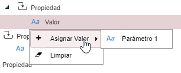](_images/image1183.png)

Figura 534 Menú contextual de valores[](#id137 "Link to this image")

Si posicionas el cursor sobre la opción “Asignar valor”, sobre la derecha se desplegará un submenú con todos los parámetros existentes. Haz clic sobre el que desee asignar, y el valor se mostrará con el nombre de ese parámetro. Puedes asignarle el mismo parámetro a más de un valor. El botón de Limpiar te permite borrar el parámetro actualmente asignado al valor.

En la [Figura 535](#loadedpropertiestree) se muestra un ejemplo de resultado final.

[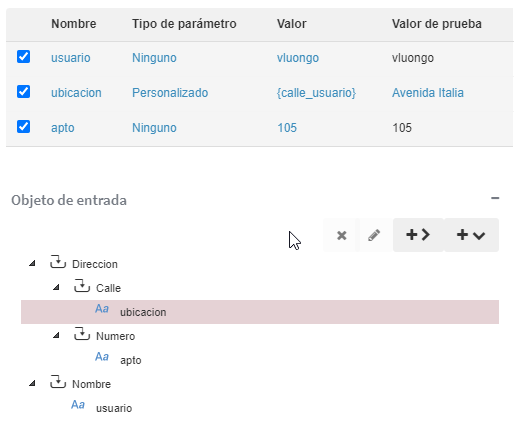](_images/image1193.png)

Figura 535 Árbol con propiedades y parámetros cargados[](#id138 "Link to this image")

Una vez creado su objeto de entrada, debes probar la consulta, al igual que en los web services SOAP, con el botón para dicho fin (análogo a la [Figura 530](#webservicerequest)). El resultado de la consulta debe ser un arreglo de objetos JSON. Dado que un objeto JSON podría potencialmente tener varios niveles de subpropiedades, hay un límite de la profundidad mostrada. Esto se puede ver en la [Figura 536](#unsupporteddepthlevelqueryresult), donde los campos con un símbolo de información son aquellos que tienen más subpropiedades, pero no se muestran.

[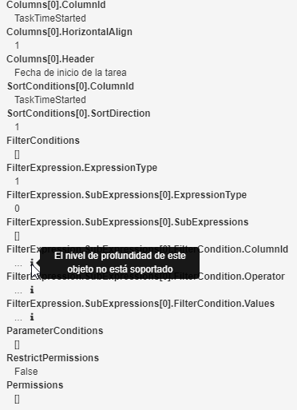](_images/image1203.png)

Figura 536 Resultado de consulta con nivel de profundidad no soportado[](#id139 "Link to this image")

Luego de probada la consulta, la tabla de Mapeos de columnas se cargará con las propiedades encontradas. Se puede proceder entonces a realizar los mapeos correspondientes y cargar los parámetros de salida como se explica en la sección [Mapeo de columnas y parámetros de salida](#mapeo-de-columnas-y-parametros-de-salida).

##### Definición de la consulta a una lista de SharePoint[](#definicion-de-la-consulta-a-una-lista-de-sharepoint "Link to this heading")

La definición de la consulta a una lista de SharePoint o SharePoint Online es similar a la de una consulta a una base de datos (ver [Definición de la consulta a una base de datos](#definicion-de-la-consulta-a-una-base-de-datos)), con la diferencia de que la consulta se escribe en CAML en lugar de SQL. También hay un constructor de consultas para facilitar la tarea.

#### Tipos de control[](#tipos-de-control "Link to this heading")

Esta sección explica los tipos de control que pueden ser utilizados por los dominios de datos. Los tipos de control posibles son:

*   [Área de texto](#area-de-texto)
    
*   [Check Box](#check-box)
    
*   [Combo Box](#combo-box)
    
*   [Cuadro de texto](#cuadro-de-texto)
    
*   [Cuadro de texto con sugerencias](#cuadro-de-texto-con-sugerencias)
    
*   [Cuadro de texto enriquecido](#cuadro-de-texto-enriquecido)
    
*   [Documento](#documento)
    
*   [Etiqueta](#etiqueta)
    
*   [Hipervínculo](#hipervinculo)
    
*   [Lista de Check Box](#lista-de-check-box)
    
*   [Lookup](#lookup)
    
*   [Radio Button](#radio-button)
    
*   [Selector de fecha y hora](#selector-de-fecha-y-hora)
    
*   [Selector de fechas](#selector-de-fechas)
    
*   [Selector de horas](#selector-de-horas)
    
*   [Selector de ítems](#selector-de-items)
    

##### Área de texto[](#area-de-texto "Link to this heading")

Área donde se puede escribir varias líneas de texto. Es ideal para datos cuyos valores son textos largos.

Figura 537 Área de texto[](#id140 "Link to this image")

##### Check Box[](#check-box "Link to this heading")

Casillero cuadrado para marcar o desmarcar una opción. Sólo es útil para datos de tipo verdadero/falso.

Figura 538 Checkbox[](#id141 "Link to this image")

##### Combo Box[](#combo-box "Link to this heading")

Lista que, al ser desplegada, muestra opciones de posibles valores del dato. Es adecuada cuando el usuario debe elegir sólo una entre varias opciones.

[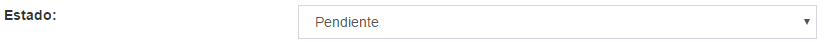](_images/image1233.png)

Figura 539 Combo Box[](#id142 "Link to this image")

##### Cuadro de texto con sugerencias[](#cuadro-de-texto-con-sugerencias "Link to this heading")

Un cuadro de texto con sugerencias permite a un usuario escribir parte de un texto y le muestra una lista de valores cuyos textos empiezan con lo que él escribió. Esos valores se obtienen de algún origen de datos. Por ejemplo, supongamos que un usuario tiene que seleccionar el nombre de un producto de entre los productos que ofrece una empresa. Si la empresa tiene muchos productos, tal vez no sea tan práctico tener un combo box. Tal vez sea más práctico que el usuario empiece a escribir el nombre del producto, y entonces una lista va mostrando los productos cuyos nombres se asemejan a lo que escribe el usuario, hasta que finalmente sean tan pocos que el usuario puede encontrar el que desea fácilmente y seleccionarlo.

Figura 540 Cuadro de texto con sugerencias[](#id143 "Link to this image")

##### Cuadro de texto[](#cuadro-de-texto "Link to this heading")

Caja de texto común con una sola línea (como la caja de texto donde se escribe el nombre de un dominio).

[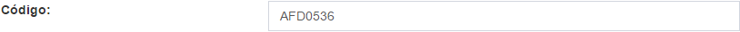](_images/image1253.png)

Figura 541 Cuadro de texto[](#id144 "Link to this image")

##### Cuadro de texto enriquecido[](#cuadro-de-texto-enriquecido "Link to this heading")

Similar al área de texto, pero permite modificar propiedades de formato del texto como usar negrita, cursiva, alinear el texto, agregar listas u otros elementos.

Figura 542 Cuadro de texto enriquecido[](#id145 "Link to this image")

##### Documento[](#documento "Link to this heading")

Un dato de un dominio que usa este tipo de control se muestra, si es editable, como un control para subir archivos (de lo contrario, sólo el valor del dato). Cuando un usuario sube un archivo usando este control, el archivo se adjunta al proceso, y además, en el valor del dato se guardan el identificador de nuevo adjunto, la versión y la ruta del archivo que se subió, separados por punto y coma (“;”). De este modo, el usuario no sólo adjunta un archivo, sino que éste queda asociado a un dato que le da un significado al archivo. Por ejemplo, se puede requerir el ingreso de un currículum teniendo un control de “Currículum Vitae”.

Para que un usuario pueda subir un archivo, no sólo tiene que ser editable el dato, sino que en la visibilidad debe estar permitido agregar archivos (ver [Visibilidad de adjuntos](#visibilidad-de-adjuntos)).

[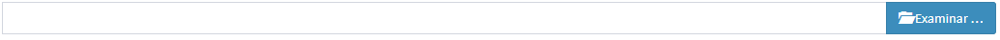](_images/image1273.png)

Figura 543 Control de tipo «Documento», modificable[](#id146 "Link to this image")

##### Etiqueta[](#etiqueta "Link to this heading")

Control que muestra un texto, pero no permite modificarlo, aun cuando la visibilidad del dato defina que existe permiso de edición para el dato en el paso que se está contestando o en el paso de inicio.

Figura 544 Etiqueta[](#id147 "Link to this image")

##### Hipervínculo[](#hipervinculo "Link to this heading")

Control que, cuando se le hace clic, navega hacia una página web. Es útil cuando los datos representan direcciones web.

Figura 545 Un hipervínculo con su ventana de edición[](#id148 "Link to this image")

##### Lista de Check Box[](#lista-de-check-box "Link to this heading")

Conjunto de check boxes. Es útil cuando se le quiere presentar al usuario una lista de opciones y el usuario puede elegir varias de ellas. Los textos de las opciones son copiados en el valor del dato uno a continuación del otro, separados por saltos de línea (sólo dominios de tipo texto aceptan este tipo de control).

Figura 546 Lista de check boxes[](#id149 "Link to this image")

##### Lookup[](#lookup "Link to this heading")

Control que permite obtener a partir de un identificador un valor correspondiente a ese identificador, sacado de una base de datos, de una lista o de un web service. El usuario escribe el identificador en una caja de texto y Qflow muestra el valor correspondiente a ese identificador.

[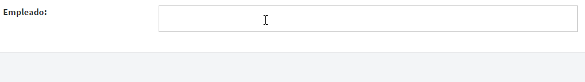](_images/image131.gif)

Figura 547 Lookup[](#id150 "Link to this image")

##### Radio button[](#radio-button "Link to this heading")

Similar al check box, pero cuando hay varios “radio buttons” en una misma área, sólo uno de ellos puede estar marcado, por lo que, cuando se marca uno, se desmarcan automáticamente los otros.

[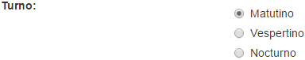](_images/image1321.png)

Figura 548 Radio Button[](#id151 "Link to this image")

##### Selector de fecha y hora[](#selector-de-fecha-y-hora "Link to this heading")

Combinación de selector de fechas y selector de horas. Si posicionas el ratón sobre el símbolo del mundo, verás la zona horaria de preferencia del usuario.

[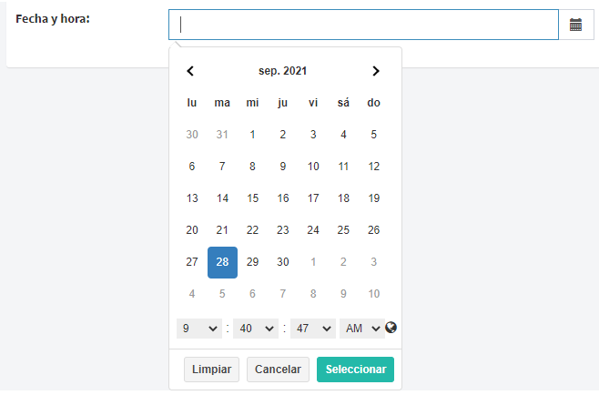](_images/image1331.png)

Figura 549 Selector de fecha y hora[](#id152 "Link to this image")

##### Selector de fechas[](#selector-de-fechas "Link to this heading")

Control que despliega un calendario para seleccionar una fecha.

Figura 550 Selector de fechas[](#id153 "Link to this image")

##### Selector de horas[](#selector-de-horas "Link to this heading")

Es un control que permite ingresar horas y las valida automáticamente.

[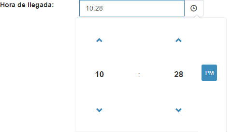](_images/image1351.png)

Figura 551 Selector de horas[](#id154 "Link to this image")

##### Selector de ítems[](#selector-de-items "Link to this heading")

Lista que permite seleccionar un elemento particular de una colección con una gran cantidad de elementos (por ejemplo, sacados de una base de datos). Los elementos son mostrados en una lista y Qflow los filtra a medida que el usuario escribe el nombre del elemento buscado.

[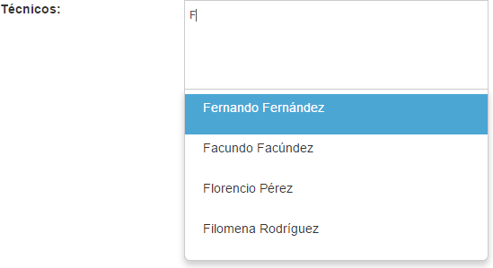](_images/image1361.png)

Figura 552 Selector de ítems[](#id155 "Link to this image")

### Integraciones[](#integraciones "Link to this heading")

Las integraciones permiten que Qflow interactúe con otros sistemas mediante la ejecución de operaciones de componentes de software. Un proceso puede ejecutar las operaciones de una integración a través de una actividad de servicio (ver [Tarea de servicio](#tarea-de-servicio)).

La definición de una integración requiere conocimientos técnicos de informática. Por eso Qflow separa la definición de una integración de su utilización.

Para definir una integración, se debe definir una o más operaciones. Una operación es un conjunto de llamadas a un componente externo a Qflow. Por ejemplo, si es una integración con un web service, es un conjunto de llamadas a métodos de ese web service. Una de las operaciones es seleccionada como operación en producción y ésa es la que se ejecuta cuando se llama la integración.

#### Propiedades de una integración[](#propiedades-de-una-integracion "Link to this heading")

El formulario de propiedades de una integración tiene las siguientes secciones:

*   **General:** además de permitir especificar el nombre y la descripción de la integración, permite seleccionar la operación en producción.
    
*   **Parámetros:** permite definir los parámetros de la integración. Los parámetros permiten que el proceso, al llamar a la integración, le envíe datos y que cuando la integración termine su ejecución, reciba datos de ella.
    
*   **Operaciones:** permite definir las operaciones de la integración. Una operación de una integración que accede a un web service, por ejemplo, se especifica mediante la URL del web service, del nombre del método que se debe invocar y de los parámetros que se le pasan a ese método.
    

[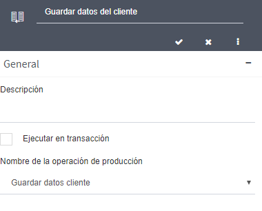](_images/image1371.png)

Figura 553 Propiedades de una integración[](#id156 "Link to this image")

##### General[](#integrationgeneralproperties "Link to this heading")

Propiedades de la sección “General”:

*   **Descripción**
    
*   **Ejecuta en transacción:** permite especificar si la operación debe ser ejecutada en una transacción, o sea, en un contexto en el que muchas operaciones son ejecutadas y, si al menos una falla, entonces todas son canceladas y deshechas. Esto es posible solamente con algunas operaciones (por ejemplo, operaciones de bases de datos). **NOTA TÉCNICA:** _esta opción se implementa ejecutando el código de la integración dentro de un_ **TransactionScope**.
    
*   **Nombre de la operación en producción:** indica cuál de las operaciones definidas en la integración es la que se utilizará (vea más abajo cómo definir operaciones; inicialmente no hay operaciones definidas y por lo tanto, no es posible elegir una). Para elegir la operación en producción, haz clic en la opción seleccionada (puede ser “Ninguno”) y elije una operación de la lista que Qflow le muestra.
    

##### Parámetros[](#parametros "Link to this heading")

La sección de parámetros muestra una tabla (inicialmente vacía) con los parámetros de la integración. Los parámetros permiten enviar datos a la operación que se ejecuta, o recibir datos del resultado de ejecutar la operación. Por ejemplo, si la integración invoca un método de un web service que tiene dos parámetros y que devuelve un número, se deben crear tres parámetros: uno por cada parámetro del método y uno para el resultado. Cuando se selecciona la integración en una tarea de servicio (ver [Tarea de servicio](#tarea-de-servicio)), se asocia cada parámetro de la integración a un dato o parámetro de aplicación.

[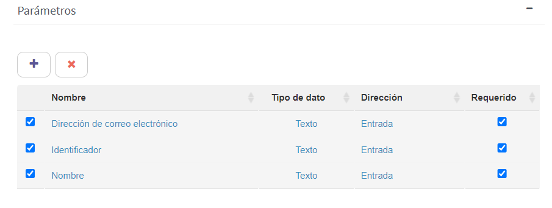](_images/image1381.png)

Figura 554 Parámetros de una integración[](#id157 "Link to this image")

Para agregar un parámetro, haz clic en el botón “+”. Eso hace que se agregue una fila a la tabla. Para modificar una propiedad del parámetro, haz clic en su valor (por ejemplo, para modificar el nombre del parámetro, haz clic en el texto que aparece en la columna “Nombre” de ese parámetro).

Para eliminar un parámetro, selecciónalo y haz clic en el botón de eliminar (✗).

Las propiedades de un parámetro son:

*   **Nombre:** nombre que identifica el parámetro.
    
*   **Tipo de dato**:
    
    *   **Texto**
        
    *   **Número**
        
    *   **Verdadero/Falso:** dato con dos valores posibles: verdadero o falso
        
    *   **Fecha**
        
    *   **GUID:** identificador
        
*   **Dirección:**
    
    *   **Entrada**
        
    *   **Salida**
        
    *   **Entrada y Salida**
        
*   **Requerido:** si esta opción está marcada, es obligatorio asociar un dato o parámetro de aplicación al parámetro en las tareas de servicio que usen la integración que se está definiendo.
    

##### Operaciones[](#operaciones "Link to this heading")

Las operaciones también se muestran en una tabla ([Figura 555](#integrationoperations)). Cuando se agrega una operación, aparece el formulario del asistente para generarla ([Figura 556](#integrationproperties2)). En la sección “General” de ese formulario se ingresan el nombre y opcionalmente, la descripción de la operación. Debajo de estas opciones están las opciones para agregar los componentes que debe usar Qflow para ejecutar la operación. Una vez definidos los componentes, debea hacer clic en el botón de siguiente para ir al siguiente paso. Al final del proceso, Qflow generará el código que ejecuta la operación.

[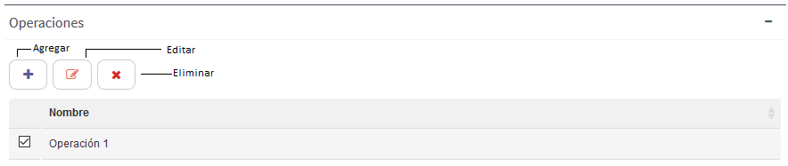](_images/image1391.png)

Figura 555 Operaciones de una integración[](#id158 "Link to this image")

[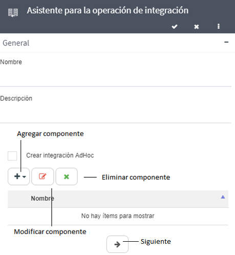](_images/image1401.png)

Figura 556 Propiedades de una integración[](#id159 "Link to this image")

Si se marca la opción “**Crear integración AdHoc**”, no hace falta especificar nada: una integración ad hoc se crea con un código que no ejecuta nada. Se puede usar para pruebas o para generar una operación cuyo código será escrito a mano más tarde.

De lo contrario, hay que especificar uno o más componentes para la operación. Los tipos de componente disponibles son:

*   **Database:** un procedimiento almacenado, o un script para hacer consultas (Queries) o insertar o actualizar datos (Upserts).
    
*   **Rest web service:** un web service REST.
    
*   **SharePoint:** una lista de SharePoint. Se puede subir documentos y crear elementos en una lista o biblioteca de documentos.
    
*   **SharePoint Online:** igual que el componente anterior, pero para listas de SharePoint Online.
    
*   **Web service:** un web service.
    

Nota

En la versión **OnPremise** de Qflow, también se pueden manejar operaciones de otros tipos: COM, Assembly (componente .Net) y Qflow Assembly (componente .Net que implementa una interfaz definida en Qflow). Estas operaciones no están disponibles en Qflow Design, pero sí en el diseñador clásico. Una vez definidas, es posible ver el código de estas operaciones en Qflow Design.

Para agregar un componente, haz clic en el botón de configurar la operación ([Figura 556](#integrationproperties2)). Aparece entonces un menú que permite seleccionar el tipo de componente. Cuando selecciones el tipo de componente, aparecerá un formulario para especificar la conexión al componente. Ese formulario tiene dos opciones:

*   **Usar un parámetro de aplicación:** si marcas esta opción, en lugar de especificar la conexión, puedes seleccionar un parámetro de aplicación para que Qflow obtenga los datos de la conexión del parámetro de aplicación. Si la lista de parámetros de aplicación para elegir está vacía, es porque no hay un parámetro de aplicación disponible para el tipo de componente seleccionado (por ejemplo, el tipo de componente es “Database” y no hay ningún parámetro de aplicación de tipo “Conexión a base de datos” disponible).
    
*   **Definir en la configuración del origen de datos:** si marcas esta opción, debes especificar los datos de la conexión. Los datos de una conexión se especifican de la misma forma que si uno estuviera definiendo una conexión en un parámetro de aplicación. Por instrucciones sobre cómo configurar una conexión, consulta la sección correspondiente en el apartado [Parámetros de aplicación](#parametros-de-aplicacion):
    
    *   **Conexión a Base de datos:** Ver [Configuración de una conexión a base de datos](#configuracion-de-una-conexion-a-base-de-datos) por instrucciones.
        
    *   **Conexión a lista de SharePoint:** Ver [Configuración de una conexión a SharePoint](#configuracion-de-una-conexion-a-sharepoint) por instrucciones.
        
    *   **Conexión a lista de SharePoint Online:** Ver [Configuración de una conexión a SharePoint Online](#configuracion-de-una-conexion-a-sharepoint-online) por instrucciones.
        
    *   **Conexión a Web service:** Ver [Configuración de una conexión a web service](#configuracion-de-una-conexion-a-web-service) por instrucciones.
        

En el caso de un componente de tipo **Rest Web service**, para configurar la conexión debe especificar los siguientes datos:

*   **Url:** la URL del web service. Por ejemplo: “[http://servidorWeb/api](http://servidorWeb/api)”.
    
*   **Método web:** suponiendo que se quiere acceder a las operaciones de altas, bajas y modificaciones de empleados, un ejemplo sería poner. “empleados”.
    
*   **Método Http:** el método Http (get, post, put o delete), que depende de qué operación se deseas realizar (obtención de un objeto, alta, modificación o eliminación).
    
*   **Encabezados:** permite especificar encabezados para la conexión con el web service REST. Para los valores de las claves se debe especificar un parámetro de la integración que sea de entrada o entrada/salida.
    
*   **Parámetros:** permite especificar la estructura de los objetos que se reciben por parámetros. Si el parámetro es un valor simple (por ejemplo, el identificador de una entidad), basta con hacer clic en “Agregar propiedad” ([Figura 558](#restwebservicecomponentconfiguration)) y asignarle un nombre seleccionándola, haciendo clic en “Editar propiedad” ([Figura 558](#restwebservicecomponentconfiguration)) e ingresando el nombre. Este nombre se usará más tarde para asociar el parámetro con uno de los parámetros de entrada de la integración. El botón “Agregar subpropiedad” sirve para especificar objetos complejos. Combinando “Agregar propiedad” y “Agregar subpropiedad”, se puede especificar un objeto que tiene dentro otros objetos. No es necesario incluir todas las propiedades de los objetos: solamente aquellas a las que se quiera asignar valores que están en parámetros de la integración.
    
*   **Objeto de retorno:** funciona de la misma forma que Parámetros, pero para el objeto de retorno.
    

Figura 557 Configuración de conexión para integración de tipo REST web service[](#id160 "Link to this image")

[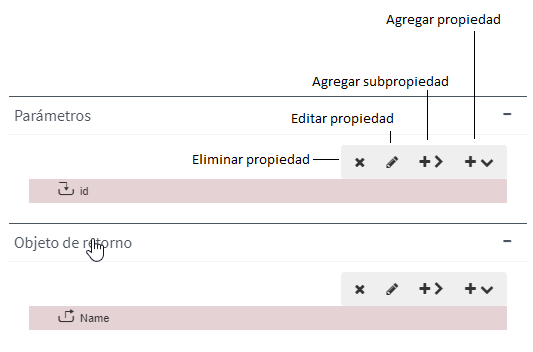](_images/image1414.png)

Figura 558 Configuración de parámetros y objeto de retorno. En este caso, el objeto recibe un parámetro simple, “id”, y devuelve un objeto, del cual interesa la propiedad “Name” (la integración tiene un parámetro de entrada para el “id” y uno de salida para “Name”.[](#id161 "Link to this image")

Una vez especificado un componente, si haces clic en el botón de aceptar, el componente se agrega a la lista de componentes ([Figura 559](#componentsaddedtooperation)).

[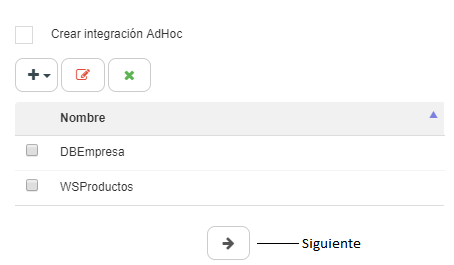](_images/image1421.png)

Figura 559 Dos componentes agregados a una operación[](#id162 "Link to this image")

Cuando se terminó de agregar componentes, hay que especificar qué operaciones de estos componentes se ejecutarán en la operación. Para pasar a esta etapa de la definición de la operación, haz clic en el botón de la flecha ([Figura 559](#componentsaddedtooperation), “Siguiente”). La pantalla cambia para mostrar las clases y métodos disponibles ([Figura 560](#selectmethods)). Cuando se selecciona una clase, la lista de métodos disponibles cambia para mostrar los métodos de la clase seleccionada. Las clases que se muestran son las siguientes:

*   **Para bases de datos:** como las bases de datos no tienen clases, lo que se muestra son clases generadas por Qflow para representar comandos que se pueden enviar a la base de datos. Las clases son de los siguientes tipos:
    
    *   **\[BaseDeDatos\].Queries:** estas clases permiten ejecutar consultas sencillas generadas automáticamente por Qflow. Cuando se selecciona esta opción, en la lista “Métodos disponibles” se carga un elemento por cada tabla de la base de datos. Cada uno de estos elementos representa un comando “SELECT” para traer los datos de la tabla correspondiente. Por ejemplo, si la base de datos tiene una tabla que se llama “Empleados”, en “Métodos disponibles” aparece el “método” “EmpleadosQuery”. Si además tiene una tabla llamada “Productos”, aparece el método “ProductosQuery”, etc.
        
    *   **\[BaseDeDatos\].StoredProcedures:** estas clases permiten ejecutar procedimientos almacenados. Cuando se selecciona esta opción, en la lista “Métodos disponibles” se cargan los procedimientos almacenados de la base de datos.
        
    *   **\[BaseDeDatos\].Upserts:** permiten ejecutar secuencias de comandos SQL generados automáticamente por Qflow para actualizar tablas. Cuando se selecciona esta opción, en la lista “Métodos disponibles” se carga un elemento por cada tabla de la base de datos. Cada uno de estos elementos representa un comando que inserta o actualiza un registro de una tabla, según si los valores que se le pasan corresponden a un registro que ya existe o no. Por ejemplo, si la base de datos tiene una tabla que se llama “Empleados”, en “Métodos disponibles” aparece el método “EmpleadosUpsert”.
        
*   **Para web services:** se muestra la clase que implementa las operaciones del web service. Si se selecciona esa clase, se muestran los métodos que el web service expone.
    
*   **Para web services REST:** se muestra la clase asociada al componente configurado, con un único método.
    
*   **Para listas de SharePoint y SharePoint Online:** las clases disponibles corresponden a los tipos de contenido disponibles para la lista seleccionada. También está la opción \[DynamicContentType\], que permite agregar un elemento o subir un documento especificando el tipo de contenido mediante un parámetro. Una vez seleccionada la clase, suelen aparecer dos métodos disponibles: uno permite crear un elemento (“CreateItemX”, donde X es el nombre del tipo de contenido seleccionado en “ClasesDisponibles”). El otro permite subir un documento (“UploadDocumentX”). En este caso, además de los parámetros correspondientes a los campos del tipo de contenido, hay uno que debe contener la ruta del archivo que se va a subir. Si la clase seleccionada es \[DynamicContentType\], solamente aparecerá la opción de crear un ítem (“CreateItemDynamicContentType”).
    

[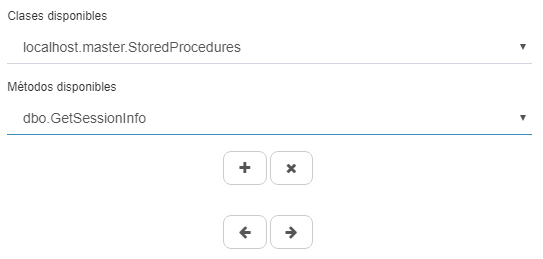](_images/image1431.png)

Figura 560 Seleccionar métodos[](#id163 "Link to this image")

Para agregar un método, selecciónalo y haz clic en el botón “+”. Al agregar un método, aparecen sus parámetros de entrada y de salida. A cada uno de esos parámetros se le puede asociar uno de los parámetros definidos para la integración. El ícono al lado de un parámetro del método indica si es de entrada o salida; si deja el cursor de un ratón sobre un parámetro, aparece una etiqueta que dice “Entrada” o “Salida”.

Para asociar un parámetro del método a un parámetro de la integración, haz clic con el botón derecho donde dice “Valor” y selecciona “Asignar valor”. Esto hace que aparezca la lista de parámetros de la integración compatibles con el parámetro seleccionado del método: los parámetros compatibles son los que tienen un tipo convertible y la misma dirección (entrada o salida). Por ejemplo, si el parámetro de entrada del método es de tipo “Número”, se podrán seleccionar los parámetros configurados como Entrada o Entrada/Salida y de tipo “Número”. Sin embargo, si el parámetro de entrada del método es de tipo “Texto”, se podrán seleccionar todos los parámetros configurados como Entrada o Entrada/Salida sin importar el tipo, ya que un valor de cualquier tipo se puede convertir en texto. Análogamente, si el parámetro del método es de salida y tipo “Texto”, aparecerán todos aquellos parámetros configurados como Salida o Entrada/Salida sin importar su tipo ([Figura 561](#methodwithparameters)). Seleccione, de la lista, el parámetro de la integración que desee asociar al parámetro del método y ambos quedarán asociados.

[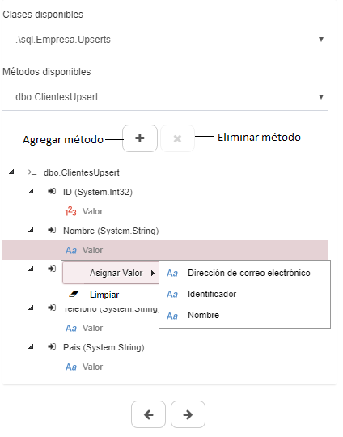](_images/image1441.png)

Figura 561 Método con sus parámetros[](#id164 "Link to this image")

Ejemplo ([Figura 562](#integrationwithparameters)): una integración invoca un método de un web service, _GetProductName_, que recibe como parámetro un número entero, productId, y devuelve un texto.

Para la integración se definen dos parámetros, ID, de tipo “Número” y de entrada, y Resultado, de tipo “Texto” y de salida. ID sólo se puede asociar al parámetro productId del método. No se puede asociar al resultado del método porque éste es un texto, mientras que ID es un número. Además, ID es un parámetro de entrada, por lo que, aun cuando el resultado del método fuera un número, no sería posible asociarlos. Lo mismo pasa con Resultado, que sólo se puede asociar al resultado del método.

Para quitar un método, selecciónalo y haz clic en el botón de eliminar método ([Figura 561](#methodwithparameters)).

[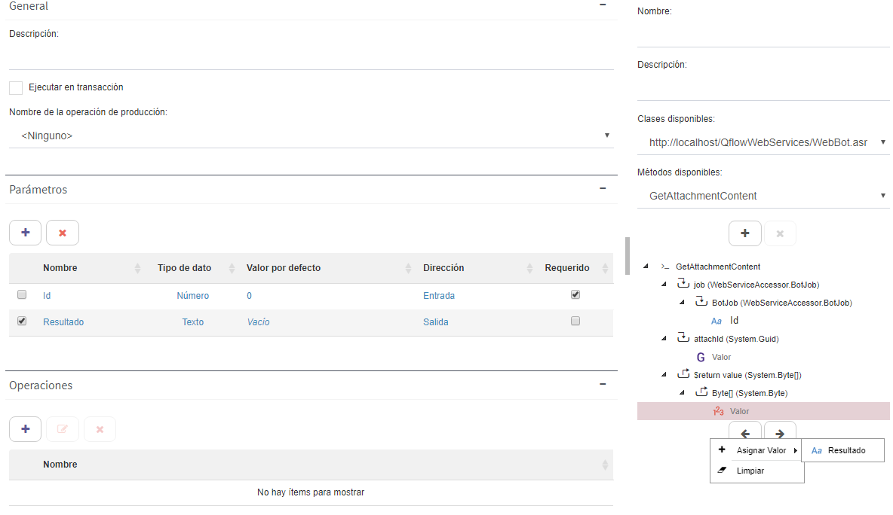](_images/image1451.png)

Figura 562 Integración con dos parámetros, y cómo se los asocia con los parámetros de un método[](#id165 "Link to this image")

Una vez especificados los métodos con sus parámetros, vuelve a hacer clic en el botón de siguiente. Qflow generará el código para llamar el método y guardar el resultado en los parámetros de salida. Haz clic en el botón de aceptar para guardar la operación.

Una vez creada una operación, puedes acceder al código generado mediante el botón de editar ([Figura 563](#generatedcode)).

[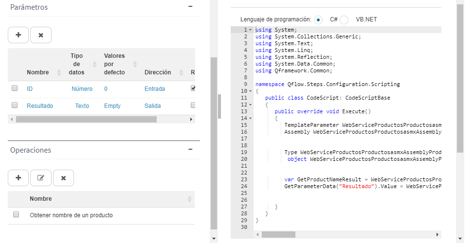](_images/image1461.png)

Figura 563 Código generado para una operación[](#id166 "Link to this image")

##### Editor de código[](#editor-de-codigo "Link to this heading")

Cuando se agrega una operación a una integración, Qflow genera el código que ejecutará para invocar la operación. Este código se puede ver y modificar. El código se muestra en el editor de código, que también se usa al editar manejadores de eventos, tareas de códigos y validaciones. El botón de compilar permite compilar el código. Si hay errores, se muestran en la solapa “Error”. En algunos casos, como por ejemplo en las tareas de código, es posible ejecutar el código con un botón de “Ejecutar”. Tenga cuidado al usarlo: si, por ejemplo, el código modifica una base de datos, al ejecutarlo desde el editor, la base de datos puede ser modificada como si el código se estuviese ejecutando desde un proceso. En el caso de las integraciones esta opción no es posible.

Diferencia de versiones

El botón de Ejecutar **no** se encuentra disponible en la versión **Cloud**.

[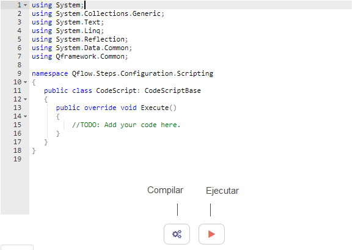](_images/image1471.png)

Figura 564 Editor de código[](#id167 "Link to this image")

### Parámetros de aplicación[](#parametros-de-aplicacion "Link to this heading")

Los parámetros de aplicación son entidades que permiten separar datos de configuración de las entidades que los utilizan. Por ejemplo, puede suceder que muchas plantillas de proceso utilicen el mismo servicio web desde tareas de servicio. Resulta incómodo tener que especificar en cada una de las tareas la Url del servicio. Además, si ésta cambia, hay que modificar todas las tareas. Por eso es más conveniente que ese dato se guarde en un lugar solo, y que para cada tarea de web service, en lugar de especificarse la Url del web service, se especifique dónde está guardado ese dato.

De la misma forma, puede haber varias integraciones distintas que usan el mismo web service (cada una invocando una operación distinta, por ejemplo). En ese caso también es preferible almacenar la información del web service en un solo lugar del cual todas las integraciones obtienen los datos de conexión. Los parámetros de aplicación permiten guardar datos como esos, y utilizarlos en tareas de servicio, en fuentes de datos para dominios que los usen, en integraciones, y como etiquetas o parámetros en otros pasos.

Además, para los [conectores](34-ConnectorsIndex.md) que Qflow ofrece con otras herramientas, también es necesario utilizar un parámetro de aplicación de conexión que almacena los datos necesarios para conectarse con dicha herramienta.

#### Propiedades de un parámetro de aplicación[](#propiedades-de-un-parametro-de-aplicacion "Link to this heading")

El formulario de edición de un parámetro de aplicación permite, además de modificar su nombre y su descripción, definir el tipo del parámetro y asignarle un valor. Los tipos de parámetro son:

*   **Contraseña:** el valor del parámetro es un texto que se guarda cifrado en base de datos.
    
*   **Texto:** el valor del parámetro es un texto.
    
*   **Conexión a base de datos:** el parámetro tiene todos los datos necesarios para conectarse a una base de datos.
    
*   **Conexión a web service:** el parámetro tiene todos los datos necesarios para conectarse a un web service (ya sea SOAP o REST).
    
*   **Conexión a SharePoint:** el parámetro tiene los datos necesarios para conectarse a una lista de SharePoint.
    
*   **Conexión a SharePoint Online:** el parámetro tiene los datos necesarios para conectarse a una lista de SharePoint Online.
    
*   **Conexión de integración:** el parámetro tiene los datos necesarios para conectarse a las herramientas de las cuales Qflow permite crear conectores.
    

Para asignarle un valor al parámetro, como por ejemplo su valor o los datos de conexión a una base de datos, haz clic en el botón de configurar ([Figura 565](#parameterproperties)). Para configurar un parámetro de aplicación de tipo “Contraseña” o “Texto”, simplemente se ingresa la contraseña o el texto del parámetro (en el caso de la contraseña, se la ingresa dos veces).

Figura 565 Propiedades de un parámetro[](#id168 "Link to this image")

La configuración de conexiones a bases de datos, web services y SharePoint se explica a continuación.

##### Configuración de una conexión a base de datos[](#configuracion-de-una-conexion-a-base-de-datos "Link to this heading")

Las propiedades de una conexión a una base de datos ([Figura 566](#configuredatabaseconnection)) son las siguientes:

*   **Tipo de proveedor:** proveedor de acceso a la base de datos (por ejemplo, proveedor de SQL, OleDb, ODBC, Oracle). Depende del tipo de base de datos para el cual se está definiendo una conexión.
    
*   **Servidor:** nombre del servidor donde se encuentra la base de datos.
    
*   **Seguridad integrada:** Esta opción es para bases de datos SQL Server. Si esta opción está marcada, la conexión se hace utilizando seguridad integrada. De lo contrario, Qflow habilita las propiedades “Usuario” y “Contraseña” para ingresar el nombre de usuario de la base de datos y la contraseña correspondiente.
    
*   **Parámetros adicionales:** es una grilla en la que se pueden agregar parámetros a la cadena de conexión. La grilla tiene dos columnas, una para el nombre del parámetro y otra para el valor. Por ejemplo, si se quiere especificar un timeout de 60 segundos para la conexión a una base SQL Server, se puede agregar un parámetro adicional con nombre “Connection Timeout” y valor “60”.
    
*   **Probar conexión:** haz clic en este botón para comprobar que los datos ingresados son correctos. Si los datos son correctos, podrás elegir un valor para la propiedad “Base de datos”.
    
*   **Base de datos:** la base de datos a la cual desea conectarse.
    

[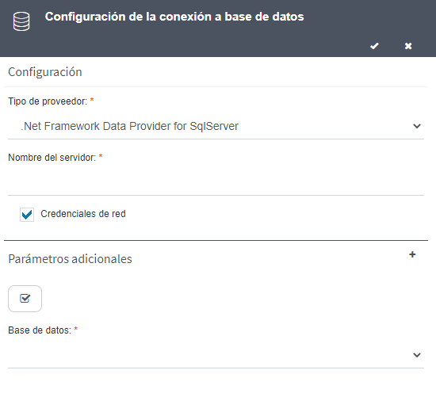](_images/image1491.png)

Figura 566 Configuración de una conexión a una base de datos[](#id169 "Link to this image")

##### Configuración de una conexión a web service[](#configuracion-de-una-conexion-a-web-service "Link to this heading")

Las propiedades de una conexión a web service ([Figura 567](#configurewebserviceconnection)) son las siguientes:

*   **Url:** la URL del web service (puede ser SOAP o REST).
    
*   **Credenciales de red:** deja marcada esta opción si deseas utilizar las credenciales del usuario cuya cuenta utilizan los servicios de Qflow. Si deseas utilizar otras credenciales, desmarca esta opción e ingrese el nombre de usuario y la contraseña que desee utilizar.
    
*   **Probar conexión:** si haces clic en este botón, podrás verificar si la URL y las credenciales ingresadas son correctas. Si lo son, Qflow abrirá la página del web service en una nueva pestaña del navegador.
    

[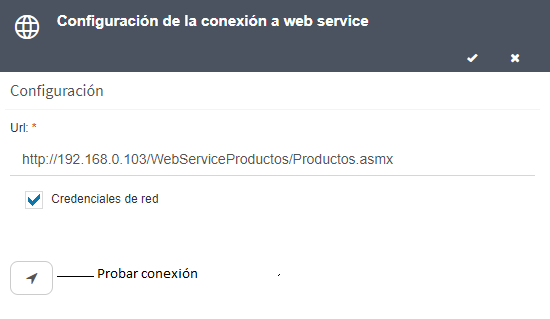](_images/image1501.png)

Figura 567 Configuración de conexión a web service[](#id170 "Link to this image")

##### Configuración de una conexión a SharePoint[](#configuracion-de-una-conexion-a-sharepoint "Link to this heading")

Las propiedades de una conexión a SharePoint ([Figura 568](#configuresharepointlistconnection)) son las siguientes:

*   **URL del sitio:** la URL del sitio de SharePoint en que está la lista de SharePoint a la que desea acceder.
    
*   **Credenciales de red:** marca la opción si deseas usar la cuenta de los servicios de Qflow para conectarse a SharePoint, o de lo contrario desmárcala e ingresa nombre de usuario y contraseña. Utiliza el botón “Probar conexión” para comprobar que puedes acceder al sitio del SharePoint especificado mediante las credenciales que indicó. Si la prueba es exitosa, podrás seleccionar la lista de SharePoint.
    
*   **Lista:** este campo se habilita una vez que haya probado que los datos anteriores son correctos, mediante el botón de probar conexión. Selecciona aquí la lista de SharePoint a la que deseas acceder.
    

[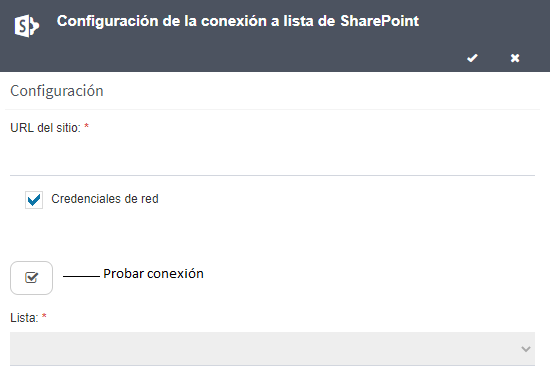](_images/image1514.png)

Figura 568 Configuración de conexión a una lista de SharePoint[](#id171 "Link to this image")

##### Configuración de una conexión a SharePoint Online[](#configuracion-de-una-conexion-a-sharepoint-online "Link to this heading")

De manera similar a la configuración anterior, pero teniendo en cuenta que debido a que SharePoint Online se autentica mediante un servicio de Office, debemos ingresar nombre de usuario y contraseña para crear la conexión. Las propiedades de una conexión a SharePoint Online ([Figura 569](#configuresharepointonlinelistconnection)) son las siguientes:

*   **URL del sitio:** la URL del sitio de SharePoint Online en que está la lista a la que desea acceder.
    
*   **Nombre de usuario:** nombre de usuario a utilizar para autenticarse en el sitio de SharePoint Online.
    
*   **Contraseña:** contraseña a utilizar para autenticarse en el sitio de SharePoint Online.
    
*   **Lista:** este campo se habilita una vez que haya probado que los datos anteriores son correctos, mediante el botón de probar conexión. Selecciona aquí la lista de SharePoint Online a la que deseas acceder.
    

Figura 569 Configuración de conexión a una lista de SharePoint[](#id172 "Link to this image")

##### Configuración de una conexión a una integración[](#configuracion-de-una-conexion-a-una-integracion "Link to this heading")

Debido a que los datos de una conexión a una integración dependen del conector que se vaya a utilizar, lo primero que el usuario debe elegir es la herramienta.

[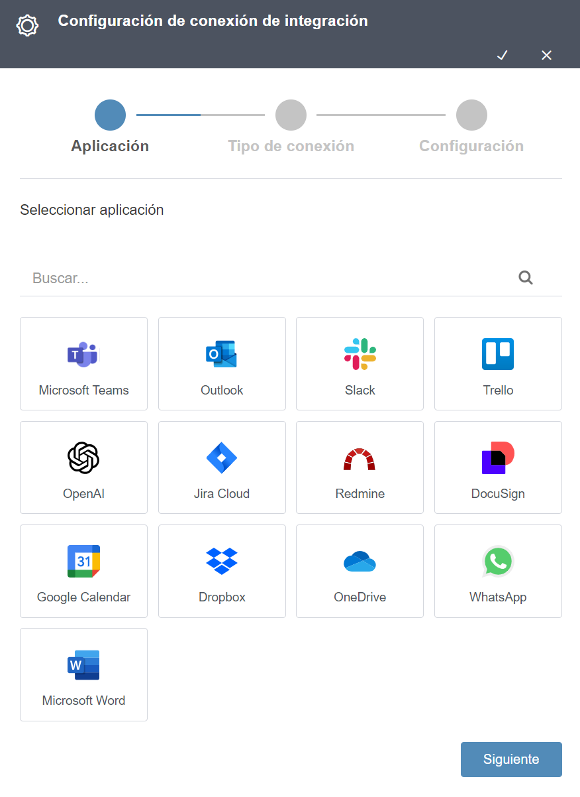](_images/connection-applicationparameter-toolselection.png)

Figura 570 Selección de herramienta de un parámetro de conexión[](#id173 "Link to this image")

Una vez seleccionada la herramienta, el segundo paso consiste en seleccionar el tipo de conexión. Las herramientas pueden tener varios tipos de conexión dependiendo de cómo se conectan al servicio que proveen.

[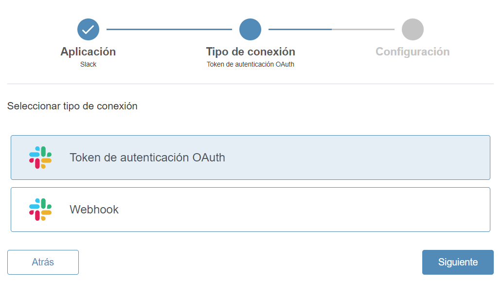](_images/connection-applicationparameter-connectiontype.png)

Figura 571 Selección de tipo de conexión[](#id174 "Link to this image")

El último paso implica ingresar los valores de los datos de conexión. Los datos a llenar dependen del tipo de conexión seleccionado en el paso anterior. Puedes usar la ayuda disponible en los parámetros, lo cual te redirigirá a esta documentación.

[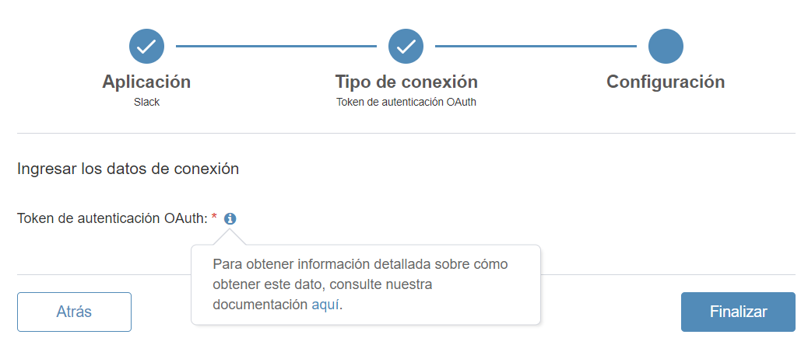](_images/connection-applicationparameter-configuration.png)

Figura 572 Configuración de parámetro de conexión[](#id175 "Link to this image")

Una vez guardado, ya podrá ser utilizado como conexión para tareas de servicio que usen esa misma herramienta como conector. Para más información puede ver la especificación de cada tipo de conexión en el artículo correspondiente a la herramienta en la sección de [conectores](34-ConnectorsIndex.md).

### Utilización de un parámetro de aplicación[](#utilizacion-de-un-parametro-de-aplicacion "Link to this heading")

Un parámetro se puede utilizar en varios contextos en los cuales es necesario especificar el tipo de información que se guarda en un parámetro de aplicación. En un dominio que usa un web service como fuente de datos, por ejemplo, es necesario especificar la URL del web service. El usuario puede optar por especificar la URL en las propiedades del propio dominio (“Definir en la configuración del origen de datos”) o utilizar un parámetro de aplicación. Los parámetros de aplicación se pueden utilizar también en integraciones. Un parámetro de aplicación de tipo “Texto” se puede utilizar como etiqueta (consulte la sección [Etiquetas](#etiquetas)), como destinatario de una tarea externa (ver [Respuesta de tarea externa](#respuesta-de-tarea-externa)) o como parte de las condiciones de una compuerta (ver [Compuertas](#compuertas)). Un parámetro de aplicación de este tipo también se puede asociar a parámetros de bots y de integraciones, en tareas de servicio asícronas y síncronas respectivamente. Además, estos parámetros están disponibles en el código que se escribe en actividades de código o en _assemblies_ de tipo Qflow (que contienen clases derivadas de CodeScriptBase; ver el manual de la [Interfaz de Scripting](10-ScriptingInterface.md)).

### Manejadores de eventos[](#manejadores-de-eventos "Link to this heading")

Los manejadores de eventos son pequeños programas que Qflow ejecuta en su contexto (tienen acceso a los datos del proceso) cuando ocurre un determinado evento durante la ejecución de un proceso. Los eventos que pueden disparar la ejecución de manejadores están predefinidos. Definir un manejador consiste principalmente en definir su código. Más tarde se lo asocia a algún evento, de modo que cuando éste ocurre, se ejecuta el código del manejador.

#### Propiedades de los manejadores de eventos[](#propiedades-de-los-manejadores-de-eventos "Link to this heading")

El formulario de propiedades de un manejador de evento tiene las siguientes secciones:

*   **General:** nombre y descripción
    
*   **Información del manejador:** permite definir el código del manejador y determinar si es síncrono o asíncrono. Las propiedades de esta sección se explican abajo.
    

##### Propiedades del manejador[](#propiedades-del-manejador "Link to this heading")

*   **Tipo** **de manejador:**
    
    *   **Síncrono:** el manejador se ejecuta de forma tal que el proceso lo espera y no continúa hasta que la ejecución del manejador termine. El manejador puede modificar datos del proceso.
        
    *   **Asíncrono:** el manejador se ejecuta de forma tal que el proceso no espera que su ejecución termine. El manejador no puede modificar datos del proceso.
        
*   **Orden:** es un número útil cuando hay más de un manejador asociado a un evento. En ese caso, los manejadores se ejecutan en orden creciente usando ese número. Por ejemplo, si hay tres manejadores para el mismo evento, Qflow ejecuta primero aquel cuyo valor para esta propiedad sea 0, luego el que tenga como valor 1 y por último el que tenga como valor 2.
    
*   **Usar integración:** si se marca esta opción, el manejador utiliza el código de una integración que ya está definida, en lugar de utilizar código escrito específicamente para el manejador. Cuando esta opción está marcada, la pantalla cambia para que se puede seleccionar una integración y desaparecen las opciones que permiten escribir el código del manejador ([Figura 573](#eventhandlerproperties)). La parte inferior de la pantalla cambia para mostrar los parámetros de la integración, de modo que se pueda asociar datos de aplicación con ellos, de la misma forma que en una tarea de servicio (ver [Tarea de servicio](#tarea-de-servicio)).
    
    *   **Propiedades si se usa una integración:**
        
        *   **Integración:** lista para seleccionar la integración que contiene el código que se desea asignar al manejador.
            
        *   **Parámetros:** especificación de la correspondencia entre datos de aplicación y parámetros de la integración. Consulta [Integraciones](#integraciones) por detalles.
            
    *   **Propiedades si no se usa una integración:**
        
        *   **Lenguaje:** permite especificar el lenguaje de programación en el que se escribirá el código del manejador. Las opciones son C# y Visual Basic .NET.
            
        *   **Código:** debajo de las opciones de lenguaje aparece un área de texto que permite escribir el código del manejador en el lenguaje seleccionado.
            

[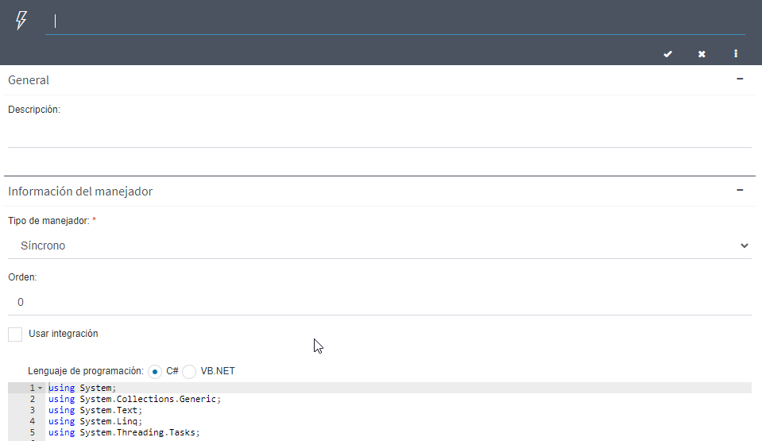](_images/image1571.png)

Figura 573 Propiedades de un manejador de eventos[](#id176 "Link to this image")

#### Asociar un manejador de eventos con un evento[](#asociar-un-manejador-de-eventos-con-un-evento "Link to this heading")

Para que Qflow ejecute un manejador de evento, hay que asociarlo a un evento de modo que cuando éste ocurra, Qflow ejecute el código del manejador.

Hay dos tipos de eventos:

*   **Eventos del proceso:** estos eventos no están asociados a ningún paso en particular.
    
*   **Eventos de los elementos del diseño:** son eventos que están asociados a una tarea de usuario o a una tarea de servicio asíncrono.
    

##### Asociar un manejador a un evento de una tarea[](#asociar-un-manejador-a-un-evento-de-una-tarea "Link to this heading")

Para asociar un manejador de eventos a una tarea, selecciónala en el grafo y haz clic en el ícono de propiedades para abrir el formulario de propiedades del elemento en Qflow. Luego, accede a la pestaña “Dev tools”. En esa sección encontrarás una lista de eventos a los que se puede asignar un manejador:

*   **Error en paso:** ocurre cuando se produce un error durante la ejecución del paso.
    
*   **Finalizar paso:** ocurre cuando el paso termina su ejecución.
    
*   **Iniciar paso:** ocurre cuando comienza la ejecución del paso.
    
*   **Novedades en paso:** ocurre cuando hay novedades en el paso. Por ejemplo, en el caso de una tarea de usuario, cuando un destinatario contesta la pregunta. Nótese que el hecho de que haya novedades en un paso no implica necesariamente que el proceso o el hilo cambien de estado. Por ejemplo, si una tarea de usuario tiene varios destinatarios y el proceso espera que cinco de ellos contesten antes de continuar, el proceso no abandonará el estado de espera hasta que cinco destinatarios contesten, pero cuando el primero en contestar lo haga, estará generando una novedad en el paso.
    

Para asignar el manejador a un evento, selecciona el evento y haz clic en el botón de modificar. En el formulario de propiedades del evento, selecciona el manejador y haz clic en el botón con el símbolo de ✓.

[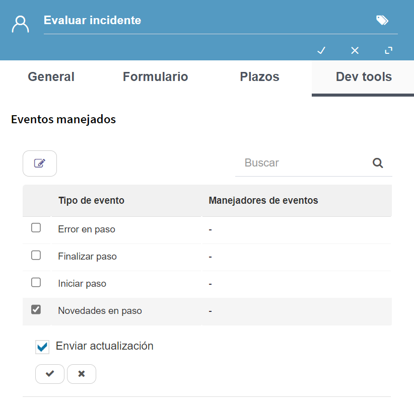](_images/image1581.png)

Figura 574 Asociar un manejador a una tarea[](#id177 "Link to this image")

##### Asociar un manejador a un evento del proceso[](#asociar-un-manejador-a-un-evento-del-proceso "Link to this heading")

Para asociar un manejador de eventos a un evento del proceso, haz clic derecho en la plantilla que contiene los procesos donde se utilizará el manejador y selecciona “Manejadores de eventos”. Esto muestra una lista con los eventos del proceso. Marca el evento al cual deseas asociar el manejador, después haz clic en el botón de editar, o doble clic en la fila correspondiente. Aparece entonces una lista de manejadores, marque el manejador deseado y haz clic en el botón con el símbolo de ✓.

Los eventos del proceso son los siguientes:

*   **Cambio de estado de hilo:** ocurre cuando un hilo cambia de estado. Por ejemplo, si un hilo estaba esperando que alguien ejecutara una tarea, y esa persona contesta la tarea, el hilo pasa de estar en espera a estar ejecutándose.
    
*   **Cambio de estado del proceso:** ocurre cuando el proceso cambia de estado. Por ejemplo, si el proceso llega a un paso de tarea, hay un cambio de estado, pues el proceso adopta un estado en el que espera por la finalización o cancelación de esa tarea.
    
*   **Error en hilo:** ocurre cuando se produce un error durante la ejecución de un hilo.
    
*   **Etapa en tiempo:** ocurre cuando la etapa actual del proceso supera el tiempo definido como esperado. Por más información de las etapas consultar la sección [Etapas](#etapas).
    
*   **Etapa retrasada:** ocurre cuando la etapa actual del proceso supera el tiempo máximo definido.
    
*   **Finalizar proceso:** ocurre cuando finaliza el proceso.
    
*   **Finalizar hilo:** ocurre cuando finaliza un hilo.
    
*   **Hilo en espera:** ocurre cuando un hilo finaliza y espera la finalización de sus hilos hermanos.
    
*   **Iniciar proceso:** ocurre cuando inicia el proceso.
    
*   **Iniciar hilo:** ocurre cuando inicia la ejecución de un nuevo hilo.
    
*   **Separación de hilo:** ocurre cuando un hilo se divide en varios hilos. Esto ocurre cuando un hilo llega a una compuerta paralela divergente o a una compuerta inclusiva divergente que inicia varios hilos.
    
*   **Unión de hilos:** ocurre cuando dos o más hilos se unen. Esto ocurre cuando el proceso llega a una compuerta paralela convergente o a una compuerta inclusiva convergente que une varios hilos.
    

[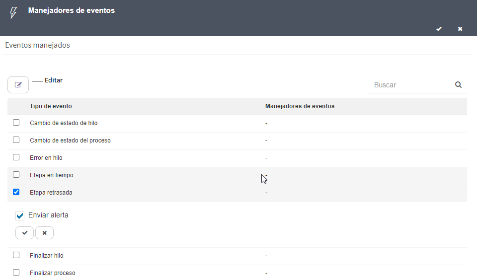](_images/image1591.png)

Figura 575 Asignar un manejador a un evento del proceso (en este caso, el manejador “Enviar alerta” se asigna al evento “Etapa retrasada”).[](#id178 "Link to this image")

### Validaciones[](#validaciones "Link to this heading")

Las validaciones son pequeños programas que se definen para ejecutar operaciones en los formularios de los procesos. Para desarrollar validaciones es necesario poseer conocimientos de scripting del lado del cliente (Javascript). Hay dos tipos de validaciones:

*   Las que se ejecutan cuando Qflow carga un formulario en la pantalla. Estas validaciones permiten modificar el estado de los datos del formulario antes de que el usuario pueda modificarlos. Para ello, se puede implementar el método formLoad().
    
*   Las que se ejecutan cuando el usuario hace clic en el botón de respuesta del formulario (el botón que inicia el proceso en el caso de los formularios de inicio; el botón que responde la tarea en el caso de los formularios de respuesta; el botón “Guardar” en un formulario de edición del proceso). Estas validaciones pueden ser utilizadas para verificar los datos y emitir una alerta cuando éstos no son válidos, impidiendo así que el usuario cometa errores que perjudiquen el correcto funcionamiento del proceso. Para ello, se puede implementar el método formSubmit().
    

Al igual que los formularios personalizados, las validaciones son definidas en un paquete, plantilla de proceso o versión y después son asociadas a los formularios en los que se desea utilizar. Una validación puede ser utilizada en varios formularios de varios procesos diferentes. Una validación se puede asociar a un formulario de cualquier tipo (formulario de inicio, formulario de respuesta a tarea de usuario, formulario del proceso y formulario de edición del proceso).

#### Propiedades de una validación[](#propiedades-de-una-validacion "Link to this heading")

El formulario de propiedades de una validación tiene las siguientes propiedades que se pueden modificar:

*   **Nombre**
    
*   **Descripción**
    
*   Debajo de la descripción hay un área de texto para escribir el código de la validación.
    

En versiones anteriores de Qflow, se permitía elegir el lenguaje de programación de la validación, siendo las opciones JavaScript y VBScript. Sin embargo, VBScript se considera obsoleto. Por este motivo, la posibilidad de elegir el lenguaje sólo se muestra si el código existente ya es de tipo VBScript. De lo contrario, el lenguaje usado será JavaScript, sin opción de cambiar.

[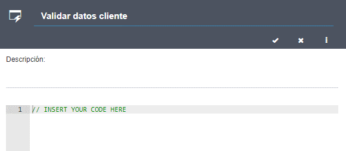](_images/image1601.png)

Figura 576 Propiedades de una validación[](#id179 "Link to this image")

#### Asociación de una validación a un formulario[](#asociacion-de-una-validacion-a-un-formulario "Link to this heading")

Para asociar una validación a un elemento del diseño de un proceso, haz doble clic en el elemento para abrir su formulario de propiedades (el elemento puede ser un evento de inicio, para asociar la validación al formulario de inicio, una tarea de usuario o una tarea de notificación a un usuario). En la pestaña “Dev tools”, marca las validaciones que deseas asociar al elemento seleccionado.

Para asociar una validación al formulario del proceso o al formulario de edición del proceso, abra las propiedades del formulario, haciendo clic con el botón derecho en la plantilla y seleccionando “Formularios del proceso”, “Formulario del proceso” o “Formulario de edición del proceso”. Esto abre la ventana de propiedades del formulario seleccionado. En la sección “Validaciones”, marca las validaciones que deseas asociar al elemento seleccionado.

[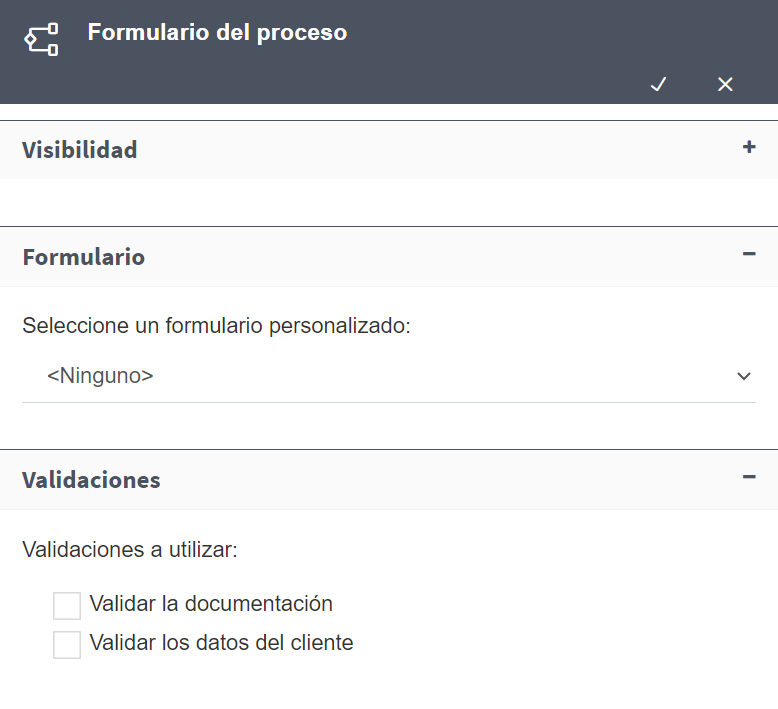](_images/image1614.png)

Figura 577 Selección de validaciones presentes en un formulario[](#id180 "Link to this image")

### Bots[](#bots "Link to this heading")

Un bot es un programa informático que realiza tareas que le son asignadas por procesos, con los cuales se comunica asíncronamente. En general, las tareas que son procesadas por bots son tareas que utilizan muchos recursos de hardware (memoria, procesador), y que por eso deben ser realizadas por un proceso separado de los procesos que ejecutan los servicios de Qflow. Un bot puede incluso funcionar en un servidor diferente al que alberga los servicios de Qflow. Los bots no están pensados para tareas sencillas, que se ejecutan en unos pocos segundos y pueden ejecutarse en actividades de servicio o de código.

La interacción entre un proceso y un bot se da de la siguiente forma:

1.  Un proceso crea una tarea para el bot mediante una tarea de servicio asíncrono. La creación de la tarea consiste en almacenar en una cola la información de la tarea. Esa información incluye los parámetros de la tarea e indicaciones de cuál es el bot que debe ejecutarla. Estas indicaciones son lo que se define en Qflow Design.
    
2.  El bot verifica si tiene tareas pendientes y al hacerlo, encuentra la nueva tarea e intenta procesarla. El bot es un servicio, o al menos un proceso que verifica periódicamente si tiene nuevas tareas en la cola. Para ello, utiliza el web service WebBot, que provee métodos para acceder a la cola y obtener los datos de las tareas pendientes para procesarlas. También le provee métodos para abortar una tarea o indicar que la tarea ya fue completada. Como la funcionalidad de obtener tareas y actualizarlas es provista por un web service, el bot puede estar en un servidor distinto al de los servicios de Qflow.
    

#### Propiedades de un Bot[](#propiedades-de-un-bot "Link to this heading")

El formulario de propiedades de un bot tiene las siguientes secciones:

*   **General:** permite ingresar una descripción y, en la propiedad “Ejecutable por”, el nombre del usuario cuyas credenciales se usarán para ejecutar el bot e invocar el web service WebBot.
    
*   **Parámetros:** permite definir los parámetros del bot. Los parámetros del bot se definen de la misma forma que los parámetros de una integración. Consulte [Integraciones](#integraciones) por instrucciones.
    
*   **Notificación:**
    
    *   **No notificar:** si se selecciona esta opción, Qflow no notificará al bot cuando le asigne un nuevo trabajo. El bot deberá consultar el web service WebBot periódicamente para averiguar si tiene trabajo pendiente.
        
    *   **Notificar a cola de mensajes:** en este caso, Qflow notificará al bot que tiene un nuevo trabajo pendiente mediante una cola de mensajes. El bot, en este caso, no debe consultar periódicamente el web service WebBot, sino que debe suscribirse a una cola de mensajes de MSMQ e implementar un manejador para el evento que se disparará cuando haya un nuevo trabajo. Si selecciona esta opción, debe especificar la ruta de la cola de mensajes que será utilizada.
        

[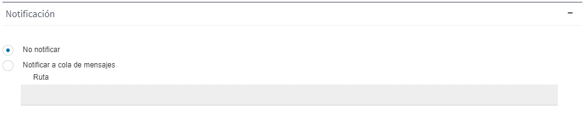](_images/image1621.png)

Figura 578 Sección Notificación de bots[](#id181 "Link to this image")

*   **Vencimiento:** permite definir un plazo para que el bot procese la tarea. Una vez vencido el plazo, si el bot no ha terminado de procesar la tarea, el proceso continuará su ejecución a través del conector de vencimiento de la tarea de servicio asíncrono en el que se le había asignado el trabajo al bot. Si la tarea de servicio asíncrono no tiene definido un paso siguiente a través del conector de vencimiento, quedará en estado de error. Consulte la sección [Configuración de plazos](#configuracion-de-plazos) por instrucciones sobre cómo definir vencimientos.
    

[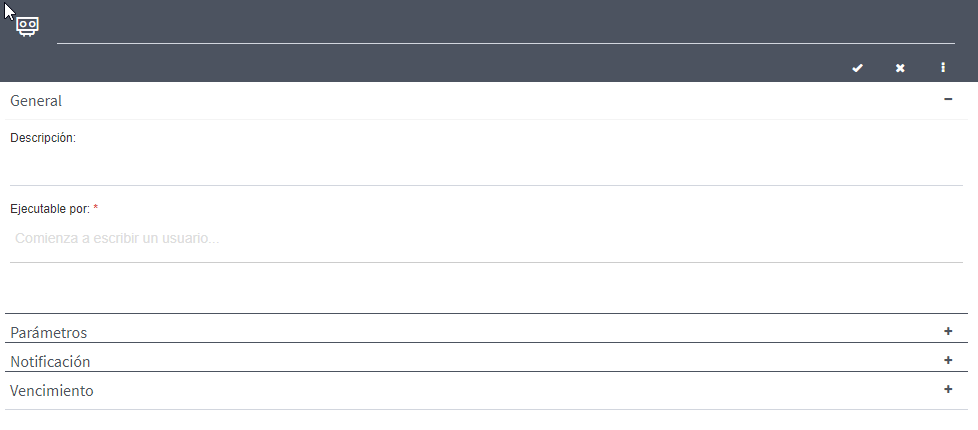](_images/image1631.png)

Figura 579 Propiedades de un Bot[](#id182 "Link to this image")

## Elementos del diseño de un proceso[](#elementos-del-diseno-de-un-proceso "Link to this heading")

Esta sección describe en detalle las propiedades de cada uno de los elementos que pueden ser parte de un diseño. Las primeras secciones son sobre aspectos comunes a varios pasos. Por ejemplo, tanto una tarea de usuario como una tarea de notificación requieren la selección de uno o más destinatarios.

### Propiedades generales[](#propiedades-generales "Link to this heading")

Hay propiedades que son comunes en todos los elementos que se pueden agregar al diseño de un proceso: el nombre del elemento y su descripción.

El nombre aparece siempre en la parte superior del formulario de propiedades de un elemento, junto a los botones de aceptar, cancelar y expandir o contraer formulario. La descripción aparece en la sección “Documentación” del formulario de propiedades.

### Configuración de plazos[](#configuracion-de-plazos "Link to this heading")

En algunos elementos del diseño, como tareas de usuario o eventos de temporización, es posible configurar plazos. Las tareas permiten gestionar plazos con acciones como alertas, recordatorios y delegaciones para minimizar atrasos, mientras que los eventos de temporización pausan el proceso hasta cumplir el plazo. Los formularios de estos elementos incluyen una sección con las siguientes propiedades:

*   **Información de temporizador:** en esta propiedad se especifica el vencimiento, que se puede definir de cuatro formas:
    
    *   **Fecha fija:** permite especificar una fecha.
        
    *   **Fecha variable:** permite utilizar el valor de un dato de aplicación de tipo Fecha o FechaHora. Qflow ejecutará la acción en la fecha indicada por el valor del dato de aplicación. Para poder elegir esta opción, debes tener definido un dato de tipo Fecha o FechaHora.
        
    *   **Tiempo fijo:** permite indicar un intervalo de tiempo en segundos, minutos, horas o días. Qflow ejecutará la acción una vez transcurrido ese intervalo, a partir del momento en el que el proceso fue iniciado. Los días y horas no laborables no cuentan a efectos de realizar el cálculo, excepto que se use un calendario.
        
    *   **Tiempo variable:** esta opción es similar a la anterior, pero permite utilizar el valor de un dato de aplicación de tipo Número para indicar el valor del intervalo. Este valor puede ser interpretado como expresado en segundos, minutos, horas o días. Para poder elegir esta opción, debes tener definido un dato de tipo Número. Los días y horas no laborables no cuentan a efectos de realizar el cálculo, excepto que se use un calendario.
        

[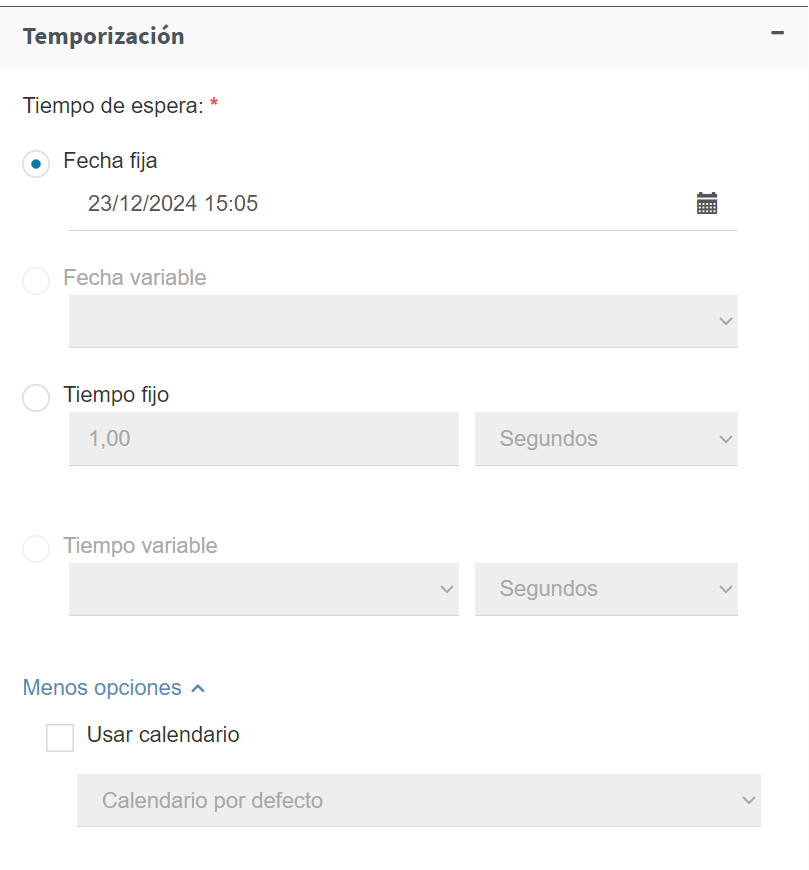](_images/image1651.png)

Figura 580 Plazos[](#id183 "Link to this image")

### Visibilidad de datos, roles, adjuntos y comentarios[](#visibilidad-de-datos-roles-adjuntos-y-comentarios "Link to this heading")

Qflow permite configurar qué datos, roles y adjuntos pueden ver o modificar los usuarios durante un proceso y dónde pueden hacerlo. Los comentarios también se pueden gestionar, permitiendo agregarlos o visualizar los existentes.

Los usuarios interactúan con los procesos a través de los formularios:

*   **Formulario de inicio del proceso:** es el formulario que aparece al iniciar el proceso y está relacionado con el evento de inicio.
    
*   **Formularios de respuesta del proceso:** son los formularios que los usuarios utilizan para responder a las tareas de los procesos. Están asociados a tareas de usuario.
    
*   **Formulario del proceso:** es el formulario que aparece cuando alguien hace clic sobre un proceso para examinar su información. Está asociado al proceso y no permite modificar los datos.
    
*   **Formulario de edición del proceso:** es un formulario similar al formulario del proceso, pero que permite modificar datos.
    

Para definir el nivel de acceso a la información del proceso, hay que definirlo para cada uno de estos formularios y en el caso de los formularios de respuesta, para cada una de las tareas de usuario. No es necesario definir el acceso a la información en aquellos formularios donde no se desee que estén disponibles datos, roles, archivos adjuntos o comentarios, puesto que, por defecto, éstos no están presentes en el formulario de respuesta.

El formulario de inicio del proceso está asociado al evento de inicio, puesto que aparece cuando se está iniciando el proceso. Para modificar el nivel de acceso a la información del proceso durante su inicio, abre el formulario de propiedades del evento de inicio y busca la pestaña “Visibilidad”. Allí podrás especificar qué datos y roles están presentes y se muestran en el formulario, y cuáles pueden ser modificados por el usuario. También están las opciones de visibilidad de adjuntos y comentarios. Más adelante se explican estas opciones en detalle.

El caso de los formularios de respuesta es similar. Los formularios de respuesta de Qflow están asociados a las tareas de usuario, puesto que aparecen cuando un usuario desea responder a una tarea asignada a él. Para modificar la visibilidad en una tarea de usuario, se procede de la misma forma que con un evento de inicio.

Para modificar el nivel de acceso en el formulario del proceso, accede a la ventana de propiedades del formulario del proceso haciendo clic con el botón derecho en la plantilla y seleccionando la opción “Formularios del proceso”, “Formulario del proceso”. Esa ventana tiene una sección “Visibilidad”. Haz lo mismo para modificar la visibilidad en el formulario de edición del proceso, pero seleccionando “Formularios del proceso”, “Formulario de edición del proceso”.

#### Visibilidad de datos y roles.[](#visibilidad-de-datos-y-roles "Link to this heading")

La visibilidad de datos y roles se configura de la misma manera. Esta sección explica cómo configurar la visibilidad de datos, pero las mismas instrucciones aplican para los roles. La visibilidad de los datos de aplicación se modifica mediante una tabla ([Figura 581](#datascope)) que muestra la lista de datos de aplicación. Si se tienen dos datos con el mismo nombre y una visibilidad diferente de “Ausente”, se mostrará un error al guardar.

[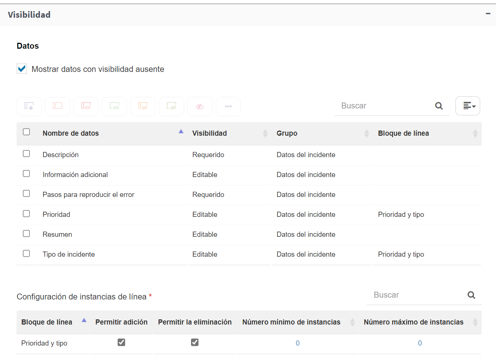](_images/image1661.png)

Figura 581 Visibilidad de datos[](#id184 "Link to this image")

Para modificar la visibilidad de un dato, selecciónalo y haz clic en uno de los botones que aparecen arriba de la tabla (la [Figura 582](#scopebuttonsandmeanings) muestra qué botón corresponde a qué visibilidad; para verlo en la propia pantalla del sitio, posiciona el cursor del ratón sobre el botón). Se pueden seleccionar varios datos simultáneamente. Las opciones son:

[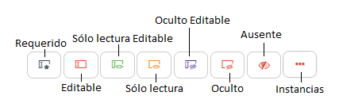](_images/image1671.png)

Figura 582 Botones de visibilidad con sus significados[](#id185 "Link to this image")

*   **Requerido:** el usuario puede ver y modificar el valor del dato, y además, si el dato no tiene un valor, está obligado a ingresar uno.
    
*   **Editable:** el usuario puede ver y modificar el valor del dato.
    
*   **Sólo lectura Editable:** el usuario puede ver el valor del dato, pero no puede modificarlo. Scripts de la página sí pueden modificar el dato, y estos cambios se guardan.
    
*   **Sólo lectura:** el usuario puede ver el valor del dato, pero no puede modificarlo. Si un script modifica el dato en la pantalla, los cambios no se guardan.
    
*   **Oculto Editable:** el usuario no puede ver el valor del dato, pero el dato está presente en el formulario, aunque invisible y si un script lo modifica, el cambio se guarda.
    
*   **Oculto:** el usuario no puede ver el valor del dato. Si un script modifica el valor del dato, los cambios no se guardan.
    
*   **Ausente:** el dato no está en el formulario. No se muestra ni puede ser accedido por un script. Es como si no existiera.
    

Si un dato acepta múltiples valores y tiene una visibilidad que permite su edición (requerido, editable, sólo lectura editable u oculto editable), se habilita el último botón (“Instancias”, ver [Figura 582](#scopebuttonsandmeanings)), que permite modificar propiedades de la visibilidad específicas de esos datos ([Figura 583](#additionalscopeoptions)):

*   **Permitir la adición:** especifica si está permitido agregar nuevas instancias al dato o nuevas líneas al bloque de líneas, si el dato pertenece a uno.
    
*   **Permitir la eliminación:** especifica si está permitido eliminar instancias del dato o líneas del bloque, si el dato pertenece a uno.
    
*   **Número máximo de instancias:** especifica la cantidad máxima de instancias que puede tener un dato o la cantidad máxima de líneas del bloque si el dato pertenece a uno. Si el dato tiene esa cantidad de instancias, no se permite agregar ninguna más, aunque se permita la adición.
    
*   **Número mínimo de instancias:** especifica la cantidad mínima de instancias que puede tener un dato o la cantidad mínima de líneas del bloque si el dato pertenece a uno. Si el dato tiene esa cantidad de instancias, no se permite eliminar ninguna más, aunque se permita la eliminación.
    

Si un dato pertenece a un bloque de líneas, las propiedades del la visibilidad que se editen, aplicarán a todo el bloque de líneas. Por lo tanto, estas propiedades pueden ser modificadas también a través de una grilla, que aparece en la parte inferior de la pantalla. Esta grilla aparece cuando, al menos uno de los datos que pertenece al bloque, tiene una visibilidad que permite su edición ([Figura 581](#datascope), donde dice “Configuración de instancias de línea”; en la figura, hay un bloque que se llama “Comentarios”). Para modificar el número máximo o mínimo de instancias, haz clic en el número e ingresa el valor deseado.

[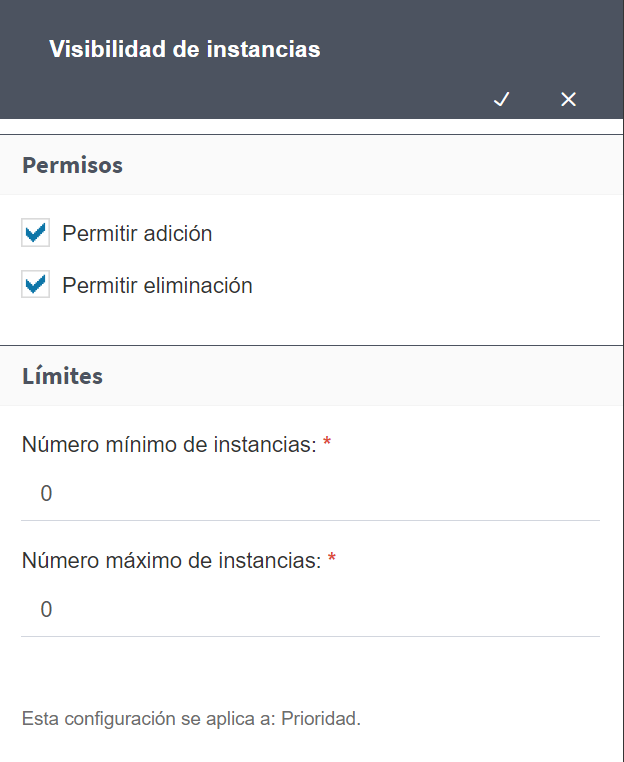](_images/image1681.png)

Figura 583 Opciones adicionales de visibilidad para datos que aceptan múltiples valores[](#id186 "Link to this image")

##### Ordenamiento de grupos[](#ordenamiento-de-grupos "Link to this heading")

En aquellos elementos que hacen uso de un formulario (evento de inicio, tareas de usuario y la configuración de formularios del proceso), la visibilidad de datos tiene una posibilidad adicional, que es el ordenamiento de los grupos de los datos. Debajo de la sección de instancias encontrará un checkbox que, al seleccionarlo, le mostrará los grupos correspondientes a los datos que tengan una visibilidad tal que se muestren en el formulario (Editable, Requerido, Sólo Lectura, o Sólo Lectura Editable).

[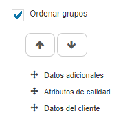](_images/image1691.png)

Figura 584 Ordenamiento de grupos[](#id187 "Link to this image")

Puedes seleccionar el grupo que deseas mover y luego hacer clic en las flechas para moverlo hacia arriba o hacia abajo. También puedes arrastrar los grupos para ordenarlos. Este orden de grupos se verá reflejado en el formulario. Aquellos datos que no tengan grupo quedarán dentro del grupo de “Datos de aplicación”, el cual no es ordenable.

[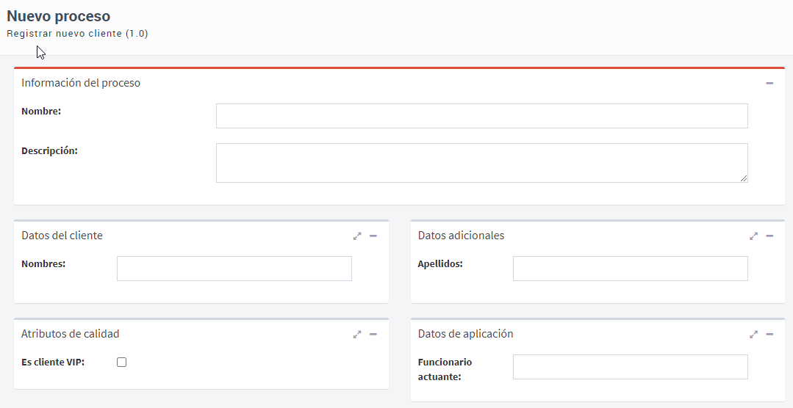](_images/image1701.png)

Figura 585 Grupos ordenados[](#id188 "Link to this image")

#### Visibilidad de adjuntos[](#visibilidad-de-adjuntos "Link to this heading")

Las opciones de visibilidad de adjuntos son las siguientes:

*   **Accesibilidad:** esta propiedad indica el nivel de acceso que los usuarios tendrán a los archivos adjuntos. Las opciones posibles son:
    
    *   **Ninguno**: Qflow no muestra los archivos adjuntos en el formulario.
        
    *   **Sólo listar:** Qflow muestra los archivos adjuntos, pero no permite abrirlos ni modificarlos.
        
    *   **Sólo lectura:** Qflow muestra los archivos adjuntos y permite abrirlos.
        
    *   **Editor:** Qflow muestra los archivos adjuntos, permite abrirlos y modificarlos.
        
    *   **Total:** Qflow muestra los archivos adjuntos, permite abrirlos, modificarlos y borrarlos.
        
*   **Permitir adición:** si esta opción está marcada, los usuarios podrán agregar archivos adjuntos en el formulario.
    

[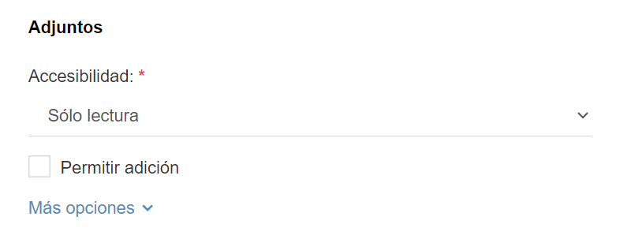](_images/image1714.png)

Figura 586 Visibilidad de adjuntos[](#id189 "Link to this image")

Es posible realizar configuraciones avanzadas expandiendo la sección «Más opciones», donde se pueden ajustar los siguientes parámetros:

*   **Límites:**
    
    *   **Número máximo de archivos adjuntos:** indica el número máximo de archivos adjuntos que puede tener el paso. Qflow no permitirá agregar adjuntos por encima de este valor, a menos que éste sea 0, que significa que no hay un máximo.
        
    *   **Número mínimo de archivos adjuntos:** indica el número mínimo de archivos adjuntos que puede tener el paso. Qflow no permitirá borrar archivos adjuntos cuando hacerlo implique que la cantidad de adjuntos pase a ser inferior a este valor.
        
*   **Tamaño máximo de adjunto (KB):** permite especificar el tamaño máximo, en kilobytes, que pueden tener los adjuntos (la opción por defecto, 0, significa que no hay límite). Si se especifica un valor, Qflow no permitirá adjuntar archivos con tamaño mayor al especificado.
    
*   **Mostrar solo:** hace que Qflow muestre sólo los archivos que cumplan con alguna de las expresiones regulares ingresadas en esta propiedad. (\*)
    
*   **Editar solo:** hace que Qflow permita editar solamente los archivos que cumplan con alguna de las expresiones regulares ingresadas en esta propiedad. (\*)
    
*   **Agregar solo:** hace que Qflow permita agregar solamente adjuntos que cumplan con alguna de las expresiones regulares ingresadas en esta propiedad. (\*)
    
*   **Eliminar solo:** hace que Qflow permita eliminar solamente adjuntos que cumplan con alguna de las expresiones regulares ingresadas en esta propiedad. (\*)
    
    (\*) Ver [Expresiones regulares de los filtros de los adjuntos](#expresiones-regulares-de-los-filtros-de-los-adjuntos), para mas información.
    

Figura 587 Visibilidad de adjuntos (más opciones)[](#id190 "Link to this image")

##### Expresiones regulares de los filtros de los adjuntos[](#expresiones-regulares-de-los-filtros-de-los-adjuntos "Link to this heading")

Los filtros de los adjuntos se especifican mediante expresiones regulares similares a las que utiliza Windows para su sistema de archivos, en las que el asterisco (“\*”) sustituye cualquier cantidad de caracteres. Ejemplo: la expresión “\*.zip” significa “todos los archivos con la extensión zip”.

Un filtro puede usar varias expresiones separadas por “;” o por “|”. Por ejemplo, si el filtro “Mostrar solo” tiene la expresión “\*.zip;\*.rar;Licencia.pdf”, Qflow mostrará solamente los archivos con extensiones “zip”, “rar” y el archivo llamado “Licencia.pdf”.

El caracter “?” sustituye una ocurrencia de cualquier caracter. Ejemplos: la expresión “\*.???” representa cualquier archivo que tenga una extensión de tres caracteres; la expresión “documento?.doc” representa cualquier archivo cuyo nombre empiece con “documento” y tenga un caracter adicional antes de la extensión (“documento1.doc”, por ejemplo, pero no “documento12.doc” ni “documento.doc”).

El caracter “!” permite negar una expresión. Sólo se puede utilizar al principio del filtro. Por ejemplo, si en el filtro “Mostrar solo” se escribe la expresión “!\*.exe;\*.bat”, Qflow mostrará solamente los archivos que no tengan extensiones “bat” ni “exe”.

#### Visibilidad de comentarios[](#visibilidad-de-comentarios "Link to this heading")

Los formularios de Qflow tienen la opción de agregar comentarios al completarlos (en el caso de aquellos que no son de tipo sólo lectura) y ver los comentarios existentes. Esto les permite a los usuarios dar y obtener información extra sobre el proceso, que se considere importante pero que no sea parte de los datos de éste. Las opciones de visibilidad de estos comentarios son las siguientes:

*   **Permitir adición:** el usuario puede agregar un comentario al formulario si lo desea.
    
*   **Requerido:** el usuario está obligado a ingresar un comentario; si no lo hace, no podrá completar el formulario. Sólo se puede seleccionar esta opción si ya se ha elegido “Permitir adición”.
    

[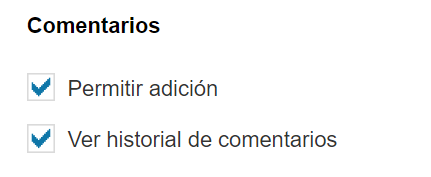](_images/image1721.png)

Figura 588 Visibilidad de comentarios[](#id191 "Link to this image")

Si se permite ver y agregar comentarios, al responder una tarea, por ejemplo, se ve el formulario como en la [Figura 589](#formwithcomments).

[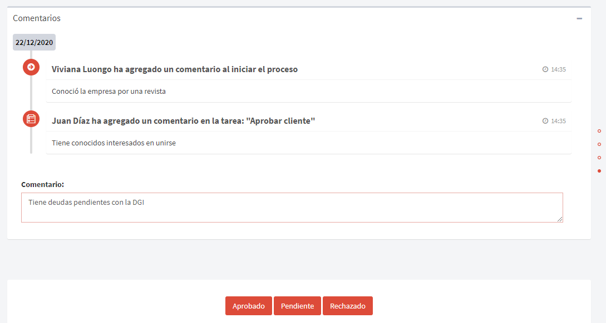](_images/image1731.png)

Figura 589 Formulario con comentarios[](#id192 "Link to this image")

La configuración de comentarios difiere para las tareas de usuario, en las cuales tenemos la capacidad de elegir si se requieren comentarios según la respuesta elegida por el usuario, así como también la opción de agregar la respuesta a la bitácora de comentarios. Para más información, ve la sección de [Tarea de usuario](#tarea-de-usuario).

### Etiquetas[](#etiquetas "Link to this heading")

Muchas propiedades de los pasos de Qflow permiten utilizar etiquetas. Esto significa que los valores de estas propiedades no tienen que ser determinados durante el diseño de un proceso, sino que Qflow los puede obtener de donde se le indique cuando los necesite utilizar. Por ejemplo, es común incluir en los asuntos de las tareas de usuarios el valor de algún dato de aplicación (como el número de documento de un cliente o su nombre). En este caso, en lugar de que la tarea diga algo así como “Atender la solicitud del cliente”, puede decir “Atender la solicitud del cliente Juan Pérez, CI 11111111”.

Las propiedades para las cuales se puede usar etiquetas tienen un ícono con una etiqueta al lado ([Figura 590](#propertiestags)). Si haces clic en este ícono, aparece una lista con los ítems que se pueden seleccionar para la etiqueta. Si, al ver esta lista escribes, la lista se reducirá a los elementos que contengan el texto que hayas ingresado. También puedes optar por mostrar en la lista solamente ítems de algún tipo específico (sólo datos de aplicación, por ejemplo). Para ello, haz clic en el ícono correspondiente en la parte inferior de la lista ([Figura 590](#propertiestags), abajo, donde dice “Datos”, “Roles”, etc).

También se puede ingresar una etiqueta sin hacer clic en el ícono de la etiqueta, simplemente ingresando el símbolo “#” en la propiedad: esto también hace aparecer la lista de ítems que se pueden usar para la etiqueta.

Los tipos de ítem que se pueden utilizar en etiquetas son:

*   **Datos de aplicación:** se usa el valor del dato.
    
*   **Roles de plantilla de proceso:** se usa el nombre del usuario que desempeña el rol.
    
*   **Parámetros de aplicación de tipo texto:** se usa el valor del parámetro.
    
*   **Información del proceso:** por ejemplo, el nombre del proceso, o su fecha de inicio.
    
*   **Otros:** por ejemplo, la fecha actual.
    

[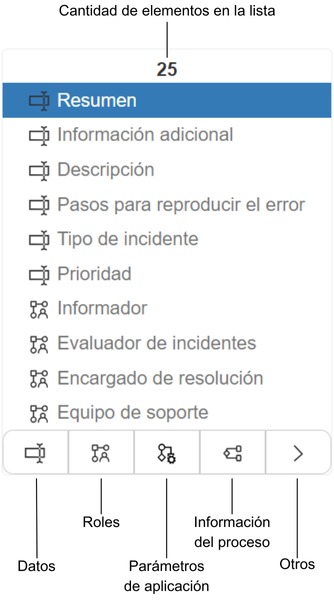](_images/image1741.png)

Figura 590 Etiquetas[](#id193 "Link to this image")

### Tipos de paso[](#tipos-de-paso "Link to this heading")

En general, los pasos se dividen en tres tipos: eventos, actividades y compuertas. Un evento representa algo que ocurre en el proceso y hay tres tipos: de inicio, intermedio y de fin. Una actividad representa una unidad de trabajo a realizar en el proceso y puede ser una tarea, un proceso automático o un subproceso.

#### Eventos de inicio[](#eventos-de-inicio "Link to this heading")

[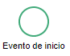](_images/image2021.png)

Figura 591 Evento de inicio[](#id194 "Link to this image")

El evento de inicio marca el comienzo de un proceso y define el punto en el que un usuario lo inicia. Por ejemplo, para utilizar un formulario personalizado como formulario de inicio, este se asocia al evento de inicio. Al iniciarse el proceso, su ejecución comienza en este evento, que debe ser único

El formulario de propiedades de un evento de inicio tiene las siguientes pestañas:

##### General[](#id10 "Link to this heading")

Se pueden especificar de antemano los nombres y las descripciones de los procesos, usando etiquetas, de modo que no sea necesario que el usuario los ingrese al iniciar un proceso.

*   **Nombre autogenerado:** un texto con etiquetas para indicar cómo se deben formar los nombres de los procesos.
    
*   **Descripción autogenerada:** un texto con etiquetas para indicar cómo se debesn formar las descripciones de los procesos.
    

[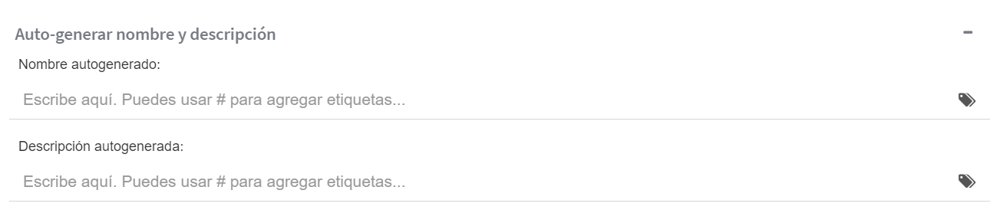](_images/image2031.png)

Figura 592 Sección de auto-generación de nombre y descripción del proceso.[](#id195 "Link to this image")

Tambien podemos compartir un enlace a personas externas a la organización para que puedan iniciar este proceso sin necesidad de contar con un usuario en el sistema.

*   **Permitir que personas ajenas a la organización inicien procesos con esta versión de la plantilla:** si esta opción está marcada, se habilita el inicio del proceso por parte de personas ajenas a la organización. Al habilitar esta opción, se muestra el resto de las opciones de la funcionalidad.
    
*   **Enlace público:** muestra y permite copiar el enlace que deberá ser compartido con usuarios externos para el inicio del proceso.
    
*   **Código embebido:** muestra y permite copiar un segmento de código HTML que permite embeber el formulario de inicio de este proceso en cualquier sitio web.
    

[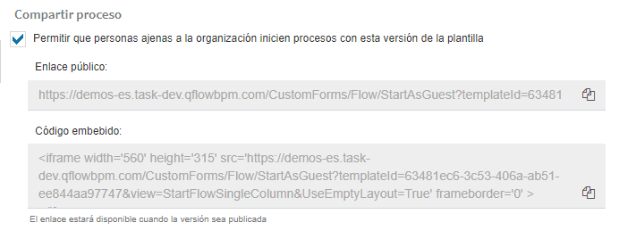](_images/externalStartConfiguration.png)

Figura 593 Configuración de inicio de proceso por usuarios externos o anónimos[](#id196 "Link to this image")

Dentro de las opciones avanzadas, es posible configurar un mensaje de confirmación que será visible para los usuarios, tanto externos como del sistema, al iniciar el proceso. Este mensaje puede personalizarse utilizando etiquetas para incorporar datos dinámicos. Además, se puede definir la etapa que se iniciará al ejecutar este paso y establecer la bandera del proceso.

Figura 594 Mensaje de confirmación al usuario[](#id197 "Link to this image")

##### Formulario[](#formulario "Link to this heading")

En esta pestaña podemos configurar la [Visibilidad de datos, roles, adjuntos y comentarios](15-QflowDesign.md#visibilidad-de-datos-roles-adjuntos-y-comentarios).

##### Dev tools[](#dev-tools "Link to this heading")

En esta pestaña podemos elegir validaciones, de entre las existentes, para que se ejecuten en el formulario de inicio (ver [Asociación de una validación a un formulario](#asociacion-de-una-validacion-a-un-formulario)).

#### Eventos de fin[](#eventos-de-fin "Link to this heading")

Los eventos de fin que Qflow implementa son en Evento de fin simple, que llamaremos Evento de fin ([Figura 595](#endevent)), y el Evento de fin terminal ([Figura 596](#terminalendevent)).

[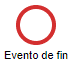](_images/image2041.png)

Figura 595 Evento de fin[](#id198 "Link to this image")

Figura 596 Evento de fin terminal[](#id199 "Link to this image")

Los eventos de fin y fin terminal finalizan la ejecución de los procesos. Un evento de fin terminal termina la ejecución del proceso aun cuando todavía haya hilos en ejecución. En ese caso, Qflow finaliza esos hilos y el proceso termina su ejecución. Un evento de fin, por el contrario, espera que todos los hilos terminen y una vez terminados, finaliza el proceso.

El formulario de propiedades de estos eventos permite configurar tanto el progreso del proceso como su bandera.

[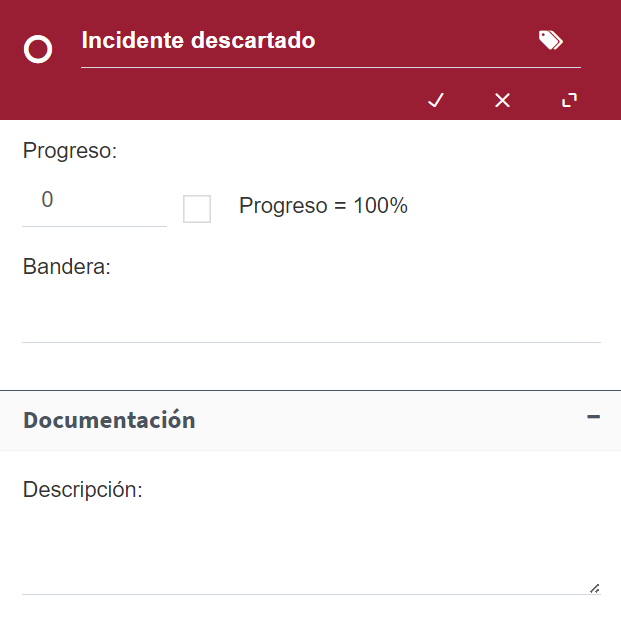](_images/image2061.png)

Figura 597 Propiedades de un evento de fin[](#id200 "Link to this image")

#### Tarea de usuario[](#tarea-de-usuario "Link to this heading")

[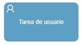](_images/image1961.png)

Figura 598 Tarea de usuario[](#id201 "Link to this image")

Una tarea de usuario asigna una tarea a un usuario o grupo de usuarios, y los destinatarios se definen mediante roles de plantilla de proceso. Cuando un usuario accede al formulario de una tarea en Qflow Task, debe seleccionar una opción de una lista para actualizar el estado de la tarea.

##### General[](#id11 "Link to this heading")

*   **Asunto del mensaje:** el texto del asunto del mensaje que se enviará o mostrará a los destinatarios. Si la tarea está configurada para enviar notificaciones, se usa en el asunto del mensaje de correo electrónico que se envía a los destinatarios. Se puede especificar mediante una etiqueta (ver [Etiquetas](#etiquetas)).
    
*   **Destinatarios:** lista de los destinatarios de la tarea. Los destinatarios son roles de plantilla de proceso. Para especificar un destinatario, comienza a escribir su nombre y selecciónalo cuando aparezca como opción. Además en esta sección podemos configurar si la tarea puede ser respondida por usuarios externos o no. Para más información, ver [Respuesta de tarea externa](#respuesta-de-tarea-externa).
    
    Expandiendo la sección «Más opciones» puedes configurar:
    
    *   **Enviar notificaciones:** permite definir si se desea que el paso envíe notificaciones por correo electrónico a sus destinatarios. Si la opción está desmarcada, Qflow no enviará mensajes de correo electrónico para notificar a sus destinatarios que tienen una tarea pendiente.
        
    *   **Encargado de la tarea:** permite especificar un rol, que será el encargado de la tarea. El encargado puede responder por cualquiera de los destinatarios. También puede delegar la tarea y enviar alertas.
        
    *   **Destinatario alternativo:** permite especificar un rol, de modo que, si el destinatario original de la tarea no puede completarla, sea posible elegir a los miembros de ese rol como destinatarios al delegarla.
        
*   **Respuestas:** una tabla que contiene las respuestas que estarán disponibles para quienes desempeñen las tareas. Los botones permiten agregar o quitar respuestas, además de reordenarlas mediante las flechas. Cada respuesta tiene las siguientes propiedades, que se modifican en la propia tabla donde se muestran:
    
    *   **Texto:** texto de la respuesta. Es lo que se le muestra al usuario. Cuando se agrega una respuesta, el texto queda con un texto predeterminado. Para modificarlo, haz clic en ese texto.
        
    *   **Clave:** un texto que identifica la respuesta, pero que no se muestra al usuario. La clave se usa en evaluaciones de condiciones que la utilizan. La clave se modifica de la misma forma que el texto, haciendo clic sobre ella.
        
    *   **Comentario requerido:** si se configura en “Sí”, indica que la respuesta de la tarea debes tener comentario.
        
    *   **Tipo:** indica el tipo de respuesta, que puede ser no final, final o final terminal. Cuando un usuario elige una respuesta final, da su tarea por terminada y ya no puede seguir trabajando en ella. Cuando elige una respuesta que no es final, se guardan los cambios que hizo en los datos, pero su tarea sigue pendiente. Como una tarea puede estar asignada a varios destinatarios, el hecho de que un destinatario seleccione una respuesta final no significa necesariamente que el proceso vaya a continuar su ejecución, porque otros destinatarios pueden no haber dado por terminadas sus partes de la tarea. En este caso, los criterios de respuestas múltiples (ver más abajo) definen bajo qué condiciones el proceso dará toda la tarea por terminada y continuará su ejecución. Esto no aplica para cuando el usuario selecciona una respuesta final terminal; en este caso, la tarea finalizará aunque los otros destinatarios no hayan contestado aún, sin importar los criterios de respuestas múltiples.
        
*   **Permitir respuesta rápida:** si la opción está marcada, permite que esta tarea se pueda responder desde la vista de «Mis tareas» en Qflow Task, además de poder ser respondida junto con otras tareas que compartan las mismas respuestas y permite la respuesta desde el mail de notificación de la tarea. Esta opción está disponible solamente para aquellas tareas que no tengan elementos requeridos en su visibilidad (de datos, roles o adjuntos). Para mas información sobre el uso de la funcionalidad, consulta el manual de Qflow Task.
    
*   **Agregar respuesta a comentarios:** permite que las respuestas sean agregadas a la bitácora de comentarios de Qflow Task.
    
    Expandiendo la sección «Más opciones» puedes configurar:
    
    *   **Mensaje de confirmación al usuario:** permite escribir un mensaje que se mostrará a los usuarios (tanto de sistema como externos) al responder la tarea. Permite ser decorado con etiquetas en su contenido.
        
    *   **Criterio de respuesta múltiple:** permite especificar cuándo el proceso debes continuar, cuando tiene más de un destinatario. Las opciones son:
        
        *   **Algún usuario haya respondido:** cuando un usuario seleccione una respuesta final, el proceso finalizará la tarea y continuará su ejecución.
            
        *   **Todos los usuarios hayan respondido:** el proceso continuará su ejecución solamente cuando todos los destinatarios hayan seleccionado una respuesta final.
            
        *   **Por lo menos “X” usuarios hayan respondido:** cuando una cantidad (X) de usuarios haya respondido, el proceso continuará su ejecución. Si se selecciona esta opción, se habilita el campo “Cantidad/Porcentaje” para especificar la cantidad (X).
            
        *   **Por lo menos un porcentaje “X” de usuarios haya respondido:** similar a la opción anterior, pero se indica un porcentaje de usuarios en lugar de una cantidad absoluta.
            
    *   **Modo de presentación de la respuesta:** permite configurar cómo se muestran las respuestas de la tarea en un formulario estándar en Qflow Task.
        

##### Formulario[](#id12 "Link to this heading")

Permite especificar el acceso a datos, roles y adjuntos (ver [Visibilidad de datos, roles, adjuntos y comentarios](15-QflowDesign.md#visibilidad-de-datos-roles-adjuntos-y-comentarios)).

##### Plazos[](#plazos "Link to this heading")

Los plazos sirven para prevenir o mitigar atrasos en las tareas mediante alertas, recordatorios, delegaciones y vencimientos. Las alertas y recordatorios son notificaciones que se envían cuando vence un plazo. Las delegaciones consisten en reasignar tareas y los vencimientos permiten que el proceso tome un camino alternativo al que hubiese seguido si no se hubiese vencido un plazo.

La pestaña de plazos muestra una tabla con los plazos que se hayan definido. Ésta tiene tres botones para agregar, modificar y eliminar controles de tiempo ([Figura 599](#timecontrolstable)).

[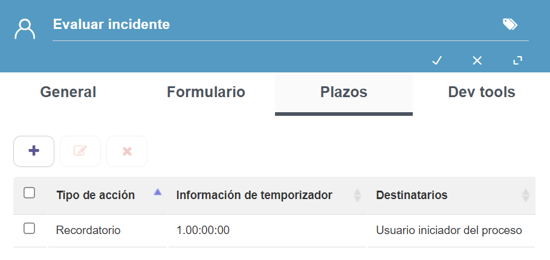](_images/image1991.png)

Figura 599 Plazos[](#id202 "Link to this image")

Al editar un plazo, se muestra un formulario como el de la [Figura 600](#timecontrol).

[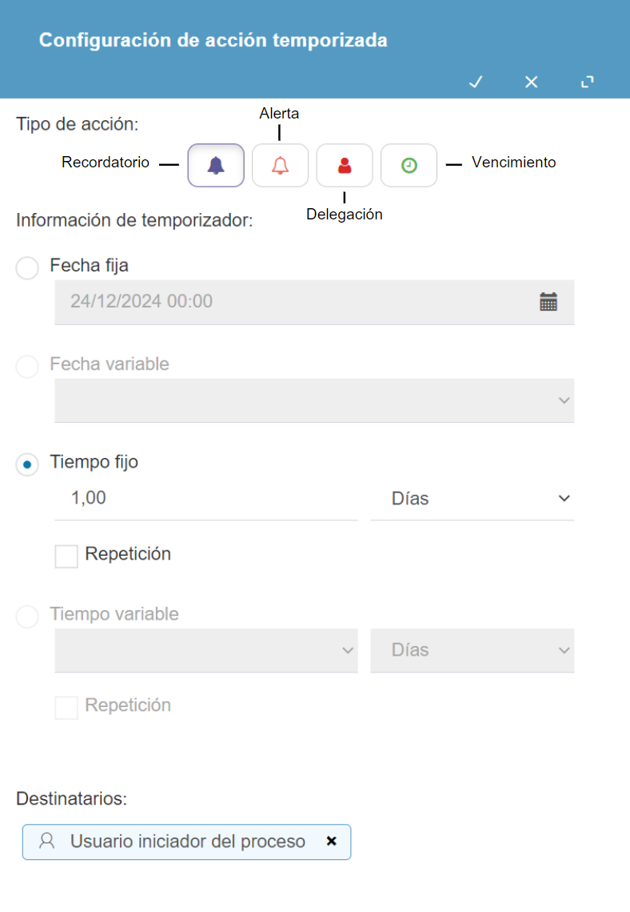](_images/image2001.png)

Figura 600 Plazos[](#id203 "Link to this image")

Este formulario tiene las siguientes propiedades:

*   **Tipo de acción:** se muestran varios botones. Cada uno corresponde a una clase de acción. Se marca una de las clases haciendo clic en ella. Las clases posibles son:
    
    *   **Recordatorio:** Qflow envía una notificación con un recordatorio para el destinatario seleccionado.
        
    *   **Alerta:** Qflow envía una notificación con una alerta para el destinatario seleccionado.
        
    *   **Delegación:** Qflow reasigna la tarea, dándosela al destinatario seleccionado.
        
    *   **Vencimiento:** Qflow interrumpe la espera, abandonando la ejecución del paso y continuando con la ejecución del proceso por medio del evento de borde temporizador, para más detalles sobre cómo agregar los eventos de borde ver [Agregar eventos de borde](#agregar-eventos-de-borde).
        
*   **Información de tiempo:** estas propiedades definen el plazo del vencimiento que disparará la acción especificada más arriba. Por instrucciones, ver [Configuración de plazos](#configuracion-de-plazos).
    
*   **Destinatarios:** seleccione aquí los destinatarios de la acción. Para alertas y recordatorios, los destinatarios son quienes recibirán las notificaciones. Para delegaciones, son a quienes se les reasignará la tarea. Los vencimientos no tienen destinatarios. Para agregar un destinatario, empieza a escribir el nombre de un rol de que esté disponible en la plantilla que está utilizando, y cuando lo veas en la lista que aparece, selecciónalo.
    

##### Dev tools[](#id13 "Link to this heading")

Permite configurar los manejadores de eventos (ver [Asociar un manejador a un evento de una tarea](#asociar-un-manejador-a-un-evento-de-una-tarea)) y validaciones (ver [Asociación de una validación a un formulario](#asociacion-de-una-validacion-a-un-formulario)).

### Respuesta de tarea externa[](#respuesta-de-tarea-externa "Link to this heading")

Las tareas de usuario pueden ser configuradas para ser respondidas por usuarios externos a Qflow, lo cual se indica en la sección «Participantes» en el panel de configuración de la tarea.

[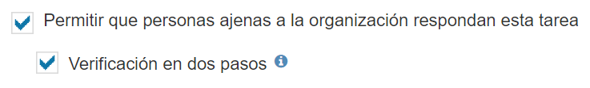](_images/externalTaskResponseCheck.png)

Figura 601 Configuración de respuesta de tarea externa[](#id204 "Link to this image")

Si se marca esta opción, la tarea permitirá añadir destinatarios que no son roles de plantilla, en forma de direcciones de correos electrónicos.

Cuando se ejecute la tarea, un correo con un enlace llegará a las direcciones marcadas como destinatarios que permiten acceder al formulario de la tarea para responder. Aquellas personas con el enlace podrán ingresar al formulario de la tarea sin necesitar un usuario de Qflow para ingresar. El enlace y formulario serán válidos mientras la tarea siga disponible.

En esta sección, también es posible configurar si la tarea requiere verificación en dos pasos. Al habilitar esta opción, los usuarios externos deberán ingresar un código de verificación al acceder al formulario de la tarea. Este código se puede solicitar directamente desde el formulario y será enviado a la dirección de correo utilizada para acceder al mismo. Esto garantiza que el usuario que responde la tarea sea el mismo que recibió el enlace.

Podremos agregar destinatarios externos en la forma de datos y parámetros de sistema de tipo texto, o directamente escribiendo direcciones de correo en el campo «Destinatarios» de la tarea.

[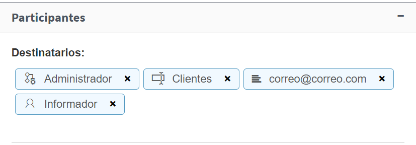](_images/externalTaskResponseAddressees.png)

Figura 602 Roles, datos, parámetros y correos como destinatarios de tarea[](#id205 "Link to this image")

Tenga en cuenta que agregar destinatarios externos no prohibe usar roles como destinatarios, de manera que es posible tener una misma tarea que se despache tanto a usuarios de sistema como a usuarios externos. Los historiales de la tarea reflejan las acciones de los usuarios externos identificados por la dirección del correo a la cual se envió en enlace.

Si hay un rol definido como «Encargado de la tarea», este tendrá permiso sobre las tareas despachadas a destinatarios externos.

#### Tarea de notificación a usuario[](#tarea-de-notificacion-a-usuario "Link to this heading")

Figura 603 Tarea de notificación a usuario[](#id206 "Link to this image")

Una tarea de notificación envía una notificación a usuarios de Qflow. Los usuarios suelen recibir las notificaciones por correo electrónico, pero también las pueden ver en Qflow Task. En eso una tarea de notificación es similar a una tarea de usuario. La diferencia es que no requiere acción de su destinatario, que se limita a acceder al formulario que le presenta la información. Este formulario puede ser, como en el caso de otros pasos que utilizan formularios, personalizado.

El formulario de propiedades de una tarea de notificación de usuario tiene las siguientes pestañas:

*   **General:** permite especificar el asunto del correo electrónico que recibirán los destinatarios configurados en la sección «Participantes».
    
*   **Formulario:** permite definir qué datos de la aplicación, roles, adjuntos y comentarios serán visibles en el formulario. (ver [Visibilidad de datos, roles, adjuntos y comentarios](15-QflowDesign.md#visibilidad-de-datos-roles-adjuntos-y-comentarios)). Ademas de un texto de ayuda para los usuarios. Cuando vean la notificación en Qflow Task, podrán ver el texto de ayuda al hacer clic en el ícono de ayuda (“?”). El texto puede contener código HTML.
    
*   **Dev tools:** permite asociar validaciones a la tarea. Ver [Asociación de una validación a un formulario](#asociacion-de-una-validacion-a-un-formulario).
    

[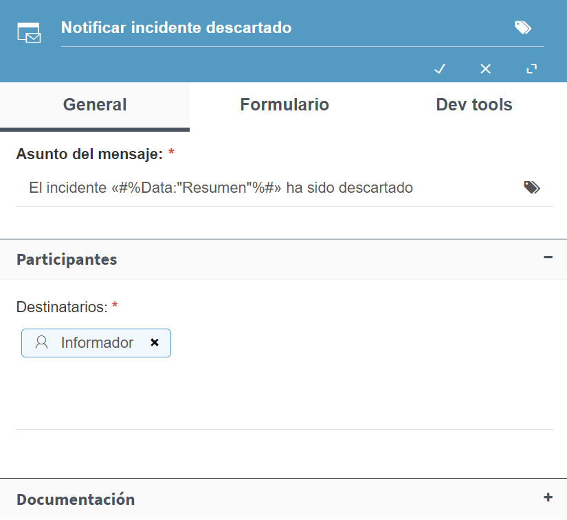](_images/image1914.png)

Figura 604 Configuración básica de tarea de notificación a usuario[](#id207 "Link to this image")

#### Tarea de e-mail[](#mailtask "Link to this heading")

[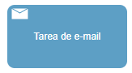](_images/image1821.png)

Figura 605 Tarea de e-mail[](#id208 "Link to this image")

Una tarea de e-mail envía un mensaje de correo electrónico a las casillas especificadas en sus propiedades. Una tarea de e-mail utiliza la configuración del servicio SMTP para enviar sus mensajes.

El formulario de propiedades de una tarea de e-mail tiene las siguientes secciones:

*   **Destinatarios:** permite configurar los destinatarios de la tarea.
    
*   **Contenido:** permite especificar el texto del mensaje que se va a enviar, así como el formato de ese mensaje y qué archivos adjuntos del proceso se enviarán como archivos adjuntos al mensaje.
    

##### Destinatarios[](#destinatarios "Link to this heading")

La sección de «Destinatarios» muestra un espacio para escribir las direcciones de correo electrónico de los destinatarios del mensaje. Puedes escribir varias direcciones o ingresar datos de aplicación o parámetros de sistema de tipo texto, que contengan direcciones de correo electrónico.

##### Contenido[](#contenido "Link to this heading")

La sección “Contenido” contiene las siguientes propiedades:

*   **Asunto:** texto del asunto del mensaje. Se puede usar una etiqueta (ver [Etiquetas](#etiquetas)).
    
*   **Cuerpo:** texto principal del mensaje. Se puede usar una etiqueta (ver [Etiquetas](#etiquetas)).
    
*   **Lenguaje de programación:** indica si el cuerpo del mensaje está especificado en HTML o mediante texto plano.
    
    *   **HTML:** el cuerpo del mensaje está especificado en HTML.
        
    *   **Texto:** el cuerpo del mensaje está especificado mediante texto plano, sin marcas de HTML.
        

En la parte inferior se escribe el mensaje, pudiendo utilizar etiquetas para tomar, por ejemplo, valores de un dato de aplicación. Para esto, escribe “#”.

[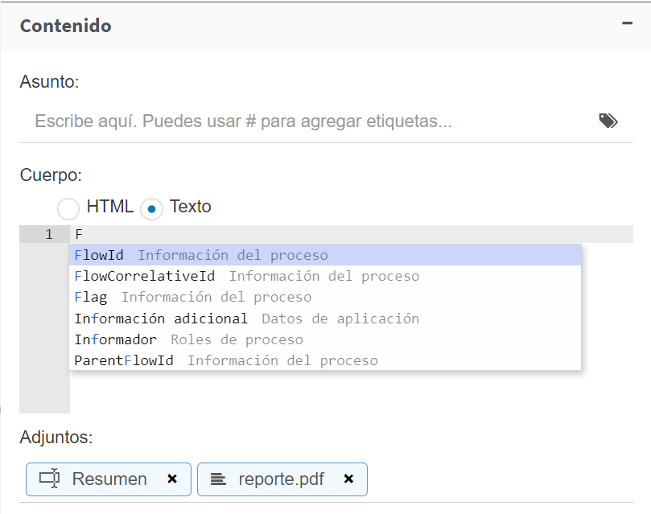](_images/image1851.png)

Figura 606 Propiedades del contenido del mensaje[](#id209 "Link to this image")

#### Tarea de fórmula[](#tarea-de-formula "Link to this heading")

[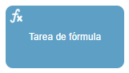](_images/image1871.png)

Figura 607 Tarea de fórmula[](#id210 "Link to this image")

Una tarea de fórmula toma datos de aplicación o roles del proceso, hace operaciones con ellos y genera un resultado que se almacena también en algún dato de aplicación o rol, según corresponda.

La ejecución de esta tarea, llevará a cabo las operaciones en el orden especificado, pudiendo utilizar un valor pre-calculado y almacenado en algún dato de aplicación o rol, en una operación posterior.

[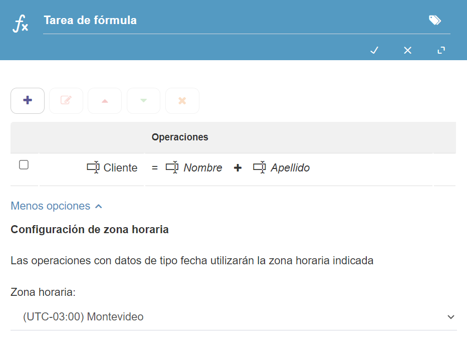](_images/image1881.png)

Figura 608 Propiedades de una tarea de fórmula[](#id211 "Link to this image")

Al expandir la sección de «Más opciones» puede seleccionar una zona horaria para todas las fechas que se manejen en el paso. Las fechas en Qflow tienen una zona horaria que influye en los cálculos realizados con éstas. Dado que un proceso con fechas puede ser ejecutado en una zona horaria distinta a la del usuario (si el servidor está en otro lugar), para evitar ambigüedades, se puede indicar específicamente en qué zona se considera que están las fechas. En el caso de que se importe una tarea de fórmula de una versión anterior de Qflow, de forma automática estará seleccionada la opción “Zona horaria del servidor”.

##### Operaciones[](#id15 "Link to this heading")

El formulario de configuración de una tarea de fórmula muestra una tabla, inicialmente vacía, con la definición de la fórmula, que está compuesta de operaciones (cada fila de la tabla corresponde a una operación). Para agregar una operación a la fórmula, haz clic en el botón “+”. Esto abre el formulario de la nueva operación, a la derecha de la tabla de la fórmula ([Figura 609](#expressiondefinition)).

[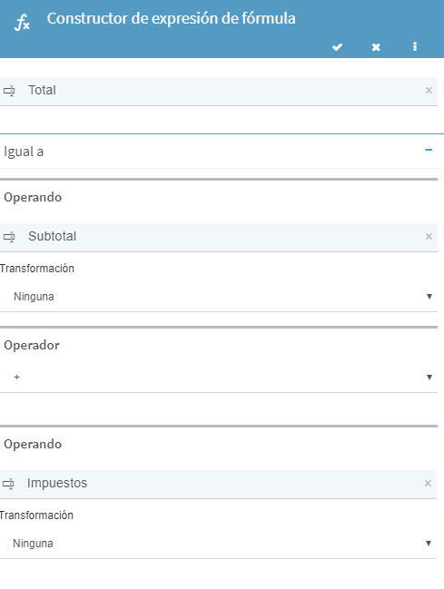](_images/image1891.png)

Figura 609 Definición de una expresión[](#id212 "Link to this image")

Las propiedades de una operación son las siguientes ([Figura 609](#expressiondefinition)):

*   **Destino:** es la primera de las propiedades. Donde dice “Comience a escribir…”, empiece a escribir el nombre del dato de aplicación o rol, en el cual desea guardar el resultado de la fórmula.
    
*   **Primer operando:** después de donde dice “Es igual a”, se puede ingresar el primer operando, escribiendo donde dice “Comience a escribir…”. El operando puede ser:
    
    *   **Valor:** un valor fijo. En este caso, escriba el valor.
        
    *   **Dato de aplicación:** un dato de aplicación de cualquier tipo. Si empieza a escribir el nombre de un dato de aplicación, pronto aparecerá el dato en una lista que se despliega mientras escribe.
        
    *   **Función:** el resultado de una función. Por ahora, la única función disponible es GetDate(), que devuelve la fecha actual según la zona horaria especificada en la tarea. Esta función se podrá seleccionar si empieza a escribir “GetDate()”.
        
    *   **Rol:** un rol de plantilla de proceso. Se selecciona de forma similar a un dato de aplicación.
        
    
    El primer operando depende del destino: si el destino es un rol, el operando debes serlo también. Si el destino es un dato, el valor que pueda tomar el primer operando depende del tipo de dato del destino.
    
*   **Transformación:** esta opción permite aplicar al operando una transformación antes de operar con él. Las transformaciones posibles dependen del tipo de dato del operando.
    
    *   **Datos numéricos:** en general, estas transformaciones sólo tienen sentido si el operando es un dato que admite múltiples valores.
        
        *   **Average:** calcula el promedio de los valores.
            
        *   **Count:** cuenta la cantidad de valores.
            
        *   **Max:** toma el máximo de los valores.
            
        *   **Min:** toma el mínimo de los valores.
            
        *   **Sum:** toma la suma de los valores.
            
    *   **Datos de texto:**
        
        *   **Left:** toma sólo los primeros caracteres del operando. La cantidad de caracteres a tomar se especifica en la propiedad “Largo”.
            
        *   **Left Trim:** corta todos los espacios en blanco que pueda haber al principio del operando.
            
        *   **Mid:** toma sólo los caracteres del medio del operando. La posición a partir de dónde debes tomar los caracteres se indica en la propiedad “Inicio” (el 0 corresponde a la primera posición). La cantidad de caracteres a tomar a partir de esa posición se especifica en la propiedad “Largo”. Por ejemplo, si el valor del operando es “Hola Mundo!”, Inicio = 5 y Largo = 5, el resultado de la transformación será “Mundo”. Para el mismo operando, si Inicio = 0 y Largo = 4, el resultado será “Hola”.
            
        *   **Right:** toma sólo los últimos caracteres del operando. La cantidad de caracteres a tomar se especifica en la propiedad “Largo”.
            
        *   **Right Trim:** corta todos los espacios en blanco que pueda haber al final del operando.
            
        *   **Trim:** corta todos los espacios en blanco que pueda haber tanto al principio como al final del operando.
            
    *   **Fecha:** los valores retornados en estas transformaciones son calculados según la zona horaria especificada en la tarea.
        
        *   **GetDay:** toma sólo el día.
            
        *   **GetHour:** toma sólo la hora.
            
        *   **GetMinutes:** toma sólo los minutos.
            
        *   **GetMonth:** toma sólo el mes.
            
        *   **GetSeconds:** toma sólo los segundos.
            
        *   **GetYear:** toma sólo el año.
            
*   **Operador:** operador de la operación. Es posible no elegir ningún operador y sólo aplicarle una transformación al primer operando, sin realizar ninguna operación.
    
    *   **+** (suma): en el caso de los roles, funciona como una unión de conjuntos (el resultado de sumar dos roles es un conjunto con los miembros de ambos roles).
        
    *   **\-** (resta): en el caso de los roles, funciona como una resta de conjuntos: el resultado son todos los miembros del primer rol que no estén en el segundo rol.
        
    *   **\*** (multiplicación)
        
    *   **/** (división)
        
    *   **mod** (resto de dividir el primer operando entre el segundo)
        
    *   **AddDay:** le suma a un primer operando de tipo fecha la cantidad de días indicada por el segundo operando. El segundo operando debes ser un número.
        
    *   **AddHour:** le suma a un primer operando de tipo fecha la cantidad de horas indicada por el segundo operando. El segundo operando debes ser un número.
        
    *   **AddMinutes:** le suma a un primer operando de tipo fecha la cantidad de minutos indicada por el segundo operando. El segundo operando debes ser un número.
        
    *   **AddMonth:** le suma a un primer operando de tipo fecha la cantidad de meses indicada por el segundo operando. El segundo operando debes ser un número.
        
    *   **AddSeconds:** le suma a un primer operando de tipo fecha la cantidad de segundos indicada por el segundo operando. El segundo operando debes ser un número.
        
    *   **AddYear:** le suma a un primer operando de tipo fecha la cantidad de años indicada por el segundo operando. El segundo operando debes ser un número.
        
*   **Segundo operando:** seleccione el segundo operando de las opciones. Las opciones para este operando son las mismas que las opciones para el primer operando. El segundo operando depende de todo lo anterior: el destino, el primer operando con su posible transformación y el operador. Por este motivo, puede que algunos datos no aparezcan como opción para el segundo operando.
    

### Compuertas[](#compuertas "Link to this heading")

Las compuertas permiten modificar el flujo de un proceso, ya sea creando varios caminos paralelos en el proceso o seleccionando un camino de varios posibles posteriores a la compuerta.

Todas las compuertas se conectan con varios elementos a través de sus conectores. Lo que cambia según el tipo de compuerta es si, una vez que un proceso pasa por ella, continúa utilizando todos los caminos, algunos de ellos o solamente uno.

Las compuertas pueden ser de los siguientes tipos:

*   **Compuerta exclusiva:** selecciona uno de varios posibles caminos para que el proceso continúe su ejecución.
    
*   **Compuerta inclusiva:** selecciona uno o más de varios posibles caminos para que el proceso continúe su ejecución, de modo que puede generar varios hilos paralelos.
    
*   **Compuerta paralela:** genera tantos caminos paralelos como conexiones salientes tenga.
    

Las compuertas se usan de a dos: se agrega una compuerta y, en el lugar en el que terminan los caminos que se iniciaron con ella, se incluye otra compuerta. En el caso de la compuerta exclusiva, esto no es obligatorio. En el caso de las compuertas que generan paralelismo (la paralela y la inclusiva), la segunda compuerta del par (compuerta convergente) es obligatoria y tiene propiedades que permiten definir bajo qué condiciones el proceso continuará su ejecución al terminar de ejecutar uno de los caminos.

#### Compuerta exclusiva[](#compuerta-exclusiva "Link to this heading")

Figura 610 Compuerta exclusiva[](#id213 "Link to this image")

Una compuerta exclusiva selecciona uno de varios posibles caminos para que el proceso continúe su ejecución. Define una condición para cada una de sus conexiones salientes. Si alguna condición es verdadera cuando el proceso llega a la compuerta, el proceso utiliza esa conexión para continuar su ejecución. Si ninguna condición es verdadera, el proceso utiliza la conexión por defecto para continuar su ejecución (ver [Especificación de la conexión por defecto](#especificacion-de-la-conexion-por-defecto) por instrucciones para definir la conexión por defecto). Si más de una condición es verdadera, el proceso utiliza la primera de las condiciones para continuar su ejecución. En ningún caso se utiliza más de una conexión: la compuerta exclusiva no genera caminos paralelos.

[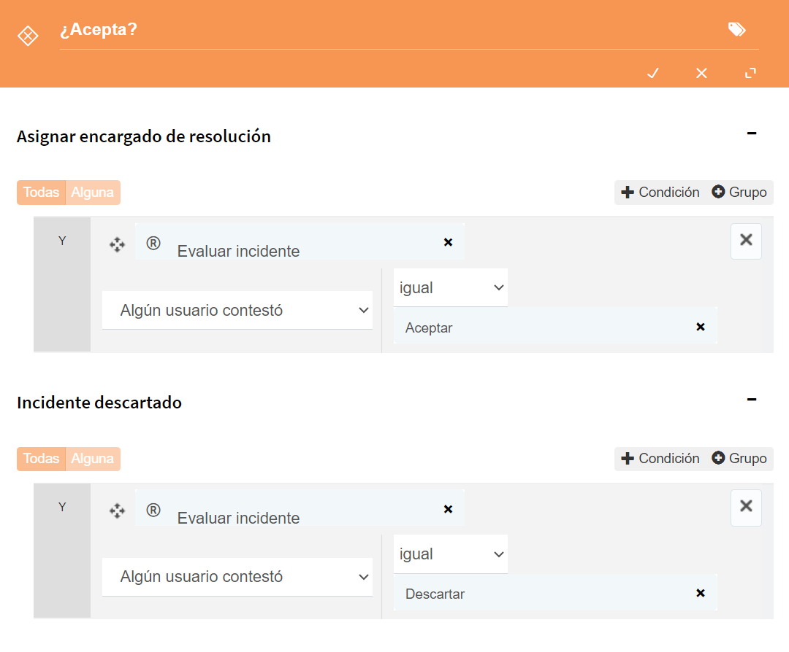](_images/image2181.png)

Figura 611 Definiición de condiciones en una compuerta exclusiva[](#id214 "Link to this image")

#### Compuerta paralela[](#compuerta-paralela "Link to this heading")

[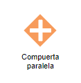](_images/image2191.png)

Figura 612 Compuerta paralela[](#id215 "Link to this image")

Las compuertas paralelas se utilizan de a dos: la primera (compuerta paralela divergente) divide el proceso en varios hilos: el proceso llega a la compuerta paralela y sigue su ejecución usando todas las conexiones salientes de la compuerta. La segunda compuerta (compuerta paralela convergente) une los hilos, haciendo que todos los caminos en los que se había dividido el proceso converjan nuevamente en uno.

El formulario de propiedades de la compuerta que efectúa la separación es muy sencillo: sólo permite ingresar un nombre y una descripción.

La segunda compuerta, que une los hilos, permite definir las condiciones bajo las cuales el proceso debe continuar su ejecución (por ejemplo, si debe esperar a que todos los hilos finalicen). También especifica qué hacer con los hilos pendientes si no se espera a todos. Las opciones disponibles se detallan en [Propiedades de compuertas convergentes](#propiedades-de-compuertas-convergentes).

#### Compuerta inclusiva[](#compuerta-inclusiva "Link to this heading")

[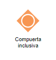](_images/image2221.png)

Figura 613 Compuerta inclusiva[](#id216 "Link to this image")

Una compuerta inclusiva es una suerte de híbrido de compuerta exclusiva y compuerta paralela: selecciona uno o más de varios posibles caminos para que el proceso continúe su ejecución, de modo que puede generar varios hilos paralelos. Define una condición para cada uno de los conectores salientes. Una vez evaluadas las condiciones, el proceso continúa su ejecución a través de todas las conexiones cuyas condiciones se cumplan. Si más de una condición es verdadera, la compuerta genera varios caminos paralelos.

Al igual que las compuertas paralelas, las compuertas inclusivas se deben usar en pares, y la segunda compuerta de un par (la compuerta convergente) tiene propiedades que permiten definir cuándo el proceso debes continuar su ejecución al llegar a la compuerta y qué debes hacer con hilos pendientes. Las opciones disponibles se detallan en [Propiedades de compuertas convergentes](#propiedades-de-compuertas-convergentes).

El formulario de propiedades de la primera compuerta (compuerta divergente) es muy sencillo y sólo permite ingresar un nombre y una descripción.

#### Especificación de la conexión por defecto[](#especificacion-de-la-conexion-por-defecto "Link to this heading")

La conexión por defecto es la que usa una compuerta exclusiva cuando ninguna de las condiciones que contiene es evaluada como verdadera. Para definir una conexión por defecto, selecciona una de las conexiones de la compuerta, haz clic sobre ella con el botón derecho y selecciona, en el menú contextual, “Conexión por defecto” ([Figura 614](#specifydefaultconnection)).

[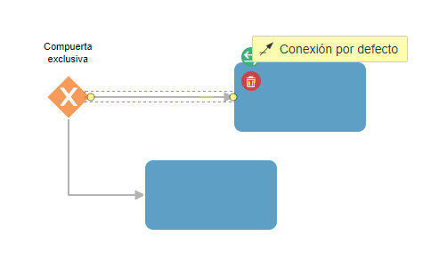](_images/image2231.png)

Figura 614 Especificando conexión por defecto[](#id217 "Link to this image")

Finalmente la conexión debesría quedar como se muestra en la [Figura 615](#defaultconnection).

[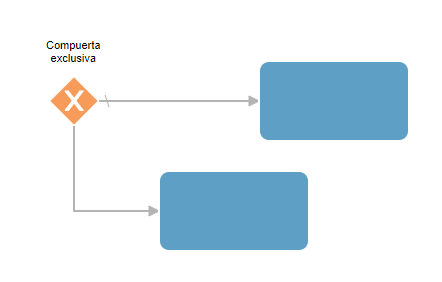](_images/image2241.png)

Figura 615 Conexión por defecto[](#id218 "Link to this image")

#### Especificación de condiciones[](#especificacion-de-condiciones "Link to this heading")

Las compuertas exclusivas e inclusivas contienen en sus propiedades condiciones que Qflow evalúa cuando llega a alguna de ellas. Estas condiciones determinan por qué camino (en el caso de la compuerta exclusiva) o caminos (en el caso de la compuerta inclusiva) continuará su ejecución el proceso, una vez abandonada la compuerta.

Para definir las condiciones de una compuerta, abre el formulario de propiedades. Este formulario está dividido en subsecciones, cada una representando un camino posible que la compuerta puede tomar en el proceso. En cada subsección, es posible establecer una condición.

Para definir una condición simple, haz clic en el botón “+Condición”. Eso hace que Qflow agregue un elemento a la lista de condiciones ([Figura 616](#newconditioninconditionlist)).

[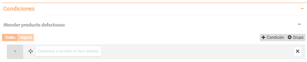](_images/image2251.png)

Figura 616 Nueva condición en lista de condiciones[](#id219 "Link to this image")

Una vez agregada la condición, debes especificar sus componentes. Donde dice “Comience a escribir…” debes escribir el nombre del ítem que desea usar en la condición. El ítem puede ser un dato de aplicación, un parámetro de aplicación de tipo texto, o una tarea de usuario que se haya ejecutado antes. Una vez seleccionado el ítem, selecciona el operador a utilizar y finalmente, el valor con el cual desea comparar. Si el ítem seleccionado es una tarea de usuario, se podrá seleccionar el criterio de votación, que permite especificar cómo evaluar la respuesta si los destinatarios de la tarea son muchos:

*   **Algún usuario ha contestado:** si algún destinatario contestó lo especificado en la combinación de operador y valor, la expresión es verdadera. De lo contrario, es falsa.
    
*   **Todos los usuarios han contestado:** si todos los destinatarios de la tarea contestaron lo especificado en la combinación de operador y valor, la expresión es verdadera. De lo contrario, es falsa.
    
*   **Ningún usuario ha contestado:** si ningún destinatario contestó lo especificado en la combinación de operador y valor, la expresión es verdadera. De lo contrario, es falsa.
    
*   **X usuarios han contestado:** si X destinatarios contestaron lo especificado en la combinación de operador y valor, la expresión es verdadera. De lo contrario, es falsa. Si esta opción está seleccionada, se habilita un casillero para especificar el valor de X.
    
*   **X% de usuarios han contestado:** si X% de los destinatarios contestaron lo especificado en la combinación de operador y valor, la expresión es verdadera. De lo contrario, es falsa. Si esta opción está seleccionada, se habilita un casillero para especificar el valor de X.
    
*   **La respuesta más seleccionada fue:** Si la respuesta más seleccionada fue la especificada en la combinación de operador y valor, la expresión es verdadera. De lo contrario, es falsa.
    

El valor puede ser puede ser un valor fijo como “2”, pero también puedes escribir el nombre de un dato de aplicación o parámetro de aplicación de tipo texto para que la comparación se haz con su valor, el valor de una clave de respuesta de tarea de usuario o el nombre de ésta. En este último caso, la comparación se hará con la clave de la respuesta que se haya dado a la tarea de usuario que se contestó antes. Esto permite construir condiciones como “Si el dato de aplicación ‘Estado’ es igual a la respuesta que se dio a la tarea de usuario ‘Aprobar’”.

Si agregas otra condición, debes decidir si la segunda condición se debe cumplir simultáneamente con la primera, es decir, si lo que se evalúa es “Se cumple la primera condición Y se cumple la segunda condición” o “Se cumple la primera condición O la segunda condición”. Para eso están los botones “Todas” y “Alguna”. Si hace clic en “Todas”, Qflow muestra a la izquierda de las condiciones el texto “Y”. Si haces clic en “Alguna”, basta con que se cumpla una de las condiciones y a la izquierda de las condiciones aparece el texto “O”.

Para poder combinar “Y” y “O” hay que usar grupos de condiciones. Para agregar un grupo, haz clic en “+Grupo”. Después puede agregar condiciones dentro del grupo. El grupo tiene sus propios botones de “Todas” y “Alguna”, para determinar cómo se combinan las condiciones dentro del grupo (se combinan todas con “Y” o se combinan todas con “O”). A su vez, los grupos se combinan de la misma forma que las condiciones, con “Y” y “O”. Un grupo puede contener grupos: combinando grupos de condiciones unidas con “Y”, con grupos de condiciones unidas con “O”, se puede construir cualquier condición compleja.

##### Ejemplo[](#ejemplo "Link to this heading")

Supon que una plantilla de proceso tiene un dato numérico “Monto” y otro dato “Tipo de producto”. Se deseas construir la condición “Si Monto > 5000 y (Tipo de Producto = 1 o Tipo de Producto = 2)”.

Para eso se necesita una condición “Si Monto > 5000” y un grupo para “(Tipo de Producto = 1 o Tipo de Producto = 2)”, puesto que esta última condición se debes evaluar primero para después comparar el resultado con “Si Monto > 5000”. Los grupos cumplen la misma función que los paréntesis.

En primer lugar se crea una condición con “+Condición” y se ingresan de izquierda a derecha el dato de aplicación “Monto”, el operador “mayor a” y el valor “5000” ([Figura 617](#buildingamountover5000condition)).

[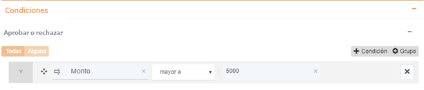](_images/image2261.png)

Figura 617 Construcción de la condición “Si Monto > 5000”[](#id220 "Link to this image")

Luego se agrega un grupo con “+Grupo”, dos condiciones dentro del mismo con su botón “+Condición” y se presiona en “Alguna” ([Figura 618](#buildingtwoconditiongroupwithor)) para poder llenar las dos condiciones que se evalúan con el operador “O”.

[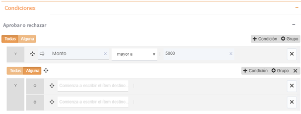](_images/image2271.png)

Figura 618 Construcción de grupo con dos condiciones bajo el operador “O”.[](#id221 "Link to this image")

Una vez hecho esto se procede a completar los campos de las condiciones: la primera, de izquierda a derecha, con el dato de aplicación “Tipo de Producto”, el operador “igual” y el valor “1”. La segunda condición se completa de la misma forma pero con el valor “2” al final, obteniendo la condición final como indica la [Figura 619](#ifamountover5000andgroup).

[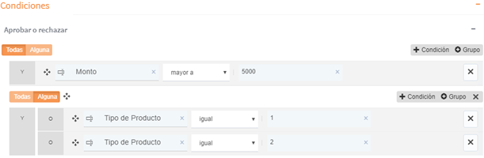](_images/image2281.png)

Figura 619 “Si Monto > 5000”, y un grupo para “(Tipo de Producto = 1 o Tipo de Producto = 2)”[](#id222 "Link to this image")

#### Propiedades de compuertas convergentes[](#propiedades-de-compuertas-convergentes "Link to this heading")

Las compuertas paralelas y las compuertas inclusivas se usan de a pares. La segunda compuerta tiene opciones para determinar bajo qué condiciones el proceso debes continuar al llegar a ella y qué hacer con hilos que quedan pendientes. Estas opciones son:

*   **Continuar después de:**
    
    *   **Todos los hilos han finalizado:** el proceso se detiene en la compuerta divergente y espera hasta que todos los hilos finalicen para continuar.
        
    *   **Algún hilo ha terminado:** el proceso continuará ni bien una cierta cantidad de hilos haya terminado, y no esperará la finalización de los otros hilos. La cantidad de hilos a esperar se especifica donde dice “**Número de hilos**”.
        
    *   **Los hilos provenientes de los pasos han terminado:** permite especificar qué hilos el proceso debes esperar. El formulario muestra el nombre del último elemento de cada hilo acompañado de una caja de verificación que se puede marcar. El proceso continuará cuando hayan terminado todos los hilos correspondientes a los elementos que se han marcado.
        
    *   **Finalizar hilos hermanos:** si esta opción está marcada, todos los hilos que no hayan terminado serán finalizados antes de que el proceso continúe.
        

[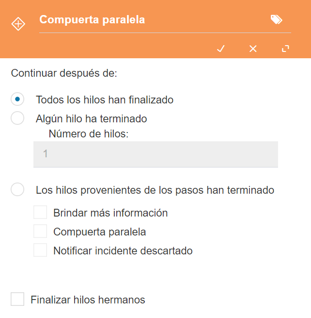](_images/image2213.png)

Figura 620 Propiedades de una compuerta convergente[](#id223 "Link to this image")

#### Actividad de llamada[](#actividad-de-llamada "Link to this heading")

[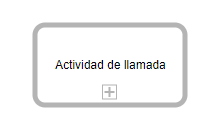](_images/image1751.png)

Figura 621 Actividad de llamada[](#id224 "Link to this image")

Una actividad de llamada sirve para que un proceso inicie otro proceso, al cual se le llama “proceso hijo” (del proceso que lo inició, se dice que es su padre).

Cuando un proceso llega a una actividad de llamada, inicia un proceso de la plantilla indicada en la configuración de la actividad de llamada. Una vez iniciado el proceso hijo, el proceso padre puede continuar su ejecución sin esperar que finalice la ejecución del hijo, o puede detenerse y esperar a que termine su ejecución para continuar.

El formulario de propiedades de una actividad de llamada está dividido en dos pestañas:

*   **General:** permite especificar la plantilla que se usará para iniciar procesos desde la actividad y algunas otras propiedades de los procesos.
    
*   **Mapeos:** permite especificar correspondencias entre datos de aplicación del proceso padre y datos de aplicación del proceso hijo, y entre roles del proceso padre y roles del proceso hijo. Esto permite intercambiar información entre los dos procesos, copiando el valor de datos o roles de uno a los datos o roles correspondientes del otro. También se puede especificar que se copien adjuntos de un proceso al otro.
    

##### General[](#id16 "Link to this heading")

*   **Plantilla de proceso:** especifica de qué plantilla de proceso son los procesos que se inician desde la actividad de llamada.
    
*   **Versión:** especifica qué versión del proceso se usará para iniciar los procesos.
    
    *   **Usar versión publicada:** marca esta opción si deseas que siempre se utilice la versión que esté publicada al momento de iniciar el proceso hijo.
        
    *   **Versión:** esta opción permite seleccionar una versión específica.
        
*   **Nombre del proceso:** es el nombre del proceso a iniciar. Se puede utilizar una etiqueta para que el nombre sea, por ejemplo, el valor de un dato de aplicación. Por más detalles, consulta la sección [Etiquetas](#etiquetas).
    
*   **Descripción del proceso:** descripción del proceso a iniciar. Se puede utilizar una etiqueta para que la descripción tome el valor, por ejemplo, de un dato de aplicación. Por más detalles, consulta la sección [Etiquetas](#etiquetas).
    
*   **Esperar al fin del subproceso para continuar:** si esta opción está marcada, una vez iniciado el proceso hijo, el proceso que lo creó no continúa su ejecución hasta que el hijo haya terminado. Sólo si esta opción queda marcada se pueden actualizar los datos del proceso padre desde el proceso hijo.
    

[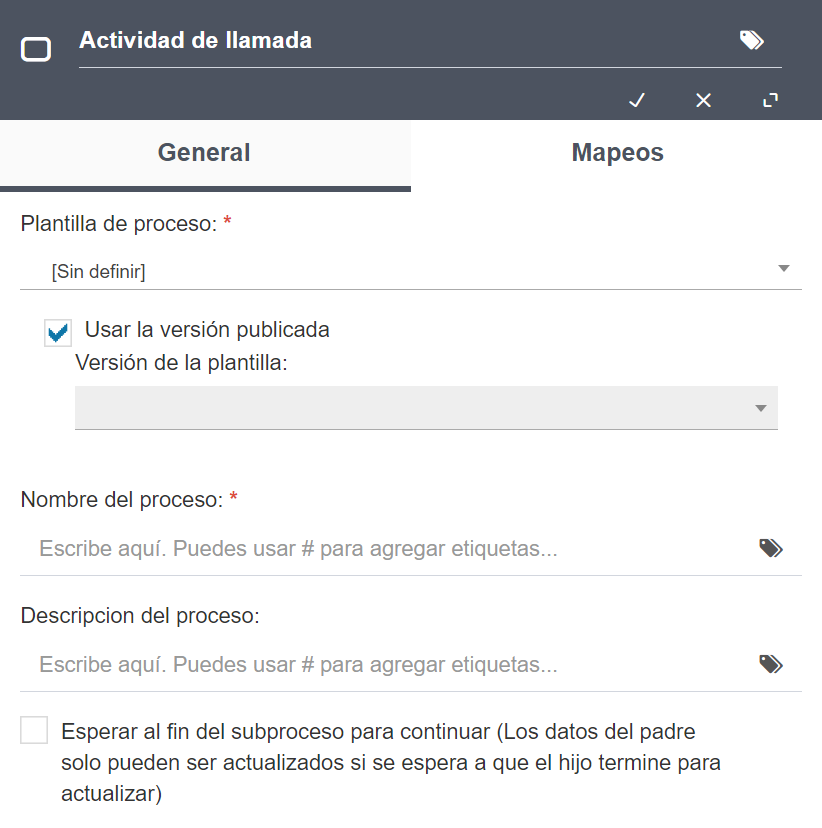](_images/image1761.png)

Figura 622 Propiedades de una actividad de llamada, “Plantilla de proceso”[](#id225 "Link to this image")

##### Mapeos[](#mapeos "Link to this heading")

La pestaña de mapeos muestra una tabla inicialmente vacía a la que se pueden agregar filas. Cada fila representa una correspondencia entre un dato o rol del proceso padre y un dato o rol del proceso hijo. En la parte inferior están las opciones de mapeos de archivos adjuntos.

Arriba de la tabla con las correspondencias de datos y roles están los botones que permiten agregar un mapeo de datos de aplicación, agregar un mapeo de roles, y borrar el mapeo seleccionado ([Figura 623](#callactivitymappings)). Si todavía no se llenaron las opciones de la sección “Plantilla de proceso”, los botones están deshabilitados, puesto que es imposible saber qué datos de aplicación y roles del proceso están disponibles en el proceso que se inicia.

[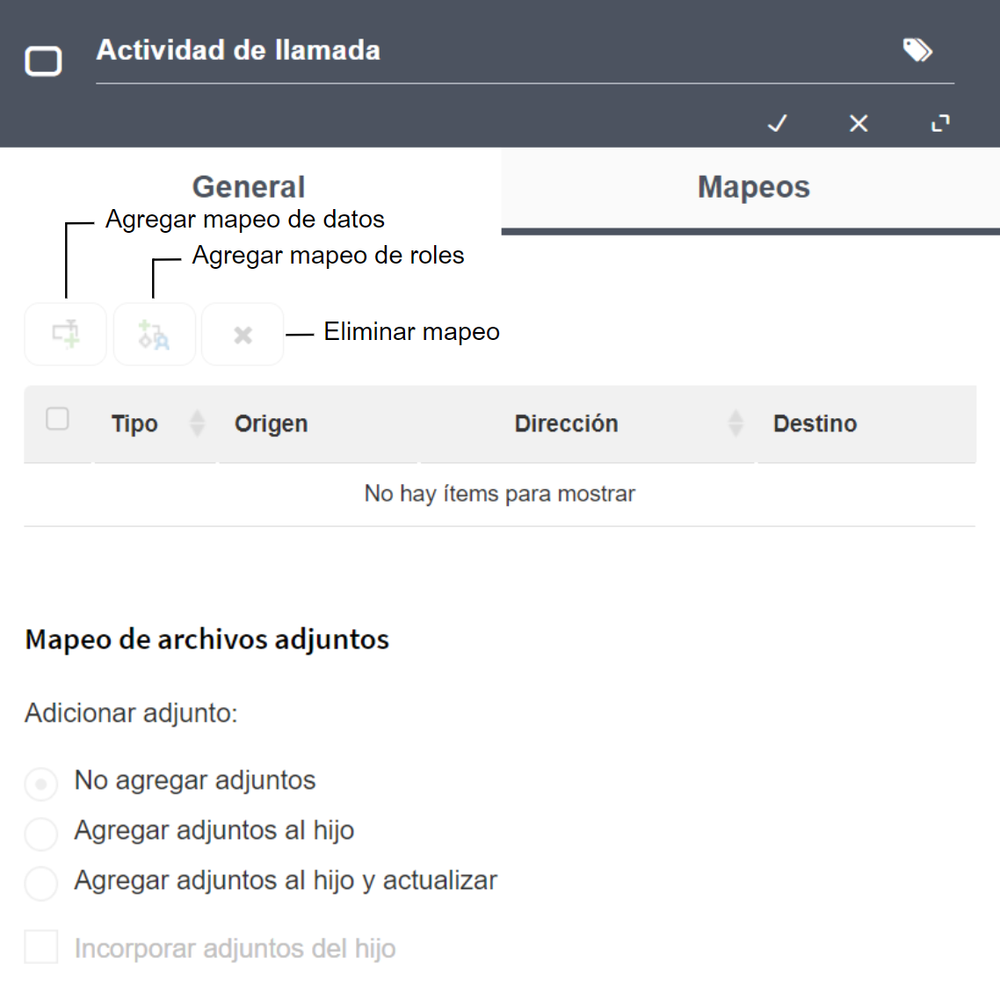](_images/image1771.png)

Figura 623 Mapeos[](#id226 "Link to this image")

Cuando se hace clic en uno de los botones que sirven para agregar un mapeo, se agrega una nueva fila a la tabla de mapeos. Para especificar las propiedades del mapeo, haz clic en cada celda de la nueva fila, seleccionando los valores deseados.

Un mapeo tiene las siguientes propiedades (cada una corresponde a una columna de la tabla):

*   **Tipo:** indica si el mapeo es de roles o de datos. Esto está determinado por qué botón se usó para agregar el mapeo y no se puede modificar.
    
*   **Origen:** dato de aplicación o rol del proceso padre.
    
*   **Objetivo:** dato de aplicación o rol del proceso hijo.
    
*   **Dirección:** indica si se copiará el valor desde el dato o rol de origen al dato o rol de destino o viceversa:
    
    *   **Entrada:** se copia el valor del dato o rol del proceso padre al dato o rol del proceso hijo. Esto se hace al momento de iniciar el proceso.
        
    *   **Salida:** se copia el valor del dato o rol del proceso hijo al dato o rol del proceso padre. Esto se hace cuando el proceso hijo termina su ejecución y sólo si el proceso padre espera al proceso hijo. Si el proceso padre continúa su ejecución inmediatamente después de iniciar el hijo, sin esperar la finalización de éste, no se copian datos o roles del hijo al padre.
        
    *   **Entrada/salida:** se copia el valor del dato o rol del proceso padre al dato o rol del proceso hijo, al momento de iniciar el proceso hijo. Una vez finalizada la ejecución del proceso hijo, si y sólo si el padre esperó la finalización del hijo antes de continuar, se copia el valor del dato o rol del proceso hijo al dato o rol del proceso padre.
        

**IMPORTANTE:** para que un dato o rol aparezca en la lista que permite seleccionarlos como Objetivo, debes ser editable en el evento de inicio del proceso hijo. Si un dato o rol no aparece en la lista de objetivos posibles, revise la visibilidad que tiene en el evento de inicio de la versión que se usará para iniciar el proceso hijo.

En la parte inferior del formulario están las opciones para el mapeo de adjuntos:

*   **No agregar adjuntos:** Qflow no copia los adjuntos del proceso padre al proceso hijo.
    
*   **Agregar adjuntos al hijo:** Al iniciar el proceso hijo, Qflow copia en él los adjuntos del proceso padre.
    
*   **Agregar adjuntos al hijo y actualizar:** al iniciar el proceso hijo, Qflow copia en él los adjuntos del proceso padre. Una vez que el proceso hijo termina su ejecución, si hubo cambios en esos adjuntos, los vuelve a copiar al proceso que lo inició, pero sólo si el padre esperó la finalización del hijo para continuar.
    
*   **Incorporar adiciones del hijo:** si esta opción está marcada, Qflow incorpora al padre todos los archivos que hayan sido adjuntados al hijo durante su ejecución. Esto sólo se hace si el padre espera por el hijo.
    

#### Subproceso[](#subproceso "Link to this heading")

[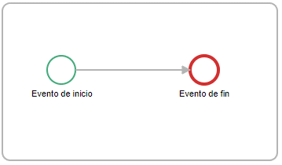](_images/image1781.png)

Figura 624 Subproceso[](#id227 "Link to this image")

Un subproceso es un elemento que contiene varios elementos y permite manejar una parte del diseño del proceso como si fuese una unidad. Sirve para simplificar el diseño del proceso, ya que se puede contraer, de modo que se vea como una actividad simple, o expandir, mostrando todo su contenido, que puede ser modificado como si fuera un diseño de proceso dentro del diseño de proceso.

Un subproceso recién creado tiene un evento de inicio y un evento de fin. Cuando el proceso llega a la ejecución de un subproceso, comienza por el evento de inicio y termina su ejecución al llegar a un evento de fin.

[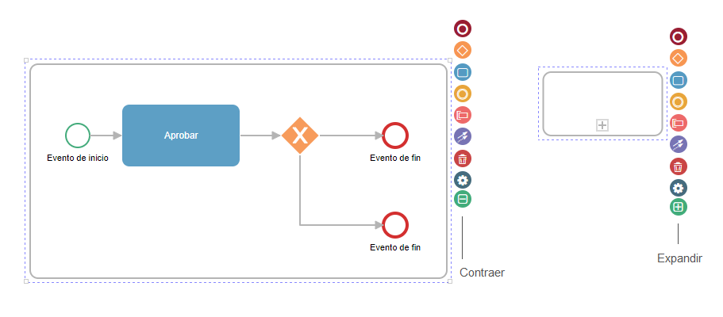](_images/image1791.png)

Figura 625 Subproceso expandido (izq.) y contraído (der.), con los botones que permiten expandirlo y contraerlo[](#id228 "Link to this image")

#### Tarea de código[](#tarea-de-codigo "Link to this heading")

[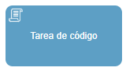](_images/image1801.png)

Figura 626 Tarea de código[](#id229 "Link to this image")

Una tarea de código permite escribir un programa para que un proceso lo ejecute. El código puede ser escrito en los lenguajes C# o Visual Basic .NET y debes implementar una interfaz definida en Qflow.

##### Propiedades de una tarea de código[](#propiedades-de-una-tarea-de-codigo "Link to this heading")

Una tarea de código, además del nombre y de la descripción, tiene las siguientes propiedades:

*   **Lenguaje de programación:** permite elegir el lenguaje de programación (C# o VB .NET).
    
*   **Código:** es el código del script.
    

El código contiene un procedimiento llamado “Execute”. Cuando un proceso ejecute el código, llamará a ese procedimiento. El código se escribe dentro de una clase derivada de la clase CodeScriptBase, definida por Qflow. Esa clase tiene un conjunto de métodos y propiedades que permiten trabajar con los datos del proceso. Por más información sobre cómo usar esos métodos y propiedades, consulte el manual de [Referencia de la Interfaz de Scripting de Qflow](10-ScriptingInterface.md).

[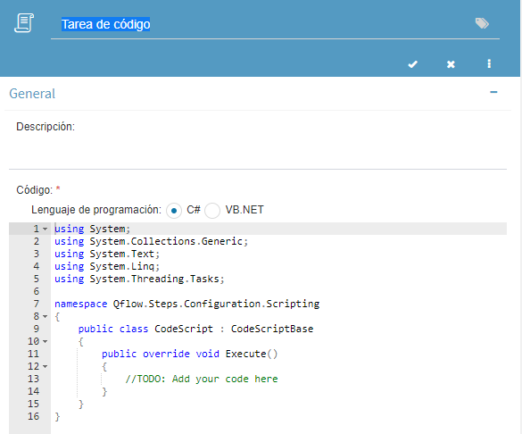](_images/image1814.png)

Figura 627 Propiedades de una tarea de código[](#id230 "Link to this image")

#### Tarea de servicio[](#tarea-de-servicio "Link to this heading")

[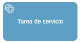](_images/image1921.png)

Figura 628 Tarea de servicio[](#id231 "Link to this image")

La tarea de servicio es un tipo de paso utilizado para ejecutar una integración definida por el usuario (ver [Integraciones](#integraciones)) o para emplear alguno de los conectores predefinidos que ofrece Qflow (ver [Conectores](34-ConnectorsIndex.md)).

El panel de configuración de la tarea de servicio muestra un flujo de pasos a completar antes de poder guardar el paso.

La sección “Eventos manejados” permite asignar manejadores de eventos a distintos hitos de la tarea, como por ejemplo eventos al inicio del paso, al finalizar, o eventos en caso de error en la ejecución. Para más información, ver [Asociar un manejador a un evento de una tarea](#asociar-un-manejador-a-un-evento-de-una-tarea).

A continuación se explica la configuración tanto para integraciones de usuario como para conectores:

##### Configuración de una integración[](#configuracion-de-una-integracion "Link to this heading")

*   En el primer paso del flujo ([Figura 629](#servicetaskconfigpaneltoolselection)), elegir la primera opción del listado, «Integraciones» y hacer clic en «Siguiente».
    

Figura 629 Panel de configuración de tarea de servicio[](#id232 "Link to this image")

*   En este paso ([Figura 630](#servicetaskconfigpaneluserintegrationlist)) se muestra un listado de todas las integraciones alcanzables por la versión (es decir, que estén definidas en la versión donde se está configurando la tarea, o en cualquier plantilla o paquete del que la versión sea descendiente) que tengan definida una operación en producción (nótese que puede haber integraciones creadas sin tener una operación en producción asignada, en cuyo caso no aparecerá en el listado). Selecciona la integración que quiere usar y haz clic en «Siguiente».
    

Figura 630 Listado de integraciones de usuario[](#id233 "Link to this image")

*   El tercer paso es donde se definen los parámetros de conexión, que no son usados en las integraciones de usuario, por lo tanto, no es necesario configurar nada en este paso, y podemos continuar haciendo clic en «Siguiente».
    

Figura 631 Configuración de conexión para integraciones de usuario[](#id234 "Link to this image")

*   El último paso es para asignar los valores a los parámetros de la integración. En el paso se muestran las pestañas que corresponden a los parámetros de _entrada_, _salida_ y _entrada/salida_. En cada pestaña veremos los parámetros con un campo para escribir y un ícono que representa el típo del parámetro.
    
    Podemos asignar datos de aplicación (y únicamente para parámetros de _entrada_, también se pueden utilizar parámetros de aplicación de tipo texto) comenzando a escribir en los campos, para que el sitio despliegue una lista de las opciones disponibles. Haz clic en las opciones para mapearlas al parámetro.
    
    La opción de «_Auto mapear_» asigna automáticamente todos los datos a los parámetros que tengan el mismo nombre.
    
    Es necesario asignar todos los parámetros requeridos (marcados con un asterisco rojo) antes de continuar. Una vez mapeados los parámetros, haz clic en «Finalizar» para terminar la configuración.
    

Figura 632 Mapeo de parámetros de una tarea de servicio[](#id235 "Link to this image")

*   Una vez terminada la asignación de los parámetros, ya podemos guardar el panel para finalizar con la configuración de la tarea.
    

Figura 633 Configuración de tarea de servicio finalizada[](#id236 "Link to this image")

##### Configuración de un conector[](#configuracion-de-un-conector "Link to this heading")

Para configurar un conector, ver la página de [configuración de conectores desde una tarea de servicio](35-ConnectorParameterConfig.md).

#### Tarea de servicio asíncrono[](#tarea-de-servicio-asincrono "Link to this heading")

[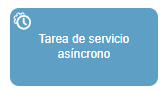](_images/image1941.png)

Figura 634 Tarea de servicio asíncrono[](#id237 "Link to this image")

Una tarea de servicio asíncrono permite asignarle un trabajo a un bot. Un bot puede tener parámetros, al igual que una integración. Una tarea de servicio asíncrono es muy similar a una tarea de servicio, con la única diferencia de que, en lugar de seleccionar una integración para ejecutar, se selecciona un bot (ver [Bots](#bots)) al cual se le asigna un trabajo ([Figura 635](#bottaskproperties)).

El formulario de propiedades de una tarea de servicio asíncrono incluye dos pestañas:

##### General[](#id17 "Link to this heading")

Permite elegir el bot al que se le asignará el trabajo y mapear los parámetros de entrada y/o salida.

##### Dev tools[](#id18 "Link to this heading")

Permite configurar los manejadores de eventos (ver [Asociar un manejador a un evento de una tarea](#asociar-un-manejador-a-un-evento-de-una-tarea)) y validaciones (ver [Asociación de una validación a un formulario](#asociacion-de-una-validacion-a-un-formulario)).

[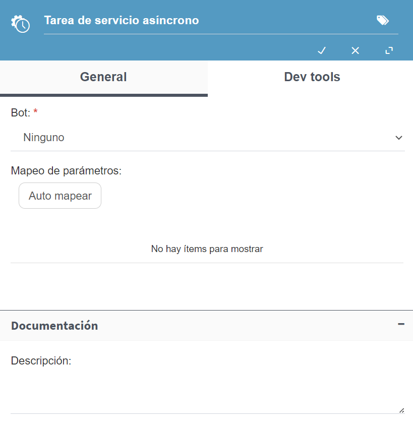](_images/image1951.png)

Figura 635 Propiedades de una tarea de servicio asincrónica[](#id238 "Link to this image")

#### Eventos intermedios[](#eventos-intermedios "Link to this heading")

Son aquellos eventos que pueden ocurrir entre el inicio y el fin de un proceso.

##### Evento de temporización[](#evento-de-temporizacion "Link to this heading")

Figura 636 Evento de temporización[](#id239 "Link to this image")

Un evento de temporización permite especificar una demora. Cuando un proceso llega a un evento de temporización, se detiene durante el tiempo especificado en él. El formulario de propiedades de un evento de temporización permite especificar cuánto debes esperar el evento.

[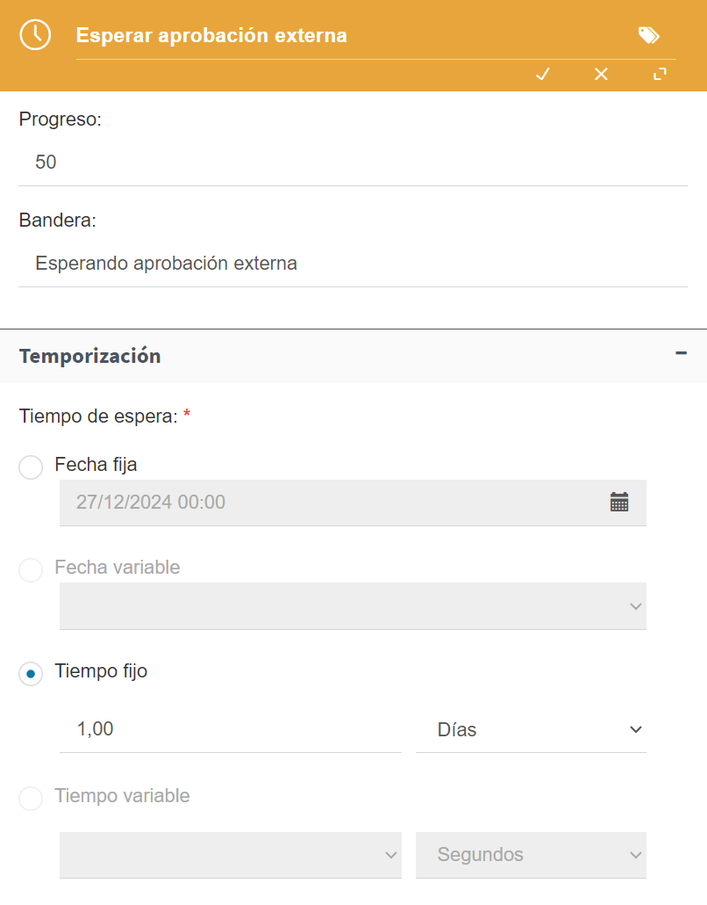](_images/image2081.png)

Figura 637 Propiedades de evento de temporización[](#id240 "Link to this image")

##### Evento intermedio simple[](#evento-intermedio-simple "Link to this heading")

[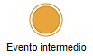](_images/image2091.png)

Figura 638 Evento intermedio[](#id241 "Link to this image")

Un evento intermedio simple, que llamaremos evento intermedio, permite marcar el avance de un proceso, modificando las propiedades que tienen ese propósito (progreso, bandera y etapa).

Figura 639 Propiedades de evento intermedio simple[](#id242 "Link to this image")

##### Evento de atrapar señal[](#evento-de-atrapar-senal "Link to this heading")

[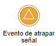](_images/image2113.png)

Figura 640 Evento de atrapar señal[](#id243 "Link to this image")

Un evento de atrapar señal permite poner al hilo en espera hasta que se reciba una señal proveniente de un evento de lanzar señal. Se utiliza en escenarios donde es necesario sincronizar el trabajo de dos o más hilos que se ejecutan simultáneamente. Las dos propiedades específicas de estos eventos son las siguientes:

*   **Esperar señal de:** evento de lanzar señal por el cual se espera.
    
*   **Continuar si la señal ya fue lanzada:** en caso de que la señal se haya lanzado previamente al intento de atraparla, especifica si se debes esperar una nueva señal o simplemente continuar.
    

[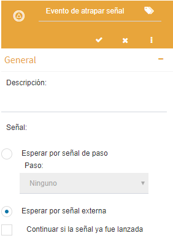](_images/image2121.png)

Figura 641 Propiedades de evento de atrapar señal[](#id244 "Link to this image")

##### Evento de lanzar señal[](#evento-de-lanzar-senal "Link to this heading")

[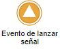](_images/image2131.png)

Figura 642 Evento de lanzar señal[](#id245 "Link to this image")

Un evento de lanzar señal permite notificar a eventos de atrapar señal que lo están esperando para que continúen su ejecución. La configuración de este evento es similar a la de un evento intermedio (ver [Evento intermedio simple](#evento-intermedio-simple)).

#### Eventos intermedios de borde[](#eventos-intermedios-de-borde "Link to this heading")

[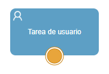](_images/image2141.png)

Figura 643 Evento intermedio de borde genérico[](#id246 "Link to this image")

Los eventos intermedios de borde, son eventos que se pueden adjuntar a ciertas actividades. Si durante la ejecución de la actividad se provoca alguno de los eventos definidos, el proceso continúa por un flujo que lo contemple. Los eventos que Qflow admite como eventos de borde son:

*   **Evento temporizador:** estos eventos se pueden adjuntar a tareas de usuario o tareas de servicio asincrónico, el proceso seguirá este camino al ocurrir el vencimiento definido en la propia actividad.
    

Figura 644 Evento temporizador de borde[](#id247 "Link to this image")

*   **Evento de error:** estos eventos se pueden adjuntar a tareas de servicio, tareas de código, tareas de fórmula y tareas e-mail, el proceso seguirá este camino al ocurrir algún error en la ejecución de la actividad.
    

[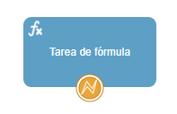](_images/image2161.png)

Figura 645 Evento de error de borde[](#id248 "Link to this image")

### Artefactos[](#artefactos "Link to this heading")

Los artefactos son objetos cuyo propósito es hacer más manejable y comprensible el proceso. En el diseño del proceso, tienen un comportamiento distinto al de otros elementos: no son parte del flujo del proceso. Se los puede conectar a actividades, eventos y compuertas, pero sólo para señalar que están relacionados con ellos. Son elementos informativos que no afectan al proceso.

Los artefactos disponibles en Qflow son:

*   **Referencia de objeto de datos:** representa un conjunto de datos que se usa en alguna actividad.
    
*   **Referencia a base de datos:** representa un almacén de datos, como por ejemplo una base de datos.
    
*   **Anotación:** permite escribir un texto y asociarlo a algún elemento del diseño.
    

#### Referencia a objeto de datos y referencia a base de datos[](#referencia-a-objeto-de-datos-y-referencia-a-base-de-datos "Link to this heading")

Figura 646 Referencia a objeto de datos[](#id249 "Link to this image")

Figura 647 Referencia a base de datos[](#id250 "Link to this image")

Tanto una referencia a objeto de datos como una referencia a base de datos se agregan al diseño y se conectan con el elemento al que se refiere. Por ejemplo, si una tarea de servicio actualiza una base de datos, se puede agregar una referencia a base de datos para indicar cuál es la base de datos que actualiza ([Figura 648](#referencetodatabaseinservicetask)). Para escribir el nombre de la base de datos, haz doble clic en la referencia a base de datos. Debajo del objeto aparece una caja para escribir un texto.

Otro ejemplo: si un usuario utiliza determinado conjunto de datos para desempeñar una tarea, se puede incluir en el diseño un objeto de datos que indique cuál es el conjunto de datos ([Figura 649](#referencetodataobjectinusertask)).

[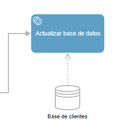](_images/image2321.png)

Figura 648 Referencia a base de datos en tarea de servicio[](#id251 "Link to this image")

[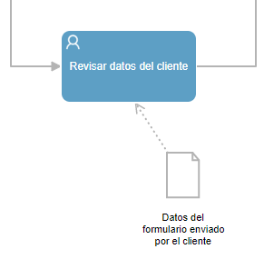](_images/image2331.png)

Figura 649 Referencia a objeto de datos en tarea de usuario[](#id252 "Link to this image")

#### Anotación[](#anotacion "Link to this heading")

[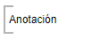](_images/image2341.png)

Figura 650 Anotación[](#id253 "Link to this image")

Cuando se selecciona un elemento del diseño del proceso, una de las opciones que aparece sirve para agregar una anotación. Si haces clic en el botón correspondiente, Qflow crea una anotación y le permite posicionarla en el lugar que deseas. Una vez posicionada la anotación, haz doble clic para ingresar un texto. Se puede aumentar el tamaño de una anotación para que el texto quepa.

[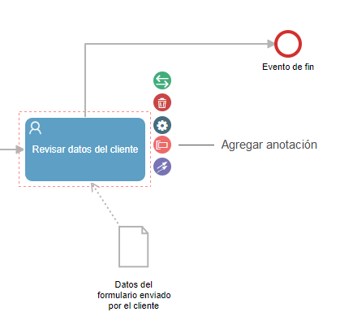](_images/image2351.png)

Figura 651 Opciones de un elemento con botón de agregar anotación[](#id254 "Link to this image")

[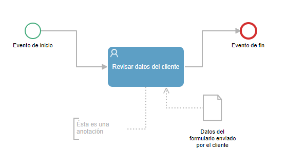](_images/image2361.png)

Figura 652 Diseño con anotación[](#id255 "Link to this image")

### Pool[](#pool "Link to this heading")

Un pool permite crear andariveles para organizar el proceso, agrupando dentro de un mismo nivel elementos relacionados.

Cuando se agrega un pool, todos los elementos del diseño quedan dentro de él. No está permitido arrastrar elementos hacia afuera del pool: todos los elementos del diseño debesn estar dentro.

[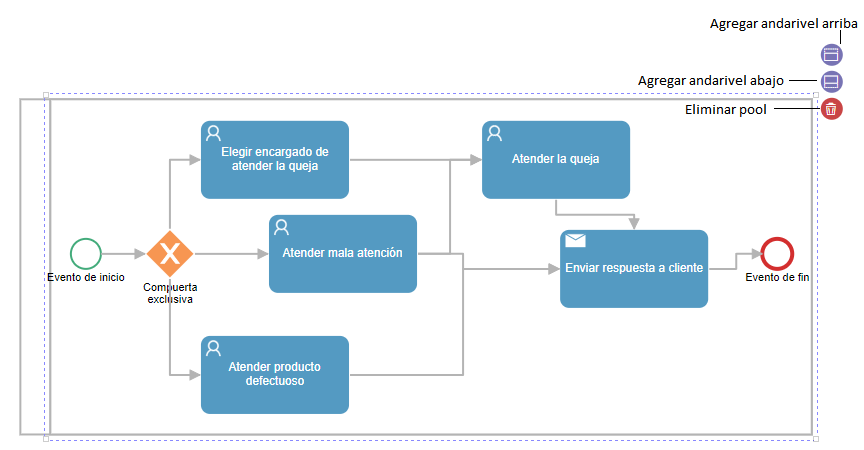](_images/image2371.png)

Figura 653 Pool[](#id256 "Link to this image")

Una vez creado un pool, se pueden agregar andariveles con los botones que aparecen al seleccionar el pool ([Figura 653](#design-pool)). Los andariveles se pueden agrandar o achicar, seleccionándolos y usando el ratón para arrastrar sus bordes hacia uno u otro lado.

[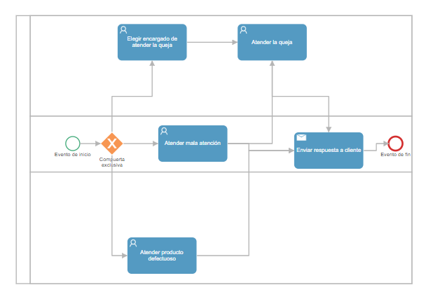](_images/image2381.png)

Figura 654 Proceso con andariveles[](#id257 "Link to this image")

## Formularios personalizados[](#formularios-personalizados "Link to this heading")

### Introducción[](#id20 "Link to this heading")

Los formularios personalizados permiten definir, de forma visual, la estructura y el diseño de los formularios utilizados en uno o más pasos del proceso. Su función principal es controlar la apariencia, el orden y la organización de los campos que se muestran al usuario al momento de completar una tarea.

Estos formularios se crean desde el **diseñador de formularios**: una herramienta gráfica que facilita la construcción sencilla y visual de las interfaces que se integran a distintas etapas del proceso. Una vez creado, el formulario puede asociarse a uno o más pasos (tareas de usuario o eventos de inicio), determinando así **en qué momento será mostrado** durante la ejecución.

A diferencia de otros mecanismos de entrada de datos, el formulario personalizado **no modifica la lógica del proceso** ni sus reglas de ejecución. Su propósito es exclusivamente definir **cómo se presenta la información**, con qué etiquetas y bajo qué condiciones de visibilidad.

Cada formulario puede adaptarse a distintos contextos mediante reglas específicas, configuradas para cada campo y para cada etapa. Esto permite, por ejemplo, mostrar un conjunto de datos al inicio y ocultarlos o volverlos de solo lectura en fases posteriores.

### Creación de un formulario personalizado[](#creacion-de-un-formulario-personalizado "Link to this heading")

Para crear un nuevo formulario personalizado, seleccioná un proceso existente y elegí un **elemento compatible** (como una tarea de usuario o un evento de inicio) para editarlo.

Desde el elemento elegido:

*   Dirígete al panel de propiedades.
    
*   En la sección **Formulario**, selecciona **Crear formulario personalizado**.
    

Una vez creado, el formulario queda vinculado a la versión actual del proceso.

Un mismo formulario puede asignarse a múltiples **elementos** (evento de inicio o tarea de usuario) dentro del mismo proceso, pero no puede reutilizarse en otros procesos.

### Agregar y configurar componentes al formulario[](#agregar-y-configurar-componentes-al-formulario "Link to this heading")

El diseñador de formularios te permite crear formularios de manera sencilla. Para empezar, solo tienes que arrastrar y soltar los componentes desde el panel izquierdo hacia el área central de la pantalla. Estos componentes están organizados en categorías como “Formato y ayuda”, “Datos y roles” u “Otros”. Cuando agregas un componente de tipo dato, el sistema te pedirá que indiques un nombre, ya que es obligatorio. Ese dato será creado en Qflow Design y quedará disponible para reutilizarse en otros formularios.

Dependiendo del componente que elijas, se generará automáticamente un campo con el dato (como un texto, una lista o una casilla) o un elemento visual (como un separador o un contenedor). Estos componentes no contienen información en sí mismos, sino que definen cómo se verá el formulario. Una vez agregados, puedes moverlos dentro de la vista para organizar la estructura del formulario según tus necesidades.

Los componentes permiten:

*   **Representar visualmente campos del formulario** que luego estarán disponibles durante su ejecución (como texto, números, fechas u opciones).
    
*   **Organizar la estructura del diseño**, mediante elementos como títulos, mensajes o separadores.
    

Cada componente incluye un ícono de engranaje que permite acceder a su **panel de propiedades**. Desde allí se configuran aspectos visuales y funcionales como el nombre del dato, el dominio y la visibilidad.

En el diseñador de formularios, los componentes se incorporan desde el panel izquierdo mediante la acción de arrastrar y soltar. Según su tipo, pueden generar un nuevo dato en Design, reutilizar uno ya definido o simplemente añadir elementos visuales sin asociar datos.

*   **Componentes por tipo de dato** (Texto, Número, Combo Box, etc.): Al arrastrar uno de estos componentes al formulario, se crea un **nuevo dato** asociado al dominio correspondiente. En ese caso, se solicita definir un **nombre** para identificar el dato dentro del proceso. Para más información sobre los dominios disponibles, consulte la sección [Dominios](15-QflowDesign.md#dominios).
    
*   **Componentes de rol**: Permiten cargar un rol definido en el proceso y mostrarlo como campo en el formulario. Este campo puede utilizarse, por ejemplo, para asignar dinámicamente un rol a un usuario. Su visibilidad se configura desde el mismo panel utilizado para los datos, donde se define si el campo será visible, editable, requerido u ausente. Para más información, consulte la sección [Roles de plantilla de proceso](15-QflowDesign.md#roles-de-plantilla-de-proceso).
    
*   **Datos y roles existentes**: A través de las opciones **Seleccionar datos existentes** o **Seleccionar roles existentes**, es posible insertar elementos ya definidos en Design. Estos elementos heredan sus configuraciones previas. Dentro del formulario, sus propiedades pueden editarse, y los cambios realizados se reflejan también en el entorno de diseño.
    

Nota

Si se modifica el dominio de un dato desde Design, el cambio se aplicará automáticamente en todos los formularios que utilicen ese dato. Esto garantiza coherencia entre la definición central y su representación en el formulario.

### Componentes visuales y auxiliares[](#componentes-visuales-y-auxiliares "Link to this heading")

*   **Título**: Componente visual que permite separar y nombrar secciones dentro del formulario.
    
*   **Mensaje**: Se utiliza para mostrar texto informativo o instrucciones al usuario.
    
*   **Bitácora de comentarios**: Los formularios permiten configurar comentarios asociados al proceso, que el usuario puede completar al enviar una tarea. Estos comentarios no forman parte estructural de los datos, pero permiten registrar observaciones relevantes en la bitácora del proceso.
    

|     |     |
| --- | --- | 
|  |  |

Nota

Los datos definidos en la **plantilla** o en la **versión** permiten modificar su configuración dentro del formulario: nombre, dominio y visibilidad. El resto de datos permiten modificar únicamente su visibilidad (editable, requerido, solo lectura u ausente), pero no su nombre ni su dominio.

### Visibilidad y asignación del formulario:[](#visibilidad-y-asignacion-del-formulario "Link to this heading")

Un mismo formulario puede asignarse a uno o más **elementos** del proceso, siempre que se trate de un **Evento de inicio** o una **Tarea de usuario**. Esta asignación se realiza desde **Design**, utilizando el **panel de propiedades** del elemento correspondiente.

La visibilidad de los campos se configura exclusivamente en el **diseñador de formularios**, donde se define cómo aparecerá cada dato en cada uno de los pasos del proceso: editable, requerido, solo lectura o ausente. Para más información sobre estas configuraciones, consulte la sección [Visibilidad de datos, roles, adjuntos y comentarios](15-QflowDesign.md#visibilidad-de-datos-roles-adjuntos-y-comentarios).

 
| Visibilidad | Comportamiento |
| --- | --- |
| Editable | El campo puede ser modificado por el usuario. |
| Requerido | El campo debe completarse antes de avanzar. |
| Solo lectura | El valor se muestra, pero no puede editarse. |
| Ausente | El campo no se muestra en ese paso. |

Debajo de la asignación de visibilidad se encuentra un control adicional: la casilla _Permite modificar el valor por código o dependencia_. Esta opción determina si el dato podrá actualizarse automáticamente durante la ejecución del proceso.

*   **Por dependencias**: el valor se calcula a partir de otros datos de aplicación definidos como parámetros del dominio.
    
*   **Por código**: el valor puede ser modificado en tareas de tipo _Código_, aplicando la lógica configurada en el proceso.
    

Si la casilla no está marcada, el valor del dato no podrá modificarse en tareas de código ni por dependencias, quedando limitado a la interacción del usuario según la visibilidad establecida.

**Ejemplo**: en un formulario de licencias, el campo _Fecha de fin_ puede completarse automáticamente como _Fecha de inicio + cantidad de días solicitados_. Este cálculo puede realizarse tanto por una dependencia configurada en el formulario como por una tarea de tipo _Código_, siempre que la casilla esté seleccionada.

### Vista previa y prueba en dispositivos[](#vista-previa-y-prueba-en-dispositivos "Link to this heading")

Desde el diseñador, puedes acceder a una **vista previa** del formulario antes de publicar el proceso.

Para abrirla:

*   Haz clic en **Vista previa**, ubicada en la parte superior derecha.
    
*   El formulario se abrirá en una nueva pestaña, mostrando su estructura actual.
    

La vista previa permite revisar:

*   La distribución visual de los componentes.
    
*   La forma en que se verá el formulario durante la ejecución.
    

Durante la vista previa es posible interactuar con los componentes (por ejemplo, escribir texto o seleccionar opciones), pero estas acciones no se guardan ni afectan al proceso.

Nota

La vista previa no evalúa validaciones, lógica del proceso, visibilidad por paso ni integraciones externas. Solo representa la estructura visual general del formulario.

#### Prueba en dispositivos móviles con código QR[](#prueba-en-dispositivos-moviles-con-codigo-qr "Link to this heading")

Dentro del menú de vista previa se encuentra la opción **Escanear QR**.

Esta funcionalidad genera un código QR que puede escanearse desde un dispositivo móvil o tablet para abrir el formulario. Permite validar el diseño y la experiencia en pantallas reducidas.

*   El formulario se abre respetando la configuración actual.
    
*   No registra datos ni ejecuta el proceso.
    
*   El enlace QR es válido por 30 minutos.
    

Nota

Esta funcionalidad permite validar el diseño en entornos móviles o tablet. No puede utilizarse como prueba funcional del flujo.

### Barra superior del diseñador[](#barra-superior-del-disenador "Link to this heading")

La parte superior del diseñador se incluye accesos y controles globales:

*   **Nombre del formulario**: identifica el formulario actual.
    
*   **Botón “Vista previa”**: abre la simulación visual del formulario.
    
*   **Menú QR**: permite generar un código para abrir el formulario en un dispositivo móvil.
    
*   **Navegación (cuadrícula)**: acceso directo a Task, Admin, Design y Team.
    
*   **Menú de usuario**: configuración de cuenta y sesión.
    

Todos los cambios realizados se guardan automáticamente. Para que el formulario sea funcional dentro del proceso, es necesario **publicar la versión** en la que fue asignado.

Nota

La publicación de la versión del proceso es obligatoria para que el formulario se ejecute en contexto real.

[Anterior](04-QflowTask.md "Qflow Task") [Siguiente](18-QflowTeam.md "Qflow Team")

- - -

© Derechos de autor 2025, Urudata Software.

jQuery(function () { SphinxRtdTheme.Navigation.enable(true); }); window.dataLayer = window.dataLayer || \[\]; function gtag(){dataLayer.push(arguments);} gtag('js', new Date()); gtag('config', 'G-LMDS8S4B42', { 'anonymize\_ip': false, });
