  Qflow Team — Qflow Cloud          

*   [Qflow](https://qflowbpm.com/es/)
*   [Foro](https://forum.qflowbpm.com/)
*   [Centro de Ayuda](https://qflowbpm.com/es/centro-de-ayuda/)
*   [Contáctanos](https://qflowbpm.com/es/contacto/)

[Qflow](index.md)

Cloud (latest) 5.5 OnPremise (latest) 5.2 OnPremise 5.1.1 OnPremise

English Español

selectElement('versionSelect', getVersion()); selectElement('languageSelect', getLanguage()); function selectElement(id, valueToSelect) { let element = document.getElementById(id); element.value = valueToSelect; } function getLanguage() { if (window.location.href.includes('/es/')) { return '/es/'; } else { return '/en/'; } } function getVersion() { if (window.location.href.includes('/qflowcloud/')) { return '/qflowcloud/'; } else if (window.location.href.includes('/qflow5\_1\_1/')) { return '/qflow5\_1\_1/'; } else if (window.location.href.includes('/qflow5\_2/')) { return '/qflow5\_2/'; } else { return '/qflow5\_5/'; } } function redirectToSite(url) { var http = new XMLHttpRequest(); http.onreadystatechange = function() { if (http.readyState === 4) { if (http.status !== 404) { window.location.href = url; } else { window.location.href = url.replace(url.substr(url.lastIndexOf('/') + 1), 'index.md'); } } } http.open('HEAD', url, true); http.send(); }

  

Inicio

*   [Novedades](29-ReleaseNote.md)
*   [Introducción a Qflow](01-QflowIntroduction.md)
*   [Tutoriales](TutorialsIndex.md)
*   [Qflow Task](04-QflowTask.md)
*   [Qflow Design](15-QflowDesign.md)
*   [Qflow Team](#)
    *   [Introducción](#introduccion)
    *   [Organización de este manual](#organizacion-de-este-manual)
    *   [Modelo Organizacional](#modelo-organizacional)
        *   [Elementos del Modelo Organizacional](#elementos-del-modelo-organizacional)
        *   [Manejo de permisos en Qflow](#manejo-de-permisos-en-qflow)
        *   [Otros conceptos importantes](#otros-conceptos-importantes)
    *   [Qflow Team](#id1)
        *   [Ingreso al sitio web](#ingreso-al-sitio-web)
        *   [Descripción general de la interfaz de usuario](#descripcion-general-de-la-interfaz-de-usuario)
        *   [Especificación de Ruta LDAP](#especificacion-de-ruta-ldap)
        *   [Propiedades de los nodos](#propiedades-de-los-nodos)
        *   [Propiedades de los grupos](#propiedades-de-los-grupos)
        *   [Propiedades de los usuarios](#propiedades-de-los-usuarios)
        *   [Importación de usuarios de directorio](#importacion-de-usuarios-de-directorio)
        *   [Importación de datos de un usuario desde un directorio](#importacion-de-datos-de-un-usuario-desde-un-directorio)
        *   [Archivo](#archivo)
        *   [Configuración](#configuracion)
        *   [Propiedades adicionales](#propiedades-adicionales)
        *   [Licencias](#licencias)
*   [Qflow Admin](19-QflowAdmin.md)
*   [Consumo de Q-points](21-Q-pointsConsumption.md)
*   [Conectores](34-ConnectorsIndex.md)
*   [Desarrolladores](31-Development.md)

[Qflow](index.md)

*   
*   Qflow Team

- - -

# Qflow Team[](#qflow-team "Link to this heading")

## Introducción[](#introduccion "Link to this heading")

Este manual describe el modelo organizacional utilizado por Qflow y la herramienta que permite modificarlo.

## Organización de este manual[](#organizacion-de-este-manual "Link to this heading")

Este manual tiene dos partes. La primera parte explica el modelo organizacional utilizado por Qflow y los conceptos que este modelo maneja. Incluye un apartado sobre el manejo de permisos en Qflow.

La segunda parte explica el funcionamiento de Qflow Team, la herramienta que permite modificar el modelo organizacional.

## Modelo Organizacional[](#modelo-organizacional "Link to this heading")

Esta sección describe el modelo organizacional, los elementos que lo componen y algunos conceptos que son necesarios para comprenderlo.

### Elementos del Modelo Organizacional[](#elementos-del-modelo-organizacional "Link to this heading")

El modelo organizacional de Qflow maneja tres tipos de elementos:

*   Nodos
    
*   Grupos
    
*   Usuarios
    

#### Nodos[](#nodos "Link to this heading")

Los nodos sirven para organizar de forma jerárquica la estructura del modelo organizacional. Existe un nodo que es la raíz de la estructura. Un nodo puede contener grupos y usuarios, además de otros nodos. Es un contenedor de otros elementos, y un conjunto de ellos forman una estructura de árbol similar a la estructura de carpetas que se utiliza para organizar los archivos de una computadora. Qflow Team muestra esa estructura de árbol.

Al igual que las carpetas, los nodos poseen nombres que permiten identificarlos. Además, poseen propiedades de seguridad que permiten definir quiénes pueden verlos o modificarlos y de qué forma pueden hacerlo.

Los nodos pueden comportarse como colas de trabajo. Las colas de trabajo pueden ser elegidas como destinatarios de tareas. Cuando una tarea es asignada a un nodo que se comporta como cola de trabajo, cualquier usuario que tenga permiso para contestar tareas de esa cola puede contestar la tarea.

#### Grupos[](#grupos "Link to this heading")

Los grupos permiten agrupar usuarios que comparten ciertas propiedades. Además de contener usuarios, un grupo puede contener otros grupos. Se suelen usar, por ejemplo, para agrupar usuarios que cumplen una misma función, sin que esto se refleje en la estructura de la organización: un usuario puede pertenecer a varios grupos, pero pertenece solamente a un nodo, que representa el departamento o división al que pertenece el usuario.

#### Usuarios[](#usuarios "Link to this heading")

Un usuario de Qflow puede ser miembro de varios grupos, pero no puede estar en más de un nodo. Se puede importar usuarios y sus datos de un servicio de directorio, como, por ejemplo, _Active Directory_.

### Manejo de permisos en Qflow[](#manejo-de-permisos-en-qflow "Link to this heading")

Casi todas las herramientas que componen Qflow permiten definir permisos de acceso de algún tipo. Por ejemplo, todas las herramientas de cliente (Qflow Team, Qflow Design, Qflow Task y Qflow Admin) permiten definir quiénes pueden acceder a ellas. Esta sección explica los mecanismos de seguridad que son comunes a todas las herramientas.

#### Herencia[](#herencia "Link to this heading")

Qflow maneja el concepto de herencia de permisos. Este concepto es conocido por quienes asignan permisos a carpetas en Windows. En el sistema de archivos de Windows, cuando alguien define un permiso para una carpeta, ese permiso es heredado por las subcarpetas de esa carpeta. La estructura del sistema de archivos de Windows es una estructura de árbol: cada elemento de la estructura tiene un padre, a excepción de la raíz.

Qflow tiene dos estructuras de árbol con elementos sobre los cuales se puede definir permisos:

*   **Árbol de nodos organizacionales:** es el árbol que representa la estructura de la organización y contiene nodos, grupos y usuarios. La herramienta que permite modificar el árbol y determinar quiénes tienen permiso de acceso a sus elementos es Qflow Team.
    
*   **Árbol de paquetes:** es la estructura que permite organizar los elementos que representan los procesos de Qflow. La herramienta que permite modificar ese árbol es Qflow Design. En él también se manejan los permisos de acceso a esos elementos desde el punto de vista del diseño de procesos. La misma estructura se utiliza para organizar los procesos en ejecución, y los permisos sobre los elementos de esa estructura desde el punto de vista de la ejecución de procesos se manejan en Qflow Task.
    

Los elementos de ambas estructuras pueden heredar permisos, pero esto es opcional y se define para cada nodo o paquete. Por ejemplo, si a un usuario se le asigna un permiso heredable para ver los ítems del nodo raíz, ese usuario podrá ver los ítems del nodo raíz y de todos sus descendientes, es decir, de todos los nodos del árbol. De la misma forma, si se le asigna un permiso heredable sobre el paquete raíz, el usuario tendrá permisos sobre todos los paquetes de Qflow.

Es importante tener en cuenta que el concepto de herencia se refiere siempre a objetos sobre los que se definen permisos, como paquetes o nodos en Qflow y carpetas en Windows. En Qflow existen otras estructuras jerárquicas además de los árboles de nodos y de paquetes. Un ejemplo es la estructura definida por las relaciones de pertenencia a grupos. Esto no es diferente de Windows, donde un grupo puede contener usuarios y también otros grupos, formando así un árbol. La diferencia está en que mientras nodos y paquetes son los objetos sobre los que se definen permisos, usuarios y grupos son los sujetos a los que se le confieren permisos. Un permiso confiere a alguien (sujeto) acceso a algo (objeto). Siempre que nos referimos al concepto de herencia nos referimos a objetos y no a sujetos.

#### Tipos de permiso de Qflow[](#tipos-de-permiso-de-qflow "Link to this heading")

Hay tres tipos de permiso en Qflow:

*   **Permisos de acceso a una herramienta:** son los permisos relacionados con el acceso a una herramienta (Qflow Design, Qflow Team, Qflow Admin y Qflow Task). Estos permisos se definen independientemente para cada una de las herramientas de Qflow. En general las herramientas tienen dos permisos: “Acceder a la herramienta” y “Administrar seguridad” y además, otros propios de cada una de ellas. Los objetos de esos permisos son las propias herramientas, que no son parte de ninguna estructura jerárquica, por lo que la herencia no tiene sentido en este caso. Los permisos de acceso a una herramienta se modifican en la propia herramienta.
    
*   **Permisos de los nodos:** son los permisos relacionados con las operaciones sobre los nodos organizacionales. Para cada uno de estos permisos se puede especificar si es heredable o no. Algunos nodos, además, pueden ser colas de trabajo. Por eso hay dos tipos de permiso sobre un nodo:
    
    *   **Permisos de nodo como elemento organizacional:** son los permisos que se definen en el grupo “Seguridad” del formulario de propiedades de un nodo en Qflow Team.
        
    *   **Permisos de nodo como cola de trabajo:** en Qflow, es posible determinar que un nodo sea además una cola de trabajo. En ese caso, hay que definir los permisos que determinan qué usuarios pueden contestar tareas de esa cola de trabajo. Estos permisos se definen en el grupo “Seguridad” del formulario de propiedades de una cola de trabajo.
        
*   **Permisos de los paquetes:** son los permisos relacionados con las operaciones sobre paquetes. Para cada uno de estos permisos se puede especificar si es heredable o no. Hay dos tipos de permisos sobre paquetes:
    
    *   **Permisos de un paquete como contenedor de definiciones de procesos:** son los que se definen en Qflow Design. Estos están relacionados con las operaciones que permiten definir procesos y ver las representaciones de los procesos definidos. Consulte el manual de [Qflow Design](15-QflowDesign.md) por más información.
        
    *   **Permisos de un paquete como contenedor de procesos en ejecución:** son los que se definen en Qflow Task y están relacionados con las operaciones relacionadas con la operación de los procesos. Consulte el manual de [Qflow Task](04-QflowTask.md) por más información.
        

#### Sujetos de los permisos: usuarios, grupos, nodos y roles de seguridad[](#sujetos-de-los-permisos-usuarios-grupos-nodos-y-roles-de-seguridad "Link to this heading")

Un permiso le puede ser asignado a un usuario, a un grupo, a un nodo o a un rol de seguridad. Los roles de seguridad se asocian a nodos, grupos y usuarios, y sirven para agrupar permisos y organizar los permisos para simplificar su administración. Son comunes los casos en los que varios permisos suelen ser asignados todos juntos a varios usuarios que desempeñan un mismo rol. Por ejemplo, podría existir un rol “Administrador de seguridad” que tuviera permiso de administrar la seguridad de todas las herramientas de Qflow. En ese caso, se podría crear dicho rol de seguridad y asignarle, en cada herramienta, los permisos de acceso a la herramienta y administración de seguridad de la herramienta. Después, se podría asociar ese rol de seguridad a los usuarios correspondientes, o a un grupo que contuviera a esos usuarios. Este sistema de organización de permisos se denomina RBSA (_Role Based Security Administration_; administración de seguridad basada en roles).

Como un usuario puede estar asociado a varios roles de seguridad y pertenecer a varios grupos, a veces puede resultar complicado determinar qué permisos efectivamente tiene un usuario. Por eso es útil conocer bien las reglas que determinan cómo un permiso que se le asigna a un elemento afecta a los elementos que se relacionan con él:

*   Un permiso que se le concede a un **usuario** afecta solamente a ese usuario.
    
*   Un permiso que se le concede a un **grupo** afecta a todos los usuarios que pertenecen a ese grupo y a todos los nodos y grupos que pertenecen a ese grupo.
    
*   Un permiso que se le concede a un **nodo** afecta a todos los usuarios, grupos y nodos que pertenezcan a ese nodo.
    
*   Un permiso que se le concede a un **rol de seguridad** afecta a todos los usuarios, nodos y grupos que estén asociados a ese rol de seguridad. Los permisos del rol de seguridad afectan a los elementos asociados a ese rol de la misma forma que cada uno de los permisos lo afectaría si fueran asignados de forma independiente. Por ejemplo, si se le confiere un permiso a un rol de seguridad y hay un grupo asociado a ese rol de seguridad, todos los usuarios, nodos y grupos que pertenezcan a ese grupo tendrán los permisos especificados en el rol de seguridad.
    

Los roles de seguridad no deben ser confundidos con los roles de los procesos, que son una forma de abstraer las tareas de un proceso de los usuarios que las llevan a cabo y que se definen en Qflow Design.

#### Conflictos entre permisos[](#conflictos-entre-permisos "Link to this heading")

Además de permitir a alguien realizar una operación, se puede denegar explícitamente el permiso para realizar una operación. Un usuario puede pertenecer a más de un grupo. Puede pasar entonces, que haya contradicciones entre los permisos de un grupo y los de otro.

Dado un usuario y un permiso, hay cuatro posibilidades:

*   El permiso no está definido para el usuario.
    
*   **Hay al menos una definición que le confiere el permiso al usuario y ninguna que se lo niegue.**
    
*   Hay al menos una definición que le niega el permiso al usuario.
    
*   Hay al menos una definición que le confiere el permiso al usuario y al menos una que le niega el permiso.
    

El único caso en el que el usuario tendrá efectivamente el permiso es el segundo. En resumen: **para que un usuario tenga permiso para realizar una operación, debe haber al menos una definición que le conceda ese permiso y no puede haber ninguna que se lo niegue.**

La opción de denegar permisos tiene dos usos comunes:

*   Excluir un elemento organizacional de un permiso otorgado a un elemento organizacional que lo incluye (por ejemplo, si un usuario pertenece a un grupo que tiene permiso para algo y se quiere negar ese permiso al usuario sin quitarlo del grupo).
    
*   Evitar la herencia en una rama del árbol de nodos o del árbol de paquetes (por ejemplo, un usuario tiene permiso sobre el nodo raíz, pero se quiere evitar que tenga permiso sobre un determinado nodo).
    

### Otros conceptos importantes[](#otros-conceptos-importantes "Link to this heading")

Los siguientes son otros conceptos que es bueno tener en cuenta para aprovechar las funcionalidades del modelo organizacional.

#### Supervisores[](#supervisores "Link to this heading")

El rol de supervisor es un rol especial que puede ser desempeñado por un usuario o un grupo y que permite establecer relaciones de jerarquía dentro del modelo organizacional. Los supervisores pueden ser elegidos como destinatarios de alertas de procesos que están esperando por acciones de sus subordinados.

#### Suplencias[](#suplencias "Link to this heading")

Qflow permite definir suplencias. Una persona puede ausentarse de la organización (por ejemplo, porque está enferma o se fue de vacaciones). Mientras no está, es probable que se le sigan asignando tareas, o que siga recibiendo notificaciones, en virtud de las funciones que cumple. Para evitar que esas tareas queden sin hacer, o se atrasen demasiado, provocando que las notificaciones queden sin respuesta, es posible asignarle un suplente a la persona por el tiempo en el que ésta esté ausente.

Qflow se encarga, automáticamente, de enviarle al suplente todas las notificaciones que recibe la persona que se ausentó. El suplente también tendrá acceso a las tareas del usuario al que suple, con permisos suficientes para desempeñarlas en su lugar (pero no más que esos permisos).

Un usuario puede ser suplido aun cuando esté deshabilitado en Qflow y aun así su suplente tendrá los permisos que le permitan ejecutar las tareas del usuario al que suple.

## Qflow Team[](#id1 "Link to this heading")

Qflow Team es la herramienta que permite modificar y mantener el modelo organizacional de Qflow.

### Ingreso al sitio web[](#ingreso-al-sitio-web "Link to this heading")

Para ingresar al sitio web es necesario abrir un navegador de internet e ingresar la dirección de Qflow Team, cuya URL es: _https://<<espacio de trabajo>>.team.qflowbpm.com_ donde <<espacio de trabajo>> debe reemplazarse por el nombre del espacio de trabajo de Qflow.

El sistema soporta dos modelos de autenticación de usuarios: usuario y contraseña o autenticación con cuentas de Google o Microsoft.

En caso de que el usuario no tenga permisos o el sistema no lo reconozca, se presentará el formulario de autenticación como se muestra en la [Figura 655](#qflowteamlogin).

Figura 655 Ingreso al sitio web[](#id8 "Link to this image")

La pantalla presenta las siguientes opciones:

*   **Nombre de usuario:** Nombre de usuario con el que se desea ingresar.
    
*   **Contraseña:** Contraseña con la que se desea ingresar.
    
*   **Proveedor de seguridad:** Proveedor de seguridad que autentica al usuario (por ejemplo, el dominio de la empresa).
    
*   **Login con cuenta de Microsoft:** Seleccionar esta opción llevará a una vista donde se solicitarán las credenciales de Microsoft del usuario para autenticar la cuenta.
    
*   **Login con cuenta de Google:** Seleccionar esta opción llevará a una vista donde se solicitarán las credenciales de Google del usuario para autenticar la cuenta.
    

### Descripción general de la interfaz de usuario[](#descripcion-general-de-la-interfaz-de-usuario "Link to this heading")

Los principales elementos de la interfaz son:

*   **Pantalla principal:** permite visualizar los usuarios actualmente habilitados, el histórico de estos y los 10 inicios de sesión más recientes.
    
*   **Menú superior:** presenta opciones para buscar elementos, acceder a la pantalla de configuración, así como para ir al inicio, configurar su zona horaria de preferencia y cerrar la sesión.
    
*   **Menú lateral:** permite mostrar/ocultar el árbol de solución (por defecto Raíz) y operar con los nodos organizacionales de dicho árbol.
    
*   **Árbol de nodos organizacionales:** permite ver la estructura jerárquica del modelo organizacional y seleccionar el elemento sobre el cual se desea operar.
    

Figura 656 Pantalla principal de Qflow Team[](#id9 "Link to this image")

#### Menú superior[](#menu-superior "Link to this heading")

La [Figura 657](#topmenu) muestra las opciones del menú superior y describe qué función cumplen.

[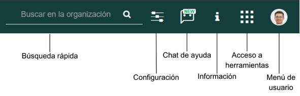](_images/image518.png)

Figura 657 Menú superior[](#id10 "Link to this image")

A continuación, se explican las opciones que requieren aclaraciones:

*   **Búsqueda rápida:** permite buscar un usuario, grupo o nodo. Cuando se busque un elemento, Qflow mostrará una lista con todos los elementos encontrados que contengan el texto ingresado. En el caso de los usuarios, se buscará tanto por nombre como por _login._
    
*   **Configuración:** cuando se selecciona esta opción, el sistema despliega un conjunto de opciones como muestra la [Figura 658](#topmenuconfiguration). Más detalles en [Configuración](#configuracion).
    

[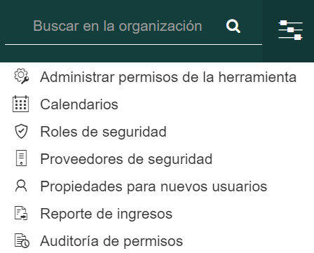](_images/image619.png)

Figura 658 Configuración[](#id11 "Link to this image")

*   **Información:** cuando se selecciona esta opción, el sistema despliega los enlaces a las novedades del producto, a este manual y al foro de Qflow, además de poder ver la versión del producto que se está usando.
    

[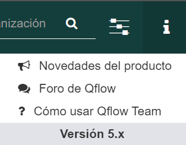](_images/image845.png)

Figura 659 Información[](#id12 "Link to this image")

*   **Herramientas:** cuando se selecciona esta opción, el sistema despliega los enlaces a todas las herramientas a las que el usuario tiene permisos. Al hacer clic en una de ellas se abrirá en una nueva pestaña. En caso de que el usuario solo tenga permisos en la herramienta actual, este icono no aparecera en el cabezal.
    

[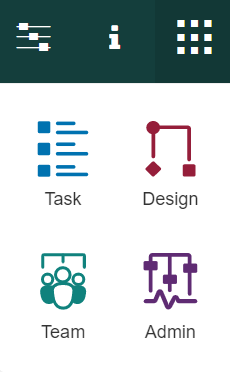](_images/image895.png)

Figura 660 Herramientas[](#id13 "Link to this image")

El botón de chat de ayuda permite mostrar u ocultar el chat de asistencia con inteligencia artificial.

Al abrir la opción “Usuario actual”, el sistema despliega la zona horaria de preferencia del usuario y el botón de cerrado de sesión. Esta zona horaria es la utilizada en todas las fechas y horas de Qflow para el usuario actual. La preferencia se comparte con todas las herramientas del producto, por lo que su modificación en una de ellas afecta a las otras.

[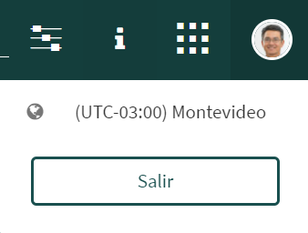](_images/image854.png)

Para la edición de la zona horaria se debe seleccionar la opción “Usuario actual” del menú. Esto abrirá un panel derecho con la lista de zonas horarias disponibles. Luego de seleccionada la zona horaria, al guardar el panel, la página se refrescará automáticamente para que el cambio tenga efecto. Se debe tener en cuenta que si se tiene más ventanas abiertas de alguna de las herramientas de Qflow, deben ser refrescadas manualmente para que el cambio tenga efecto.

[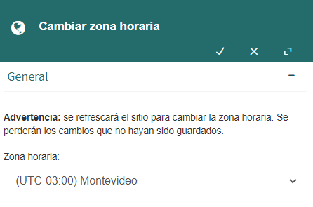](_images/image885.png)

#### Pantalla principal[](#pantalla-principal "Link to this heading")

Cuando un usuario ingresa a Qflow Team, o cuando hace clic en el ícono de la herramienta en la parte superior izquierda, Qflow le muestra la página principal.

En la página principal se encuentran los siguientes elementos:

*   **Indicador de usuarios habilitados:** permite visualizar la cantidad de usuarios que se encuentran habilitados actualmente. Además, nos indica cómo es esta cantidad con respecto a la permitida por la licencia actual.
    
*   **Historial de usuarios habilitados:** permite visualizar la cantidad de usuarios habilitados en los últimos 12 meses.
    
*   **Sesiones recientes:** permite visualizar los 10 inicios de sesión más recientes teniendo en cuenta todas las herramientas de Qflow.
    

[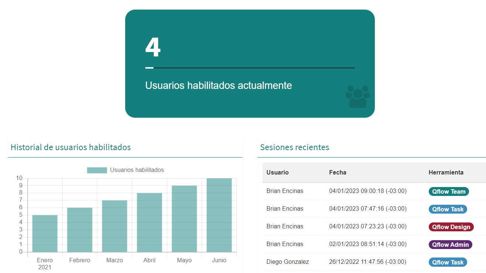](_images/image4cloud.png)

Figura 661 Pantalla principal de Qflow Cloud[](#id14 "Link to this image")

Diferencia de versiones

A diferencia de la versión **Cloud** del producto, en la versión **OnPremise** no se encuentra la gráfica “Historial de usuarios habilitados”.

[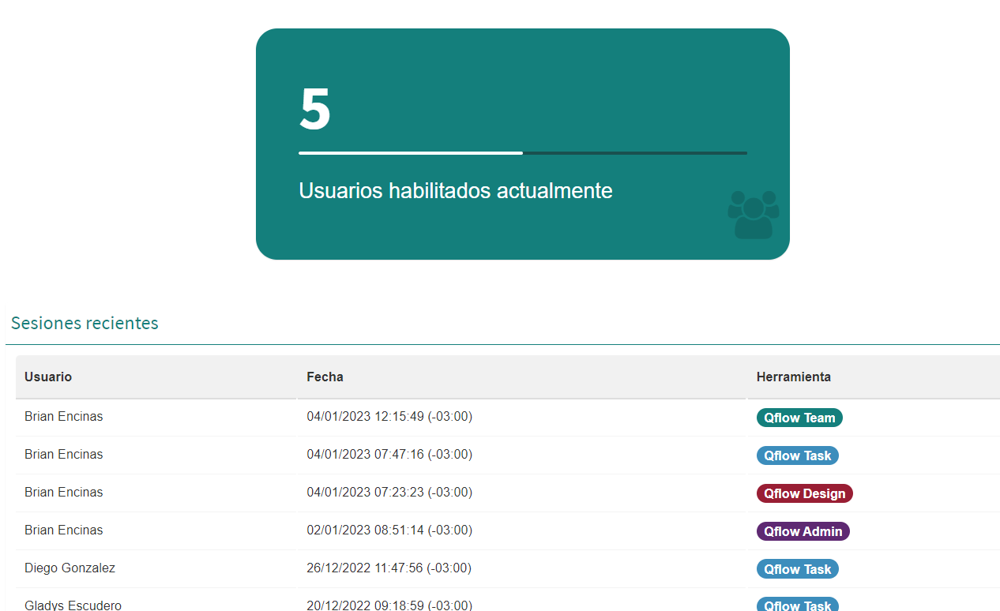](_images/image4onpremise.png)

Figura 662 Pantalla principal de Qflow OnPremise[](#id15 "Link to this image")

#### Menú lateral[](#menu-lateral "Link to this heading")

El menú lateral permite mostrar u ocultar el árbol de nodos organizacionales, así como también mostrar los nodos deshabilitados que se encuentran en él. También se puede acceder de forma rápida a la operación común “Nuevo nodo organizacional”, que está disponible de igual forma a través de los menús contextuales de los elementos del árbol.

Figura 663 Menú lateral[](#id16 "Link to this image")

#### Árbol de nodos organizacionales[](#arbol-de-nodos-organizacionales "Link to this heading")

Un nodo se puede mostrar abierto (se muestran sus hijos) o cerrado (no se muestran). Para abrir un nodo, haga clic en el triángulo que está a su izquierda y que indica si está abierto o cerrado. Por ejemplo, en la [Figura 664](#nodetree) los nodos Raíz y Operaciones están abiertos y el nodo Administración está cerrado. Se puede ver que el nodo Operaciones contiene otros dos nodos: Mantenimiento y Producción.

[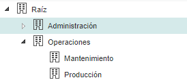](_images/image816.png)

Figura 664 Árbol de nodos organizacionales[](#id17 "Link to this image")

También es posible mover nodos de lugar arrastrándolos del lugar de origen hacía el lugar de destino. Para realizar esto, haga clic en el nodo que desea mover, arrástrelo hasta el lugar de destino y suelte el clic.

Si se hace doble clic en un nodo del árbol, en el panel principal se abre un listado con los grupos y usuarios que pertenecen al nodo seleccionado en el árbol ([Figura 665](#nodepanel)).

[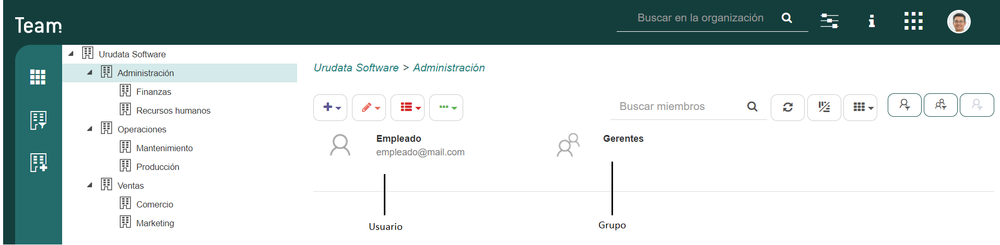](_images/image917.png)

Figura 665 Panel de propiedades de un elemento del árbol[](#id18 "Link to this image")

En la parte superior del lado izquierdo hay una barra de herramientas. La [Figura 666](#toolbar) muestra los elementos de dicha barra y posteriormente se describe qué función cumplen.

[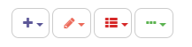](_images/image1016.png)

Figura 666 Barra de herramientas del panel izquierdo[](#id19 "Link to this image")

[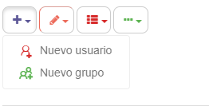](_images/image1116.png)

Figura 667 Barra de herramientas – Nuevo usuario/grupo[](#id20 "Link to this image")

*   **Nuevo usuario:** crea un nuevo usuario. Cuando el usuario hace clic sobre este ícono, se despliega un panel que permite ingresar el nombre del usuario, una descripción y sus datos principales como correo electrónico y _login_. Luego de creado, por defecto manda un mail de bienvenida al usuario. Más detalles en [Propiedades de los usuarios](#propiedades-de-los-usuarios).
    
*   **Nuevo grupo:** crea un nuevo grupo. Cuando el usuario hace clic sobre este ícono, Qflow despliega un panel que permite ingresar el nombre del grupo y una descripción. Más detalles en [Propiedades de los grupos](#propiedades-de-los-grupos).
    

[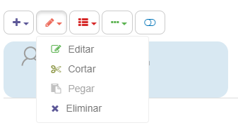](_images/image1216.png)

Figura 668 Barra de herramientas – Editar/Cortar/Pegar/Eliminar[](#id21 "Link to this image")

*   **Editar:** cuando el usuario hace clic sobre este ícono, se muestra un panel que permite editar los datos del usuario o grupo seleccionado. Otra forma de acceder a esta opción es seleccionar el elemento que se desea editar y después hacerle doble clic.
    
*   **Cortar y pegar:** estas opciones permiten cortar el usuario o grupo seleccionado de un nodo para luego pegarlo en otro nodo. Es decir, permite mover el usuario o grupo seleccionado de lugar. Esta es la única forma de realizarlo ya que no se permite arrastrar usuarios o grupos de un nodo a otro.
    
*   **Eliminar:** cuando el usuario hace clic sobre este ícono, se muestra un mensaje de advertencia y si se hace clic en el botón Ok, elimina el usuario o grupo seleccionado.
    

[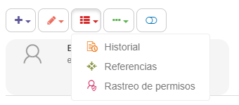](_images/image1315.png)

Figura 669 Barra de herramientas – Historial/Referencias/Rastreo de permisos[](#id22 "Link to this image")

*   **Historial:** muestra un panel donde lista las modificaciones realizadas sobre el elemento seleccionado (nodo, usuario o grupo), junto a las fechas en que fueron realizadas y el nombre del usuario que las realizó ([Figura 670](#nodehistory)). También se indica en qué zona horaria está la fecha que se está mostrando.
    

[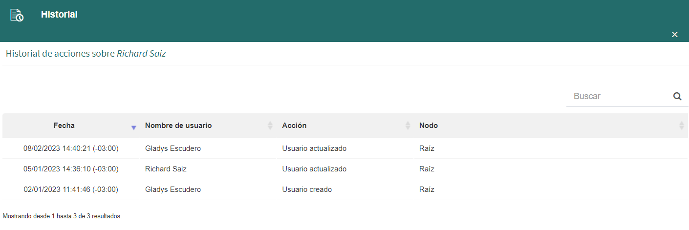](_images/image1415.png)

Figura 670 Historial de un nodo[](#id23 "Link to this image")

*   **Referencias:** muestra los elementos relacionados con el objeto seleccionado, incluidos los roles de plantilla de procesos, roles de seguridad, nodos, grupos y definiciones de seguridad. Por ejemplo, si un usuario tiene permisos sobre Qflow Team, al visualizar las referencias de ese usuario, aparecen esos permisos ([Figura 671](#userreference)). Las referencias que podrá visualizar de un usuario son: Auditoría de paquetes, auditoría de procesos, procesos, adjuntos, roles de procesos, pasos de procesos, acciones temporales, etapas de procesos, grupos, supervisados, sustituidos, permisos, paquetes, roles de plantilla de proceso, vínculos y auditoría de nodos.
    

[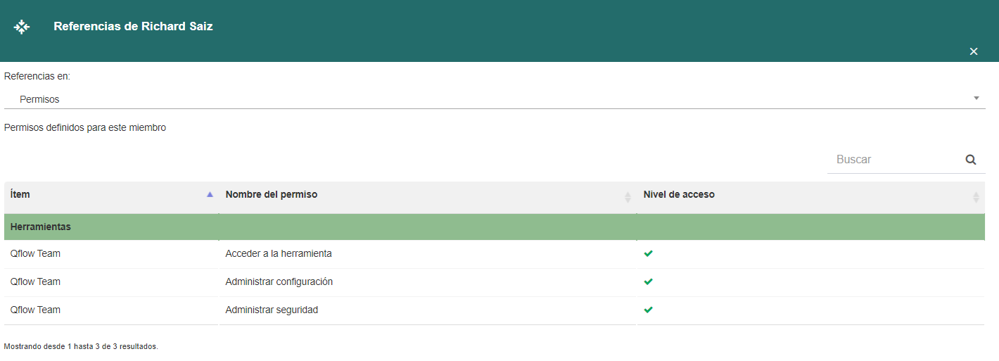](_images/image1515.png)

Figura 671 Referencias a un usuario[](#id24 "Link to this image")

*   **Rastreo de permisos:** esta opción está disponible solamente para los usuarios. Muestra un panel ([Figura 672](#permissiontracking)) en la que aparecen todos los permisos efectivos del usuario con respecto a nodos. Los permisos efectivos son todos los permisos que tiene el usuario, o sea, no solamente los que se le otorgaron directamente, sino también los que se le otorgaron indirectamente, por medio de un grupo, nodo o rol de seguridad. El panel tiene una opción que permite mostrar solamente los permisos que el usuario tiene sobre colas de trabajo.
    

[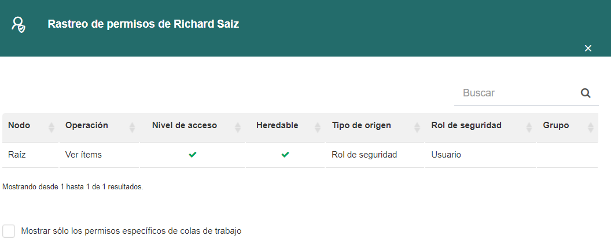](_images/image1615.png)

Figura 672 Rastreo de permisos[](#id25 "Link to this image")

[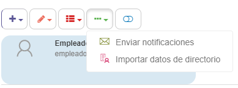](_images/image1715.png)

Figura 673 Barra de herramientas – Enviar notificaciones/Importar datos de directorio[](#id26 "Link to this image")

*   **Enviar notificaciones**: permite reenviar al usuario los mensajes correspondientes a sus tareas activas, en un determinado período.
    
*   **Importar datos de directorio**: permite cargar los datos del usuario con datos importados de un directorio (por ejemplo, _Active Directory_). Más detalles en [Importación de datos de un usuario desde un directorio](#importacion-de-datos-de-un-usuario-desde-un-directorio).
    

[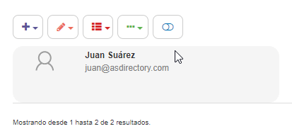](_images/image18.gif)

Figura 674 Barra de herramientas – Deshabilitar/Habilitar miembros[](#id27 "Link to this image")

*   **Deshabilitar/Habilitar miembros:** esta opción permite deshabilitar o habilitar los usuarios y grupos. Recuerde que cada usuario habilitado consume una licencia de Qflow.
    

En la parte superior del lado derecho también hay una barra de herramientas. La [Figura 675](#righttoolbar) muestra los elementos de dicha barra y describe qué función cumplen:

[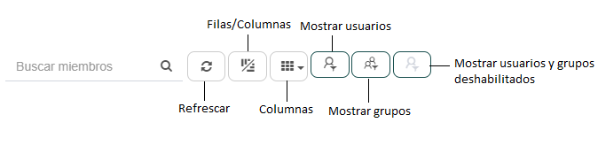](_images/image1915.png)

Figura 675 Barra de herramientas del panel derecho[](#id28 "Link to this image")

A continuación, se describen las operaciones mencionadas en la figura:

*   **Buscar miembros:** permite escribir un pequeño texto y filtra los usuarios y grupos de acuerdo con este, mostrando sólo aquellos cuyos nombres lo contengan.
    
*   **Refrescar:** vuelve a cargar los usuarios y grupos, haciendo que refleje modificaciones realizadas en otros equipos después de la última vez en que fue cargado.
    
*   **Filas/Columnas:** permite modificar la forma como Qflow muestra los usuarios y grupos en el panel.
    
    *   **Filas:** es la opción por defecto, como se puede ver en la [Figura 665](#nodepanel). Muestra los grupos y usuarios como una lista de íconos grandes. Además del nombre de cada usuario o grupo, muestra su correo electrónico.
        
    *   **Columnas:** muestra usuarios y grupos como una lista de íconos pequeños. Además, muestra el correo electrónico, descripción (opcional) y el estado (habilitado o deshabilitado) de cada usuario y grupo.
        
*   **Columnas:** esta opción permite elegir si se desea o no, mostrar la descripción de cada usuario y grupo en la forma de visualización de tipo columna detallada previamente.
    
*   **Mostrar usuarios:** muestra u oculta los usuarios. Si el botón está activado como en la [Figura 675](#righttoolbar), los muestra. De lo contrario, los oculta.
    
*   **Mostrar grupos:** muestra u oculta los grupos. Si el botón está activado como en la [Figura 675](#righttoolbar), los muestra. De lo contrario, los oculta.
    
*   **Mostrar usuarios y grupos deshabilitados:** si este botón está activado, Qflow muestra en el panel principal los usuarios y grupos deshabilitados. De lo contrario, no los muestra.
    

#### Menús contextuales[](#menus-contextuales "Link to this heading")

Qflow Team permite realizar algunas de las operaciones disponibles en las barras de herramientas a través de menús contextuales. Para abrir un menú contextual, haga clic con el botón derecho en el elemento sobre el que desea efectuar la operación. Por ejemplo, para crear un nodo en el árbol, haga clic sobre el nodo que desea que contenga el nuevo nodo. Si selecciona varios elementos y hace clic con el botón derecho sobre la selección, Qflow mostrará también el menú contextual, pero en este caso el menú no tendrá aquellas opciones que correspondan a operaciones que no pueden ser realizadas sobre varios elementos simultáneamente. La [Figura 676](#treecontextmenu) muestra el menú contextual del árbol. La [Figura 677](#userandgroupcontextmenu) muestra los menús contextuales de los usuarios y de los grupos.

[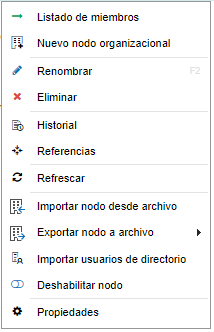](_images/image2013.png)

Figura 676 Menú contextual del árbol de nodos[](#id29 "Link to this image")

[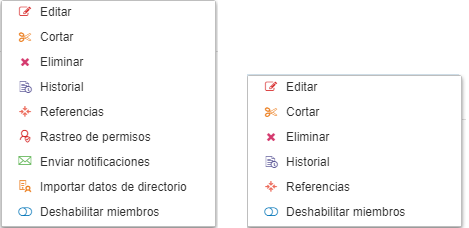](_images/image2114.png)

Figura 677 Menú contextual de los usuarios (izquierda) y de los grupos (derecha)[](#id30 "Link to this image")

A continuación, se describen las operaciones de los menús contextuales que no hayan sido explicadas previamente en la barra de herramientas de la sección [Árbol de nodos organizacionales](#arbol-de-nodos-organizacionales):

*   **Listado de miembros:** muestra los usuarios y grupos que contiene el nodo sobre el que se hizo clic.
    
*   **Nuevo nodo organizacional:** crea un nodo organizacional dentro del nodo sobre el que se hizo clic.
    
*   **Renombrar:** permite cambiar el nombre del nodo seleccionado sin necesidad de abrir su formulario de propiedades. Esa opción es similar a la opción que permite renombrar un archivo o directorio en Windows. Cuando uno la selecciona, el nombre del elemento queda seleccionado y aparece un cursor que permite modificar el texto.
    
*   **Eliminar:** elimina el objeto seleccionado.
    
*   **Refrescar:** actualiza la estructura del árbol, desde el nodo seleccionado hacia abajo.
    
*   **Importar nodo desde archivo:** importa un nodo (es decir, toda la rama definida por un nodo) que fue exportada en algún otro ambiente y lo coloca dentro del nodo seleccionado. Cuando se importan elementos cuyos identificadores coinciden con elementos ya existentes, éstos son actualizados con los datos importados, pero si estaban en otro nodo, son movidos hacia el nodo seleccionado. Más detalles en [Importar nodo desde archivo](#importar-nodo-desde-archivo).
    
*   **Exportar nodo a archivo:** exporta a un archivo la rama definida por el nodo seleccionado. Este archivo puede ser utilizado más tarde para importar la rama exportada en otro ambiente en el que Qflow esté instalado. Además del nodo seleccionado y su contenido (nodos descendientes, usuarios, grupos) se exportan todos los proveedores de seguridad, calendarios y roles del sistema. Más detalles en [Exportar nodo a archivo](#exportar-nodo-a-archivo).
    
*   **Importar usuarios de directorio:** permite, en un nodo, importar usuarios de un directorio, como _Active Directory_. Más detalles en [Importación de usuarios de directorio](#importacion-de-usuarios-de-directorio).
    
*   **Propiedades:** muestra el panel de propiedades del nodo seleccionado.
    

### Especificación de Ruta LDAP[](#especificacion-de-ruta-ldap "Link to this heading")

Nodos, usuarios y grupos tienen una propiedad en la que se puede especificar una ruta LDAP para poder sincronizar sus datos con los de un servicio de directorio. La propiedad está en el grupo “Avanzado” del panel de propiedades de un nodo, grupo o usuario ([Figura 678](#groupadvance)).

[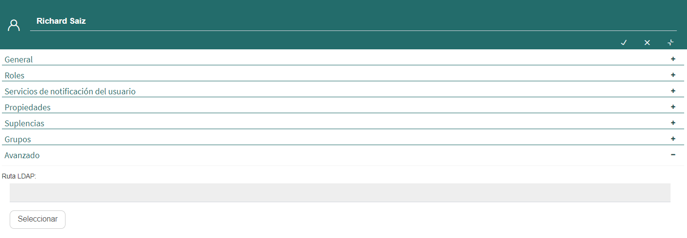](_images/image2214.png)

Figura 678 Grupo “Avanzado” del formulario de propiedades de un usuario[](#id31 "Link to this image")

**Para elegir la ruta:**

1.  Haga clic en “Seleccionar”. Esto hace que Qflow muestre un panel como el de la [Figura 679](#ldappathselection) , en la cual se puede elegir el elemento del directorio que corresponda al nodo, usuario o grupo.
    

[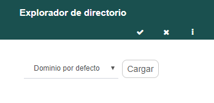](_images/image2315.png)

Figura 679 Selección de la ruta LDAP[](#id32 "Link to this image")

2.  Seleccione el dominio que desee, en la lista que figura a la izquierda del botón “Cargar” y haga clic en este botón. Esto cargará la lista que aparece en la parte inferior del panel ([Figura 680](#directorybrowser)). Éste muestra unidades organizacionales (“_organizational units_”) del directorio y permite seleccionar alguna de ellas, o algún grupo. Para ver un grupo, abra la unidad organizacional a la que pertenece ([Figura 681](#openorgunit)).
    

[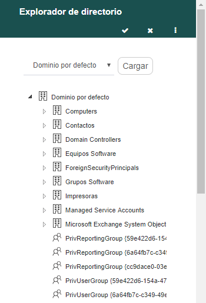](_images/image2413.png)

Figura 680 Explorador de directorio con nodos cargados[](#id33 "Link to this image")

[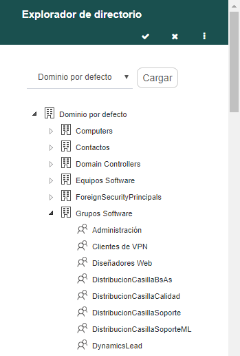](_images/image2514.png)

Figura 681 Una unidad organizacional abierta con todos sus grupos[](#id34 "Link to this image")

3.  Seleccione en la lista el elemento que desee asociar al nodo, usuario o grupo que está modificando y haga clic en “Aceptar”. Puede seleccionar un grupo o un nodo del directorio.
    
4.  Si está especificando una ruta LDAP para un usuario, el procedimiento es el mismo, excepto que existe una tabla adicional que muestra todos los usuarios del elemento seleccionado ([Figura 682](#directorydataimport)). Si hay muchos usuarios en ese elemento, puede filtrar la lista de usuarios utilizando la búsqueda rápida que aparece sobre la lista. Si usted había creado un usuario e importa sus datos, el nombre del usuario cambiará y pasará a ser el nombre importado.
    

Figura 682 Importador de datos de directorio con usuarios cargados[](#id35 "Link to this image")

### Propiedades de los nodos[](#propiedades-de-los-nodos "Link to this heading")

Para modificar las propiedades de un nodo, búsquelo en el árbol de nodos organizacionales, hágale clic derecho y seleccione la opción “Propiedades” del menú contextual. Qflow mostrará el panel que se muestra en la [Figura 683](#nodeproperties).

El formulario divide las propiedades de un nodo en los siguientes grupos:

*   **General:** muestra y permite modificar el nombre, la descripción y el estado habilitado o no habilitado.
    
*   **Propiedades:** muestra y permite modificar propiedades adicionales del nodo. Las propiedades adicionales no están definidas en Qflow, sino que son propiedades que la organización define para que complementen las propiedades que ya vienen con el producto.
    
*   **Roles:** permite agregar y quitar roles de seguridad, asociándolos al nodo.
    
*   **Supervisores:** muestra la lista de usuarios y grupos que actúan como supervisores del nodo y permite modificar la lista.
    
*   **Avanzado:** muestra y permite modificar el comportamiento de cola de trabajo y sincronización con directorio.
    
*   **Seguridad:** permite especificar qué usuarios, grupos y roles de seguridad tienen permisos sobre el nodo y cuáles son esos permisos.
    

El grupo “General” es el único que se muestra por defecto. Para que aparezcan los grupos descriptos posteriormente, despliéguelos haciendo clic en el botón “+”.

Figura 683 Propiedades de un nodo[](#id36 "Link to this image")

#### General[](#general "Link to this heading")

Son las mismas propiedades que las que pueden ser modificadas al crear el nodo.

*   **Nombre:** es el nombre que aparece al lado del nodo en el árbol. En la [Figura 683](#nodeproperties), el nombre es “Administración”.
    
*   **Descripción:** breve descripción del nodo.
    
*   **Habilitado:** permite habilitar o deshabilitar el nodo. Si un nodo no está habilitado, tiene color gris en el árbol.
    

#### Propiedades[](#propiedades "Link to this heading")

El grupo “Propiedades” muestra las propiedades adicionales del nodo. Por más información acerca de las propiedades adicionales, vaya a la sección [Propiedades adicionales](#propiedades-adicionales).

#### Roles[](#roles "Link to this heading")

El grupo “Roles” (ver [Figura 684](#rolegroup)) permite definir los roles de seguridad del nodo. Los formularios de propiedades de usuarios y grupos también tienen este grupo, que funciona de la misma forma que para los nodos.

[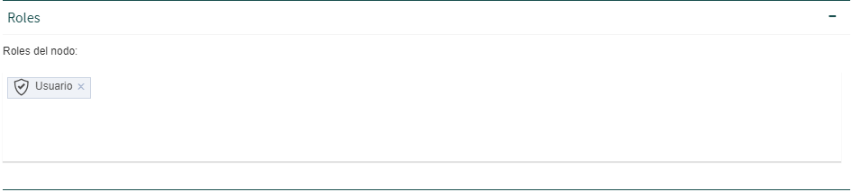](_images/image285.png)

Figura 684 Grupo “Roles” con los roles de un nodo[](#id37 "Link to this image")

**Para agregar un rol al nodo**, escriba parte del nombre del destinatario al que quiera agregar como rol en donde dice “Comienza a escribir…”, y cuando lo vea en la lista que Qflow muestra, selecciónelo.

**Para eliminar un rol del nodo**, simplemente haga clic en el símbolo “x” que aparece al lado del rol.

Nótese que esto no elimina el rol. Sólo lo quita de la lista de roles del nodo que se está modificando.

#### Supervisores[](#supervisores-1 "Link to this heading")

El grupo “Supervisores” (ver [Figura 685](#supervisorgroup)) permite agregar o quitar usuarios y grupos a la lista de supervisores del nodo. El panel de propiedades de un grupo también tiene un grupo igual, que funciona como éste.

[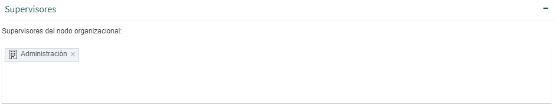](_images/image295.png)

Figura 685 Grupo “Supervisores” con los supervisores de un nodo[](#id38 "Link to this image")

**Para agregar un supervisor al nodo**, escriba parte del nombre del usuario o grupo al que quiera agregar como supervisor donde dice “Comienza a escribir…”, y cuando lo vea en la lista que Qflow muestra, selecciónelo.

**Para eliminar un supervisor al nodo**, simplemente haga clic en el símbolo “x” que aparece al lado del rol.

#### Avanzado[](#avanzado "Link to this heading")

El grupo “Avanzado” ([Figura 686](#advancenodegroup)) permite configurar el nodo para que se comporte como una cola de trabajo, y configurar esa cola de trabajo. También permite especificar una ruta LDAP para el nodo (ver [Especificación de Ruta LDAP](#especificacion-de-ruta-ldap)).

Para que el nodo se comporte como una cola de trabajo, marque la opción **Comportamiento de cola de trabajo**. Cuando un nodo tiene comportamiento de cola de trabajo, puede ser seleccionado como miembro de roles de plantilla de procesos y así, ser destinatario de tareas de procesos de trabajo. Cualquier usuario que tenga permisos para contestar las tareas de la cola podrá tomar una de esas tareas y contestarla.

Cuando un nodo es una cola de trabajo, el botón “**Configuración**” queda habilitado. Ese botón permite configurar los permisos y la vigencia de la cola de trabajo. Cuando se le hace clic en ese botón, aparecen las propiedades de la cola de trabajo ([Figura 688](#workqueuepropertiesform)).

[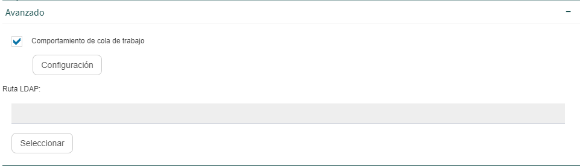](_images/image305.png)

Figura 686 Grupo “Avanzado” de un nodo[](#id39 "Link to this image")

##### Configuración de cola de trabajo[](#configuracion-de-cola-de-trabajo "Link to this heading")

Para acceder a la configuración de cola de trabajo, además de poder hacerlo desde el formulario de propiedades de un nodo, es posible desde el árbol de nodos, cuando éste sea una cola de trabajo. Por lo tanto, para acceder directamente, haga clic derecho sobre la cola de trabajo y luego en “Propiedades de cola de trabajo” como muestra la [Figura 687](#workqueuepropertiesaccess).

[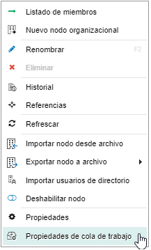](_images/image319.png)

Figura 687 Acceder a propiedades de cola de trabajo desde el árbol de nodos[](#id40 "Link to this image")

El formulario de propiedades de una cola de trabajo tiene los siguientes grupos:

*   Seguridad
    
*   Permisos
    
*   Notificaciones
    
*   Avanzado
    

El grupo “Seguridad” del formulario de propiedades de una cola de trabajo permite definir los permisos sobre la misma. La columna muestra la lista de los usuarios, grupos y roles para los cuales se definieron permisos y la lista de permisos.

El grupo “Seguridad” es el único que se muestra por defecto. Para que aparezcan los grupos descriptos posteriormente, despliéguelos haciendo clic en el símbolo “+”.

**Para agregar un usuario, grupo o rol:**

1.  Haga clic en botón “Agregar”. Eso hace que aparezca en la parte superior de dicho botón un texto que dice “Comienza a escribir…”. Escriba parte del nombre del usuario, grupo o rol deseado.
    
2.  Cuando lo vea en la lista que Qflow muestra, selecciónelo.
    

[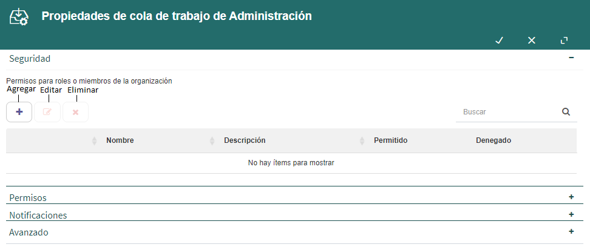](_images/image324.png)

Figura 688 Formulario propiedades de una cola de trabajo[](#id41 "Link to this image")

Una vez agregados los usuarios, grupos o roles, es posible definir qué permisos tiene cada uno de ellos. Para hacer eso, marque “Permitido” o “Denegado” al lado de cada permiso como se muestra en la [Figura 689](#workqueuesecuritygroup). Si marca la opción “Heredable”, el permiso se aplicará recursivamente. Esto quiere decir que el usuario, rol o grupo seleccionado tendrá permiso sobre el nodo que se está editando y, además, sobre todos los nodos descendientes de ese nodo. Por ejemplo, para que un gerente tenga permisos de “Visualizar” las tareas de las colas de trabajo de toda una rama de la organización se le puede otorgar permisos de “Visualizar” sobre el nodo raíz de esa rama y seleccionar la opción “Heredable”. Los posibles permisos son:

*   **Visualizar:** permite acceder a la bandeja de entrada de la cola de trabajo.
    
*   **Actuar:** permite contestar una tarea de la cola de trabajo.
    
*   **Firmar:** este permiso no tiene utilidad en Qflow, pero se usa en Q-expeditive, que está construido sobre la base de Qflow. Permite firmar.
    

[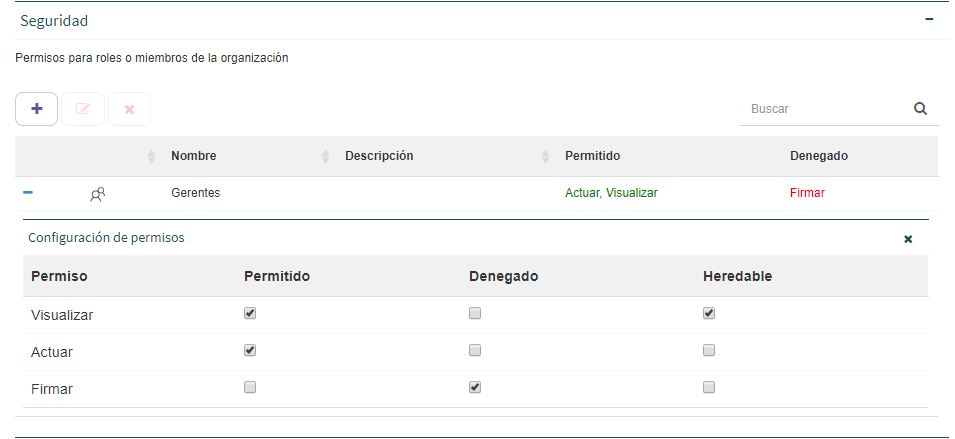](_images/image335.png)

Figura 689 Grupo “Seguridad” de una cola de trabajo - Configuración de permisos[](#id42 "Link to this image")

**Para editar permisos a un usuario, grupo o rol:**

1.  Seleccione el elemento al que quiera editarle los permisos y haga clic en el botón “Editar”. Qflow volverá a mostrar el formulario “Configuración de permisos”.
    
2.  Seleccione las acciones que quiera permitir o denegar en el nuevo permiso.
    

**Para eliminar permisos a un usuario, grupo o rol:**

1.  Seleccione el elemento al que quiera eliminarle los permisos y posteriormente haga clic en el botón “Eliminar”.
    
2.  Qflow mostrará un mensaje de advertencia. Haga clic en el botón “Si” y se eliminarán todos los permisos para el elemento seleccionado.
    

El grupo “Permisos” del formulario de propiedades de una cola de trabajo ([Figura 690](#userswitheffectivepermissions)) muestra una lista de los usuarios que tienen permisos efectivos sobre esa cola. Los permisos efectivos son todos los permisos que tiene el usuario, o sea, no solamente los que se le otorgaron directamente, sino también los que se le otorgaron indirectamente, por medio de un grupo, nodo o rol de seguridad. Para cada usuario se muestra cuáles de los tres permisos posibles (visualizar, actuar y firmar) tiene efectivamente.

[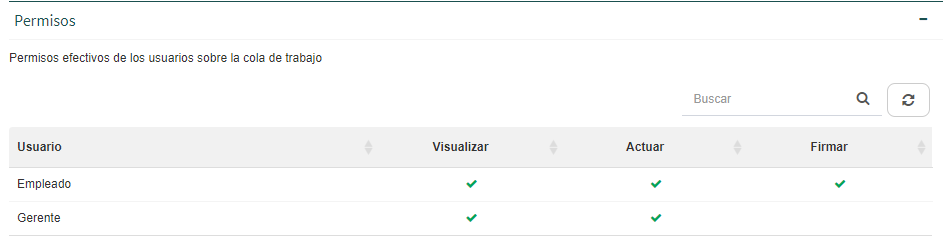](_images/image345.png)

Figura 690 Usuarios que tienen permisos efectivos sobre una cola de trabajo[](#id43 "Link to this image")

El grupo “Notificaciones” del formulario de propiedades de una cola de trabajo permite especificar el envío de notificaciones cuando ocurre algún evento relacionado con la cola. Para especificar los eventos que deben disparar notificaciones, marque las opciones que desee de entre las siguientes:

*   **Notifica de nuevas tareas:** si esta opción está marcada, Qflow enviará notificaciones cada vez que una nueva tarea sea asignada a la cola.
    
*   **Notifica de acciones de tiempo:** si esta opción está marcada, Qflow enviará notificaciones cada vez que se active alguna acción de tiempo como, por ejemplo, un vencimiento o un recordatorio.
    
*   **Notifica de la firma de tareas:** esta opción está pensada para cuando Qflow se utiliza en conjunto con Q-expeditive, software de expediente electrónico de Urudata y hace que Qflow envíe una notificación cuando se firma una actuación de un trámite de Q-expeditive.
    
*   **Define una lista personalizada de destinatarios de notificaciones:** si marca esta opción, debe seleccionar los usuarios que recibirían las notificaciones. De lo contrario, éstas serán enviadas a todos los miembros de la cola de trabajo. Para agregar un destinatario, escriba parte de su nombre donde dice “Comienza a escribir…”, y cuando lo vea en la lista que Qflow muestra, selecciónelo ([Figura 691](#addaddressee)). Para quitar un destinario de la lista, simplemente haga clic en el símbolo “x” que aparece al lado del destinatario.
    

Figura 691 Agregar destinatario a una lista personalizada de notificaciones[](#id44 "Link to this image")

El grupo “Avanzado” del formulario de propiedades de una cola de trabajo permite definir la vigencia de la cola. Para definir un período de vigencia, marque la opción “Define período de vigencia” y seleccione la fecha de inicio del período (“Desde”) y la de finalización del período (“Hasta”). El nodo sólo se comportará como cola de trabajo durante ese período.

[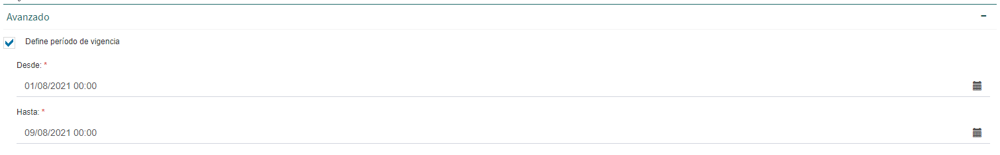](_images/image364.png)

Figura 692 Grupo “Avanzado” del formulario de propiedades de una cola de trabajo[](#id45 "Link to this image")

#### Seguridad[](#seguridad "Link to this heading")

El grupo “Seguridad” (ver [Figura 693](#nodesecurityconfiguration)) permite definir quiénes tienen permisos para realizar operaciones sobre el nodo y cuáles son esos permisos. Las entidades que pueden estar asociadas a permisos sobre un nodo son los usuarios, los grupos y los roles de seguridad.

[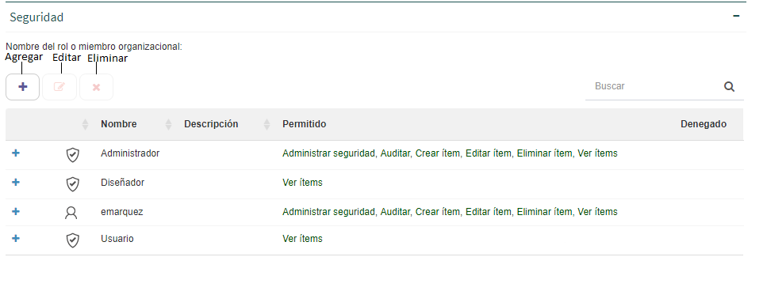](_images/image374.png)

Figura 693 Configuración de seguridad de un nodo[](#id46 "Link to this image")

**Para agregar un usuario, grupo o rol de seguridad al conjunto de entidades que tienen permisos sobre el nodo:**

1.  Haga clic en botón “Agregar”. Eso hace que aparezca en la parte superior de dicho botón un texto que dice “Comienza a escribir…”. Escriba parte del nombre del usuario, grupo o rol deseado.
    
2.  Cuando lo vea en la lista que Qflow muestra, selecciónelo.
    

Una vez agregados los usuarios, roles y grupos, es posible definir qué permisos tienen cada uno de ellos. Esto se hace marcando los casilleros “Permitir” o “Denegar” al lado de cada permiso como se muestra en la [Figura 694](#securitygrouppermissionsettings). Para cada permiso se puede especificar si es heredable o no. Si un permiso sobre un nodo es heredable, el usuario, grupo o rol que lo tenga también lo tendrá para los nodos descendientes de ese nodo. Por ejemplo, el permiso “Ver ítem” permite ver el nodo, pero si es heredable, también permite ver sus nodos descendientes.

Los posibles permisos son:

*   **Ver ítems:** permite ver el nodo.
    
*   **Editar ítem**: permite modificar el nodo.
    
*   **Crear ítem:** permite crear nodos dentro del nodo.
    
*   **Eliminar ítem:** permite borrar el nodo.
    
*   **Auditar ítem:** permite visualizar información de auditoría del nodo.
    
*   **Administrar seguridad**: permite agregar y modificar permisos sobre el nodo.
    

Por una explicación detallada acerca del funcionamiento de los permisos de Qflow, consulte la sección [Manejo de permisos en Qflow](#manejo-de-permisos-en-qflow) de este manual.

[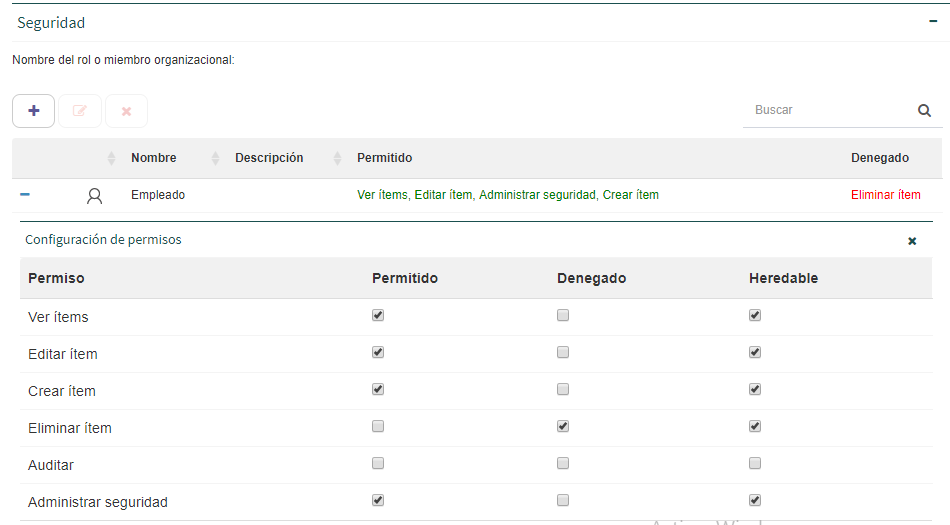](_images/image384.png)

Figura 694 Grupo “Seguridad” – Configuración de permisos[](#id47 "Link to this image")

**Para editar permisos a un usuario, grupo o rol:**

1.  Seleccione el elemento al que quiera editarle los permisos y haga clic en el botón “Editar”, o haga clic en el símbolo “+” que se encuentra al lado del elemento.
    
2.  Qflow volverá a mostrar el formulario “Configuración de permisos”. Seleccione las acciones que quiera permitir o denegar en el nuevo permiso.
    

**Para eliminar permisos a un usuario, grupo o rol:**

1.  Seleccione el elemento al que quiera eliminarle los permisos y posteriormente haga clic en el botón “Eliminar”.
    
2.  Qflow mostrará un mensaje de advertencia. Haga clic en el botón “Si” y se eliminarán todos los permisos para el elemento seleccionado.
    

### Propiedades de los grupos[](#propiedades-de-los-grupos "Link to this heading")

Para modificar las propiedades de un grupo, selecciónelo y haga doble clic sobre él. Qflow mostrará el panel que se muestra en la [Figura 695](#groupproperties):

[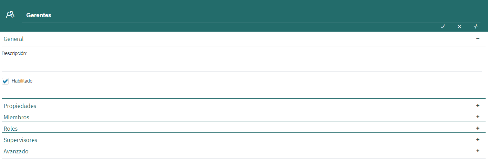](_images/image395.png)

Figura 695 Propiedades de un grupo[](#id48 "Link to this image")

El formulario divide las propiedades de un grupo en:

*   **General:** permite ver y modificar las propiedades que identifican el grupo.
    
*   **Propiedades:** permite ver y modificar las propiedades extendidas del grupo.
    
*   **Miembros:** permite agregar y quitar usuarios y grupos.
    
*   **Miembro de:** muestra a qué grupos pertenece el grupo que se está editando.
    
*   **Roles:** permite agregar y quitar roles de seguridad, asociándolos al grupo. Funciona de la misma forma que el grupo “Roles” de los nodos.
    
*   **Supervisores:** muestra la lista de usuarios y grupos que actúan como supervisores del grupo, y permite modificar la lista. Funciona de la misma forma que el grupo “Supervisores” de los nodos.
    
*   **Avanzado:** permite asociar el grupo a un grupo de _Active Directory_ o de otro directorio mediante una ruta LDAP. Qflow utilizará esta ruta cuando sincronice los datos del modelo organizacional con los del directorio. El procedimiento para modificarla es igual al procedimiento para modificar la ruta LDAP de un nodo, descrito más arriba.
    

El grupo “General” es el único que se muestra por defecto. Para que aparezcan los grupos descriptos posteriormente, despliéguelos haciendo clic en el símbolo “+”.

#### General[](#general-1 "Link to this heading")

Las propiedades generales son:

*   **Nombre**: es el nombre del grupo. Aparece al lado de cada ícono que representa un grupo.
    
*   **Descripción:** breve descripción del grupo.
    
*   **Habilitado:** marcando o desmarcando el casillero se puede habilitar o deshabilitar un grupo. Un grupo deshabilitado no es tenido en cuenta por Qflow, pero puede volver a ser habilitado. Si un grupo no está habilitado, el ícono que lo representa se muestra en color gris.
    

#### Propiedades[](#propiedades-1 "Link to this heading")

El grupo “Propiedades” muestra las propiedades adicionales del grupo. Por más información acerca de las propiedades adicionales, vea [Propiedades adicionales](#propiedades-adicionales).

#### Miembros[](#miembros "Link to this heading")

El grupo “Miembros” muestra los usuarios y grupos que son miembro del grupo y permite agregar o quitar miembros. La [Figura 696](#membersgroup) muestra el grupo mencionado.

[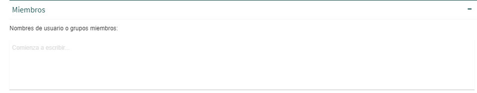](_images/image405.png)

Figura 696 Grupo “Miembros”[](#id49 "Link to this image")

**Para agregar un miembro a un grupo:**

1.  Donde dice “Comienza a escribir…”, escriba parte del nombre del usuario o grupo deseado.
    
2.  Cuando Qflow despliegue la lista, seleccioné el usuario o grupo que desee agregar como miembro.
    

### Propiedades de los usuarios[](#propiedades-de-los-usuarios "Link to this heading")

Para modificar las propiedades de un usuario, selecciónelo y haga doble clic sobre él. Qflow mostrará el panel que se muestra en la [Figura 697](#userproperties):

[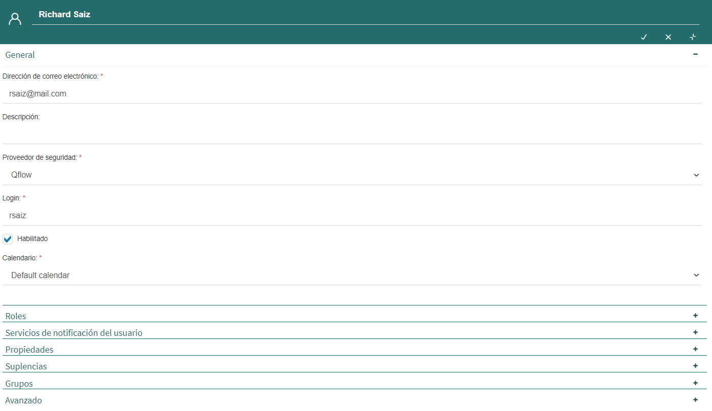](_images/image417.png)

Figura 697 Propiedades de un usuario[](#id50 "Link to this image")

El formulario divide las propiedades de un usuario en los siguientes grupos:

*   **General:** tiene las propiedades que identifican el usuario y permite habilitarlo y deshabilitarlo.
    
*   **Servicios de notificación del usuario:** contiene las opciones de correo del usuario, utilizadas para enviarle notificaciones.
    
*   **Propiedades:** permite agregar propiedades al usuario.
    
*   **Suplencias:** permite definir suplencias para el usuario.
    
*   **Miembro de:** muestra los grupos a los que el usuario pertenece.
    
*   **Roles:** permite agregar y quitar roles de seguridad, asociándolos al usuario. Funciona de la misma forma que el grupo “Roles” de los nodos.
    
*   **Avanzado:** permite asociar el usuario a un usuario de _Active Directory_ o de otro directorio mediante una ruta LDAP. Qflow utilizará esta ruta cuando sincronice los datos del modelo organizacional con los datos del directorio. El procedimiento para modificarla es similar al procedimiento que permite importar los datos del usuario (ver [Importación de datos de un usuario desde un directorio](#importacion-de-datos-de-un-usuario-desde-un-directorio)). Los paneles que aparecen son los mismos, y se debe seleccionar un usuario del directorio. La diferencia es que, al final del proceso, no se importan los datos del usuario, sino que se modifica la ruta LDAP del usuario.
    

El grupo “General” es el único que se muestra por defecto. Para que aparezcan los grupos descriptos posteriormente, despliéguelos haciendo clic en el símbolo “+”.

#### General[](#general-2 "Link to this heading")

Las propiedades generales son:

*   **Nombre**: es el nombre del usuario.
    
*   **Dirección de correo electrónico**
    
*   **Descripción:** breve descripción del usuario.
    
*   **Proveedor de seguridad:** es el proveedor de seguridad que autentica al usuario (por ejemplo, el dominio Windows).
    
*   **Login:** es el nombre de usuario del usuario. Si el proveedor seleccionado es de tipo Google/Microsoft, este valor deberá ser el mail correspondiente (la herramienta no valida que el mail ingresado sea válido).
    
*   **Dirección de mensajería instantánea**
    
*   **Habilitado:** marcando o desmarcando el casillero, se puede habilitar o deshabilitar el usuario. Un usuario deshabilitado no es tenido en cuenta por Qflow y no utiliza licencias de usuario, pero puede volver a ser habilitado. Si un usuario no está habilitado, el ícono que lo representa se muestra en color gris. Usuarios habilitados sí utilizan licencias de Qflow. Si usted habilita un usuario sin tener licencias suficientes para hacerlo, la herramienta le informará y no le permitirá efectuar la operación.
    
*   **Calendario:** es el calendario por el cual se rige el usuario. Usuarios diferentes pueden regirse por calendarios diferentes. Esto es útil, por ejemplo, para el caso de organizaciones con filiales en varios países diferentes que tienen regímenes laborales y feriados distintos.
    

#### Servicios de notificación del usuario[](#servicios-de-notificacion-del-usuario "Link to this heading")

El grupo “Servicio de notificación del usuario” ([Figura 698](#mailoptions)) permite configurar las opciones de correo.

[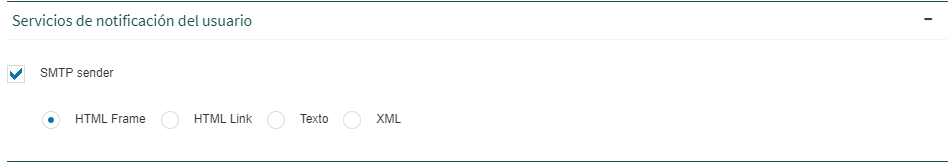](_images/image424.png)

Figura 698 Opciones de correo[](#id51 "Link to this image")

La configuración de correo muestra los servicios de correo que están disponibles y permite marcar uno o más para que sean utilizados para enviarle mensajes al usuario (lo normal es marcar uno; también es posible no marcar ninguno). En la [Figura 698](#mailoptions) sólo se muestra un servicio de correo disponible.

Para cada servicio, se puede especificar cómo los mensajes le serán enviados al usuario:

*   **HTML Frame:** no se envía todo el mensaje, sino que se envía un mensaje que, al ser abierto por ciertos clientes de correo (por ejemplo, Outlook Express), hace que el cliente de correo navegue hasta una página en un servidor. Esa página es la que contiene el cuerpo del mensaje.
    
*   **HTML Link:** se envía un mensaje formateado con HTML que tiene un vínculo a una página que contiene el cuerpo del mensaje.
    
*   **Text Link:** esta opción es similar a la anterior, pero el mensaje es enviado sin formato HTML, como texto plano con un vínculo que puede ser reconocido por algunos clientes de correo (por ejemplo, el de Lotus Notes).
    
*   **XML:** esta opción envía el mensaje como un documento XML que puede ser interpretado por alguna aplicación.
    

#### Propiedades[](#propiedades-2 "Link to this heading")

El grupo “Propiedades” muestra las propiedades adicionales del usuario. Por más información acerca de las propiedades adicionales, vea [Propiedades adicionales](#propiedades-adicionales).

#### Suplencias[](#suplencias-1 "Link to this heading")

El grupo “Suplencias” ([Figura 699](#substitutiongroup)) permite definir suplentes para un usuario durante varios períodos. De esta forma, en caso de ausencia de una persona, se puede definir un suplente para el período en el que ocurra la ausencia. Qflow enviará al suplente todos los mensajes que originalmente estaban dirigidos a esa persona. Así, el suplente podrá realizar todas las tareas de Qflow de la persona que está supliendo.

[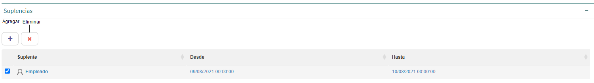](_images/image435.png)

Figura 699 Grupo “Suplencias”[](#id52 "Link to this image")

**Para agregar una suplencia:**

1.  Haga clic en el botón “Agregar…”. Qflow agregará un elemento a la lista con el suplente por defecto “Vacío” y con las fechas del momento en que se crea. ([Figura 700](#addsubstitution)).
    
2.  Haga clic sobre “Vacío” y aparecerá un texto que dice “Comienza a escribir un usuario…” Escriba parte del nombre del usuario que hará la suplencia, y cuando Qflow despliegue la lista, selecciónelo. También se permite seleccionar un grupo. Si un grupo es seleccionado, todos los miembros del grupo podrán actuar como suplentes.
    
3.  Prosiga seleccionando la fecha de comienzo de la suplencia y la fecha de finalización de la suplencia.
    

[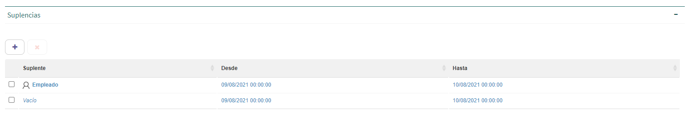](_images/image445.png)

Figura 700 Agregar suplencia[](#id53 "Link to this image")

Es posible agregar varias suplencias. Para eliminar una suplencia, selecciónela y haga clic en el botón “Eliminar”. También se puede modificar una suplencia ya definida. Para hacerlo, seleccione cualquiera de los tres campos (Suplente, Desde o Hasta) de la suplencia que desee modificar y haga clic sobre él ([Figura 701](#updatesubstitution)).

[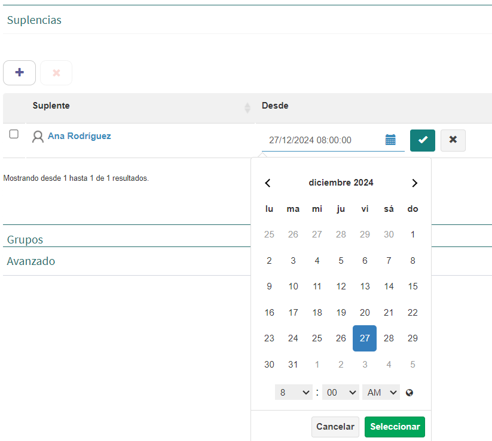](_images/image455.png)

Figura 701 Modificar suplencia[](#id54 "Link to this image")

### Importación de usuarios de directorio[](#importacion-de-usuarios-de-directorio "Link to this heading")

Qflow permite importar usuarios de _Active Directory_ y de otros servicios de directorio compatibles con LDAP. Para importar usuarios a un nodo, haga lo siguiente:

1.  Haga clic con el botón derecho sobre el nodo donde desea importar los usuarios y seleccione en el menú contextual la opción “Importar usuarios de directorio”. Qflow despliega un panel como el que aparece en la [Figura 702](#userdirectoryimport).
    

[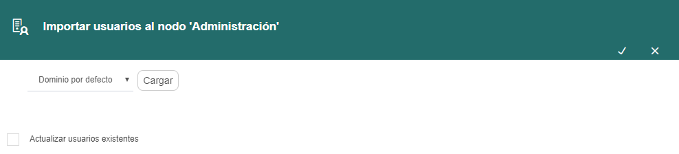](_images/image464.png)

Figura 702 Importador de usuarios de directorio[](#id55 "Link to this image")

2.  En el panel desplegado por Qflow hay una lista que muestra los dominios disponibles. Seleccione el dominio deseado y haga clic en “Cargar”. Esto hace que Qflow muestre los nodos de ese dominio ([Figura 703](#userdirectoryimportwithdomain)).
    

[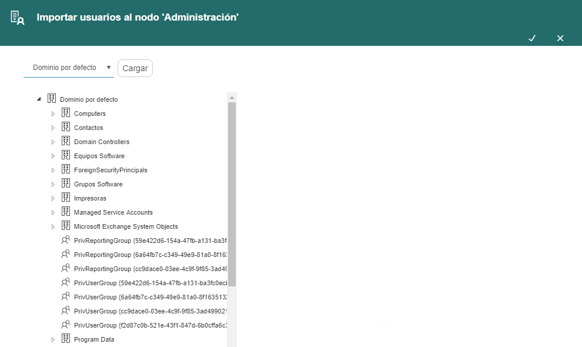](_images/image475.png)

Figura 703 Importador de usuarios de directorio con un dominio cargado[](#id56 "Link to this image")

3.  Seleccione el nodo donde están los usuarios que desee importar. Al seleccionar un nodo con usuarios, la lista de usuarios aparecerá en el panel de la derecha ([Figura 704](#usersselectednode)). Para seleccionar los usuarios, haga clic en el símbolo  que figura del lado izquierdo de cada uno de ellos. También puede buscar un usuario, escribiendo parte de su nombre en el buscador que aparece en la parte superior de la pantalla. La búsqueda de usuarios puede ser solamente en el nodo seleccionado, o puede ser recursiva, incluyendo todos sus descendientes. El botón que muestra un sobre hace que se muestren solamente los usuarios que tienen asociada una cuenta de correo electrónico ([Figura 705](#userfilteroptions)). En la parte inferior del panel hay una opción para marcar:
    
    *   **Actualizar usuarios existentes:** si marca esta opción, se actualizan el nombre y la dirección de correo electrónico el de cada uno de los usuarios, incluso los de usuarios que ya estaban en Qflow. Si no marca esta opción, los usuarios que ya existen son ignorados. Sus datos no son actualizados.
        
    
    [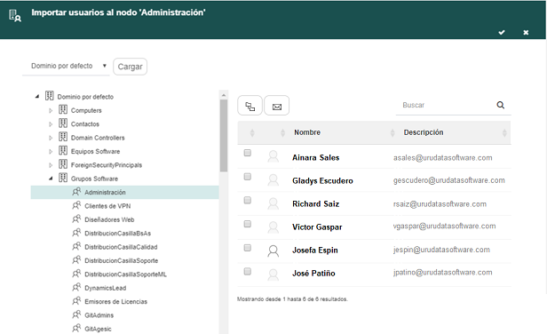](_images/image494.png)
    
    Figura 704 Usuarios del nodo seleccionado[](#id57 "Link to this image")
    
    [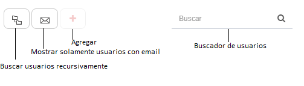](_images/image505.png)
    
    Figura 705 Opciones para filtrar usuarios[](#id58 "Link to this image")
    
4.  Haga clic en “Agregar”. El botón “Agregar” no hace que se cierre el panel. De esa forma, puede seguir agregando usuarios de otros nodos. Seleccione otro nodo, agregue los usuarios que desee que estén en él, y repita el proceso hasta que haya agregado todos los usuarios que desee. El botón “Agregar” sólo estará disponible si selecciona por lo menos un usuario, de lo contrario se mostrará deshabilitado como en la [Figura 705](#userfilteroptions). A medida que se van agregando usuarios, se pueden visualizar como muestra la [Figura 706](#userstoimport). Si no desea importar alguno de los usuarios agregados, haga clic en “x” y se eliminará de la lista.
    

[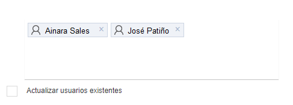](_images/image519.png)

Figura 706 Usuarios a importar[](#id59 "Link to this image")

5.  Si ya existe algún usuario con el mismo _login_, este no se importará, salvo que se marque la opción de “Actualizar usuarios existentes”. Por lo tanto, si se marca esta opción, se actualizarán los datos del usuario.
    
6.  Cuando termine de agregar usuarios, haga clic en el botón ✓ que aparece del lado derecho superior del panel. Eso hará que Qflow importe los usuarios agregados.
    

### Importación de datos de un usuario desde un directorio[](#importacion-de-datos-de-un-usuario-desde-un-directorio "Link to this heading")

Además de importar usuarios de un directorio, se puede importar los datos de un determinado usuario ya existente en Qflow. Esto permite actualizar los datos de ese usuario. También sirve para, después de crear un usuario, cargar sus datos desde el directorio (aunque en este caso probablemente sea más fácil importar directamente el usuario). Para importar los datos de un usuario, haga lo siguiente:

1.  Haga clic con el botón derecho sobre el usuario cuyos datos desea importar, y seleccione del menú contextual la opción “Importar datos de directorio” o seleccione el usuario y haga clic sobre el botón correspondiente de la barra de herramientas (ver [Figura 674](#toolbarenabledisablemembers)). Qflow muestra un panel como el de la [Figura 707](#importdatafromdirectory).
    

[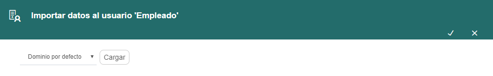](_images/image525.png)

Figura 707 Importador de datos de directorio[](#id60 "Link to this image")

2.  En el panel desplegado por Qflow hay una lista que muestra los dominios disponibles, seleccione el dominio de directorio al que pertenece el usuario cuyos datos desea cargar.
    
3.  Haga clic en “Cargar”. Esto hace que Qflow cargue en la sección de la izquierda del panel el árbol de nodos de ese dominio ([Figura 708](#importdatafromdirectorywithdomain)).
    

[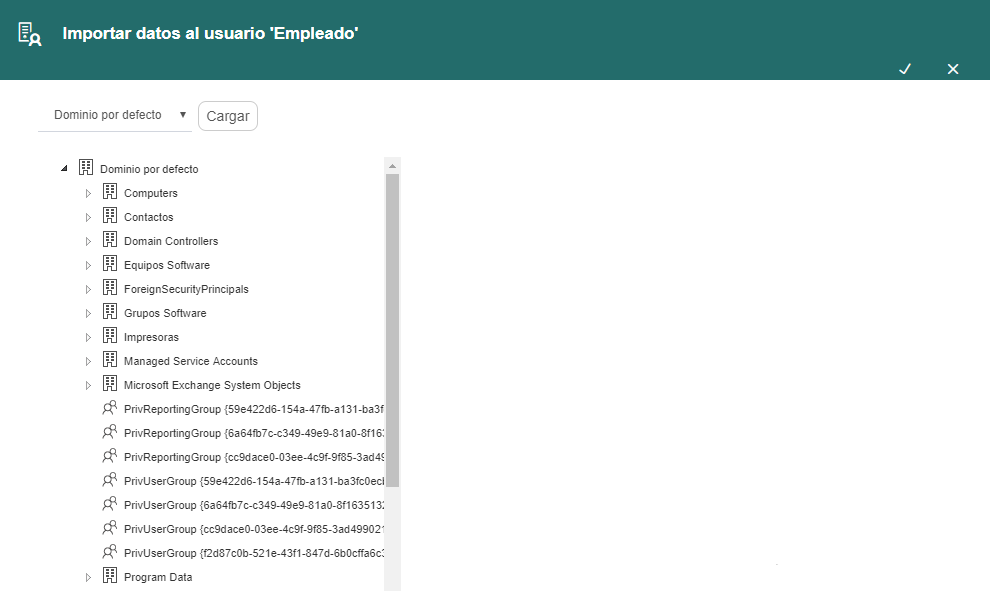](_images/image535.png)

Figura 708 Importador de datos de directorio con dominio seleccionado[](#id61 "Link to this image")

4.  Seleccione el nodo donde se encuentra el usuario cuyos datos desea cargar. Eso hace que Qflow muestre todos los usuarios de ese nodo ([Figura 709](#importdatafromdirectorywithusers)). Si hay muchos usuarios en ese nodo, puede filtrar la lista de usuarios utilizando las opciones para filtrar usuarios, descriptas anteriormente en la sección [Importación de usuarios de directorio](#importacion-de-usuarios-de-directorio). Si usted había creado un usuario e importa sus datos, el nombre del usuario cambiará y pasará a ser el nombre importado.
    

Figura 709 Importador de datos de directorio con usuarios cargados[](#id62 "Link to this image")

### Archivo[](#archivo "Link to this heading")

Esta sección describe las opciones “Importar nodo desde archivo” y “Exportar nodo a archivo” que se encuentran en el menú contextual de un nodo ([Figura 676](#treecontextmenu)).

#### Importar nodo desde archivo[](#importar-nodo-desde-archivo "Link to this heading")

Esta opción permite importar desde un archivo un nodo. El archivo debe ser el producto de exportar el nodo en algún ambiente en el que esté instalado Qflow (ver [Exportar nodo a archivo](#exportar-nodo-a-archivo)).

Cuando se importa el contenido de un archivo de esta forma, se importa toda la estructura del nodo y cada elemento quedará ubicado dentro del nodo indicado en el archivo. Para importar el nodo, se debe seleccionar el archivo en un panel que muestra Qflow ([Figura 710](#importorgchartpanel)) y hacer clic en “Ok”.

[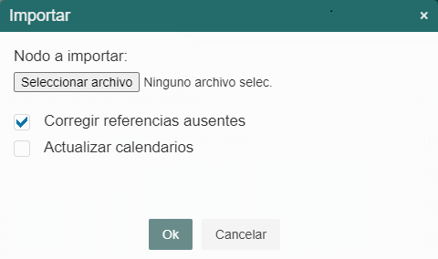](_images/image555.png)

Figura 710 Panel para importar el organigrama[](#id63 "Link to this image")

La opción “**Corregir referencias ausentes**”, que está marcada por defecto, permite hacer la importación aun cuando haya errores por referencias ausentes (por ejemplo, un usuario tiene como suplente otro usuario, que no está). Si se deja marcada esa opción, Qflow ignorará la referencia y continuará con la importación, pero advertirá de los errores encontrados para que esos problemas puedan ser corregidos (por ejemplo, en el caso de un suplente que no existe, asignándole otro suplente al usuario). Si no se deja marcada esta opción, Qflow interrumpirá la importación ni bien encuentre un error, y dejará los datos en el mismo estado en que se encontraban antes de que se comenzara con la importación.

#### Exportar nodo a archivo[](#exportar-nodo-a-archivo "Link to this heading")

La opción “Exportar nodo a archivo” permite exportar a un archivo el nodo y todo su contenido. Este archivo puede ser importado más tarde en otro ambiente en el que esté instalado Qflow. Para exportar el nodo, seleccione la opción “Exportar como archivo XML” o la opción “Exportar archivo comprimido” para exportarlo de una u otra forma.

[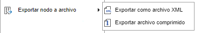](_images/image565.png)

Figura 711 Exportación del modelo organizacional[](#id64 "Link to this image")

### Configuración[](#configuracion "Link to this heading")

Esta sección describe las opciones que se encuentran en “Configuración” del menú superior de la pantalla principal del sitio web ([Figura 663](#lateralmenu)).

#### Administrar permisos de la herramienta[](#administrar-permisos-de-la-herramienta "Link to this heading")

Cuando esta opción es seleccionada, aparece un panel como el de la [Figura 712](#managetoolpermissions). Este muestra una tabla con todos los permisos definidos. Para cada uno se muestra para qué rol es el permiso, la descripción del rol, una lista de acciones permitidas y una lista de acciones denegadas. La lista se puede filtrar de la forma usual y también se puede modificar, agregando, quitando y modificando elementos.

[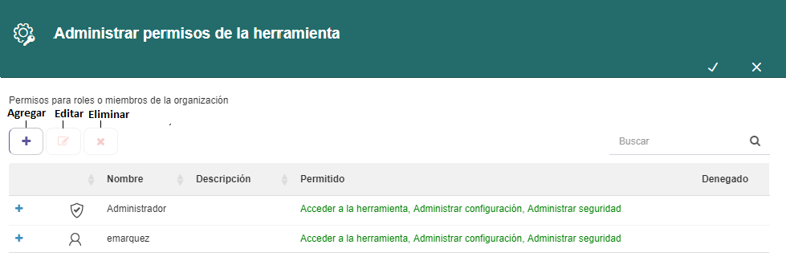](_images/image574.png)

Figura 712 Administrar permisos de la herramienta[](#id65 "Link to this image")

Existen tres tipos de permisos definidos:

*   **Acceder a la herramienta:** permite abrir Qflow Team, pero no permite realizar cambios.
    
*   **Administrar configuración:** permite editar las opciones que se despliegan en la barra de configuración y que no están vinculadas a un nodo. Por ejemplo, crear un rol de seguridad.
    
*   **Administrar seguridad:** permite modificar los permisos de acceso a la herramienta.
    

**Para agregar permisos:**

1.  Haga clic en el botón “Agregar”. Eso hace que Qflow muestre un buscador de roles.
    
2.  Seleccione el destinatario del permiso. Para eso, escriba parte de su nombre en el buscador (donde dice “Comience a escribir…”) y cuando lo vea en la lista que aparece, selecciónelo ([Figura 713](#usergroupornodeselection)). El destinatario de un permiso puede ser un elemento de cualquiera de estos tipos:
    
    *   Rol de seguridad
        
    *   Nodo
        
    *   Grupo
        
    *   Usuario
        
    *   Cola de trabajo
        
    
    Cuando se selecciona el destinatario de un permiso, Qflow muestra un formulario para seleccionar las acciones que se incluyen en el nuevo permiso ([Figura 714](#addpermission)).
    

[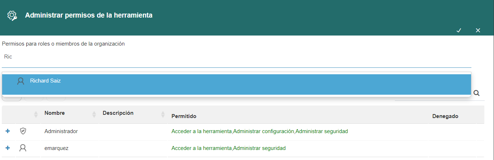](_images/image585.png)

Figura 713 Selección de un usuario, grupo, nodo o rol de seguridad[](#id66 "Link to this image")

[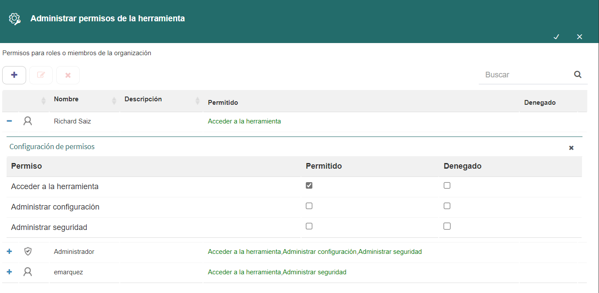](_images/image594.png)

Figura 714 Configuración de permisos – Agregar permisos[](#id67 "Link to this image")

3.  Para cada uno de los permisos que se muestran en ese formulario, marque si se permite o se deniega.
    

**Para editar permisos:**

1.  Seleccione el elemento al que quiera editarle los permisos y posteriormente haga clic en el botón “Editar”.
    
2.  Qflow volverá a mostrar el formulario “Configuración de permisos”. Seleccione las acciones que quiera permitir o denegar en el nuevo permiso ([Figura 715](#editpermission)).
    

[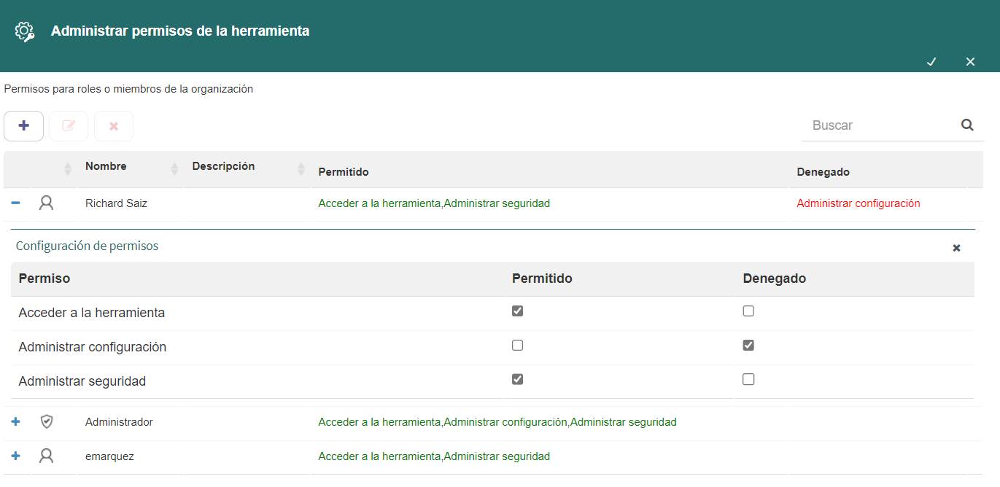](_images/image603.png)

Figura 715 Configuración de permisos – Editar permisos[](#id68 "Link to this image")

**Para eliminar permisos:**

1.  Seleccione el elemento al que quiera eliminarle los permisos y posteriormente haga clic en el botón “Eliminar”.
    
2.  Qflow mostrará un mensaje de advertencia ([Figura 716](#deletepermissionconfirmation)). Haga clic en el botón “Ok” y se eliminarán todos los permisos para el elemento seleccionado.
    

Figura 716 Confirmar eliminación de permisos[](#id69 "Link to this image")

#### Calendarios[](#calendarios "Link to this heading")

La opción “Calendarios” de configuración permite definir calendarios para que distintos usuarios se puedan regir por distintos calendarios. Esto es útil, por ejemplo, cuando una organización tiene filiales en varios países y, por lo tanto, esas filiales se rigen por calendarios diferentes (feriados, régimen de trabajo, etc.)

Cuando esa opción es seleccionada, Qflow despliega un formulario como el que se muestra en la [Figura 717](#calendarform).

[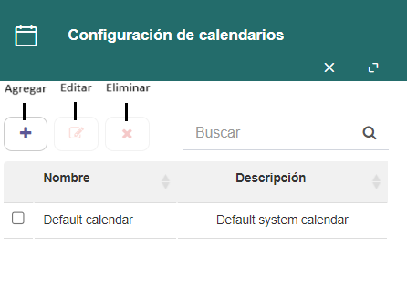](_images/image624.png)

Figura 717 Formulario de calendarios[](#id70 "Link to this image")

**Para agregar un calendario:**

1.  Haga clic en el botón “Agregar”. Qflow desplegará otro formulario como el de la [Figura 718](#calendardefintion).
    
2.  Cree el calendario (en la sección [Propiedades de los calendarios](#propiedades-de-los-calendarios) se explica cómo).
    
3.  Haga clic en el botón “✓” que aparece del lado derecho superior del panel.
    

**Para modificar un calendario**, selecciónelo de la lista y haga clic en el botón “Editar”.

**Para borrar un calendario**, selecciónelo de la lista y haga clic en el botón “Eliminar”. Qflow mostrará un mensaje de advertencia. Haga clic en el botón “Si” y se eliminará el calendario.

##### Propiedades de los calendarios[](#propiedades-de-los-calendarios "Link to this heading")

Cuando se está agregando o editando un calendario, Qflow abre un panel como el que se muestra en la [Figura 718](#calendardefintion). Este formulario permite definir un calendario.

[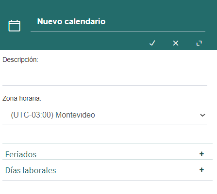](_images/image635.png)

Figura 718 Definición de un calendario[](#id71 "Link to this image")

El formulario de propiedades de los calendarios tiene tres grupos:

El grupo principal, que muestra las principales propiedades:

*   **Nombre:** nombre descriptivo del calendario. Es el nombre que aparece cuando hay que elegir un calendario (por ejemplo, en las propiedades de los usuarios).
    
*   **Descripción:** breve descripción del calendario.
    
*   **Zona horaria:** zona horaria en la que se van a encontrar todas las fechas y horas definidas en el calendario.
    

El segundo y tercer grupo, “Feriados” y “Días laborales” respectivamente, que para desplegarlos hay que hacer clic en el símbolo “+”.

El grupo “Feriados” permite especificar feriados u otros días del año en los que no se trabaja.

**Para agregar un feriado:**

1.  Haga clic en el botón “Agregar”. Qflow agregará por defecto un elemento a la lista con la fecha del momento en que se agrega.
    
2.  Si quiere otra fecha (que no sea la del momento), haga clic en esa fecha creada por defecto, y Qflow mostrará un calendario que le permitirá elegir un día del año ([Figura 719](#holidaydefintion)).
    
3.  Seleccione un día del año.
    

[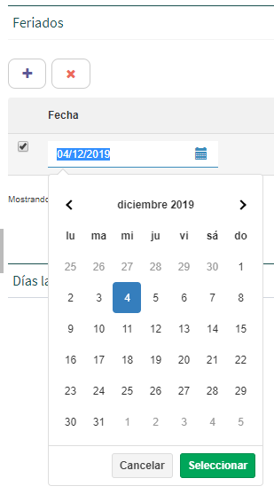](_images/image644.png)

Figura 719 Definición de feriados y vacaciones[](#id72 "Link to this image")

El tercer grupo “Días laborales” ([Figura 720](#labordays)), permite marcar los días de la semana en los que se trabaja y, para cada día, el horario de trabajo (hora de entrada y de salida). Para marcar un día como día de trabajo, seleccione el día y Qflow extenderá el grupo con más opciones. Marque el casillero “Es día laborable” ([Figura 721](#checklabordays)).

**Hora para notificaciones de fecha fija:** aquí se indica a qué hora se deben enviar notificaciones que están programadas con datos de tipo Fecha.

[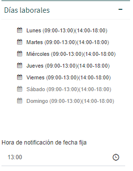](_images/image654.png)

Figura 720 Días laborales[](#id73 "Link to this image")

[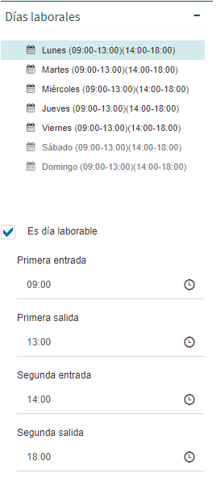](_images/image664.png)

Figura 721 Marcar días laborales[](#id74 "Link to this image")

#### Roles de seguridad[](#roles-de-seguridad "Link to this heading")

La opción “Roles de seguridad” permite definir los roles de seguridad que pueden ser asociados a nodos, grupos y usuarios. Cuando esa opción es seleccionada, Qflow despliega un formulario como el que se muestra en la [Figura 722](#rolesecurityform). El formulario tiene una lista de los roles de seguridad definidos, y permite agregar nuevos, eliminar los roles que están en la lista, editarlos y deshabilitarlos/habilitarlos.

[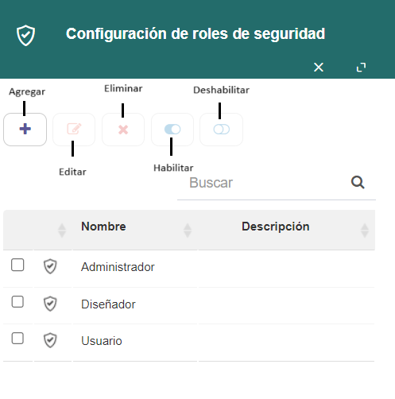](_images/image675.png)

Figura 722 Formulario Configuración de roles de seguridad[](#id75 "Link to this image")

**Para agregar un rol de seguridad:**

1.  Haga clic en el botón “Agregar”. Qflow desplegará un subformulario como el que se muestra en la [Figura 723](#securityroleproperties).
    
2.  Complete los valores de las propiedades del rol (explicadas más adelante).
    
3.  Guarde el rol haciendo clic en el botón ✓ que aparece del lado derecho superior del subformulario.
    

**Para eliminar un rol de seguridad**, selecciónelo de la lista y haga clic en el botón “Eliminar”. Qflow mostrará un mensaje de advertencia. Haga clic en el botón “Si” y se eliminará el rol de seguridad.

**Para modificar las propiedades de un rol de seguridad**, selecciónelo de la lista y haga clic en el botón “Editar”. Qflow desplegará un subformulario que le permitirá modificar las propiedades del rol.

**Para deshabilitar un rol de seguridad**, selecciónelo de la lista y haga clic en el botón “Deshabilitar”. Si luego lo desea **habilitar** nuevamente, realice el mismo procedimiento, pero inversamente.

##### Propiedades de los roles de seguridad[](#propiedades-de-los-roles-de-seguridad "Link to this heading")

La [Figura 723](#securityroleproperties) muestra el subformulario que Qflow despliega cuando se está **agregando** un rol de seguridad.

[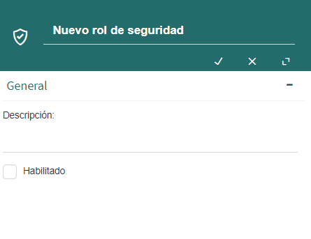](_images/image685.png)

Figura 723 Propiedades de un rol de seguridad cuando se agrega[](#id76 "Link to this image")

Los roles de seguridad tienen tres propiedades:

*   **Nombre:** nombre descriptivo del rol de seguridad. Es el nombre que aparece cuando hay que elegir un rol de seguridad.
    
*   **Descripción:** breve descripción del rol de seguridad.
    
*   **Habilitado:** este casillero permite habilitar o deshabilitar el rol de seguridad.
    

La [Figura 724](#securityrolepropertiesatediting) muestra el subformulario que Qflow despliega cuando se está **editando** un rol de seguridad. Es el mismo subformulario de la [Figura 723](#securityroleproperties), solo que tiene dos grupos más, cuyas opciones no son editables sino descriptivas.

[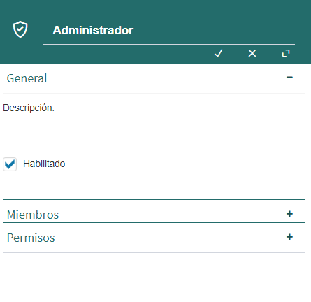](_images/image694.png)

Figura 724 Propiedades de un rol de seguridad cuando se edita[](#id77 "Link to this image")

El grupo “Miembros” muestra los usuarios, nodos y grupos que están asociados al rol de seguridad.

[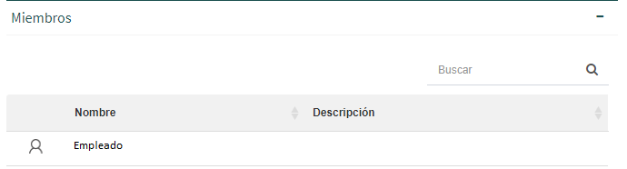](_images/image705.png)

Figura 725 Miembros de un rol de seguridad[](#id78 "Link to this image")

El grupo “Permisos” muestra los permisos que le fueron asignados al rol de seguridad. Los permisos aparecen agrupados por tipo de permiso (herramientas, nodos, paquetes). Para cada permiso, se indica sobre qué objeto fue definido, cuál es el permiso y cuál es el nivel de acceso (“Permitido” o “Denegado”).

[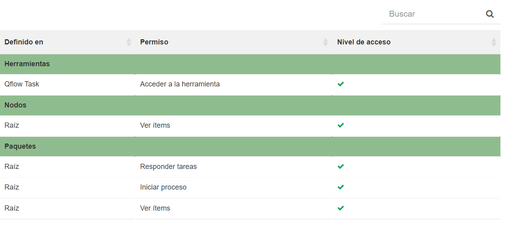](_images/image717.png)

Figura 726 Permisos de un rol de seguridad[](#id79 "Link to this image")

#### Proveedores de seguridad[](#proveedores-de-seguridad "Link to this heading")

La opción “Proveedores de seguridad” permite definir los proveedores de seguridad (por ejemplo, dominios Windows) usados por Qflow para autenticar a sus usuarios.

Al seleccionar esta opción, Qflow abre un formulario como el que se muestra en la [Figura 727](#securityproviderform). El formulario muestra una lista con todos los proveedores de seguridad definidos, y permite agregar nuevos proveedores de seguridad, eliminar proveedores que aparecen en la lista, editar sus propiedades y deshabilitarlos/habilitarlos.

Recuerde que una vez agregado el proveedor de seguridad, deberá asignárselo al usuario deseado en la sección «Propiedades del usuario» [Figura 697](#userproperties)

[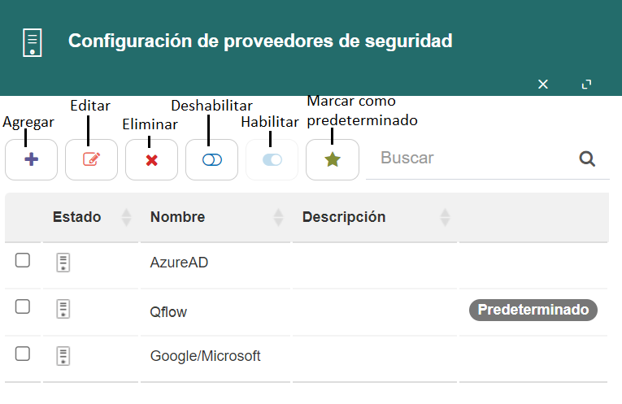](_images/image924.png)

Figura 727 Formulario de manejo de proveedores de seguridad[](#id80 "Link to this image")

**Para agregar un proveedor de seguridad:**

1.  Haga clic en el botón “Agregar”. Qflow desplegará un subformulario como el que se muestra en la [Figura 728](#securityprovidersubform).
    
2.  Complete los valores de las propiedades (explicadas más adelante).
    
3.  Guarde el proveedor de seguridad haciendo clic en el botón ✓ que aparece del lado derecho superior del subformulario.
    

**Para eliminar un proveedor de seguridad**, selecciónelo de la lista y haga clic en el botón “Eliminar”. Qflow mostrará un mensaje de advertencia. Haga clic en el botón “Si” y se eliminará el proveedor de seguridad.

**Para editar un proveedor de seguridad**, selecciónelo de la lista y haga clic en el botón “Editar”. Qflow desplegará el subformulario de propiedades del proveedor.

**Para deshabilitar un proveedor de seguridad**, selecciónelo de la lista y haga clic en el botón “Deshabilitar”. Si luego lo desea **habilitar** nuevamente, realice el mismo procedimiento, pero inversamente.

**Para definir un proveedor de seguridad como predeterminado**, selecciónelo de la lista y haga clic en el botón “Definir como predeterminado”. Esto hará que tanto en la ventana de login, como en el panel de creación de usuario, ya aparezca preseleccionado.

##### Propiedades de los proveedores de seguridad[](#propiedades-de-los-proveedores-de-seguridad "Link to this heading")

Al crear o editar un proveedor de seguridad, Qflow muestra un subformulario como el que se muestra en la [Figura 728](#securityprovidersubform). Este subformulario permite editar las propiedades del proveedor:

*   **Nombre:** nombre descriptivo que se le quiere dar al proveedor de seguridad. Es el nombre que Qflow mostrará cuando abra algún formulario en el que haya que elegir un proveedor de seguridad (por ejemplo, en el formulario de propiedades de un usuario).
    
*   **Descripción**: breve descripción del proveedor de seguridad. No importa si está vacío.
    
*   **Habilitado**: el casillero permite habilitar o deshabilitar el proveedor de seguridad.
    
*   **Clase del servicio del directorio**: indica a qué tipo de servicio de directorio pertenece el proveedor (Dominio NT, Active Directory, Google/Microsoft, Qflow, LDAP o Azure active directory). Solo puede existir un proveedor de seguridad de clase Google/Microsoft y Qflow.
    
*   **Fully Qualified Domain Name**: nombre característico del dominio (FQDN). Este campo no aparecerá en caso de servicios Google/Microsoft, Qflow, Dominio NT y Azure active directory.
    
*   **Nombre NetBIOS**: este campo no aparecerá en caso de servicios Google/Microsoft, Qflow y Azure active directory.
    
*   **Tipos de cuenta soportados**: indica si soporta una organización única o múltiples. Este campo sólo aparecerá para servicios Azure active directory.
    
*   **Id de cliente**: este campo sólo aparecerá para servicios Azure active directory.
    
*   **Id de directorio**: este campo sólo aparecerá para servicios Azure active directory.
    
*   **Avanzado**: este botón sólo está habilitado si la clase de servicio del directorio es LDAP o Active Directory. En el caso de LDAP, permite configurar varias propiedades avanzadas ([Figura 731](#ldapdirectoryproperties)). En el caso de Active Directory ([Figura 730](#advancepropertiesactivedirectory)), permite definir las credenciales que se utilizarán para consultar el directorio. Se puede optar por utilizar las credenciales de red (opción por defecto) o especificar un usuario y contraseña fijos.
    
*   **Verificar configuración**: despliega un subformulario en el que se puede escribir un nombre de usuario y una contraseña para comprobar que el proveedor de seguridad configurado funciona correctamente ([Figura 729](#verifysecurityprovider)).
    

[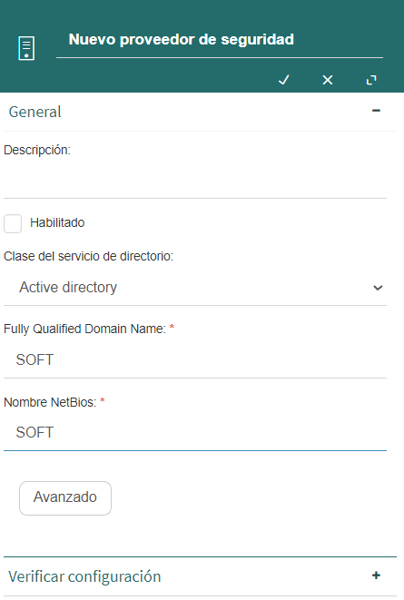](_images/image734.png)

Figura 728 Subformulario de propiedades de un proveedor de seguridad[](#id81 "Link to this image")

[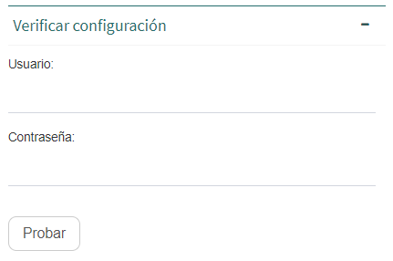](_images/image744.png)

Figura 729 Verificar el proveedor de seguridad[](#id82 "Link to this image")

[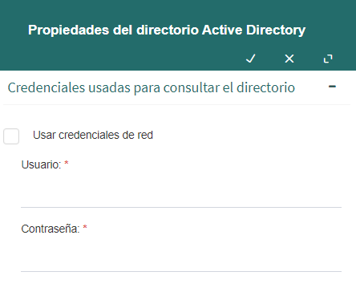](_images/image754.png)

Figura 730 Propiedades avanzadas (Active Directory)[](#id83 "Link to this image")

**Agregar proveedor de seguridad LDAP**

El formulario de propiedades avanzadas de LDAP ([Figura 731](#ldapdirectoryproperties)) tiene las siguientes propiedades:

*   **General:** contiene las propiedades de conexión que especifican cómo Qflow se conecta con el directorio:
    
    *   **Tipo de autenticación:** tipo de autenticación requerido por el servicio de directorio. Si el servicio de directorio no requiere autenticación, seleccione “Anonymous” (anónima).
        
    *   **Puerto:** el puerto del servicio de directorio
        
    *   **Nombre distinguido base:** ubicación de los elementos organizacionales dentro del directorio. Por ejemplo, en _Active Directory_ para el dominio soft.urudata.com.uy los elementos organizacionales se encuentran en dc=uy, dc=com, dc=urudata y dc=soft.
        
*   **Credenciales usadas para consultar el directorio LDAP:** En caso de usar un tipo de autenticación distinto de Anonymous (anónima) aquí se ingresan las credenciales (usuario y contraseña) que Qflow utilizará para consultar el directorio.
    
*   **Configuración de usuario:** las propiedades de usuario permiten especificar las clases de objetos y atributos que se corresponden con los usuarios manejados por Qflow.
    
    *   **Clase:** La clase de objeto que identifica a los usuarios.
        
    *   **Identificador de usuario:** El atributo usado para identificar a los usuarios (el equivalente al _login_).
        
    *   **Nombre:** El atributo correspondiente al nombre del usuario en Qflow. Se utiliza sólo en la importación y sincronización de datos de directorio.
        
    *   **Descripción:** El atributo correspondiente a la descripción de los usuarios en Qflow. Se utiliza sólo en la importación y sincronización de datos de directorio.
        
    *   **E-mail:** El atributo correspondiente a la dirección de e-mail de los usuarios en Qflow. Se utiliza sólo en la importación y sincronización de datos de directorio.
        
    *   **Habilitado:** El atributo que indica si un usuario está habilitado o no. Se utiliza en la importación y sincronización de datos de directorio si es que se ingresó.
        
*   **Configuración de unidad organizacional:** las propiedades de unidad organizacional permiten especificar las clases de objetos y atributos que se corresponden con los nodos manejados por Qflow.
    
    *   **Clase:** La clase de objeto que identifica a los nodos.
        
    *   **Nombre:** El atributo correspondiente al nombre del nodo en Qflow. Se utiliza sólo en la sincronización de datos de directorio.
        
*   **Configuración de grupo:** las propiedades de grupo permiten especificar las clases de objetos y atributos que se corresponden con los grupos manejados por Qflow.
    
    *   **Clase:** La clase de objeto que identifica a los grupos.
        
    *   **Nombre:** El atributo correspondiente al nombre del grupo en Qflow. Se utiliza sólo en la sincronización de datos de directorio.
        
    *   **Miembro:** El atributo utilizado para indicar los miembros de un grupo. Se utiliza sólo en la sincronización de datos de directorio.
        

El grupo “General” es el único que se muestra por defecto. Para que aparezcan los grupos descriptos anteriormente, despliéguelos haciendo clic en el símbolo “+”.

[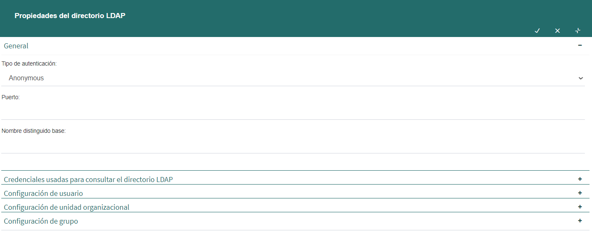](_images/image765.png)

Figura 731 Propiedades del directorio LDAP[](#id84 "Link to this image")

**Agregar proveedor de seguridad Google/Microsoft**

Para permitir que usuarios con cuentas de Google o Microsoft puedan iniciar sesión en la herramienta, es necesario crear un proveedor de seguridad con tipo «Google/Microsoft».

**Agregar proveedor de seguridad Azure Active Directory**

Antes de poner en funcionamiento este tipo de servicio de directorio, debemos configurar los siguientes aspectos dentro del Portal de Azure.

1.  Dirijase a Registro de aplicaciones. Una vez dentro haga clic sobre «Nuevo registro».
    
2.  Ingrese un nombre y en «Tipos de cuentas compatibles», seleccione «Cuentas en cualquier directorio organizativo (cualquier directorio de Azure AD: multiinquilino)».
    
3.  En el menú de la izquierda, en la sección Administrar haga clic sobre «Autenticación». Dentro de la Configuración avanzada habilite los «flujos móviles y de escritorio» y presione «Guardar».
    
4.  En el menú de la izquierda, en la sección Administrar haga clic sobre «Permisos de API». Haga clic sobre «Agregar un permiso» y se desplegará un menú donde deberá elegir «Microsoft Graph». Allí deberá seleccionar «Permisos de la aplicación» y en la sección «User», escoja «User.Read.All». Haga clic sobre «Agregar permisos».
    
5.  Regrese a la sección de «Información general» del menú de la izquierda. Aquí se encontrará la información que debemos ingresar en la herramienta Qflow Team en el siguiente punto, «Id. de aplicación (cliente)» e «Id. de directorio (inquilino)» ([Figura 732](#azureportaloverview)).
    
6.  Dentro de la herramienta Qflow Team una vez seleccionada la opción para agregar un nuevo proveedor de seguridad, escoja un nombre para el nuevo proveedor, seleccione «Azure active directory» en «Clase del servicio de directorio» y «Organización única» en «Tipos de cuenta soportados». En «Id de cliente» ingrese el «Id. de aplicación (cliente)» y en «Id de directorio» el «Id. de directorio (inquilino)». Guarde la configuración.
    

[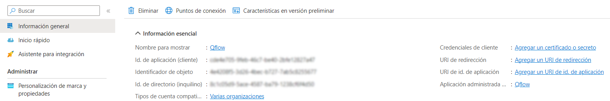](_images/image918.png)

Figura 732 Vista de Portal de Azure - Información general[](#id85 "Link to this image")

#### Propiedades para nuevos usuarios[](#propiedades-para-nuevos-usuarios "Link to this heading")

En el panel de propiedades para nuevos usuarios se definirán algunos datos de interés que tendrán por defecto los nuevos usuarios al ser creados. Estos datos son los roles iniciales y los servicios de notificación.

[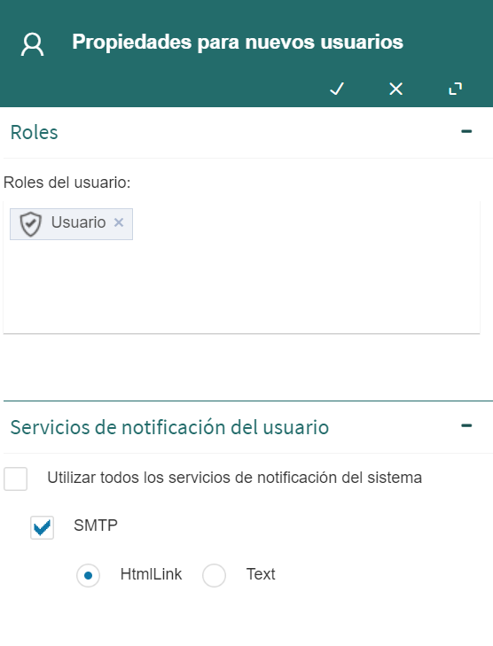](_images/image905.png)

Figura 733 Propiedades para nuevos usuarios[](#id86 "Link to this image")

#### Reporte de Ingresos[](#reporte-de-ingresos "Link to this heading")

El reporte de ingresos muestra qué usuarios han iniciado sesión en alguna herramienta de Qflow en determinado período de tiempo. También se muestran cierres de sesión e intentos fallidos de iniciar sesión. En la parte superior de la pantalla se puede seleccionar el período para el cual se desean ver los datos, como se muestra en la [Figura 734](#loginreport). Al lado de cada reporte se indica en qué zona horaria se encuentra.

[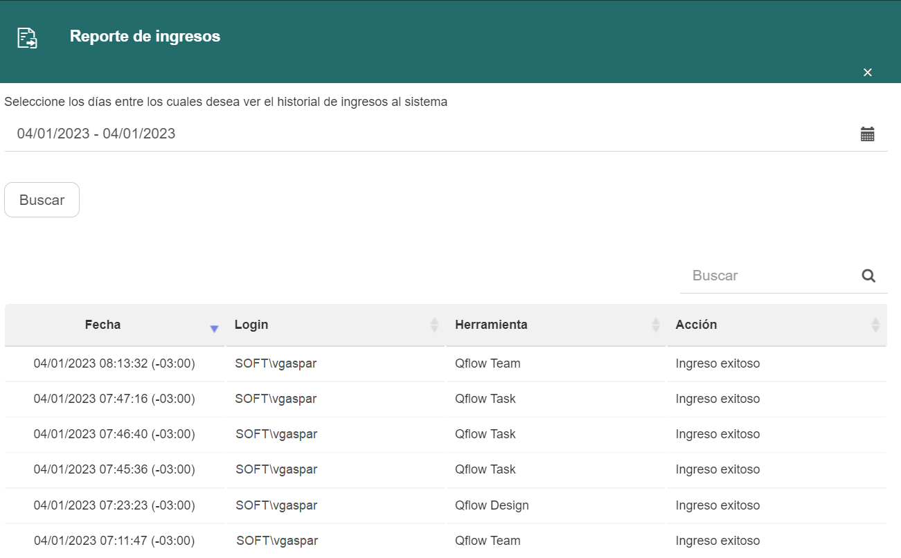](_images/image775.png)

Figura 734 Reporte de ingresos[](#id87 "Link to this image")

#### Auditoría de permisos[](#auditoria-de-permisos "Link to this heading")

La auditoría de permisos ([Figura 735](#permissionaudit)) permite consultar las modificaciones de los permisos de los usuarios. Un usuario puede recibir permisos desde diversas fuentes, algunas directas, como la asignación explícita de permisos a un rol de seguridad, y otras indirectas, como la asignación de un nuevo rol de seguridad a un usuario. La auditoría permite distinguir todos estos casos y provee información detallada de las modificaciones realizadas. Solamente usuarios que tengan permiso para auditar en el nodo raíz pueden acceder a la auditoría de permisos. La información se divide en los siguientes ítems ([Figura 736](#permissionaudititems)):

*   **Asignaciones de supervisores:** muestra operaciones de asignación de usuarios como supervisores de nodos y grupos. También se muestran operaciones en las que se hizo que un usuario dejara de ser supervisor de un nodo o grupo (“desasignación”). Para cada operación, se muestra quién la hizo (“Usuario”), a qué nodo o grupo se asignó el supervisor, y qué supervisor se asignó.
    
*   **Miembros de grupos:** permite ver los cambios en la pertenencia de usuarios o grupos a otros grupos. Mover de nodo a un usuario se considera como un cambio de grupo, y por lo tanto también figura aquí. Estos cambios pueden afectar los permisos, ya que el usuario adquiere los permisos del grupo al que pertenece.
    
*   **Miembros de roles:** permite ver las modificaciones en la pertenencia de miembros organizacionales a roles de seguridad.
    
*   **Permisos de herramientas:** muestra los cambios realizados en las definiciones de permisos de herramienta (como, por ejemplo, el propio Qflow Team). Además de los permisos se especifica la herramienta a la que corresponden.
    
*   **Permisos de nodos:** muestra las modificaciones a los permisos de nodo. Permite filtrar las modificaciones mostradas para incluir solamente aquellas de permisos específicos de colas de trabajo.
    
*   **Permisos de paquetes:** muestra los permisos otorgados y denegados sobre paquetes.
    
*   **Suplencias:** muestra las suplencias agregadas y eliminadas. Las suplencias son relevantes porque durante el periodo de la suplencia el suplente adquiere los permisos de la persona que suple.
    

[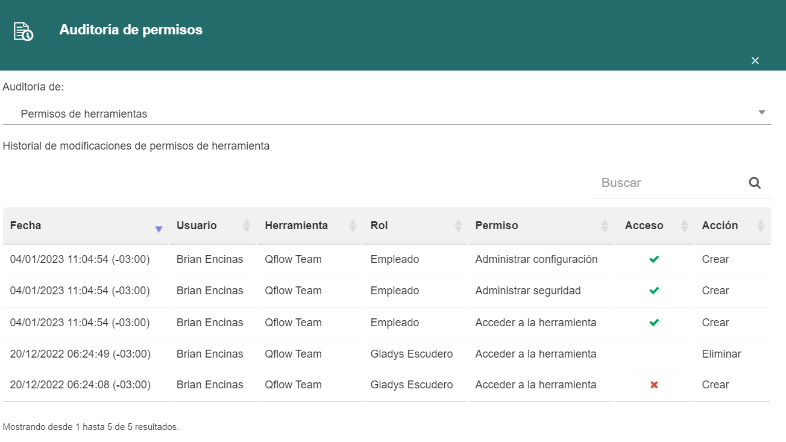](_images/image785.png)

Figura 735 Auditoría de permisos[](#id88 "Link to this image")

[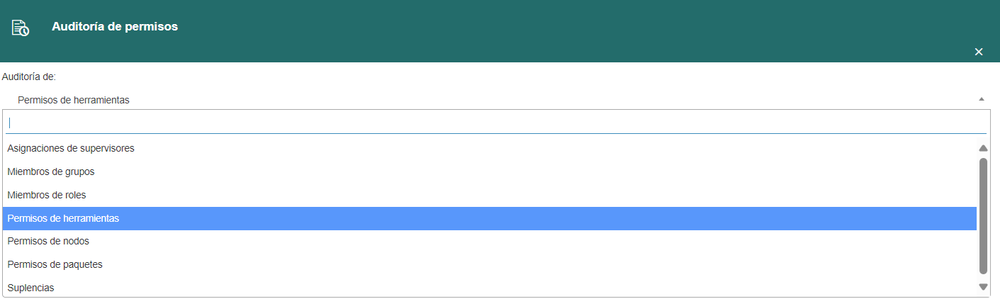](_images/image794.png)

Figura 736 Ítems - Auditoría de permisos[](#id89 "Link to this image")

### Propiedades adicionales[](#propiedades-adicionales "Link to this heading")

A veces puede ser deseable manejar propiedades que no están definidas en Qflow. Por ejemplo, Qflow no dispone de una propiedad “Número de Teléfono” para un usuario. Para estos casos existen las propiedades adicionales.

#### Cuadro de propiedades[](#cuadro-de-propiedades "Link to this heading")

Las propiedades adicionales de un elemento se muestran en el grupo “Propiedades” del formulario de ese elemento. Por defecto, ese grupo muestra un cuadro que tiene dos columnas: Nombre y Valor ([Figura 737](#extraproperties)).

[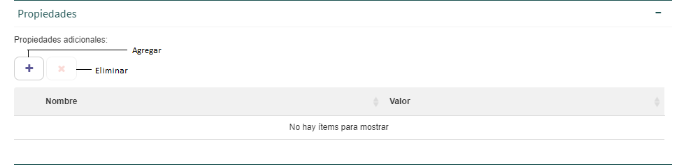](_images/image804.png)

Figura 737 Propiedades adicionales[](#id90 "Link to this image")

**Para agregar una** **propiedad:**

1.  Haga clic en el botón “Agregar…”. Qflow agregará un elemento al cuadro con el Nombre y Valor por defecto “Nombre1”.
    
2.  Haga clic sobre “Nombre1” de la columna Nombre, escriba el nombre de la nueva propiedad y pulse la tecla “Enter”. De igual manera, haga clic sobre “Nombre1” de la columna Valor, escriba el valor de la nueva propiedad y nuevamente haga clic sobre la tecla “Enter”.
    

La [Figura 738](#addedextraproperties) muestra tres propiedades agregadas.

[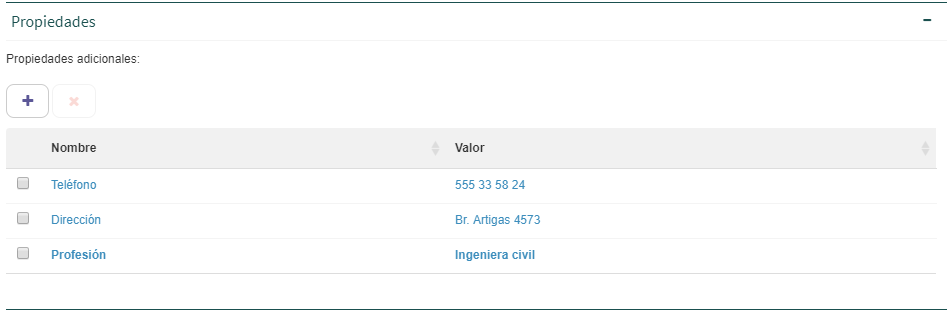](_images/image817.png)

Figura 738 Propiedades adicionales agregadas[](#id91 "Link to this image")

**Para eliminar una propiedad:**

1.  Seleccione la propiedad o las propiedades que desea eliminar haciendo clic en el símbolo  que figura del lado izquierdo de cada uno de ellas.
    
2.  Haga clic en el botón “Eliminar”.
    

Hay otra forma de definir propiedades, que implica configurar Qflow para que éstas queden definidas para todos los elementos de cierto tipo (por ejemplo, para todos los usuarios), y que el grupo “Propiedades”, en lugar de mostrar un cuadro, muestre un conjunto personalizado de controles ([Figura 739](#configurationextraproperties)). Las ventajas de hacerlo de esa forma son que se puede especificar el tipo de cada propiedad (si es un número, un texto, un miembro organizacional, o una fecha, por ejemplo), y cada propiedad se muestra de una forma adecuada a su tipo, lo cual permite evitar errores al asignarles valores. Por ejemplo, si una propiedad es del tipo “Sí/No”, se mostrará con un control que sólo permite elegir esos dos valores.

Para definir las propiedades adicionales de esa forma se utiliza Qflow Admin (para más información ver el manual de de [QflowAdmin](19-QflowAdmin.md)). El hecho de definir propiedades de esa forma no implica que no se pueda seguir usando el cuadro. El cuadro seguirá disponible en la parte inferior del grupo, como se visualiza en la [Figura 739](#configurationextraproperties).

[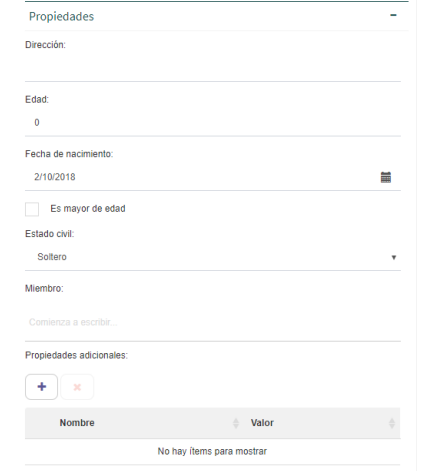](_images/image825.png)

Figura 739 Propiedades adicionales definidas por medio de configuración[](#id92 "Link to this image")

### Licencias[](#licencias "Link to this heading")

Qflow Team permite controlar el uso de licencias de Qflow, mediante el “Indicador de usuarios habilitados” de la página principal (ver [Figura 661](#homescreen)). Además, cuando alguien crea o habilita un usuario en Qflow Team, se controla que la operación no haga que se exceda la cantidad de licencias disponibles. Si esto sucede, la herramienta le dará un aviso al usuario y la operación se suspenderá.

[Anterior](15-QflowDesign.md "Qflow Design") [Siguiente](19-QflowAdmin.md "Qflow Admin")

- - -

© Derechos de autor 2025, Urudata Software.

jQuery(function () { SphinxRtdTheme.Navigation.enable(true); }); window.dataLayer = window.dataLayer || \[\]; function gtag(){dataLayer.push(arguments);} gtag('js', new Date()); gtag('config', 'G-LMDS8S4B42', { 'anonymize\_ip': false, });
