  Qflow Admin — Qflow Cloud          

*   [Qflow](https://qflowbpm.com/es/)
*   [Foro](https://forum.qflowbpm.com/)
*   [Centro de Ayuda](https://qflowbpm.com/es/centro-de-ayuda/)
*   [Contáctanos](https://qflowbpm.com/es/contacto/)

[Qflow](index.html)

Cloud (latest) 5.5 OnPremise (latest) 5.2 OnPremise 5.1.1 OnPremise

English Español

selectElement('versionSelect', getVersion()); selectElement('languageSelect', getLanguage()); function selectElement(id, valueToSelect) { let element = document.getElementById(id); element.value = valueToSelect; } function getLanguage() { if (window.location.href.includes('/es/')) { return '/es/'; } else { return '/en/'; } } function getVersion() { if (window.location.href.includes('/qflowcloud/')) { return '/qflowcloud/'; } else if (window.location.href.includes('/qflow5\_1\_1/')) { return '/qflow5\_1\_1/'; } else if (window.location.href.includes('/qflow5\_2/')) { return '/qflow5\_2/'; } else { return '/qflow5\_5/'; } } function redirectToSite(url) { var http = new XMLHttpRequest(); http.onreadystatechange = function() { if (http.readyState === 4) { if (http.status !== 404) { window.location.href = url; } else { window.location.href = url.replace(url.substr(url.lastIndexOf('/') + 1), 'index.html'); } } } http.open('HEAD', url, true); http.send(); }

  

Inicio

*   [Novedades](29-ReleaseNote.html)
*   [Introducción a Qflow](01-QflowIntroduction.html)
*   [Tutoriales](TutorialsIndex.html)
*   [Qflow Task](04-QflowTask.html)
*   [Qflow Design](15-QflowDesign.html)
*   [Qflow Team](18-QflowTeam.html)
*   [Qflow Admin](#)
    *   [Introducción](#introduccion)
    *   [Descripción general de la interfaz de usuario](#descripcion-general-de-la-interfaz-de-usuario)
    *   [Visor de licencias](#visor-de-licencias)
        *   [Menú superior](#menu-superior)
        *   [Menú lateral](#menu-lateral)
    *   [Estadísticas](#estadisticas)
        *   [Uso de licencia](#uso-de-licencia)
        *   [Historial de uso de licencia](#historial-de-uso-de-licencia)
    *   [Parámetros de sistema](#parametros-de-sistema)
    *   [Propiedades extendidas](#propiedades-extendidas)
        *   [Propiedades extendidas de usuario](#propiedades-extendidas-de-usuario)
        *   [Propiedades extendidas de grupo](#propiedades-extendidas-de-grupo)
        *   [Propiedades extendidas de nodo](#propiedades-extendidas-de-nodo)
    *   [Licencias](#licencias)
        *   [Modelo de licencias](#modelo-de-licencias)
    *   [Servicios de notificación](#servicios-de-notificacion)
        *   [Configurar servicios de notificación](#configurar-servicios-de-notificacion)
        *   [Configuración de servicios de notificación](#configuracion-de-servicios-de-notificacion)
    *   [Administrar permisos](#administrar-permisos)
    *   [Auditoría](#auditoria)
        *   [Historial de parámetros de sistema](#historial-de-parametros-de-sistema)
        *   [Historial de licencias](#historial-de-licencias)
        *   [Historial de propiedades extendidas](#historial-de-propiedades-extendidas)
    *   [Listado de parámetros de sistema](#listado-de-parametros-de-sistema)
*   [Consumo de Q-points](21-Q-pointsConsumption.html)
*   [Conectores](34-ConnectorsIndex.html)
*   [Desarrolladores](31-Development.html)

[Qflow](index.html)

*   
*   Qflow Admin

- - -

# Qflow Admin[](#qflow-admin "Link to this heading")

## Introducción[](#introduccion "Link to this heading")

Este manual describe la herramienta web que permite administrar y monitorear distintos aspectos del sistema, tales como servicios y sitios, propiedades extendidas, licencias, servicios de notificación, espacios de trabajo y parámetros de sistema.

## Descripción general de la interfaz de usuario[](#descripcion-general-de-la-interfaz-de-usuario "Link to this heading")

La [Figura 740](#samhome) muestra la pantalla principal del administrador de sistema. Los principales elementos de la interfaz son:

*   **Pantalla principal:** aquí se encuentran los accesos directos y una vista rápida de las licencias.
    
*   **Menú superior:** desde aquí es posible acceder a la pantalla de configuración, auditar los elementos de la herramienta, cambiar la zona horaria de preferencia y cerrar la sesión.
    
*   **Menú lateral:** permite ir a la página de inicio y contiene las opciones de elementos con los que se puede interactuar en el sitio, a saber: uso de licencia, servicios, parámetros de sistema, propiedades extendidas de usuario, grupo y nodo, licencias, servicios de notificación y espacios de trabajo. Cada una de estas opciones se describe en detalle en su sección correspondiente.
    

Figura 740 Pantalla principal de Qflow Admin[](#id5 "Link to this image")

## Visor de licencias[](#visor-de-licencias "Link to this heading")

El visor de licencias puede visualizarse siempre en la pantalla principal y muestra el uso de la licencia actual. Este visor se divide en 3 indicadores

*   **Almacenamiento utilizado:** indica cantidad en Gigabytes de almacenamiento utilizado de la licencia actual. Para más información sobre el almacenamiento de licencias ir a la sección [Licencias](#licencias).
    
*   **Q-points utilizados:** indica la cantidad de Q-points consumidos por los procesos de la licencia actual. Para más información sobre Q-points ir a la sección [Licencias](#licencias).
    
*   **Usuarios habilitados:** indica la cantidad de usuarios que se encuentran habilitados actualmente en la organización.
    

[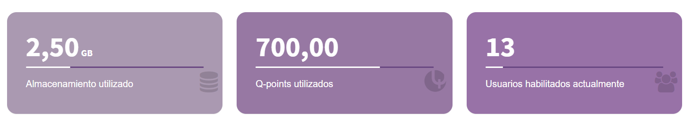](_images/image320.png)

Figura 741 Visor de licencias[](#id6 "Link to this image")

### Menú superior[](#menu-superior "Link to this heading")

La [Figura 742](#headersam) muestra el menú superior. A continuación, se explica cada una de las funciones disponibles a través de él.

[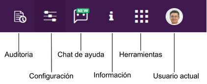](_images/image520.png)

Figura 742 Menú superior[](#id7 "Link to this image")

Al abrir la opción de auditorías, el sistema despliega un menú de opciones como muestra la [Figura 743](#auditoptions). Más detalles en la sección de [Auditoría](#auditoria).

[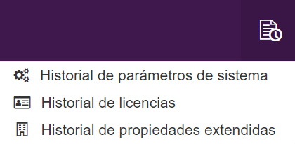](_images/image818.png)

Figura 743 Opciones de auditoría[](#id8 "Link to this image")

Al abrir la opción de configuración, el sistema despliega un menú de opciones como muestra la [Figura 744](#configurationoptions). Más detalles en [Administrar permisos](#administrar-permisos).

[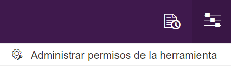](_images/image718.png)

Figura 744 Opciones de configuración[](#id9 "Link to this image")

Al presionar el botón de información se muestra la versión actual del producto, así como un link hacia las novedades de la versión y un manual del producto. Se pueden ver estas opciones en la [Figura 745](#info).

[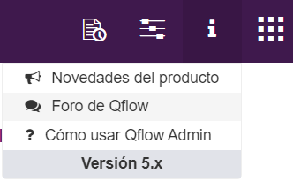](_images/image620.png)

Figura 745 Información[](#id10 "Link to this image")

Al presionar el botón de herramientas, el sistema despliega los enlaces a todas las herramientas a las que el usuario tiene permisos. Al hacer clic en una de ellas se abrirá en una nueva pestaña.

[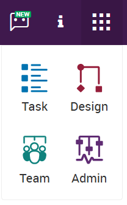](_images/image719.png)

Figura 746 Herramientas[](#id11 "Link to this image")

El botón de chat de ayuda permite mostrar u ocultar el chat de asistencia con inteligencia artificial.

Al abrir la opción “Usuario actual”, el sistema despliega la zona horaria de preferencia del usuario y el botón de cerrado de sesión. Esta zona horaria es la utilizada en todas las fechas y horas de Qflow para el usuario actual. La preferencia se comparte con todas las herramientas del producto, por lo que su modificación en una de ellas afecta a las otras.

[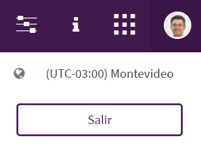](_images/image586.png)

Para la edición de la zona horaria se debe seleccionar la opción “Usuario actual” del menú. Esto abrirá un panel derecho con la lista de zonas horarias disponibles. Luego de seleccionada la zona horaria, al guardar el panel, la página se refrescará automáticamente para que el cambio tenga efecto. Se debe tener en cuenta que si se tiene más ventanas abiertas de alguna de las herramientas de Qflow, deben ser refrescadas manualmente para que el cambio tenga efecto.

[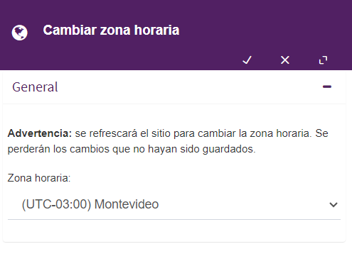](_images/image676.png)

### Menú lateral[](#menu-lateral "Link to this heading")

La [Figura 747](#sidebar) muestra el menú lateral, y cuáles son las opciones que contiene. Con la excepción de la página de inicio, cada opción corresponde a una funcionalidad de la herramienta, y éstas se explican en las siguientes secciones.

[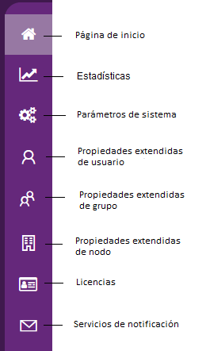](_images/image9cloud.png)

Figura 747 Menú lateral[](#id12 "Link to this image")

## Estadísticas[](#estadisticas "Link to this heading")

Qflow cuenta con una funcionalidad que indica el uso de la licencia del espacio de trabajo actual. Consta de dos reportes, uno para el uso de la licencia en el mes actual (ver [Uso de licencia](#uso-de-licencia)) y otro para el histórico de consumo de licencias anteriores (ver [Historial de uso de licencia](#historial-de-uso-de-licencia)). Cada reporte contiene distintas gráficas para el análisis de los distintos elementos de la licencia. Para poder acceder a las estadísticas, seleccione la opción correspondiente en el menú lateral (ver [Figura 747](#sidebar)).

[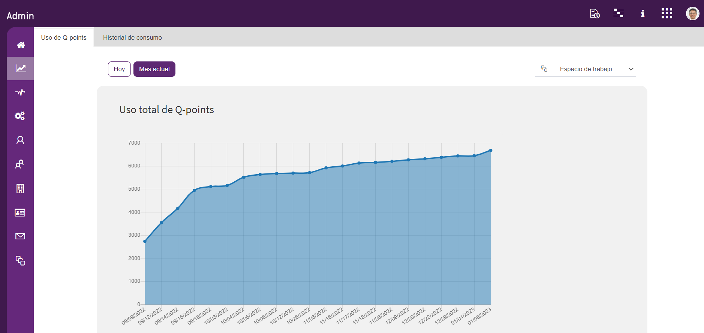](_images/image60cloud.png)

Figura 748 Estadísticas[](#id13 "Link to this image")

### Uso de licencia[](#uso-de-licencia "Link to this heading")

En este reporte se encuentran dos gráficas, las dos relacionadas con el consumo de Q-points en el mes actual. En la primera gráfica se muestra el uso de Q-points a lo largo del mes actual. Por otro lado, la segunda gráfica indica lo mismo que la anterior pero agrupando los Q-points por plantilla de proceso. En esta última gráfica si el sistema no logra obtener el nombre de la plantilla (debido a que fue eliminada), se mostrará el identificador de ésta.

Figura 749 Estadística de uso total de Q-points[](#id14 "Link to this image")

[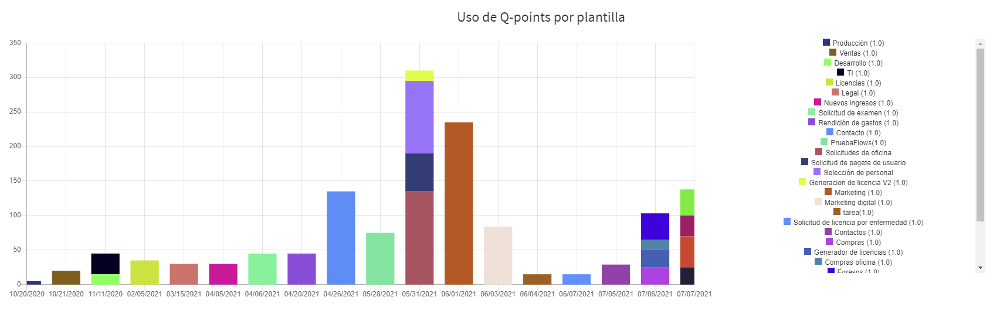](_images/image625.png)

Figura 750 Estadística de uso de Q-points por plantilla[](#id15 "Link to this image")

En la esquina superior izquierda se encuentran dos botones para cambiar la agrupación de los datos de las gráficas (ver [Figura 751](#agregationbuttons)). Con estos botones se puede indicar si se desea ver los datos sólo para el día actual o para todo el mes.

Figura 751 Botones de agrupación de datos de gráficas[](#id16 "Link to this image")

En la esquina superior derecha de la ventana se encuentra un botón para poder acceder al reporte de historial de uso de licencia, el cual se detalla en la siguiente sección.

### Historial de uso de licencia[](#historial-de-uso-de-licencia "Link to this heading")

Al seleccionar dicha opción, se desplegarán cinco gráficas. Las dos primeras indican la cantidad de tareas respondidas y procesos iniciados en un periodo de tiempo. Las gráficas restantes muestran el historial de consumo de Q-points, usuarios habilitados y uso de almacenamiento en el último año agrupadas por mes.

[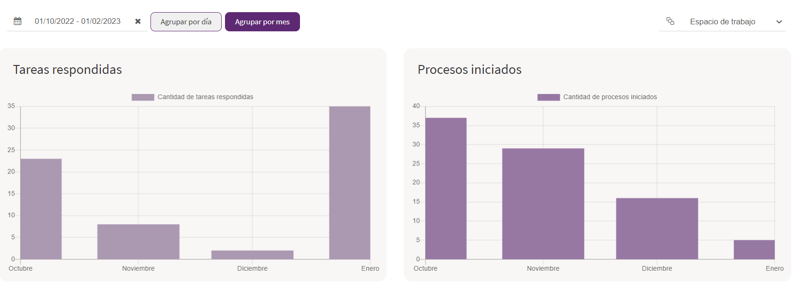](_images/image566.png)

Figura 752 Estadísticas de tareas respondidas y procesos iniciados[](#id17 "Link to this image")

[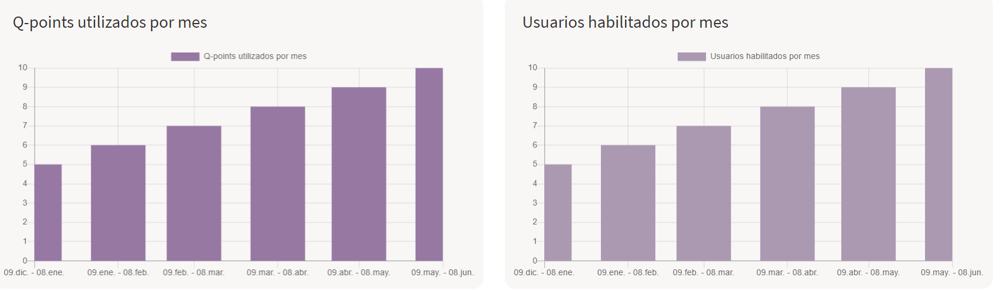](_images/image645.png)

Figura 753 Estadísticas de Q-points utilizados y usuarios habilitados[](#id18 "Link to this image")

[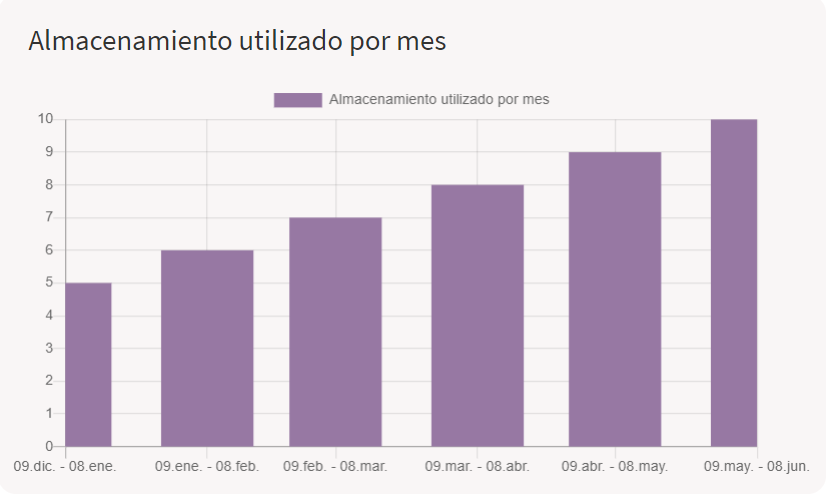](_images/image655.png)

Figura 754 Estadística de almacenamiento utilizado[](#id19 "Link to this image")

Las dos primeras gráficas cuentan con filtros, entre ellos está la opción de agrupar por mes o por día (por defecto se agrupan por día), y también se puede establecer un período personalizado (por defecto el mes actual).

[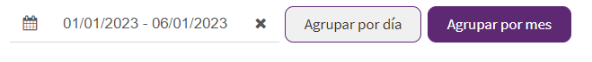](_images/image575.png)

Figura 755 Filtros[](#id20 "Link to this image")

## Parámetros de sistema[](#parametros-de-sistema "Link to this heading")

Los parámetros del sistema son parámetros predefinidos que controlan varios aspectos del funcionamiento del producto. Pueden ser de tipo numérico, verdadero/falso (booleano), texto o imagen. Tienen un valor, y también un valor por defecto, que es el que se usa cuando no tienen un valor definido. Para ver el listado completo, ir a la sección [Listado de parámetros de sistema](#listado-de-parametros-de-sistema).

Para acceder al listado de parámetros de sistema, seleccione la opción correspondiente en el menú lateral (ver [Figura 747](#sidebar)). Al seleccionar dicha opción, se desplegará un listado con todos los parámetros de sistema.

[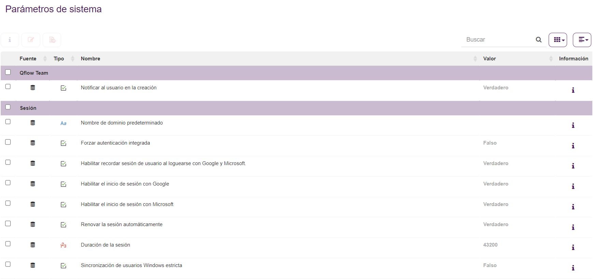](_images/image1416.png)

Figura 756 Listado de parámetros de sistema[](#id21 "Link to this image")

Mediante los botones que se encuentran arriba de la tabla, se puede editar o ver el historial de un parámetro de sistema.

[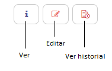](_images/image1516.png)

Figura 757 Botones de parámetros de sistema[](#id22 "Link to this image")

Algunas aclaraciones sobre el listado:

*   La columna “Fuente” hace referencia a si el parámetro fue tomado de una base de datos ([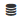](_images/image1616.png)) o de un archivo ([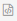](_images/image1716.png)).
    
*   Si la fila con la información del parámetro está en color gris, eso significa que el parámetro es de sólo lectura y no puede ser editado.
    
*   Si el valor aparece en negrita y color gris, es el valor por defecto.
    
*   Al hacer clic sobre el ícono de información ([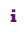](_images/image1815.png)), se mostrará una descripción del objetivo del parámetro. Haga clic sobre cualquier parte del listado para cerrarla.
    

Para editar cualquier parámetro que lo permita, haga clic sobre este y luego en el botón de editar. Se abrirá un panel como muestra la [Figura 758](#systemparameterupdatepanel). En caso de hacer clic en el botón de Ver, se abrirá el mismo panel de edición, pero en modo solo lectura.

Figura 758 Panel de edición de parámetro de sistema[](#id23 "Link to this image")

Puede seleccionar usar el valor por defecto, o ingresar un valor personalizado. Este valor puede ser vacío. Al modificar un parámetro, es necesario reiniciar el servicio para ver el cambio.

Puede seleccionar usar el valor por defecto, o ingresar un valor personalizado. Este valor puede ser vacío.

Al hacer clic en el botón de “Ver historial” se abrirá un panel derecho con el historial de cambios del parámetro de sistema seleccionado. En este panel se puede ver el nombre de la acción realizada, el nuevo valor seleccionado para el parámetro de sistema, el usuario que ejecutó la acción y la hora de esta.

[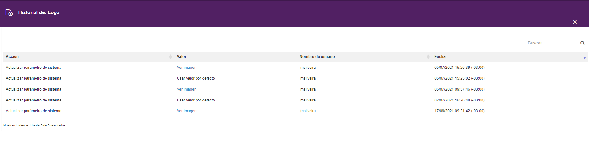](_images/image2014.png)

Figura 759 Historial de un parámetro de sistema[](#id24 "Link to this image")

## Propiedades extendidas[](#propiedades-extendidas "Link to this heading")

Las propiedades extendidas son definidas por la organización y son mostradas en el panel de propiedades de cada miembro del modelo organizacional (usuario, grupo y nodo), en el administrador de dicho modelo. Para ver su utilización, consulte el manual de [Qflow Team](18-QflowTeam.html).

Una propiedad extendida tiene una clave y un texto. Además, puede tener uno de los siguientes tipos: texto, número, fecha, verdadero/falso (booleano), miembro o lista de ítems. En este último caso, se crea una lista de elementos que tienen una clave y un valor, ambos de tipo texto.

### Propiedades extendidas de usuario[](#propiedades-extendidas-de-usuario "Link to this heading")

Puede agregar, ver, editar y eliminar las propiedades extendidas del usuario desde la opción correspondiente en el menú lateral (ver [Figura 747](#sidebar)). Al seleccionar dicha opción, se desplegará un listado con las propiedades extendidas definidas.

[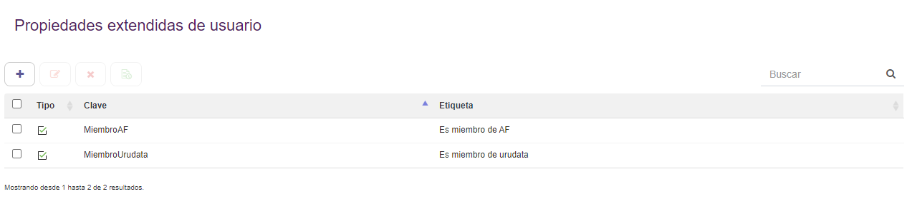](_images/image2115.png)

Figura 760 Listado de propiedades extendidas de usuario[](#id25 "Link to this image")

Mediante los botones que se encuentran arriba de la tabla, se puede agregar, editar o eliminar una propiedad.

[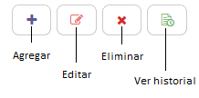](_images/image2215.png)

Figura 761 Botones de propiedades extendidas[](#id26 "Link to this image")

Si hace clic sobre el botón de agregar, se abrirá un panel para crear la nueva propiedad.

[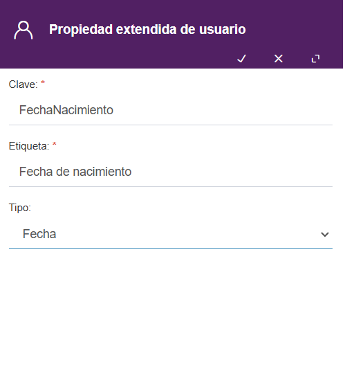](_images/image2316.png)

Figura 762 Agregar propiedad extendida de usuario[](#id27 "Link to this image")

Deberá ingresar una clave y un texto. Tenga en cuenta que, una vez creada una propiedad extendida, su clave no podrá ser cambiada. Si desea que la propiedad tenga un tipo diferente de Texto, haciendo clic en el botón con la flecha en el campo Tipo, se desplegará un listado con los tipos mencionados en la sección [Propiedades extendidas](#propiedades-extendidas). En caso de que seleccione Lista de ítems, se abrirá una tabla como muestra la [Figura 763](#itemlist). Puede agregar o quitar ítems, moverlos de lugar y editar el valor del texto o la clave.

[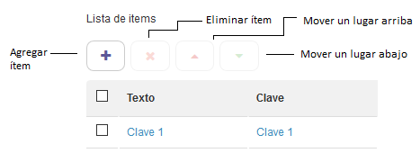](_images/image2414.png)

Figura 763 Lista de ítems[](#id28 "Link to this image")

Es obligatorio que exista al menos un ítem en la lista. Además, no puede haber claves repetidas, ni ningún valor (clave o texto) vacío.

Cuando haga clic en el botón de guardar (ícono de tic en la esquina superior derecha), se cerrará el panel y aparecerá la nueva propiedad en el listado.

[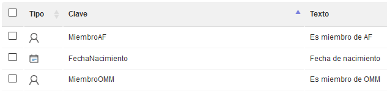](_images/image2515.png)

Figura 764 Nueva propiedad en el listado[](#id29 "Link to this image")

Si selecciona la propiedad y hace clic en el botón de Editar, se abrirá el panel de edición.

Figura 765 Panel de edición de propiedad extendida de usuario[](#id30 "Link to this image")

Note que la clave está deshabilitada para edición, y sólo puede cambiar los otros campos.

En el listado, también puede seleccionar tantas propiedades como desee para eliminarlas. Si hace clic en el botón de Eliminar, se mostrará un cartel de advertencia.

Figura 766 Confirmar eliminación de propiedades extendidas[](#id31 "Link to this image")

Seleccione Sí para confirmar.

Al hacer clic en el botón de “Ver historial” se abrirá un panel derecho con el historial de cambios de la propiedad extendida seleccionada. En este panel se puede ver el nombre de la acción realizada, el usuario que ejecutó la acción y la hora de esta. Si se hace clic en el botón de “+” se despliegan detalles sobre la propiedad extendida tales como tipo y etiqueta. También se muestran datos sobre el IP y el MAC del usuario que realizó los cambios.

Figura 767 Historial de una propiedad extendida[](#id32 "Link to this image")

### Propiedades extendidas de grupo[](#propiedades-extendidas-de-grupo "Link to this heading")

Puede agregar, editar y eliminar las propiedades extendidas del grupo desde la opción correspondiente en el menú lateral (ver [Figura 747](#sidebar)). Al seleccionar dicha opción, se desplegará un listado con las propiedades extendidas definidas.

[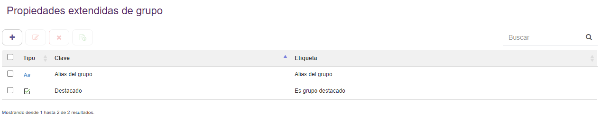](_images/image296.png)

Figura 768 Listado de propiedades extendidas de grupo[](#id33 "Link to this image")

Las operaciones sobre los elementos de este listado son análogas a las que se explican en la sección [Propiedades extendidas de usuario](#propiedades-extendidas-de-usuario).

### Propiedades extendidas de nodo[](#propiedades-extendidas-de-nodo "Link to this heading")

Si desconoce el concepto de nodo, consulte el manual de [Qflow Team](18-QflowTeam.html).

Puede agregar, editar y eliminar las propiedades extendidas de un nodo desde la opción correspondiente en el menú lateral (ver [Figura 747](#sidebar)). Al seleccionar dicha opción, se desplegará un listado con las propiedades extendidas definidas.

[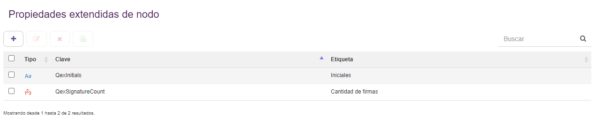](_images/image306.png)

Figura 769 Listado de propiedades extendidas de nodo[](#id34 "Link to this image")

Las operaciones sobre los elementos de este listado son análogas a las que se explican en la sección [Propiedades extendidas de usuario](#propiedades-extendidas-de-usuario).

## Licencias[](#licencias "Link to this heading")

En esta sección podremos ver todas las licencias que existen en el sistema. Para acceder al listado, seleccione la opción correspondiente en el menú lateral (ver [Figura 747](#sidebar)).

Se desplegará un listado mostrando todas las licencias que se encuentran cargadas en el sistema. Además, se muestra, encima del listado, el producto para el cual se están visualizando las licencias, así como la organización actual.

El listado de licencia contendrá distintos campos dependiendo de si se está utilizando la versión OnPremise o Cloud. A continuación, se detallan los campos comunes entre las dos versiones:

*   **Tipo:** indica el tipo de licencia.
    
*   **Nombre de la organización:** indica la organización para la cual esa licencia fue expedida. Si no coincide con el nombre de organización configurado, la licencia no será considerada válida.
    
*   **Cantidad de usuarios:** indica la cantidad de usuarios que se habilitan con esa licencia.
    
*   **Fecha de expiración**
    
*   **Estado:** muestra un ícono que indica si la licencia es válida o si hay algún problema. Los posibles estados son:
    
    *   [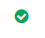](_images/image556.png)La licencia es válida
        
    *   [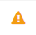](_images/image536.png)La licencia ha expirado
        
    *   [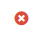](_images/image546.png)La licencia no aplica a la organización
        
    
    En cualquier caso, al pasar el cursor sobre el ícono, se mostrará un cartel con la descripción del estado.
    

También se puede cargar una nueva licencia, haciendo clic en el botón “+” sobre el listado. Se abrirá un cuadro de diálogo para que usted seleccione el archivo de licencia almacenado en su equipo. Los tipos de archivo soportados son xml y qlic. Una vez cargada, la licencia se mostrará en el listado.

### Modelo de licencias[](#modelo-de-licencias "Link to this heading")

Para ver nuestras licencias disponibles acceda a la siguiente pagina: [Precios Qflow](https://qflowbpm.com/es/precios/)

[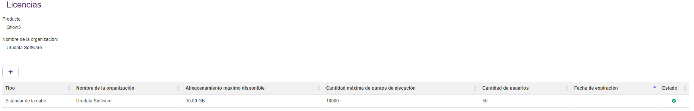](_images/image665.png)

Figura 770 Listado de licencias Cloud[](#id35 "Link to this image")

La información que se puede ver en el listado es la siguiente:

*   **Almacenamiento máximo disponible**: indica la cantidad máxima de almacenamiento en Gigabytes que tiene disponible la licencia.
    
*   **Cantidad máxima de puntos de ejecución**: indica la cantidad máxima de Q-points que tiene disponible la licencia.
    

## Servicios de notificación[](#servicios-de-notificacion "Link to this heading")

Los servicios de notificación son los servicios de correo y notificaciones push de Qflow. Para visualizarlos, seleccione la opción correspondiente en el menú lateral (ver [Figura 747](#sidebar)). Al seleccionar dicha opción, se desplegará el listado de servicios de notificación.

[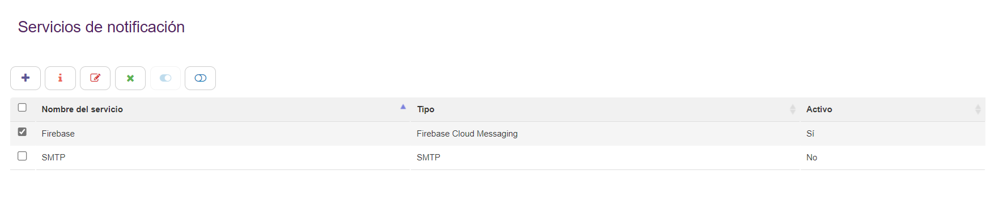](_images/image38cloud.png)

Figura 771 Listado de servicios de notificación[](#id36 "Link to this image")

Mediante los botones que se encuentran arriba de la tabla, se puede ver, configurar, habilitar y deshabilitar un servicio.

[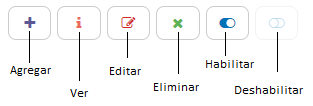](_images/image39cloud.png)

Figura 772 Opciones del listado de servicios de notificación[](#id37 "Link to this image")

### Configurar servicios de notificación[](#configurar-servicios-de-notificacion "Link to this heading")

La opción “Configurar” abre un nuevo panel en el cual se puede decidir si usar la configuración predeterminada o personalizarla.

[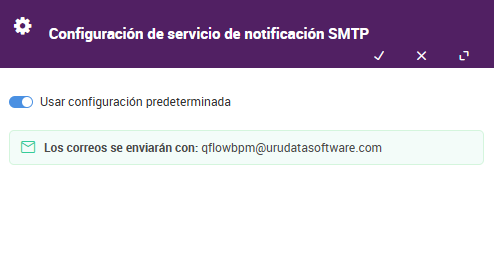](_images/image476.png)

Figura 773 Configuración de un servicio de notificación predeterminada[](#id38 "Link to this image")

[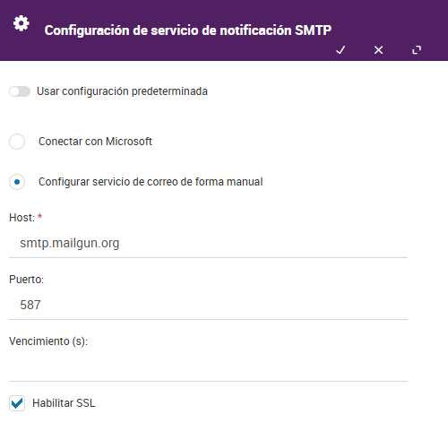](_images/image686.png)

Figura 774 Configuración de un servicio de notificación personalizada[](#id39 "Link to this image")

### Configuración de servicios de notificación[](#configuracion-de-servicios-de-notificacion "Link to this heading")

Existen 4 tipos de servicios de notificación: SMTP, Extended MAPI, Servicio web Exchange y Firebase cloud messaging. A continuación, se detalla la configuración necesaria para el correcto funcionamiento de los servicios.

#### SMTP[](#smtp "Link to this heading")

Los servicios del tipo SMTP tienen dos posibles configuraciones, conectarse con una cuenta de Microsoft o configurar el servicio manualmente.

**Configurar el servicio con Microsoft**

Para configurarlo solo se debera conectarse con una cuenta de Microsoft dandole click al boton Microsoft.

[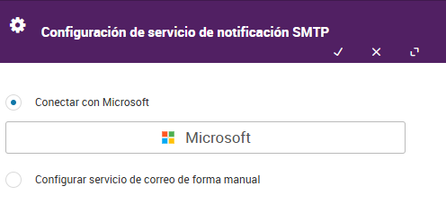](_images/image695.png)

Figura 775 Servicio a configurar con Microsoft[](#id40 "Link to this image")

Una vez conectado a su cuenta ya se podra usar el servicio de notificación SMTP con Microsoft.

[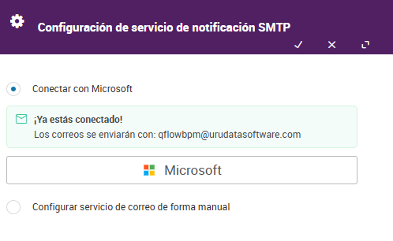](_images/image706.png)

Figura 776 Servicio configurado con Microsoft[](#id41 "Link to this image")

**Configurar el servicio manualmente**

Los servicios del tipo SMTP las siguientes propiedades:

*   **Host:** nombre del servidor SMTP
    
*   **Puerto (Opcional):** si el servidor no utiliza el puerto por defecto, esta propiedad permite especificar otro puerto.
    
*   **Vencimiento (Opcional):** permite especificar un valor de _vencimiento_ en segundos.
    
*   **SSL:** permite activar o desactivar SSL (conexión segura). Si la opción no se encuentra marcada, el SSL queda desactivado.
    
*   **Usuario SMTP:** permite especificar un usuario para el servicio.
    
*   **Usuario Remitente:** nombre de usuario del sistema. Es el nombre que aparecerá como remitente de los mensajes enviados por Qflow.
    
*   **Correo de sistema:** dirección de correo electrónico del sistema. Es la dirección desde la cual se enviarán los mensajes de Qflow.
    

[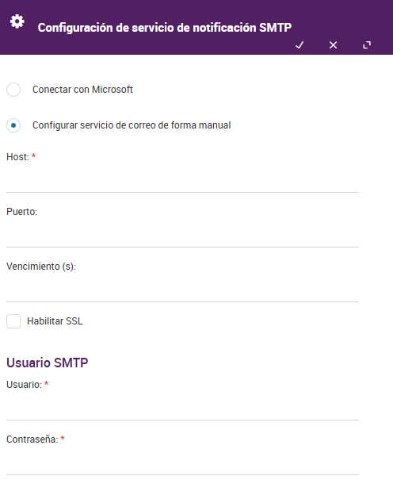](_images/image418.png)

Figura 777 Servicio de notificación SMTP[](#id42 "Link to this image")

#### Extended MAPI[](#extended-mapi "Link to this heading")

Los servicios del tipo Extended MAPI tienen las siguientes propiedades:

*   **Servidor:** nombre del servidor de Exchange.
    
*   **Mailbox:** casilla de correo a ser utilizada por Qflow.
    
*   **Clase de mensaje:** clase de los mensajes. Por defecto, _IPM.Note.Qflow_.
    
*   **Perfil (Opcional):** nombre del perfil a ser utilizado por Qflow.
    
*   **Contraseña (Opcional):** contraseña del perfil.
    

[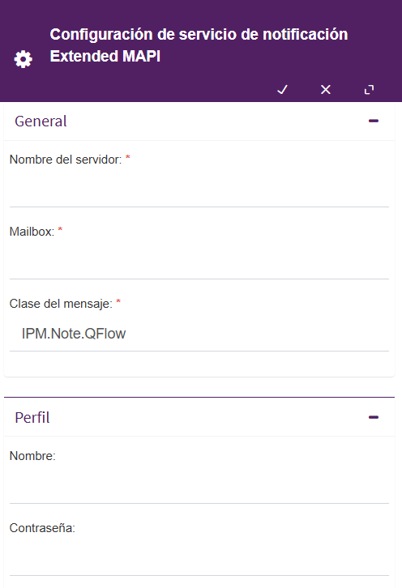](_images/image425.png)

Figura 778 Servicio de notificación Extended MAPI[](#id43 "Link to this image")

#### Servicio web Exchange[](#servicio-web-exchange "Link to this heading")

Los servicios del tipo Exchange tienen las siguientes propiedades:

*   **Url:** Url de los _web services_ de Exchange.
    
*   **Versión de Exchange:** versión de Exchange instalada en el servidor que se va a utilizar.
    
*   **Clase de mensaje:** clase de los mensajes. Por defecto, _IPM.Note.Qflow_.
    
*   **Usuario (Opcional):** cuenta de usuario que se debe utilizar.
    
*   **Contraseña (Opcional):** contraseña de la cuenta de usuario indicada en la propiedad Usuario.
    
*   **Correo de sistema:** casilla de correo electrónico del sistema.
    

[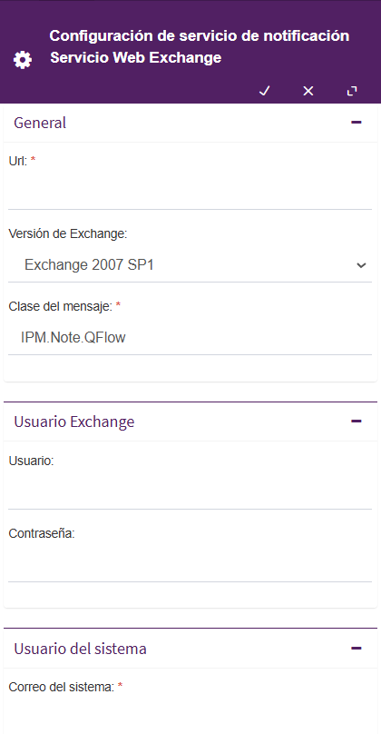](_images/image436.png)

Figura 779 Configuración de servicio web Exchange[](#id44 "Link to this image")

#### Firebase Cloud Messaging[](#firebase-cloud-messaging "Link to this heading")

Los servicios de tipo Firebase, a diferencia de los descritos previamente, se trata de servicios de notificaciones push. Por lo tanto, no es necesario configurar los formatos de correo. Para poder configurar el servicio de Firebase se deberá acceder a la siguiente consola y crear un proyecto: [https://console.firebase.google.com/](https://console.firebase.google.com/)

Dentro de la configuración del proyecto de Firebase se pueden tomar todos los datos necesarios para configurar el servicio de notificación en Qflow Admin.

La [Figura 780](#firebaseconfiguration) muestra la configuración general del proyecto desde donde se puede tomar la Id del proyecto y la clave de API de la web. En el caso que no vea la clave de API de la web debe habilitar el servicio de autenticación de Firebase desde la consola del proyecto.

[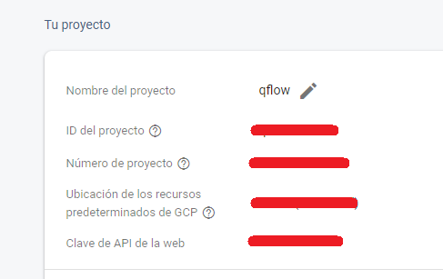](_images/image446.png)

Figura 780 Configuración general de Firebase[](#id45 "Link to this image")

Los datos restantes corresponden a la aplicación web que se quiere utilizar, los datos pueden ser extraídos de la sección “Tus aplicaciones” seleccionando la opción configuración como muestra la [Figura 781](#firebaseappconfiguration). Para más información sobre cómo crear una aplicación ir a la siguiente guía: [https://firebase.google.com/docs/web/setup#register-app](https://firebase.google.com/docs/web/setup#register-app).

[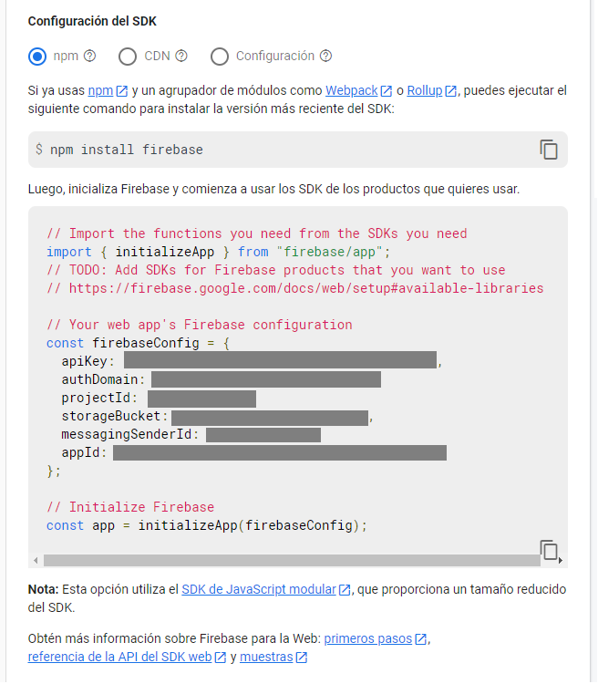](_images/image456.png)

Figura 781 Configuración de aplicación de Firebase[](#id46 "Link to this image")

Finalmente, el campo “Configuración de servidor” debe tener un json correspondiente al SDK de Firebase Admin, el cual puede ser obtenido siguiendo la siguiente guía: [https://firebase.google.com/docs/admin/setup#initialize-sdk](https://firebase.google.com/docs/admin/setup#initialize-sdk).

En la [Figura 782](#firebasenotificationservice) se puede ver el panel de configuración de Firebase, por más detalles sobre la configuración de un servidor Firebase dirigirse al siguiente manual: [https://firebase.google.com/docs/web/setup](https://firebase.google.com/docs/web/setup)

[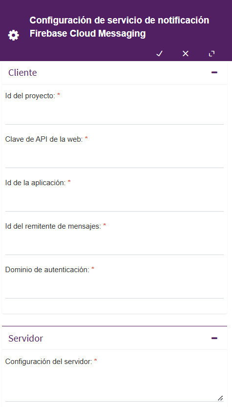](_images/image465.png)

Figura 782 Servicio de notificación Firebase[](#id47 "Link to this image")

## Administrar permisos[](#administrar-permisos "Link to this heading")

Al seleccionar la opción “Administrar permisos de la herramienta” en el menú de configuración, se abrirá un panel como muestra la [Figura 783](#managesampermissions).

[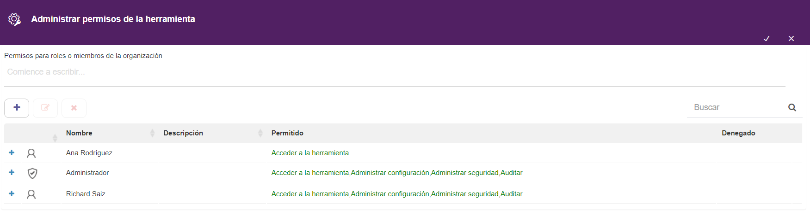](_images/image486.png)

Figura 783 Administrar permisos de Qflow Admin[](#id48 "Link to this image")

Para agregar un usuario, grupo o rol de seguridad al conjunto de entidades que tienen permisos sobre el nodo:

1.  Haga clic en el botón “Agregar”. Eso hace que aparezca en la parte superior de dicho botón un texto que dice “Comience a escribir…”. Escriba parte del nombre del usuario, grupo o rol deseado.
    
2.  Cuando se muestre en la lista desplegable, selecciónelo.
    

Una vez agregados los usuarios, roles y grupos, es posible definir qué permisos tienen cada uno de ellos. Esto se hace marcando los casilleros “Permitir” o “Denegar” al lado de cada permiso como se muestra en la [Figura 784](#selectpermissions).

Los posibles permisos son:

*   **Administrar seguridad**: permite agregar y modificar los permisos de la herramienta.
    
*   **Acceder a la herramienta:** permite acceder a Qflow Admin.
    
*   **Administrar configuración:** permite editar aquellos elementos de la herramienta que son editables (parámetros de sistema y propiedades extendidas).
    
*   **Auditar:** permite acceder a las auditorías de los distintos elementos de Qflow Admin
    

Para una explicación detallada acerca del funcionamiento de los permisos de Qflow, consulte la sección “Manejo de permisos en Qflow” del manual de [Qflow Team](18-QflowTeam.html).

[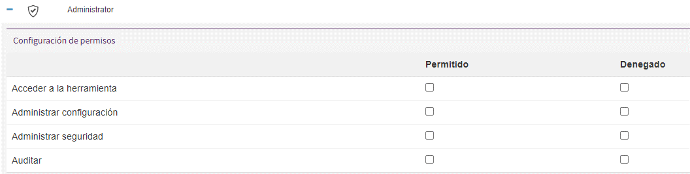](_images/image495.png)

Figura 784 Seleccionar permisos[](#id49 "Link to this image")

Para editar permisos de un usuario, grupo o rol:

1.  Seleccione el elemento al que quiera editarle los permisos y haga clic en el botón “Editar”, o haga clic en el símbolo “+” que se encuentra al lado del elemento.
    
2.  Se volverá a mostrar el formulario “Configuración de permisos”. Seleccione las acciones que quiera permitir o denegar en el nuevo permiso.
    

Para eliminar permisos a un usuario, grupo o rol:

1.  Seleccione el elemento al que quiera eliminarle los permisos y posteriormente haga clic en el botón “Eliminar”.
    
2.  Se mostrará un mensaje de advertencia. Haga clic en el botón “Sí” y se eliminarán todos los permisos para el elemento seleccionado.
    

## Auditoría[](#auditoria "Link to this heading")

Si se disponen los permisos de auditar en Qflow Admin, se puede ver en el menú superior derecho la opción de auditorías, si se hace clic se despliega un panel de opciones. Esta funcionalidad brinda la capacidad de verificar los cambios realizados en propiedades extendidas, licencias y parámetros de sistema, indicando sus nuevos valores, el usuario que realizó el cambio además de su fecha y hora.

### Historial de parámetros de sistema[](#historial-de-parametros-de-sistema "Link to this heading")

Esta auditoría indica los cambios realizados sobre todos los parámetros de sistema. Si se desea saber los cambios sobre un parámetro en particular se debe utilizar la barra de búsqueda, o en su defecto acceder a la opción de “Ver historial” en el listado de parámetros de sistema.

[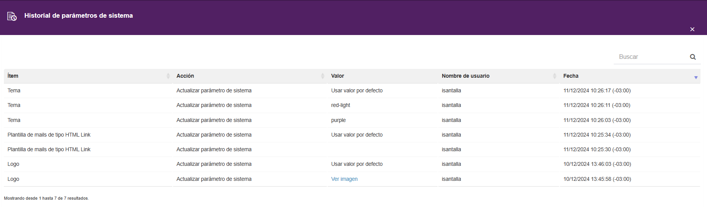](_images/image506.png)

Figura 785 Historial de parámetros de sistema[](#id50 "Link to this image")

### Historial de licencias[](#historial-de-licencias "Link to this heading")

Esta auditoría mantiene un registro de todas las licencias agregadas. En el listado se muestra el identificador de la licencia, junto con el usuario que la agregó y su correspondiente fecha y hora.

Figura 786 Historial de licencias[](#id51 "Link to this image")

### Historial de propiedades extendidas[](#historial-de-propiedades-extendidas "Link to this heading")

Esta auditoría lista todos los cambios realizados en todas las propiedades extendidas, sin importar el tipo de propiedad. Cada entrada en la tabla contiene un logo correspondiente al tipo de propiedad y se puede ampliar mostrando más detalles sobre los cambios. Si se quiere filtrar por una propiedad en particular se puede utilizar el buscador o ir al listado de propiedades extendidas y acceder al historial particular de una propiedad.

[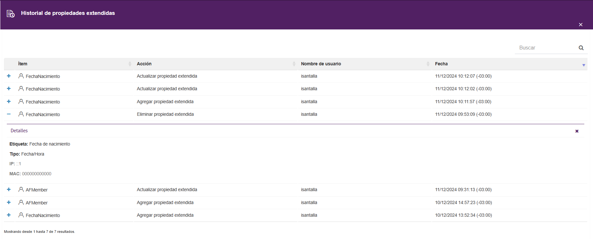](_images/image526.png)

Figura 787 Historial de propiedades extendidas[](#id52 "Link to this image")

## Listado de parámetros de sistema[](#listado-de-parametros-de-sistema "Link to this heading")

| Nombre técnico | Nombre | Descripción |
| --- | --- | --- |
| ActionLink | Vínculo de acción | Es la URL que utilizan los vínculos a acciones en los mensajes enviados por correo electrónico. |
| DefaultDomainNetbiosName | Nombre de dominio predeterminado | Especifica un nombre de dominio por defecto al hacer login en las aplicaciones o en los sitios web. |
| EnableAIAssistant [\[\*\]](#id4) | Habilitar asistente de IA | Si el valor de este parámetro es “verdadero”, el acceso al asistente de IA estará habilitado. Los administradores podrán restringir el acceso en el caso de ser detectado un uso malicioso. Si cree que ha habido un error, por favor contáctese con soporte técnico. |
| EncryptAttachments | Encriptar archivos adjuntos | Si el valor de este parámetro es “verdadero”, Qflow cifrará el contenido de los archivos adjuntos, de modo que la única forma de acceder a dicho contenido sea por medio de los permisos de Qflow. Si este parámetro está activado, no es posible hacer búsquedas full-text utilizando el contenido de los archivos adjuntos. |
| EnforceIntegratedLogon | Forzar autenticación integrada | Si el valor de este parámetro es «verdadero», los usuarios solo podrán ingresar a la aplicación mediante autenticación integrada. |
| FlowDetailsLink | Vínculo a detalles del proceso | Es la url enviada por correo, la cual redirige hacia los detalles de un proceso. |
| FlowEditFormLink | Vínculo al formulario de edición del proceso | Es la url enviada por correo, la cual redirige hacia el panel de edición de un proceso. |
| GuestResponseLink | Vínculo de respuesta como invitado | Esta URL se utiliza en los mensajes de notificación enviados por correo electrónico, permitiendo el acceso a los formularios de respuesta como invitado. |
| HtmlLinkTemplate | Plantilla de mails de tipo HTML Link | Indica la ruta del archivo correspondiente a la plantilla de envío de correos html. |
| IsGoogleAndMicrosoft  RememberSessionEnabled | Habilitar recordar sesión de usuario al loguearse con Google y Microsoft | Si el valor de este parámetro es “verdadero”, las sesiones iniciadas mediante Google o Microsoft permanecerán abiertas entre sesiones del navegador. Si es “falso”, al cerrar el navegador se cerrará la sesión. Asegúrese de tener su navegador configurado para recordar cookies o esto no funcionará. |
| IsGoogleSignInEnabled | Habilitar el inicio de sesión con Google | Si el valor de este parámetro es “verdadero”, Qflow permitirá que los usuarios se autentiquen con su cuenta de Google en los distintos sitios. De lo contrario, esta opción no se mostrará. |
| IsMicrosoftSignInEnabled | Habilitar el inicio de sesión con Microsoft | Si el valor de este parámetro es “verdadero”, Qflow permitirá que los usuarios se autentiquen con su cuenta de Microsoft en los distintos sitios. De lo contrario, esta opción no se mostrará. |
| LicenseExpiration  AlertThreshold | Alerta de vencimiento de licencia | Es un número entero que indica cuántos días antes del vencimiento de las licencias se notificará a los usuarios que las licencias están a punto de vencer. Por defecto, tiene un valor de 7, es decir, avisa una semana antes. |
| Logo | Logo | Es la imagen del logo que será utilizada en las distintas vistas de inicio de sesión. La relación debe ser 4:1 para que la imagen se muestre correctamente. |
| LogoLightVersion | Logo en versión clara | Versión clara del logo de Qflow. La relación debe ser 4:1 para que la imagen se muestre correctamente. |
| MailLogo | Logo de correos | Es la url que se utilizará para acceder al logo que se mostrará en los distintos correos enviados por Qflow. La imagen debe estar en formato png, jpg o jpeg para que se muestre correctamente. |
| MiniLogo | Mini logo | Imagen para el logo de la barra lateral colapsada del sitio web. La relación debe ser 1:1 para que la imagen se muestre correctamente. |
| NotifyUserOnCreation | Notificar usuario en la creación | Si el valor de este parámetro es “verdadero”, se le enviará una notificación a cada usuario que sea agregado al espacio de trabajo. |
| OrganizationName | Nombre de la organización | Indica el nombre de la organización. Este nombre es utilizado por Qflow para controlar las licencias del producto. |
| RenewSessionAutomatically | Renovar la sesión automáticamente | Indica si las herramientas de Qflow, tanto de escritorio como las web, deben renovar automáticamente la sesión del usuario cuando ésta se vence. |
| ResponseLink | Vínculo de respuesta | Es la URL que utilizarán los vínculos a los formularios de respuesta de los mensajes enviados por correo electrónico. |
| SessionLeaseTime | Duración de la sesión | Duración en minutos de la sesión de un usuario de Qflow. Si no hay actividad durante ese tiempo, la sesión del usuario vence y éste debe volver a autenticarse. |
| StageLink | Vínculo de seguimiento de etapas | Es la url usada en los vínculos al seguimiento de etapas en los mensajes enviados por correo electrónico. |
| StrongWindowsSinchronization | Sincronización de usuarios Windows estricta | Si el valor de este parámetro es “verdadero”, al eliminar un usuario del Active Directory se cambiará el login de Qflow para así permitir a otro usuario utilizar el login original. |
| TaskLogo | Logo de Task | Imagen para el logo del sitio web de Task. La La relación debe ser 4:1 para que la imagen se muestre correctamente. |
| TaskMiniLogo | Mini logo de Task | Imagen para el logo del sitio web de Task usado en la barra lateral colapsada del sitio web. La relación debe ser 1:1 para que la imagen se muestre correctamente. |
| Theme | Tema | Indica qué tema utilizar en Qflow Task. |
| UndoChangesOnStepBack | Revertir cambios al retroceder | Indica si, al hacer retroceder un hilo de un proceso, se deshacen los cambios hechos a los datos de aplicación, roles y archivos adjuntos en los pasos cuya ejecución se está deshaciendo. |
| UseGravatarForProfilePicture | Usar gravatar para foto de perfil | Si el valor de este parámetro es “verdadero”, se usará el servicio de gravatar para obtener la foto de perfil de los usuarios. De lo contrario se mostrará como foto de perfil una imagen con las iniciales del usuario. |

\[[\*](#id3)\]

Parámetro disponible solo en la nube.

[Anterior](18-QflowTeam.html "Qflow Team") [Siguiente](21-Q-pointsConsumption.html "Consumo de Q-points")

- - -

© Derechos de autor 2025, Urudata Software.

jQuery(function () { SphinxRtdTheme.Navigation.enable(true); }); window.dataLayer = window.dataLayer || \[\]; function gtag(){dataLayer.push(arguments);} gtag('js', new Date()); gtag('config', 'G-LMDS8S4B42', { 'anonymize\_ip': false, });