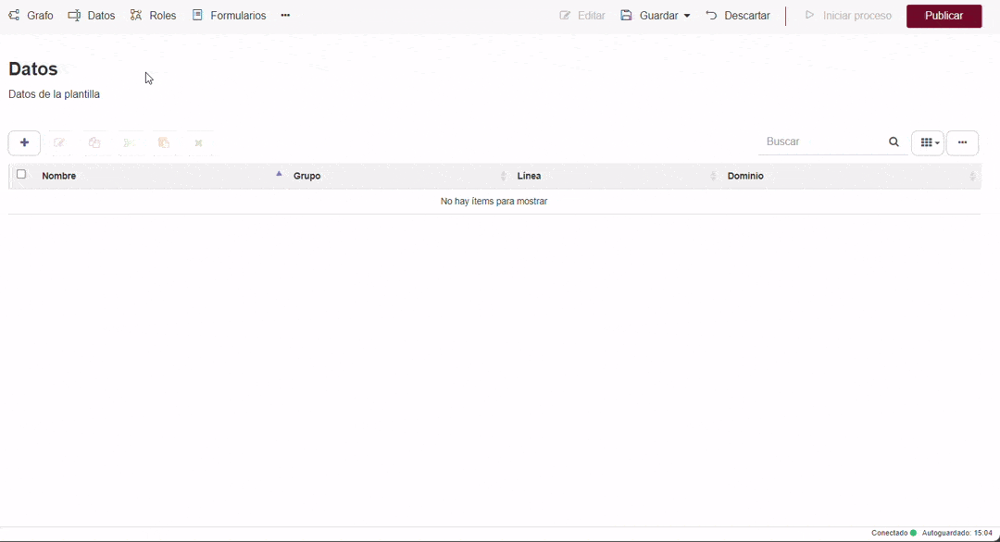

  Diseña un proceso de quejas — Qflow Cloud          

*   [Qflow](https://qflowbpm.com/es/)
*   [Foro](https://forum.qflowbpm.com/)
*   [Centro de Ayuda](https://qflowbpm.com/es/centro-de-ayuda/)
*   [Contáctanos](https://qflowbpm.com/es/contacto/)

[Qflow](index.md)

Cloud (latest) 5.5 OnPremise (latest) 5.2 OnPremise 5.1.1 OnPremise

English Español

selectElement('versionSelect', getVersion()); selectElement('languageSelect', getLanguage()); function selectElement(id, valueToSelect) { let element = document.getElementById(id); element.value = valueToSelect; } function getLanguage() { if (window.location.href.includes('/es/')) { return '/es/'; } else { return '/en/'; } } function getVersion() { if (window.location.href.includes('/qflowcloud/')) { return '/qflowcloud/'; } else if (window.location.href.includes('/qflow5\_1\_1/')) { return '/qflow5\_1\_1/'; } else if (window.location.href.includes('/qflow5\_2/')) { return '/qflow5\_2/'; } else { return '/qflow5\_5/'; } } function redirectToSite(url) { var http = new XMLHttpRequest(); http.onreadystatechange = function() { if (http.readyState === 4) { if (http.status !== 404) { window.location.href = url; } else { window.location.href = url.replace(url.substr(url.lastIndexOf('/') + 1), 'index.md'); } } } http.open('HEAD', url, true); http.send(); }

  

Inicio

*   [Novedades](29-ReleaseNote.md)
*   [Introducción a Qflow](01-QflowIntroduction.md)
*   [Tutoriales](TutorialsIndex.md)
    *   [Introducción a las herramientas de Qflow](26-QflowToolsTutorial.md)
    *   [Crea tu primer proceso](06-Tutorial.md)
    *   [Diseña un proceso de quejas](#)
        *   [Introducción](#introduccion)
        *   [Proceso de quejas](#proceso-de-quejas)
        *   [Construcción del proceso de Qflow](#construccion-del-proceso-de-qflow)
    *   [Descubre Qflow Task](24-QflowTaskTutorial.md)
    *   [Configura el equipo](27-QflowTeamTutorial.md)
    *   [Administra y monitorea el sistema](28-QflowAdminTutorial.md)
    *   [Crea tu formulario personalizado](37-QformTutorial.md)
*   [Qflow Task](04-QflowTask.md)
*   [Qflow Design](15-QflowDesign.md)
*   [Qflow Team](18-QflowTeam.md)
*   [Qflow Admin](19-QflowAdmin.md)
*   [Consumo de Q-points](21-Q-pointsConsumption.md)
*   [Conectores](34-ConnectorsIndex.md)
*   [Desarrolladores](31-Development.md)

[Qflow](index.md)

*   
*   [Tutoriales](TutorialsIndex.md)
*   Diseña un proceso de quejas

- - -

# Diseña un proceso de quejas[](#disena-un-proceso-de-quejas "Link to this heading")

## Introducción[](#introduccion "Link to this heading")

Este tutorial explica brevemente las principales funcionalidades de Qflow Design a partir del diseño de un proceso de atención de quejas.

Esta herramienta permite al usuario diseñar procesos, definir datos de aplicación, roles y otros elementos que forman la base de los procesos que se ejecutan.

## Proceso de quejas[](#proceso-de-quejas "Link to this heading")

Una empresa quiere mejorar su sistema de atención de quejas de clientes mediante un proceso de Qflow.

El proceso de quejas que implementarán se desarrolla de la siguiente manera:

1.  Un cliente llama a la empresa para expresar una queja
    
2.  El receptor de la llamada inicia un proceso de Qflow con los siguientes datos:
    
    *   Nombre del cliente
        
    *   Dirección de correo electrónico: se usará para enviarle un mensaje una vez atendida la queja
        
    *   Texto de queja: descripción de la queja del cliente
        
    *   Texto para enviar al cliente: el texto que se le enviará al cliente vía correo electrónico una vez atendida la queja
        
    *   Elegir la opción de si la queja es por mala atención, producto defectuoso u otra.
        
3.  Se dirige la queja a un departamento dependiendo de la opción de queja que se asignó: encargado de producto, encargado de atención o al gerente comercial que elige a un empleado como encargado de atender la queja.
    
4.  Cualquiera de los encargados de atender la queja la atiende y redacta un texto para enviarle por correo electrónico al cliente.
    
5.  Se envía automáticamente un mensaje de correo electrónico al cliente, utilizando el texto ingresado en el paso anterior.
    
6.  Termina la ejecución del proceso.
    

## Construcción del proceso de Qflow[](#construccion-del-proceso-de-qflow "Link to this heading")

Crea una nueva plantilla vacía para el proceso “Quejas”.

### Agregar los elementos al diseño del proceso:[](#agregar-los-elementos-al-diseno-del-proceso "Link to this heading")

1.  Al crear la plantilla se abre el “Diseño de proceso”, este viene con un evento de inicio y fin y es donde se van a agregar todos los pasos que sucedan entre estos dos.
    
    Un evento representa algo que ocurre en el proceso. Estos se pueden clasificar como Eventos de inicio, Eventos intermedios y Eventos de fin.
    
    El evento de inicio marca el inicio de un proceso. También representa el punto en el que un usuario inicia un proceso.
    
    Los eventos de fin de Qflow pueden ser de fin y de fin terminal, ambos finalizan la ejecución de los procesos.
    
    Un evento de fin terminal termina la ejecución del proceso aún cuando todavía haya hilos en ejecución. En ese caso, Qflow finaliza esos hilos y el proceso termina su ejecución. Un evento de fin, por el contrario, espera que todos los hilos terminen y una vez terminados finaliza el proceso. Los hilos del proceso se van a explicar más adelante en la sección de compuertas dento de [Configuración de las actividades](#configuracion-de-las-actividades).
    
    Este tutorial no utiliza eventos intermedios, por lo que si deseas información sobre estos consulta el manual de [Qflow Design.](15-QflowDesign.md)
    

Figura 205 Diseño de proceso[](#id2 "Link to this image")

2.  Para agregar actividades, selecciona el ícono que representa una actividad en la barra de herramientas . Hágale clic y después haga clic en el diseño.
    
    Una actividad representa una unidad de trabajo a realizar en el proceso. Esta puede ser una tarea, un proceso automático o un subproceso.
    

Figura 206 Agregar actividad[](#id3 "Link to this image")

3.  Agrega las tareas y la compuerta exclusiva para determinar a dónde se dirige la queja.
    
4.  Para conectar las actividades selecciona la herramienta de conexión (ícono violeta) en la barra de herramientas y luego haz clic en la actividad que quieras conectar.
    

Figura 207 Conectar actividades[](#id4 "Link to this image")

5.  Asigna los tipos a las actividades. Para especificar el tipo selecciona la tarea y luego haz clic en el botón . Ahí aparece un menú para elegir el tipo de la actividad. Siendo “Elegir encargado de atender la queja”, “Atender mala atención”, “Atender producto defectuoso” y “Atender queja” tareas de usuario y “Enviar respuesta al cliente” tarea de email.
    

Figura 208 Asignar tipo a la actividad[](#id5 "Link to this image")

### Roles[](#roles "Link to this heading")

Los roles representan uno o más usuarios que desempeñarán una determinada función durante la ejecución de un proceso. Cuando una plantilla de proceso especifica que Qflow debe enviar una tarea a un usuario, no especifica un usuario concreto, especifica un rol.

Se permite la opción de asignar solo a un miembro, a varios o miembros que tienen muchos usuarios (por ejemplo, grupos).

Además, se permite aplicar reglas que determinan quiénes son los miembros del rol, como ser, “supervisado por” otro miembro, “supervisor de”, entre otros.

El proceso necesita cuatro roles:

*   **Gerente comercial:** es el que recibe la tarea cuando se determinó que la queja es otra y es el que elige al encargado de atender la queja. A este rol se le puede asignar un usuario durante la definición del proceso (se sabe quién es el gerente comercial). Este rol es el destinatario de la tarea “Elegir encargado de atender la queja”.
    
*   **Encargado de atender la queja:** es el que recibe la tarea “Atender la queja”. A este rol se le asigna un usuario durante la ejecución del proceso: es lo que hace el gerente comercial. Este rol es el destinatario de la tarea “Atender la queja”.
    
*   **Encargado de atención:** es el que recibe la tarea cuando se determina que la queja es por mala atención. Asigna tu cuenta de usuario como miembro (esto es sólo para probar: naturalmente, en un caso real, cada uno tendría un miembro distinto). Este rol es el destinatario de la tarea “Atender mala atención”.
    
*   **Encargado de productos:** es el que recibe la tarea cuando se determina que la queja es por un producto defectuoso. Asigna tu cuenta de usuario como miembro (esto es sólo para probar: naturalmente, en un caso real, cada uno tendría un miembro distinto). Este rol es el destinatario de la tarea “Atender producto defectuoso”.
    

Creación del rol de “Encargado de productos”:

Figura 209 Creación de un rol[](#id6 "Link to this image")

Resultado de la creación de todos los roles:

Figura 210 Roles[](#id7 "Link to this image")

### Dominios de dato[](#dominios-de-dato "Link to this heading")

El dominio de un dato especifica el conjunto de valores que el dato puede tomar y está asociado a un tipo de dato. En Qflow, cada dato de aplicación está asociado a un dominio y este está asociado a un tipo de dato.

Qflow ofrece un conjunto de dominios básicos, pero es posible definir dominios adicionales.

Los dominios básicos de Qflow son:

*   Área de texto
    
*   Área de texto enriquecido
    
*   Contraseña
    
*   Dinero
    
*   Documento
    
*   Email
    
*   Fecha
    
*   Fecha y hora
    
*   Hora
    
*   Hipervínculo
    
*   Número
    
*   Teléfono
    
*   Texto
    
*   Verdadero/Falso
    

Crea un nuevo dominio para poder clasificar la queja: “Categoría de queja” y se le asigna el tipo de control “Combo Box”, tipo de dato “texto” y origen de dato “lista”.

Figura 211 Creación de un dominio[](#id8 "Link to this image")

Luego, ve a la configuración de la lista, haciendo clic en el botón. Dentro de la ventana se pueden agregar las distintas opciones que aparecerán en la lista con el botón “+”.

Figura 212 Configuración de la lista[](#id9 "Link to this image")

### Datos de aplicación[](#datos-de-aplicacion "Link to this heading")

Los datos de aplicación son datos que maneja Qflow en los procesos. Cada dato está asociado a un dominio, y este está asociado a un tipo de dato y a un tipo de control que determina cómo el dato será mostrado en los formularios de los procesos.

El formulario de propiedades de un dato de aplicación tiene las siguientes secciones.

*   **General:** contiene el nombre, la descripción, el dominio y otras opciones que definen el comportamiento del dato.
    
*   **Avanzado:** permite definir valores por defecto para el dato.
    
*   **Presentación:** contiene propiedades que definen aspectos de cómo el dato se verá en Qflow Task.
    

Los datos de aplicación que se necesitan para este tutorial son:

*   Nombre del cliente
    
*   Dirección de correo electrónico
    
*   Texto de la queja
    
*   Texto para enviar al cliente
    
*   Categoría
    

Cada dato de aplicación se crea presionando el botón “+”, ahí se abre una ventana para crearlo. Para cada uno ingresar sus respectivos dominios.

Creación del dato de aplicación “Nombre del cliente”:

Figura 213 Creación de un dato de aplicación[](#id10 "Link to this image")

Resultado de la creación de todos los datos de aplicación:

Figura 214 Datos de aplicación[](#id11 "Link to this image")

### Configuración de paso de inicio[](#configuracion-de-paso-de-inicio "Link to this heading")

El paso de inicio desencadena el inicio de un proceso, y por lo tanto, es en este paso donde se definen los datos de aplicación que se solicitarán en el formulario de inicio.

Para definir estos datos de aplicación, debes acceder a la ventana de configuración correspondiente al paso de inicio y allí seleccionar la pestaña «Formulario» y en la sección de “Visibilidad” podrás encontrar los datos de aplicación. A continuación, deberá marcarse como “Requerido” a cada uno de los campos que desees incluir en el formulario de inicio del proceso.

La siguiente imagen presenta un ejemplo de configuración de Visibilidad de datos.

Figura 215 Configuración de la visibilidad de datos[](#id12 "Link to this image")

### Configuración de las actividades[](#configuracion-de-las-actividades "Link to this heading")

Para definir cada actividad debes hacer clic en cada una de ellas y luego clic en el botón de azul del engranaje (“Editar”) o doble clic sobre estas y una ventana se abrirá para poder especificar las propiedades.

**Compuerta exclusiva**

Las compuertas permiten modificar el flujo de un proceso, ya sea creando varios caminos paralelos en el proceso o seleccionando un camino de varios posibles posteriores a la compuerta.

Todas las compuertas se conectan con varios elementos a través de sus conectores. Lo que cambia según el tipo de compuerta es si, una vez que un proceso pasa por ella, continúa utilizando todos los caminos, algunos de ellos o solamente uno.

Pueden ser de los siguientes tipos:

*   **Compuerta exclusiva:** selecciona uno de varios posibles caminos para que el proceso continúe su ejecución.
    
*   **Compuerta inclusiva:** selecciona uno o más de varios posibles caminos para que el proceso continúe su ejecución, de modo que puede generar varios hilos paralelos.
    
*   **Compuerta paralela:** genera tantos caminos paralelos como conexiones salientes tenga.
    

En este tutorial se creó una compuerta de tipo exclusiva. Para asignarle sus propiedades se accede a la ventana de configuración de esta.

Figura 216 Configuración de compuerta exclusiva[](#id13 "Link to this image")

Al abrir el panel de configuracion de la compuerta podemos visualizar 3 sub-secciones, cada una haciendo referencia a las tareas a las cuales la compuerta está conectada.

En la subsección correspondiente a la tarea “Atender Producto Defectuoso”, haz clic en “+ Condición”. Esto agrega una condición vacía y donde dice “Comience a escribir”, escribe “Categoría”. Cuando aparezca una lista con el dato de aplicación “Categoría”, selecciónalo.

En la caja de texto que aparece debajo de “Categoría”, escribe “Producto defectuoso”.

Haz lo mismo en la subsección correspondiente a “Atender mala atención”, pero escribiendo “Mala atención” en lugar de “Producto defectuoso” en la condición.

Figura 217 Condiciones de la compuerta exclusiva[](#id14 "Link to this image")

Finalmente, existe la posibilidad de una conexión por defecto que es la que usa una compuerta exclusiva cuando ninguna de las condiciones que contiene es evaluada como verdadera.

Para definir una conexión por defecto, en la plantilla del proceso haz clic en la conexión que une a la compuerta a la tarea “Elegir encargado de atender queja”. Haz clic en el ícono verde que muestra dos flechitas blancas y seleccione “Conexión por defecto”. De este modo, si ninguna de las otras expresiones se evalúa como verdadera, se utilizará esta conexión.

La flecha que conecta las actividades quedará así:

Figura 218 Conexión por defecto[](#id15 "Link to this image")

**Tarea “Elegir encargado de atender la queja”**

Al ser una tarea de usuario hay que definir el mensaje, destinatarios, las respuestas y la visibilidad de los datos.

En el mensaje agregar, “Elegir encargado de queja de ” y (seguido de un espacio) incluye el nombre del cliente en el asunto. Este se agrega con una etiqueta, la cual se define con un “#” y luego agregando el dato de aplicación “Nombre de cliente”.

Luego, hay que seleccionar el destinatario de la tarea. El destinatario es el rol al que se asignará la tarea (mediante el rol, la tarea se asigna a usuarios: los miembros del rol). En este caso, el destinatario es el rol “Gerente comercial”.

Debajo del asunto de la tarea se deben ingresar las respuestas posibles para la tarea. Cuando a un usuario se le asigna una tarea, debe ingresar a Qflow Task para contestarla. Algunas tareas brindan varias respuestas posibles. En este caso, sólo se necesita una respuesta que indique que se seleccionó al encargado de atender la queja y el proceso puede continuar. La respuesta se agrega con el botón “+”.

Figura 219 Tarea de usuario[](#id16 "Link to this image")

Por último, se debe determinar la visibilidad. Qflow permite definir qué datos de aplicación, roles del proceso y archivos adjuntos los usuarios pueden ver o modificar durante la ejecución de un proceso y dónde pueden hacerlo. Lo mismo ocurre con los comentarios, pero en este caso se pueden agregar o ver los existentes.

La visibilidad de datos y de roles se comportan de la misma manera que en el paso de inicio.

La visibilidad de los datos de aplicación se modifica mediante una tabla que muestra la lista de datos de aplicación. Se visualizarán todos los datos de aplicación si todos ellos tienen la visibilidad “Ausente”, quedando marcada automáticamente la opción “Mostrar datos con visibilidad ausente”, de lo contrario se mostrarán los datos que tengan una visibilidad distinta a “Ausente”.

En este caso hay que modificar la visibilidad para que el rol “Encargado de atender la queja” sea modificable y requerido. Además, el usuario que desempeña esta tarea debería ver los datos de la queja, por lo que en la visibilidad de datos se debe especificar que los datos de aplicación sean visibles pero no modificables (visibilidad de “Sólo lectura”).

La visibilidad de datos queda así:

Figura 220 Visibilidad de datos[](#id17 "Link to this image")

La visibilidad de roles queda así:

Figura 221 Visibilidad de roles[](#id18 "Link to this image")

Para cambiarlo selecciona los datos que quieres modificar y la visibilidad que desees configurar.

Figura 222 Visibilidad de datos[](#id19 "Link to this image")

**Tarea “Atender mala atención” y “Atender producto defectuoso”**

Al ser ambas tareas de usuario se configuran sus propiedades de manera similar a la anterior. Asignando su correcto destinatario y en este caso los datos de aplicación no requieren ser visibles, excepto el “Texto para enviarle al cliente” que debe ser editable para que el encargado de atender la queja pueda editar el comentario.

Figura 223 Tarea de usuario “Atender mala atención” y “Atender producto defectuoso”[](#id20 "Link to this image")

**Tarea “Atender queja”**

En el asunto escribe “Atender la queja y escribir el texto para enviarle al cliente” y a continuación usa el dato de aplicación “Nombre del cliente” como etiqueta, al igual que se hizo con la otra tarea de usuario.

El destinatario es el rol “Encargado de atender la queja”, que hasta el momento no tiene ningún miembro, pero cuando se esté ejecutando el proceso, tendrá como miembro el usuario que seleccione el gerente comercial en la tarea anterior.

Luego, agrega una respuesta como final, para que el usuario pueda responder el formulario. Por ejemplo, con clave y texto “Resuelto”.

En esta tarea, ningún rol debe ser visible ni modificable pero los datos de aplicación deben estar habilitados como “solo lectura” menos el “Texto para enviarle al cliente” que debe ser editable para que el encargado de atender la queja pueda editar el comentario.

La tarea queda así:

Figura 224 Tarea de usuario “Atender la queja”[](#id21 "Link to this image")

La visibilidad de la tarea queda así:

Figura 225 Visibilidad de la tarea[](#id22 "Link to this image")

**Tarea “Enviar respuesta al cliente”**

Esta tarea es de e-mail por lo que su configuración no va a ser igual que las anteriores.

Se debe especificar que el destinatario se tome del dato de aplicación “Dirección de correo electrónico”. Esto se hace con una etiqueta al igual que las tareas de usuario. Luego deberás escribir un asunto para el mensaje que recibirá el cliente, escribe “Resolución de su queja”.

Luego, hay que especificar que el cuerpo del mensaje debe ser lo ingresado en el dato “Texto para enviar al cliente” por el encargado de resolver la queja. Se especifica mediante una etiqueta, pero en este caso, para abrir la lista de ítems que se pueden usar como etiquetas, debes hacer clic en el área de texto y pulsar Control + Espacio. Así funcionan las propiedades que usan un área de texto (por ejemplo, el código de una tarea de código).

Figura 226 Tarea de e-mail[](#id23 "Link to this image")

Las tareas además pueden ser de servicio, código, notificación de usuario, servicio asíncrono, fórmula o de llamada dependiendo de qué se desea hacer en ese paso.

*   **Tarea de código:** permite escribir un programa para que un proceso lo ejecute. El código puede ser escrito en los lenguajes C# o Visual Basic .NET y debe implementar una interfaz definida en Qflow.
    
*   **Tarea de email:** envía un mensaje de correo electrónico a las casillas especificadas en sus propiedades.
    
*   **Tarea de fórmula:** toma datos de aplicación o roles del proceso, hace operaciones con ellos y genera un resultado que se almacena también en algún dato de aplicación o rol, según corresponda.
    
*   **Tarea de notificación de usuario:** envía una notificación a usuarios de Qflow.
    
*   **Tarea de servicio:** ejecuta una integración.
    
*   **Tarea de servicio asíncrono:** permite asignarle un trabajo a un bot. Un bot puede tener parámetros, al igual que una integración. Una tarea de servicio asíncrono es muy similar a una tarea de servicio, con la única diferencia de que, en lugar de seleccionar una integración para ejecutar, se selecciona un bot al cual se le asigna un trabajo.
    
*   **Tarea de usuario:** asigna una tarea a un usuario o conjunto de usuarios. Los destinatarios de la tarea se especifican mediante roles de plantilla de proceso.
    

### Ejecución de proceso[](#ejecucion-de-proceso "Link to this heading")

Finalmente, se debe publicar el diseño. De esta manera al ingresar a Qflow Task para iniciar el proceso, encontrarás la plantilla que acabas de diseñar. Para publicarla haz clic en el botón “Publicar” en la barra de acciones del proceso, en la parte superior derecha de la pantalla de diseño. Alternativamente se puede publicar haciendo click derecho en la plantilla y seleccionar “Publicar” en el menú.

El diseño final del proceso es el siguiente, por más información sobre ítems y elementos del proceso que no se detalló en el tutorial, puede ver el manual de [Qflow Design.](15-QflowDesign.md)

Figura 227 Diseño final del proceso[](#id24 "Link to this image")

[Anterior](06-Tutorial.md "Crea tu primer proceso") [Siguiente](24-QflowTaskTutorial.md "Descubre Qflow Task")

- - -

© Derechos de autor 2025, Urudata Software.

jQuery(function () { SphinxRtdTheme.Navigation.enable(true); }); window.dataLayer = window.dataLayer || \[\]; function gtag(){dataLayer.push(arguments);} gtag('js', new Date()); gtag('config', 'G-LMDS8S4B42', { 'anonymize\_ip': false, });
