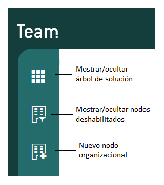

  Configura el equipo — Qflow Cloud          

*   [Qflow](https://qflowbpm.com/es/)
*   [Foro](https://forum.qflowbpm.com/)
*   [Centro de Ayuda](https://qflowbpm.com/es/centro-de-ayuda/)
*   [Contáctanos](https://qflowbpm.com/es/contacto/)

[Qflow](index.md)

Cloud (latest) 5.5 OnPremise (latest) 5.2 OnPremise 5.1.1 OnPremise

English Español

selectElement('versionSelect', getVersion()); selectElement('languageSelect', getLanguage()); function selectElement(id, valueToSelect) { let element = document.getElementById(id); element.value = valueToSelect; } function getLanguage() { if (window.location.href.includes('/es/')) { return '/es/'; } else { return '/en/'; } } function getVersion() { if (window.location.href.includes('/qflowcloud/')) { return '/qflowcloud/'; } else if (window.location.href.includes('/qflow5\_1\_1/')) { return '/qflow5\_1\_1/'; } else if (window.location.href.includes('/qflow5\_2/')) { return '/qflow5\_2/'; } else { return '/qflow5\_5/'; } } function redirectToSite(url) { var http = new XMLHttpRequest(); http.onreadystatechange = function() { if (http.readyState === 4) { if (http.status !== 404) { window.location.href = url; } else { window.location.href = url.replace(url.substr(url.lastIndexOf('/') + 1), 'index.md'); } } } http.open('HEAD', url, true); http.send(); }

  

Inicio

*   [Novedades](29-ReleaseNote.md)
*   [Introducción a Qflow](01-QflowIntroduction.md)
*   [Tutoriales](TutorialsIndex.md)
    *   [Introducción a las herramientas de Qflow](26-QflowToolsTutorial.md)
    *   [Crea tu primer proceso](06-Tutorial.md)
    *   [Diseña un proceso de quejas](23-DesignTutorial.md)
    *   [Descubre Qflow Task](24-QflowTaskTutorial.md)
    *   [Configura el equipo](#)
        *   [Introducción](#introduccion)
        *   [Estructura de nodos](#estructura-de-nodos)
        *   [Colas de trabajo](#colas-de-trabajo)
        *   [Administrar permisos de la herramienta](#administrar-permisos-de-la-herramienta)
    *   [Administra y monitorea el sistema](28-QflowAdminTutorial.md)
    *   [Crea tu formulario personalizado](37-QformTutorial.md)
*   [Qflow Task](04-QflowTask.md)
*   [Qflow Design](15-QflowDesign.md)
*   [Qflow Team](18-QflowTeam.md)
*   [Qflow Admin](19-QflowAdmin.md)
*   [Consumo de Q-points](21-Q-pointsConsumption.md)
*   [Conectores](34-ConnectorsIndex.md)
*   [Desarrolladores](31-Development.md)

[Qflow](index.md)

*   
*   [Tutoriales](TutorialsIndex.md)
*   Configura el equipo

- - -

# Configura el equipo[](#configura-el-equipo "Link to this heading")

## Introducción[](#introduccion "Link to this heading")

Este tutorial explica brevemente las funcionalidades de Qflow Team. Esta herramienta se usa para representar la estructura de la organización y sus miembros en el sistema.

Los elementos que componen al modelo organizacional son nodos, grupos y usuarios. A continuación se explicará como se crean cada uno, los permisos que se le pueden dar a los usuarios dentro de cada uno de los elementos y cómo pueden participar los usuarios dentro de colas de trabajo.

## Estructura de nodos[](#estructura-de-nodos "Link to this heading")

El menú lateral del sitio muestra tres botones con los cuales se puede mostrar/ocultar el árbol de la solución y operar con los nodos organizacionales de dicho árbol (Mostrar los nodos deshabilitados y Crear un nuevo nodo organizacional).

Figura 272 Menú lateral[](#id1 "Link to this image")

Dentro de cada nodo organizacional se puede ver la estructura jerárquica del modelo organizacional y seleccionar el elemento sobre el cual se desea operar.

Existe un nodo que es la raíz de la estructura. Éste tiene nodos hijos y se puede mostrar abierto, expandido (mostrando sus hijos), o cerrado. Para expandir un nodo se hace clic en el triángulo que está a la izquierda.

En este ejemplo, se creó un nodo de “Administración” con dos subnodos (hijos) “Finanzas” y “Recursos Humanos”.

Figura 273 Estructura de nodos[](#id2 "Link to this image")

Para poder ver los grupos y usuarios que tienen los nodos, se tiene que hacer doble clic en ellos.

Grupos:

*   Pueden agrupar usuarios que comparten ciertas propiedades.
    
*   Pueden contener otros grupos.
    

Usuarios:

*   Representan usuarios de Qflow.
    
*   Pueden ser miembros de varios grupos.
    
*   Sólo pueden estar en un único nodo.
    

Presionando estos diferentes botones se pueden crear los usuarios o grupos del nodo:

Figura 274 Creación de usuarios y grupos[](#id3 "Link to this image")

En este tutorial se crea un usuario “Empleado” y un grupo de “Gerentes”. Una vez creados el usuarios y grupos, la ventana se verá de la siguiente manera:

Figura 275 Usuarios y grupos[](#id4 "Link to this image")

## Colas de trabajo[](#colas-de-trabajo "Link to this heading")

Otra propiedad de los nodos es que pueden comportarse como colas de trabajo. Las colas de trabajo pueden ser elegidas como destinatarios de tareas. Cuando una tarea es asignada a un nodo que se comporta como cola de trabajo, cualquier usuario que tenga permiso de actuar en esa cola puede contestar la tarea.

### Configurar una cola de trabajo[](#configurar-una-cola-de-trabajo "Link to this heading")

Dentro de las propiedades del nodo en la sección “Avanzado” se debe marcar la opción “Comportamiento de cola de trabajo”.

Figura 276 Cola de trabajo[](#id5 "Link to this image")

Luego de que se habilitó la opción, queda disponible el botón de configuración. Ese botón permite configurar los permisos y la vigencia de la cola de trabajo. Cuando se hace clic en ese botón, aparecen las propiedades de la cola de trabajo. El ícono del nodo en el árbol cambia una vez que se lo definió como cola de trabajo.

Figura 277 Botón de configuración de propiedades de cola de trabajo[](#id6 "Link to this image")

Figura 278 Propiedades de cola de trabajo[](#id7 "Link to this image")

La sección “Seguridad” del formulario de propiedades de una cola de trabajo permite definir los permisos sobre ella. Haciendo clic en el botón “+” se pueden agregar los grupos y/o usuarios que van a participar en la cola.

Para agregarlos, comience a escribir el nombre y se va a desplegar una lista con los usuarios y/o grupos disponibles.

Una vez que se lo selecciona se despliega una tabla para configurar los permisos.

Debe seleccionar “Permitir” o “Denegar” al lado de cada permiso como se muestra en la imagen más abajo. Si marca la opción “Heredable”, el permiso se aplicará recursivamente.

Esto quiere decir que el usuario, rol o grupo seleccionado tendrá permiso sobre el nodo que se está editando y además sobre todos los nodos descendientes de ese nodo. Por ejemplo, para que un gerente tenga permisos de “Visualizar” las tareas de las colas de trabajo de toda una rama de la organización, se le puede otorgar permisos de “Visualizar” sobre el nodo raíz de esa rama y seleccionar la opción “Heredable”.

Los posibles permisos son:

*   Visualizar: permite acceder a la bandeja de entrada de la cola de trabajo.
    
*   Actuar: permite contestar una tarea de la cola de trabajo.
    
*   Firmar: este permiso no tiene utilidad en Qflow, pero se usa en Q-expeditive, que está construido sobre la base de Qflow. Permite firmar.
    

Figura 279 Permisos de cola de trabajo[](#id8 "Link to this image")

Dentro de la sección “Permisos” se puede visualizar los permisos efectivos de los usuarios sobre la cola de trabajo: si el usuario puede visualizar, actuar y/o firmar.

Dentro de la sección “Notificaciones”, se permite especificar el envío de notificaciones cuando ocurre algún evento relacionado con la cola. Para especificar los eventos que deben disparar notificaciones, marque las opciones que desee de entre las siguientes:

Figura 280 Notificaciones de cola de trabajo[](#id9 "Link to this image")

En la sección “Avanzado” se puede definir la vigencia de la cola. Para definir un período de vigencia, marque la opción “Define período de vigencia” y seleccione la fecha de inicio del período (“Desde”) y la de finalización del período (“Hasta”). El nodo sólo se comportará como cola de trabajo durante ese período.

Figura 281 Sección “Avanzado”[](#id10 "Link to this image")

## Administrar permisos de la herramienta[](#administrar-permisos-de-la-herramienta "Link to this heading")

Dentro de “Configuración” del menú superior del sitio en la opción “Administrar permisos de la herramienta” se pueden configurar distintos permisos.

Para cada uno se muestra para qué rol es el permiso, la descripción del rol, una lista de acciones permitidas y una lista de acciones denegadas. La lista se puede filtrar de la forma usual y también se puede modificar, agregando, quitando y modificando elementos.

Existen tres tipos de permisos definidos:

*   Acceder a la herramienta
    
*   Administrar configuración
    
*   Administrar seguridad
    

Para agregar un permiso al usuario “Empleado” previamente creado:

1.  Haga clic en el botón “Agregar” (+). Eso hace que Qflow muestre un buscador de roles.
    
2.  Seleccione el destinatario del permiso. Para eso, escriba parte del nombre del usuario, en este caso “Empleado” en el buscador (donde dice “Comience a escribir…”) y cuando lo vea en la lista que aparece, selecciónelo.
    
    Cuando se selecciona el destinatario de un permiso, Qflow muestra un formulario para seleccionar las acciones que se incluyen en el nuevo permiso.
    
3.  Para cada uno de los permisos que se muestran en ese formulario, marque si se permite o se deniega.
    

Figura 282 Permisos de la herramienta[](#id11 "Link to this image")

Por último, si quiere mas información que no se detalló en el tutorial, puede ver el manual de [Qflow Team.](18-QflowTeam.md)

[Anterior](24-QflowTaskTutorial.md "Descubre Qflow Task") [Siguiente](28-QflowAdminTutorial.md "Administra y monitorea el sistema")

- - -

© Derechos de autor 2025, Urudata Software.

jQuery(function () { SphinxRtdTheme.Navigation.enable(true); }); window.dataLayer = window.dataLayer || \[\]; function gtag(){dataLayer.push(arguments);} gtag('js', new Date()); gtag('config', 'G-LMDS8S4B42', { 'anonymize\_ip': false, });
