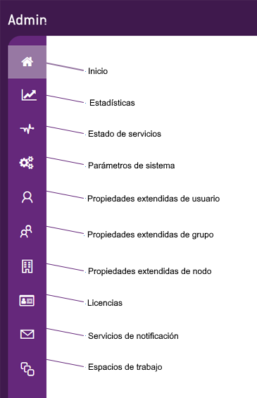
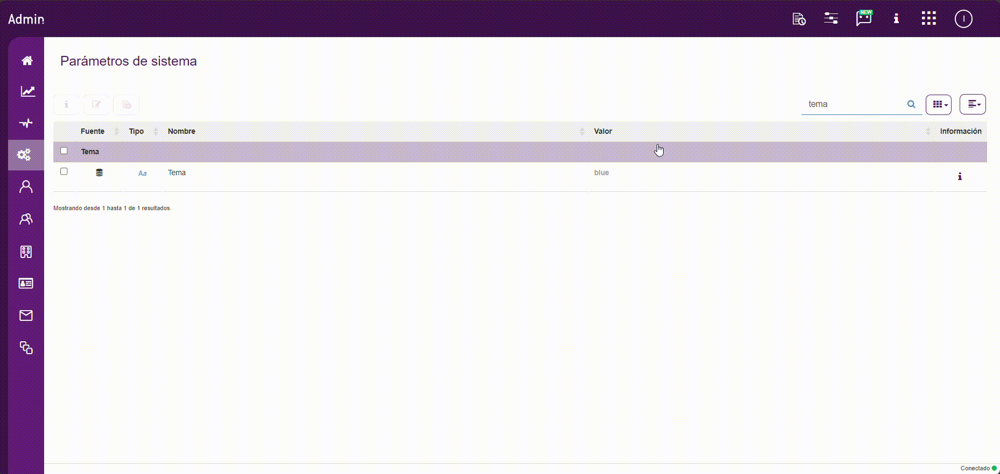
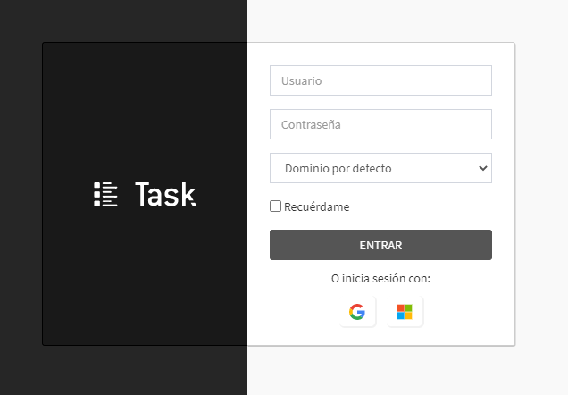
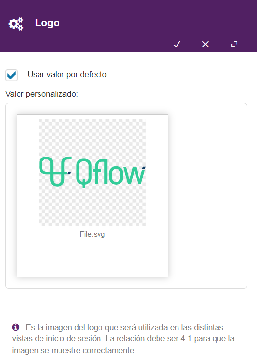
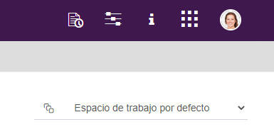
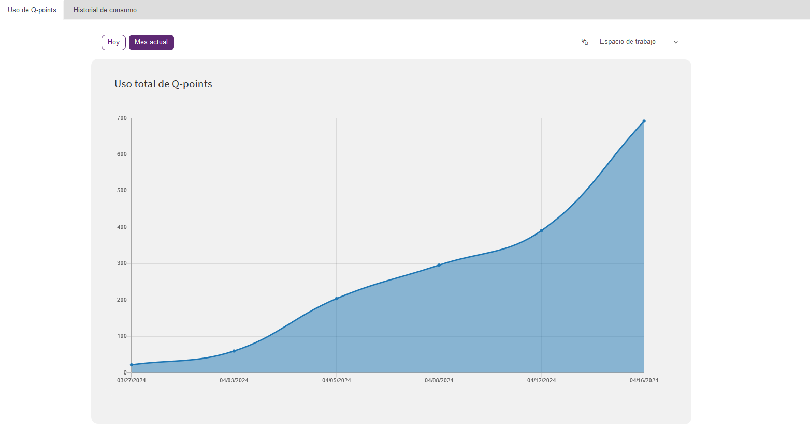
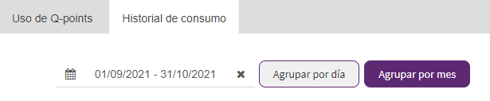
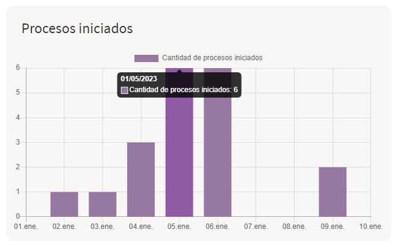
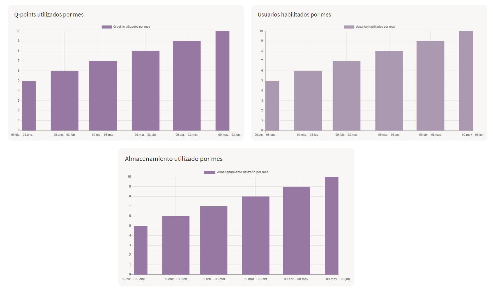

  Administra y monitorea el sistema — Qflow Cloud          

*   [Qflow](https://qflowbpm.com/es/)
*   [Foro](https://forum.qflowbpm.com/)
*   [Centro de Ayuda](https://qflowbpm.com/es/centro-de-ayuda/)
*   [Contáctanos](https://qflowbpm.com/es/contacto/)

[Qflow](index.html)

Cloud (latest) 5.5 OnPremise (latest) 5.2 OnPremise 5.1.1 OnPremise

English Español

selectElement('versionSelect', getVersion()); selectElement('languageSelect', getLanguage()); function selectElement(id, valueToSelect) { let element = document.getElementById(id); element.value = valueToSelect; } function getLanguage() { if (window.location.href.includes('/es/')) { return '/es/'; } else { return '/en/'; } } function getVersion() { if (window.location.href.includes('/qflowcloud/')) { return '/qflowcloud/'; } else if (window.location.href.includes('/qflow5\_1\_1/')) { return '/qflow5\_1\_1/'; } else if (window.location.href.includes('/qflow5\_2/')) { return '/qflow5\_2/'; } else { return '/qflow5\_5/'; } } function redirectToSite(url) { var http = new XMLHttpRequest(); http.onreadystatechange = function() { if (http.readyState === 4) { if (http.status !== 404) { window.location.href = url; } else { window.location.href = url.replace(url.substr(url.lastIndexOf('/') + 1), 'index.html'); } } } http.open('HEAD', url, true); http.send(); }

  

Inicio

*   [Novedades](29-ReleaseNote.html)
*   [Introducción a Qflow](01-QflowIntroduction.html)
*   [Tutoriales](TutorialsIndex.html)
    *   [Introducción a las herramientas de Qflow](26-QflowToolsTutorial.html)
    *   [Crea tu primer proceso](06-Tutorial.html)
    *   [Diseña un proceso de quejas](23-DesignTutorial.html)
    *   [Descubre Qflow Task](24-QflowTaskTutorial.html)
    *   [Configura el equipo](27-QflowTeamTutorial.html)
    *   [Administra y monitorea el sistema](#)
        *   [Introducción](#introduccion)
        *   [Parámetros de sistema](#parametros-de-sistema)
        *   [Estadísticas](#estadisticas)
    *   [Crea tu formulario personalizado](37-QformTutorial.html)
*   [Qflow Task](04-QflowTask.html)
*   [Qflow Design](15-QflowDesign.html)
*   [Qflow Team](18-QflowTeam.html)
*   [Qflow Admin](19-QflowAdmin.html)
*   [Consumo de Q-points](21-Q-pointsConsumption.html)
*   [Conectores](34-ConnectorsIndex.html)
*   [Desarrolladores](31-Development.html)

[Qflow](index.html)

*   
*   [Tutoriales](TutorialsIndex.html)
*   Administra y monitorea el sistema

- - -

# Administra y monitorea el sistema[](#administra-y-monitorea-el-sistema "Link to this heading")

## Introducción[](#introduccion "Link to this heading")

Este tutorial explica brevemente las funcionalidades de Qflow Admin, la herramienta que se utiliza para administrar y monitorear distintos aspectos del sistema como servicios y sitios, propiedades extendidas, licencias, servicios de notificación, espacios de trabajo y parámetros de sistema.

Cada una de las opciones corresponde a una funcionalidad de la herramienta. A continuación se ejemplificará cómo se utilizan algunas de ellas.

Figura 283 Menú lateral[](#id1 "Link to this image")

## Parámetros de sistema[](#parametros-de-sistema "Link to this heading")

Los parámetros del sistema son parámetros predefinidos que controlan varios aspectos del funcionamiento del producto. Pueden ser de tipo numérico, verdadero/falso (booleano), texto o imagen.

Algunas aclaraciones sobre el listado:

*   Si la fila con la información del parámetro está en color gris, eso significa que el parámetro es de sólo lectura y no puede ser editado.
    
*   Al hacer clic sobre el ícono de información “i”, se mostrará una descripción del objetivo del parámetro. Haga clic sobre cualquier parte del listado para cerrarla.
    

Para editar cualquier parámetro que lo permita, haga clic sobre él y luego en el botón de editar. Se abrirá un panel para editar su valor.

Por ejemplo, se puede cambiar el tema de Qflow Task.

Figura 284 Cambio de tema de Qflow Task[](#id2 "Link to this image")

Luego, Qflow Task quedará personalizado con el color negro:

Figura 285 Tema negro[](#id3 "Link to this image")

Otro parámetro que se puede editar es el logo de Qflow Task

Se puede utilizar el valor por defecto o ingresar un logo personalizado.

Figura 286 Cambiar logo[](#id4 "Link to this image")

## Estadísticas[](#estadisticas "Link to this heading")

Dentro de la sección de “Estadísticas” el sitio muestra el uso de Qflow. Hay dos solapas dentro de la sección, una muestra el “Uso de los Q-points” y la otra un “Historial de consumo”.

Si estamos trabajando desde el espacio de trabajo por defecto, veremos una lista desplegable en la esquina superior derecha de la sección. Esto nos permitirá seleccionar entre todos los espacios de trabajo existentes y ver estadísticas para cada uno de ellos. Para espacios de trabajo que no sean el espacio por defecto, se verán solamente sus propias estadísticas de consumo.

Figura 287 Selección de espacio de trabajo[](#id5 "Link to this image")

### Uso de Q-points[](#uso-de-q-points "Link to this heading")

En este reporte se encuentran dos gráficas, las dos relacionadas con el consumo de Q-points en el mes actual. En la primera gráfica se muestra el uso de Q-points a lo largo del mes actual. Por otro lado, la segunda gráfica indica lo mismo que la anterior pero agrupando los Q-points por plantilla de proceso.

En las distintas gráficas se pueden ver los datos agrupados de diferentes maneras, se puede ver por día actual o por mes.

La gráfica del uso total de Q-points se verá de la siguiente manera:

Figura 288 Uso total de Q-points[](#id6 "Link to this image")

La gráfica del uso de Q-points por plantilla se verá de la siguiente manera:

Figura 289 Uso de Q-points por plantilla[](#id7 "Link to this image")

### Historial de consumo[](#historial-de-consumo "Link to this heading")

Esta sección esta disponible únicamente para la versión Cloud. En la versión OnPremise no se genera un historial.

Dentro de ésta, se desplegarán cinco gráficas. Las dos primeras indican la cantidad de tareas respondidas y procesos iniciados en un período de tiempo. Las gráficas restantes muestran el historial de consumo de Q-points, usuarios habilitados y uso de almacenamiento en el último año agrupadas por mes.

En este tutorial se van a poder ver dentro del historial de consumo a los procesos iniciados y tareas respondidas en el mes de septiembre y octubre.

Las gráficas se pueden generar con filtros. Existe la opción de agrupar por mes o por día (por defecto se agrupan por día), y también se puede establecer un período personalizado (por defecto este período es el mes actual). En este caso, el filtro aplicado agrupa las fechas por mes, del 1ero de septiembre al 31 de octubre de 2021.

Figura 290 Filtros[](#id8 "Link to this image")

La gráfica de procesos iniciados se verá de la siguiente manera:

Figura 291 Gráfica de procesos iniciados[](#id9 "Link to this image")

La gráfica de tareas respondidas se verá de la siguiente manera:

Figura 292 Gráfica de tareas respondidas[](#id10 "Link to this image")

Las gráficas de estadísticas de Q-points utilizados, usuarios habilitados y estadísticas de almacenamiento se verán de la siguiente manera:

Figura 293 Gráficas de estadísticas de Q-points utilizados, usuarios habilitados y estadísticas de almacenamiento[](#id11 "Link to this image")

Por último, si quiere más información sobre el resto de las opciones del sitio que no se detallaron en el tutorial, puede ver el manual de [Qflow Admin](19-QflowAdmin.html).

[Anterior](27-QflowTeamTutorial.html "Configura el equipo") [Siguiente](37-QformTutorial.html "Crea tu formulario personalizado")

- - -

© Derechos de autor 2025, Urudata Software.

jQuery(function () { SphinxRtdTheme.Navigation.enable(true); }); window.dataLayer = window.dataLayer || \[\]; function gtag(){dataLayer.push(arguments);} gtag('js', new Date()); gtag('config', 'G-LMDS8S4B42', { 'anonymize\_ip': false, });