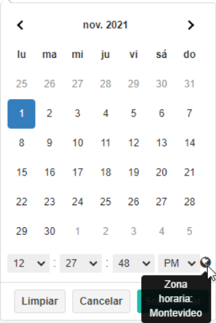
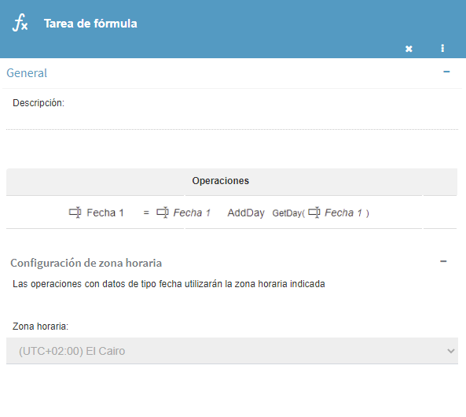
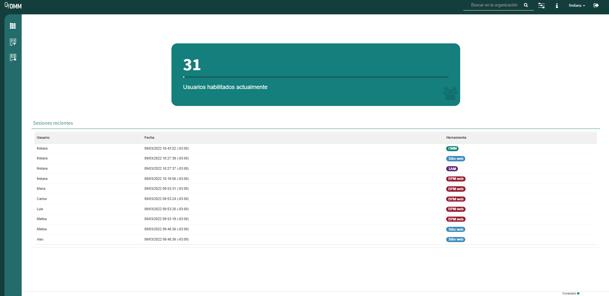
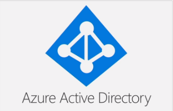
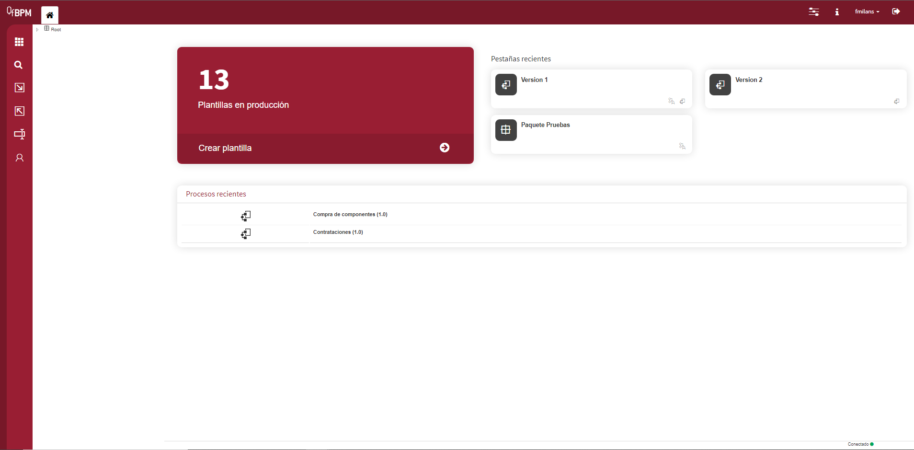
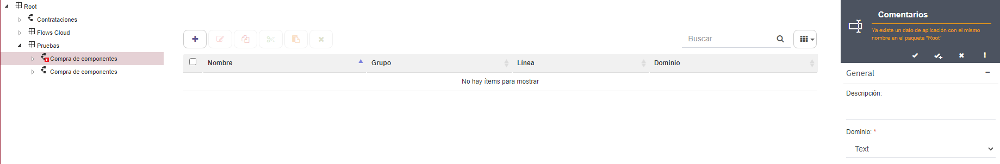
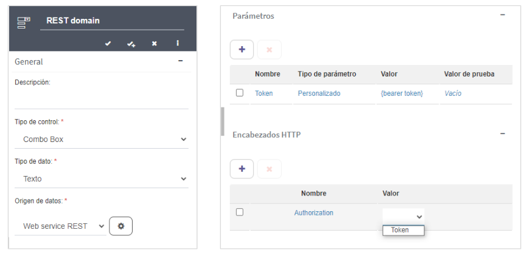
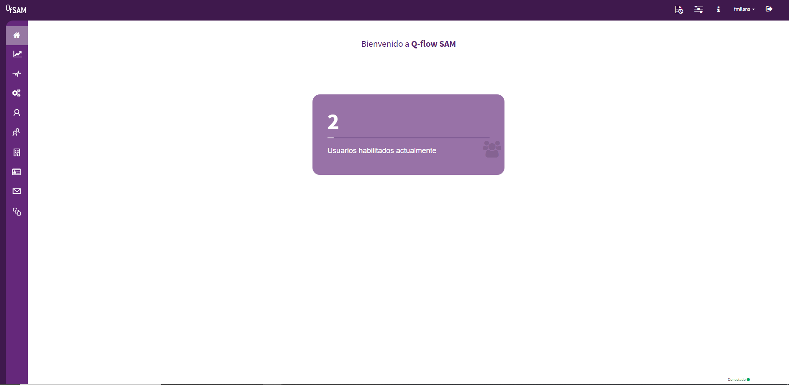

  v5.1.1 — Qflow Cloud          

*   [Qflow](https://qflowbpm.com/es/)
*   [Foro](https://forum.qflowbpm.com/)
*   [Centro de Ayuda](https://qflowbpm.com/es/centro-de-ayuda/)
*   [Contáctanos](https://qflowbpm.com/es/contacto/)

[Qflow](index.html)

Cloud (latest) 5.5 OnPremise (latest) 5.2 OnPremise 5.1.1 OnPremise

English Español

selectElement('versionSelect', getVersion()); selectElement('languageSelect', getLanguage()); function selectElement(id, valueToSelect) { let element = document.getElementById(id); element.value = valueToSelect; } function getLanguage() { if (window.location.href.includes('/es/')) { return '/es/'; } else { return '/en/'; } } function getVersion() { if (window.location.href.includes('/qflowcloud/')) { return '/qflowcloud/'; } else if (window.location.href.includes('/qflow5\_1\_1/')) { return '/qflow5\_1\_1/'; } else if (window.location.href.includes('/qflow5\_2/')) { return '/qflow5\_2/'; } else { return '/qflow5\_5/'; } } function redirectToSite(url) { var http = new XMLHttpRequest(); http.onreadystatechange = function() { if (http.readyState === 4) { if (http.status !== 404) { window.location.href = url; } else { window.location.href = url.replace(url.substr(url.lastIndexOf('/') + 1), 'index.html'); } } } http.open('HEAD', url, true); http.send(); }

  

Inicio

*   [Novedades](29-ReleaseNote.html)
    *   [v6.0](29.13-ReleaseNote6_0.html)
    *   [v5.6.2](29.12-ReleaseNote5_6_2.html)
    *   [v5.6.1](29.11-ReleaseNote5_6_1.html)
    *   [v5.6](29.10-ReleaseNote5_6.html)
    *   [v5.5.4](29.9-ReleaseNote5_5_4.html)
    *   [v5.5.3](29.8-ReleaseNote5_5_3.html)
    *   [v5.5.1](29.7-ReleaseNote5_5_1.html)
    *   [v5.5](29.6-ReleaseNote5_5.html)
    *   [v5.4](29.5-ReleaseNote5_4.html)
    *   [v5.3](29.4-ReleaseNote5_3.html)
    *   [v5.2](29.3-ReleaseNote5_2.html)
    *   [v5.1.2](29.2-ReleaseNote5_1_2.html)
    *   [v5.1.1](#)
        *   [Mejoras generales](#mejoras-generales)
        *   [OMM Web](#omm-web)
        *   [BPM Web](#bpm-web)
        *   [SAM Web](#sam-web)
        *   [Sitio web](#sitio-web)
        *   [Nuevos manuales y tutoriales](#nuevos-manuales-y-tutoriales)
        *   [Se depreca la compatibilidad de Oracle a partir de la versión 5.2](#se-depreca-la-compatibilidad-de-oracle-a-partir-de-la-version-5-2)
    *   [v5.1](29.1-ReleaseNote5_1_Cloud.html)
*   [Introducción a Qflow](01-QflowIntroduction.html)
*   [Tutoriales](TutorialsIndex.html)
*   [Qflow Task](04-QflowTask.html)
*   [Qflow Design](15-QflowDesign.html)
*   [Qflow Team](18-QflowTeam.html)
*   [Qflow Admin](19-QflowAdmin.html)
*   [Consumo de Q-points](21-Q-pointsConsumption.html)
*   [Conectores](34-ConnectorsIndex.html)
*   [Desarrolladores](31-Development.html)

[Qflow](index.html)

*   
*   [Novedades](29-ReleaseNote.html)
*   v5.1.1

- - -

# v5.1.1[](#v5-1-1 "Link to this heading")

**Resumen de características**

La versión 5.1.1 incorpora la globalización en los componentes de fecha, mediante el uso de zonas horarias. Además, se renuevan los de estilos de los distintos sitios y se actualiza el sitio de documentación de usuario, incorporando también los manuales en idioma inglés.

Adicionalmente, el producto continúa su constante evolución, incorporando funcionalidades solicitadas por nuestros clientes y socios de negocios, que facilitan su trabajo para poder hacer más en menos tiempo.

Cuando la característica descrita tenga un alto contenido técnico se lo indicará con el ícono (). Además, si se incluyó como fix para alguna versión anterior, se indicará de la siguiente manera: \[x.y\]. Si es un analista funcional puede omitir la lectura de esas novedades.

Si ya cuentas con un espacio de trabajo en la nube, ¡ya estás disfrutando de estas funcionalidades! De lo contrario, analiza los planes en [https://qflowbpm.com/es/precios/](https://qflowbpm.com/es/precios/). Si ya cuentas con una instalación onpremise, para aprovechar las ventajas de la nueva versión entra en contacto con tu gerente de cuenta, quien podrá asistirte en la instalación o actualización del sistema, para comenzar a usar las nuevas funcionalidades. Si no tienes un gerente de cuenta, puedes contactarnos completando el formulario de la siguiente URL: [https://qflowbpm.com/es/contacto/](https://qflowbpm.com/es/contacto/).

## Mejoras generales[](#mejoras-generales "Link to this heading")

### Actualización de menú superior[](#actualizacion-de-menu-superior "Link to this heading")

Se movieron los botones de ayuda y novedades a la “” de info del menú superior.

> 
> 
> Figura 77 Ubicación de novedades y ayuda[](#id7 "Link to this image")

### Unificar estilos de los mails[](#unificar-estilos-de-los-mails "Link to this heading")

Se unificaron los estilos de notificación que se utilizan en q-flow:

> *   **Nueva tarea:** Al instanciar una nueva tarea.
>     
> *   **Nueva notificación:** Al instanciar una nueva notificación.
>     
> *   **Recordatorio automático de tarea:** Están definidos en la configuración del paso y se ejecutan automáticamente.
>     
> *   **Alerta automática de tarea:** Están definidos en la configuración del paso y se ejecutan automáticamente.
>     
> *   **Vencimiento automático de tarea:** Están definidos en la configuración del paso y se ejecutan automáticamente.
>     
> *   **Delegación automática de tarea:** Están definidos en la configuración del paso y se ejecutan automáticamente.
>     
> *   **Recordatorio manual de tarea:** Definidas desde el sitio web.
>     
> *   **Alerta manual de tarea:** Definidas desde el sitio web.
>     
> *   **Reenvío manual de tarea:** Definidas desde el sitio web.
>     
> *   **Recordatorio de etapa:** Se definen en las etapas de un proceso y se ejecutan automáticamente según la etapa.
>     
> *   **Alerta de etapa:** Se definen en las etapas de un proceso y se ejecutan automáticamente según la etapa.
>     
> *   **Cambio en paquete:** Se envían al realizar un cambio en algún paquete que el usuario esté suscrito.
>     
> *   **Proceso en error:** Se envían al dueño de la versión, cuando un proceso queda en error (debe estar marcado el check de Proceso en error en el sitio de BPM).
>     
> 
> 
> 
> Figura 78 Notificaciones de Q-flow[](#id8 "Link to this image")

Las notificaciones tendrán los estilos asociados al tema elegido en la instancia, asi como el logo configurado para tales efectos en el Administrador y Monitor del Sistema (SAM), en el parámetro “Logo de correos”.

### Utilizar idioma del usuario destinatario en Notificaciones[](#utilizar-idioma-del-usuario-destinatario-en-notificaciones "Link to this heading")

Los mails se envian en el idioma detectado en la última sesión del usuario. Los idiomas soportados son inglés, español y portugués.

### Soporte de globalización de la hora[](#soporte-de-globalizacion-de-la-hora "Link to this heading")

**Preferencia de zona horaria**

> 
> 
> Figura 79 Zona horaria seleccionada por el usuario[](#id9 "Link to this image")

Se creó una preferencia que indique la zona horaria del usuario, ésta zona afecta a todas las fechas de los sitios, por lo que se podrá cambiar la preferencia desde cualquiera de los sitios.

**Cambio de zona horaria**

En todos los sitios al seleccionar la opción del menú superior, se muestra un panel derecho y un pop up en el caso del sitio web para seleccionar la zona horaria de preferencia. Al cambiar la zona horaria, afecta a todos los sitios.

> 
> 
> Figura 80 Cambio de zona horaria[](#id10 "Link to this image")

**Horario de verano**

En el caso de que una zona horaria se encuentre actualmente en horario de verano, Q-flow lo informará para tenerlo en cuenta.

> 
> 
> Figura 81 Horario de verano[](#id11 "Link to this image")

**Sugerir cambio de preferencia si es distinta a la del cliente**

En el caso en que la zona horaria seleccionada no coincida con la del dispositivo del usuario, Q-flow mostrará una sugerencia para cambiar a esa zona horaria.

> 
> 
> Figura 82 Sugerir cambio de preferencia si es distinta a la del cliente[](#id12 "Link to this image")

**Selector de Fecha y Hora**

Ahora se especifica en qué zona horaria se encuentra la fecha y hora que se está seleccionando ya que afecta al resultado.

> 
> 
> Figura 83 Selector de Fecha y Hora[](#id13 "Link to this image")

**Selector de Fecha**

Los cambios entre zonas horarias no afectan a estos tipos de datos.

> 
> 
> Figura 84 Selector de Fecha[](#id14 "Link to this image")

**Tarea de fórmula**

Las tareas de fórmula ahora tienen opción de agregar la zona horaria independiente a la del usuario.

> 
> 
> Figura 85 Panel de tarea de fórmula[](#id15 "Link to this image")

Y en el sitio de Q-flow la tarea de fórmula se ejecutó con la zona horaria configurada en el sitio de BPM.

> 
> 
> Figura 86 Detalles de paso de tarea de fórmula en Q-flow[](#id16 "Link to this image")

### Permitir utilizar WebSite, WebServices y BPM App en diferentes instancias \[5.0\] \[5.1\][](#permitir-utilizar-website-webservices-y-bpm-app-en-diferentes-instancias-5-0-5-1 "Link to this heading")

Ahora se permite de manera personalizada la posibilidad de conectarse con estas herramientas utilizando una instancia que no sea el por defecto, configurando dentro del app.config el parámetro “TenantId”.

### Quitar botón de “…” de expandir paneles en versión móvil \[5.1\][](#quitar-boton-de-de-expandir-paneles-en-version-movil-5-1 "Link to this heading")

El botón de expandir y colapsar se quitó en versión móvil.

### Botón de cambiar tenant en sitios web \[5.1\][](#boton-de-cambiar-tenant-en-sitios-web-5-1 "Link to this heading")

Cuando se hace clic en el botón de cambiar instancia, si el listado está abierto, este se cierra.

### Se puede configurar Redis como caché \[5.1\] [](#se-puede-configurar-redis-como-cache-5-1-technical-icon "Link to this heading")

Ahora todo el caché del backend, incluyendo la web API está centralizado. Este se puede configurar para que sea Redis o Memorycache. También se quitó de las propiedades extendidas de SAM un mensaje que indicaba que si había algún cambio hay que reiniciar los servidores, ya que ahora no es necesario.

### Logs de webapi en versión release \[5.0\] \[5.1\] [](#logs-de-webapi-en-version-release-5-0-5-1-technical-icon "Link to this heading")

Se agregó en los handlers de la webapi, logs de los errores antes de devolverlos al frontend.

### Crear servicio web para eliminar instancias \[5.1\] [](#crear-servicio-web-para-eliminar-instancias-5-1-technical-icon "Link to this heading")

Se creó un servicio web para eliminar instancia, para ello el usuario debe tener permiso de “Administrar seguridad” y estar en la instancia por defecto.

### Errores corregidos[](#errores-corregidos "Link to this heading")

**Mejoras en los estilos mobile \[5.1\]**

Se corrigió que, en la vista mobile los paneles en los sitios de OMM, SAM y BPM, para que al abrirlos en vista mobile se adapte al espacio de la pantalla, antes no se podía ver algunos paneles por los tamaños de pantalla.

**En mobile se ve cortado los popups \[5.1\]**

Se centraron los popup de todos los sitios para que ocupen todo el ancho posible de la pantalla, ya que pasaba que se mostraba la mitad del popup al abrirlo.

**Ya no se oculta el panel inferior con el panel derecho \[5.0\] \[5.1\]**

En los sitios de SAM y OMM se muestran los indicadores del estado de panel cuando el panel derecho está abierto.

**Corrección de error en componente de subir archivos \[5.1\]**

Se corrigió un error en el componente de subir archivos adjuntos en el sitio Web de Q-flow, causado por la previsualización de archivos con formato .RAR. Se quitó la previsualización de estos archivos.

**Servicio web de adjunto recibe byte array como null \[5.0\] \[5.1\]** 

Se corrigió el servicio web UploadNewAttachment cuando se manda en el cuerpo un arreglo de bytes, porque pasaba que al servidor le llegaba null.

## OMM Web[](#omm-web "Link to this heading")

### Actualización de la home[](#actualizacion-de-la-home "Link to this heading")

Se actualizó la vista de la home del sitio de OMM, ahora se muestra un listado de las últimas 10 sesiones creadas por los usuarios y a qué sitio aplican. Y muestra un indicador de cantidad de usuarios de la instancia.

> 
> 
> Figura 87 Página de inicio del sitio OMM[](#id17 "Link to this image")
> 
> *   Íconos no alineados en “sólo lectura” \[5.0\] \[5.1\]
>     
>     *   En los paneles derechos, el ícono no queda alineado al texto en “sólo lectura”.
>         
>     

### Nuevo proveedor de seguridad: Azure Active Directory[](#nuevo-proveedor-de-seguridad-azure-active-directory "Link to this heading")

> 

El usuario tiene la opción de agregar un proveedor de seguridad de tipo Azure Active Directory con las configuraciones de su organización y poder loguearse en los distintos sitios, y también se podrá utilizar para acceder a los servicios web.

### Errores corregidos[](#id1 "Link to this heading")

**Se permite crear varios proveedores de seguridad OAuth \[5.0\] \[5.1\]**

Ahora sólo se permite crear un sólo proveedor de seguridad de tipo OAuth, porque ocurría que a veces dejaba loguear y otras veces no, por problemas de inconsistencia.

**Período de vigencia en propiedades de cola de trabajo no se oculta al quitar el check \[5.1\]**

Se corrigió el check “Define período de vigencia”, al seleccionarlo se despliega “fecha desde” y “fecha hasta” con un asterisco obligatorio. En caso de no estar seleccionado el check, se ocultan los campos.

**Credenciales de propiedades de directorio no están siendo utilizadas \[5.0\] \[5.1\]**

Se corrigió que al configurar el usuario y contraseña de un proveedor de seguridad “active directory”, las use para hacer consultas ya que antes no las usaba. Y que se deshabilite la parte de usuario y contraseña si se tiene marcado el checkbox de usar credenciales de red y en caso de estar desmarcado el checkbox, los campos son obligatorios.

## BPM Web[](#bpm-web "Link to this heading")

### Mejoras de estilos[](#mejoras-de-estilos "Link to this heading")

#### Actualización de la home[](#id2 "Link to this heading")

El botón de “Crear plantilla” se mantiene pero se cambiaron los estilos y ahora muestra la cantidad de plantillas que están en producción en la instancia. Seguido muestra “Pestañas recientes” y abajo “Procesos recientes” donde muestra las últimas 10 versiones modificadas por el usuario (proteger, desproteger, crear y/o modificación de template), en ambos casos si se hace clic sobre un elemento se lo redirige al elemento seleccionado.

> 
> 
> Figura 88 Página de inicio del sitio BPM[](#id18 "Link to this image")

### Advertencia de duplicados[](#advertencia-de-duplicados "Link to this heading")

Se agregó un control de advertencia de duplicados para nombres de datos en plantillas. Esto pasaba si se quieren crear datos con nombres que ya existen en algún paquete o plantilla padre. Podía causar problemas de consistencia de información en los formularios del sitio web a la hora de ejecutar el proceso. Por eso, ahora el sitio muestra una advertencia al crear datos con nombres repetidos.

> 
> 
> Figura 89 Advertencia de duplicados[](#id19 "Link to this image")

### Encabezados HTTP en dominios e integraciones REST [](#encabezados-http-en-dominios-e-integraciones-rest-technical-icon "Link to this heading")

Respecto a las capacidades de trabajo de BPM, se agregó la característica de encabezados HTTP en dominios e integraciones REST. Los encabezados HTTP son una parte muy importante del protocolo HTTP, permiten enviar información adicional respecto al cuerpo del mensaje, códigos de autorización, información sobre los tipos de información que se está enviando, y más. Esto permite que los mensajes y peticiones que se hacen a la API REST tengan estos encabezados, lo que abre muchas posibilidades respecto al tipo de peticiones que se pueden hacer frente a servicios que, por ejemplo, requieren de una autorización mediante el envío de un código token en los encabezados HTTP. Dentro de el panel de configuración de un dominio, si configuramos el origen de datos como un web service rest, podemos acceder a la configuración y podemos ver una tabla de encabezados HTTP. Aquí le podemos dar nombre, y los valores que se pueden seleccionar en la lista desplegable son los valores de los parámetros definidos en la tabla de parámetros ubicada por encima de la tabla de encabezados.

**Dominios**

> 
> 
> Figura 90 A la izquierda panel de dominio y en la izquierda panel de configuración de web service REST[](#id20 "Link to this image")

Los parámetros definidos en la tabla de configuración del origen de datos serán los valores a seleccionar para los encabezados HTTP.

**Integraciones**

Los parámetros definidos en el panel de integraciones serán los valores a seleccionar para los encabezados HTTP.

> 
> 
> Figura 91 Configuración para integraciones[](#id21 "Link to this image")

En integraciones, para configurar los encabezados se debe definir el parámetro en el panel de la integración en sí, y para agregar ese parámetro como token se debe crear una operación de tipo Web service REST, y dentro del panel de la operación veremos la tabla de encabezados, y de la misma manera podemos definir el encabezado que definimos anteriormente en la tabla de parámetros.

### Se agrega columna de Id en listado de bots[](#se-agrega-columna-de-id-en-listado-de-bots "Link to this heading")

En la visualización de listados de Bots, se podrá visualizar la columna Id, como lo muestra la siguiente figura:

> 
> 
> Figura 92 Mostrar el Id de los Bots[](#id22 "Link to this image")

El Id es útil a la hora de invocar al bot.

### Mejoras en panel de datos \[5.1\][](#mejoras-en-panel-de-datos-5-1 "Link to this heading")

Se agregó una separación entre el botón de editar y el de los valores por defecto. Y se agrandó la fuente de los valores por defecto una vez se setean.

### Ícono de home no alineado \[5.1\][](#icono-de-home-no-alineado-5-1 "Link to this heading")

Se centró el ícono de las pestañas.

### Ícono desalineado en asignar valor de una integración \[5.0\] \[5.1\][](#icono-desalineado-en-asignar-valor-de-una-integracion-5-0-5-1 "Link to this heading")

Se alinearon los íconos cuando se asigna un valor a alguno de los métodos en una integración, por ejemplo, de tipo sharepoint.

### Alinear ordenado de grupos con el resto de los componentes \[5.1\][](#alinear-ordenado-de-grupos-con-el-resto-de-los-componentes-5-1 "Link to this heading")

Se alineó el componente de ordenado de grupos en la definición del alcance.

### Mapeo en actividad de llamadas \[4.3\] \[5.0\] \[5.1\][](#mapeo-en-actividad-de-llamadas-4-3-5-0-5-1 "Link to this heading")

Si se tiene un mapeo hecho con datos y se cambia la versión en producción de la plantilla a la que apunta por otra, se mantienen los mapeos que puedan corresponder a la nueva versión.

### Quitar valores por defecto no usados de parámetros de integración y bots \[5.0\] \[5.1\][](#quitar-valores-por-defecto-no-usados-de-parametros-de-integracion-y-bots-5-0-5-1 "Link to this heading")

Se quitan los valores por defecto de los parámetros de integración y de bots. Estos fueron eliminados porque no eran utilizados.

### Agregar los paquetes en IndexedDB \[5.0\] \[5.1\] [](#agregar-los-paquetes-en-indexeddb-5-0-5-1-technical-icon "Link to this heading")

Se cambió para que los paquetes se guarden en una IndexedDB en vez del localStorage.

### Errores corregidos[](#id3 "Link to this heading")

**Cambio de ícono al importar una versión \[5.1\]**

Se corrigió, que al exportar una versión y luego importarla en otro template, deje el mismo ícono.

**Error de que dato debe ser multivaluado si no tiene línea, no se borra \[5.0\] \[5.1\]**

En el panel de propiedades de un dato, se corrigió que al poner en una línea un dato que no es multivaluado, se limpie los errores, cosa que no se limpiaban cuando se quitaba la línea y se daba a guardar el panel y se creaba otro.

**No avisa que está mal al intentar guardar una integración sin haber generado el código \[5.1\]**

Se corrigió que, en una integración de tipo sharepoint, luego de seleccionar una lista, un método y haber llenado los parámetros, al dar guardar si hay algún dato de entrada inválido, indica cuál es, antes no se indicaba cúal era el dato de entrada inválido.

**Ventana de código se cambia de tamaño y rompe manejadores de eventos \[5.0\] \[5.1\]**

Se corrigió que al abrir un manejador de eventos y hacer clic al comentario de “TODO” al final de la línea, se mantiene el tamaño de la ventana, porque ocurría que el código se corría para la izquierda.

**Pestaña de diseño de proceso protegido aparece editada si se pegó algo \[5.0\] \[5.1\]**

Se corrigió que, si intenta pegar un paso de otro grafo, no se pega nada y no muestra que hubo cambios en la pestaña de diseño.

**Error de configuración en una compuerta paralela \[4.3\] \[5.0\] \[5.1\]**

Se corrigió que, al abrir y guardar el panel de una compuerta paralela, y luego de proteger el paquete, deje ver el grafo, porque ocurría que por el error de la compuerta paralela no dejaba ver el grafo.

**Proteger un paquete con worklets desde la aplicación de escritorio \[5.0\] \[5.1\]**

Se corrigió el siguiente error: “Reason: Operand type clash: uniqueidentifier is incompatible with tinyint”.

**No detecta nombre cambiado de paso conectado al abrir compuerta \[5.1\]**

Se corrigió que, si estaba conectada a una tarea de usuario que se le cambió el nombre desde el grafo, muestre el nombre en la conexión.

**No exporta paquete con scope de ordenado de grupos \[5.0\] \[5.1\]**

Se corrigió que, si alguno de los pasos de alguna versión del paquete tiene scope de ordenado de grupos pueda exportar el paquete.

**Se permite que los pasos tengan un progreso superior a 100 \[5.0\]**

Se limitó un progreso no superior a 100, por ejemplo en un paso de fin.

**Eliminar un dominio con un dato asociado rompe el dato \[5.1\]**

Se corrigió para que cuando se elimine el dominio ponga otro dominio por defecto, antes ocurría que, al editar ese dato, el panel derecho quedaba cargando, y se lanzaba un error en consola.

**No permite cambiar descripción de plantillas y versiones \[5.1\]**

Se corrigió para que se pueda permitir cambiar la descripción, antes ocurría que al cambiar la descripción saltaba un cartel abajo que decía “No se realizaron cambios” y no se cambia nada.

**No se están mapeando los permisos heredados que se estén asignando a un grupo \[5.0\] \[5.1\]**

Si se define que en cierto paquete “P”, cierto grupo tenga permisos “X”, se corrigió, que al acceder como usuario y parte de ese grupo, se obtengan dichos permisos, cosa que no ocurría.

**Error en auditorías de paquetes en Oracle \[5.0\] \[5.1\]**

Se corrigieron las validaciones de las auditorías.

**Controlar largo de nombres en pasos de un proceso \[5.1\]**

En los paneles correspondientes a los pasos, se limita el largo de los nombres a 256 caracteres para evitar perder información que se almacena en la base de datos.

**No se permite utilizar parámetros de tipo contraseña en tarea de servicio \[5.0\] \[5.1\]** 

A la hora de seleccionar los parámetros a utilizar en una tarea de servicio, se corrigió, que no aparecen para seleccionar los parámetros de tipo contraseña.

## SAM Web[](#sam-web "Link to this heading")

### Actualización de la home[](#id4 "Link to this heading")

Ahora muestra un indicador con la cantidad de usuarios de la instancia. Cuando alguno de estos valores sobrepasa el límite o el usuario no tiene licencia habilitada el indicador se pone rojo. Además los valores son acumulativos, es decir, si se ponen 5 licencias se acumula en el indicador.

> 
> 
> Figura 93 Página de inicio del sitio SAM[](#id23 "Link to this image")

### Dar de baja instancia[](#dar-de-baja-instancia "Link to this heading")

Se agregó la funcionalidad de borrar instancia. La instancia principal no se puede borrar. Esta opción está sólo en la instancia principal y no tiene el botón habilitado en las instancias hijos. Al borrar la instancia se borra toda la información relacionada a la instancia de todos los sitios (datos de aplicación, template, paquetes, flows). Y para realizar esta acción el usuario debe tener permiso de administrar configuración.

> 
> 
> Figura 94 Lista de instancias[](#id24 "Link to this image")

### Actualización de estadísticas[](#actualizacion-de-estadisticas "Link to this heading")

Se actualizaron las gráficas de estadísticas, así como también se agregaron nuevas:

> *   Tareas respondidas
>     
> *   Procesos iniciados
>     
> *   Uso de Q-points (\*)
>     
> *   Uso de Q-points por plantilla (\*)
>     

(\*) Se muestra sólo si se tiene configurado para que Q-flow realice una simulación de la ejecución de puntos como en cloud. Para más información sobre cómo configurarlo ir al manual de [instalación y configuración](02-InstallationAndConfiguration.html).

**Uso de Q-points**

Muestra el consumo de los Q-points para el mes actual de la licencia.

> 

**Uso de Q-points por plantilla**

Muestra el consumo de Q-points para el mes actual de cada plantilla en el sistema.

> 

**Historial de consumo**

Permite ver los valores resultantes de la licencia (hasta 12 meses). Las gráficas de las tareas respondidas y los procesos iniciados permite agrupar por día y por mes, y filtrar por rangos de fechas.

> 
> 
> Figura 95 Sección “Uso de Q-points”[](#id25 "Link to this image")

### Errores corregidos[](#id5 "Link to this heading")

**Cambio de instancia en vista de ipad se ve mal \[5.0\] \[5.1\]**

En vista de ipad los textos de cambiar instancia en el formulario de iniciar sesión no estaban centrados.

**Error en archivos de imagen “sólo lectura” \[5.0\] \[5.1\]**

Si bien no aparece el botón para agregar un archivo y pisar el actual cuando el panel está en “sólo lectura” (por ejemplo al ver info del logo), si se arrastraba una imagen arriba, se modifica, pero al guardar indicaba que no se realizaron cambios. Ahora, no se modifica ni se indica ningún mensaje.

**Errores en Propiedades Extendidas \[5.1\]**

Se corrigió que, al crear una propiedad extendida con una clave igual a otra ya existente, al darle guardar, se notifica del error solamente, antes pasaba que notificaba un error y queda cargando y sigue en ese estado aunque se cambie la clave y no permite hacer nada.

## Sitio web[](#sitio-web "Link to this heading")

### Notificar al usuario que no subió adjunto antes de iniciar proceso o responder tarea \[5.1\][](#notificar-al-usuario-que-no-subio-adjunto-antes-de-iniciar-proceso-o-responder-tarea-5-1 "Link to this heading")

Ahora muestra una notificación de que no se hizo clic al botón “subir” y no deja iniciar proceso, o responder el formulario en caso de una tarea.

### Errores corregidos[](#id6 "Link to this heading")

**Retroceder a una tarea de usuario hace que no se manden todas las tareas \[5.0\] \[5.1\]**

Se corrigió, que al retroceder a una tarea de usuario en la pestaña de seguimiento, se manda la tarea de nuevo a todos los usuarios incluyendo al que hizo el retroceso.

**Error en creación de vínculos \[5.0\] \[5.1\]**

Al crear un vínculo, por defecto en la sección de destino aparece seleccionado en la misma pestaña, se corrigió que al guardar y abrir el vínculo lo abra en la misma pestaña.

**No se cargan las vistas destacadas si no se tiene permisos sobre alguna de ellas \[5.0\] \[5.1\]**

Se corrigió que, si no se tiene permiso no lanze error y se cargue el menú de las vistas destacadas.

**Acciones de colas de trabajo en tenants hijos \[5.0\] \[5.1\]**

En los tenants hijos, se corrigió, que las acciones de las colas de trabajo no aparecían.

**Recurso de iniciar proceso en historial de qflow \[5.1\]**

Se cambió de “iniciar workflow” a “iniciar proceso”.

**Dependencias de salida de dato oculto editable \[5.1\]**

Se corrigió que en el sitio web al ingresar valor incorrecto para un dominio de tipo combobox con una dependencia de entrada y otra de salida con un dato del dominio que está oculto editable los datos se limpien, antes sucedía que al ingresar un valor en la dependencia de entrada válido, se borraba y se seteaba un valor incorrecto el valor no se limpiaba.

**Se cuelga el sitio al previsualizar un adjunto .RAR muy grande \[5.1\]**

Se quitó la pre visualización para adjuntos con extensión “.RAR”.

**Dato decimal sólo lectura editable convierte su parte decimal en entera \[5.0\] \[5.1\]**

Se corrigió que , los valores que tenían decimales, por ejemplo “4,27”, al responder la tarea no modifique el valor del dato decimal.

**Dato de aplicación que no está en el alcance da un error en consola \[5.0\] \[5.1\]**

Ahora se da un error más amigable indicando cuál es el dato que falta.

**Formularios de notificación tienen el título de responder tarea \[5.1\]**

En un paso de notificación de usuario, el título que previamente decía “responder tarea” se cambió por “notificación”.

**Camel case distinto en JS que en NewtonSoft \[5.0\] \[5.1\]** 

En la versión 11.0.1 de NewtonSoft se cambió el ToCamel case para que las palabras completas que sigan de un espacio se transformen todo a minúscula, ej “DATO 1”.

**Error en “GetMyLatestTasks” en worker \[5.0\] \[5.1\]** 

Se corrigió un error al no tener cargado el id del usuario cuando inicializa el worker.

**Cross-site scripting (XSS) en gestión de vínculos y favoritos \[4.2\] \[4.3\] \[5.0\] \[5.1\]** 

Se agregaron controles al crear desde Postman favoritos y vínculos con una url maliciosa.

## Nuevos manuales y tutoriales[](#nuevos-manuales-y-tutoriales "Link to this heading")

Los manuales fueron actualizados a formato HTML. Además, ahora están disponibles en Inglés.

> 
> 
> Figura 96 Vista de introducción a Q-flow[](#id26 "Link to this image")

## Se depreca la compatibilidad de Oracle a partir de la versión 5.2[](#se-depreca-la-compatibilidad-de-oracle-a-partir-de-la-version-5-2 "Link to this heading")

A partir de la versión 5.2 se dejará de lanzar nuevas actualizaciones para todas las aplicaciones de Q-flow, esto afectará a los clientes que usen versión de Q-flow OnPremise, por lo que recomendamos a los clientes que hagan la transición a Cloud u OnPremise con base de datos SQL Server.

[Anterior](29.2-ReleaseNote5_1_2.html "v5.1.2") [Siguiente](29.1-ReleaseNote5_1_Cloud.html "v5.1")

- - -

© Derechos de autor 2025, Urudata Software.

jQuery(function () { SphinxRtdTheme.Navigation.enable(true); }); window.dataLayer = window.dataLayer || \[\]; function gtag(){dataLayer.push(arguments);} gtag('js', new Date()); gtag('config', 'G-LMDS8S4B42', { 'anonymize\_ip': false, });