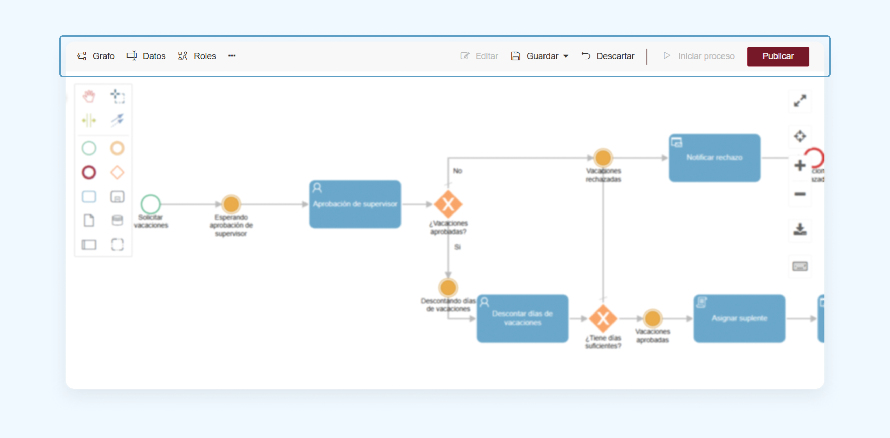
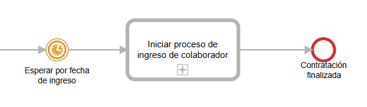
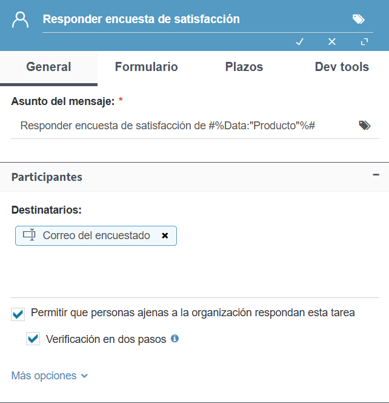

  v5.6 — Qflow Cloud          

*   [Qflow](https://qflowbpm.com/es/)
*   [Foro](https://forum.qflowbpm.com/)
*   [Centro de Ayuda](https://qflowbpm.com/es/centro-de-ayuda/)
*   [Contáctanos](https://qflowbpm.com/es/contacto/)

[Qflow](index.md)

Cloud (latest) 5.5 OnPremise (latest) 5.2 OnPremise 5.1.1 OnPremise

English Español

selectElement('versionSelect', getVersion()); selectElement('languageSelect', getLanguage()); function selectElement(id, valueToSelect) { let element = document.getElementById(id); element.value = valueToSelect; } function getLanguage() { if (window.location.href.includes('/es/')) { return '/es/'; } else { return '/en/'; } } function getVersion() { if (window.location.href.includes('/qflowcloud/')) { return '/qflowcloud/'; } else if (window.location.href.includes('/qflow5\_1\_1/')) { return '/qflow5\_1\_1/'; } else if (window.location.href.includes('/qflow5\_2/')) { return '/qflow5\_2/'; } else { return '/qflow5\_5/'; } } function redirectToSite(url) { var http = new XMLHttpRequest(); http.onreadystatechange = function() { if (http.readyState === 4) { if (http.status !== 404) { window.location.href = url; } else { window.location.href = url.replace(url.substr(url.lastIndexOf('/') + 1), 'index.md'); } } } http.open('HEAD', url, true); http.send(); }

  

Inicio

*   [Novedades](29-ReleaseNote.md)
    *   [v6.0](29.13-ReleaseNote6_0.md)
    *   [v5.6.2](29.12-ReleaseNote5_6_2.md)
    *   [v5.6.1](29.11-ReleaseNote5_6_1.md)
    *   [v5.6](#)
        *   [Resumen de características](#resumen-de-caracteristicas)
        *   [Nuevas funcionalidades](#nuevas-funcionalidades)
        *   [Corrección de errores y mejoras](#correccion-de-errores-y-mejoras)
    *   [v5.5.4](29.9-ReleaseNote5_5_4.md)
    *   [v5.5.3](29.8-ReleaseNote5_5_3.md)
    *   [v5.5.1](29.7-ReleaseNote5_5_1.md)
    *   [v5.5](29.6-ReleaseNote5_5.md)
    *   [v5.4](29.5-ReleaseNote5_4.md)
    *   [v5.3](29.4-ReleaseNote5_3.md)
    *   [v5.2](29.3-ReleaseNote5_2.md)
    *   [v5.1.2](29.2-ReleaseNote5_1_2.md)
    *   [v5.1.1](29.1-ReleaseNote5_1_1.md)
    *   [v5.1](29.1-ReleaseNote5_1_Cloud.md)
*   [Introducción a Qflow](01-QflowIntroduction.md)
*   [Tutoriales](TutorialsIndex.md)
*   [Qflow Task](04-QflowTask.md)
*   [Qflow Design](15-QflowDesign.md)
*   [Qflow Team](18-QflowTeam.md)
*   [Qflow Admin](19-QflowAdmin.md)
*   [Consumo de Q-points](21-Q-pointsConsumption.md)
*   [Conectores](34-ConnectorsIndex.md)
*   [Desarrolladores](31-Development.md)

[Qflow](index.md)

*   
*   [Novedades](29-ReleaseNote.md)
*   v5.6

- - -

# v5.6[](#v5-6 "Link to this heading")

## Resumen de características[](#resumen-de-caracteristicas "Link to this heading")

La nueva versión de Qflow trae un rediseño completo de Qflow Design, pensado para simplificar el diagrama de flujos de trabajo y mejorar la experiencia de usuario. El diseño de Qflow Design cambia y se adapta a las necesidades de sus usuarios, ofreciendo un diseño de procesos más simple y óptimo.

Esta transformación abarca:

*   Cambios de conceptos.
    
*   Nueva barra de acciones.
    
*   Eliminación de las pestañas de navegación.
    
*   Rediseño del panel izquierdo.
    
*   Unión de plantilla y versiones.
    
*   Simplificación y rediseño de los paneles de configuración de pasos.
    

¡Explora el nuevo Qflow Design y transforma la forma en que diseñas procesos!

Por otro lado, se incorpora la opción de autenticación en dos pasos (2FA) para tareas asignadas a usuarios externos, garantizando un mayor nivel de seguridad.

## Nuevas funcionalidades[](#nuevas-funcionalidades "Link to this heading")

### Cambio de conceptos en Qflow Design[](#cambio-de-conceptos-en-qflow-design "Link to this heading")

Atendiendo las necesidades de nuestros usuarios, transformamos algunos conceptos de Qflow Design con el fin de que sea más intuitivo. Conoce los nuevos conceptos:

*   **Proteger** se transforma en **Guardar**.
    
*   **Desproteger** es **Editar**.
    
*   **Deshacer desprotección** es **Descartar cambios**.
    
*   **Alcance** se convierte en **Visibilidad**.
    

### Barra de acciones: ¡procesos en marcha con menos clics

¡La navegación en el diseñador nunca fue tan sencilla! Con la nueva barra de acciones, accede rápidamente a los ítems de tus paquetes y plantillas, agilizando la configuración de tus procesos.

Además, la barra de acciones te permitirá realizar las principales acciones sobre la plantilla en la que estés trabajando: puedes guardar, editar y descartar cambios y publicar tu proceso.

Figura 12 Barra de acciones[](#id1 "Link to this image")

Cabe resaltar que esta funcionalidad agrega una manera sencilla y directa de iniciar procesos de las plantillas publicadas. Inicia tu proceso directamente desde el diseño de proceso, ahorrando pasos y estimulando la detección temprana de errores en tus flujos de trabajo.

Figura 13 Inicio de proceso desde la barra de acciones[](#id2 "Link to this image")

### Cambios de navegación: ¡adiós a las pestañas

Para mejorar la navegación se eliminaron las pestañas previamente mostradas en el encabezado de Qflow Design, relocalizando su contenido en la nueva y sencilla barra de acciones.

En lugar de las pestañas, el nuevo diseño muestra solamente el nombre del paquete, la plantilla o versión en la que se está trabajando. De esta manera, apostamos por un diseño más fácil de entender y utilizar: las mismas funcionalidades, en un diseño más amigable.

Figura 14 Cambios en navegación de Qflow Design[](#id3 "Link to this image")

### Rediseño del panel izquierdo[](#rediseno-del-panel-izquierdo "Link to this heading")

La barra lateral fue reemplazada por un panel izquierdo con pestañas que permiten navegar entre el árbol de paquetes, los procesos sin confirmar generados por IA y el buscador.

También se han actualizado los iconos, adaptando su diseño para que sean más intuitivos para los usuarios.

Figura 15 Panel izquierdo[](#id4 "Link to this image")

### Unión de plantilla y versiones[](#union-de-plantilla-y-versiones "Link to this heading")

A partir de esta versión, ya no se trabaja en las plantillas y las versiones de forma separada, si no que cada plantilla de Qflow Design identifica como versión actual a aquella sobre la que se está trabajando. Por eso, las acciones previamente realizadas sobre las versiones (como por ejemplo, publicar) ahora se realizan sobre la plantilla y se aplican a la versión seleccionada.

¿Cómo se ve el cambio? En el árbol de paquetes ya no veremos el listado de versiones, sino simplemente los paquetes y plantillas. Para cada plantilla, Qflow Design indica entre paréntesis la versión seleccionada.

Figura 16 Unión de plantillas y versiones[](#id5 "Link to this image")

¿Qué pasa con las versiones? ¡Siguen estando disponibles! Puedes acceder al listado de versiones, cambiar la versión seleccionada y agregar nuevas versiones a través del menú contextual de las plantillas.

Figura 17 Listado de versiones de plantillas de proceso[](#id6 "Link to this image")

Al trabajar en tu proceso, los ítems como datos y roles ahora se configuran a nivel plantilla de forma predeterminada, lo que sigue las mejores prácticas del diseño de procesos, permitiendo realizar gráficas e indicadores con roles y datos de procesos que tengan diferentes versiones. Para casos avanzados, será posible crear elementos exclusivamente a nivel de versión.

Figura 18 Cambio de listado de datos de aplicación de plantilla a versión[](#id7 "Link to this image")

### Rediseño de paneles de configuración de pasos[](#rediseno-de-paneles-de-configuracion-de-pasos "Link to this heading")

¡Nunca fue tan fácil configurar tus procesos!

El rediseño de los paneles de configuración añade pestañas para agrupar las opciones de configuración, simplificando el proceso. Además, implementa la posibilidad de ocultar opciones por defecto, habilitando su uso sólo a los usuarios avanzados que así lo requieran.

Figura 19 Formulario de Tarea de usuario[](#id8 "Link to this image")

Para lograr una mayor claridad y legibilidad de los procesos por parte de nuestros usuarios, algunas configuraciones ya no estarán disponibles para configurar en nuevos procesos. Todos estos cambios tienen una alternativa sencilla de implementar en esta nueva versión. Explora los cambios implementados y descubre las alternativas sugeridas en caso de que estuvieras utilizando la configuración anterior:

*   **Bandera y progreso:** se eliminan los conceptos de «Bandera de inicio» y «Bandera de fin». Ahora solo existe una configuración llamada «bandera», que aparece en los eventos de inicio, intermedios y de fin. El progreso se convierte en una configuración exclusiva para los eventos.
    
    Para replicar el comportamiento anterior de la «Bandera de inicio» en un paso, ahora se puede agregar un evento intermedio antes del paso y configurar el valor en el campo «Bandera». De igual forma, para replicar el comportamiento de «Bandera de fin» o «Progreso», basta con agregar un evento intermedio después del paso y configurarlo adecuadamente.
    
*   **Importancia del proceso:** se elimina el concepto de «importancia del proceso», que anteriormente se podía configurar en todos los pasos.
    
    Para replicar este comportamiento, puedes utilizar un dato del proceso que represente la importancia. Si deseas que la importancia varíe según el camino que siga el proceso, puedes implementar pasos de fórmula o de código para actualizar el valor del dato, o simplemente permitir modificar su valor en un formulario.
    
*   **Manejadores de eventos:** ahora solo se pueden configurar manejadores de eventos en aquellos pasos que pueden tener novedades antes de finalizar, es decir: tareas de usuario y tareas de servicio asincrónicas.
    
    Para el resto de los pasos, dado que se ejecutan de manera atómica, puedes agregar un paso de código antes del paso si deseas ejecutar código previamente, o un paso de código después del paso si prefieres que el código se ejecute al finalizar el paso en cuestión.
    
*   **Inicio diferido en actividad de llamada:** se ha eliminado la configuración de inicio diferido en la actividad de llamada. Anteriormente, esta opción permitía iniciar el proceso hijo de forma diferida según la configuración establecida. Ahora, este comportamiento puede replicarse añadiendo un evento de temporización que retrase el proceso el tiempo necesario antes de realizar la llamada al proceso hijo.
    

Figura 20 Alternativa a inicio diferido de actividad de llamada[](#id9 "Link to this image")

### Autoguardado[](#autoguardado "Link to this heading")

Ahora los cambios que realices en tus plantillas ¡se guardan automáticamente!

Cada vez que edites el grafo, configures un paso, añadas datos, roles o cualquier ítem, los cambios se almacenan de forma temporal para evitar la pérdida del progreso.

En la esquina inferior derecha podrás ver la marca temporal del último autoguardado de la plantilla.

Figura 21 Autoguardado temporal de proceso[](#id10 "Link to this image")

Es importante considerar que estos cambios son temporales y no afectarán los procesos iniciados con la plantilla. Para aplicar las modificaciones es necesario guardar explícitamente desde la barra de acciones o desde el árbol.

### Tareas con autenticación en dos pasos[](#tareas-con-autenticacion-en-dos-pasos "Link to this heading")

Para mayor seguridad, las tareas asignadas a usuarios externos pueden solicitar autenticación en dos pasos (2FA).

Figura 22 Configuración de autenticación en dos pasos (2FA) en Tarea de usuario[](#id11 "Link to this image")

Si activas esta opción, antes de responder la tarea el usuario asignado deberá ingresar un código de verificación enviado en tiempo real al correo electrónico asociado. De esta manera, garantizas que solo quien tiene acceso al correo electrónico destinatario pueda completar la tarea, protegiendo tus procesos.

Figura 23 Autenticación en dos pasos (2FA) en tareas de usuarios externos[](#id12 "Link to this image")

## Corrección de errores y mejoras[](#correccion-de-errores-y-mejoras "Link to this heading")

*   **Nuevas funcionalidades en la Interfaz de scripting**: se han incorporado nuevos métodos en la interfaz de scripting que permiten eliminar adjuntos asociados a los procesos. Estos métodos ofrecen la flexibilidad de eliminar adjuntos de forma física desde pasos de código, manejadores de eventos o integraciones, ya sea utilizando su nombre o identificador. Esto libera espacio de almacenamiento en el espacio de trabajo.
    
*   **Mejoras de performance**: se realizan mejoras de performance que generan una navegación más fluida en Qflow Task.
    
*   **Opción predeterminada en creación de nueva versión de proceso**: al crear una nueva versión de proceso, ahora la opción predeterminada es la de crear la versión a partir de la versión más actual y no de una versión vacía. De ser necesario, sigue siendo posible empezar desde una versión vacía o de elegir una versión anterior.
    
*   **Adjuntar dato de tipo documento en una Tarea de email**: a partir de esta versión, es posible elegir un dato de aplicación de tipo Documento como adjunto a enviar en una Tarea de email.
    
*   **Error al retroceder en pasos que inician etapas**: se corrige un error que impedía retroceder procesos cuando se encontraban en un paso que iniciaba una etapa.
    

[Anterior](29.11-ReleaseNote5_6_1.md "v5.6.1") [Siguiente](29.9-ReleaseNote5_5_4.md "v5.5.4")

- - -

© Derechos de autor 2025, Urudata Software.

jQuery(function () { SphinxRtdTheme.Navigation.enable(true); }); window.dataLayer = window.dataLayer || \[\]; function gtag(){dataLayer.push(arguments);} gtag('js', new Date()); gtag('config', 'G-LMDS8S4B42', { 'anonymize\_ip': false, });