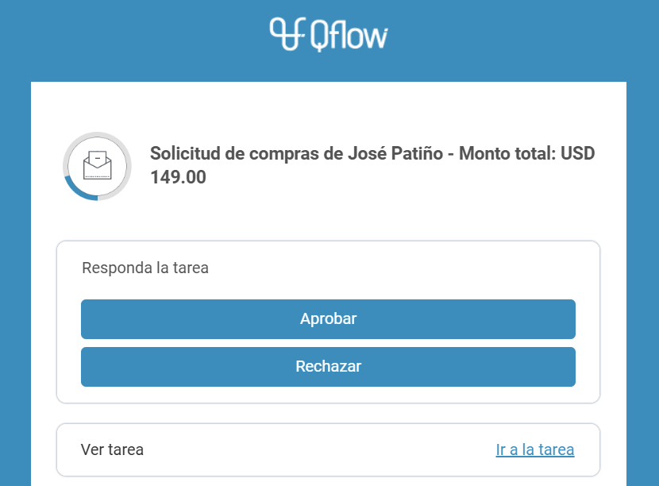

  v5.6.1 — Qflow Cloud          

*   [Qflow](https://qflowbpm.com/es/)
*   [Foro](https://forum.qflowbpm.com/)
*   [Centro de Ayuda](https://qflowbpm.com/es/centro-de-ayuda/)
*   [Contáctanos](https://qflowbpm.com/es/contacto/)

[Qflow](index.md)

Cloud (latest) 5.5 OnPremise (latest) 5.2 OnPremise 5.1.1 OnPremise

English Español

selectElement('versionSelect', getVersion()); selectElement('languageSelect', getLanguage()); function selectElement(id, valueToSelect) { let element = document.getElementById(id); element.value = valueToSelect; } function getLanguage() { if (window.location.href.includes('/es/')) { return '/es/'; } else { return '/en/'; } } function getVersion() { if (window.location.href.includes('/qflowcloud/')) { return '/qflowcloud/'; } else if (window.location.href.includes('/qflow5\_1\_1/')) { return '/qflow5\_1\_1/'; } else if (window.location.href.includes('/qflow5\_2/')) { return '/qflow5\_2/'; } else { return '/qflow5\_5/'; } } function redirectToSite(url) { var http = new XMLHttpRequest(); http.onreadystatechange = function() { if (http.readyState === 4) { if (http.status !== 404) { window.location.href = url; } else { window.location.href = url.replace(url.substr(url.lastIndexOf('/') + 1), 'index.md'); } } } http.open('HEAD', url, true); http.send(); }

  

Inicio

*   [Novedades](29-ReleaseNote.md)
    *   [v6.0](29.13-ReleaseNote6_0.md)
    *   [v5.6.2](29.12-ReleaseNote5_6_2.md)
    *   [v5.6.1](#)
        *   [Resumen de características](#resumen-de-caracteristicas)
        *   [Nuevas funcionalidades](#nuevas-funcionalidades)
        *   [Corrección de errores](#correccion-de-errores)
    *   [v5.6](29.10-ReleaseNote5_6.md)
    *   [v5.5.4](29.9-ReleaseNote5_5_4.md)
    *   [v5.5.3](29.8-ReleaseNote5_5_3.md)
    *   [v5.5.1](29.7-ReleaseNote5_5_1.md)
    *   [v5.5](29.6-ReleaseNote5_5.md)
    *   [v5.4](29.5-ReleaseNote5_4.md)
    *   [v5.3](29.4-ReleaseNote5_3.md)
    *   [v5.2](29.3-ReleaseNote5_2.md)
    *   [v5.1.2](29.2-ReleaseNote5_1_2.md)
    *   [v5.1.1](29.1-ReleaseNote5_1_1.md)
    *   [v5.1](29.1-ReleaseNote5_1_Cloud.md)
*   [Introducción a Qflow](01-QflowIntroduction.md)
*   [Tutoriales](TutorialsIndex.md)
*   [Qflow Task](04-QflowTask.md)
*   [Qflow Design](15-QflowDesign.md)
*   [Qflow Team](18-QflowTeam.md)
*   [Qflow Admin](19-QflowAdmin.md)
*   [Consumo de Q-points](21-Q-pointsConsumption.md)
*   [Conectores](34-ConnectorsIndex.md)
*   [Desarrolladores](31-Development.md)

[Qflow](index.md)

*   
*   [Novedades](29-ReleaseNote.md)
*   v5.6.1

- - -

# v5.6.1[](#v5-6-1 "Link to this heading")

## Resumen de características[](#resumen-de-caracteristicas "Link to this heading")

Con Qflow 5.6.1, automatizar y conectar tus procesos ¡es más fácil que nunca!

La nueva versión incorpora mejoras clave centradas en la experiencia del usuario, nuevas integraciones con Microsoft y opciones que reducen pasos y tiempos en la ejecución de tareas. Desde respuestas más intuitivas hasta envíos de correos más seguros, seguimos evolucionando junto a tus procesos.

¡Descubre el nuevo Qflow!

## Nuevas funcionalidades[](#nuevas-funcionalidades "Link to this heading")

### Servicios de correo: ¡más seguros y fáciles de usar

A partir de la llegada de Qflow 5.6.1, es posible conectar Qflow directamente con servicios de correo como Outlook. Esta actualización garantiza una mayor seguridad para nuestros usuarios, modernizando la gestión de notificaciones.

Disfruta de una configuración más sencilla, elimina la necesidad de contraseñas manuales y mejora la integración con cuentas corporativas de Microsoft.

### Respuesta de tareas directamente desde el correo[](#respuesta-de-tareas-directamente-desde-el-correo "Link to this heading")

Ahora, cuando una tarea permite la opción de respuesta rápida, el usuario recibirá un email con botones para responder directamente desde allí. Esta actualización optimiza los tiempos de respuesta, evitando que el usuario asignado deba ingresar en Qflow Task para poner el proceso en marcha.

Deja atrás los cuellos de botella, garantizando que todos los usuarios puedan responder de manera inmediata, desde cualquier dispositivo y lugar. ¡Menos pasos, menos demoras!

Figura 10 Email con opciones de respuesta rápida[](#id1 "Link to this image")

Figura 11 Mensaje de confirmación de respuesta[](#id2 "Link to this image")

### Botones con las respuestas para tareas[](#botones-con-las-respuestas-para-tareas "Link to this heading")

Hasta ahora, las posibles respuestas de cada tarea se desplegaban mediante menús tipo dropdown. Atendiendo al feedback de los usuarios y apuntando a simplificar las interacciones dentro de la herramienta, las respuestas se presentan por defecto como botones.

## Corrección de errores[](#correccion-de-errores "Link to this heading")

Como en cada actualización, se presentan correcciones de errores y mejoras varias para optimizar la experiencia de los usuarios.

[Anterior](29.12-ReleaseNote5_6_2.md "v5.6.2") [Siguiente](29.10-ReleaseNote5_6.md "v5.6")

- - -

© Derechos de autor 2025, Urudata Software.

jQuery(function () { SphinxRtdTheme.Navigation.enable(true); }); window.dataLayer = window.dataLayer || \[\]; function gtag(){dataLayer.push(arguments);} gtag('js', new Date()); gtag('config', 'G-LMDS8S4B42', { 'anonymize\_ip': false, });