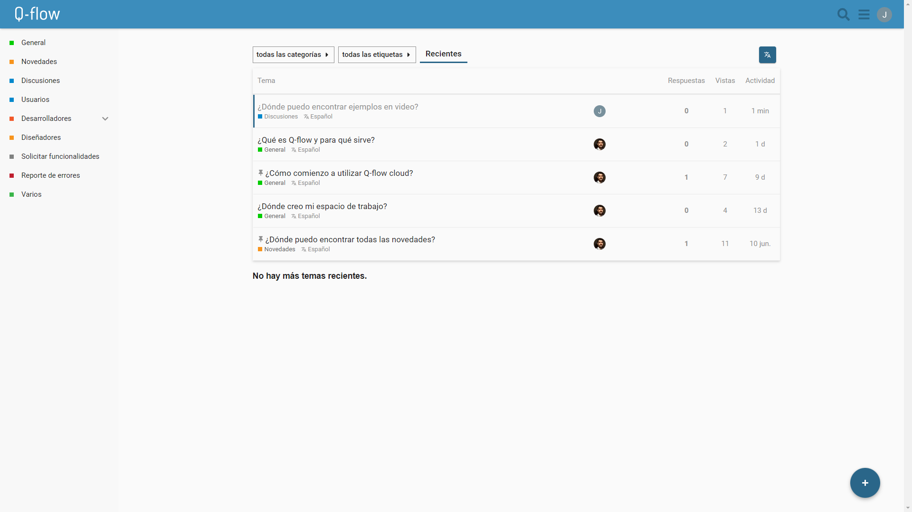
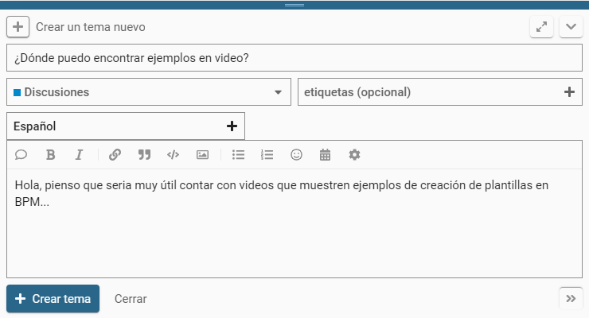
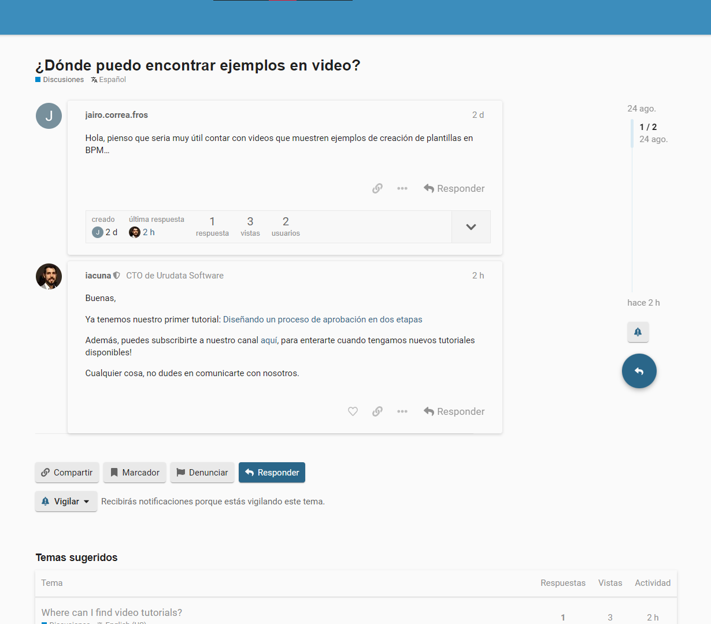
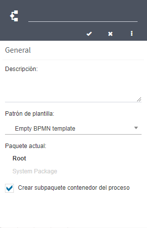

  v5.1.2 — Qflow Cloud          

*   [Qflow](https://qflowbpm.com/es/)
*   [Foro](https://forum.qflowbpm.com/)
*   [Centro de Ayuda](https://qflowbpm.com/es/centro-de-ayuda/)
*   [Contáctanos](https://qflowbpm.com/es/contacto/)

[Qflow](index.md)

Cloud (latest) 5.5 OnPremise (latest) 5.2 OnPremise 5.1.1 OnPremise

English Español

selectElement('versionSelect', getVersion()); selectElement('languageSelect', getLanguage()); function selectElement(id, valueToSelect) { let element = document.getElementById(id); element.value = valueToSelect; } function getLanguage() { if (window.location.href.includes('/es/')) { return '/es/'; } else { return '/en/'; } } function getVersion() { if (window.location.href.includes('/qflowcloud/')) { return '/qflowcloud/'; } else if (window.location.href.includes('/qflow5\_1\_1/')) { return '/qflow5\_1\_1/'; } else if (window.location.href.includes('/qflow5\_2/')) { return '/qflow5\_2/'; } else { return '/qflow5\_5/'; } } function redirectToSite(url) { var http = new XMLHttpRequest(); http.onreadystatechange = function() { if (http.readyState === 4) { if (http.status !== 404) { window.location.href = url; } else { window.location.href = url.replace(url.substr(url.lastIndexOf('/') + 1), 'index.md'); } } } http.open('HEAD', url, true); http.send(); }

  

Inicio

*   [Novedades](29-ReleaseNote.md)
    *   [v6.0](29.13-ReleaseNote6_0.md)
    *   [v5.6.2](29.12-ReleaseNote5_6_2.md)
    *   [v5.6.1](29.11-ReleaseNote5_6_1.md)
    *   [v5.6](29.10-ReleaseNote5_6.md)
    *   [v5.5.4](29.9-ReleaseNote5_5_4.md)
    *   [v5.5.3](29.8-ReleaseNote5_5_3.md)
    *   [v5.5.1](29.7-ReleaseNote5_5_1.md)
    *   [v5.5](29.6-ReleaseNote5_5.md)
    *   [v5.4](29.5-ReleaseNote5_4.md)
    *   [v5.3](29.4-ReleaseNote5_3.md)
    *   [v5.2](29.3-ReleaseNote5_2.md)
    *   [v5.1.2](#)
        *   [Mejoras generales](#mejoras-generales)
        *   [Sitio Web](#sitio-web)
        *   [BPM Web](#bpm-web)
        *   [SAM Web](#sam-web)
        *   [OMM Web](#omm-web)
        *   [Client Registration](#client-registration)
    *   [v5.1.1](29.1-ReleaseNote5_1_1.md)
    *   [v5.1](29.1-ReleaseNote5_1_Cloud.md)
*   [Introducción a Qflow](01-QflowIntroduction.md)
*   [Tutoriales](TutorialsIndex.md)
*   [Qflow Task](04-QflowTask.md)
*   [Qflow Design](15-QflowDesign.md)
*   [Qflow Team](18-QflowTeam.md)
*   [Qflow Admin](19-QflowAdmin.md)
*   [Consumo de Q-points](21-Q-pointsConsumption.md)
*   [Conectores](34-ConnectorsIndex.md)
*   [Desarrolladores](31-Development.md)

[Qflow](index.md)

*   
*   [Novedades](29-ReleaseNote.md)
*   v5.1.2

- - -

# v5.1.2[](#v5-1-2 "Link to this heading")

**Resumen de características**

La versión 5.1.2 incorpora diversas funcionalidades para mejorar la experiencia de usuario en Q-flow, tales como la posibilidad de «Recordar usuario» y simplificación en los pasos para empezar a diseñar un proceso. Por otra parte, el sistema ahora cuenta con la capacidad de almacenar los adjuntos en Azure Blob Storage.

## Mejoras generales[](#mejoras-generales "Link to this heading")

### Recordar usuario[](#recordar-usuario "Link to this heading")

En todos los sitios, en la pantalla de inicio de sesión, se agregó un cuadro seleccionable de «Recuérdame». Esta opción permite recordar la sesión en el navegador, para no tener que volver a iniciar sesión luego de cerrarlo. Esta opción está soportada también para el inicio de sesión con Google o Microsoft.

> 
> 
> Figura 69 Página de login de Q-flow, con opción de recuérdame[](#id3 "Link to this image")

### Foro de Q-flow[](#foro-de-q-flow "Link to this heading")

Ahora está disponible el foro de Q-flow, el lugar ideal para plantear dudas y recibir soporte por parte de la comunidad y especialistas de Q-flow. Entre otros usos, se pueden realizar pedidos de funcionalidades, consulta de diseño de formularios y reportes de errores.

> 
> 
> Figura 70 Home del foro[](#id4 "Link to this image")
> 
> 
> 
> Figura 71 Crear nueva entrada en el foro[](#id5 "Link to this image")
> 
> 
> 
> Figura 72 Publicación en foro de Q-flow[](#id6 "Link to this image")

### Acceso al foro desde los sitios[](#acceso-al-foro-desde-los-sitios "Link to this heading")

Se puede acceder al foro de Q-flow desde cualquier sitio, desde la opción que se encuentra en la “” de info del menú superior.

> 
> 
> Figura 73 Ubicación de foro en menú superior[](#id7 "Link to this image")

## Sitio Web[](#sitio-web "Link to this heading")

### Almacenamiento de adjuntos en Azure[](#almacenamiento-de-adjuntos-en-azure "Link to this heading")

El contenido de los adjuntos del sistema ahora se almacena en la nube, mediante la tecnología de Azure Blob Storage. Gracias a este cambio, se perciben beneficios inherentes a los almacenamientos en la nube. Se puede destacar la velocidad en los accesos a archivos y el manejo de la seguridad de nuestros datos, ya que el servicio garantiza protección contra accesos maliciosos y emplea mecanismos como la redundancia para recuperar datos ante cualquier imprevisto.

### Errores corregidos[](#errores-corregidos "Link to this heading")

**Vistas de sistema de cola de trabajo**

Se cambia la acción por defecto a «Editar» al hacer doble click en una vista de cola de trabajo, desde el listado de vistas de sistema.

**Error en datos decimales vacíos con alcance solo lectura editable**

Se corrige el error que no permitía responder una tarea al tener un dato de aplicación de tipo decimal vacío con alcance «Solo lectura editable».

## BPM Web[](#bpm-web "Link to this heading")

### Dejar grafo desprotegido al crear una plantilla[](#dejar-grafo-desprotegido-al-crear-una-plantilla "Link to this heading")

Al crear una nueva plantilla, tanto la plantilla como la versión creada se abren y el grafo queda desprotegido por defecto.

> 
> 
> Figura 74 Grafo desprotegido luego de creación de plantilla[](#id8 "Link to this image")

### Permitir crear paquete padre al crear plantilla[](#permitir-crear-paquete-padre-al-crear-plantilla "Link to this heading")

Al agregar una nueva plantilla desde un paquete, se permite seleccionar la opción «Crear subpaquete contenedor del proceso». Si se selecciona esta opción, se crea un subpaquete en el paquete que se encuentra seleccionado (que tomará el mismo nombre que la plantilla) y se creará la plantilla dentro de este subpaquete nuevo.

> 
> 
> Figura 75 Crear plantilla con opción de crear subpaquete contenedor[](#id9 "Link to this image")

### Nuevos roles por defecto: Iniciador y Supervisor[](#nuevos-roles-por-defecto-iniciador-y-supervisor "Link to this heading")

Se agregan los roles Iniciador del proceso y Supervisor del iniciador, como roles por defecto en el paquete raíz.

## SAM Web[](#sam-web "Link to this heading")

### Mejoras de estilos en gráficas de consumo[](#mejoras-de-estilos-en-graficas-de-consumo "Link to this heading")

Se realizan mejoras generales en los estilos de las gráficas de consumo

> 
> 
> Figura 76 Gráficas de consumo[](#id10 "Link to this image")

### Errores corregidos[](#id1 "Link to this heading")

**Cross-site scripting (XSS) en historial de Parámetros de Sistema** 

Se agregaron controles en el historial de Parámetros de Sistema para evitar la ejecución de código JavaScript que podría ser ingresado por un usuario.

## OMM Web[](#omm-web "Link to this heading")

### Errores corregidos[](#id2 "Link to this heading")

**Acción «Configuración de cola de trabajo guardada» sin descripción**

Se agrega a la auditoría de nodos la descripción de las entradas generadas al configurar una cola de trabajo.

## Client Registration[](#client-registration "Link to this heading")

### Espacio de trabajo[](#espacio-de-trabajo "Link to this heading")

Se cambia el concepto manejado como «Instancia» a «Espacio de trabajo».

### Cambio de tipo de licencia en uso[](#cambio-de-tipo-de-licencia-en-uso "Link to this heading")

Ahora se permite cambiar el tipo de licencia que se tiene en uso. Si se realiza un cambio de licencia a una licencia de menor costo que la anterior, se mantiene la licencia anterior hasta que finalice su vigencia. Si el cambio es a una licencia de mayor costo, la nueva licencia entra en vigencia en el momento, cambiando la fecha de facturación en caso que corresponda. Dependiendo de la diferencia de costo entre las licencias, se realiza un prorrateo para el cálculo de la nueva fecha de facturación.

### Permitir pago manual con transferencia bancaria[](#permitir-pago-manual-con-transferencia-bancaria "Link to this heading")

Al crear un espacio de trabajo, se agregó la posibilidad de pago mediante transferencia bancaria. Al seleccionar esta opción, el equipo se pondrá en contacto para finalizar el pago y continuar con la creación del espacio de trabajo.

### Otras mejoras[](#otras-mejoras "Link to this heading")

Se realizan mejoras generales en diferentes aspectos de la usabilidad del sitio, entre ellos: estilos, textos y animaciones de carga.

[Anterior](29.3-ReleaseNote5_2.md "v5.2") [Siguiente](29.1-ReleaseNote5_1_1.md "v5.1.1")

- - -

© Derechos de autor 2025, Urudata Software.

jQuery(function () { SphinxRtdTheme.Navigation.enable(true); }); window.dataLayer = window.dataLayer || \[\]; function gtag(){dataLayer.push(arguments);} gtag('js', new Date()); gtag('config', 'G-LMDS8S4B42', { 'anonymize\_ip': false, });