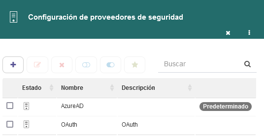
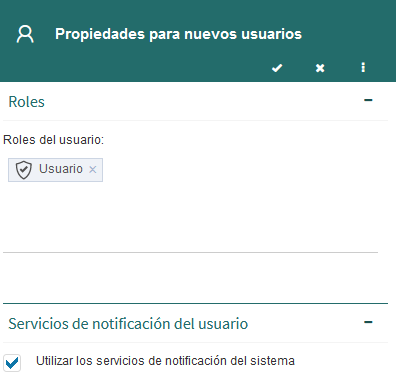

  v5.2 — Qflow Cloud          

*   [Qflow](https://qflowbpm.com/es/)
*   [Foro](https://forum.qflowbpm.com/)
*   [Centro de Ayuda](https://qflowbpm.com/es/centro-de-ayuda/)
*   [Contáctanos](https://qflowbpm.com/es/contacto/)

[Qflow](index.html)

Cloud (latest) 5.5 OnPremise (latest) 5.2 OnPremise 5.1.1 OnPremise

English Español

selectElement('versionSelect', getVersion()); selectElement('languageSelect', getLanguage()); function selectElement(id, valueToSelect) { let element = document.getElementById(id); element.value = valueToSelect; } function getLanguage() { if (window.location.href.includes('/es/')) { return '/es/'; } else { return '/en/'; } } function getVersion() { if (window.location.href.includes('/qflowcloud/')) { return '/qflowcloud/'; } else if (window.location.href.includes('/qflow5\_1\_1/')) { return '/qflow5\_1\_1/'; } else if (window.location.href.includes('/qflow5\_2/')) { return '/qflow5\_2/'; } else { return '/qflow5\_5/'; } } function redirectToSite(url) { var http = new XMLHttpRequest(); http.onreadystatechange = function() { if (http.readyState === 4) { if (http.status !== 404) { window.location.href = url; } else { window.location.href = url.replace(url.substr(url.lastIndexOf('/') + 1), 'index.html'); } } } http.open('HEAD', url, true); http.send(); }

  

Inicio

*   [Novedades](29-ReleaseNote.html)
    *   [v6.0](29.13-ReleaseNote6_0.html)
    *   [v5.6.2](29.12-ReleaseNote5_6_2.html)
    *   [v5.6.1](29.11-ReleaseNote5_6_1.html)
    *   [v5.6](29.10-ReleaseNote5_6.html)
    *   [v5.5.4](29.9-ReleaseNote5_5_4.html)
    *   [v5.5.3](29.8-ReleaseNote5_5_3.html)
    *   [v5.5.1](29.7-ReleaseNote5_5_1.html)
    *   [v5.5](29.6-ReleaseNote5_5.html)
    *   [v5.4](29.5-ReleaseNote5_4.html)
    *   [v5.3](29.4-ReleaseNote5_3.html)
    *   [v5.2](#)
        *   [Mejoras generales](#mejoras-generales)
        *   [Qflow Task](#qflow-task)
        *   [Qflow Design](#qflow-design)
        *   [Qflow Team](#qflow-team)
        *   [Backend](#backend)
        *   [Qflow Admin](#qflow-admin)
    *   [v5.1.2](29.2-ReleaseNote5_1_2.html)
    *   [v5.1.1](29.1-ReleaseNote5_1_1.html)
    *   [v5.1](29.1-ReleaseNote5_1_Cloud.html)
*   [Introducción a Qflow](01-QflowIntroduction.html)
*   [Tutoriales](TutorialsIndex.html)
*   [Qflow Task](04-QflowTask.html)
*   [Qflow Design](15-QflowDesign.html)
*   [Qflow Team](18-QflowTeam.html)
*   [Qflow Admin](19-QflowAdmin.html)
*   [Consumo de Q-points](21-Q-pointsConsumption.html)
*   [Conectores](34-ConnectorsIndex.html)
*   [Desarrolladores](31-Development.html)

[Qflow](index.html)

*   
*   [Novedades](29-ReleaseNote.html)
*   v5.2

- - -

# v5.2[](#v5-2 "Link to this heading")

**Resumen de características**

La versión 5.2 incorpora diversas funcionalidades para mejorar la experiencia de usuario en Qflow, tales como brindar un nuevo sitio (Qflow Access) que sea el punto de acceso de los usuarios a Qflow, compartir la sesión entre las herramientas, brindar plantillas de proceso predeterminadas, responder múltiples tareas de manera simple, entre otras. Por otra parte, el sistema ahora cuenta con la capacidad de almacenar los adjuntos en una base de datos independiente.

Adicionalmente, el producto continúa su constante evolución, incorporando funcionalidades solicitadas por nuestros clientes y socios de negocios, que facilitan su trabajo para poder hacer más en menos tiempo.

Cuando la característica descrita tenga un alto contenido técnico se lo indicará con el ícono (). Además, si se incluyó como fix para alguna versión anterior, se indicará de la siguiente manera: \[x.y\]. Si es un analista funcional puede omitir la lectura de esas novedades.

Si cuentas con un espacio de trabajo en la nube, ¡ya estás disfrutando de estas funcionalidades! De lo contrario, analiza los planes en [https://qflowbpm.com/es/precios/](https://qflowbpm.com/es/precios/). Si ya cuentas con una instalación onpremise, para aprovechar las ventajas de la nueva versión entra en contacto con tu gerente de cuenta, quien podrá asistirte en la instalación o actualización del sistema, para comenzar a usar las nuevas funcionalidades. Si no tienes un gerente de cuenta, puedes contactarnos completando el formulario de la siguiente URL: [https://qflowbpm.com/es/contacto/](https://qflowbpm.com/es/contacto/).

## Mejoras generales[](#mejoras-generales "Link to this heading")

### Renovación de nombres y logos[](#renovacion-de-nombres-y-logos "Link to this heading")

¡Se renueva el producto, se actualiza Q-flow y ahora se presenta como Qflow!

> 
> 
> Figura 54 Nuevo logo Qflow[](#id2 "Link to this image")

Se renuevan los distintos sitios y para que su nombre sea más intuitivo, se deciden hacer los siguientes cambios:

> 
> 
> Figura 55 Nuevo logos y nombres de las herramientas de Qflow[](#id3 "Link to this image")

### Unificación de acceso al producto[](#unificacion-de-acceso-al-producto "Link to this heading")

Se crea Qflow Access, nuevo portal de acceso al producto, brindando un único punto de acceso y sesión compartida entre los distintos sitios. De esta manera, los usuarios obtienen una experiencia más sencilla y fluida, no debiendo iniciar sesión en cada una de las herramientas individualmente. Sólo se inicia sesión en Qflow Access y se tiene acceso inmediato a todas las herramientas disponibles.

> 
> 
> Figura 56 Página de login de Qflow[](#id4 "Link to this image")

Además, desde cualquiera de las herramientas es posible acceder a los distintos sitios a los cuales tenga permiso de acceder.

> 
> 
> Figura 57 Acceso a las distintas herramientas desde Qflow Task[](#id5 "Link to this image")

Continuando con la unificación de acceso al producto, se actualiza la página de login de las distintas herramientas, manteniendo un estilo armónico entre sí, cambiando únicamente el color principal.

> 
> 
> Figura 58 Páginas de login[](#id6 "Link to this image")

Es posible mostrar el logo de la empresa, cargándolo en Qflow Admin, al actualizar el parámetro de sistema _Logo_.

Se puede ver más detalles sobre cómo configurar un parámetro de sistema en Qflow Admin - Parámetros de sistema.

### Integración con gravatar[](#integracion-con-gravatar "Link to this heading")

En el menú superior de las distintas herramientas, se podrá visualizar la foto de perfil que el usuario tenga registrada en _gravatar_, asociada a su correo electrónico.

> 
> 
> Figura 59 Menú superior de Qflow Task con imagen _gravatar_[](#id7 "Link to this image")

Cada persona puede asociar su mail en [https://gravatar.com](https://gravatar.com).

En caso de que el mail no esté registrado o se haya deshabilitado esta opción en Qflow Admin, las iniciales del usuario serán mostradas en su lugar.

> 
> 
> Figura 60 Menú superior de Qflow Task con iniciales del usuario[](#id8 "Link to this image")

Por defecto, la opción de usar gravatar estará habilitada. Si se desea deshabilitar esta opción, es necesario actualizar el parámetro de sistema _Usar gravatar para foto de perfil_ en Qflow Admin.

### Optimizaciones en navegación [](#optimizaciones-en-navegacion-technical-icon "Link to this heading")

Se implementa la utilización de service worker en los distintos sitios (Task, Design, Team y Admin) para almacenar localmente archivos estáticos que serán reutilizados en las distintas navegaciones. Esto permite una navegación más fluida a los usuarios.

## Qflow Task[](#qflow-task "Link to this heading")

### Responder múltiples tareas de manera simple[](#responder-multiples-tareas-de-manera-simple "Link to this heading")

Desde la vista de Mis tareas, es posible seleccionar múltiples tareas que permitan Respuesta rápida y responder por todas ellas una respuesta que tengan en común. Además, se permite agregar un comentario para todas aquellas que lo admitan o lo requieran.

Para poder acceder a esta funcionalidad, se debe tener configurado en la vista correspondiente, la columna de sistema «Respuesta rápida». De igual forma, si no se desea brindar esta funcionalidad, se puede quitar dicha columna.

> 
> 
> Figura 61 Configuración columna Respuesta rápida[](#id9 "Link to this image")

Dado que es posible seleccionar múltiples tareas, su progreso será visible en la esquina inferior derecha, donde es posible visualizar las tareas en proceso, en error y finalizadas. Además, podrá acceder a una vista completa para visualizar la información con mayor comodidad.

Además, la tarea debe permitir este tipo de respuestas, para lo cual no debe tener ningun dato, rol o adjunto que sea requerido.

> 
> 
> Figura 62 Configuración columna Respuesta rápida[](#id10 "Link to this image")

Se puede ver más detalles sobre cómo configurar las respuestas rápidas en [Qflow Task - Respuesta rápida](04-QflowTask.html#respuesta-rapida).

### Almacenamiento de adjuntos en base de datos externa [](#almacenamiento-de-adjuntos-en-base-de-datos-externa-onpremise-icon-2x-technical-icon "Link to this heading")

El contenido de los adjuntos del sistema ahora se puede almacenar en una base de datos externa. Es posible optar por almacenar los adjuntos de los procesos en: Base de datos de Qflow, Base de datos externa o Azure blob storage.

### Actualización de formularios por defecto[](#actualizacion-de-formularios-por-defecto "Link to this heading")

Por defecto, los formularios de los eventos de inicio, las tareas, edición del proceso e información del proceso utilizarán la versión de una columna.

## Qflow Design[](#qflow-design "Link to this heading")

### Plantillas de proceso pre-creadas[](#plantillas-de-proceso-pre-creadas "Link to this heading")

Es posible comenzar a utilizar alguno de nuestros procesos pre-creados en minutos. Las plantillas disponibles hasta el momento son:

> *   Aprobación en dos etapas
>     
> *   Solicitud de vacaciones
>     
> *   Selección de personal
>     
> *   Rendición de gastos
>     
> *   Aprobación de documentos
>     
> *   Solicitud de compras
>     

Por ejemplo, el proceso de solicitud de vacaciones, genera una plantilla como la siguiente:

> 
> 
> Figura 63 Proceso de solicitud de vacaciones[](#id11 "Link to this image")

Para utilizarla, simplemente es necesario asignar la versión de la plantilla en producción en Qflow Design y comenzar a iniciar procesos en Qflow Task.

Se puede ver más detalles sobre las plantillas pre-creadas en [Qflow Design - Plantillas pre-creadas](15-QflowDesign.html#plantillas-pre-creadas).

### ¡Nos integramos con Sharepoint 365

Es posible crear Dominios, Integraciones y Parámetros de aplicación con Sharepoint 365. Por lo tanto, se puede tener un dato que seleccione un elemento de una lista de Sharepoint 365 y complete otros datos a partir del seleccionado. Además es posible insertar nuevos elementos mediante las integraciones.

Se puede ver más detalles sobre dominios en [Qflow Design - Dominios](15-QflowDesign.html#dominios). Sobre las itegraciones en [Qflow Design - Integraciones](15-QflowDesign.html#integraciones).

### Nuevos dominios por defecto[](#nuevos-dominios-por-defecto "Link to this heading")

Se crean los siguientes dominios por defecto en el paquete raíz:

> *   Hipervínculo
>     
> *   Cuadro de texto enriquecido
>     
> *   Contraseña
>     
> *   Correo
>     
> *   Teléfono
>     

### Errores corregidos[](#errores-corregidos "Link to this heading")

**Si el texto de la nota es mayor a 256 caracteres, se corta**

En caso de que se ingresara en una nota del proceso un texto de largo mayor a 256 caracteres, se perdían los caracteres posteriores a 256.

## Qflow Team[](#qflow-team "Link to this heading")

### Enviar bienvenida al usuario creado[](#enviar-bienvenida-al-usuario-creado "Link to this heading")

Al momento de crear un nuevo usuario, se le enviará mediante correo electrónico la bienvenida a Qflow con el link de acceso a Qflow Access.

> 
> 
> Figura 64 Correo de bienvenida[](#id12 "Link to this image")

El correo será enviado siempre que el nuevo usuario creado tenga asignado un correo electrónico y servicio de notificación válidos.

El logo utilizado puede ser personalizado, actualizando el valor del parámetro de sistema _Logo de correos_.

Si se desea, esta funcionalidad se puede deshabilitar, configurando el parámetro de sistema _Notificar al usuario en la creación_ como Falso.

### Configuración de proveedor de seguridad predeterminado[](#configuracion-de-proveedor-de-seguridad-predeterminado "Link to this heading")

Desde la herramienta, es posible elegir cuál será el proveedor de seguridad predeterminado del espacio de trabajo. Esto permite que se preseleccione en las vistas de login.

> 
> 
> Figura 65 Proveedor de predeterminado[](#id13 "Link to this image")

Se puede ver más detalles sobre proveedores de seguridad en [Qflow Team - Proveedores de seguridad](18-QflowTeam.html#proveedores-de-seguridad).

### Configuración de propiedades por defecto para nuevos usuarios[](#configuracion-de-propiedades-por-defecto-para-nuevos-usuarios "Link to this heading")

Desde el menú superior, en la sección de configuración, podrá acceder a configurar propiedades para que todos los usuarios creados las obtengan por defecto.

> 
> 
> Figura 66 Seleccionar Propiedades para nuevos usuarios[](#id14 "Link to this image")

Actualmente se pueden configurar los roles y servicios de notificación, como lo muestra la siguiente imagen.

> 
> 
> Figura 67 Propiedades para nuevos usuarios[](#id15 "Link to this image")

Todo usuario nuevo heredará estas propiedades por defecto y podrán ser modificadas en su creación. Esto también aplica a la creación de usuarios desde los servicios web.

### Mejoras en panel de usuario[](#mejoras-en-panel-de-usuario "Link to this heading")

Se muestra la configuración de roles, incluso cuando el panel no está expandido, permitiendo esta configuración de manera ágil.

Se deja cerrado por defecto el grupo de servicios de configuración, dado que actualmente se heredan de la configuración por defecto deja de ser necesario configurarlo para cada usuario.

## Backend[](#backend "Link to this heading")

### Actualización de estilos de notificaciones de correo según tema del espacio de trabajo[](#actualizacion-de-estilos-de-notificaciones-de-correo-segun-tema-del-espacio-de-trabajo "Link to this heading")

Se actualizan los estilos y las imágenes utilizadas en los mails, utilizando colores asociados al tema del espacio de trabajo. Por ejemplo, a continuación se puede ver un correo electrónico enviado:

> 
> 
> Figura 68 Correo de qflow[](#id16 "Link to this image")

### Contemplar zona horaria en AddSubstitution en tarea de código [](#contemplar-zona-horaria-en-addsubstitution-en-tarea-de-codigo-technical-icon "Link to this heading")

Si se utiiza el método AddSubstitution en una tarea de código, en caso que la fecha especificada sea DateTime con Kind UTC, se utiliza la fecha estipulada en UTC, de lo contrario se asume que el valor se encuentra en la zona horaria del calendario del usuario.

Se puede ver más detalle sobre cómo funciona el método en [Interfaz de scripting](10-ScriptingInterface.html#iscripthost).

### Errores corregidos[](#id1 "Link to this heading")

**No se usa versión en producción en actividad de llamada**

Al cambiar la versión en producción de la plantilla seleccionada, se seguía iniciando la versión que estaba en producción al momento de configurar la actividad de llamada.

## Qflow Admin[](#qflow-admin "Link to this heading")

### Nuevos parámetros de sistema [](#nuevos-parametros-de-sistema-technical-icon "Link to this heading")

Para más y mejores personalizaciones, se agregan los siguientes parámetros de sistema:

> *   Logo
>     
> *   Logo versión clara
>     
> *   Logo de task
>     
> *   Mini logo de task
>     
> *   Logo de correos
>     
> *   Usar gravatar para foto de perfil
>     
> *   Notificar al usuario en la creación
>     

Se puede ver más información sobre estos parámetros en [Qflow Admin - Parámetros de sistema](19-QflowAdmin.html#listado-de-parametros-de-sistema).

[Anterior](29.4-ReleaseNote5_3.html "v5.3") [Siguiente](29.2-ReleaseNote5_1_2.html "v5.1.2")

- - -

© Derechos de autor 2025, Urudata Software.

jQuery(function () { SphinxRtdTheme.Navigation.enable(true); }); window.dataLayer = window.dataLayer || \[\]; function gtag(){dataLayer.push(arguments);} gtag('js', new Date()); gtag('config', 'G-LMDS8S4B42', { 'anonymize\_ip': false, });