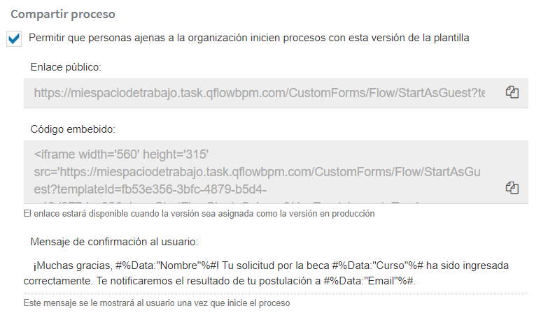
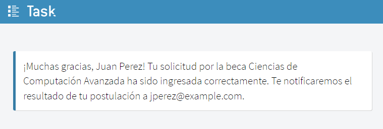
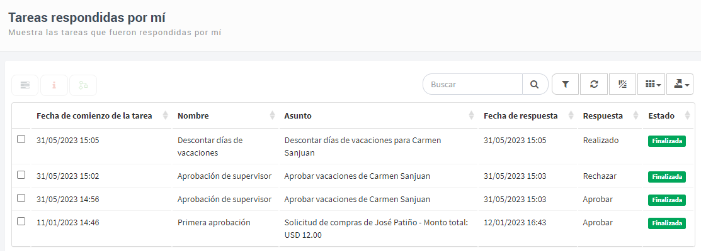
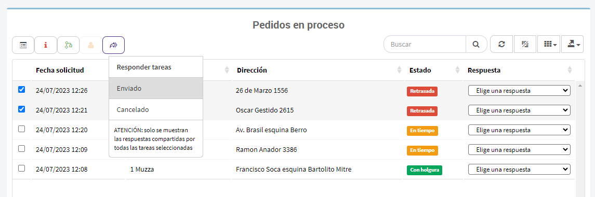
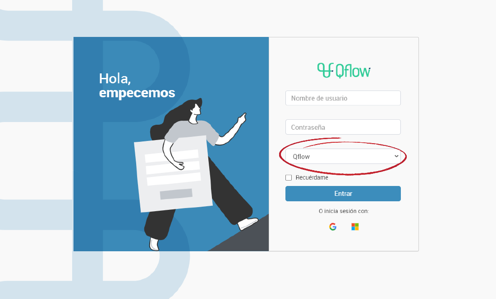
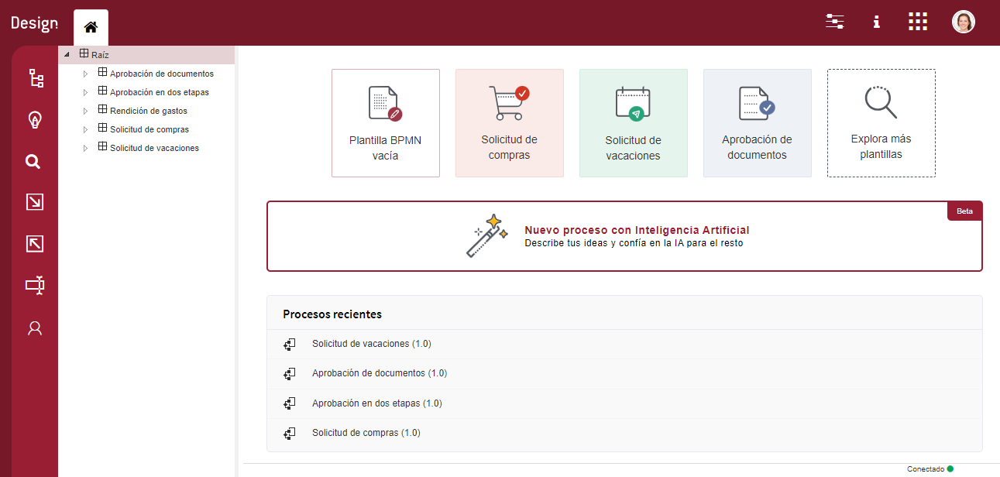
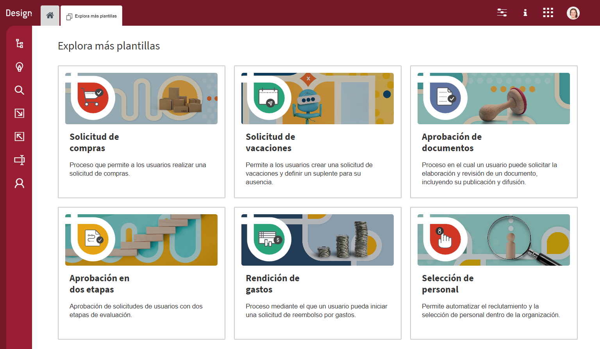

  v5.3 — Qflow Cloud          

*   [Qflow](https://qflowbpm.com/es/)
*   [Foro](https://forum.qflowbpm.com/)
*   [Centro de Ayuda](https://qflowbpm.com/es/centro-de-ayuda/)
*   [Contáctanos](https://qflowbpm.com/es/contacto/)

[Qflow](index.md)

Cloud (latest) 5.5 OnPremise (latest) 5.2 OnPremise 5.1.1 OnPremise

English Español

selectElement('versionSelect', getVersion()); selectElement('languageSelect', getLanguage()); function selectElement(id, valueToSelect) { let element = document.getElementById(id); element.value = valueToSelect; } function getLanguage() { if (window.location.href.includes('/es/')) { return '/es/'; } else { return '/en/'; } } function getVersion() { if (window.location.href.includes('/qflowcloud/')) { return '/qflowcloud/'; } else if (window.location.href.includes('/qflow5\_1\_1/')) { return '/qflow5\_1\_1/'; } else if (window.location.href.includes('/qflow5\_2/')) { return '/qflow5\_2/'; } else { return '/qflow5\_5/'; } } function redirectToSite(url) { var http = new XMLHttpRequest(); http.onreadystatechange = function() { if (http.readyState === 4) { if (http.status !== 404) { window.location.href = url; } else { window.location.href = url.replace(url.substr(url.lastIndexOf('/') + 1), 'index.md'); } } } http.open('HEAD', url, true); http.send(); }

  

Inicio

*   [Novedades](29-ReleaseNote.md)
    *   [v6.0](29.13-ReleaseNote6_0.md)
    *   [v5.6.2](29.12-ReleaseNote5_6_2.md)
    *   [v5.6.1](29.11-ReleaseNote5_6_1.md)
    *   [v5.6](29.10-ReleaseNote5_6.md)
    *   [v5.5.4](29.9-ReleaseNote5_5_4.md)
    *   [v5.5.3](29.8-ReleaseNote5_5_3.md)
    *   [v5.5.1](29.7-ReleaseNote5_5_1.md)
    *   [v5.5](29.6-ReleaseNote5_5.md)
    *   [v5.4](29.5-ReleaseNote5_4.md)
    *   [v5.3](#)
        *   [Asistente de Inteligencia Artificial para la generación de procesos de negocio](#asistente-de-inteligencia-artificial-para-la-generacion-de-procesos-de-negocio)
        *   [Inicio de procesos por usuarios externos o anónimos](#inicio-de-procesos-por-usuarios-externos-o-anonimos)
        *   [Nueva vista: “Tareas respondidas por mí”](#nueva-vista-tareas-respondidas-por-mi)
        *   [Respuesta rápida en vistas personalizadas de “Mis tareas”](#respuesta-rapida-en-vistas-personalizadas-de-mis-tareas)
        *   [Nuevos formatos de columnas para vistas personalizadas](#nuevos-formatos-de-columnas-para-vistas-personalizadas)
        *   [Inicio de sesión con Qflow](#inicio-de-sesion-con-qflow)
        *   [Qflow Design: Home renovada y nueva galería de plantillas pre-creadas](#qflow-design-home-renovada-y-nueva-galeria-de-plantillas-pre-creadas)
        *   [Correcciones y mejoras](#correcciones-y-mejoras)
    *   [v5.2](29.3-ReleaseNote5_2.md)
    *   [v5.1.2](29.2-ReleaseNote5_1_2.md)
    *   [v5.1.1](29.1-ReleaseNote5_1_1.md)
    *   [v5.1](29.1-ReleaseNote5_1_Cloud.md)
*   [Introducción a Qflow](01-QflowIntroduction.md)
*   [Tutoriales](TutorialsIndex.md)
*   [Qflow Task](04-QflowTask.md)
*   [Qflow Design](15-QflowDesign.md)
*   [Qflow Team](18-QflowTeam.md)
*   [Qflow Admin](19-QflowAdmin.md)
*   [Consumo de Q-points](21-Q-pointsConsumption.md)
*   [Conectores](34-ConnectorsIndex.md)
*   [Desarrolladores](31-Development.md)

[Qflow](index.md)

*   
*   [Novedades](29-ReleaseNote.md)
*   v5.3

- - -

# v5.3[](#v5-3 "Link to this heading")

**Resumen de características**

La esperada versión 5.3 de Qflow trae consigo una serie de mejoras y nuevas funcionalidades para enriquecer tu experiencia como usuario. Entre estas destacan la incorporación de un asistente de inteligencia artificial para la generación y automatización de los procesos de negocio, la capacidad de iniciar procesos por usuarios externos al sistema, una nueva vista que permite a cada usuario acceder fácilmente a sus tareas respondidas y mayor potencia a la respuesta rápida de tareas, entre otras funcionalidades.

Con estas adiciones, Qflow se coloca a la vanguardia tecnológica, aprovechando el potencial de la inteligencia artificial para ofrecer una nueva forma de abordar la creación de procesos empresariales. Además, seguimos atentos a los comentarios de nuestros usuarios y socios comerciales, incorporando funciones que agregan valor a su experiencia con nuestra plataforma. Para aportar con sugerencias o comentarios para mejorar nuestro producto, puedes publicar en el [foro de Qflow](https://forum.qflowbpm.com/).

## Asistente de Inteligencia Artificial para la generación de procesos de negocio[](#asistente-de-inteligencia-artificial-para-la-generacion-de-procesos-de-negocio "Link to this heading")

Ahora dispones de un asistente de inteligencia artificial que genera y automatiza los procesos en Qflow. Este asistente, impulsado por ChatGPT, es capaz de generar y automatizar procesos a partir de una descripción en lenguaje natural. Esta descripción puede ser tanto simple y abstracta, como «Proceso de solicitud de compras estándar», o más detallada, incluyendo una serie de pasos, datos y roles específicos para obtener un proceso preciso y adaptado a tus necesidades, como puede ser «Proceso de solicitud de compras en el cual los solicitantes ingresan un listado de artículos con cantidades, dirección de envío y datos de contacto, pasando luego por una aprobación del gerente de compras y notificación de despacho si se confirma la transacción».

> 
> 
> Figura 46 Formulario de asistente de IA[](#id1 "Link to this image")

El asistente de IA se encarga de crear el diagrama del proceso en notación BPMN, así como de definir los datos, roles y configuraciones de los pasos, como las condiciones de puertas exclusivas y los datos a completar en los formularios.

Es relevante tener en consideración que al tratarse de una primera implementación del asistente y encontrarse basado en Inteligencia Artificial, puede presentar errores ocasionales, que disminuirán a medida que la herramienta se nutra de la experiencia de nuestros clientes. En caso de que los resultados no cumplan tus expectativas, puedes intentar generar el proceso nuevamente con la misma descripción o probar con una descripción diferente. En esta versión inicial, cada espacio de trabajo estará limitado a 100 usos del asistente por mes.

Para conocer más sobre el asistente de inteligencia artificial, puedes ver [la sección del asistente](15-QflowDesign.md#aiassistant) en el manual de Qflow Design.

## Inicio de procesos por usuarios externos o anónimos[](#inicio-de-procesos-por-usuarios-externos-o-anonimos "Link to this heading")

A partir de esta versión, se ha habilitado para que personas que no cuenten con una cuenta en Qflow puedan iniciar procesos. Esta funcionalidad resulta especialmente beneficiosa en contextos tales como:

> *   Solicitud de contacto
>     
> *   Postulación en procesos de selección de personal
>     
> *   Realización de encuestas
>     
> *   Inicio de aprobación de facturas por parte de proveedores externos
>     
> *   Inscripción a eventos o conferencias
>     
> *   Solicitud de cotizaciones
>     
> *   Presentación de reclamos por parte de clientes
>     
> *   ¡Y muchos más!
>     

Además, al acceder al formulario público del proceso, incluso aquellos usuarios que hayan iniciado sesión en Qflow podrán iniciar un proceso de manera anónima. Esto brinda la posibilidad de emplear Qflow para escenarios como:

> *   Denuncias anónimas
>     
> *   Buzón de sugerencias
>     

Adicionalmente, es posible configurar un mensaje de confirmación personalizado para cada proceso, el cual se mostrará al usuario una vez que haya completado exitosamente el formulario e iniciado el proceso (ver [Figura 48](#externalstartconfirmationmessagefigure)).

> 
> 
> Figura 47 Configuración de inicio externo o anónimo en paso de inicio[](#id2 "Link to this image")

Figura 48 Mensaje de confirmación de inicio externo o anónimo[](#id3 "Link to this image")

Para más detalle sobre como configurar para que un proceso pueda ser iniciado por usuarios externos, puedes ver la sección de [configuración de paso de inicio](15-QflowDesign.md#starteventdesign). Para detalle sobre el consumo de puntos de procesos iniciados por invitados, puedes ver [la información de consumo de puntos](21-Q-pointsConsumption.md).

## Nueva vista: “Tareas respondidas por mí”[](#nueva-vista-tareas-respondidas-por-mi "Link to this heading")

Se ha introducido una nueva vista denominada «Tareas respondidas por mí», a la que podrás acceder de manera sencilla desde el menú lateral. Esta vista está especialmente diseñada para que puedas acceder de forma rápida a las tareas a las que has dado respuesta en el pasado.

Dentro de esta vista, tendrás la capacidad de visualizar de manera concisa y eficiente la información clave de las tareas que has abordado. Esto incluye detalles como el asunto de la tarea, la fecha en que se inició, la fecha en que diste tu respuesta, cuál fue tu respuesta y el estado actual de la tarea.

> 
> 
> Figura 49 Vista de «Tareas respondidas por mí»[](#id4 "Link to this image")

En línea con la flexibilidad característica de todas las vistas del sistema Qflow, esta nueva funcionalidad es completamente personalizable en tu espacio de trabajo. Esto significa que podrás agregar filtros, incorporar o ajustar columnas, establecer criterios de ordenamiento y más, permitiendo adaptar la vista según tus preferencias y requerimientos específicos.

## Respuesta rápida en vistas personalizadas de “Mis tareas”[](#respuesta-rapida-en-vistas-personalizadas-de-mis-tareas "Link to this heading")

En la [versión 5.2 de Qflow](29.3-ReleaseNote5_2.md) se implementó la funcionalidad de responder directamente a una o varias tareas desde la vista de sistema «Mis tareas», en los casos en que las tareas lo permitieran, sin requerir acceder al formulario correspondiente.

En esta última actualización, se extendió la función de respuesta rápida a todas las vistas personalizadas que los usuarios hayan creado, siempre y cuando estas vistas pertenezcan a la categoría «Mis tareas». Esta nueva funcionalidad brinda la oportunidad de realizar respuestas rápidas en vistas específicas, en las cuales los usuarios han configurado columnas para exponer toda la información esencial necesaria para la toma de decisiones. Puedes ver mas sobre la funcionalidad en la sección de [Respuesta rápida](04-QflowTask.md#quickresponse).

De esta forma, podrás aprovechar la respuesta rápida en contextos más amplios, agilizando tus interacciones y decisiones en relación con las tareas asignadas y permitiéndote una gestión más eficiente.

> 
> 
> Figura 50 Respuesta rápida en vista personalizada[](#id5 "Link to this image")

## Nuevos formatos de columnas para vistas personalizadas[](#nuevos-formatos-de-columnas-para-vistas-personalizadas "Link to this heading")

Para poder visualizar de forma más fácil el estado actual de las tareas y de la etapa actual de un proceso en las vistas personalizadas, se agregaron los nuevos formatos de visualización:

> *   Mostrar el estado actual de la etapa del proceso
>     
> *   Mostrar el estado actual de la tarea
>     

Estos nuevos formatos permiten mostrar en forma de etiqueta las columnas del estado de la etapa y de la tarea.

Para más detalle sobre como configurar los nuevos formatos de las vistas, puedes acceder a la sección de [columnas de una vista](04-QflowTask.md#columns).

## Inicio de sesión con Qflow[](#inicio-de-sesion-con-qflow "Link to this heading")

Con el objetivo de mejorar la experiencia de nuestros usuarios y facilitar los procesos de registro e ingreso a Qflow, esta versión agrega un nuevo proveedor de seguridad al sistema. El proveedor “Qflow” se incluye por defecto en todos los espacios de trabajo creados en la versión Cloud del producto. Este permite a los usuarios iniciar sesión con sus credenciales de nuestro sitio de registro de clientes.

> 
> 
> Figura 51 Proveedor de seguridad Qflow[](#id6 "Link to this image")

Los usuarios administradores del sistema podrán ingresar desde un principio al sistema utilizando sus credenciales del sitio de registro, nombre de usuario o correo electrónico y su contraseña. Usuarios creados posteriormente podrán usar el proveedor también si se configuran teniendo en Qflow Team con Login igual a su correo electrónico del sitio de registro.

## Qflow Design: Home renovada y nueva galería de plantillas pre-creadas[](#qflow-design-home-renovada-y-nueva-galeria-de-plantillas-pre-creadas "Link to this heading")

Como creadores de herramientas digitales buscamos siempre la excelencia en la calidad y presentación de nuestros productos. Por eso, seguimos innovando en el diseño visual de Qflow, con cambios importantes llegando a Qflow Design en esta versión.

La página de inicio de Qflow Design ha sido reformulada para permitir un acceso rápido a algunas de las plantillas pre-creadas existentes, para facilitar a nuestros usuarios su actividad principal: el diseño de procesos.

Con la inclusión del asistente de inteligencia artificial para la generación de procesos, también agregamos un acceso directo al mismo desde la página de inicio, para que los usuarios puedan acceder rápidamente a la funcionalidad.

> 
> 
> Figura 52 Home de Qflow Design[](#id7 "Link to this image")

Además del acceso rápido a algunas plantillas seleccionadas, podremos también acceder a la galería completa en la cual se muestran todas las opciones que ofrece Qflow Design como punto de partida de nuestros diseños, junto con una descripción breve de cada una de ellas.

> 
> 
> Figura 53 Galería de plantillas pre-hechas[](#id8 "Link to this image")

## Correcciones y mejoras[](#correcciones-y-mejoras "Link to this heading")

Gracias al feedback de nuestros usuarios y a los procesos de pruebas internas de las herramientas, se detectaron y corrigieron los siguientes bugs en el producto:

### General[](#general "Link to this heading")

> *   Se mejoraron los mensajes de fallo de inicio de sesión en todas las herramientas para que reflejen más precisamente los errores ocurridos.
>     
> *   Se corrige un caso en el motor de procesos que podía ocasionar demoras en el inicio de un proceso o al responder una tarea. Esto se daba únicamente cuando el motor se encontraba inactivo por un período largo de tiempo. \[5.0, 5.1.1, 5.2\]
>     
> *   Se corrige la configuración de servicios de notificación de espacios de trabajo creados para que no tengan siempre el formato “Text”.
>     
> *   Correcciones en fuente y formato de texto en notificaciones de correo.
>     
> *   Se ajustaron los nombres de las cookies de acuerdo con los últimos cambios en la política de cookies.
>     
> *   Se corrige el funcionamiento de scroll y resize en ciertos elementos de los sitios.
>     
> *   Se agregan animaciones de carga para los sitios mientras cargan.
>     
> *   Se corrige que al cambiar de zona horaria los sitios podían mostrar de forma incorrecta una página de error. \[5.2\]
>     

### Qflow Task[](#qflow-task "Link to this heading")

> *   Se corrige la vista mostrada luego de responder una tarea desde un enlace de correo que mostraba un logo anterior del producto.
>     
> *   Se corrige que en los campos requeridos de tipo fecha y hora aparezca el mensaje de campo requerido al cargar el formulario.
>     
> *   Se corrige que el asunto de las tareas en el menú superior de tareas pendientes no se mostraba con el encoding correspondiente.
>     
> *   Se corrige error al usar respuesta rápida cuando no se tienen Service Workers disponibles en el navegador.
>     
> *   Se corrige error en filtros de vistas por etapa, que ocasionaba que no se trajeran resultados.
>     

### Qflow Design[](#qflow-design "Link to this heading")

> *   Se realiza una mejora para que la configuración de alcance de Evento de inicio, Tarea de usuario y Tarea de notificación a usuario se muestre siempre en la configuración del panel, sin ser necesario expandirlo.
>     
> *   Se mueve la configuración de «Autogenerar nombre y descripción del proceso» hacia el grupo «General» de la configuración de evento de inicio.
>     
> *   Se corrigen las condiciones de “X contestaron” y “X% contestaron” en compuertas que, en ciertas condiciones, al escribir números en los campos de valores se escribían múltiples veces. \[4.2, 5.0, 5.1.1, 5.2\]
>     
> *   Se corrige que, en un caso particular, la búsqueda avanzada siempre devolvía resultados, por más que no incluyera lo que se buscaba.
>     
> *   Se corrige el funcionamiento de las configuraciones de dominio de tipo hora.
>     

### Qflow Team[](#qflow-team "Link to this heading")

> *   Se corrige la validación de campo login de usuario para que se ejecute al cambiar el proveedor de seguridad.
>     
> *   Se agregan mejoras varias a la tabla de suplentes de usuarios: \[5.1.1, 5.2\]
>     
>     > *   El formato de fechas se muestra acorde a la cultura del navegador.
>     >     
>     > *   Los elementos ahora se aparecen ordenados en forma descendiente.
>     >     
>     > *   Se permite eliminar cualquier elemento de la tabla, no solo el más reciente.
>     >     
>     > *   Se agregó paginado a la tabla.
>     >     
>     
> *   Se mejora la performance de cargado de tabla de sesiones recientes. \[5.1.1, 5.2\]
>     
> *   Los selectores de usuario en grupos, notificaciones a usuarios en colas de trabajo, y supervisores de nodos ahora muestran sus resultados en orden alfabético. \[5.1.1, 5.2\]
>     
> *   Se corrige el importado de nodos que fueron exportados si contienen puntos en su nombre.
>     

### Qflow Admin[](#qflow-admin "Link to this heading")

> *   Se hacen mejoras visuales a las gráficas del sitio.
>     
> *   Se corrige que el rango de fechas de las gráficas no se actualiza hasta hacer clic en los botones de agrupar por día/mes.
>     

_Nota: Las correcciones y/o mejoras que se agregaron a versiones anteriores del producto se marcan con las versiones correspondientes a las que aplican._

**Si eres usuario de Qflow en la nube, ¡ya estás disfrutando de estas innovadoras características! Si no lo eres aún, puedes probar de forma gratuita en nuestro** [sitio de registro de clientes](https://client.qflowbpm.com/tenant/free/user) **y comenzar a disfrutar de todas las ventajas que ofrece nuestra plataforma. Si tienes dudas sobre las nuevas funcionalidades, puedes** [contactarte con nosotros](https://qflowbpm.com/contact/) **para agendar una demostración gratuita o realizar una consulta.**

¡Prepárate para vivir una experiencia aún más poderosa con Qflow 5.3!

[Anterior](29.5-ReleaseNote5_4.md "v5.4") [Siguiente](29.3-ReleaseNote5_2.md "v5.2")

- - -

© Derechos de autor 2025, Urudata Software.

jQuery(function () { SphinxRtdTheme.Navigation.enable(true); }); window.dataLayer = window.dataLayer || \[\]; function gtag(){dataLayer.push(arguments);} gtag('js', new Date()); gtag('config', 'G-LMDS8S4B42', { 'anonymize\_ip': false, });