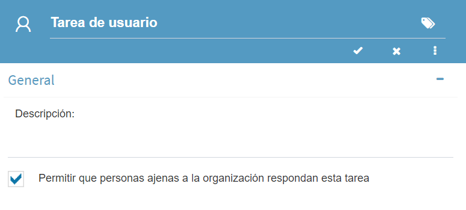
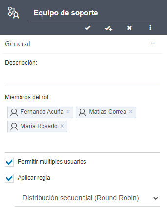
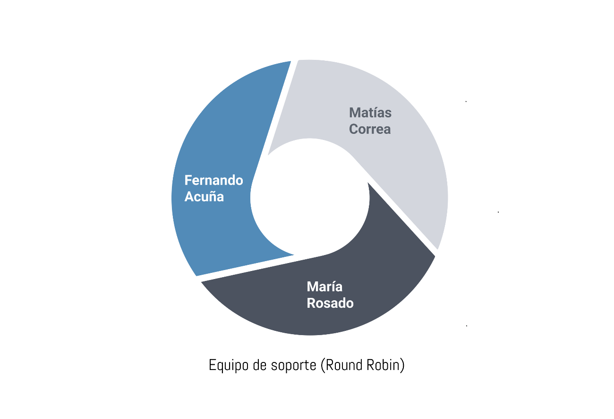
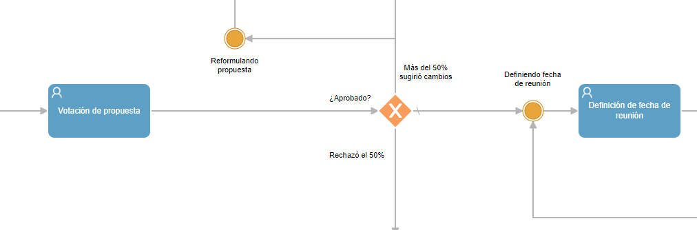
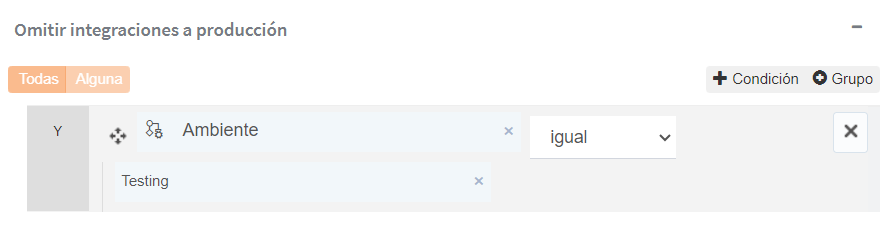

  v5.4 — Qflow Cloud          

*   [Qflow](https://qflowbpm.com/es/)
*   [Foro](https://forum.qflowbpm.com/)
*   [Centro de Ayuda](https://qflowbpm.com/es/centro-de-ayuda/)
*   [Contáctanos](https://qflowbpm.com/es/contacto/)

[Qflow](index.md)

Cloud (latest) 5.5 OnPremise (latest) 5.2 OnPremise 5.1.1 OnPremise

English Español

selectElement('versionSelect', getVersion()); selectElement('languageSelect', getLanguage()); function selectElement(id, valueToSelect) { let element = document.getElementById(id); element.value = valueToSelect; } function getLanguage() { if (window.location.href.includes('/es/')) { return '/es/'; } else { return '/en/'; } } function getVersion() { if (window.location.href.includes('/qflowcloud/')) { return '/qflowcloud/'; } else if (window.location.href.includes('/qflow5\_1\_1/')) { return '/qflow5\_1\_1/'; } else if (window.location.href.includes('/qflow5\_2/')) { return '/qflow5\_2/'; } else { return '/qflow5\_5/'; } } function redirectToSite(url) { var http = new XMLHttpRequest(); http.onreadystatechange = function() { if (http.readyState === 4) { if (http.status !== 404) { window.location.href = url; } else { window.location.href = url.replace(url.substr(url.lastIndexOf('/') + 1), 'index.md'); } } } http.open('HEAD', url, true); http.send(); }

  

Inicio

*   [Novedades](29-ReleaseNote.md)
    *   [v6.0](29.13-ReleaseNote6_0.md)
    *   [v5.6.2](29.12-ReleaseNote5_6_2.md)
    *   [v5.6.1](29.11-ReleaseNote5_6_1.md)
    *   [v5.6](29.10-ReleaseNote5_6.md)
    *   [v5.5.4](29.9-ReleaseNote5_5_4.md)
    *   [v5.5.3](29.8-ReleaseNote5_5_3.md)
    *   [v5.5.1](29.7-ReleaseNote5_5_1.md)
    *   [v5.5](29.6-ReleaseNote5_5.md)
    *   [v5.4](#)
        *   [Resumen de características](#resumen-de-caracteristicas)
        *   [Corrección de errores y mejoras](#correccion-de-errores-y-mejoras)
    *   [v5.3](29.4-ReleaseNote5_3.md)
    *   [v5.2](29.3-ReleaseNote5_2.md)
    *   [v5.1.2](29.2-ReleaseNote5_1_2.md)
    *   [v5.1.1](29.1-ReleaseNote5_1_1.md)
    *   [v5.1](29.1-ReleaseNote5_1_Cloud.md)
*   [Introducción a Qflow](01-QflowIntroduction.md)
*   [Tutoriales](TutorialsIndex.md)
*   [Qflow Task](04-QflowTask.md)
*   [Qflow Design](15-QflowDesign.md)
*   [Qflow Team](18-QflowTeam.md)
*   [Qflow Admin](19-QflowAdmin.md)
*   [Consumo de Q-points](21-Q-pointsConsumption.md)
*   [Conectores](34-ConnectorsIndex.md)
*   [Desarrolladores](31-Development.md)

[Qflow](index.md)

*   
*   [Novedades](29-ReleaseNote.md)
*   v5.4

- - -

# v5.4[](#v5-4 "Link to this heading")

## Resumen de características[](#resumen-de-caracteristicas "Link to this heading")

La versión 5.4 de Qflow trae consigo una serie de mejoras significativas para potenciar la asignación de tareas y flexibilizar el diseño de procesos. Con la incorporación de la posibilidad de que usuarios externos a tu organización respondan a tareas y la optimización de las reglas de asignación automática, esta versión consolida la plataforma como una herramienta versátil y adaptable a distintos contextos.

### Respuesta de tarea por usuarios externos[](#respuesta-de-tarea-por-usuarios-externos "Link to this heading")

En esta versión, Qflow permite la respuesta de tareas por parte de usuarios externos, es decir, aquellos que no son usuarios del sistema. Estos destinatarios recibirán acceso a la tarea a través de correo electrónico. Esta funcionalidad resulta útil en diversos escenarios, como solicitar información adicional en procesos iniciados por usuarios externos o incorporar actores ajenos al sistema en flujos de trabajo.

Figura 38 Configuración de respuesta externa en tarea de usuario[](#id2 "Link to this image")

Las tareas pueden asignarse simultáneamente a usuarios del sistema y a usuarios externos. Tras la respuesta de la tarea por un usuario externo, la auditoría identificará claramente que la tarea fue respondida por un invitado, mostrando como identificación el correo electrónico del participante. El correo electrónico de los usuarios externos se puede obtener de datos del proceso, parámetros de aplicación o de un texto definido.

Figura 39 Parámetros, datos y direcciones de correo como destinatarios externos[](#id3 "Link to this image")

Figura 40 Auditoría de tarea con destinatarios externos[](#id4 "Link to this image")

Para contemplar esta nueva funcionalidad se hizo un ajuste al cálculo de los Q-points, cuyo detalle puedes consultar en [nuestra documentación](21-Q-pointsConsumption.md). Para obtener más información sobre la respuesta de tarea por usuarios externos, accede a la sección de [configuración de tarea de usuario](15-QflowDesign.md#tarea-de-usuario).

### Mensaje de confirmación en tareas[](#mensaje-de-confirmacion-en-tareas "Link to this heading")

Ahora es posible configurar mensajes de confirmación personalizados para cada tarea. Estos mensajes, que pueden ser formados dinámicamente utilizando datos del proceso, se mostrarán al usuario una vez que complete exitosamente el formulario de la tarea. Esta función ofrece una oportunidad para personalizar aún más la experiencia del usuario durante la interacción con las tareas. Este mensaje se muestra para la respuesta de tareas por usuarios de sistema y usuarios externos.

Figura 41 Mensaje de confirmación de respuesta[](#id5 "Link to this image")

Junto con este cambio, los mensajes de confirmación de inicio de proceso, incluidos en la versión anterior, ahora se muestran también para los usuarios de sistema, y no solo para los usuarios iniciadores anónimos.

### Nueva regla de asignación automática: Distribución equitativa (Round Robin)[](#nueva-regla-de-asignacion-automatica-distribucion-equitativa-round-robin "Link to this heading")

La nueva regla de asignación automática, denominada “Distribución equitativa (Round Robin)”, introduce un método para asignar cada tarea asociada a un rol a usuarios distintos dentro de ese rol. Esto fomenta una distribución equitativa de las responsabilidades, llevada a cabo de manera secuencial y cíclica.

Figura 42 Rol de equipo de soporte con distribución secuencial[](#id6 "Link to this image")

Para ilustrar su funcionamiento, consideremos el siguiente escenario: supongamos un rol llamado “Equipo de soporte”, compuesto por tres miembros: Fernando Acuña, Matías Correa y María Rosado. Este rol está designado como destinatario de la tarea “Resolver Incidente” dentro del proceso de “Gestión de Incidentes”. Cuando se crea una tarea de “Resolver Incidente”, se asigna a uno de los miembros, por ejemplo, a Fernando Acuña. Al crearse otra tarea de ‘Resolver incidente’, y dado que Fernando Acuña ya ha sido asignado previamente, esta se asignará a otro usuario del rol, como, por ejemplo, Matías Correa. Este ciclo continúa asignando las tareas secuencialmente a cada miembro del equipo, garantizando una distribución equitativa de las responsabilidades. Una vez que todos los miembros del rol han sido asignados, comienza un nuevo ciclo, asignando nuevamente a cada miembro en el mismo orden.

Figura 43 Diagrama de Round Robin del equipo de soporte[](#id7 "Link to this image")

### Nueva plantilla: Votación de junta directiva[](#nueva-plantilla-votacion-de-junta-directiva "Link to this heading")

Esta nueva plantilla, lista para utilizar y completamente personalizable, ofrece un enfoque ágil y eficiente para la toma de decisiones en entornos colaborativos de juntas directivas. Diseñada para evaluar y votar propuestas de forma remota, permite la aprobación automática en caso de consenso unánime. En situaciones donde sea necesario, brinda la opción de solicitar modificaciones a la propuesta o de continuar la discusión en una reunión presencial. Además, garantiza informar al solicitante sobre el resultado final de la propuesta. Puedes acceder a nuestra sección de plantillas precreadas en [nuestra documentación](15-QflowDesign.md#plantillas-pre-creadas).

Figura 44 Fragmento de plantilla de votación de directivos[](#id8 "Link to this image")

### Parámetros de aplicación de tipo texto en condiciones de compuertas[](#parametros-de-aplicacion-de-tipo-texto-en-condiciones-de-compuertas "Link to this heading")

Se potencian las condiciones de las compuertas al permitir la utilización de parámetros de aplicación de tipo texto en sus condiciones. Esto posibilita dirigir el flujo del proceso basándose en el valor de un parámetro específico. Por ejemplo, se puede comparar el valor del parámetro “Ambiente” para omitir la ejecución de ciertas integraciones si su valor es “Testing”.

Figura 45 Parámetro de aplicación usado como elemento de condición[](#id9 "Link to this image")

## Corrección de errores y mejoras[](#correccion-de-errores-y-mejoras "Link to this heading")

### Qflow Task[](#qflow-task "Link to this heading")

*   Se añade una opción para ocultar el mensaje que indica que se responderán las tareas en segundo plano al responder una tarea utilizando la función de [«Respuesta rápida»](04-QflowTask.md#respuesta-rapida).
    
*   Se corrige el formato en que se muestra la fecha de lectura de una alerta o notificación en la pestaña de seguimiento de procesos en la auditoría de acciones. Ahora, se puede visualizar con la zona horaria del usuario en lugar de UTC.
    
*   Se implementan mejoras de estilo para manejar etiquetas extensas en los datos de aplicaciones y roles.
    
*   Se corrige el estilo de visualización del mensaje de error cuando no es posible retroceder un paso, mejorando su apariencia.
    
*   Se resuelve un error que impedía la ejecución de vistas que tenían un filtro personalizado basado en el estado de una etapa del proceso.
    
*   Se soluciona el error que, al delegar una tarea, no permitía delegar los roles de todos los destinatarios al nuevo usuario al que se le está delegando la tarea.
    

### Qflow Design[](#qflow-design "Link to this heading")

*   Ahora es posible incluir información del proceso (ID del proceso, ID correlativo, nombre, descripción, fecha de inicio, entre otros), en el mensaje de confirmación de inicio de proceso.
    
*   Se soluciona un error que impedía eliminar una plantilla de proceso en ciertas condiciones.
    
*   Se corrige un error que no permitía visualizar correctamente las condiciones de una compuerta en ciertas resoluciones, cuando había una gran cantidad de opciones definidas.
    
*   Se corrige un error al crear una clave de respuesta de tarea en base al nombre si este contiene únicamente caracteres especiales.
    
*   Se corrige que la búsqueda avanzada siempre devolvía, además de los resultados correspondientes, el paquete que estaba seleccionado actualmente.
    

### Web Services [](#web-services-technical-icon "Link to this heading")

*   Se corrigen los métodos CompleteJob y UpdateJob para permitir la adición de comentarios al proceso mediante bots.
    

### Cambio en interfaz de scripting [](#cambio-en-interfaz-de-scripting-technical-icon "Link to this heading")

Se agregaron dos nuevas operaciones a la interfaz de scripting:

*   ResolveAddresseesWithInfo(templateStepId): Dado el identificador de una tarea de la plantilla de proceso, devuelve un arreglo con la información básica de los usuarios a quienes está dirigido ese paso, incluyendo tanto usuarios externos como usuarios que pertenecen a un rol.
    
*   ResolveAddresseesWithInfo(templateStepName): Dado el nombre de una tarea de la plantilla de proceso, devuelve un arreglo con la información básica de los usuarios a quienes está dirigido ese paso, incluyendo tanto usuarios externos como usuarios que pertenecen a un rol.
    

[Anterior](29.6-ReleaseNote5_5.md "v5.5") [Siguiente](29.4-ReleaseNote5_3.md "v5.3")

- - -

© Derechos de autor 2025, Urudata Software.

jQuery(function () { SphinxRtdTheme.Navigation.enable(true); }); window.dataLayer = window.dataLayer || \[\]; function gtag(){dataLayer.push(arguments);} gtag('js', new Date()); gtag('config', 'G-LMDS8S4B42', { 'anonymize\_ip': false, });