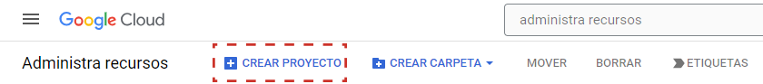
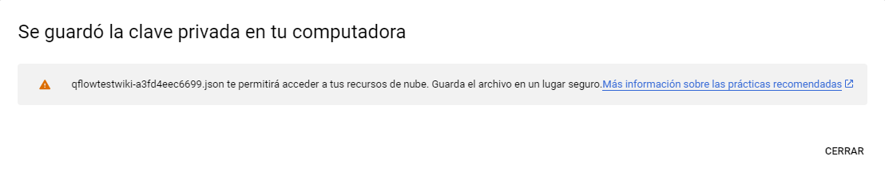
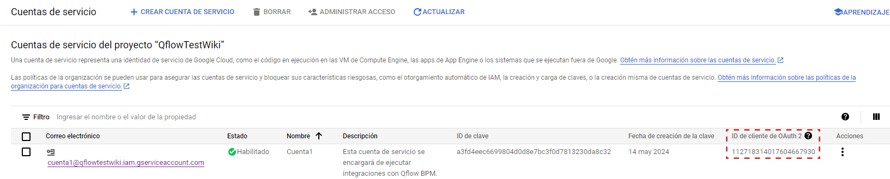
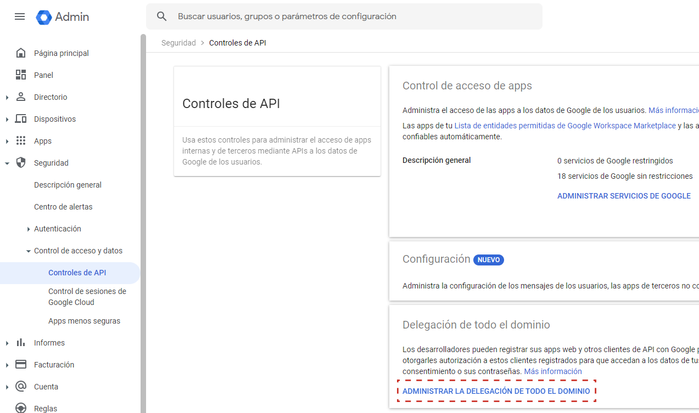
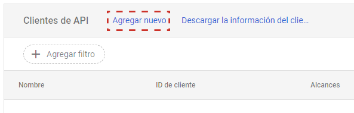
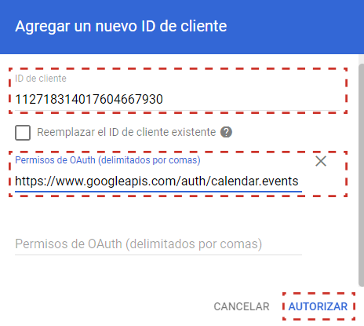
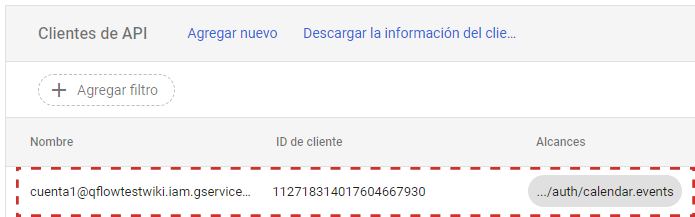

  Google Calendar — Qflow Cloud          

*   [Qflow](https://qflowbpm.com/es/)
*   [Foro](https://forum.qflowbpm.com/)
*   [Centro de Ayuda](https://qflowbpm.com/es/centro-de-ayuda/)
*   [Contáctanos](https://qflowbpm.com/es/contacto/)

[Qflow](index.md)

Cloud (latest) 5.5 OnPremise (latest) 5.2 OnPremise 5.1.1 OnPremise

English Español

selectElement('versionSelect', getVersion()); selectElement('languageSelect', getLanguage()); function selectElement(id, valueToSelect) { let element = document.getElementById(id); element.value = valueToSelect; } function getLanguage() { if (window.location.href.includes('/es/')) { return '/es/'; } else { return '/en/'; } } function getVersion() { if (window.location.href.includes('/qflowcloud/')) { return '/qflowcloud/'; } else if (window.location.href.includes('/qflow5\_1\_1/')) { return '/qflow5\_1\_1/'; } else if (window.location.href.includes('/qflow5\_2/')) { return '/qflow5\_2/'; } else { return '/qflow5\_5/'; } } function redirectToSite(url) { var http = new XMLHttpRequest(); http.onreadystatechange = function() { if (http.readyState === 4) { if (http.status !== 404) { window.location.href = url; } else { window.location.href = url.replace(url.substr(url.lastIndexOf('/') + 1), 'index.md'); } } } http.open('HEAD', url, true); http.send(); }

  

Inicio

*   [Novedades](29-ReleaseNote.md)
*   [Introducción a Qflow](01-QflowIntroduction.md)
*   [Tutoriales](TutorialsIndex.md)
*   [Qflow Task](04-QflowTask.md)
*   [Qflow Design](15-QflowDesign.md)
*   [Qflow Team](18-QflowTeam.md)
*   [Qflow Admin](19-QflowAdmin.md)
*   [Consumo de Q-points](21-Q-pointsConsumption.md)
*   [Conectores](34-ConnectorsIndex.md)
    *   [Configuración de Conectores desde una Tarea de Servicio](35-ConnectorParameterConfig.md)
    *   [Microsoft Teams](36.1-MicrosoftTeamsConnector.md)
    *   [Outlook](36.2-OutlookConnector.md)
    *   [Slack](36.3-SlackConnector.md)
    *   [Trello](36.4-TrelloConnector.md)
    *   [OpenAI](36.5-OpenAIConnector.md)
    *   [Jira Cloud](36.6-JiraCloudConnector.md)
    *   [Redmine](36.7-RedmineConnector.md)
    *   [DocuSign](36.8-DocuSignConnector.md)
    *   [Google Calendar](#)
        *   [Introducción](#introduccion)
        *   [Prerrequisitos](#prerrequisitos)
        *   [Parámetro de aplicación](#parametro-de-aplicacion)
        *   [Acciones](#id1)
    *   [Dropbox](36.11-DropboxConnector.md)
    *   [OneDrive](36.12-OneDriveConnector.md)
    *   [WhatsApp](36.13-WhatsAppTwilioConnector.md)
    *   [Microsoft Word](36.14-MicrosoftWordConnector.md)
    *   [ILovePDF](36.15-ILovePDFConnector.md)
*   [Desarrolladores](31-Development.md)

[Qflow](index.md)

*   
*   [Conectores](34-ConnectorsIndex.md)
*   Google Calendar

- - -

# Google Calendar[](#google-calendar "Link to this heading")

## Introducción[](#introduccion "Link to this heading")

El propósito de este manual es detallar cómo configurar e integrar Qflow con Google Calendar para permitir la interacción entre ambas plataformas, permitiendo crear, actualizar y eliminar eventos.

Google calendar cuenta con las siguientes acciones:

*   [Crear evento](#id2)
    
*   [Actualizar evento](#id3)
    
*   [Eliminar evento](#id4)
    

Ver [Acciones](36.9-GoogleCalendarConnector.md#id1) para conocer la descripción y contenido de cada una.

## Prerrequisitos[](#prerrequisitos "Link to this heading")

Es necesario contar con una cuenta de Google y un espacio de trabajo creado en la plataforma. Esto puede hacerse [desde aquí](https://cloud.google.com/cloud-console).

Además, es necesario contar con una cuenta de Google Workspace y tener habilitada la Delegación en todo el dominio. Esto puede habilitarse en su [consola de Administración](https://admin.google.com/).

## Parámetro de aplicación[](#parametro-de-aplicacion "Link to this heading")

Para entablar la conexión es necesario contar con al menos un **parámetro de aplicación** (ver [Parámetros de aplicación](15-QflowDesign.md#parametros-de-aplicacion)) que permita establecer la comunicación entre Qflow y Google Calendar. Este parámetro puede ser creado desde la configuración de la tarea de servicio en Qflow. (ver [Configuración de Conectores desde una Tarea de Servicio](35-ConnectorParameterConfig.md))

Para crear un parámetro de aplicación de Google Calendar, se requieren los siguientes pasos que se detallan a continuación.

### Parámetro de aplicación utilizando Delegación en todo el Dominio[](#parametro-de-aplicacion-utilizando-delegacion-en-todo-el-dominio "Link to this heading")

Este tipo de parámetro de aplicación requiere los siguientes parámetros:

*   **Email de usuario**
    
*   **Id de proyecto**
    
*   **Id de clave privada**
    
*   **Clave privada**
    
*   **Email cliente**
    
*   **Id cliente**
    

Para obtenerlos, se deben seguir los siguientes pasos:

1.  Acceder al [Manejador de recursos](https://console.cloud.google.com/cloud-resource-manager). Aquí crearemos un nuevo proyecto seleccionando CREAR PROYECTO.
    
    
    
    Figura 843 Botón CREAR PROYECTO en el manejador de recursos de Google Cloud[](#id5 "Link to this image")
    
2.  Escribir el nombre del proyecto y seleccionar la Ubicación al que pertenecerá, luego seleccionar CREAR. En el ejemplo de la imagen a continuación, se muestra que la aplicación se llama QflowTestWiki y no pertenece a alguna organización.
    
    
    
    Figura 844 Vista de creación de proyecto en Google Cloud[](#id6 "Link to this image")
    
3.  Seleccionar en el combobox superior nuestro nuevo proyecto.
    
    
    
    Figura 845 Vista de selección de proyecto en Google Cloud[](#id7 "Link to this image")
    
4.  En la barra superior buscamos Google Calendar API, entramos y posteriormente clicamos en HABILITAR para habilitar dicha API en nuestro proyecto.
    
    
    
    Figura 846 Botón para habilitar Google Calendar API en nuestro proyecto de Google Cloud[](#id8 "Link to this image")
    
5.  En la barra superior buscamos Cuentas de servicio y procederemos a crear una cuenta de servicio, encargada de la ejecución de nuestras interacciones. Para esto seleccionamos CREAR CUENTA DE SERVICIO.
    
    
    
    Figura 847 Opción para crear una cuenta de servicio en Google Cloud[](#id9 "Link to this image")
    
6.  Aquí deberemos completar ID de la cuenta de servicio. Recomendamos además completar Nombre de la cuenta de servicio y la Descripción de la cuenta de servicio como se muestra en la imagen siguiente.
    
    
    
    Figura 848 Campos de cuenta de servicio en Google Cloud[](#id10 "Link to this image")
    
7.  Volver a la vista de Service Accounts, seleccionar la cuenta de servicio creada y en la sección de Acciones seleccionamos Adminsitrar claves.
    
    
    
    Figura 849 Opción de Manage Keys para cuenta de servicio en Google Cloud[](#id11 "Link to this image")
    
8.  En esta nueva ventana vamos a seleccionar la opción Crear clave nueva dentro del combobox de AGREGAR CLAVE.
    
    
    
    Figura 850 Opción de creación de nueva clave para cuenta de servicio en Google Cloud[](#id12 "Link to this image")
    
9.  Aquí seleccionamos la opción de JSON y procedemos a crear la clave. Automáticamente se descargará un archivo JSON con la clave privada generada.
    
    
    
    Figura 851 Selección de tipo de clave privada[](#id13 "Link to this image")
    
    
    
    Figura 852 Mensaje de descarga de clave generada en Google Cloud[](#id14 "Link to this image")
    
10.  Debemos anotarnos el ID de cliente de OAuth 2 que se encuentra en la vista de service accounts como identifica la siguiente imagen:
    
    
    
    Figura 853 ID de cliente de OAuth 2 de cuenta de servicio en Google Cloud[](#id15 "Link to this image")
    
11.  Ahora pasaremos a brindarle a nuestra cuenta de servicio los permisos necesarios para su correcto funcionamiento, dentro de nuestra consola de administrador de Google Workspace. Para esto vamos a Controles de API y seleccionamos ADMINISTRAR LA DELEGACIÓN DE TODO EL DOMINIO.
    
    
    
    Figura 854 Opción para configurar delegación en todo el dominio en Google Workspace[](#id16 "Link to this image")
    
12.  Aquí seleccionamos Agregar nuevo para agregar un nuevo cliente en nuestra configuración de delegación en todo el dominio.
    
    
    
    Figura 855 Botón para agregar nuevo cliente en configuración de delegación en todo el dominio[](#id17 "Link to this image")
    
13.  Procedemos a rellenar los campos ID de cliente y Permisos de OAuth con el client ID asociado a la cuenta de servicio que creamos anteriormente y en Permisos de OAuth agregamos únicamente https://www.googleapis.com/auth/calendar.events.
    
    
    
    Figura 856 Rellenado de campos de cuenta de servicio para autorizar permisos en dominio[](#id18 "Link to this image")
    
14.  Finalmente, en el listado de Clientes de API deberemos ver nuestro nuevo cliente agregado con el permiso anterior en su listado.
    
    
    
    Figura 857 Nueva cuenta de servicio en listado de Clientes de API[](#id19 "Link to this image")
    

Una vez completados los pasos anteriores, será posible crear, actualizar y eliminar eventos en Google Calendar desde Qflow.

## Acciones[](#id1 "Link to this heading")

Se pueden realizar las siguientes acciones con Google Calendar:

### Crear evento[](#id2 "Link to this heading")

Esta acción permite generar un nuevo evento sobre el calendario de Google seleccionado. Se debe proporcionar una fecha y hora de inicio y fin y además un email asociado al organizador del evento. Opcionalmente, se pueden agregar título, descripción, ubicación, lista de invitados y id de calendario. Además permite generar en conjunto del evento un Google Meet asociado al mismo y se permite marcar si cualquier usuario se puede autoagregar al evento.

|     |     |
| --- | --- |Tabla 40 Entradas[](#id20 "Link to this table")  
| Entrada | Descripción |
| Email del Organizador | **Requerido.** Email que aparecerá como el organizador del evento. |
| Fecha de inicio | **Requerido.** Fecha y hora de inicio del evento. |
| Fecha de fin | **Requerido.** Fecha y hora de fin del evento. |
| Título | Título del evento. |
| Descripción | Descripción del evento. |
| Ubicación | Ubicación del evento. |
| Generar meet con evento | Permite generar una Google Meet asociado al evento. |
| Cualquier usuario puede autoagregarse | Permite establecer si cualquier usuario puede autoagregarse al evento. |
| Lista de invitados | Lista de mails asociados a los invitados del evento. |
| Id de calendario | Id específico del calendario en el cual se creará el evento. |

|     |     |
| --- | --- |Tabla 41 Salidas[](#id21 "Link to this table")  
| Salida | Descripción |
| Id del evento | Id generado por Google, asociado al evento. |

### Actualizar evento[](#id3 "Link to this heading")

Esta acción permite actualizar un evento ya existente sobre el calendario de Google seleccionado. Se debe proporcionar una fecha y hora de inicio y fin, un email asociado al organizador del evento y el id del evento a actualizar. Opcionalmente, se pueden agregar título, descripción, ubicación, lista de invitados y id de calendario. Además, permite generar, mantener o eliminar una Google Meet asociada al evento en caso que exista y se permite seleccionar si cualquier usuario puede o no autoagregarse al evento.

|     |     |
| --- | --- |Tabla 42 Entradas[](#id22 "Link to this table")  
| Entrada | Descripción |
| Email del organizador del evento | **Requerido.** Email que aparecerá como el organizador del evento. |
| Fecha de inicio | **Requerido.** Fecha y hora de inicio del evento. |
| Fecha de fin | **Requerido.** Fecha y hora de fin del evento. |
| Id del evento | **Requerido.** Id del evento a modificar. |
| Título | Título del evento. |
| Descripción | Descripción del evento. |
| Ubicación | Ubicación del evento. |
| Generar meet con evento | Permite generar una Google Meet asociado al evento. |
| Cualquier usuario puede autoagregarse | Permite establecer si cualquier usuario puede autoagregarse al evento. |
| Lista de invitados | Lista de mails asociados a los invitados del evento. |
| Id de calendario | Id específico del calendario en el cual se modificará el evento. |

|     |     |
| --- | --- |Tabla 43 Salidas[](#id23 "Link to this table")  
| Salida | Descripción |
| Id del evento | Id del evento actualizado. |

### Eliminar evento[](#id4 "Link to this heading")

Esta acción permite eliminar un evento del calendario de Google seleccionado. Se debe proporcionar un email asociado al organizador del evento y el id del evento a eliminar. Opcionalmente, se pueden especificar el id del calendario al cual pertenece el evento a eliminar.

|     |     |
| --- | --- |Tabla 44 Entradas[](#id24 "Link to this table")  
| Entrada | Descripción |
| Email del organizador del evento | **Requerido.** Email del Organizador del evento |
| Id del evento | **Requerido.** Id del evento a eliminar. |
| Id de calendario | Id específico del calendario en el cual se eliminará el evento. |

[Anterior](36.8-DocuSignConnector.md "DocuSign") [Siguiente](36.11-DropboxConnector.md "Dropbox")

- - -

© Derechos de autor 2025, Urudata Software.

jQuery(function () { SphinxRtdTheme.Navigation.enable(true); }); window.dataLayer = window.dataLayer || \[\]; function gtag(){dataLayer.push(arguments);} gtag('js', new Date()); gtag('config', 'G-LMDS8S4B42', { 'anonymize\_ip': false, });
